# 上下文构建

<cite>
**本文引用的文件**
- [context_assembly/mod.rs](file://agent-diva-agent/src/context_assembly/mod.rs)
- [context_assembly/budget.rs](file://agent-diva-agent/src/context_assembly/budget.rs)
- [context_assembly/section_cache.rs](file://agent-diva-agent/src/context_assembly/section_cache.rs)
- [context_assembly/cache_observe.rs](file://agent-diva-agent/src/context_assembly/cache_observe.rs)
- [context.rs](file://agent-diva-agent/src/context.rs)
- [context_budget.rs](file://agent-diva-agent/src/context_budget.rs)
- [compaction/prompt.rs](file://agent-diva-agent/src/compaction/prompt.rs)
- [tool_assembly.rs](file://agent-diva-agent/src/tool_assembly.rs)
- [workspace_instructions.rs](file://agent-diva-agent/src/workspace_instructions.rs)
- [mask/mask_prompt_composer.rs](file://agent-diva-agent/src/mask/mask_prompt_composer.rs)
</cite>

## 目录
1. [简介](#简介)
2. [项目结构](#项目结构)
3. [核心组件](#核心组件)
4. [架构总览](#架构总览)
5. [详细组件分析](#详细组件分析)
6. [依赖关系分析](#依赖关系分析)
7. [性能考量](#性能考量)
8. [故障排查指南](#故障排查指南)
9. [结论](#结论)
10. [附录](#附录)

## 简介
本文件聚焦“上下文构建阶段”的完整实现与工作机制，说明如何为 LLM 调用准备完整的上下文信息：工作区内容、记忆片段、工具描述、系统提示词等的组装过程；并详细说明上下文预算管理机制、缓存策略，以及不同场景下的上下文优化方法（压缩、去重、优先级排序等）。文档同时提供代码级流程图与架构图，帮助读者快速理解从稳定前缀到动态后缀的端到端流程。

## 项目结构
上下文构建由多个模块协作完成：
- 上下文装配契约与序列化：定义稳定的逻辑段顺序、稳定性分类、渲染与序列化规则。
- 预算与选择：基于层和区域的软/硬限制，决定哪些片段保留、压缩或丢弃。
- 会话稳定前缀缓存：按会话维度缓存稳定前缀，支持细粒度失效与版本化。
- 缓存观测：跟踪最终线提示缓存命中、结构性变更与使用指标。
- 上下文构建器：组合面具、冻结核心、规则与技能、记忆策略与索引、历史、检查点、元数据等，输出消息序列。
- 预算配置与检查：历史与检查点的预算阈值判断，触发压缩。
- 工具装配：将工具定义分为核心与延迟两部分，影响上下文中的工具 schema 数量与位置。
- 工作区指令加载：读取 AGENTS.md，带截断与安全声明注入。
- 面具提示合成：非默认面具可注入额外系统提示。

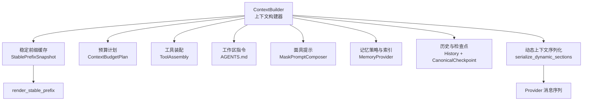

**图表来源**
- [context.rs:149-249](file://agent-diva-agent/src/context.rs#L149-L249)
- [context_assembly/mod.rs:174-229](file://agent-diva-agent/src/context_assembly/mod.rs#L174-L229)
- [context_assembly/budget.rs:119-193](file://agent-diva-agent/src/context_assembly/budget.rs#L119-L193)
- [tool_assembly.rs:240-616](file://agent-diva-agent/src/tool_assembly.rs#L240-L616)
- [workspace_instructions.rs:49-86](file://agent-diva-agent/src/workspace_instructions.rs#L49-L86)
- [mask/mask_prompt_composer.rs:12-33](file://agent-diva-agent/src/mask/mask_prompt_composer.rs#L12-L33)

**章节来源**
- [context.rs:149-249](file://agent-diva-agent/src/context.rs#L149-L249)
- [context_assembly/mod.rs:174-229](file://agent-diva-agent/src/context_assembly/mod.rs#L174-L229)
- [context_assembly/budget.rs:119-193](file://agent-diva-agent/src/context_assembly/budget.rs#L119-L193)
- [tool_assembly.rs:240-616](file://agent-diva-agent/src/tool_assembly.rs#L240-L616)
- [workspace_instructions.rs:49-86](file://agent-diva-agent/src/workspace_instructions.rs#L49-L86)
- [mask/mask_prompt_composer.rs:12-33](file://agent-diva-agent/src/mask/mask_prompt_composer.rs#L12-L33)

## 核心组件
- 上下文段与稳定性：将上下文划分为固定顺序的逻辑段，并标注稳定性（会话稳定/轮次可变），用于区分稳定前缀与动态后缀。
- 预算计划：将总上下文窗口拆分为稳定前缀、规范检查点、活跃尾部三个区域，并为每个层设定软/硬限制。
- 选择算法：在预算压力下，优先保留关键段（如会话检查点、当前用户），对可选段执行丢弃或压缩。
- 稳定前缀缓存：按会话缓存已渲染的稳定前缀，支持细粒度失效（面具变化、记忆热更新、规则/技能重载、会话重置）与版本递增。
- 缓存观测：记录每次调用的最终线缓存快照、结构性变更原因与用量，辅助诊断缓存命中率与异常。
- 上下文构建器：负责组装系统提示、历史、检查点、动态上下文与当前用户消息，生成最终消息列表。
- 预算检查：基于历史与检查点估算 token，决定是否触发压缩。
- 工具装配：将工具 schema 分为核心与延迟两类，控制其在上下文中的可见性与大小。
- 工作区指令与面具：注入项目规则与角色面具，增强系统提示的可控性。

**章节来源**
- [context_assembly/mod.rs:26-115](file://agent-diva-agent/src/context_assembly/mod.rs#L26-L115)
- [context_assembly/budget.rs:13-117](file://agent-diva-agent/src/context_assembly/budget.rs#L13-L117)
- [context_assembly/section_cache.rs:6-57](file://agent-diva-agent/src/context_assembly/section_cache.rs#L6-L57)
- [context_assembly/cache_observe.rs:10-66](file://agent-diva-agent/src/context_assembly/cache_observe.rs#L10-L66)
- [context.rs:53-157](file://agent-diva-agent/src/context.rs#L53-L157)
- [context_budget.rs:25-112](file://agent-diva-agent/src/context_budget.rs#L25-L112)
- [tool_assembly.rs:240-616](file://agent-diva-agent/src/tool_assembly.rs#L240-L616)
- [workspace_instructions.rs:49-86](file://agent-diva-agent/src/workspace_instructions.rs#L49-L86)
- [mask/mask_prompt_composer.rs:12-33](file://agent-diva-agent/src/mask/mask_prompt_composer.rs#L12-L33)

## 架构总览
上下文构建的核心路径如下：
1. 构建稳定前缀：按固定顺序合并面具身份、冻结核心、规则与技能、记忆策略与索引，渲染为系统消息。
2. 插入规范检查点：若存在压缩后的检查点，则作为独立系统消息插入。
3. 附加历史消息：将历史转换为 provider 消息格式，恢复工具调用与推理块。
4. 追加动态上下文：将时间、渠道等易变元数据以信封形式注入。
5. 追加当前用户消息：最后一句为用户输入。
6. 预算与选择：根据预算计划对动态段进行筛选、压缩或丢弃，保证不超出总限制。
7. 工具 schema 管理：核心工具 schema 置于稳定前缀附近，延迟工具按需激活，减少上下文体积。

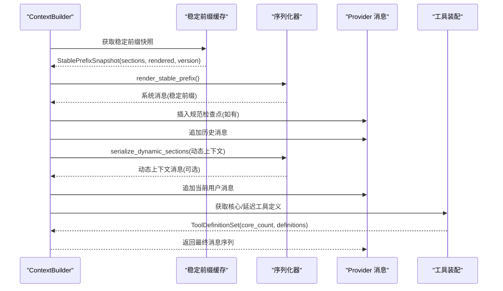

**图表来源**
- [context.rs:570-663](file://agent-diva-agent/src/context.rs#L570-L663)
- [context_assembly/mod.rs:174-229](file://agent-diva-agent/src/context_assembly/mod.rs#L174-L229)
- [tool_assembly.rs:240-616](file://agent-diva-agent/src/tool_assembly.rs#L240-L616)

## 详细组件分析

### 上下文段与稳定性
- 逻辑段顺序：面具与身份、冻结核心、规则与技能、记忆策略与索引、压缩摘要、历史、会话检查点、预取回忆、易变元数据、计划守卫、当前用户。
- 稳定性分类：前四个段为会话稳定，其余为轮次可变；稳定段可参与 prompt 缓存前缀。
- 序列化约束：稳定前缀必须仅包含稳定段；动态后缀必须仅包含可变段，否则抛出装配错误。

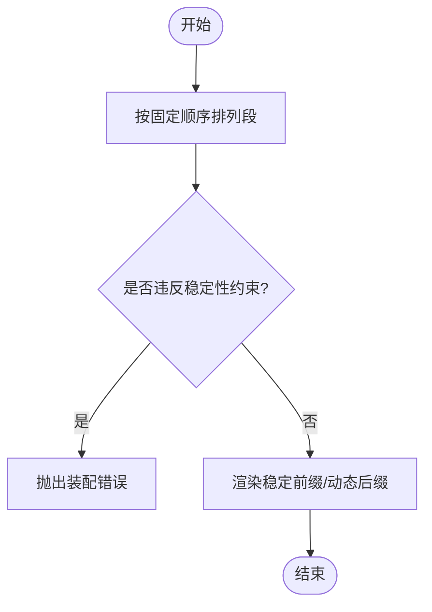

**图表来源**
- [context_assembly/mod.rs:38-115](file://agent-diva-agent/src/context_assembly/mod.rs#L38-L115)
- [context_assembly/mod.rs:174-229](file://agent-diva-agent/src/context_assembly/mod.rs#L174-L229)

**章节来源**
- [context_assembly/mod.rs:38-115](file://agent-diva-agent/src/context_assembly/mod.rs#L38-L115)
- [context_assembly/mod.rs:174-229](file://agent-diva-agent/src/context_assembly/mod.rs#L174-L229)

### 预算管理与选择
- 三层预算：稳定前缀、规范检查点、活跃尾部；每层有软/硬限制。
- 层预算：冻结核心与规则、核心工具 schema、延迟工具 schema、L1 索引、会话检查点、预取回忆、压缩摘要、历史、工具结果内联、当前轮次。
- 选择策略：在预算压力下，优先保留会话检查点与当前用户；预取回忆首先被丢弃；历史与压缩摘要可压缩。
- 报告：记录选中、丢弃、压缩的片段及原因（层软限、总硬限、宏压缩、微压缩）。

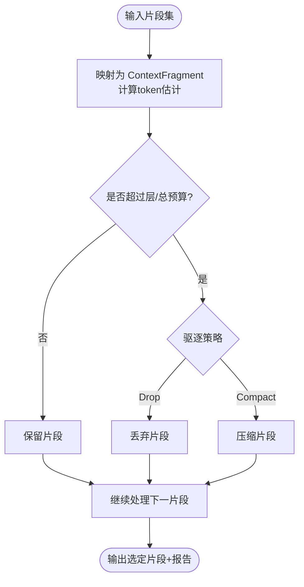

**图表来源**
- [context_assembly/budget.rs:119-193](file://agent-diva-agent/src/context_assembly/budget.rs#L119-L193)
- [context_assembly/budget.rs:230-285](file://agent-diva-agent/src/context_assembly/budget.rs#L230-L285)
- [context_assembly/budget.rs:373-415](file://agent-diva-agent/src/context_assembly/budget.rs#L373-L415)

**章节来源**
- [context_assembly/budget.rs:13-117](file://agent-diva-agent/src/context_assembly/budget.rs#L13-L117)
- [context_assembly/budget.rs:230-285](file://agent-diva-agent/src/context_assembly/budget.rs#L230-L285)
- [context_assembly/budget.rs:373-415](file://agent-diva-agent/src/context_assembly/budget.rs#L373-L415)

### 稳定前缀缓存与失效
- 缓存键：会话键；存储各段的 PromptSection、渲染文本、面具、记忆修订号、技能 epoch、前缀版本号。
- 失效条件：面具变化、记忆热更新、规则/技能重载、会话重置；每次重建递增版本号。
- 快照：提供 sections、rendered、prefix_version，便于上层观察与日志。

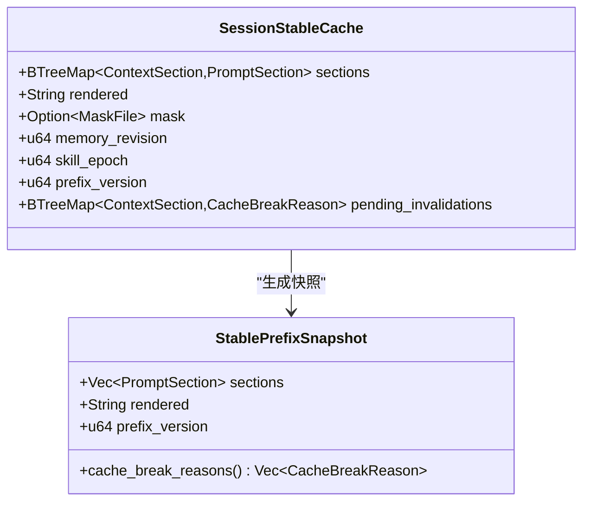

**图表来源**
- [context.rs:38-51](file://agent-diva-agent/src/context.rs#L38-L51)
- [context.rs:159-249](file://agent-diva-agent/src/context.rs#L159-L249)
- [context_assembly/section_cache.rs:6-57](file://agent-diva-agent/src/context_assembly/section_cache.rs#L6-L57)

**章节来源**
- [context.rs:159-249](file://agent-diva-agent/src/context.rs#L159-L249)
- [context_assembly/section_cache.rs:6-57](file://agent-diva-agent/src/context_assembly/section_cache.rs#L6-L57)

### 缓存观测与最终线提示缓存
- 预调用分类：基线、稳定、预期破坏、策略破坏、未声明结构破坏、不可用。
- 后调用分类：可用/不可用；记录 cache_read_input_tokens 与 cache_creation_input_tokens。
- 核心工具锚点：对最后一个核心工具添加 ephemeral 缓存控制，确保核心前缀稳定。
- 核心工具哈希：仅对 core_count 范围内的工具定义计算哈希，避免延迟工具扰动缓存身份。

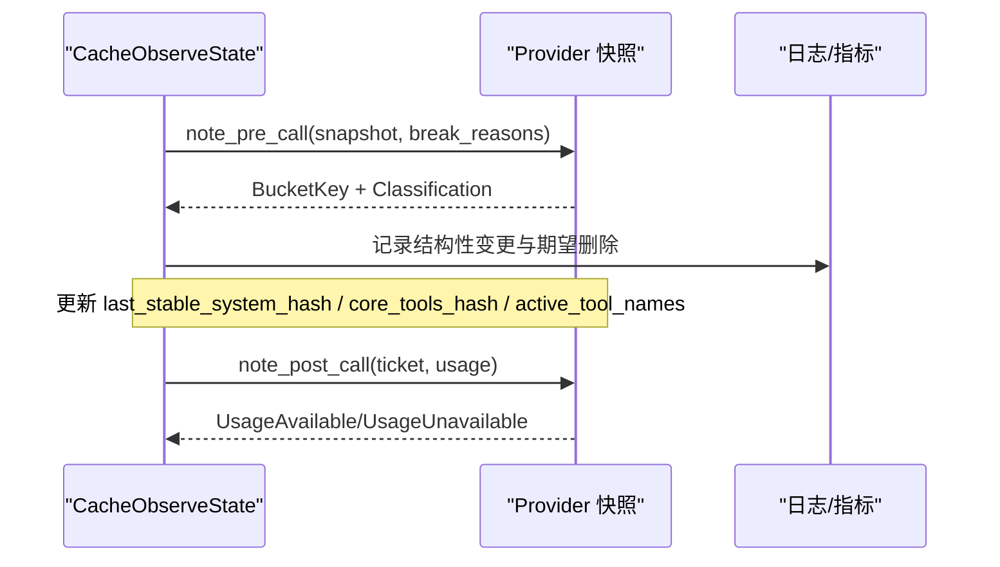

**图表来源**
- [context_assembly/cache_observe.rs:68-165](file://agent-diva-agent/src/context_assembly/cache_observe.rs#L68-L165)
- [context_assembly/cache_observe.rs:207-226](file://agent-diva-agent/src/context_assembly/cache_observe.rs#L207-L226)

**章节来源**
- [context_assembly/cache_observe.rs:10-66](file://agent-diva-agent/src/context_assembly/cache_observe.rs#L10-L66)
- [context_assembly/cache_observe.rs:68-165](file://agent-diva-agent/src/context_assembly/cache_observe.rs#L68-L165)
- [context_assembly/cache_observe.rs:207-226](file://agent-diva-agent/src/context_assembly/cache_observe.rs#L207-L226)

### 上下文构建器与消息组装
- 系统提示：面具身份 + 冻结核心 + 规则与技能 + 记忆策略与索引。
- 历史与检查点：将历史转换为 provider 消息，恢复 tool_calls、reasoning_content、thinking_blocks；插入规范检查点。
- 动态上下文：时间、渠道、聊天 ID 等易变元数据以信封形式注入。
- 当前用户：最后一句为用户输入。
- 清理：移除孤儿 tool 消息与不完整 tool_call 组，防止 provider 拒绝请求。

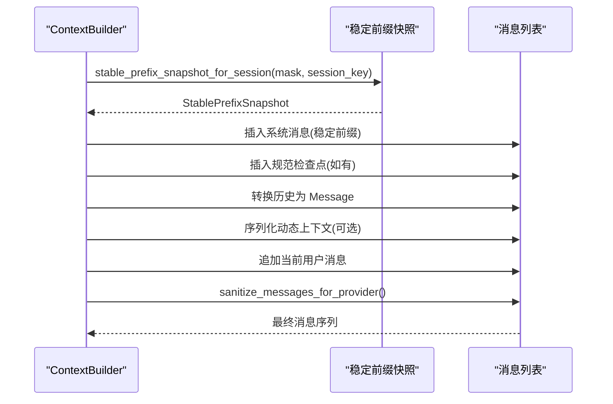

**图表来源**
- [context.rs:570-725](file://agent-diva-agent/src/context.rs#L570-L725)

**章节来源**
- [context.rs:570-725](file://agent-diva-agent/src/context.rs#L570-L725)

### 预算检查与压缩触发
- 预算配置：最大 token、系统预算比例、压缩阈值比例、保留最近消息数。
- 检查逻辑：估算历史与检查点 token，计算压力比，决定是否触发压缩。
- 压缩提示：版本化的检查点提示要求结构化输出，保留标识符与 artifact 引用。

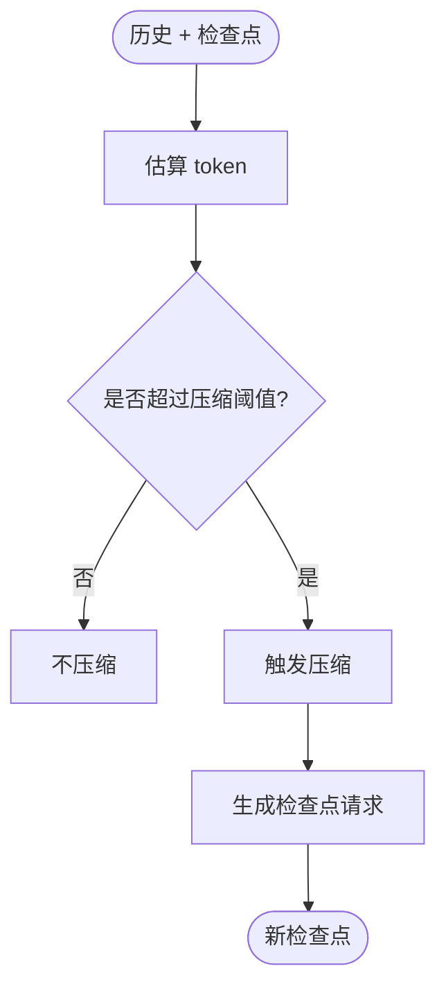

**图表来源**
- [context_budget.rs:164-207](file://agent-diva-agent/src/context_budget.rs#L164-L207)
- [compaction/prompt.rs:22-31](file://agent-diva-agent/src/compaction/prompt.rs#L22-L31)

**章节来源**
- [context_budget.rs:25-112](file://agent-diva-agent/src/context_budget.rs#L25-L112)
- [context_budget.rs:164-207](file://agent-diva-agent/src/context_budget.rs#L164-L207)
- [compaction/prompt.rs:1-31](file://agent-diva-agent/src/compaction/prompt.rs#L1-L31)

### 工具装配与上下文优化
- 核心工具 schema：始终可见，置于稳定前缀附近，提升缓存命中。
- 延迟工具 schema：按需激活，减少初始上下文体积。
- 安全与模式：读-only 模式、计划阶段、面具工具限制等过滤工具集合。
- 工作区与权限：文件系统工具受安全策略保护，网络工具按配置启用。

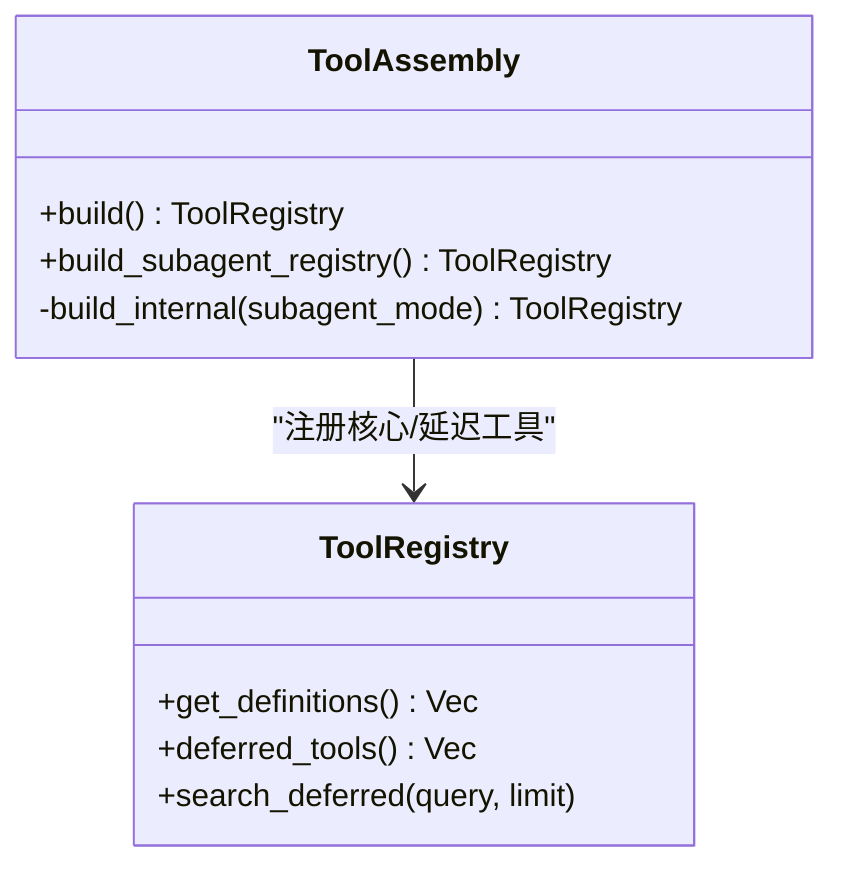

**图表来源**
- [tool_assembly.rs:240-616](file://agent-diva-agent/src/tool_assembly.rs#L240-L616)

**章节来源**
- [tool_assembly.rs:240-616](file://agent-diva-agent/src/tool_assembly.rs#L240-L616)

### 工作区指令与面具注入
- 工作区指令：读取 AGENTS.md，计算摘要，截断至预算，附带安全声明。
- 面具提示：非默认面具可注入额外系统提示，位于最顶部。

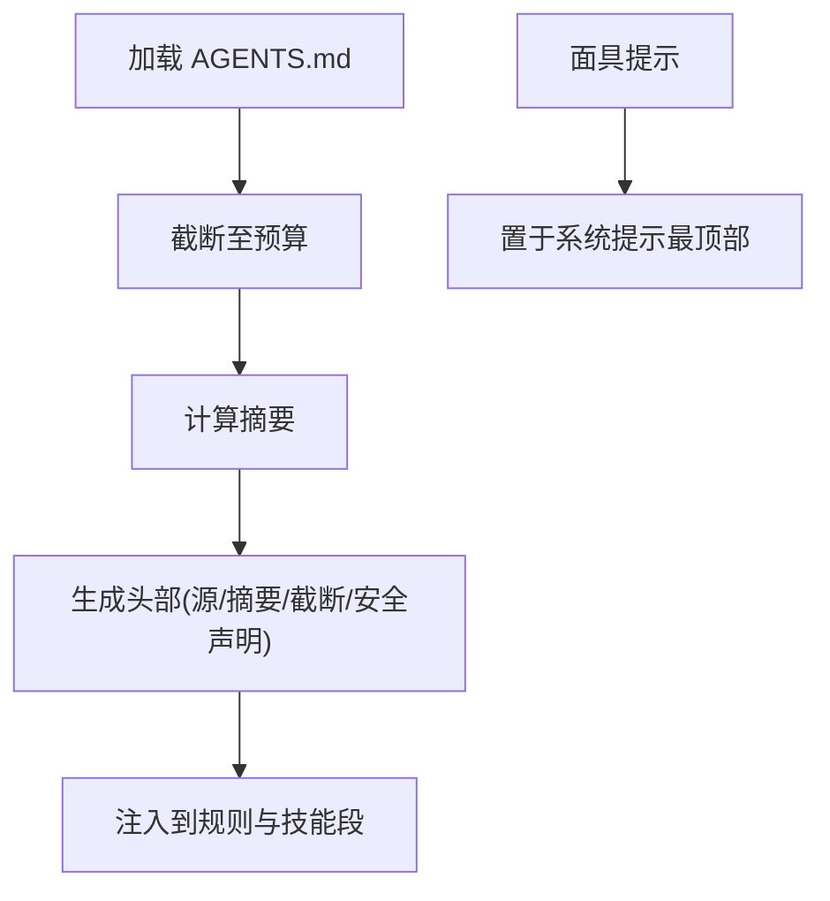

**图表来源**
- [workspace_instructions.rs:49-86](file://agent-diva-agent/src/workspace_instructions.rs#L49-L86)
- [mask/mask_prompt_composer.rs:12-33](file://agent-diva-agent/src/mask/mask_prompt_composer.rs#L12-L33)

**章节来源**
- [workspace_instructions.rs:49-86](file://agent-diva-agent/src/workspace_instructions.rs#L49-L86)
- [mask/mask_prompt_composer.rs:12-33](file://agent-diva-agent/src/mask/mask_prompt_composer.rs#L12-L33)

## 依赖关系分析
- ContextBuilder 依赖稳定前缀缓存、记忆提供者、技能加载器、工作区指令、面具提示合成。
- 上下文装配模块依赖 Provider 消息类型与工具定义集。
- 预算模块依赖 token 估算与配置。
- 工具装配依赖安全策略、规划阶段、面具工具限制、MCP 服务器配置。

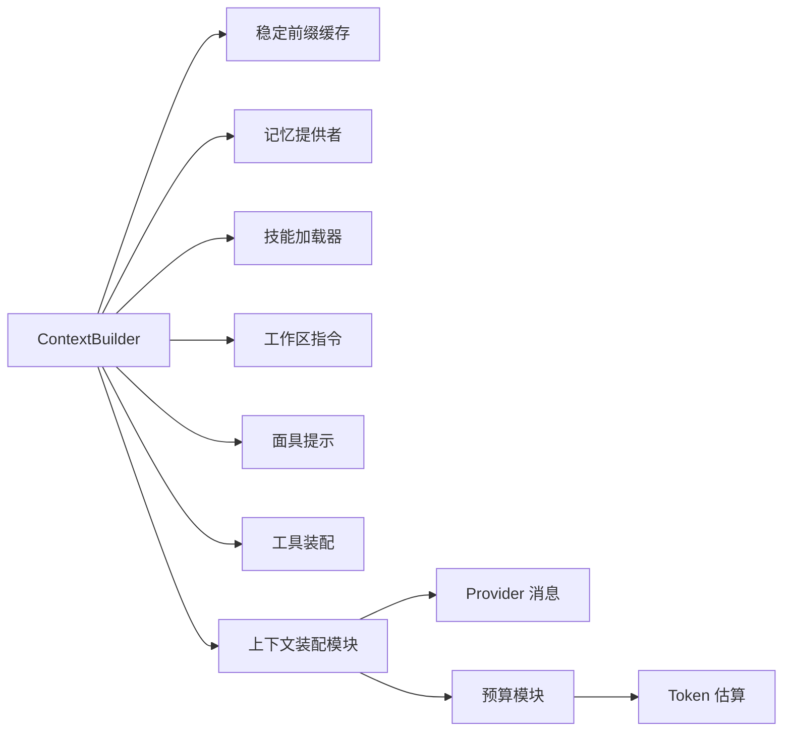

**图表来源**
- [context.rs:53-157](file://agent-diva-agent/src/context.rs#L53-L157)
- [context_assembly/mod.rs:1-25](file://agent-diva-agent/src/context_assembly/mod.rs#L1-L25)
- [context_assembly/budget.rs:1-12](file://agent-diva-agent/src/context_assembly/budget.rs#L1-L12)
- [tool_assembly.rs:1-68](file://agent-diva-agent/src/tool_assembly.rs#L1-L68)

**章节来源**
- [context.rs:53-157](file://agent-diva-agent/src/context.rs#L53-L157)
- [context_assembly/mod.rs:1-25](file://agent-diva-agent/src/context_assembly/mod.rs#L1-L25)
- [context_assembly/budget.rs:1-12](file://agent-diva-agent/src/context_assembly/budget.rs#L1-L12)
- [tool_assembly.rs:1-68](file://agent-diva-agent/src/tool_assembly.rs#L1-L68)

## 性能考量
- 稳定前缀缓存显著降低重复渲染成本，支持细粒度失效与版本化。
- 工具 schema 分层（核心/延迟）减少初始上下文体积，提高缓存命中率。
- 预算检查在历史增长时提前触发压缩，避免超出上下文窗口。
- 缓存观测提供最终线提示缓存命中与结构性变更的诊断能力。
- 工作区指令截断与安全声明确保注入内容可控且可审计。

[本节为通用指导，无需特定文件引用]

## 故障排查指南
- 装配错误：稳定前缀包含可变段或动态后缀包含稳定段会抛出错误，需检查段稳定性分类。
- 历史溢出：当历史与检查点超过预算阈值时，应检查压缩触发与保留最近消息数。
- 工具调用不一致：孤儿 tool 消息或不完整 tool_call 组会被清理，需检查历史恢复逻辑。
- 缓存命中低：检查最终线提示缓存快照、结构性变更原因与使用指标，确认核心工具锚点是否正确设置。
- 面具/规则变更：确认失效标记是否正确设置，前缀版本是否递增。

**章节来源**
- [context_assembly/mod.rs:144-172](file://agent-diva-agent/src/context_assembly/mod.rs#L144-L172)
- [context_budget.rs:164-207](file://agent-diva-agent/src/context_budget.rs#L164-L207)
- [context.rs:667-725](file://agent-diva-agent/src/context.rs#L667-L725)
- [context_assembly/cache_observe.rs:68-165](file://agent-diva-agent/src/context_assembly/cache_observe.rs#L68-L165)

## 结论
上下文构建通过严格的段顺序、稳定性分类、预算管理与缓存策略，确保 LLM 调用获得高质量、可控且高效的上下文。稳定前缀缓存与工具 schema 分层提升了缓存命中率与响应速度；预算检查与压缩机制保障了上下文不超出窗口限制；缓存观测提供了可观测性与诊断能力。整体设计兼顾了性能、安全性与可维护性。

[本节为总结，无需特定文件引用]

## 附录
- 关键常量与配置：
  - 工作区指令最大字符数：见工作区指令加载模块。
  - 预算配置默认值：最大 token、系统预算比例、压缩阈值比例、保留最近消息数。
  - 检查点提示版本：版本化以确保向后兼容。

**章节来源**
- [workspace_instructions.rs:15-22](file://agent-diva-agent/src/workspace_instructions.rs#L15-L22)
- [context_budget.rs:25-61](file://agent-diva-agent/src/context_budget.rs#L25-L61)
- [compaction/prompt.rs:1-4](file://agent-diva-agent/src/compaction/prompt.rs#L1-L4)