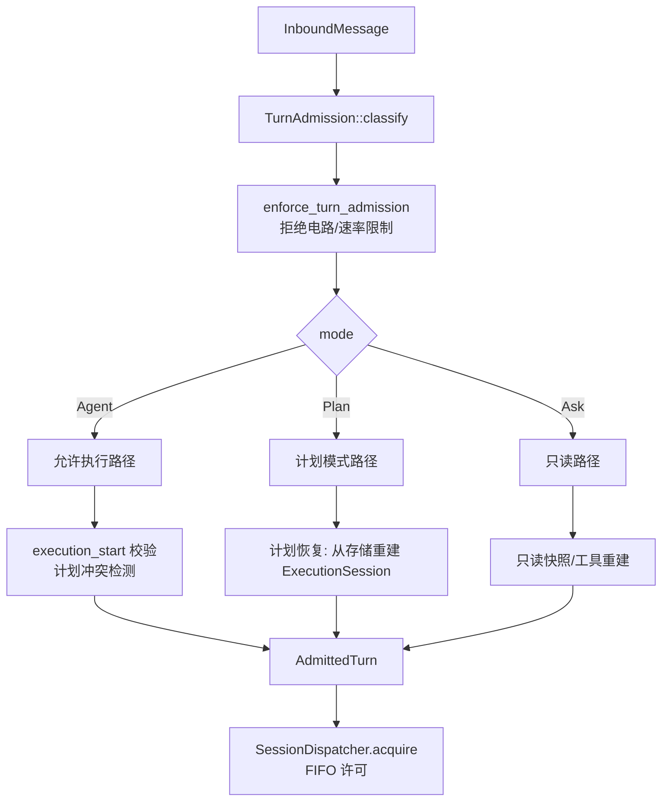
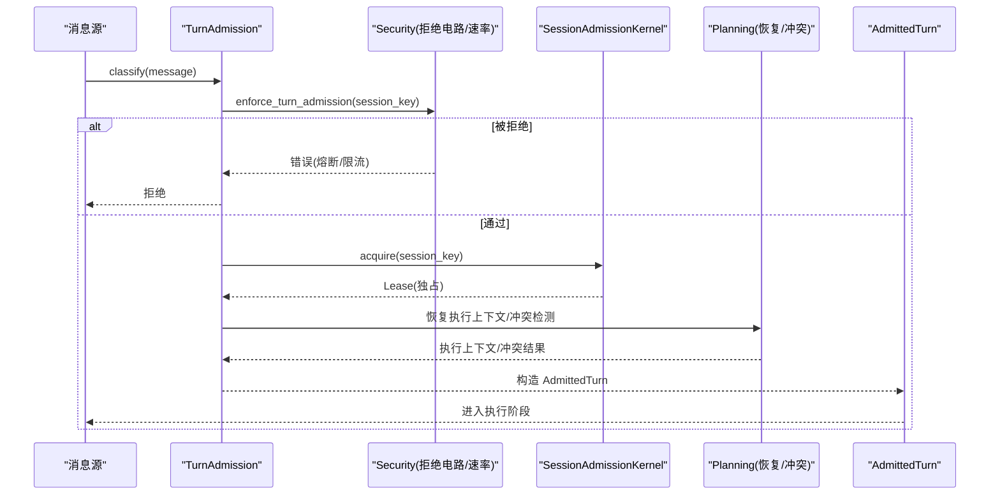
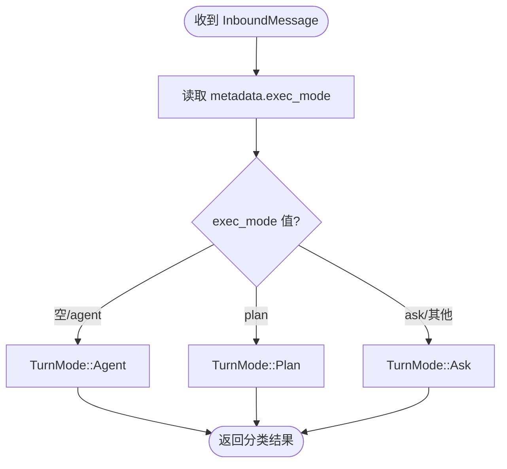
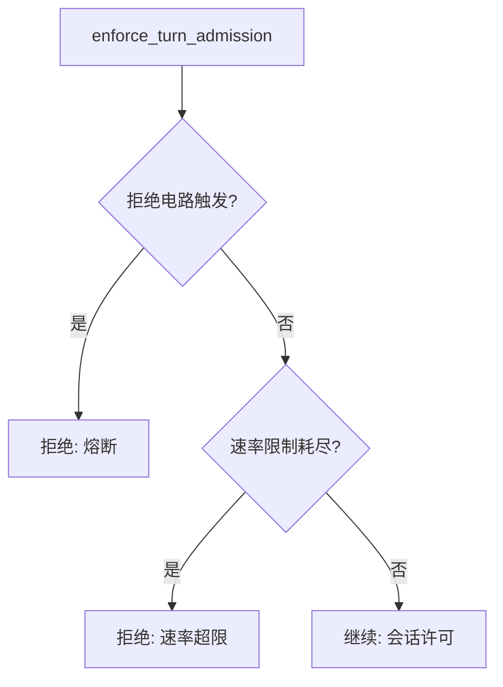
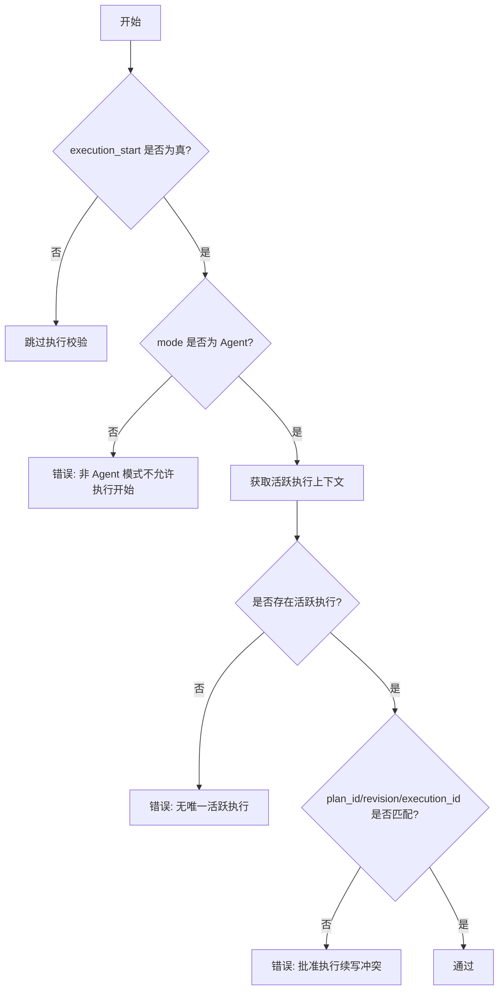
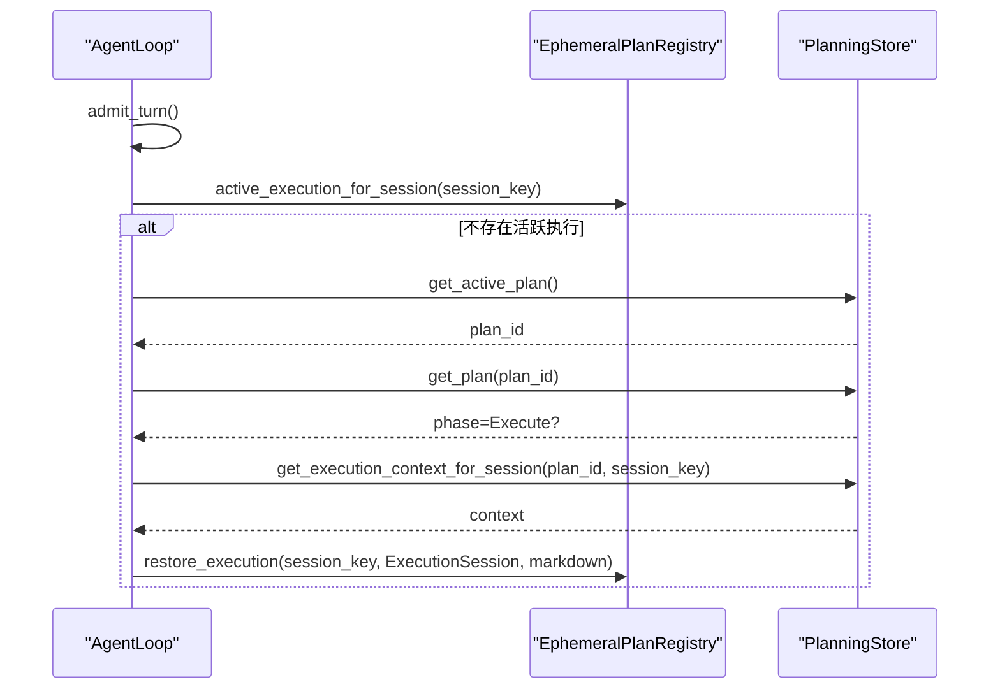
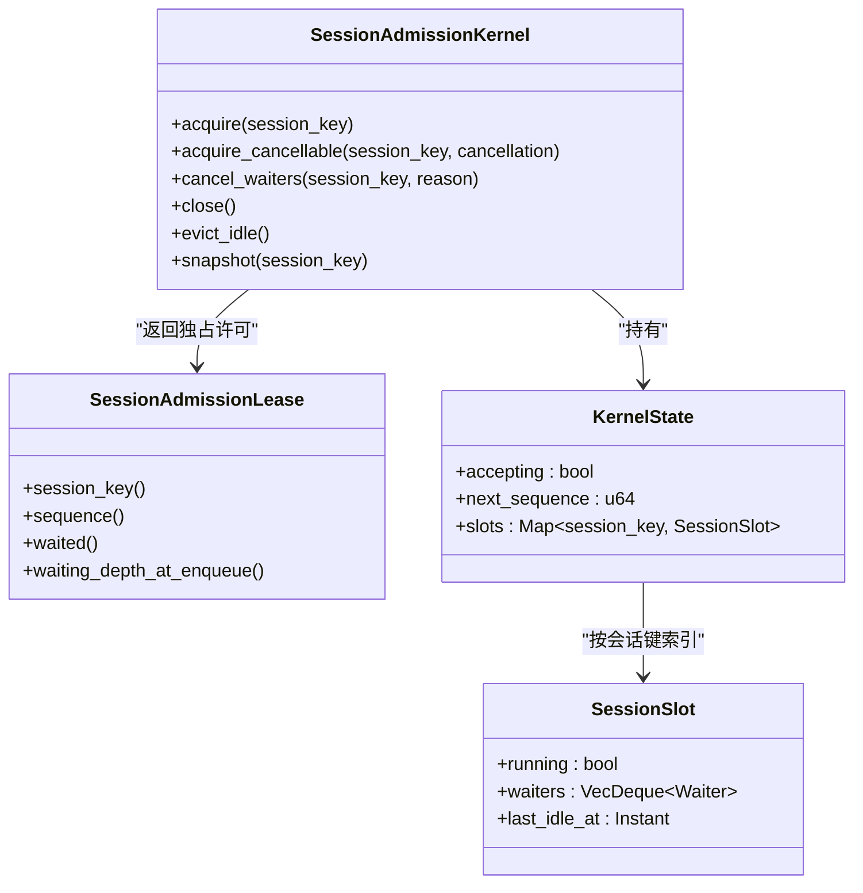
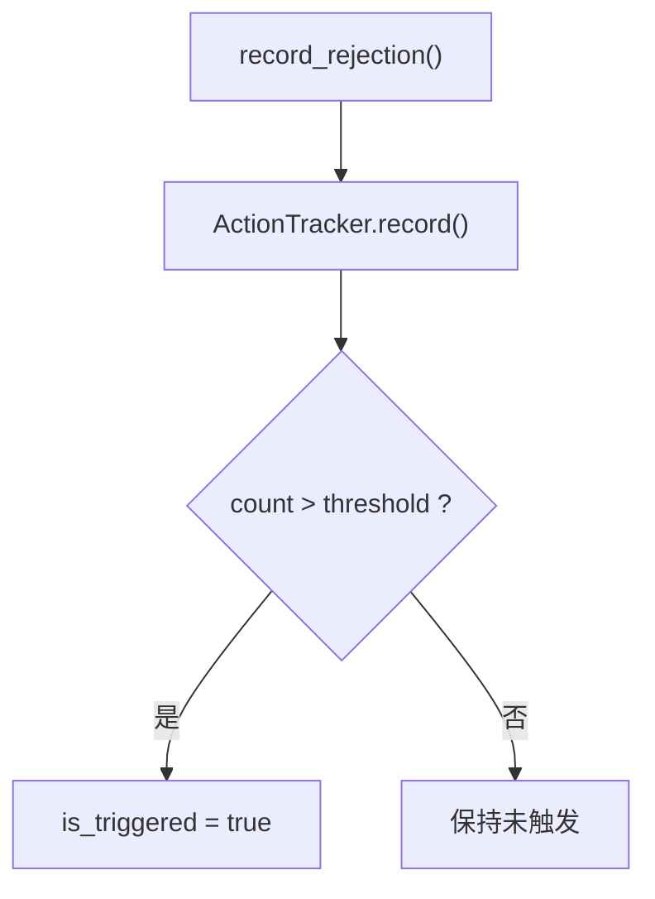
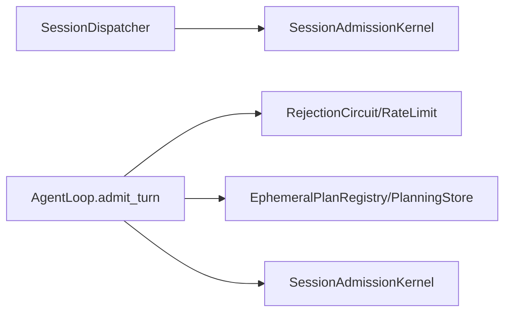

# 准入控制

<cite>
**本文引用的文件**
- [agent-diva-core/src/session/admission.rs](file://agent-diva-core/src/session/admission.rs)
- [agent-diva-agent/src/agent_loop/turn/admission.rs](file://agent-diva-agent/src/agent_loop/turn/admission.rs)
- [agent-diva-agent/src/agent_loop/dispatcher.rs](file://agent-diva-agent/src/agent_loop/dispatcher.rs)
- [agent-diva-core/src/security/rejection_circuit.rs](file://agent-diva-core/src/security/rejection_circuit.rs)
- [agent-diva-core/src/security/rate_limit.rs](file://agent-diva-core/src/security/rate_limit.rs)
- [agent-diva-core/src/security/config.rs](file://agent-diva-core/src/security/config.rs)
- [agent-diva-core/src/planning/report_store.rs](file://agent-diva-core/src/planning/report_store.rs)
- [agent-diva-core/src/planning/store.rs](file://agent-diva-core/src/planning/store.rs)
</cite>

## 目录
1. [简介](#简介)
2. [项目结构](#项目结构)
3. [核心组件](#核心组件)
4. [架构总览](#架构总览)
5. [详细组件分析](#详细组件分析)
6. [依赖关系分析](#依赖关系分析)
7. [性能考量](#性能考量)
8. [故障排查指南](#故障排查指南)
9. [结论](#结论)
10. [附录](#附录)

## 简介
本文件聚焦“准入控制阶段”，系统性说明 TurnAdmission 与 AdmittedTurn 的数据结构、消息分类逻辑（Agent、Plan、Ask）、准入检查机制，以及执行开始验证、计划模式恢复、会话状态管理等核心功能。同时覆盖拒绝电路保护、速率限制、计划冲突检测等安全机制的实现细节，并给出配置选项与错误处理策略。

## 项目结构
围绕准入控制的代码主要分布在以下模块：
- 会话级有界 FIFO 准入内核：按会话串行化 turn，提供排队、超时、空闲回收能力。
- Agent 层准入与分类：对入站消息进行分类、校验执行开始标志、恢复计划执行上下文、构建 AdmittedTurn。
- 安全与限流：拒绝熔断器、滑动窗口速率限制、安全配置加载与合并。
- 计划运行时注册表：进程内维护 session 维度的执行上下文，支持重启后恢复。

**图表来源**
- [agent-diva-agent/src/agent_loop/turn/admission.rs:69-112](file://agent-diva-agent/src/agent_loop/turn/admission.rs#L69-L112)
- [agent-diva-core/src/session/admission.rs:157-243](file://agent-diva-core/src/session/admission.rs#L157-L243)
- [agent-diva-core/src/security/rejection_circuit.rs:22-55](file://agent-diva-core/src/security/rejection_circuit.rs#L22-L55)
- [agent-diva-core/src/security/rate_limit.rs:1-47](file://agent-diva-core/src/security/rate_limit.rs#L1-L47)

**章节来源**
- [agent-diva-agent/src/agent_loop/turn/admission.rs:69-112](file://agent-diva-agent/src/agent_loop/turn/admission.rs#L69-L112)
- [agent-diva-core/src/session/admission.rs:157-243](file://agent-diva-core/src/session/admission.rs#L157-L243)

## 核心组件
- SessionAdmissionKernel：进程内按会话键维护有界 FIFO 队列，提供 acquire/acquire_cancellable、cancel_waiters、close、evict_idle、snapshot 等能力；通过 Lease 语义保证独占执行与自动释放。
- TurnAdmission / AdmittedTurn：前者是入站消息的无副作用分类结果（session_key、mode、scheduled），后者是准入通过后进入执行阶段的完整上下文（模型、mask、执行标志、计划执行上下文、快照、背景任务上下文等）。
- RejectionCircuitBreaker：基于滑动窗口的拒绝熔断器，统计 provider 拒绝失败次数，超过阈值则阻止新一轮模型迭代。
- ActionTracker：滑动窗口计数器，支撑拒绝熔断与速率限制。
- SecurityConfig：安全配置加载、合并与校验，包含 max_actions_per_hour、rejection_circuit_window_secs/threshold 等。
- EphemeralPlanRegistry / PlanningStore：进程内计划运行时状态与持久化执行上下文，用于计划模式恢复与冲突检测。

**章节来源**
- [agent-diva-core/src/session/admission.rs:18-79](file://agent-diva-core/src/session/admission.rs#L18-L79)
- [agent-diva-agent/src/agent_loop/turn/admission.rs:17-92](file://agent-diva-agent/src/agent_loop/turn/admission.rs#L17-L92)
- [agent-diva-core/src/security/rejection_circuit.rs:14-55](file://agent-diva-core/src/security/rejection_circuit.rs#L14-L55)
- [agent-diva-core/src/security/rate_limit.rs:1-47](file://agent-diva-core/src/security/rate_limit.rs#L1-L47)
- [agent-diva-core/src/security/config.rs:51-128](file://agent-diva-core/src/security/config.rs#L51-L128)
- [agent-diva-core/src/planning/report_store.rs:24-43](file://agent-diva-core/src/planning/report_store.rs#L24-L43)
- [agent-diva-core/src/planning/store.rs:1049-1075](file://agent-diva-core/src/planning/store.rs#L1049-L1075)

## 架构总览
准入控制由“分类—安全检查—会话许可—执行上下文准备”四步组成：
1. 分类：根据 InboundMessage 的 exec_mode 元数据判定为 Agent/Plan/Ask。
2. 安全检查：拒绝电路触发或每小时动作上限耗尽时直接拒绝新 turn。
3. 会话许可：通过 SessionAdmissionKernel 获取会话独占许可（FIFO、超时、取消、空闲回收）。
4. 执行上下文准备：校验 execution_start 合法性、检测计划冲突、恢复计划执行上下文、构建 AdmittedTurn。

**图表来源**
- [agent-diva-agent/src/agent_loop/turn/admission.rs:69-112](file://agent-diva-agent/src/agent_loop/turn/admission.rs#L69-L112)
- [agent-diva-core/src/session/admission.rs:157-243](file://agent-diva-core/src/session/admission.rs#L157-L243)
- [agent-diva-core/src/security/rejection_circuit.rs:22-55](file://agent-diva-core/src/security/rejection_circuit.rs#L22-L55)
- [agent-diva-core/src/security/rate_limit.rs:1-47](file://agent-diva-core/src/security/rate_limit.rs#L1-L47)

## 详细组件分析

### 数据结构：TurnAdmission 与 AdmittedTurn
- TurnAdmission
  - session_key：由 channel + chat_id 拼接，作为会话唯一标识。
  - mode：TurnMode（Agent/Plan/Ask），来自消息元数据 exec_mode。
  - scheduled：是否由定时任务触发（cron 或含 cron_job_id）。
- AdmittedTurn
  - active_mask：当前生效的 mask 文件。
  - model：本轮使用的模型。
  - scheduled：是否调度任务。
  - mode：TurnMode。
  - execution_start：是否请求执行开始。
  - session_key：会话键。
  - active_execution / active_execution_id：当前活跃的计划执行上下文及 ID。
  - snapshot：TurnSnapshot（策略阶段、是否只读、计划守卫等）。
  - plan_guard_active：计划守卫是否激活。
  - approved_plan_markdown：已批准计划的 Markdown。
  - background_task_context：跨工具调用的背景任务上下文（channel/chat_id/session_key/trace_id/父任务/token预算/mask 前缀等）。

这些字段共同构成一次 turn 的“准入通过态”，供后续执行阶段使用。

**章节来源**
- [agent-diva-agent/src/agent_loop/turn/admission.rs:62-92](file://agent-diva-agent/src/agent_loop/turn/admission.rs#L62-L92)

### 消息分类逻辑（Agent、Plan、Ask）
- 分类依据：InboundMessage.metadata.exec_mode。
  - 空值或 "agent" → Agent。
  - "plan" → Plan。
  - "ask" 或未知值 → Ask（未知值默认归为 Ask，避免误放行）。
- 行为差异：
  - Agent：允许执行。
  - Plan：计划模式，不视为可执行 turn。
  - Ask：只读模式，不允许执行。

**图表来源**
- [agent-diva-agent/src/agent_loop/turn/admission.rs:25-52](file://agent-diva-agent/src/agent_loop/turn/admission.rs#L25-L52)

**章节来源**
- [agent-diva-agent/src/agent_loop/turn/admission.rs:25-52](file://agent-diva-agent/src/agent_loop/turn/admission.rs#L25-L52)

### 准入检查机制
- 拒绝电路保护：若 RejectionCircuitBreaker 在滑动窗口内记录到超过阈值的拒绝失败，则拒绝新的 turn 准入。
- 速率限制：若每小时动作数达到上限（max_actions_per_hour），拒绝新的 turn 准入。
- 会话许可：通过 SessionAdmissionKernel.acquire 获取会话独占许可；队列满则拒绝；等待超时会返回 WaitTimeout；支持取消与空闲回收。

**图表来源**
- [agent-diva-agent/src/agent_loop/turn/admission.rs:94-112](file://agent-diva-agent/src/agent_loop/turn/admission.rs#L94-L112)
- [agent-diva-core/src/security/rejection_circuit.rs:22-55](file://agent-diva-core/src/security/rejection_circuit.rs#L22-L55)
- [agent-diva-core/src/security/rate_limit.rs:1-47](file://agent-diva-core/src/security/rate_limit.rs#L1-L47)

**章节来源**
- [agent-diva-agent/src/agent_loop/turn/admission.rs:94-112](file://agent-diva-agent/src/agent_loop/turn/admission.rs#L94-L112)
- [agent-diva-core/src/security/rejection_circuit.rs:22-55](file://agent-diva-core/src/security/rejection_circuit.rs#L22-L55)
- [agent-diva-core/src/security/rate_limit.rs:1-47](file://agent-diva-core/src/security/rate_limit.rs#L1-L47)

### 执行开始验证与计划冲突检测
- execution_start 校验：仅当 mode 为 Agent 时才允许设置 execution_start=true；否则报错。
- 计划冲突检测：当 execution_start=true 且存在活跃执行上下文时，校验消息中的 plan_id、plan_revision、execution_id 是否与活跃执行一致；不一致则拒绝，防止并发续写不同计划。

**图表来源**
- [agent-diva-agent/src/agent_loop/turn/admission.rs:54-59](file://agent-diva-agent/src/agent_loop/turn/admission.rs#L54-L59)
- [agent-diva-agent/src/agent_loop/turn/admission.rs:200-223](file://agent-diva-agent/src/agent_loop/turn/admission.rs#L200-L223)

**章节来源**
- [agent-diva-agent/src/agent_loop/turn/admission.rs:54-59](file://agent-diva-agent/src/agent_loop/turn/admission.rs#L54-L59)
- [agent-diva-agent/src/agent_loop/turn/admission.rs:200-223](file://agent-diva-agent/src/agent_loop/turn/admission.rs#L200-L223)

### 计划模式恢复与会话状态管理
- 启动时恢复：若计划处于 Execute 阶段且当前会话无活跃执行，尝试从 PlanningStore 中按 session_key 恢复 ExecutionSession，并注入已批准计划 Markdown。
- 进程内注册表：EphemeralPlanRegistry 维护 session 维度的执行状态，重启后重建。
- 持久化上下文：PlanningStore 负责执行上下文的创建、更新与查询，包括边界信息、初始化状态、压缩上下文等。

**图表来源**
- [agent-diva-agent/src/agent_loop/turn/admission.rs:146-189](file://agent-diva-agent/src/agent_loop/turn/admission.rs#L146-L189)
- [agent-diva-core/src/planning/report_store.rs:24-43](file://agent-diva-core/src/planning/report_store.rs#L24-L43)
- [agent-diva-core/src/planning/store.rs:1049-1075](file://agent-diva-core/src/planning/store.rs#L1049-L1075)

**章节来源**
- [agent-diva-agent/src/agent_loop/turn/admission.rs:146-189](file://agent-diva-agent/src/agent_loop/turn/admission.rs#L146-L189)
- [agent-diva-core/src/planning/report_store.rs:24-43](file://agent-diva-core/src/planning/report_store.rs#L24-L43)
- [agent-diva-core/src/planning/store.rs:1049-1075](file://agent-diva-core/src/planning/store.rs#L1049-L1075)

### 会话许可与 FIFO 串行化
- 每个会话一个 slot，running 表示当前是否有独占 turn。
- 等待队列：按 FIFO 顺序排队，受 max_queue_depth 限制；超出即 QueueFull。
- 等待超时：wait_timeout 到期未获得许可则返回 WaitTimeout。
- 取消与关闭：支持取消单个 waiter；close 停止接受新 turn，但允许已接受的 drain。
- 空闲回收：idle_ttl 时间后清理完全空闲的 slot。

**图表来源**
- [agent-diva-core/src/session/admission.rs:117-155](file://agent-diva-core/src/session/admission.rs#L117-L155)
- [agent-diva-core/src/session/admission.rs:387-439](file://agent-diva-core/src/session/admission.rs#L387-L439)
- [agent-diva-core/src/session/admission.rs:441-467](file://agent-diva-core/src/session/admission.rs#L441-L467)

**章节来源**
- [agent-diva-core/src/session/admission.rs:117-155](file://agent-diva-core/src/session/admission.rs#L117-L155)
- [agent-diva-core/src/session/admission.rs:387-439](file://agent-diva-core/src/session/admission.rs#L387-L439)
- [agent-diva-core/src/session/admission.rs:441-467](file://agent-diva-core/src/session/admission.rs#L441-L467)

### 安全机制实现细节
- 拒绝电路保护：RejectionCircuitBreaker 基于 ActionTracker 滑动窗口计数，超过 threshold 则 is_triggered=true，阻断新模型迭代。
- 速率限制：ActionTracker 记录动作时间戳，结合 max_actions_per_hour 判断是否超限。
- 配置选项：SecurityConfig 支持 rejection_circuit_window_secs、rejection_circuit_threshold、max_actions_per_hour 等；支持从工作区/home 配置文件加载与合并。

**图表来源**
- [agent-diva-core/src/security/rejection_circuit.rs:22-55](file://agent-diva-core/src/security/rejection_circuit.rs#L22-L55)
- [agent-diva-core/src/security/rate_limit.rs:1-47](file://agent-diva-core/src/security/rate_limit.rs#L1-L47)
- [agent-diva-core/src/security/config.rs:114-128](file://agent-diva-core/src/security/config.rs#L114-L128)

**章节来源**
- [agent-diva-core/src/security/rejection_circuit.rs:22-55](file://agent-diva-core/src/security/rejection_circuit.rs#L22-L55)
- [agent-diva-core/src/security/rate_limit.rs:1-47](file://agent-diva-core/src/security/rate_limit.rs#L1-L47)
- [agent-diva-core/src/security/config.rs:114-128](file://agent-diva-core/src/security/config.rs#L114-L128)

### 配置选项与错误处理策略
- 配置来源与优先级：
  - 工作区 .agent-diva/security.json
  - 家目录 .agent-diva/security.json
  - 家目录 config.json 的 security 嵌套段
- 关键配置项：
  - max_actions_per_hour：每小时最大动作数，0 非法。
  - rejection_circuit_window_secs：拒绝熔断滑动窗口秒数（默认 60）。
  - rejection_circuit_threshold：窗口内允许的拒绝次数上限（默认 50）。
  - global_tool_timeout_secs：全局工具超时（默认 120，0 非法）。
  - token_budget_limit / per_task_token_budget：令牌预算限制。
- 错误类型：
  - 会话准入：QueueFull、WaitTimeout、Cancelled、Unavailable。
  - 执行开始：非 Agent 模式执行开始、无活跃执行、批准执行续写冲突。
  - 安全：熔断触发、速率超限。

**章节来源**
- [agent-diva-core/src/security/config.rs:181-231](file://agent-diva-core/src/security/config.rs#L181-L231)
- [agent-diva-core/src/security/config.rs:249-273](file://agent-diva-core/src/security/config.rs#L249-L273)
- [agent-diva-core/src/session/admission.rs:53-79](file://agent-diva-core/src/session/admission.rs#L53-L79)
- [agent-diva-agent/src/agent_loop/turn/admission.rs:54-59](file://agent-diva-agent/src/agent_loop/turn/admission.rs#L54-L59)
- [agent-diva-agent/src/agent_loop/turn/admission.rs:200-223](file://agent-diva-agent/src/agent_loop/turn/admission.rs#L200-L223)

## 依赖关系分析
- Agent 层依赖 core 层的会话准入与安全原语，并通过 planning 子系统完成计划恢复与冲突检测。
- dispatcher 封装了 SessionAdmissionKernel，确保同一会话串行执行，不同会话可并发提交。

**图表来源**
- [agent-diva-agent/src/agent_loop/dispatcher.rs:17-49](file://agent-diva-agent/src/agent_loop/dispatcher.rs#L17-L49)
- [agent-diva-agent/src/agent_loop/turn/admission.rs:94-112](file://agent-diva-agent/src/agent_loop/turn/admission.rs#L94-L112)
- [agent-diva-core/src/session/admission.rs:117-155](file://agent-diva-core/src/session/admission.rs#L117-L155)

**章节来源**
- [agent-diva-agent/src/agent_loop/dispatcher.rs:17-49](file://agent-diva-agent/src/agent_loop/dispatcher.rs#L17-L49)
- [agent-diva-agent/src/agent_loop/turn/admission.rs:94-112](file://agent-diva-agent/src/agent_loop/turn/admission.rs#L94-L112)
- [agent-diva-core/src/session/admission.rs:117-155](file://agent-diva-core/src/session/admission.rs#L117-L155)

## 性能考量
- 会话许可采用无锁等待队列+短临界区设计，释放许可后立即提升下一个等待者，减少阻塞。
- 空闲回收避免长期占用内存；超时与取消保障资源及时释放。
- 拒绝熔断与速率限制均为轻量滑动窗口计数，开销低。
- 计划恢复仅在必要时进行，避免不必要的 I/O。

[本节为通用性能讨论，不直接分析具体文件]

## 故障排查指南
- 常见错误与定位：
  - QueueFull：检查 max_queue_depth 与并发提交频率；确认是否有长时间运行的 turn 未释放。
  - WaitTimeout：检查 wait_timeout 配置与下游执行耗时；考虑优化执行路径或提高超时。
  - Cancelled：检查上层是否主动取消；确认 CancellationToken 生命周期。
  - Unavailable：确认 kernel 是否已被 close；检查服务启停流程。
  - 熔断触发：查看 provider 拒绝风暴日志；调整 rejection_circuit_window_secs/threshold。
  - 速率超限：调整 max_actions_per_hour；检查是否存在突发批量调用。
  - 执行开始冲突：核对 plan_id/revision/execution_id 一致性；确保单会话串行续写。
- 诊断建议：
  - 使用 snapshot 观察 running/waiting/accepting/idle_for。
  - 检查计划执行上下文状态（initialization_status/boundary）。
  - 审查安全配置合并结果，确认阈值与窗口是否符合预期。

**章节来源**
- [agent-diva-core/src/session/admission.rs:53-79](file://agent-diva-core/src/session/admission.rs#L53-L79)
- [agent-diva-core/src/security/config.rs:249-273](file://agent-diva-core/src/security/config.rs#L249-L273)
- [agent-diva-core/src/planning/store.rs:1049-1075](file://agent-diva-core/src/planning/store.rs#L1049-L1075)

## 结论
准入控制通过“分类—安全检查—会话许可—执行上下文准备”形成闭环，既保证了会话内的串行性与资源可控，又提供了计划模式的恢复与冲突防护。拒绝电路与速率限制构成双重安全阀，配合细粒度的配置项与完善的错误类型，使系统在高压场景下仍具备鲁棒性。

[本节为总结性内容，不直接分析具体文件]

## 附录
- 相关测试与验收文档参考：
  - 拒绝熔断器测试与验收说明，涵盖阈值命中、窗口滑过恢复、reset 清除、配置 merge 等场景。
  - 会话准入测试覆盖 FIFO 顺序、超时、取消、关闭等行为。

**章节来源**
- [docs/logs/2026-08-gmh-closure/v0.0.2-s1b-rejection-circuit-breaker/verification.md:1-28](file://docs/logs/2026-08-gmh-closure/v0.0.2-s1b-rejection-circuit-breaker/verification.md#L1-L28)
- [agent-diva-core/src/session/admission.rs:625-943](file://agent-diva-core/src/session/admission.rs#L625-L943)