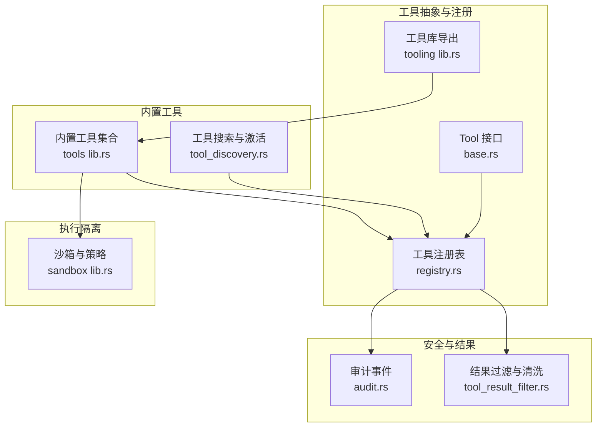
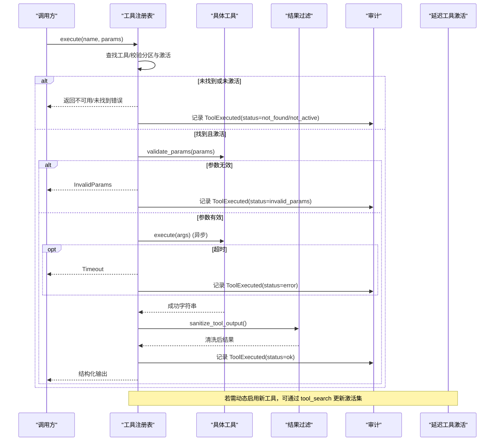
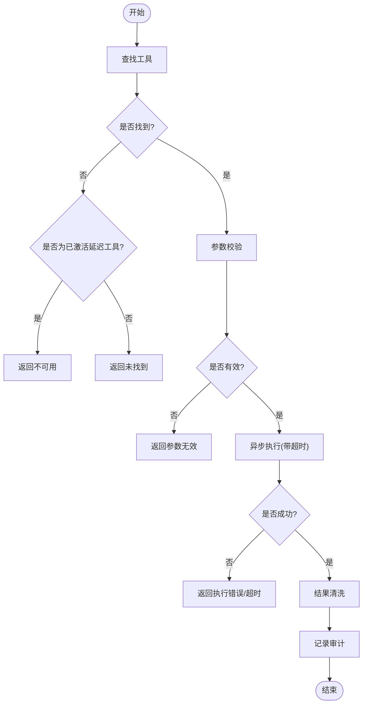
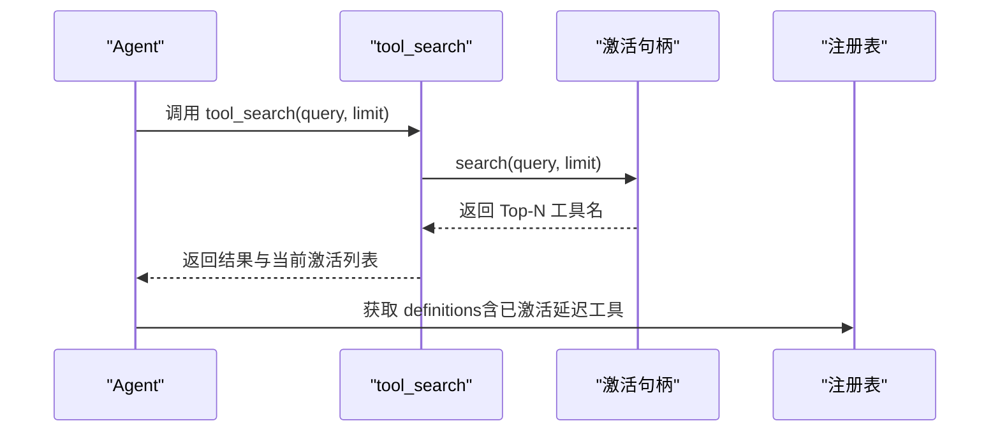
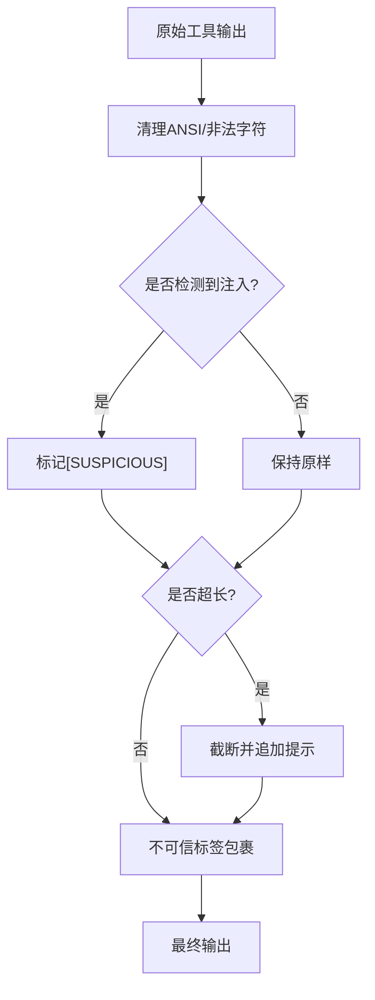
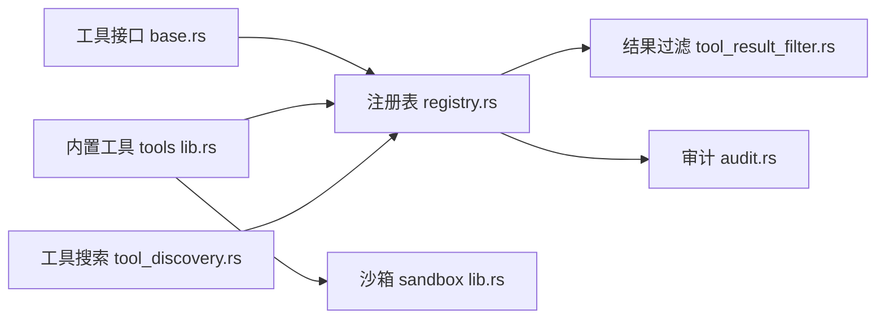

# 工具执行

<cite>
**本文引用的文件**
- [agent-diva-tooling/src/lib.rs](file://agent-diva-tooling/src/lib.rs)
- [agent-diva-tooling/src/base.rs](file://agent-diva-tooling/src/base.rs)
- [agent-diva-tooling/src/registry.rs](file://agent-diva-tooling/src/registry.rs)
- [agent-diva-tools/src/lib.rs](file://agent-diva-tools/src/lib.rs)
- [agent-diva-tools/src/tool_discovery.rs](file://agent-diva-tools/src/tool_discovery.rs)
- [agent-diva-core/src/security/tool_result_filter.rs](file://agent-diva-core/src/security/tool_result_filter.rs)
- [agent-diva-core/src/audit.rs](file://agent-diva-core/src/audit.rs)
- [agent-diva-sandbox/src/lib.rs](file://agent-diva-sandbox/src/lib.rs)
</cite>

## 目录
1. [简介](#简介)
2. [项目结构](#项目结构)
3. [核心组件](#核心组件)
4. [架构总览](#架构总览)
5. [详细组件分析](#详细组件分析)
6. [依赖关系分析](#依赖关系分析)
7. [性能考量](#性能考量)
8. [故障排查指南](#故障排查指南)
9. [结论](#结论)
10. [附录：工具开发指南与最佳实践](#附录工具开发指南与最佳实践)

## 简介
本文件聚焦“工具执行”的完整生命周期，覆盖从工具发现、参数校验、权限检查、执行环境隔离、结果处理到审计与监控的全链路。重点说明异步执行模型、超时控制、错误分类与重试策略、结果过滤与安全清洗、以及可延迟激活的工具发现机制。同时提供面向工具开发者的规范与最佳实践。

## 项目结构
围绕工具执行的关键模块分布如下：
- 工具抽象与注册中心：定义统一工具接口、注册表、执行流程、超时与审计埋点
- 内置工具集合：提供文件系统、消息、计划、MCP等具体实现，并暴露统一的注册入口
- 安全与结果过滤：对工具输出进行注入检测、截断与不可信包装
- 沙箱与隔离：为命令执行等高风险操作提供进程级隔离与策略控制
- 审计日志：统一的事件发射器，记录工具调用、拒绝、输出清洗等关键事件



**图表来源**
- [agent-diva-tooling/src/base.rs:7-60](file://agent-diva-tooling/src/base.rs#L7-L60)
- [agent-diva-tooling/src/registry.rs:363-717](file://agent-diva-tooling/src/registry.rs#L363-L717)
- [agent-diva-tools/src/lib.rs:1-74](file://agent-diva-tools/src/lib.rs#L1-L74)
- [agent-diva-tools/src/tool_discovery.rs:1-118](file://agent-diva-tools/src/tool_discovery.rs#L1-L118)
- [agent-diva-core/src/security/tool_result_filter.rs:1-133](file://agent-diva-core/src/security/tool_result_filter.rs#L1-L133)
- [agent-diva-core/src/audit.rs:224-253](file://agent-diva-core/src/audit.rs#L224-L253)
- [agent-diva-sandbox/src/lib.rs:1-116](file://agent-diva-sandbox/src/lib.rs#L1-L116)

**章节来源**
- [agent-diva-tooling/src/lib.rs:1-14](file://agent-diva-tooling/src/lib.rs#L1-L14)
- [agent-diva-tools/src/lib.rs:1-74](file://agent-diva-tools/src/lib.rs#L1-L74)

## 核心组件
- 工具接口与错误模型：统一 name/description/parameters/execute/timeout_secs/validate_params/to_schema；错误类型包含参数无效、执行失败、IO错误、超时、工具不可用等，并映射到全局错误分类
- 工具注册表：维护工具集合、分区（核心/延迟）、全局超时、延迟激活状态；提供 get_definitions、search_deferred、execute_structured 等能力
- 工具搜索与激活：通过 tool_search 工具查询授权目录并按评分激活最多 N 个延迟工具，供下一轮模型调用可见
- 结果过滤：注入检测、ANSI 清理、字符上限截断、不可信标签包裹
- 审计：统一 emit 入口，记录 ToolExecuted、ToolOutputSanitized 等事件
- 沙箱：命令执行的进程隔离、文件系统访问控制、策略与审批

**章节来源**
- [agent-diva-tooling/src/base.rs:7-123](file://agent-diva-tooling/src/base.rs#L7-L123)
- [agent-diva-tooling/src/registry.rs:15-717](file://agent-diva-tooling/src/registry.rs#L15-L717)
- [agent-diva-tools/src/tool_discovery.rs:1-118](file://agent-diva-tools/src/tool_discovery.rs#L1-L118)
- [agent-diva-core/src/security/tool_result_filter.rs:1-133](file://agent-diva-core/src/security/tool_result_filter.rs#L1-L133)
- [agent-diva-core/src/audit.rs:224-253](file://agent-diva-core/src/audit.rs#L224-L253)
- [agent-diva-sandbox/src/lib.rs:1-116](file://agent-diva-sandbox/src/lib.rs#L1-L116)

## 架构总览
下图展示一次工具调用的端到端流程：从注册表查找工具、参数校验、异步执行、超时控制、结果清洗、审计记录，以及延迟工具的发现与激活。



**图表来源**
- [agent-diva-tooling/src/registry.rs:535-699](file://agent-diva-tooling/src/registry.rs#L535-L699)
- [agent-diva-core/src/security/tool_result_filter.rs:61-133](file://agent-diva-core/src/security/tool_result_filter.rs#L61-L133)
- [agent-diva-core/src/audit.rs:224-253](file://agent-diva-core/src/audit.rs#L224-L253)
- [agent-diva-tools/src/tool_discovery.rs:19-58](file://agent-diva-tools/src/tool_discovery.rs#L19-L58)

## 详细组件分析

### 工具接口与错误模型
- 职责：定义工具的统一契约，包括元数据、参数模式、执行入口、可选超时、参数校验与 OpenAI 函数模式转换
- 关键点：
  - 默认参数校验基于 JSON Schema 的 required 字段
  - 错误枚举覆盖参数、参数值、执行、IO、超时、工具不可用等场景
  - 错误分类映射至系统级类别，便于上层统一处理

```mermaid
classDiagram
class Tool {
+name() &str
+description() &str
+parameters() Value
+timeout_secs() Option<u64>
+execute(args) Result<String>
+validate_params(params) Vec<String>
+to_schema() Value
}
class ToolError {
+Error(String)
+InvalidParams(String)
+InvalidArguments(String)
+ExecutionFailed(String)
+Io(std : : io : : Error)
+Timeout{secs : u64}
+ToolUnavailable{name : String}
+code() &str
}
```

**图表来源**
- [agent-diva-tooling/src/base.rs:7-123](file://agent-diva-tooling/src/base.rs#L7-L123)

**章节来源**
- [agent-diva-tooling/src/base.rs:7-123](file://agent-diva-tooling/src/base.rs#L7-L123)

### 工具注册表与执行流水线
- 职责：管理工具集合、分区（核心/延迟）、全局超时、延迟激活状态；提供定义生成、搜索、执行与审计
- 关键点：
  - 分区：Core 始终可见；Deferred 需通过 tool_search 激活，限制最大激活数
  - 执行：先查工具存在性，再校验参数，再异步执行并应用超时，最后清洗结果并记录审计
  - 定义：按分区排序，保证缓存友好的稳定前缀



**图表来源**
- [agent-diva-tooling/src/registry.rs:535-699](file://agent-diva-tooling/src/registry.rs#L535-L699)

**章节来源**
- [agent-diva-tooling/src/registry.rs:363-717](file://agent-diva-tooling/src/registry.rs#L363-L717)

### 延迟工具发现与激活
- 职责：允许在运行时根据自然语言查询，从授权目录中检索并激活少量工具，使其在下一轮模型调用中可见
- 关键点：
  - 基于名称、描述、Schema 关键词打分排序
  - 激活集有上限，避免上下文膨胀
  - 激活状态跨同一轮次重建保持



**图表来源**
- [agent-diva-tools/src/tool_discovery.rs:19-58](file://agent-diva-tools/src/tool_discovery.rs#L19-L58)
- [agent-diva-tooling/src/registry.rs:154-197](file://agent-diva-tooling/src/registry.rs#L154-L197)

**章节来源**
- [agent-diva-tools/src/tool_discovery.rs:1-118](file://agent-diva-tools/src/tool_discovery.rs#L1-L118)
- [agent-diva-tooling/src/registry.rs:15-232](file://agent-diva-tooling/src/registry.rs#L15-L232)

### 结果过滤与安全清洗
- 职责：防止恶意或异常输出污染 LLM 上下文，保障上下文窗口不被耗尽
- 关键点：
  - 注入检测：识别指令注入模式并标记可疑内容
  - ANSI 清理：去除终端转义序列
  - 截断：超过阈值时截断并追加提示
  - 不可信包装：用标签包裹，明确来源不可信



**图表来源**
- [agent-diva-core/src/security/tool_result_filter.rs:61-133](file://agent-diva-core/src/security/tool_result_filter.rs#L61-L133)

**章节来源**
- [agent-diva-core/src/security/tool_result_filter.rs:1-133](file://agent-diva-core/src/security/tool_result_filter.rs#L1-L133)

### 审计与监控
- 职责：统一记录工具执行、拒绝、输出清洗等关键事件，便于追踪与排障
- 关键点：
  - 所有审计事件通过单一 emit 入口写入 tracing target "audit"
  - 工具执行记录包含耗时、结果大小、状态码
  - 输出清洗记录输入输出字节与可疑片段

**章节来源**
- [agent-diva-core/src/audit.rs:224-253](file://agent-diva-core/src/audit.rs#L224-L253)
- [agent-diva-core/src/audit.rs:130-216](file://agent-diva-core/src/audit.rs#L130-L216)

### 执行环境隔离（沙箱）
- 职责：对命令执行等高风险操作提供进程级隔离、文件系统访问控制、策略与审批
- 关键点：
  - 支持 Windows Restricted Token 等隔离手段
  - 受保护路径与读写白名单
  - 可通过环境变量禁用沙箱（仅用于调试/测试）

**章节来源**
- [agent-diva-sandbox/src/lib.rs:1-116](file://agent-diva-sandbox/src/lib.rs#L1-L116)

## 依赖关系分析
- 工具抽象层（tooling）被工具实现层（tools）复用，后者集中注册具体工具
- 注册表依赖安全过滤与审计，形成“执行-清洗-记录”的闭环
- 延迟工具激活通过共享句柄在注册表与搜索工具间协作
- 沙箱作为外部隔离层，被需要执行系统命令的工具使用



**图表来源**
- [agent-diva-tooling/src/base.rs:7-60](file://agent-diva-tooling/src/base.rs#L7-L60)
- [agent-diva-tooling/src/registry.rs:363-717](file://agent-diva-tooling/src/registry.rs#L363-L717)
- [agent-diva-tools/src/lib.rs:1-74](file://agent-diva-tools/src/lib.rs#L1-L74)
- [agent-diva-tools/src/tool_discovery.rs:1-118](file://agent-diva-tools/src/tool_discovery.rs#L1-L118)
- [agent-diva-core/src/security/tool_result_filter.rs:1-133](file://agent-diva-core/src/security/tool_result_filter.rs#L1-L133)
- [agent-diva-core/src/audit.rs:224-253](file://agent-diva-core/src/audit.rs#L224-L253)
- [agent-diva-sandbox/src/lib.rs:1-116](file://agent-diva-sandbox/src/lib.rs#L1-L116)

**章节来源**
- [agent-diva-tooling/src/lib.rs:1-14](file://agent-diva-tooling/src/lib.rs#L1-L14)
- [agent-diva-tools/src/lib.rs:1-74](file://agent-diva-tools/src/lib.rs#L1-L74)

## 性能考量
- 注册表定义生成采用稳定分区与排序，减少缓存抖动
- 延迟工具激活限制数量，避免上下文过大
- 结果过滤在内存中进行，避免额外 I/O；截断阈值固定，降低大响应风险
- 审计事件通过低开销 tracing 写入，不影响主路径性能
- 超时控制以毫秒精度统计耗时，便于定位慢工具

[本节为通用性能建议，不直接分析具体代码文件]

## 故障排查指南
- 工具未找到：检查工具名是否正确、是否已注册；查看审计事件中 status=not_found 的记录
- 工具不可用：延迟工具未被激活；通过 tool_search 激活后再执行
- 参数无效：核对 JSON Schema 的 required 与类型；审计记录会包含 invalid_params
- 执行失败/超时：检查工具内部逻辑与外部依赖；关注 timeout 与 execution_failed 审计
- 输出被清洗：若出现 [SUSPICIOUS]，检查是否存在注入模式；必要时调整工具输出格式
- 沙箱限制：确认文件系统策略与命令规则；必要时在调试环境临时禁用沙箱

**章节来源**
- [agent-diva-tooling/src/registry.rs:547-699](file://agent-diva-tooling/src/registry.rs#L547-L699)
- [agent-diva-core/src/security/tool_result_filter.rs:61-133](file://agent-diva-core/src/security/tool_result_filter.rs#L61-L133)
- [agent-diva-core/src/audit.rs:224-253](file://agent-diva-core/src/audit.rs#L224-L253)
- [agent-diva-sandbox/src/lib.rs:107-116](file://agent-diva-sandbox/src/lib.rs#L107-L116)

## 结论
该工具执行体系以统一接口为核心，结合注册表、延迟激活、结果过滤与审计，构建了安全、可控、可观测的执行管道。通过超时控制与沙箱隔离，进一步提升了鲁棒性与安全性。遵循本文的开发指南与最佳实践，可高效扩展工具生态并确保质量与合规。

[本节为总结性内容，不直接分析具体代码文件]

## 附录：工具开发指南与最佳实践
- 实现要点
  - 实现 Tool 接口，提供准确的 name/description/parameters；必要时重写 timeout_secs 以适配长耗时任务
  - 参数校验优先依赖 JSON Schema 的 required 与类型约束；如需复杂校验，可在 execute 中补充并返回明确的错误信息
  - 返回值应为纯文本或可序列化字符串；避免携带敏感信息
  - 对可能产生大量输出的工具，主动截断或分页返回，避免触发结果过滤截断
- 安全与合规
  - 避免在输出中包含系统指令或可被解析为指令的内容；如确有需要，确保被清洗与标记
  - 涉及文件系统/网络/进程的命令执行，应通过沙箱与策略控制，遵循最小权限原则
  - 对敏感信息进行脱敏或禁止输出
- 可观测性
  - 利用审计事件进行问题定位；关注 ToolExecuted 的 duration_ms、result_size、status
  - 对慢工具增加日志与指标，配合超时与重试策略优化用户体验
- 延迟工具
  - 将非必需工具注册为 Deferred，并通过 tool_search 按需激活，减少模型上下文压力
  - 为工具编写清晰的 description 与 schema 关键词，提升搜索命中率
- 错误处理与重试
  - 区分参数错误、执行错误、超时与 IO 错误；上层可根据错误分类决定重试策略
  - 对于瞬时错误（如网络抖动），可实现指数退避重试；对参数错误不应重试
- 测试建议
  - 覆盖参数校验边界、空输入、超长输出、注入模式、超时与失败路径
  - 验证 tool_search 的激活行为与定义可见性

[本节为通用指导，不直接分析具体代码文件]