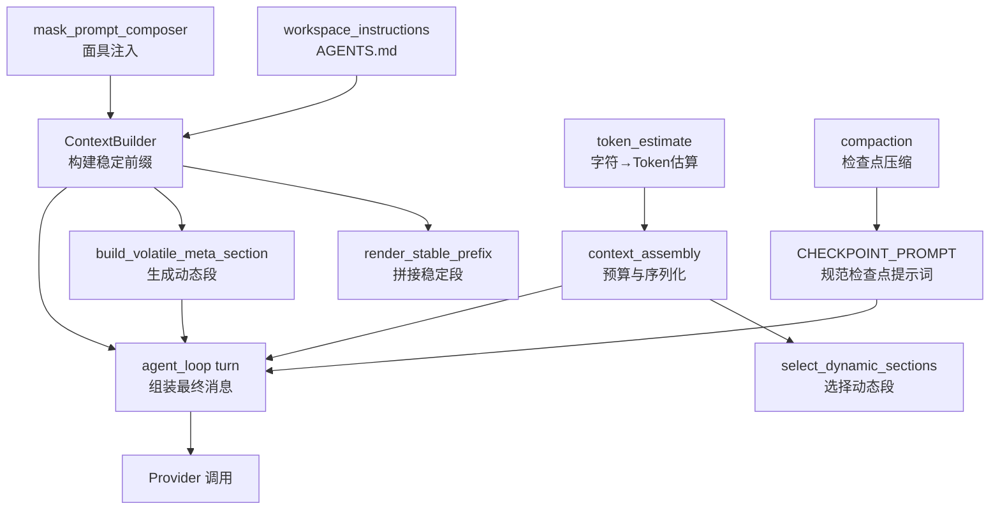
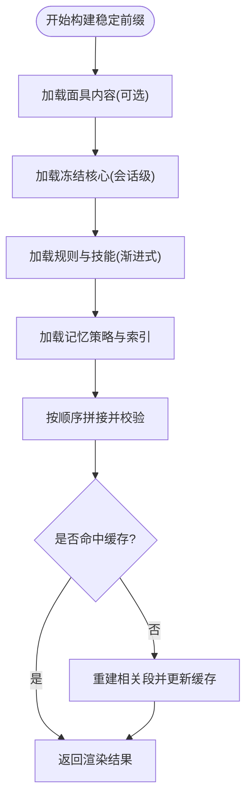
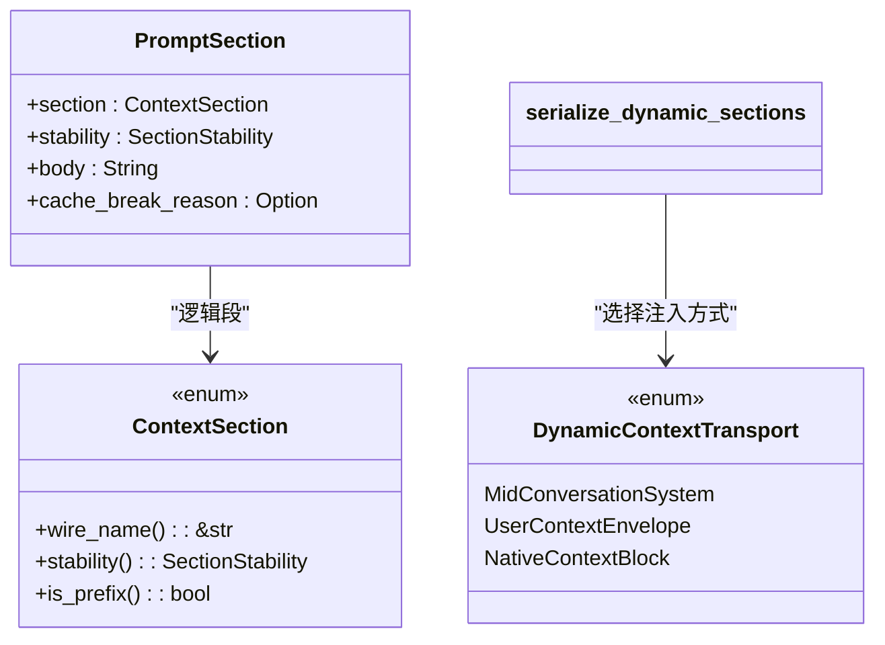
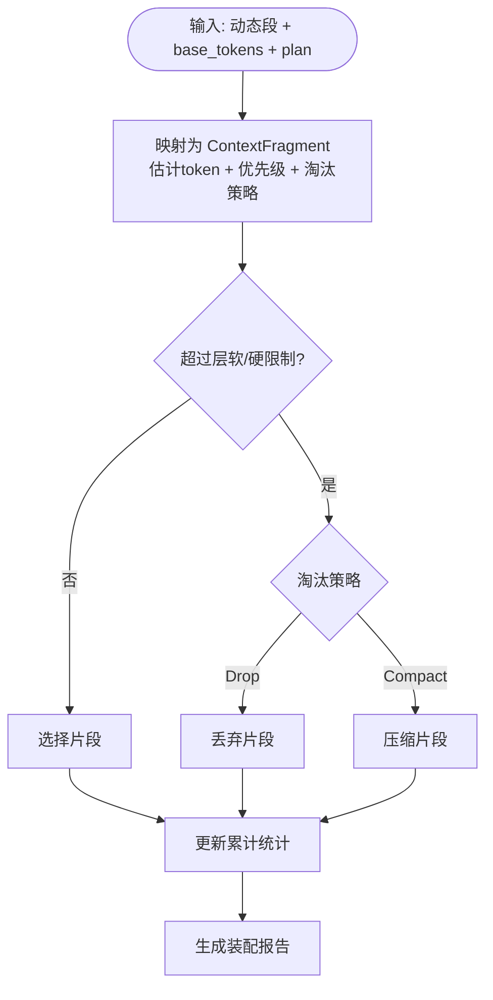
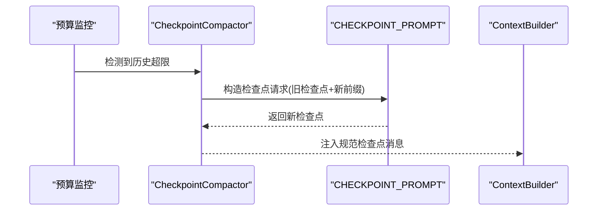
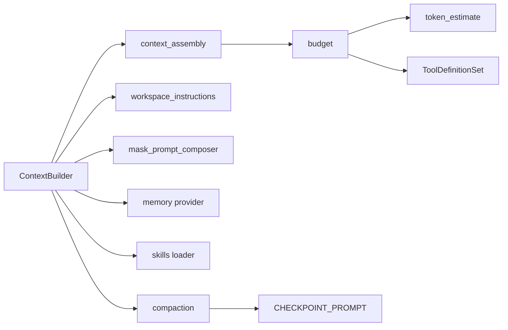

# 提示词生成

<cite>
**本文引用的文件**
- [agent-diva-agent/src/context.rs](file://agent-diva-agent/src/context.rs)
- [agent-diva-agent/src/context_assembly/mod.rs](file://agent-diva-agent/src/context_assembly/mod.rs)
- [agent-diva-agent/src/context_assembly/budget.rs](file://agent-diva-agent/src/context_assembly/budget.rs)
- [agent-diva-agent/src/token_estimate.rs](file://agent-diva-agent/src/token_estimate.rs)
- [agent-diva-agent/src/compaction/prompt.rs](file://agent-diva-agent/src/compaction/prompt.rs)
- [agent-diva-agent/src/compaction/mod.rs](file://agent-diva-agent/src/compaction/mod.rs)
- [agent-diva-agent/src/workspace_instructions.rs](file://agent-diva-agent/src/workspace_instructions.rs)
- [agent-diva-agent/src/mask/mask_prompt_composer.rs](file://agent-diva-agent/src/mask/mask_prompt_composer.rs)
- [agent-diva-agent/src/agent_loop/turn/context.rs](file://agent-diva-agent/src/agent_loop/turn/context.rs)
- [agent-diva-agent/src/agent_loop/turn/iteration.rs](file://agent-diva-agent/src/agent_loop/turn/iteration.rs)
</cite>

## 目录
1. [简介](#简介)
2. [项目结构](#项目结构)
3. [核心组件](#核心组件)
4. [架构总览](#架构总览)
5. [详细组件分析](#详细组件分析)
6. [依赖关系分析](#依赖关系分析)
7. [性能与优化](#性能与优化)
8. [故障排查指南](#故障排查指南)
9. [结论](#结论)
10. [附录](#附录)

## 简介
本章节聚焦“提示词生成阶段”：在每次调用大模型前，系统如何根据当前会话、策略配置、工具描述、工作区规则、记忆策略等上下文信息，动态构建发送给 LLM 的提示词。文档涵盖模板系统、变量替换、格式化处理、多语言支持、上下文裁剪、token 估算与预算控制、压缩与检查点机制，以及调试与性能优化建议。

## 项目结构
提示词生成由多个模块协作完成：
- 稳定前缀（System Prompt）：身份、面具、冻结核心、规则与技能、记忆策略与索引等，按固定顺序渲染到首个 system 消息，用于缓存命中。
- 动态后缀：时间、通道、会话元数据、计划守卫、当前用户消息等，封装为带 section 标记的用户或中间 system 消息。
- 预算与裁剪：基于层和区域的软/硬限制，决定保留、压缩或丢弃哪些片段。
- Token 估算：轻量级启发式估算，支撑预算决策。
- 压缩与检查点：将长对话历史压缩为结构化摘要，作为“规范检查点”注入。
- 工作区指令与面具：AGENTS.md 与面具内容注入，提供项目级与角色级指令。



图表来源
- [agent-diva-agent/src/context.rs:130-157](file://agent-diva-agent/src/context.rs#L130-L157)
- [agent-diva-agent/src/context_assembly/mod.rs:174-229](file://agent-diva-agent/src/context_assembly/mod.rs#L174-L229)
- [agent-diva-agent/src/context_assembly/budget.rs:119-178](file://agent-diva-agent/src/context_assembly/budget.rs#L119-L178)
- [agent-diva-agent/src/token_estimate.rs:20-44](file://agent-diva-agent/src/token_estimate.rs#L20-L44)
- [agent-diva-agent/src/compaction/prompt.rs:1-31](file://agent-diva-agent/src/compaction/prompt.rs#L1-L31)
- [agent-diva-agent/src/workspace_instructions.rs:46-86](file://agent-diva-agent/src/workspace_instructions.rs#L46-L86)
- [agent-diva-agent/src/mask/mask_prompt_composer.rs:12-33](file://agent-diva-agent/src/mask/mask_prompt_composer.rs#L12-L33)
- [agent-diva-agent/src/agent_loop/turn/context.rs:68-90](file://agent-diva-agent/src/agent_loop/turn/context.rs#L68-L90)

章节来源
- [agent-diva-agent/src/context.rs:130-157](file://agent-diva-agent/src/context.rs#L130-L157)
- [agent-diva-agent/src/context_assembly/mod.rs:174-229](file://agent-diva-agent/src/context_assembly/mod.rs#L174-L229)
- [agent-diva-agent/src/context_assembly/budget.rs:119-178](file://agent-diva-agent/src/context_assembly/budget.rs#L119-L178)
- [agent-diva-agent/src/token_estimate.rs:20-44](file://agent-diva-agent/src/token_estimate.rs#L20-L44)
- [agent-diva-agent/src/compaction/prompt.rs:1-31](file://agent-diva-agent/src/compaction/prompt.rs#L1-L31)
- [agent-diva-agent/src/workspace_instructions.rs:46-86](file://agent-diva-agent/src/workspace_instructions.rs#L46-L86)
- [agent-diva-agent/src/mask/mask_prompt_composer.rs:12-33](file://agent-diva-agent/src/mask/mask_prompt_composer.rs#L12-L33)
- [agent-diva-agent/src/agent_loop/turn/context.rs:68-90](file://agent-diva-agent/src/agent_loop/turn/context.rs#L68-L90)

## 核心组件
- ContextBuilder：负责构建稳定前缀（system prompt）与完整消息列表；维护会话级稳定段缓存与失效策略。
- context_assembly：定义稳定的段类型、顺序、稳定性分类与序列化协议；提供动态段序列化与错误约束。
- budget：层与区域预算规划、片段优先级与淘汰策略；测量并报告上下文使用。
- token_estimate：轻量级字符→token估算，用于预算计算与监控。
- compaction：将长历史压缩为规范检查点，并提供检查点提示词模板。
- workspace_instructions：读取 AGENTS.md，截断并附加审计头与安全契约。
- mask_prompt_composer：从面具中提取可注入的系统提示文本。
- agent_loop turn：在每轮中组装消息、应用预算与压缩、清理无效消息后调用 Provider。

章节来源
- [agent-diva-agent/src/context.rs:53-157](file://agent-diva-agent/src/context.rs#L53-L157)
- [agent-diva-agent/src/context_assembly/mod.rs:26-124](file://agent-diva-agent/src/context_assembly/mod.rs#L26-L124)
- [agent-diva-agent/src/context_assembly/budget.rs:13-117](file://agent-diva-agent/src/context_assembly/budget.rs#L13-L117)
- [agent-diva-agent/src/token_estimate.rs:20-81](file://agent-diva-agent/src/token_estimate.rs#L20-L81)
- [agent-diva-agent/src/compaction/mod.rs:1-33](file://agent-diva-agent/src/compaction/mod.rs#L1-L33)
- [agent-diva-agent/src/workspace_instructions.rs:31-86](file://agent-diva-agent/src/workspace_instructions.rs#L31-L86)
- [agent-diva-agent/src/mask/mask_prompt_composer.rs:12-33](file://agent-diva-agent/src/mask/mask_prompt_composer.rs#L12-L33)
- [agent-diva-agent/src/agent_loop/turn/context.rs:68-90](file://agent-diva-agent/src/agent_loop/turn/context.rs#L68-L90)

## 架构总览
提示词生成的整体流程如下：
- 稳定前缀构建：按固定顺序合并面具/身份、冻结核心、规则与技能、记忆策略与索引，输出到首个 system 消息，便于缓存。
- 动态段序列化：将时间、通道、会话元数据、计划守卫等封装为带 section 标签的消息，置于历史之后、当前用户消息之前。
- 预算与裁剪：依据层与区域预算，对可选片段进行保留、压缩或丢弃，确保不超过总上限。
- 检查点注入：当历史过长时，通过压缩器生成规范检查点，作为独立区域注入。
- 消息清洗：移除孤儿 tool 消息或不完整的 tool_calls，避免 Provider 拒绝请求。
- 调用 Provider：最终消息列表发送至模型。

```mermaid
sequenceDiagram
participant Loop as "AgentLoop"
participant Builder as "ContextBuilder"
participant Assembly as "context_assembly"
participant Budget as "budget"
participant Compactor as "compaction"
participant Provider as "Provider"
Loop->>Builder : build_prefix_messages_for_session()
Builder-->>Loop : 稳定前缀(system) + 历史
Loop->>Assembly : serialize_dynamic_sections(动态段, transport)
Assembly-->>Loop : 动态消息(可选)
Loop->>Budget : select_dynamic_sections(动态段, base_tokens, plan)
Budget-->>Loop : 选择的动态段 + 报告
Loop->>Compactor : 需要时生成规范检查点
Compactor-->>Loop : 检查点消息(可选)
Loop->>Builder : sanitize_messages_for_provider()
Builder-->>Loop : 清洗后的消息
Loop->>Provider : 发送 messages
```

图表来源
- [agent-diva-agent/src/context.rs:570-663](file://agent-diva-agent/src/context.rs#L570-L663)
- [agent-diva-agent/src/context_assembly/mod.rs:191-229](file://agent-diva-agent/src/context_assembly/mod.rs#L191-L229)
- [agent-diva-agent/src/context_assembly/budget.rs:230-285](file://agent-diva-agent/src/context_assembly/budget.rs#L230-L285)
- [agent-diva-agent/src/compaction/prompt.rs:1-31](file://agent-diva-agent/src/compaction/prompt.rs#L1-L31)
- [agent-diva-agent/src/agent_loop/turn/context.rs:68-90](file://agent-diva-agent/src/agent_loop/turn/context.rs#L68-L90)

## 详细组件分析

### 稳定前缀与模板系统
- 稳定段类型与顺序：定义 MaskAndIdentity、FrozenCore、AgentRulesAndSkills、MemoryPolicyAndIndex 等，保证首次 system 消息的顺序一致，利于缓存。
- 渲染函数：render_stable_prefix 校验仅包含稳定段并按顺序拼接；失败时回退为简单拼接。
- 变量替换与格式化：
  - 工作区路径、时间、通道、聊天 ID 等通过字符串格式化注入。
  - AGENTS.md 读取并截断至字符预算，附带源路径、摘要与安全契约。
  - 面具内容仅在非默认且非空时注入到最顶部。
- 缓存与失效：按 session_key 缓存稳定段与渲染结果；当面具、记忆版本、技能 epoch 变化时触发局部重建。



图表来源
- [agent-diva-agent/src/context.rs:342-495](file://agent-diva-agent/src/context.rs#L342-L495)
- [agent-diva-agent/src/context_assembly/mod.rs:174-189](file://agent-diva-agent/src/context_assembly/mod.rs#L174-L189)
- [agent-diva-agent/src/workspace_instructions.rs:46-86](file://agent-diva-agent/src/workspace_instructions.rs#L46-L86)
- [agent-diva-agent/src/mask/mask_prompt_composer.rs:12-33](file://agent-diva-agent/src/mask/mask_prompt_composer.rs#L12-L33)

章节来源
- [agent-diva-agent/src/context.rs:342-495](file://agent-diva-agent/src/context.rs#L342-L495)
- [agent-diva-agent/src/context_assembly/mod.rs:174-189](file://agent-diva-agent/src/context_assembly/mod.rs#L174-L189)
- [agent-diva-agent/src/workspace_instructions.rs:46-86](file://agent-diva-agent/src/workspace_instructions.rs#L46-L86)
- [agent-diva-agent/src/mask/mask_prompt_composer.rs:12-33](file://agent-diva-agent/src/mask/mask_prompt_composer.rs#L12-L33)

### 动态段与上下文信封
- 动态段包括 VolatileMeta、PlanGuard、SessionCheckpoint、PrefetchRecall、CurrentUser 等，均为 TurnVolatile。
- 序列化：serialize_dynamic_sections 将动态段按顺序包裹为带 section 标签的 XML 风格块，再转为 user 或 mid-conversation system 消息。
- 传输策略：DynamicContextTransport 决定注入位置；不支持原生上下文块时关闭。



图表来源
- [agent-diva-agent/src/context_assembly/mod.rs:26-124](file://agent-diva-agent/src/context_assembly/mod.rs#L26-L124)
- [agent-diva-agent/src/context_assembly/mod.rs:191-229](file://agent-diva-agent/src/context_assembly/mod.rs#L191-L229)

章节来源
- [agent-diva-agent/src/context_assembly/mod.rs:26-124](file://agent-diva-agent/src/context_assembly/mod.rs#L26-L124)
- [agent-diva-agent/src/context_assembly/mod.rs:191-229](file://agent-diva-agent/src/context_assembly/mod.rs#L191-L229)

### 预算、裁剪与报告
- 三层区域：StablePrefix、CanonicalCheckpoint、ActiveTail，分别对应稳定前缀、规范检查点、活跃尾部。
- 多层预算：FrozenCoreAndRules、ToolSchemasCore/Deferred、L1Index、SessionCheckpoint、PrefetchRecall、CompactionSummaries、History、ToolResultInline、CurrentTurn。
- 选择策略：根据层软/硬限制与总预算，决定 Drop、Compact 或保留；优先保护必要片段（如 SessionCheckpoint、CurrentUser）。
- 报告：记录 selected/dropped/compacted、各层与各区域总计，便于观测压力与调优。



图表来源
- [agent-diva-agent/src/context_assembly/budget.rs:119-178](file://agent-diva-agent/src/context_assembly/budget.rs#L119-L178)
- [agent-diva-agent/src/context_assembly/budget.rs:230-285](file://agent-diva-agent/src/context_assembly/budget.rs#L230-L285)
- [agent-diva-agent/src/context_assembly/budget.rs:373-415](file://agent-diva-agent/src/context_assembly/budget.rs#L373-L415)

章节来源
- [agent-diva-agent/src/context_assembly/budget.rs:119-178](file://agent-diva-agent/src/context_assembly/budget.rs#L119-L178)
- [agent-diva-agent/src/context_assembly/budget.rs:230-285](file://agent-diva-agent/src/context_assembly/budget.rs#L230-L285)
- [agent-diva-agent/src/context_assembly/budget.rs:373-415](file://agent-diva-agent/src/context_assembly/budget.rs#L373-L415)

### Token 估算与多语言支持
- 估算公式：chars/4 × 4/3 ≈ chars/3，兼容 Unicode，适用于英文、中文、代码混合场景。
- 消息级估算：计入 content、reasoning_content、tool_calls、thinking_blocks 的 JSON 序列化长度。
- 多语言：基于字符计数而非字节，天然支持多语言；测试覆盖中英文混合与 emoji。

章节来源
- [agent-diva-agent/src/token_estimate.rs:20-81](file://agent-diva-agent/src/token_estimate.rs#L20-L81)
- [agent-diva-agent/src/token_estimate.rs:83-237](file://agent-diva-agent/src/token_estimate.rs#L83-L237)

### 压缩与规范检查点
- 压缩目标：将长历史机械折叠为结构化摘要，保留关键标识符、路径、命令、决策、阻塞项与 artifact 引用。
- 提示词模板：CHECKPOINT_SYSTEM_PROMPT 指定输出结构与约束；checkpoint_request 组装旧检查点与新压缩前缀。
- 集成点：在预算不足或历史过长时触发，作为 CanonicalCheckpoint 区域注入。



图表来源
- [agent-diva-agent/src/compaction/prompt.rs:1-31](file://agent-diva-agent/src/compaction/prompt.rs#L1-L31)
- [agent-diva-agent/src/compaction/mod.rs:1-33](file://agent-diva-agent/src/compaction/mod.rs#L1-L33)

章节来源
- [agent-diva-agent/src/compaction/prompt.rs:1-31](file://agent-diva-agent/src/compaction/prompt.rs#L1-L31)
- [agent-diva-agent/src/compaction/mod.rs:1-33](file://agent-diva-agent/src/compaction/mod.rs#L1-L33)

### 工作区指令与面具注入
- AGENTS.md：读取根目录指令，截断至 4000 字符，附加源路径、SHA256 摘要与“安全契约”，注入为 Agent Rules 段落。
- 面具：非默认面具且非空时，将其 body 注入到最顶部，覆盖默认身份，实现角色化提示。

章节来源
- [agent-diva-agent/src/workspace_instructions.rs:46-86](file://agent-diva-agent/src/workspace_instructions.rs#L46-L86)
- [agent-diva-agent/src/workspace_instructions.rs:99-113](file://agent-diva-agent/src/workspace_instructions.rs#L99-L113)
- [agent-diva-agent/src/mask/mask_prompt_composer.rs:12-33](file://agent-diva-agent/src/mask/mask_prompt_composer.rs#L12-L33)

### 消息清洗与 Provider 兼容性
- 清理孤儿 tool 消息与不完整的 tool_calls，避免 DeepSeek 等 Provider 返回 HTTP 400。
- 恢复历史中的 assistant tool_calls 与 reasoning/thinking 字段，保证多轮一致性。

章节来源
- [agent-diva-agent/src/context.rs:665-725](file://agent-diva-agent/src/context.rs#L665-L725)
- [agent-diva-agent/src/context.rs:624-663](file://agent-diva-agent/src/context.rs#L624-L663)

## 依赖关系分析
- ContextBuilder 依赖：
  - context_assembly：段类型、顺序、序列化与错误约束。
  - workspace_instructions：AGENTS.md 指令。
  - mask_prompt_composer：面具注入。
  - memory provider：记忆策略与索引。
  - skills loader：技能目录与摘要。
- budget 依赖：
  - token_estimate：片段 token 估算。
  - ToolDefinitionSet：工具 schema 分层与核心/延迟区分。
- compaction 依赖：
  - CHECKPOINT_PROMPT：检查点提示词模板。
  - 预算监控：决定是否触发压缩。



图表来源
- [agent-diva-agent/src/context.rs:53-157](file://agent-diva-agent/src/context.rs#L53-L157)
- [agent-diva-agent/src/context_assembly/budget.rs:119-178](file://agent-diva-agent/src/context_assembly/budget.rs#L119-L178)
- [agent-diva-agent/src/compaction/prompt.rs:1-31](file://agent-diva-agent/src/compaction/prompt.rs#L1-L31)

章节来源
- [agent-diva-agent/src/context.rs:53-157](file://agent-diva-agent/src/context.rs#L53-L157)
- [agent-diva-agent/src/context_assembly/budget.rs:119-178](file://agent-diva-agent/src/context_assembly/budget.rs#L119-L178)
- [agent-diva-agent/src/compaction/prompt.rs:1-31](file://agent-diva-agent/src/compaction/prompt.rs#L1-L31)

## 性能与优化
- 稳定前缀缓存：按 session_key 缓存渲染结果与段快照；变更时仅重建受影响段，减少重复计算。
- 层/区域预算：通过软/硬限制与优先级，避免历史与工具结果抢占系统指令空间。
- Token 估算开销低：chars/3 启发式，无外部依赖，适合高频调用。
- 压缩策略：当历史过长时，用规范检查点替代大量原始消息，显著降低上下文窗口占用。
- 工具 schema 分层：核心工具 schema 始终保留，延迟工具 schema 在压力下可丢弃，平衡能力与成本。
- 消息清洗：提前修复不完整 tool_calls，减少 Provider 重试与错误处理开销。

[本节为通用指导，无需特定文件引用]

## 故障排查指南
- 稳定段违反合同：若 render_stable_prefix 报错，检查是否混入 TurnVolatile 段；确认顺序与稳定性分类正确。
- 动态段包含稳定段：serialize_dynamic_sections 会拒绝；确保动态段仅包含 TurnVolatile。
- Provider 400 错误：检查是否存在孤儿 tool 消息或不完整 tool_calls；使用 sanitize_messages_for_provider 清理。
- 预算超限：查看 ContextAssemblyReport 的 dropped/compacted 原因；调整 BudgetConfig 或优化历史/工具结果大小。
- AGENTS.md 未生效：确认文件存在且非空；检查截断标志与摘要；确保工作区路径正确。
- 面具未注入：确认面具非默认且 body 非空；检查 compose 返回值。

章节来源
- [agent-diva-agent/src/context_assembly/mod.rs:174-229](file://agent-diva-agent/src/context_assembly/mod.rs#L174-L229)
- [agent-diva-agent/src/context.rs:665-725](file://agent-diva-agent/src/context.rs#L665-L725)
- [agent-diva-agent/src/context_assembly/budget.rs:230-285](file://agent-diva-agent/src/context_assembly/budget.rs#L230-L285)
- [agent-diva-agent/src/workspace_instructions.rs:46-86](file://agent-diva-agent/src/workspace_instructions.rs#L46-L86)
- [agent-diva-agent/src/mask/mask_prompt_composer.rs:12-33](file://agent-diva-agent/src/mask/mask_prompt_composer.rs#L12-L33)

## 结论
提示词生成本次实现以“稳定前缀 + 动态后缀 + 预算裁剪 + 压缩检查点”为核心，兼顾缓存命中、上下文质量与成本可控。通过严格的段类型与顺序、层/区域预算、轻量 token 估算与消息清洗，系统在多语言、长对话与复杂工具场景下保持稳定与高效。未来可进一步细化压缩质量门控与更精细的工具 schema 管理。

[本节为总结性内容，无需特定文件引用]

## 附录
- 调试建议：
  - 启用装配报告日志，观察 selected/dropped/compacted 与 totals_by_layer/region。
  - 打印 base_tokens 与 total_estimated，定位超限原因。
  - 检查 AGENTS.md 与面具注入状态，确认内容与截断标志。
- 优化建议：
  - 调整 BudgetConfig 的 system_budget_ratio 与 max_tokens，平衡系统与历史空间。
  - 对超长工具结果采用 artifact 引用或微压缩，减少 ToolResultInline 层压力。
  - 定期刷新技能目录与记忆索引，确保稳定前缀缓存有效。

[本节为通用指导，无需特定文件引用]