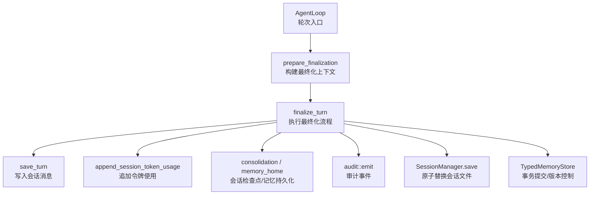
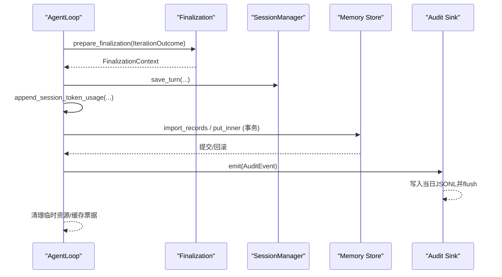
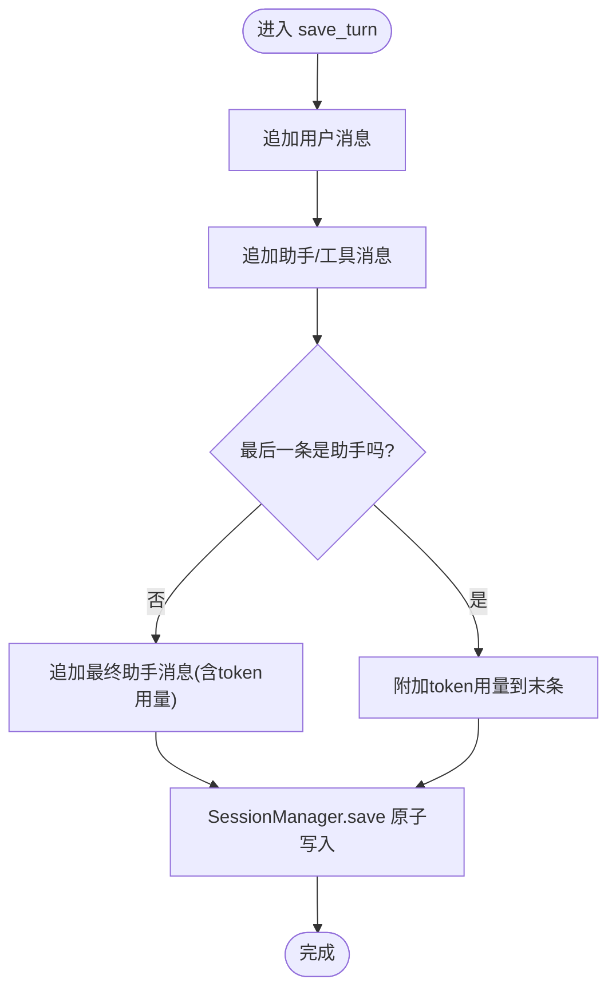
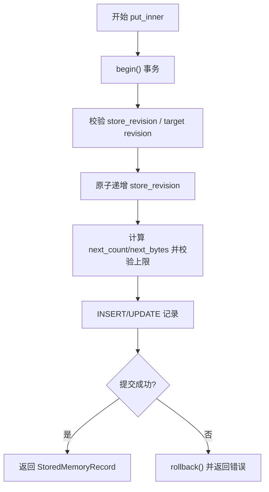
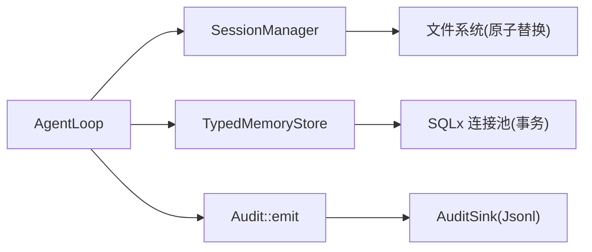

# 最终化

<cite>
**本文引用的文件**
- [loop_turn.rs](file://agent-diva-agent/src/agent_loop/loop_turn.rs)
- [finalize.rs](file://agent-diva-agent/src/agent_loop/turn/finalize.rs)
- [manager.rs](file://agent-diva-core/src/session/manager.rs)
- [audit.rs](file://agent-diva-core/src/audit.rs)
- [audit_sink.rs](file://agent-diva-core/src/audit_sink.rs)
- [typed_store.rs](file://agent-diva-laputa/src/typed_store.rs)
- [memory_home.rs](file://agent-diva-laputa/src/bml/memory_home.rs)
</cite>

## 目录
1. [简介](#简介)
2. [项目结构](#项目结构)
3. [核心组件](#核心组件)
4. [架构总览](#架构总览)
5. [详细组件分析](#详细组件分析)
6. [依赖关系分析](#依赖关系分析)
7. [性能考量](#性能考量)
8. [故障排查指南](#故障排查指南)
9. [结论](#结论)
10. [附录](#附录)

## 简介
本文件聚焦“最终化”阶段：在一次 turn 处理完成后，系统如何完成清理与资源释放、更新会话状态、持久化记忆、记录审计日志、回收资源，以及事务提交机制、错误恢复策略和与其他系统的协调工作。同时给出失败场景的处理方案与回滚思路，帮助读者理解从“轮次结束”到“数据一致落盘”的完整闭环。

## 项目结构
围绕最终化的关键路径涉及以下模块：
- Agent 层：轮次执行与最终化编排（loop_turn.rs、finalize.rs）
- 会话管理：会话加载/保存、原子写入（manager.rs）
- 审计系统：结构化事件与可插拔输出（audit.rs、audit_sink.rs）
- 记忆存储：带事务与版本控制的内存记录持久化（typed_store.rs），会话级检查点（memory_home.rs）

图表来源
- [loop_turn.rs:312-756](file://agent-diva-agent/src/agent_loop/loop_turn.rs#L312-L756)
- [finalize.rs:274-291](file://agent-diva-agent/src/agent_loop/turn/finalize.rs#L274-L291)
- [manager.rs:190-250](file://agent-diva-core/src/session/manager.rs#L190-L250)
- [audit.rs:224-253](file://agent-diva-core/src/audit.rs#L224-L253)
- [typed_store.rs:915-1023](file://agent-diva-laputa/src/typed_store.rs#L915-L1023)
- [memory_home.rs:444-475](file://agent-diva-laputa/src/bml/memory_home.rs#L444-L475)

章节来源
- [loop_turn.rs:312-756](file://agent-diva-agent/src/agent_loop/loop_turn.rs#L312-L756)
- [finalize.rs:274-291](file://agent-diva-agent/src/agent_loop/turn/finalize.rs#L274-L291)

## 核心组件
- 轮次最终化编排：在轮次主循环结束后，构造 FinalizationContext 并调用 finalize_turn，统一触发会话持久化、令牌用量追加、记忆持久化与审计记录。
- 会话持久化：将本轮用户输入、助手回复、工具结果等写入会话 JSONL，并通过原子替换保证一致性。
- 令牌用量记账：将本轮 token 用量追加到按会话分区的账本文件中，便于预算与统计。
- 记忆持久化：为会话生成检查点或写入 typed store，采用事务与版本控制确保一致性。
- 审计日志：通过 audit::emit 输出结构化事件，并由全局 sink 写入每日滚动 JSONL 文件。

章节来源
- [loop_turn.rs:729-756](file://agent-diva-agent/src/agent_loop/loop_turn.rs#L729-L756)
- [loop_turn.rs:872-965](file://agent-diva-agent/src/agent_loop/loop_turn.rs#L872-L965)
- [manager.rs:190-250](file://agent-diva-core/src/session/manager.rs#L190-L250)
- [audit.rs:224-253](file://agent-diva-core/src/audit.rs#L224-L253)
- [typed_store.rs:915-1023](file://agent-diva-laputa/src/typed_store.rs#L915-L1023)
- [memory_home.rs:444-475](file://agent-diva-laputa/src/bml/memory_home.rs#L444-L475)

## 架构总览
下图展示一次 turn 的最终化时序：从迭代产出到多子系统落盘与审计。

图表来源
- [loop_turn.rs:729-756](file://agent-diva-agent/src/agent_loop/loop_turn.rs#L729-L756)
- [loop_turn.rs:872-965](file://agent-diva-agent/src/agent_loop/loop_turn.rs#L872-L965)
- [typed_store.rs:915-1023](file://agent-diva-laputa/src/typed_store.rs#L915-L1023)
- [audit_sink.rs:196-257](file://agent-diva-core/src/audit_sink.rs#L196-L257)

## 详细组件分析

### 轮次最终化编排（AgentLoop）
- 迭代结束后，根据是否停止于计划审批、是否仅工具调用等分支，合成最终内容。
- 构造 FinalizationContext，包含消息、会话键、模型、trace_id 等元信息。
- 调用 finalize_turn 统一执行：
  - 会话消息落盘（save_turn）
  - 令牌用量追加（append_session_token_usage）
  - 记忆持久化（consolidation/memory_home）
  - 审计事件记录（audit::emit）
  - 资源清理（如放弃缓存票据）

章节来源
- [loop_turn.rs:715-756](file://agent-diva-agent/src/agent_loop/loop_turn.rs#L715-L756)
- [finalize.rs:274-291](file://agent-diva-agent/src/agent_loop/turn/finalize.rs#L274-L291)

### 会话持久化（save_turn + SessionManager.save）
- save_turn 负责将本轮用户消息、助手消息、工具结果写入会话对象；若最后一条不是助手消息，则追加最终回复并携带 token 用量。
- SessionManager.save 将会话序列化为 JSONL，并使用原子替换（临时文件+rename+父目录同步）确保崩溃安全。
- 支持 before_rename 钩子，可用于在重命名前做额外校验或埋点。

图表来源
- [loop_turn.rs:872-965](file://agent-diva-agent/src/agent_loop/loop_turn.rs#L872-L965)
- [manager.rs:190-250](file://agent-diva-core/src/session/manager.rs#L190-L250)

章节来源
- [loop_turn.rs:872-965](file://agent-diva-agent/src/agent_loop/loop_turn.rs#L872-L965)
- [manager.rs:190-250](file://agent-diva-core/src/session/manager.rs#L190-L250)

### 令牌用量记账
- 从 LLM 响应 usage map 提取 prompt/completion/total tokens，合并为本轮用量。
- 以会话为单位追加到 JsonlTokenLedger，便于后续预算检查与统计。

章节来源
- [loop_turn.rs:287-310](file://agent-diva-agent/src/agent_loop/loop_turn.rs#L287-L310)
- [loop_turn.rs:967-980](file://agent-diva-agent/src/agent_loop/loop_turn.rs#L967-L980)

### 记忆持久化与事务提交（TypedMemoryStore）
- 会话检查点：memory_home 基于 session_id 渲染检查点块并以 MemoryRecord 形式写入 typed store，附带 provenance、sensitivity、trust 等元数据。
- 写入路径：put_inner 开启事务，先校验 store_revision 与 record_revision，再原子递增 store_revision，随后插入/更新记录并校验容量上限。
- 容量与冲突：超出容量或版本冲突会返回错误，调用方应据此重试或降级。
- 会话清理：gc_session_scoped 按外键顺序物理删除会话范围记录，避免孤儿数据。

图表来源
- [typed_store.rs:915-1023](file://agent-diva-laputa/src/typed_store.rs#L915-L1023)
- [typed_store.rs:745-829](file://agent-diva-laputa/src/typed_store.rs#L745-L829)
- [memory_home.rs:444-475](file://agent-diva-laputa/src/bml/memory_home.rs#L444-L475)

章节来源
- [typed_store.rs:915-1023](file://agent-diva-laputa/src/typed_store.rs#L915-L1023)
- [typed_store.rs:745-829](file://agent-diva-laputa/src/typed_store.rs#L745-L829)
- [memory_home.rs:444-475](file://agent-diva-laputa/src/bml/memory_home.rs#L444-L475)

### 审计日志记录（audit::emit + AuditSink）
- 所有重要事件通过 audit::emit 输出，目标为 tracing 的 "audit" 通道。
- 全局 sink 注册后，每个事件会被转发到实现（默认 JsonlAuditSink）。
- JsonlAuditSink 按日滚动写入 {workspace}/.agent-diva/audit/audit-YYYY-MM-DD.jsonl，并在每次写入后 flush，保证同进程可读。
- 写入/滚动失败被吞掉，不中断业务逻辑。

章节来源
- [audit.rs:224-253](file://agent-diva-core/src/audit.rs#L224-L253)
- [audit_sink.rs:80-94](file://agent-diva-core/src/audit_sink.rs#L80-L94)
- [audit_sink.rs:196-257](file://agent-diva-core/src/audit_sink.rs#L196-L257)

### 资源清理与缓存票据
- 在模型流收集阶段，若提前退出或发生错误，会调用 cache_observer.abandon_call 放弃缓存票据，避免泄漏。
- 最终化阶段不再持有大对象引用，交由 GC 回收；审计 sink 内部使用 BufWriter 缓冲并定期 flush。

章节来源
- [loop_turn.rs:472-489](file://agent-diva-agent/src/agent_loop/loop_turn.rs#L472-L489)
- [audit_sink.rs:145-194](file://agent-diva-core/src/audit_sink.rs#L145-L194)

## 依赖关系分析
- AgentLoop 依赖 SessionManager 进行会话持久化，依赖 TypedMemoryStore 进行记忆持久化，依赖 audit 系统进行审计。
- SessionManager 提供原子写入能力，保障崩溃一致性。
- TypedMemoryStore 通过事务与版本号保证并发安全与幂等导入。
- AuditSink 作为可插拔后端，解耦审计事件与落地方式。

图表来源
- [loop_turn.rs:729-756](file://agent-diva-agent/src/agent_loop/loop_turn.rs#L729-L756)
- [manager.rs:190-250](file://agent-diva-core/src/session/manager.rs#L190-L250)
- [typed_store.rs:915-1023](file://agent-diva-laputa/src/typed_store.rs#L915-L1023)
- [audit_sink.rs:196-257](file://agent-diva-core/src/audit_sink.rs#L196-L257)

章节来源
- [loop_turn.rs:729-756](file://agent-diva-agent/src/agent_loop/loop_turn.rs#L729-L756)
- [manager.rs:190-250](file://agent-diva-core/src/session/manager.rs#L190-L250)
- [typed_store.rs:915-1023](file://agent-diva-laputa/src/typed_store.rs#L915-L1023)
- [audit_sink.rs:196-257](file://agent-diva-core/src/audit_sink.rs#L196-L257)

## 性能考量
- 会话保存采用原子替换，避免部分写入导致的损坏；写入前序列化全部行，适合中等规模会话。
- 审计 sink 使用 BufWriter 并按日滚动，减少频繁打开/关闭文件的开销。
- 记忆存储通过一次性 import_records 批量写入，降低事务次数；容量上限防止单组件膨胀。
- 令牌用量追加为轻量 IO，建议批量化或异步化以降低热点。

[本节为通用指导，无需具体文件引用]

## 故障排查指南
- 会话保存失败
  - 现象：原子替换失败，保留旧文件；需检查磁盘空间、权限、父目录同步。
  - 定位：SessionManager.save_atomic 的 before_rename 钩子与 rename 步骤。
  - 参考：[manager.rs:324-347](file://agent-diva-core/src/session/manager.rs#L324-L347)

- 记忆存储容量超限或版本冲突
  - 现象：put_inner 返回容量错误或版本冲突；需检查 store_revision 与 record_revision 传递是否正确。
  - 定位：typed_store 的版本校验与容量计算。
  - 参考：[typed_store.rs:915-1023](file://agent-diva-laputa/src/typed_store.rs#L915-L1023)

- 审计写入失败
  - 现象：sink 写入或滚动失败，但业务不受影响；查看日志中的 error 提示。
  - 定位：JsonlAuditSink 的 roll_if_needed 与 emit 路径。
  - 参考：[audit_sink.rs:209-257](file://agent-diva-core/src/audit_sink.rs#L209-L257)

- 模型流提前退出导致缓存票据泄漏
  - 现象：缓存票据未释放；确认 abandon_call 是否在所有 early-return 路径调用。
  - 参考：[loop_turn.rs:472-489](file://agent-diva-agent/src/agent_loop/loop_turn.rs#L472-L489)

章节来源
- [manager.rs:324-347](file://agent-diva-core/src/session/manager.rs#L324-L347)
- [typed_store.rs:915-1023](file://agent-diva-laputa/src/typed_store.rs#L915-L1023)
- [audit_sink.rs:209-257](file://agent-diva-core/src/audit_sink.rs#L209-L257)
- [loop_turn.rs:472-489](file://agent-diva-agent/src/agent_loop/loop_turn.rs#L472-L489)

## 结论
最终化阶段通过统一的编排入口，将会话持久化、令牌用量记账、记忆持久化与审计记录串联起来，借助原子写入、事务与版本控制确保数据一致性。审计 sink 的健壮性设计使日志失败不影响主流程。对于失败场景，建议在调用方侧捕获版本冲突与容量错误，实施重试、降级或告警；对会话保存失败，利用原子替换特性自动回滚到上一版本。整体设计兼顾了可靠性与可观测性。

[本节为总结，无需具体文件引用]

## 附录
- 术语
  - 最终化：一轮 turn 处理完成后，完成状态更新、持久化、审计与资源清理的过程。
  - 会话检查点：以会话维度记录的快照，用于跨会话或长期记忆聚合。
  - 审计事件：系统运行过程中的结构化事件，用于追踪与回放。

[本节为概念说明，无需具体文件引用]