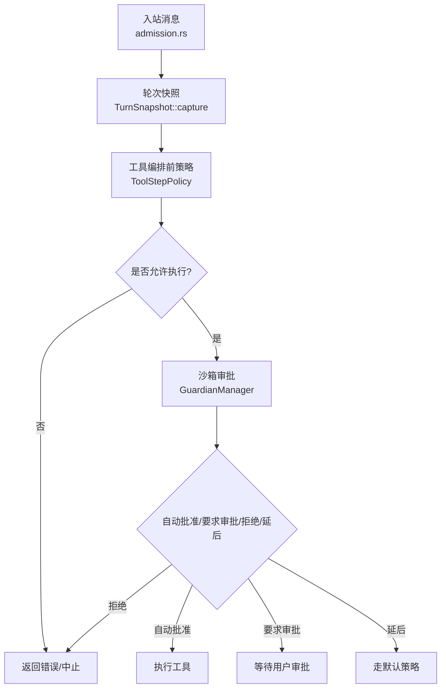
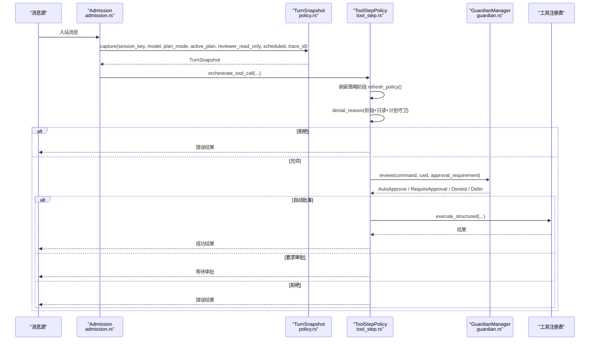
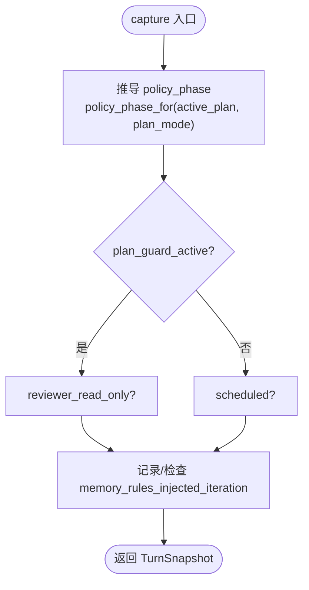
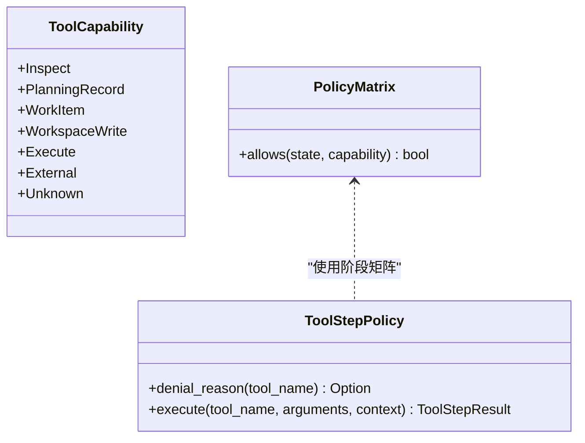
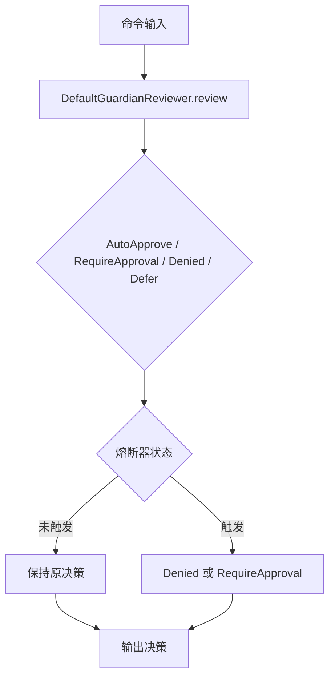
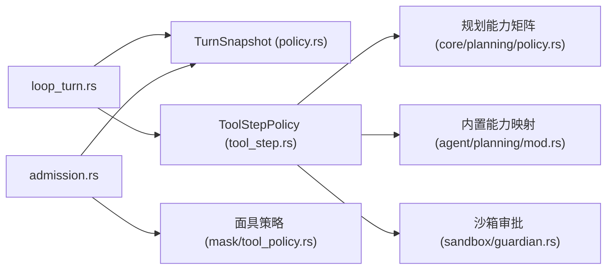

# 策略评估

<cite>
**本文引用的文件**
- [policy.rs](file://agent-diva-agent/src/agent_loop/turn/policy.rs)
- [tool_step.rs](file://agent-diva-agent/src/agent_loop/turn/tool_step.rs)
- [admission.rs](file://agent-diva-agent/src/agent_loop/turn/admission.rs)
- [policy.rs（规划能力矩阵）](file://agent-diva-core/src/planning/policy.rs)
- [mod.rs（内置工具能力映射）](file://agent-diva-agent/src/planning/mod.rs)
- [tool_policy.rs（面具工具策略）](file://agent-diva-agent/src/mask/tool_policy.rs)
- [guardian.rs（沙箱审批与熔断）](file://agent-diva-sandbox/src/guardian.rs)
- [loop_turn.rs（轮次入口快照引用）](file://agent-diva-agent/src/agent_loop/loop_turn.rs)
</cite>

## 目录
1. [简介](#简介)
2. [项目结构](#项目结构)
3. [核心组件](#核心组件)
4. [架构总览](#架构总览)
5. [详细组件分析](#详细组件分析)
6. [依赖关系分析](#依赖关系分析)
7. [性能考量](#性能考量)
8. [故障排查指南](#故障排查指南)
9. [结论](#结论)
10. [附录](#附录)

## 简介
本章节聚焦“策略评估阶段”，围绕 TurnSnapshot 的捕获机制，解释权限评估、工具激活策略、计划守卫检查等核心功能；并说明只读模式判断、计划模式识别、定时任务标记等策略决策逻辑。同时给出策略配置选项、自定义策略扩展点以及与沙箱系统的集成方式，帮助读者从高层到代码级理解策略如何决定一次工具调用是否被允许执行。

## 项目结构
策略评估贯穿“入站消息准入 → 轮次快照构建 → 工具编排前策略判定 → 执行门限”这一链路：
- 入站消息在 admission 中分类为 Agent/Plan/Ask，并计算 scheduled、session_key、plan_mode 等上下文。
- TurnSnapshot 在 capture 时结合 active_plan 与 plan_mode 推导 policy_phase，并记录 reviewer_read_only、scheduled、trace_id 等。
- 工具编排前 ToolStepPolicy 基于 phase、plan_guard_active、persisted_plan_present、reviewer_read_only 进行拒绝判定。
- 若通过，再进入沙箱 Guardian 层做命令级自动审批/要求审批/拒绝/延后决策。

图表来源
- [admission.rs:114-314](file://agent-diva-agent/src/agent_loop/turn/admission.rs#L114-L314)
- [policy.rs:19-66](file://agent-diva-agent/src/agent_loop/turn/policy.rs#L19-L66)
- [tool_step.rs:194-480](file://agent-diva-agent/src/agent_loop/turn/tool_step.rs#L194-L480)
- [guardian.rs:618-736](file://agent-diva-sandbox/src/guardian.rs#L618-L736)

章节来源
- [admission.rs:114-314](file://agent-diva-agent/src/agent_loop/turn/admission.rs#L114-L314)
- [policy.rs:19-66](file://agent-diva-agent/src/agent_loop/turn/policy.rs#L19-L66)
- [tool_step.rs:194-480](file://agent-diva-agent/src/agent_loop/turn/tool_step.rs#L194-L480)
- [guardian.rs:618-736](file://agent-diva-sandbox/src/guardian.rs#L618-L736)

## 核心组件
- TurnSnapshot：封装单轮策略上下文，包含 session_key、model、plan_mode、policy_phase、reviewer_read_only、scheduled、trace_id，以及内存规则注入迭代追踪。
- ToolStepPolicy：在工具执行前的最终策略门限，负责拒绝原因生成与执行入口控制。
- 规划能力矩阵：将 PlanPhase 投影为运行时状态，并以 fail-closed 的方式限制工具能力。
- 面具工具策略：根据面具模式与 allow/deny 列表过滤可用工具集，定义只读工具白名单。
- 沙箱 Guardian：对命令级执行提供自动审批、要求审批、拒绝、延后决策，并维护熔断器。

章节来源
- [policy.rs:19-66](file://agent-diva-agent/src/agent_loop/turn/policy.rs#L19-L66)
- [tool_step.rs:19-122](file://agent-diva-agent/src/agent_loop/turn/tool_step.rs#L19-L122)
- [policy.rs（规划能力矩阵）:11-85](file://agent-diva-core/src/planning/policy.rs#L11-L85)
- [tool_policy.rs:12-145](file://agent-diva-agent/src/mask/tool_policy.rs#L12-L145)
- [guardian.rs:25-110](file://agent-diva-sandbox/src/guardian.rs#L25-L110)

## 架构总览
策略评估由多层策略叠加构成：
- 会话级准入：拒绝熔断、每小时动作上限。
- 轮次级快照：计划模式识别、只读模式、定时任务标记、策略阶段推导。
- 工具级门限：按阶段能力矩阵拒绝未知/危险能力；无持久化计划时仅允许查看与计划记录。
- 命令级审批：沙箱 Guardian 依据规则/启发式/熔断器决定执行路径。

图表来源
- [admission.rs:114-314](file://agent-diva-agent/src/agent_loop/turn/admission.rs#L114-L314)
- [policy.rs:19-66](file://agent-diva-agent/src/agent_loop/turn/policy.rs#L19-L66)
- [tool_step.rs:194-480](file://agent-diva-agent/src/agent_loop/turn/tool_step.rs#L194-L480)
- [guardian.rs:618-736](file://agent-diva-sandbox/src/guardian.rs#L618-L736)

## 详细组件分析

### TurnSnapshot 捕获机制
- 捕获参数：session_key、model、plan_mode、active_plan、reviewer_read_only、scheduled、trace_id。
- 策略阶段推导：policy_phase_for(active_plan, plan_mode)，当存在活跃计划时使用其 phase，否则在 plan_mode=true 时强制进入 Plan 阶段。
- 计划守卫：plan_guard_active = policy_phase.is_some()，用于在无持久化计划时限制可执行能力。
- 只读模式：reviewer_read_only 来自 Ask 模式或面具 Assist 模式。
- 定时任务标记：scheduled 来自 cron 发送者或元数据 cron_job_id。
- 内存规则可见性：记录首次注入完整 Memory 写手册的迭代，后续迭代才允许写入类工具执行。

图表来源
- [policy.rs:19-66](file://agent-diva-agent/src/agent_loop/turn/policy.rs#L19-L66)
- [admission.rs:245-256](file://agent-diva-agent/src/agent_loop/turn/admission.rs#L245-L256)

章节来源
- [policy.rs:19-66](file://agent-diva-agent/src/agent_loop/turn/policy.rs#L19-L66)
- [admission.rs:245-256](file://agent-diva-agent/src/agent_loop/turn/admission.rs#L245-L256)

### 权限评估与工具激活策略
- 能力映射：内置工具名映射到 ToolCapability（Inspect、PlanningRecord、WorkItem、WorkspaceWrite、Execute、External、Unknown）。
- 阶段矩阵：allows_for_phase(phase, capability) 以 fail-closed 方式限制能力；Closed 阶段全部拒绝。
- 执行门限：ToolStepPolicy.denial_reason 综合以下因素拒绝：
  - 只读模式下非只读工具。
  - 当前阶段不允许该能力。
  - 计划守卫激活且无持久化计划时，仅允许 Inspect/PlanningRecord。
- 动态重建：当计划阶段变化时，会重建工具集以匹配新阶段的能力边界。

图表来源
- [policy.rs（规划能力矩阵）:35-85](file://agent-diva-core/src/planning/policy.rs#L35-L85)
- [tool_step.rs:29-55](file://agent-diva-agent/src/agent_loop/turn/tool_step.rs#L29-L55)
- [mod.rs（内置工具能力映射）:29-44](file://agent-diva-agent/src/planning/mod.rs#L29-L44)

章节来源
- [tool_step.rs:29-55](file://agent-diva-agent/src/agent_loop/turn/tool_step.rs#L29-L55)
- [policy.rs（规划能力矩阵）:35-85](file://agent-diva-core/src/planning/policy.rs#L35-L85)
- [mod.rs（内置工具能力映射）:29-44](file://agent-diva-agent/src/planning/mod.rs#L29-L44)

### 只读模式判断
- 来源：Ask 模式或面具 Assist 模式。
- 效果：非只读工具被拒绝；只读工具白名单包括 read_file、list_dir、read_attachment、web_search、web_fetch、tool_search。
- 工具集过滤：面具可进一步通过 allow/deny 列表裁剪可用工具集。

章节来源
- [admission.rs:245-256](file://agent-diva-agent/src/agent_loop/turn/admission.rs#L245-L256)
- [tool_policy.rs:24-145](file://agent-diva-agent/src/mask/tool_policy.rs#L24-L145)

### 计划模式识别
- 来源：消息元数据 exec_mode 为 plan 时进入计划模式；否则为 agent/ask。
- 策略阶段：当 plan_mode=true 且无活跃计划时，仍强制处于 Plan 阶段，确保计划守卫生效。
- 恢复执行：当存在已批准的执行会话时，可在 agent 模式下恢复执行上下文。

章节来源
- [admission.rs:25-52](file://agent-diva-agent/src/agent_loop/turn/admission.rs#L25-L52)
- [admission.rs:142-189](file://agent-diva-agent/src/agent_loop/turn/admission.rs#L142-L189)
- [policy.rs:19-48](file://agent-diva-agent/src/agent_loop/turn/policy.rs#L19-L48)

### 定时任务标记
- 来源：sender_id=cron 或元数据包含 cron_job_id。
- 影响：
  - cron 触发执行时禁止递归调度 cron 与 memory_distill。
  - 向 cron/exec 工具注入上下文通道、会话键等信息。
  - 经验日志中标记为 Denied 的场景包含“cron-triggered 禁用”。

章节来源
- [admission.rs:69-77](file://agent-diva-agent/src/agent_loop/turn/admission.rs#L69-L77)
- [tool_step.rs:67-108](file://agent-diva-agent/src/agent_loop/turn/tool_step.rs#L67-L108)
- [tool_step.rs:361-370](file://agent-diva-agent/src/agent_loop/turn/tool_step.rs#L361-L370)

### 计划守卫检查
- 守卫条件：policy_phase.is_some()。
- 守卫行为：若无持久化计划，仅允许 Inspect/PlanningRecord；其他能力一律拒绝。
- 目的：防止在未批准计划下执行工作区写入、外部调用等高风险操作。

章节来源
- [policy.rs:46-48](file://agent-diva-agent/src/agent_loop/turn/policy.rs#L46-L48)
- [tool_step.rs:41-55](file://agent-diva-agent/src/agent_loop/turn/tool_step.rs#L41-L55)

### 沙箱系统集成与审批策略
- GuardianConfig：控制连续拒绝阈值、时间窗口、自动批准已知安全/只读命令、最小执行时间、自动学习开关。
- DefaultGuardianReviewer：基于 ExecPolicy/规则存储、启发式（只读/危险命令）、审批策略（Never/OnFailure/OnRequest/UnlessTrusted）做出决策。
- GuardianRejectionCircuitBreaker：滑动窗口内连续拒绝达到阈值则触发熔断，阻止自动批准并将延后转为要求审批。
- GuardianManager：协调审查器与熔断器，维护会话级审批缓存。

图表来源
- [guardian.rs:25-110](file://agent-diva-sandbox/src/guardian.rs#L25-L110)
- [guardian.rs:375-472](file://agent-diva-sandbox/src/guardian.rs#L375-L472)
- [guardian.rs:475-589](file://agent-diva-sandbox/src/guardian.rs#L475-L589)
- [guardian.rs:618-736](file://agent-diva-sandbox/src/guardian.rs#L618-L736)

章节来源
- [guardian.rs:25-110](file://agent-diva-sandbox/src/guardian.rs#L25-L110)
- [guardian.rs:375-472](file://agent-diva-sandbox/src/guardian.rs#L375-L472)
- [guardian.rs:475-589](file://agent-diva-sandbox/src/guardian.rs#L475-L589)
- [guardian.rs:618-736](file://agent-diva-sandbox/src/guardian.rs#L618-L736)

### 策略配置选项
- 面具工具策略：allow/deny 列表、Assist 只读模式、只读工具白名单。
- 规划能力矩阵：阶段→能力映射，fail-closed 默认拒绝未知能力。
- 沙箱审批策略：GuardianConfig 的严格/平衡/宽松预设，以及 for_ask 映射 GUI 审批模式。
- 轮次准入：拒绝熔断、每小时动作上限。

章节来源
- [tool_policy.rs:35-145](file://agent-diva-agent/src/mask/tool_policy.rs#L35-L145)
- [policy.rs（规划能力矩阵）:35-85](file://agent-diva-core/src/planning/policy.rs#L35-L85)
- [guardian.rs:25-110](file://agent-diva-sandbox/src/guardian.rs#L25-L110)
- [admission.rs:94-112](file://agent-diva-agent/src/agent_loop/turn/admission.rs#L94-L112)

### 自定义策略扩展点
- 自定义审查器：实现 GuardianReviewer trait，注入 GuardianManager。
- 能力映射扩展：在 builtin_tool_capability 中为新工具添加能力类别。
- 面具策略：通过 MaskFile 的 mode 与 ToolLimits 定制工具集。
- 轮次策略：在 turn 入口处扩展 classify 或 enforce_turn_admission。

章节来源
- [guardian.rs:187-209](file://agent-diva-sandbox/src/guardian.rs#L187-L209)
- [mod.rs（内置工具能力映射）:29-44](file://agent-diva-agent/src/planning/mod.rs#L29-L44)
- [tool_policy.rs:35-145](file://agent-diva-agent/src/mask/tool_policy.rs#L35-L145)
- [admission.rs:69-112](file://agent-diva-agent/src/agent_loop/turn/admission.rs#L69-L112)

## 依赖关系分析
- 轮次入口 loop_turn 持有 TurnSnapshot 引用并在关键位置更新策略阶段。
- tool_step 依赖 planning 能力矩阵与内置工具能力映射，组合成 ToolStepPolicy。
- admission 依赖 mask 工具策略与 planning 运行时状态，构建 TurnSnapshot。
- guardian 依赖 exec_policy/command_rules 与审批策略，提供命令级审批。

图表来源
- [loop_turn.rs:329-751](file://agent-diva-agent/src/agent_loop/loop_turn.rs#L329-L751)
- [policy.rs:19-66](file://agent-diva-agent/src/agent_loop/turn/policy.rs#L19-L66)
- [tool_step.rs:194-480](file://agent-diva-agent/src/agent_loop/turn/tool_step.rs#L194-L480)
- [policy.rs（规划能力矩阵）:35-85](file://agent-diva-core/src/planning/policy.rs#L35-L85)
- [mod.rs（内置工具能力映射）:29-44](file://agent-diva-agent/src/planning/mod.rs#L29-L44)
- [admission.rs:114-314](file://agent-diva-agent/src/agent_loop/turn/admission.rs#L114-L314)
- [tool_policy.rs:35-145](file://agent-diva-agent/src/mask/tool_policy.rs#L35-L145)
- [guardian.rs:618-736](file://agent-diva-sandbox/src/guardian.rs#L618-L736)

章节来源
- [loop_turn.rs:329-751](file://agent-diva-agent/src/agent_loop/loop_turn.rs#L329-L751)
- [tool_step.rs:194-480](file://agent-diva-agent/src/agent_loop/turn/tool_step.rs#L194-L480)
- [admission.rs:114-314](file://agent-diva-agent/src/agent_loop/turn/admission.rs#L114-L314)

## 性能考量
- 策略判定在工具执行前完成，避免无效执行开销。
- 计划阶段变化时按需重建工具集，减少不必要的工具暴露。
- 沙箱熔断器使用滑动窗口与计数，避免频繁锁竞争。
- 经验日志异步追加，不阻塞主流程。

[本节为通用指导，无需特定文件来源]

## 故障排查指南
- 计划模式无法执行命令：检查 plan_guard_active 与 persisted_plan_present；确认阶段矩阵是否允许对应能力。
- 只读模式下写入失败：确认 reviewer_read_only 是否为真，以及工具是否在只读白名单。
- 定时任务递归调度被拒：确认 cron_trigger 标志与 cron/memory_distill 禁用逻辑。
- 沙箱频繁要求审批：检查 GuardianConfig 的 auto_approve_known_safe/auto_approve_read_only 与熔断器状态。
- 内存写入被拦截：确认 memory_rules_visible 与注入迭代，必要时重试模型调用。

章节来源
- [tool_step.rs:29-122](file://agent-diva-agent/src/agent_loop/turn/tool_step.rs#L29-L122)
- [policy.rs:46-66](file://agent-diva-agent/src/agent_loop/turn/policy.rs#L46-L66)
- [guardian.rs:475-589](file://agent-diva-sandbox/src/guardian.rs#L475-L589)

## 结论
策略评估通过 TurnSnapshot 捕获轮次上下文，结合计划阶段、只读模式、定时任务标记与沙箱审批，形成多层防护。规划能力矩阵保证 fail-closed 的安全基线，面具策略提供灵活的权限裁剪，沙箱 Guardian 提供命令级自动化与熔断保护。通过扩展点可自定义审查器、能力映射与面具策略，满足多样化场景需求。

## 附录
- 关键函数路径参考：
  - TurnSnapshot::capture：[policy.rs:19-39](file://agent-diva-agent/src/agent_loop/turn/policy.rs#L19-L39)
  - ToolStepPolicy::denial_reason：[tool_step.rs:34-55](file://agent-diva-agent/src/agent_loop/turn/tool_step.rs#L34-L55)
  - allows_for_phase：[policy.rs（规划能力矩阵）:35-85](file://agent-diva-core/src/planning/policy.rs#L35-L85)
  - builtin_tool_capability：[mod.rs（内置工具能力映射）:29-44](file://agent-diva-agent/src/planning/mod.rs#L29-L44)
  - GuardianConfig::for_ask：[guardian.rs:99-110](file://agent-diva-sandbox/src/guardian.rs#L99-L110)
  - TurnAdmission::classify：[admission.rs:69-77](file://agent-diva-agent/src/agent_loop/turn/admission.rs#L69-L77)