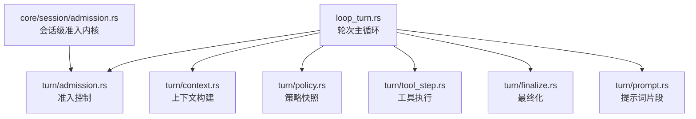
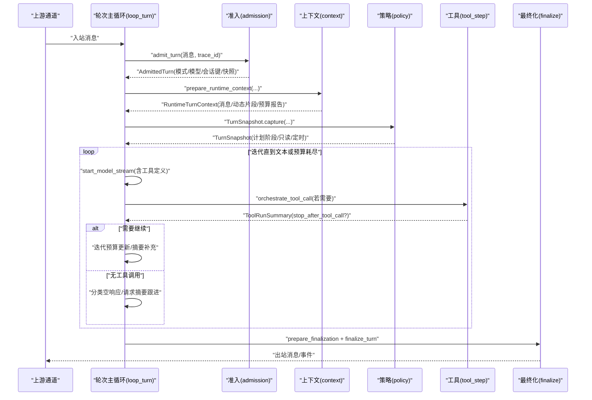
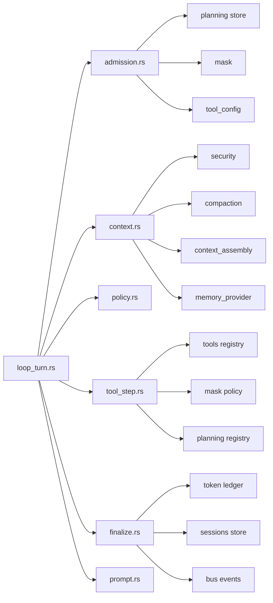

# 轮次阶段

<cite>
**本文引用的文件**
- [loop_turn.rs](file://agent-diva-agent/src/agent_loop/loop_turn.rs)
- [admission.rs](file://agent-diva-agent/src/agent_loop/turn/admission.rs)
- [context.rs](file://agent-diva-agent/src/agent_loop/turn/context.rs)
- [policy.rs](file://agent-diva-agent/src/agent_loop/turn/policy.rs)
- [tool_step.rs](file://agent-diva-agent/src/agent_loop/turn/tool_step.rs)
- [finalize.rs](file://agent-diva-agent/src/agent_loop/turn/finalize.rs)
- [prompt.rs](file://agent-diva-agent/src/agent_loop/turn/prompt.rs)
- [admission.rs（核心）](file://agent-diva-core/src/session/admission.rs)
</cite>

## 目录
1. [简介](#简介)
2. [项目结构](#项目结构)
3. [核心组件](#核心组件)
4. [架构总览](#架构总览)
5. [详细组件分析](#详细组件分析)
6. [依赖关系分析](#依赖关系分析)
7. [性能考虑](#性能考虑)
8. [故障排查指南](#故障排查指南)
9. [结论](#结论)
10. [附录](#附录)

## 简介
本文件围绕“轮次阶段”展开，系统化说明一次用户消息从进入系统到最终输出的完整处理链路。重点覆盖以下阶段：
- 准入控制（admission）：决定本轮是否允许执行、以何种模式执行。
- 上下文构建（context）：准备发送给大模型的上下文消息与动态片段。
- 策略评估（policy）：基于计划状态与掩码等决定工具权限范围。
- 工具执行（tool_step）：编排并执行工具调用，处理结果与生命周期边界。
- 最终化（finalize）：清理资源、持久化、提交结果。
- 提示词生成（prompt）：在各阶段注入提示词片段，指导模型行为。

文档同时给出阶段间的数据传递、配置选项、扩展点以及关键流程图。

## 项目结构
轮次阶段位于 agent-diva-agent 的 agent_loop 模块中，按职责拆分为 turn 子目录下的多个阶段文件，并由 loop_turn.rs 串联整体流程。核心会话级准入由 agent-diva-core 提供。

图表来源
- [loop_turn.rs:312-756](file://agent-diva-agent/src/agent_loop/loop_turn.rs#L312-L756)
- [admission.rs:114-314](file://agent-diva-agent/src/agent_loop/turn/admission.rs#L114-L314)
- [context.rs:93-558](file://agent-diva-agent/src/agent_loop/turn/context.rs#L93-L558)
- [policy.rs:19-66](file://agent-diva-agent/src/agent_loop/turn/policy.rs#L19-L66)
- [admission.rs（核心）:157-385](file://agent-diva-core/src/session/admission.rs#L157-L385)

章节来源
- [loop_turn.rs:312-756](file://agent-diva-agent/src/agent_loop/loop_turn.rs#L312-L756)
- [admission.rs:114-314](file://agent-diva-agent/src/agent_loop/turn/admission.rs#L114-L314)
- [context.rs:93-558](file://agent-diva-agent/src/agent_loop/turn/context.rs#L93-L558)
- [policy.rs:19-66](file://agent-diva-agent/src/agent_loop/turn/policy.rs#L19-L66)
- [admission.rs（核心）:157-385](file://agent-diva-core/src/session/admission.rs#L157-L385)

## 核心组件
- 轮次主循环（loop_turn.rs）：负责消息接收、迭代预算、LLM 流式采样、工具编排、最终化与事件上报。
- 准入控制（turn/admission.rs + core/session/admission.rs）：分类消息模式、限流/熔断检查、会话级串行化与排队。
- 上下文构建（turn/context.rs）：安全校验、附件处理、历史压缩、动态片段组装、预算约束。
- 策略快照（turn/policy.rs）：捕获当前计划阶段、只读模式、定时任务标记，驱动工具权限。
- 工具执行（turn/tool_step.rs）：根据策略与掩码选择工具集，执行并汇总结果，处理生命周期边界。
- 最终化（turn/finalize.rs）：写入会话、记录用量、清理临时资源、发出完成事件。
- 提示词生成（turn/prompt.rs）：为不同阶段注入提示词片段（如计划守卫、问答模式、定时任务等）。

章节来源
- [loop_turn.rs:312-756](file://agent-diva-agent/src/agent_loop/loop_turn.rs#L312-L756)
- [admission.rs:114-314](file://agent-diva-agent/src/agent_loop/turn/admission.rs#L114-L314)
- [context.rs:93-558](file://agent-diva-agent/src/agent_loop/turn/context.rs#L93-L558)
- [policy.rs:19-66](file://agent-diva-agent/src/agent_loop/turn/policy.rs#L19-L66)
- [tool_step.rs:1-200](file://agent-diva-agent/src/agent_loop/turn/tool_step.rs#L1-L200)
- [finalize.rs:1-200](file://agent-diva-agent/src/agent_loop/turn/finalize.rs#L1-L200)
- [prompt.rs:1-200](file://agent-diva-agent/src/agent_loop/turn/prompt.rs#L1-L200)

## 架构总览
下图展示一次轮次的端到端流程，包含各阶段的输入输出与关键决策点。

图表来源
- [loop_turn.rs:312-756](file://agent-diva-agent/src/agent_loop/loop_turn.rs#L312-L756)
- [admission.rs:114-314](file://agent-diva-agent/src/agent_loop/turn/admission.rs#L114-L314)
- [context.rs:93-558](file://agent-diva-agent/src/agent_loop/turn/context.rs#L93-L558)
- [policy.rs:19-66](file://agent-diva-agent/src/agent_loop/turn/policy.rs#L19-L66)
- [tool_step.rs:1-200](file://agent-diva-agent/src/agent_loop/turn/tool_step.rs#L1-L200)
- [finalize.rs:1-200](file://agent-diva-agent/src/agent_loop/turn/finalize.rs#L1-L200)

## 详细组件分析

### 准入控制（admission）
- 作用
  - 将入站消息分类为 Agent/Plan/Ask 模式，识别定时触发。
  - 执行进程级限流与熔断保护，拒绝过载或异常场景的新轮次。
  - 恢复或绑定执行上下文（计划执行），确保续跑一致性。
  - 重建本轮工具集，清空延迟激活的工具，保证干净起点。
- 数据流
  - 输入：InboundMessage、trace_id
  - 输出：AdmittedTurn（active_mask、model、mode、session_key、snapshot、approved_plan_markdown、background_task_context 等）
- 关键实现要点
  - 模式判定依据消息元数据 exec_mode；Ask 视为只读。
  - 限流使用 max_actions_per_hour；熔断来自 rejection_circuit。
  - 对 Plan 执行阶段进行执行上下文恢复与冲突检测。
  - 通过 TurnSnapshot 捕获策略快照，供后续工具权限判断。
- 配置与扩展
  - 限流阈值：max_actions_per_hour（AgentLoop 配置项）
  - 熔断器：rejection_circuit（外部服务/配置）
  - 可扩展：自定义 TurnMode 分类逻辑、执行上下文恢复策略
- 参考路径
  - [admission.rs:114-314](file://agent-diva-agent/src/agent_loop/turn/admission.rs#L114-L314)
  - [admission.rs（核心）:157-385](file://agent-diva-core/src/session/admission.rs#L157-L385)

章节来源
- [admission.rs:114-314](file://agent-diva-agent/src/agent_loop/turn/admission.rs#L114-L314)
- [admission.rs（核心）:157-385](file://agent-diva-core/src/session/admission.rs#L157-L385)

### 上下文构建（context）
- 作用
  - 安全校验与附件处理，构造当前轮次消息。
  - 根据预算与策略压缩历史、注入动态片段（会话检查点、预取召回、计划守卫、问答模式等）。
  - 冻结稳定前缀，确保 provider 前缀边界稳定。
- 数据流
  - 输入：消息、模型、执行开始标志、会话键、活跃执行、策略快照、掩码、定时标记、trace_id
  - 输出：RuntimeTurnContext（message_content、current_turn_message、messages、turn_messages_start、dynamic_sections、stable_prefix、assembly_report）
- 关键实现要点
  - 安全策略可阻断/清洗/隔离消息。
  - 视觉模型能力校验，避免不支持的图片输入。
  - 自动压缩：当历史预算压力过高时触发 checkpoint 压缩。
  - 动态片段：会话检查点、预取召回、计划守卫、问答模式、定时任务提示。
  - 预算报告：记录被丢弃/压缩的片段，便于观测。
- 配置与扩展
  - 上下文预算：tool_config.budget（max_tokens、system_budget_ratio、keep_recent_count 等）
  - 动态片段：PromptSection 与 ContextSection 组合
  - 可扩展：自定义安全检查规则、预取意图解析、动态片段注入顺序
- 参考路径
  - [context.rs:93-558](file://agent-diva-agent/src/agent_loop/turn/context.rs#L93-L558)

章节来源
- [context.rs:93-558](file://agent-diva-agent/src/agent_loop/turn/context.rs#L93-L558)

### 策略评估（policy）
- 作用
  - 捕获本轮策略快照：会话键、模型、计划模式、计划阶段、审阅者只读、定时任务、trace_id。
  - 支持运行时刷新策略阶段，维护记忆规则可见性窗口。
- 数据流
  - 输入：会话键、模型、计划模式、活跃计划、审阅者只读、定时标记、trace_id
  - 输出：TurnSnapshot（plan_guard_active、memory_rules_visible 等）
- 关键实现要点
  - plan_guard_active 指示是否处于计划守卫阶段，影响工具可用性与提示词注入。
  - memory_rules_injected_iteration 用于防止模型在尚未看到结果时执行写操作。
- 配置与扩展
  - 可通过 active_plan 与 plan_mode 改变 policy_phase。
  - 可扩展：自定义策略阶段映射、记忆规则可见性策略。
- 参考路径
  - [policy.rs:19-66](file://agent-diva-agent/src/agent_loop/turn/policy.rs#L19-L66)

章节来源
- [policy.rs:19-66](file://agent-diva-agent/src/agent_loop/turn/policy.rs#L19-L66)

### 工具执行（tool_step）
- 作用
  - 根据策略与掩码选择工具集（只读模式过滤、cron 隐藏 cron 工具、摘要轮禁用工具）。
  - 编排工具调用，收集 ToolRunSummary，必要时停止后续工具调用（生命周期边界）。
  - 与计划审批交互：进入等待审批时，阻止同一轮内再次尝试变更工具。
- 数据流
  - 输入：ToolOrchestrationContext（消息、事件通道、会话键、trace_id、迭代索引、计划模式、策略快照、掩码、执行ID、后台任务上下文）
  - 输出：ToolRunSummary（summary、stop_after_tool_call）
- 关键实现要点
  - 摘要轮（summary-only pass）不执行工具，仅生成总结。
  - 计划审批作为生命周期屏障，避免立即重试变更。
  - 工具定义集可按模式裁剪（只读、cron、摘要轮）。
- 配置与扩展
  - 工具注册表：tool_config.tools（内置/网络/自定义）
  - 掩码策略：MaskFile 与 ToolPolicy（只读模式、工具白名单）
  - 可扩展：自定义工具编排策略、结果过滤、审计日志
- 参考路径
  - [tool_step.rs:1-200](file://agent-diva-agent/src/agent_loop/turn/tool_step.rs#L1-L200)
  - [loop_turn.rs:419-643](file://agent-diva-agent/src/agent_loop/loop_turn.rs#L419-L643)

章节来源
- [tool_step.rs:1-200](file://agent-diva-agent/src/agent_loop/turn/tool_step.rs#L1-L200)
- [loop_turn.rs:419-643](file://agent-diva-agent/src/agent_loop/loop_turn.rs#L419-L643)

### 最终化（finalize）
- 作用
  - 准备最终化上下文，持久化会话、记录 token 用量、清理临时资源。
  - 发出完成事件，关闭计划审批等待（如适用）。
- 数据流
  - 输入：FinalizationPreparation（消息、事件通道、会话键、计划模式、渲染内容）、IterationOutcome（内容、推理、用量、是否因审批停止）
  - 输出：完成后的会话状态、事件、资源释放
- 关键实现要点
  - 统一追加 token 用量，支持缓存用量统计。
  - 支持计划模式下的特殊清理与汇报。
- 配置与扩展
  - 令牌账本：token_ledger_data_root、session_token_budget_limit
  - 可扩展：自定义清理钩子、审计事件、指标上报
- 参考路径
  - [finalize.rs:1-200](file://agent-diva-agent/src/agent_loop/turn/finalize.rs#L1-L200)
  - [loop_turn.rs:729-756](file://agent-diva-agent/src/agent_loop/loop_turn.rs#L729-L756)

章节来源
- [finalize.rs:1-200](file://agent-diva-agent/src/agent_loop/turn/finalize.rs#L1-L200)
- [loop_turn.rs:729-756](file://agent-diva-agent/src/agent_loop/loop_turn.rs#L729-L756)

### 提示词生成（prompt）
- 作用
  - 为不同阶段注入提示词片段，引导模型行为：计划守卫、问答模式、定时任务、会话标题生成等。
- 数据流
  - 输入：阶段标识（如 PlanGuard、VolatileMeta、SessionCheckpoint、PrefetchRecall）
  - 输出：PromptSection（content 字符串片段）
- 关键实现要点
  - 动态片段按顺序注入，确保语义正确（如计划守卫先于问答模式）。
  - 摘要轮可能注入“仅摘要”提示，抑制工具调用。
- 配置与扩展
  - 可扩展：新增 PromptSection 类型、自定义提示词模板
- 参考路径
  - [prompt.rs:1-200](file://agent-diva-agent/src/agent_loop/turn/prompt.rs#L1-L200)
  - [context.rs:479-506](file://agent-diva-agent/src/agent_loop/turn/context.rs#L479-L506)

章节来源
- [prompt.rs:1-200](file://agent-diva-agent/src/agent_loop/turn/prompt.rs#L1-L200)
- [context.rs:479-506](file://agent-diva-agent/src/agent_loop/turn/context.rs#L479-L506)

## 依赖关系分析
轮次阶段之间的耦合与依赖如下：
- loop_turn.rs 依赖 admission、context、policy、tool_step、finalize、prompt。
- context 依赖 security、compaction、context_assembly、memory_provider。
- admission 依赖 planning store、mask、tool_config。
- tool_step 依赖 tools registry、mask policy、planning registry。
- finalize 依赖 token ledger、sessions store、bus events。

图表来源
- [loop_turn.rs:312-756](file://agent-diva-agent/src/agent_loop/loop_turn.rs#L312-L756)
- [context.rs:93-558](file://agent-diva-agent/src/agent_loop/turn/context.rs#L93-L558)
- [admission.rs:114-314](file://agent-diva-agent/src/agent_loop/turn/admission.rs#L114-L314)
- [tool_step.rs:1-200](file://agent-diva-agent/src/agent_loop/turn/tool_step.rs#L1-L200)
- [finalize.rs:1-200](file://agent-diva-agent/src/agent_loop/turn/finalize.rs#L1-L200)

章节来源
- [loop_turn.rs:312-756](file://agent-diva-agent/src/agent_loop/loop_turn.rs#L312-L756)
- [context.rs:93-558](file://agent-diva-agent/src/agent_loop/turn/context.rs#L93-L558)
- [admission.rs:114-314](file://agent-diva-agent/src/agent_loop/turn/admission.rs#L114-L314)
- [tool_step.rs:1-200](file://agent-diva-agent/src/agent_loop/turn/tool_step.rs#L1-L200)
- [finalize.rs:1-200](file://agent-diva-agent/src/agent_loop/turn/finalize.rs#L1-L200)

## 性能考虑
- 上下文预算与压缩：通过 ContextBudgetPlan 与 CheckpointCompactor 控制历史长度与质量，避免超出模型上下文窗口。
- 迭代预算：限制最大迭代次数，并在工具耗尽后给予一次摘要轮，减少无效采样。
- 工具裁剪：只读模式、cron 模式、摘要轮分别裁剪工具集，降低不必要开销。
- 令牌用量追踪：逐轮累计 token 用量，支持缓存用量统计与配额检查。
- 并发与排队：会话级准入内核保证单会话串行执行，避免竞争与乱序。

[本节为通用性能建议，无需特定文件引用]

## 故障排查指南
- 准入失败
  - 熔断触发：检查 rejection_circuit 状态与上游错误风暴。
  - 限流耗尽：确认 max_actions_per_hour 配置与近期活动量。
  - 队列满/超时：查看 SessionAdmissionLimits 的 max_queue_depth 与 wait_timeout。
- 上下文构建失败
  - 安全策略拦截：审查 SecurityDecision 的 Block/Quarantine 原因。
  - 视觉模型不支持图片：切换支持 vision 的模型。
  - 压缩失败：关注非阻塞警告，原始上下文保留。
- 工具执行异常
  - 计划审批导致停止：检查 stopped_for_plan_approval 标志与审批中心。
  - 工具定义不可用：确认 mask 与 tool_config 的工具注册。
- 最终化问题
  - 令牌账本写入失败：检查 token_ledger_data_root 权限与磁盘空间。
  - 会话保存失败：确认 sessions store 可用性与锁机制。

章节来源
- [admission.rs:95-112](file://agent-diva-agent/src/agent_loop/turn/admission.rs#L95-L112)
- [admission.rs（核心）:23-79](file://agent-diva-core/src/session/admission.rs#L23-L79)
- [context.rs:127-154](file://agent-diva-agent/src/agent_loop/turn/context.rs#L127-L154)
- [context.rs:274-381](file://agent-diva-agent/src/agent_loop/turn/context.rs#L274-L381)
- [loop_turn.rs:595-643](file://agent-diva-agent/src/agent_loop/loop_turn.rs#L595-L643)
- [finalize.rs:1-200](file://agent-diva-agent/src/agent_loop/turn/finalize.rs#L1-L200)

## 结论
轮次阶段以清晰的职责划分与严格的预算/策略控制，实现了高可靠、可扩展的 AI 代理执行链路。通过准入控制保障系统稳定性，上下文构建确保高效且安全的提示工程，策略评估与工具执行协同实现细粒度权限控制，最终化阶段完成资源清理与结果提交。该设计既满足复杂业务需求，又便于定制与扩展。

[本节为总结性内容，无需特定文件引用]

## 附录
- 关键数据结构
  - AdmittedTurn：准入结果，携带模式、模型、会话键、策略快照等。
  - RuntimeTurnContext：运行时上下文，包含消息、动态片段、预算报告等。
  - TurnSnapshot：策略快照，记录计划阶段、只读模式、定时任务等。
  - ToolRunSummary：工具执行摘要，包含是否停止后续工具调用。
- 扩展点
  - 自定义 TurnMode 分类与执行策略。
  - 新增 PromptSection 与动态片段注入逻辑。
  - 扩展工具注册表与掩码策略。
  - 自定义最终化清理与审计事件。

[本节为概念性内容，无需特定文件引用]