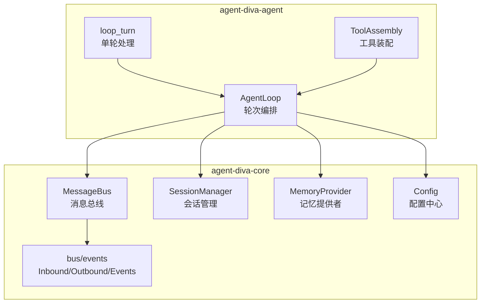
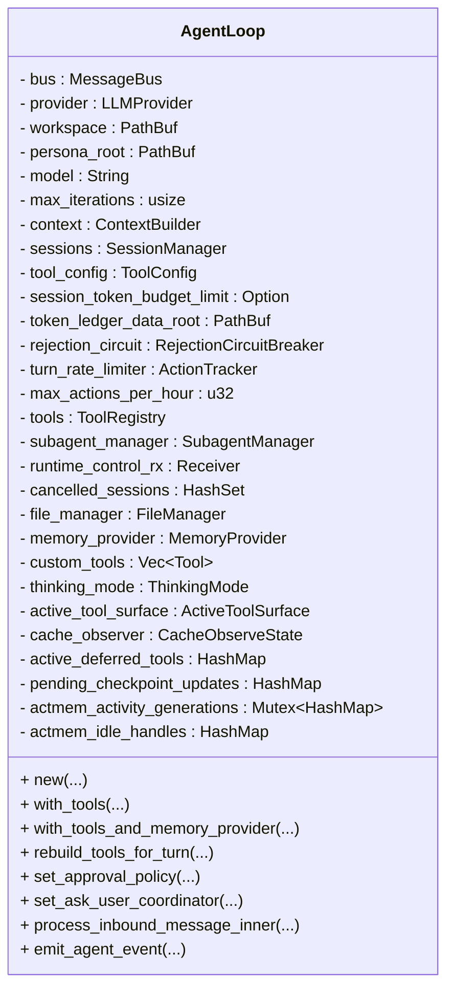
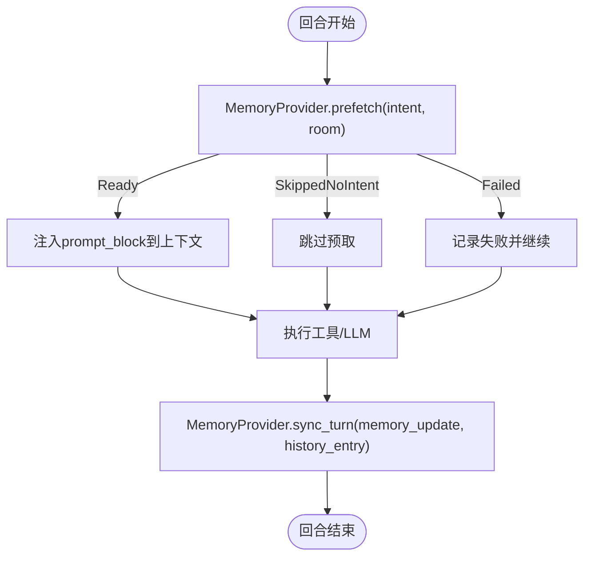
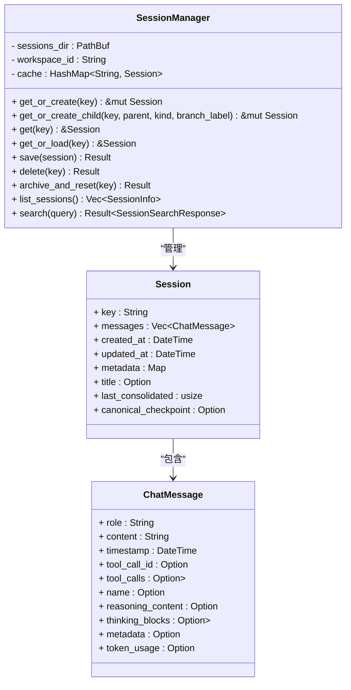
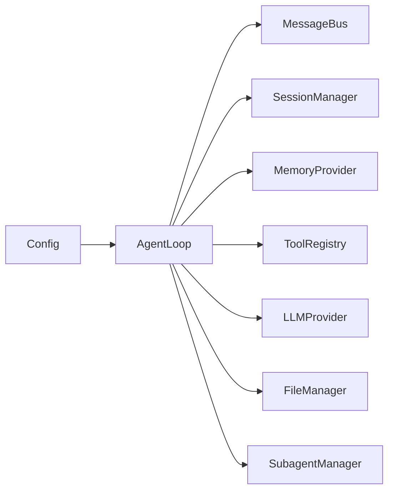

# 核心组件

<cite>
**本文引用的文件**
- [agent-diva-agent/src/agent_loop.rs](file://agent-diva-agent/src/agent_loop.rs)
- [agent-diva-agent/src/agent_loop/loop_turn.rs](file://agent-diva-agent/src/agent_loop/loop_turn.rs)
- [agent-diva-core/src/memory/mod.rs](file://agent-diva-core/src/memory/mod.rs)
- [agent-diva-core/src/memory/provider.rs](file://agent-diva-core/src/memory/provider.rs)
- [agent-diva-core/src/config/mod.rs](file://agent-diva-core/src/config/mod.rs)
- [agent-diva-core/src/config/schema.rs](file://agent-diva-core/src/config/schema.rs)
- [agent-diva-core/src/session/mod.rs](file://agent-diva-core/src/session/mod.rs)
- [agent-diva-core/src/session/manager.rs](file://agent-diva-core/src/session/manager.rs)
- [agent-diva-core/src/session/store.rs](file://agent-diva-core/src/session/store.rs)
- [agent-diva-core/src/bus/mod.rs](file://agent-diva-core/src/bus/mod.rs)
- [agent-diva-core/src/bus/queue.rs](file://agent-diva-core/src/bus/queue.rs)
</cite>

## 目录
1. [简介](#简介)
2. [项目结构](#项目结构)
3. [核心组件](#核心组件)
4. [架构总览](#架构总览)
5. [详细组件分析](#详细组件分析)
6. [依赖关系分析](#依赖关系分析)
7. [性能考量](#性能考量)
8. [故障排查指南](#故障排查指南)
9. [结论](#结论)
10. [附录：使用示例与最佳实践](#附录使用示例与最佳实践)

## 简介
本文件聚焦 Agent-Diva 的核心组件设计、职责边界、接口定义与状态管理，重点覆盖以下组件：
- Agent Loop：对话轮次编排、工具调用、迭代控制、事件与令牌预算。
- Memory System：长时记忆提供者抽象、启动注入、意图预取、回合同步与会话收尾。
- Config Manager：配置加载、校验、模式与策略（沙箱、审批、报告等）。
- Session Manager：会话生命周期、持久化、搜索与树状血缘。

同时说明关键数据结构 Message、Session、ToolCall 的定义与使用场景，并通过交互图展示数据在组件间的流转。

## 项目结构
Agent-Diva 采用多 crate 分层组织：
- agent-diva-agent：Agent Loop 实现、上下文组装、工具装配、子代理调度。
- agent-diva-core：公共领域模型与基础设施（消息总线、配置、会话、记忆、计划、安全等）。
- 其他 crate：通道、GUI、工具、提供者、沙箱等。



图表来源
- [agent-diva-agent/src/agent_loop.rs:110-153](file://agent-diva-agent/src/agent_loop.rs#L110-L153)
- [agent-diva-core/src/bus/mod.rs:1-14](file://agent-diva-core/src/bus/mod.rs#L1-L14)
- [agent-diva-core/src/session/mod.rs:1-29](file://agent-diva-core/src/session/mod.rs#L1-L29)
- [agent-diva-core/src/memory/mod.rs:1-47](file://agent-diva-core/src/memory/mod.rs#L1-L47)
- [agent-diva-core/src/config/mod.rs:1-12](file://agent-diva-core/src/config/mod.rs#L1-L12)

章节来源
- [agent-diva-agent/src/agent_loop.rs:110-153](file://agent-diva-agent/src/agent_loop.rs#L110-L153)
- [agent-diva-core/src/bus/mod.rs:1-14](file://agent-diva-core/src/bus/mod.rs#L1-L14)
- [agent-diva-core/src/session/mod.rs:1-29](file://agent-diva-core/src/session/mod.rs#L1-L29)
- [agent-diva-core/src/memory/mod.rs:1-47](file://agent-diva-core/src/memory/mod.rs#L1-L47)
- [agent-diva-core/src/config/mod.rs:1-12](file://agent-diva-core/src/config/mod.rs#L1-L12)

## 核心组件
- Agent Loop：负责接收入站消息、构建上下文、驱动 LLM 流式调用、编排工具执行、维护会话与令牌预算、发布事件、完成回合收尾与记忆同步。
- Memory System：通过 MemoryProvider 抽象提供启动系统提示块、意图预取、回合后持久化、会话结束钩子及 ACTMEM/工作区检查点能力。
- Config Manager：集中管理全局配置（代理默认、通道、提供者、网关、工具、记忆、自进化、报告、日志、沙箱、桌面伴侣等），并支持校验与差异计算。
- Session Manager：以 JSONL 持久化会话历史，提供会话创建/加载/保存/归档/搜索，维护会话树血缘（根/分支/子代理/临时）与元数据。

章节来源
- [agent-diva-agent/src/agent_loop.rs:110-153](file://agent-diva-agent/src/agent_loop.rs#L110-L153)
- [agent-diva-core/src/memory/provider.rs:414-617](file://agent-diva-core/src/memory/provider.rs#L414-L617)
- [agent-diva-core/src/config/schema.rs:278-309](file://agent-diva-core/src/config/schema.rs#L278-L309)
- [agent-diva-core/src/session/manager.rs:20-41](file://agent-diva-core/src/session/manager.rs#L20-L41)

## 架构总览
下图展示了从入站消息到最终输出的完整流程，包括 Agent Loop、消息总线、会话、记忆提供者与工具系统的协作。

```mermaid
sequenceDiagram
participant Channel as "外部通道"
participant Bus as "MessageBus"
participant Loop as "AgentLoop"
participant Turn as "loop_turn"
participant Tools as "ToolRegistry"
participant Provider as "LLMProvider"
participant Mem as "MemoryProvider"
participant Sess as "SessionManager"
Channel->>Bus : "publish_inbound(InboundMessage)"
Bus-->>Loop : "InboundMessage"
Loop->>Turn : "process_inbound_message_inner(msg)"
Turn->>Sess : "get_or_create(session_key)"
Turn->>Mem : "prefetch(intent, room)"
Turn->>Provider : "chat(messages, tools, model)"
Provider-->>Turn : "response(可能含tool_calls)"
alt "需要工具"
Turn->>Tools : "orchestrate_tool_call(tool_call)"
Tools-->>Turn : "result"
Turn->>Provider : "继续采样(必要时)"
end
Turn->>Mem : "sync_turn(memory_update, history_entry)"
Turn->>Sess : "append message + token_usage"
Turn->>Bus : "publish_event(AgentEvent...)"
Bus-->>Channel : "OutboundMessage / PokeEvent"
```

图表来源
- [agent-diva-core/src/bus/queue.rs:19-39](file://agent-diva-core/src/bus/queue.rs#L19-L39)
- [agent-diva-agent/src/agent_loop/loop_turn.rs:312-757](file://agent-diva-agent/src/agent_loop/loop_turn.rs#L312-L757)
- [agent-diva-core/src/memory/provider.rs:449-464](file://agent-diva-core/src/memory/provider.rs#L449-L464)
- [agent-diva-core/src/session/manager.rs:43-56](file://agent-diva-core/src/session/manager.rs#L43-L56)

## 详细组件分析

### Agent Loop
- 职责边界
  - 接收 InboundMessage，进行准入控制、掩码/计划阶段解析、模型选择。
  - 构建上下文（动态段、预算、缓存观察）、驱动 LLM 流式响应。
  - 编排工具调用，支持只读模式、计划模式、cron 触发限制。
  - 维护会话消息、令牌账本、活动延迟工具、ACTMEM 活跃标记。
  - 回合结束后执行收尾：写入会话、发布事件、记忆同步、清理资源。
- 关键状态
  - sessions、tools、memory_provider、rejection_circuit、turn_rate_limiter、active_deferred_tools、pending_checkpoint_updates、actmem_activity_generations、actmem_idle_handles。
- 重要方法
  - new/with_tools/with_tools_and_memory_provider：构造 AgentLoop。
  - rebuild_tools_for_turn/set_approval_policy/set_ask_user_coordinator：运行时重建工具表面。
  - process_inbound_message_inner：单轮主循环。
  - emit_agent_event/emit_planning_runtime_events/emit_chat_plan_update：事件广播。
- 错误与安全
  - 拒绝熔断器、动作速率限制、协议泄漏检测、空输出兜底、计划审批屏障。



图表来源
- [agent-diva-agent/src/agent_loop.rs:110-153](file://agent-diva-agent/src/agent_loop.rs#L110-L153)
- [agent-diva-agent/src/agent_loop.rs:473-558](file://agent-diva-agent/src/agent_loop.rs#L473-L558)
- [agent-diva-agent/src/agent_loop.rs:587-759](file://agent-diva-agent/src/agent_loop.rs#L587-L759)

章节来源
- [agent-diva-agent/src/agent_loop.rs:110-153](file://agent-diva-agent/src/agent_loop.rs#L110-L153)
- [agent-diva-agent/src/agent_loop.rs:473-558](file://agent-diva-agent/src/agent_loop.rs#L473-L558)
- [agent-diva-agent/src/agent_loop.rs:587-759](file://agent-diva-agent/src/agent_loop.rs#L587-L759)

### Memory System
- 职责边界
  - 启动期：system_prompt_block 注入系统提示片段（Soul/Wakeup/Memory）。
  - 运行期：prefetch 基于意图预取相关记忆；record_recall_outcome 记录召回结果。
  - 回合后：sync_turn 持久化记忆更新与历史证据。
  - 会话结束：on_session_end 触发收尾节奏任务。
  - 可选：ACTMEM 读写、会话检查点读写、用户脉冲与助手摘要记录。
- 关键类型
  - SystemPromptRequest/Response、PrefetchRequest/Response、SyncTurnRequest/Response、SessionEndRequest/Response、RecallOutcomeRequest、StartupContextSnapshot。
- 约束
  - system_prompt_block 必须无副作用且同步；prefetch/sync_turn/on_session_end 为异步；Markdown 是权威源（当不存在 .laputa 工作区时）。



图表来源
- [agent-diva-core/src/memory/provider.rs:237-305](file://agent-diva-core/src/memory/provider.rs#L237-L305)
- [agent-diva-core/src/memory/provider.rs:449-464](file://agent-diva-core/src/memory/provider.rs#L449-L464)
- [agent-diva-core/src/memory/provider.rs:316-345](file://agent-diva-core/src/memory/provider.rs#L316-L345)

章节来源
- [agent-diva-core/src/memory/provider.rs:237-305](file://agent-diva-core/src/memory/provider.rs#L237-L305)
- [agent-diva-core/src/memory/provider.rs:414-617](file://agent-diva-core/src/memory/provider.rs#L414-L617)

### Config Manager
- 职责边界
  - 加载与解析顶层配置（agents/channels/providers/gateway/tools/memory/self_evolution/reports/logging/sandbox/mate）。
  - 提供默认值与校验（如报告生成、沙箱模式、审批策略）。
  - 暴露差异计算与变更字段能力（loader.compute_diff）。
- 关键类型
  - Config、AgentsConfig、ChannelsConfig、ProvidersConfig、GatewayConfig、ToolsConfig、MemoryConfig、SelfEvolutionConfig、ReportsConfig、LoggingConfig、SandboxConfig、AskForApproval、SubAgentTask/Result 等。
- 典型用法
  - 初始化 AgentLoop 时读取安全配置（全局超时、令牌预算、拒绝熔断窗口）。
  - 根据 Mask 的 frontmatter 决定模型与工具限制。

章节来源
- [agent-diva-core/src/config/mod.rs:1-12](file://agent-diva-core/src/config/mod.rs#L1-L12)
- [agent-diva-core/src/config/schema.rs:278-309](file://agent-diva-core/src/config/schema.rs#L278-L309)
- [agent-diva-core/src/config/schema.rs:559-603](file://agent-diva-core/src/config/schema.rs#L559-L603)
- [agent-diva-core/src/config/schema.rs:378-463](file://agent-diva-core/src/config/schema.rs#L378-L463)
- [agent-diva-core/src/config/schema.rs:8-95](file://agent-diva-core/src/config/schema.rs#L8-L95)

### Session Manager
- 职责边界
  - 会话创建/获取/加载/保存/删除/归档重置。
  - 会话树血缘：根/分支/子代理/临时，支持父会话与根会话键。
  - 搜索会话内容（不提升为运行时权威）。
  - 原子写入 JSONL，保证一致性。
- 关键类型
  - Session、ChatMessage、SessionKind、SessionInfo。
- 持久化
  - metadata 行 + 多条 ChatMessage 行；标题、是否手动设置、是否生成、是否置顶、工作区 ID、频道、血缘信息。



图表来源
- [agent-diva-core/src/session/manager.rs:20-41](file://agent-diva-core/src/session/manager.rs#L20-L41)
- [agent-diva-core/src/session/manager.rs:43-109](file://agent-diva-core/src/session/manager.rs#L43-L109)
- [agent-diva-core/src/session/store.rs:490-520](file://agent-diva-core/src/session/store.rs#L490-L520)

章节来源
- [agent-diva-core/src/session/manager.rs:20-41](file://agent-diva-core/src/session/manager.rs#L20-L41)
- [agent-diva-core/src/session/manager.rs:43-109](file://agent-diva-core/src/session/manager.rs#L43-L109)
- [agent-diva-core/src/session/store.rs:490-520](file://agent-diva-core/src/session/store.rs#L490-L520)

### 关键数据结构与使用场景
- Message（会话内存储）
  - ChatMessage：角色、内容、时间戳、工具调用ID、工具调用列表、名称、推理内容、思考块、元数据、令牌用量。用于会话历史持久化与 UI 渲染。
  - 参考路径：[agent-diva-core/src/session/store.rs:490-520](file://agent-diva-core/src/session/store.rs#L490-L520)
- Session
  - 会话实体，包含消息列表、元数据、标题、最后合并位置、规范检查点等。
  - 参考路径：[agent-diva-core/src/session/manager.rs:20-41](file://agent-diva-core/src/session/manager.rs#L20-L41)
- ToolCall
  - 在 ChatMessage.tool_calls 中携带函数名与参数；在工具执行阶段由 ToolRegistry 编排。
  - 参考路径：[agent-diva-core/src/session/store.rs:490-520](file://agent-diva-core/src/session/store.rs#L490-L520)
- InboundMessage/OutboundMessage/AgentEvent/PokeEvent
  - 消息总线承载的入站/出站消息与事件，用于解耦通道与 Agent 核心。
  - 参考路径：[agent-diva-core/src/bus/mod.rs:1-14](file://agent-diva-core/src/bus/mod.rs#L1-L14)
  - 参考路径：[agent-diva-core/src/bus/queue.rs:19-39](file://agent-diva-core/src/bus/queue.rs#L19-L39)

章节来源
- [agent-diva-core/src/session/store.rs:490-520](file://agent-diva-core/src/session/store.rs#L490-L520)
- [agent-diva-core/src/session/manager.rs:20-41](file://agent-diva-core/src/session/manager.rs#L20-L41)
- [agent-diva-core/src/bus/mod.rs:1-14](file://agent-diva-core/src/bus/mod.rs#L1-L14)
- [agent-diva-core/src/bus/queue.rs:19-39](file://agent-diva-core/src/bus/queue.rs#L19-L39)

## 依赖关系分析
- Agent Loop 依赖
  - MessageBus：事件与消息分发。
  - SessionManager：会话存取。
  - MemoryProvider：记忆注入与持久化。
  - ToolRegistry：工具注册与执行。
  - LLMProvider：模型调用。
  - FileManager：附件处理。
  - SubagentManager：子代理调度。
- 配置影响
  - 安全策略（全局超时、令牌预算、拒绝熔断窗口）来自配置。
  - 审批策略（AskForApproval）可运行时调整。
- 会话与记忆
  - 会话消息与令牌用量写入会话；记忆系统在回合后同步。
- 事件驱动
  - 迭代开始、计划就绪、待办更新、令牌使用、推理内容等通过总线广播。



图表来源
- [agent-diva-agent/src/agent_loop.rs:110-153](file://agent-diva-agent/src/agent_loop.rs#L110-L153)
- [agent-diva-core/src/config/schema.rs:278-309](file://agent-diva-core/src/config/schema.rs#L278-L309)

章节来源
- [agent-diva-agent/src/agent_loop.rs:110-153](file://agent-diva-agent/src/agent_loop.rs#L110-L153)
- [agent-diva-core/src/config/schema.rs:278-309](file://agent-diva-core/src/config/schema.rs#L278-L309)

## 性能考量
- 迭代预算与总结兜底
  - 支持 Codex 风格“工具后仅总结”的一次额外迭代，避免无限循环。
- 上下文压力缓解
  - 输入压力过大时重建上下文（压缩/裁剪）后再继续。
- 令牌预算
  - 会话级令牌上限检查；每轮追加令牌用量到账本。
- 工具超时与全局超时
  - 工具执行超时与全局包装超时，防止长时间阻塞。
- 原子写入
  - 会话 JSONL 使用临时文件+重命名，确保一致性。
- 预取与幂等
  - 记忆预取失败不影响主流程；会话结束钩子幂等。

章节来源
- [agent-diva-agent/src/agent_loop/loop_turn.rs:376-757](file://agent-diva-agent/src/agent_loop/loop_turn.rs#L376-L757)
- [agent-diva-core/src/session/manager.rs:190-250](file://agent-diva-core/src/session/manager.rs#L190-L250)
- [agent-diva-core/src/memory/provider.rs:449-464](file://agent-diva-core/src/memory/provider.rs#L449-L464)

## 故障排查指南
- 常见错误与定位
  - 模型返回错误 finish_reason：查看 loop_turn 的错误分支与最终内容合成。
  - 协议泄漏检测：若检测到内部协议泄露，抑制用户可见输出并生成摘要。
  - 记忆预取失败：记录失败但继续执行；检查 prefetch 实现与后端可用性。
  - 会话写入失败：检查原子写入流程与磁盘权限。
  - 令牌预算超限：检查会话级预算与账本写入。
- 建议步骤
  - 启用更详细的 tracing 日志，关注 step_name 与 trace_id。
  - 检查 AgentEvent 与 PokeEvent 是否到达订阅者。
  - 验证 MemoryProvider 的 startup/prefetch/sync 返回值状态。
  - 确认 SessionManager 的 JSONL 文件结构与元数据完整性。

章节来源
- [agent-diva-agent/src/agent_loop/loop_turn.rs:544-713](file://agent-diva-agent/src/agent_loop/loop_turn.rs#L544-L713)
- [agent-diva-core/src/memory/provider.rs:449-464](file://agent-diva-core/src/memory/provider.rs#L449-L464)
- [agent-diva-core/src/session/manager.rs:190-250](file://agent-diva-core/src/session/manager.rs#L190-L250)

## 结论
Agent-Diva 的核心组件围绕 Agent Loop 展开，通过消息总线解耦通道与核心，借助 Session Manager 持久化会话历史，通过 MemoryProvider 抽象实现长时记忆的启动注入、预取与同步，并由 Config Manager 统一管控策略与行为。该架构具备良好的扩展性与可观测性，适合复杂的多轮对话与工具编排场景。

## 附录：使用示例与最佳实践
- 初始化 AgentLoop
  - 使用 with_tools 或 with_tools_and_memory_provider 传入 MessageBus、LLMProvider、工作区路径、模型与工具配置。
  - 参考路径：[agent-diva-agent/src/agent_loop.rs:587-759](file://agent-diva-agent/src/agent_loop.rs#L587-L759)
- 处理入站消息
  - 通过 MessageBus.publish_inbound 发送 InboundMessage；AgentLoop.process_inbound_message_inner 处理单轮。
  - 参考路径：[agent-diva-core/src/bus/queue.rs:19-39](file://agent-diva-core/src/bus/queue.rs#L19-L39)
  - 参考路径：[agent-diva-agent/src/agent_loop/loop_turn.rs:312-757](file://agent-diva-agent/src/agent_loop/loop_turn.rs#L312-L757)
- 配置审批策略
  - 通过 set_approval_policy 或消息元数据中的 approval_policy 动态调整。
  - 参考路径：[agent-diva-agent/src/agent_loop.rs:411-471](file://agent-diva-agent/src/agent_loop.rs#L411-L471)
- 记忆系统接入
  - 实现 MemoryProvider 的 system_prompt_block、prefetch、sync_turn、on_session_end。
  - 参考路径：[agent-diva-core/src/memory/provider.rs:414-617](file://agent-diva-core/src/memory/provider.rs#L414-L617)
- 会话管理
  - 使用 SessionManager.get_or_create 获取或创建会话；save 持久化；archive_and_reset 归档重置。
  - 参考路径：[agent-diva-core/src/session/manager.rs:43-109](file://agent-diva-core/src/session/manager.rs#L43-L109)
  - 参考路径：[agent-diva-core/src/session/manager.rs:190-250](file://agent-diva-core/src/session/manager.rs#L190-L250)

章节来源
- [agent-diva-agent/src/agent_loop.rs:411-471](file://agent-diva-agent/src/agent_loop.rs#L411-L471)
- [agent-diva-agent/src/agent_loop.rs:587-759](file://agent-diva-agent/src/agent_loop.rs#L587-L759)
- [agent-diva-core/src/bus/queue.rs:19-39](file://agent-diva-core/src/bus/queue.rs#L19-L39)
- [agent-diva-agent/src/agent_loop/loop_turn.rs:312-757](file://agent-diva-agent/src/agent_loop/loop_turn.rs#L312-L757)
- [agent-diva-core/src/memory/provider.rs:414-617](file://agent-diva-core/src/memory/provider.rs#L414-L617)
- [agent-diva-core/src/session/manager.rs:43-109](file://agent-diva-core/src/session/manager.rs#L43-L109)
- [agent-diva-core/src/session/manager.rs:190-250](file://agent-diva-core/src/session/manager.rs#L190-L250)