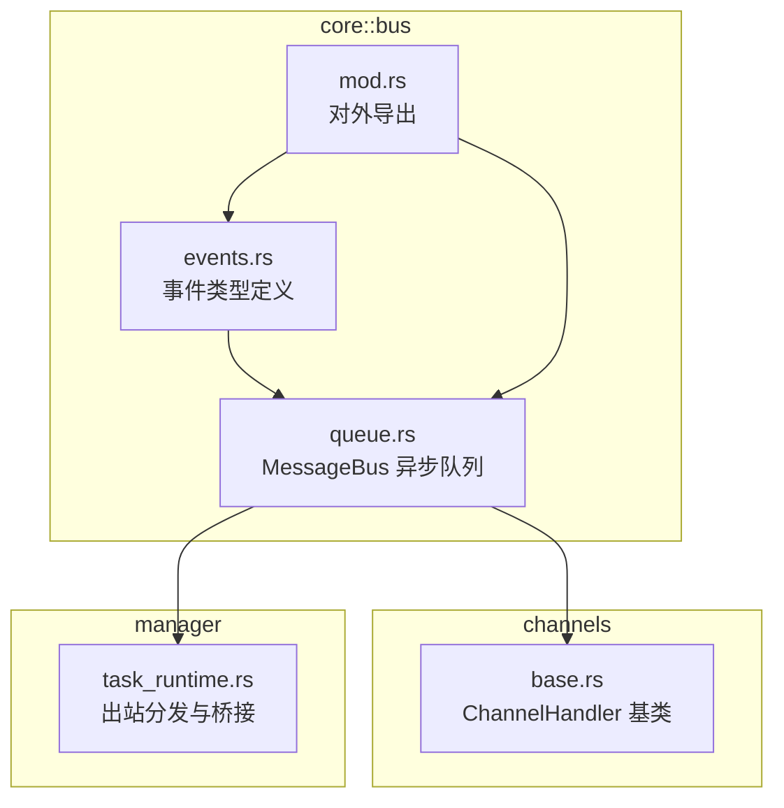
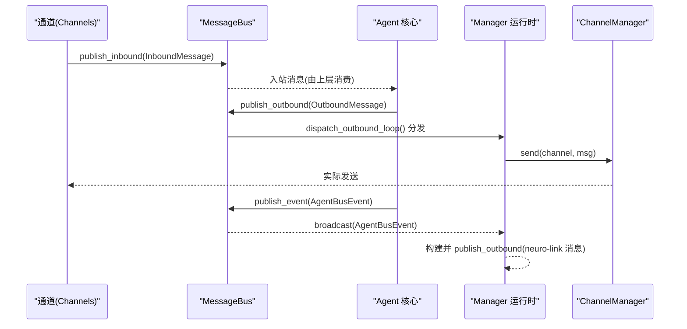
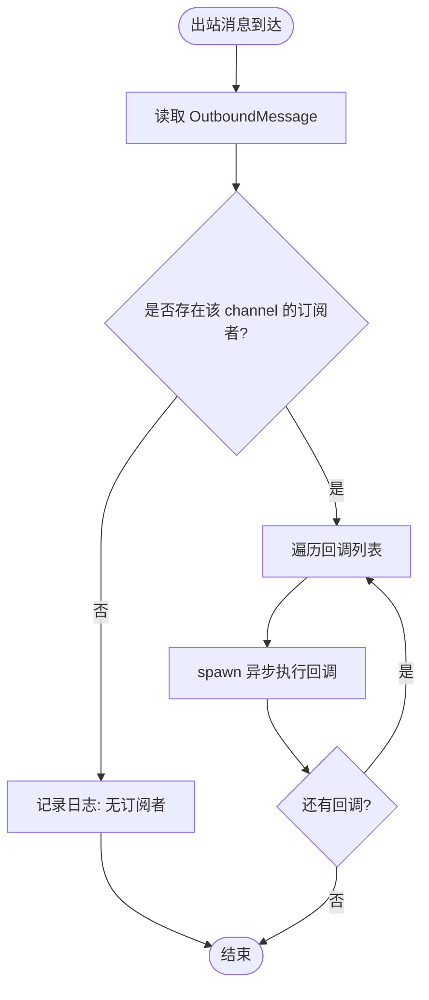
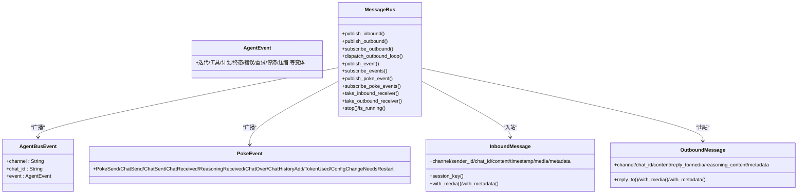

# 消息总线

<cite>
**本文引用的文件**
- [agent-diva-core/src/bus/mod.rs](file://agent-diva-core/src/bus/mod.rs)
- [agent-diva-core/src/bus/events.rs](file://agent-diva-core/src/bus/events.rs)
- [agent-diva-core/src/bus/queue.rs](file://agent-diva-core/src/bus/queue.rs)
- [agent-diva-channels/src/base.rs](file://agent-diva-channels/src/base.rs)
- [agent-diva-manager/src/runtime/task_runtime.rs](file://agent-diva-manager/src/runtime/task_runtime.rs)
</cite>

## 目录
1. [简介](#简介)
2. [项目结构](#项目结构)
3. [核心组件](#核心组件)
4. [架构总览](#架构总览)
5. [详细组件分析](#详细组件分析)
6. [依赖关系分析](#依赖关系分析)
7. [性能与背压](#性能与背压)
8. [序列化、传输与持久化](#序列化传输与持久化)
9. [使用示例：定义与处理自定义事件](#使用示例定义与处理自定义事件)
10. [故障排查指南](#故障排查指南)
11. [结论](#结论)

## 简介
本文件围绕 agent-diva 的消息总线进行系统化说明，重点覆盖：
- 事件发布订阅模式与消息路由机制
- 事件类型定义（系统事件、业务事件）及其用途
- 消息队列实现（异步处理、背压控制、错误重试策略）
- 消息的序列化、传输与持久化策略
- 自定义事件的定义与处理流程
- 消息在系统中的流转时序图

## 项目结构
消息总线位于 core 模块的 bus 子模块中，包含事件类型定义与异步队列实现；channels 模块提供通道接入层，manager 模块负责运行时编排与出站分发。

图表来源
- [agent-diva-core/src/bus/mod.rs:1-14](file://agent-diva-core/src/bus/mod.rs#L1-L14)
- [agent-diva-core/src/bus/events.rs:1-436](file://agent-diva-core/src/bus/events.rs#L1-L436)
- [agent-diva-core/src/bus/queue.rs:1-381](file://agent-diva-core/src/bus/queue.rs#L1-L381)
- [agent-diva-channels/src/base.rs:1-422](file://agent-diva-channels/src/base.rs#L1-L422)
- [agent-diva-manager/src/runtime/task_runtime.rs:170-210](file://agent-diva-manager/src/runtime/task_runtime.rs#L170-L210)

章节来源
- [agent-diva-core/src/bus/mod.rs:1-14](file://agent-diva-core/src/bus/mod.rs#L1-L14)

## 核心组件
- 事件类型与消息体
  - AgentEvent：流式与状态型事件（迭代、工具调用、计划更新、最终响应、错误、重试、上下文压缩等）
  - AgentBusEvent：带 channel/chat_id 的事件包装，便于按会话路由
  - InboundMessage/OutboundMessage：入站/出站消息载体，含媒体与元数据
  - PokeEvent：生命周期与审计事件（发送/接收、推理内容、历史追加、Token 消耗、配置变更需重启等）
- 消息总线 MessageBus
  - 双队列：入站 mpsc 通道、出站 mpsc 通道
  - 广播通道：AgentBusEvent 与 PokeEvent 两个独立广播通道
  - 出站订阅：按 channel 注册回调，后台任务分发消息给各通道处理器
  - 运行态管理：启动/停止/运行状态查询

章节来源
- [agent-diva-core/src/bus/events.rs:12-153](file://agent-diva-core/src/bus/events.rs#L12-L153)
- [agent-diva-core/src/bus/events.rs:155-213](file://agent-diva-core/src/bus/events.rs#L155-L213)
- [agent-diva-core/src/bus/events.rs:342-435](file://agent-diva-core/src/bus/events.rs#L342-L435)
- [agent-diva-core/src/bus/events.rs:361-394](file://agent-diva-core/src/bus/events.rs#L361-L394)
- [agent-diva-core/src/bus/queue.rs:19-184](file://agent-diva-core/src/bus/queue.rs#L19-L184)

## 架构总览
消息总线作为“解耦层”，将聊天通道与 Agent 核心分离：
- 通道侧通过 ChannelHandler 将外部消息封装为 InboundMessage，经 inbound 通道进入 Agent
- Agent 处理后生成 OutboundMessage，写入 outbound 通道
- Manager 在启动时订阅出站通道，将消息转发到具体 ChannelManager 发送
- 事件通过 broadcast 通道广播，GUI/监控/其他子系统可订阅消费

图表来源
- [agent-diva-core/src/bus/queue.rs:61-117](file://agent-diva-core/src/bus/queue.rs#L61-L117)
- [agent-diva-core/src/bus/queue.rs:132-173](file://agent-diva-core/src/bus/queue.rs#L132-L173)
- [agent-diva-manager/src/runtime/task_runtime.rs:173-202](file://agent-diva-manager/src/runtime/task_runtime.rs#L173-L202)
- [agent-diva-manager/src/runtime/task_runtime.rs:204-247](file://agent-diva-manager/src/runtime/task_runtime.rs#L204-L247)

## 详细组件分析

### 事件类型与用途
- 系统/平台事件（PokeEvent）
  - 用于审计、监控、跨模块通信：如 ChatReceived/ChatSent、ReasoningReceived、TokenUsed、ConfigChangeNeedsRestart 等
- 业务/流式事件（AgentEvent）
  - 迭代与工具调用进度：IterationStarted、ToolCallStarted/Finished、AssistantDelta、ReasoningDelta
  - 计划相关：PlanReadyForApproval、PlanReportReadyForApproval、ChatPlanUpdate、TodoCreated/Updated/Completed/Cancelled
  - 终态与异常：FinalResponse、Error
  - 提供者状态：ProviderRetry（含模型、尝试次数、最大重试、延迟、原因）、ProviderStalled（长时间无事件提示）
  - 上下文压缩：ContextCompaction（触发方式、阶段、摘要）

这些事件均支持序列化/反序列化，便于跨进程或持久化存储。

章节来源
- [agent-diva-core/src/bus/events.rs:12-153](file://agent-diva-core/src/bus/events.rs#L12-L153)
- [agent-diva-core/src/bus/events.rs:361-394](file://agent-diva-core/src/bus/events.rs#L361-L394)

### 消息队列与路由
- 入站队列：mpsc UnboundedSender/Receiver，通道侧通过 BaseChannel.handle_message 构造 InboundMessage 并发送
- 出站队列：mpsc UnboundedSender/Receiver，Agent 侧通过 publish_outbound 写入
- 出站路由：dispatch_outbound_loop 读取出站消息，根据 channel 字段查找已注册的回调集合，逐个异步执行回调（避免阻塞）
- 事件广播：publish_event/publish_poke_event 将事件推送到广播通道，subscribe_events/subscribe_poke_events 获取 Receiver 消费

图表来源
- [agent-diva-core/src/bus/queue.rs:132-173](file://agent-diva-core/src/bus/queue.rs#L132-L173)

章节来源
- [agent-diva-core/src/bus/queue.rs:95-184](file://agent-diva-core/src/bus/queue.rs#L95-L184)
- [agent-diva-channels/src/base.rs:186-229](file://agent-diva-channels/src/base.rs#L186-L229)

### 出站分发与通道集成
- Manager 在启动时，根据配置枚举已启用的 channel，并为每个 channel 注册出站回调
- 回调内部调用 ChannelManager.send 将 OutboundMessage 发送到对应通道
- 同时，Manager 会监听 GUI 事件（channel=gui），将最终响应转换为 neuro-link 的 OutboundMessage 再次发布，形成事件驱动的消息桥接

章节来源
- [agent-diva-manager/src/runtime/task_runtime.rs:173-202](file://agent-diva-manager/src/runtime/task_runtime.rs#L173-L202)
- [agent-diva-manager/src/runtime/task_runtime.rs:204-247](file://agent-diva-manager/src/runtime/task_runtime.rs#L204-L247)

### 入站消息处理
- 通道基类 BaseChannel 提供 handle_message，完成权限校验、媒体与元数据附加，并通过 inbound_tx 发送 InboundMessage
- 入站通道由上层（Agent 或调度器）通过 take_inbound_receiver 获取 Receiver 消费

章节来源
- [agent-diva-channels/src/base.rs:186-229](file://agent-diva-channels/src/base.rs#L186-L229)
- [agent-diva-core/src/bus/queue.rs:95-110](file://agent-diva-core/src/bus/queue.rs#L95-L110)

## 依赖关系分析
- events.rs 依赖 planning 模块的类型（计划状态、待办项等），体现业务事件与规划系统的耦合
- queue.rs 依赖 tokio 并发原语（mpsc、broadcast、RwLock）与 tracing 日志
- channels/base.rs 依赖 bus 的 InboundMessage/OutboundMessage 以及配置 schema
- manager/task_runtime.rs 依赖 bus 与 ChannelManager，承担出站分发与事件桥接

图表来源
- [agent-diva-core/src/bus/events.rs:12-153](file://agent-diva-core/src/bus/events.rs#L12-L153)
- [agent-diva-core/src/bus/events.rs:155-213](file://agent-diva-core/src/bus/events.rs#L155-L213)
- [agent-diva-core/src/bus/events.rs:342-435](file://agent-diva-core/src/bus/events.rs#L342-L435)
- [agent-diva-core/src/bus/events.rs:361-394](file://agent-diva-core/src/bus/events.rs#L361-L394)
- [agent-diva-core/src/bus/queue.rs:19-184](file://agent-diva-core/src/bus/queue.rs#L19-L184)

## 性能与背压
- 入站/出站均采用 unbounded mpsc 通道，理论上无生产者背压限制；适合高吞吐场景，但需注意消费者处理能力
- 出站分发循环以固定周期检查 running 状态，避免忙轮询；对每个回调使用 spawn 异步执行，防止阻塞分发主循环
- 事件广播通道容量为 1024，若消费者消费慢可能丢旧消息（broadcast 语义）；建议关键监控消费尽快处理
- 错误处理：发送失败返回 Error::Channel，调用方可据此做重试或告警

优化建议
- 在高负载下，可在消费端增加速率限制或批处理，降低 CPU 抖动
- 对关键事件（如 ProviderRetry、ContextCompaction）的消费链路应保证低延迟与幂等性
- 如需严格背压，可在应用层引入有界队列或令牌桶限流

章节来源
- [agent-diva-core/src/bus/queue.rs:41-117](file://agent-diva-core/src/bus/queue.rs#L41-L117)
- [agent-diva-core/src/bus/queue.rs:132-173](file://agent-diva-core/src/bus/queue.rs#L132-L173)

## 序列化、传输与持久化
- 所有事件与消息体均实现 Serialize/Deserialize，可通过 JSON 进行跨进程传输或落盘
- 测试覆盖了多类事件的序列化往返，确保向后兼容与字段完整性
- 持久化策略建议：
  - 入站消息与出站消息：可按 chat_id 分区落盘，保留必要元数据以便审计与回放
  - 事件流：按时间顺序追加写，结合索引（如 session_id、channel）便于检索
  - 大对象（如长文本、媒体 URL）建议仅存引用，避免重复拷贝

章节来源
- [agent-diva-core/src/bus/events.rs:215-340](file://agent-diva-core/src/bus/events.rs#L215-L340)

## 使用示例：定义与处理自定义事件
- 定义新事件
  - 在事件枚举中添加新变体，保持可序列化的字段设计
  - 若涉及复杂结构，优先复用已有类型（如 PlanRuntimeState、UpdatePlanArgs）
- 发布事件
  - 使用 publish_event 发布 AgentBusEvent，携带 channel/chat_id 以便下游过滤
  - 使用 publish_poke_event 发布生命周期/审计事件
- 订阅与处理
  - 通过 subscribe_events/subscribe_poke_events 获取 Receiver，按需过滤 channel/chat_id
  - 在 Manager 中可将事件转换为特定 OutboundMessage 再次发布（如 GUI -> neuro-link 桥接）

参考路径
- 事件定义与测试：[agent-diva-core/src/bus/events.rs:215-340](file://agent-diva-core/src/bus/events.rs#L215-L340)
- 事件桥接示例：[agent-diva-manager/src/runtime/task_runtime.rs:204-247](file://agent-diva-manager/src/runtime/task_runtime.rs#L204-L247)

## 故障排查指南
常见问题与定位要点
- 出站无响应
  - 检查是否已调用 dispatch_outbound_loop，且 running 状态为真
  - 确认目标 channel 已注册回调（subscribe_outbound）
  - 查看日志中“无订阅者”提示
- 入站消息未到达
  - 确认通道侧已设置 inbound_tx 并成功发送
  - 检查上层是否正确 take_inbound_receiver 并消费
- 事件丢失
  - broadcast 通道满时会丢弃旧消息，关注消费者消费速度
  - 对关键事件可增加本地缓冲或持久化
- 错误重试
  - ProviderRetry 事件已包含模型、尝试次数、最大重试、延迟与原因，可用于前端展示与后端重试策略
  - 对于网络/IO 错误，建议在调用方实现指数退避重试

章节来源
- [agent-diva-core/src/bus/queue.rs:105-117](file://agent-diva-core/src/bus/queue.rs#L105-L117)
- [agent-diva-core/src/bus/events.rs:118-145](file://agent-diva-core/src/bus/events.rs#L118-L145)
- [agent-diva-manager/src/runtime/task_runtime.rs:173-202](file://agent-diva-manager/src/runtime/task_runtime.rs#L173-L202)

## 结论
消息总线通过清晰的双队列与广播通道，实现了通道与 Agent 核心的强解耦，并提供丰富的系统/业务事件能力。其异步分发与回调机制保证了可扩展性与高性能。结合序列化支持与完善的测试覆盖，便于在分布式与可视化场景中稳定使用。生产环境建议配合消费端限流、关键事件持久化与可观测性建设，以获得更好的稳定性与可维护性。