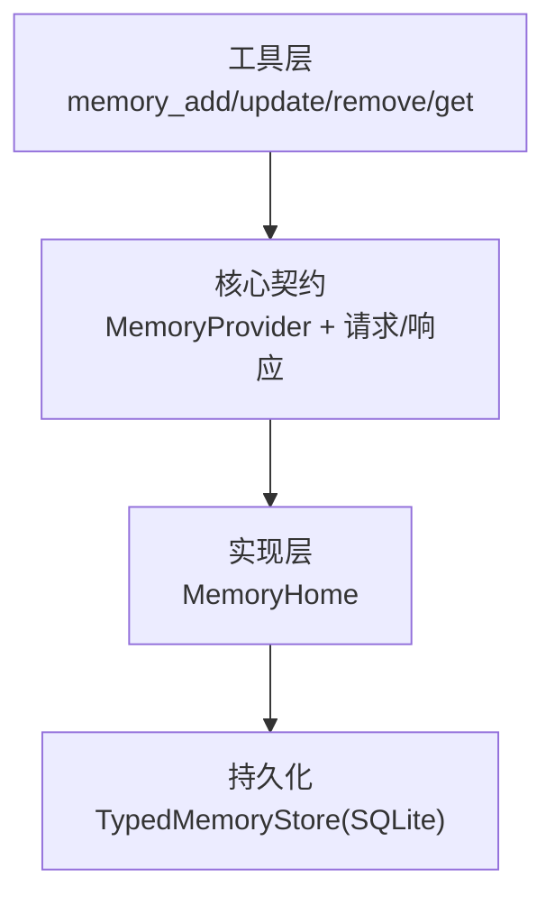
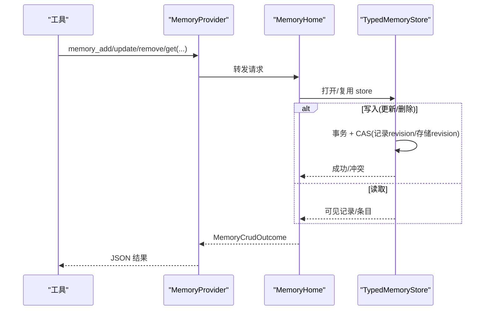
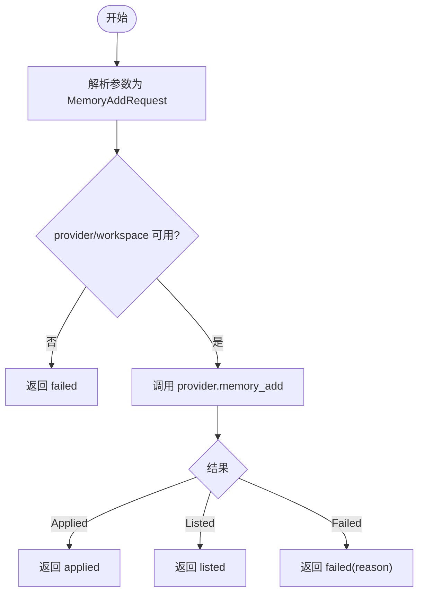
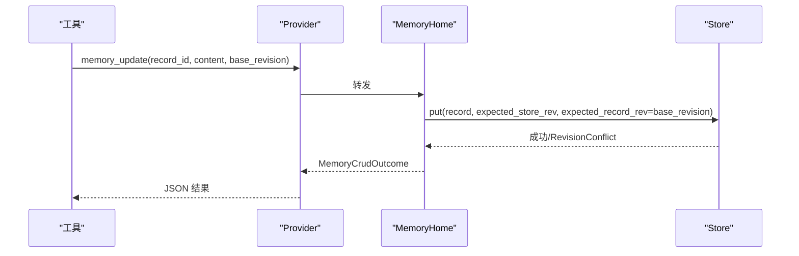
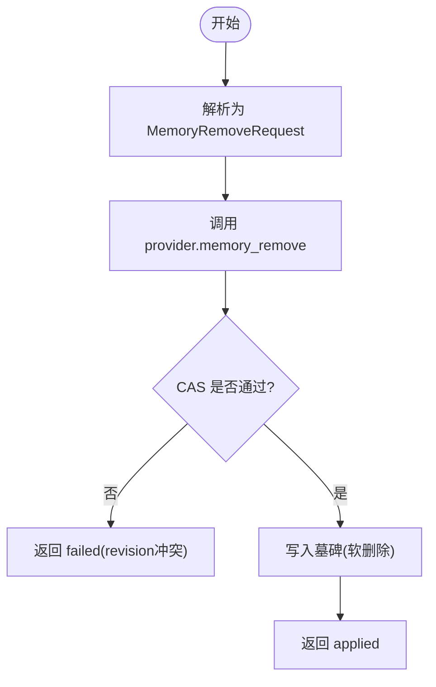
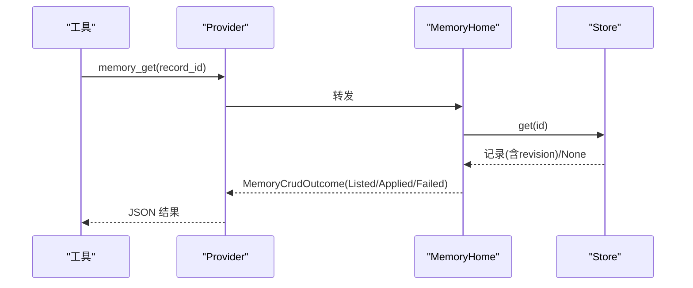
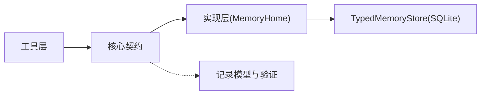

# CRUD 操作

<cite>
**本文引用的文件**
- [crud.rs](file://agent-diva-core/src/memory/crud.rs)
- [provider.rs](file://agent-diva-core/src/memory/provider.rs)
- [mod.rs](file://agent-diva-core/src/memory/mod.rs)
- [memory_add.rs](file://agent-diva-tools/src/memory_add.rs)
- [memory_update.rs](file://agent-diva-tools/src/memory_update.rs)
- [memory_remove.rs](file://agent-diva-tools/src/memory_remove.rs)
- [memory_get.rs](file://agent-diva-tools/src/memory_get.rs)
- [memory_home.rs](file://agent-diva-laputa/src/bml/memory_home.rs)
- [typed_store.rs](file://agent-diva-laputa/src/typed_store.rs)
- [record.rs](file://agent-diva-core/src/memory/record.rs)
- [memory_boundary.rs](file://agent-diva-agent/src/memory_boundary.rs)
</cite>

## 目录
1. [简介](#简介)
2. [项目结构](#项目结构)
3. [核心组件](#核心组件)
4. [架构总览](#架构总览)
5. [详细组件分析](#详细组件分析)
6. [依赖关系分析](#依赖关系分析)
7. [性能与并发特性](#性能与并发特性)
8. [故障排查指南](#故障排查指南)
9. [结论](#结论)
10. [附录：请求与响应契约](#附录请求与响应契约)

## 简介
本文件面向 Agent-Diva 的记忆系统，聚焦“记忆”的增删改查（CRUD）能力。内容涵盖：
- 请求结构：MemoryAddRequest、MemoryUpdateRequest、MemoryRemoveRequest、MemoryGetRequest、MemoryListRequest、MemorySearchRequest、MemoryDistillRequest
- 统一结果体：MemoryCrudOutcome（Applied/Listed/Failed）
- 事务与一致性：基于 SQLite 的事务与 CAS（compare-and-swap）机制
- 并发控制：写锁、行级版本校验、存储级 revision 校验
- 数据验证与业务约束：记录完整性校验、工作区隔离、信任与来源限制
- 工具层调用路径：memory_add / memory_update / memory_remove / memory_get
- 错误处理模式与最佳实践

## 项目结构
记忆 CRUD 由三层组成：
- 工具层（agent-diva-tools）：暴露 memory_* 工具，解析参数并调用 Provider
- 核心契约（agent-diva-core）：定义 MemoryProvider trait、请求/响应类型、记录模型与验证
- 实现层（agent-diva-laputa）：MemoryHome 作为机器级 BML 权威，使用 TypedMemoryStore 持久化到 SQLite

**图表来源**
- [memory_add.rs:41-88](file://agent-diva-tools/src/memory_add.rs#L41-L88)
- [provider.rs:414-526](file://agent-diva-core/src/memory/provider.rs#L414-L526)
- [memory_home.rs:102-177](file://agent-diva-laputa/src/bml/memory_home.rs#L102-L177)
- [typed_store.rs:881-934](file://agent-diva-laputa/src/typed_store.rs#L881-L934)

**章节来源**
- [mod.rs:1-47](file://agent-diva-core/src/memory/mod.rs#L1-L47)
- [memory_boundary.rs:1-16](file://agent-diva-agent/src/memory_boundary.rs#L1-L16)

## 核心组件
- 请求与结果
  - 写入：MemoryAddRequest（低风险即时写入）、MemoryUpdateRequest（CAS 更新）、MemoryRemoveRequest（CAS 软删除）
  - 读取：MemoryGetRequest、MemoryListRequest、MemorySearchRequest
  - 蒸馏：MemoryDistillRequest（经验蒸馏为技能工件）
  - 上下文：MemoryCrudContext（携带 workspace_root）
  - 结果：MemoryCrudOutcome（Applied/Listed/Failed），失败时提供稳定 reason
- Provider 边界
  - MemoryProvider trait 定义了 memory_add/list/get/search/update/remove/distill 等接口；默认返回 unsupported 的 Failed 结果，具体实现覆盖
- 记录模型与验证
  - MemoryRecord 及其校验规则（字段必填、时间顺序、信任/来源限制、内容摘要一致性、工作区匹配等）

**章节来源**
- [crud.rs:11-127](file://agent-diva-core/src/memory/crud.rs#L11-L127)
- [provider.rs:414-584](file://agent-diva-core/src/memory/provider.rs#L414-L584)
- [record.rs:103-191](file://agent-diva-core/src/memory/record.rs#L103-L191)

## 架构总览
记忆 CRUD 的典型调用链：
- 工具层解析 JSON 参数为请求结构
- 通过 MemoryProvider 调用对应方法
- 实现层 MemoryHome 选择或初始化 TypedMemoryStore
- 底层 TypedMemoryStore 在事务中执行 CAS 写入/删除，保证一致性与并发安全

**图表来源**
- [memory_add.rs:64-88](file://agent-diva-tools/src/memory_add.rs#L64-L88)
- [memory_update.rs:55-79](file://agent-diva-tools/src/memory_update.rs#L55-L79)
- [memory_remove.rs:55-79](file://agent-diva-tools/src/memory_remove.rs#L55-L79)
- [memory_get.rs:51-72](file://agent-diva-tools/src/memory_get.rs#L51-L72)
- [memory_home.rs:153-177](file://agent-diva-laputa/src/bml/memory_home.rs#L153-L177)
- [typed_store.rs:881-934](file://agent-diva-laputa/src/typed_store.rs#L881-L934)

## 详细组件分析

### 写入：memory_add（新增）
- 作用：将用户确认的事实或偏好直接写入长期记忆（BML）。证据引用为可选。
- 流程要点
  - 工具解析参数为 MemoryAddRequest
  - 若未配置 provider/workspace，返回 failed
  - 调用 provider.memory_add，最终落库并返回 Applied/Listed/Failed
- 适用场景：低风险即时写入；建议先搜索避免重复

**图表来源**
- [memory_add.rs:64-88](file://agent-diva-tools/src/memory_add.rs#L64-L88)
- [provider.rs:471-481](file://agent-diva-core/src/memory/provider.rs#L471-L481)
- [crud.rs:105-136](file://agent-diva-core/src/memory/crud.rs#L105-L136)

**章节来源**
- [memory_add.rs:1-114](file://agent-diva-tools/src/memory_add.rs#L1-L114)
- [crud.rs:11-19](file://agent-diva-core/src/memory/crud.rs#L11-L19)

### 更新：memory_update（CAS 更新）
- 作用：对指定 record_id 进行内容替换，要求 base_revision 与当前一致，防止覆盖他人修改。
- 流程要点
  - 工具解析参数为 MemoryUpdateRequest
  - 调用 provider.memory_update，底层以 CAS 方式更新
  - 若 revision 不匹配，返回 failed
- 适用场景：需要乐观锁保护的编辑

**图表来源**
- [memory_update.rs:55-79](file://agent-diva-tools/src/memory_update.rs#L55-L79)
- [provider.rs:510-517](file://agent-diva-core/src/memory/provider.rs#L510-L517)
- [typed_store.rs:881-934](file://agent-diva-laputa/src/typed_store.rs#L881-L934)

**章节来源**
- [memory_update.rs:1-105](file://agent-diva-tools/src/memory_update.rs#L1-L105)
- [crud.rs:44-56](file://agent-diva-core/src/memory/crud.rs#L44-L56)

### 删除：memory_remove（CAS 软删除）
- 作用：对指定 record_id 写入墓碑（tombstone），立即隐藏该记录；同样要求 base_revision 一致。
- 流程要点
  - 工具解析参数为 MemoryRemoveRequest
  - 调用 provider.memory_remove，底层以 tombstone 形式原子写入
  - 若 revision 不匹配，返回 failed
- 适用场景：合规撤销、遗忘指令、过期信息清理

**图表来源**
- [memory_remove.rs:55-79](file://agent-diva-tools/src/memory_remove.rs#L55-L79)
- [provider.rs:519-526](file://agent-diva-core/src/memory/provider.rs#L519-L526)
- [typed_store.rs:897-934](file://agent-diva-laputa/src/typed_store.rs#L897-L934)

**章节来源**
- [memory_remove.rs:1-105](file://agent-diva-tools/src/memory_remove.rs#L1-L105)
- [crud.rs:58-67](file://agent-diva-core/src/memory/crud.rs#L58-L67)

### 读取：memory_get（按 ID 获取）
- 作用：根据稳定 id 获取一条可见的长期记忆记录，包含当前 revision。
- 流程要点
  - 工具解析参数为 MemoryGetRequest
  - 调用 provider.memory_get，返回单条记录或空
- 适用场景：查看某条记忆的详情与版本

**图表来源**
- [memory_get.rs:51-72](file://agent-diva-tools/src/memory_get.rs#L51-L72)
- [provider.rs:492-499](file://agent-diva-core/src/memory/provider.rs#L492-L499)
- [memory_home.rs:193-200](file://agent-diva-laputa/src/bml/memory_home.rs#L193-L200)

**章节来源**
- [memory_get.rs:1-74](file://agent-diva-tools/src/memory_get.rs#L1-L74)
- [crud.rs:28-33](file://agent-diva-core/src/memory/crud.rs#L28-L33)

### 列表与搜索：memory_list / memory_search
- memory_list：列出已应用的记忆投影（可见记录），支持 limit
- memory_search：对应用权威中的内容进行自由文本检索
- 两者均返回 MemoryCrudOutcome::Listed 或 Failed

**章节来源**
- [crud.rs:21-42](file://agent-diva-core/src/memory/crud.rs#L21-L42)
- [provider.rs:483-508](file://agent-diva-core/src/memory/provider.rs#L483-L508)

### 经验蒸馏：memory_distill
- 作用：将经过动作验证的经验蒸馏为技能工件（SKILL.md），可附带会话上下文证据
- 用途：沉淀可复用的知识到技能体系

**章节来源**
- [crud.rs:69-81](file://agent-diva-core/src/memory/crud.rs#L69-L81)
- [provider.rs:577-584](file://agent-diva-core/src/memory/provider.rs#L577-L584)

## 依赖关系分析
- 工具层依赖核心契约（MemoryProvider 及请求/响应类型）
- 实现层 MemoryHome 依赖 TypedMemoryStore 完成持久化
- 记录模型与验证集中在 core 层，确保跨模块一致性

**图表来源**
- [memory_add.rs:6-8](file://agent-diva-tools/src/memory_add.rs#L6-L8)
- [provider.rs:9-19](file://agent-diva-core/src/memory/provider.rs#L9-L19)
- [memory_home.rs:9-33](file://agent-diva-laputa/src/bml/memory_home.rs#L9-L33)
- [record.rs:103-191](file://agent-diva-core/src/memory/record.rs#L103-L191)

**章节来源**
- [mod.rs:1-47](file://agent-diva-core/src/memory/mod.rs#L1-L47)

## 性能与并发特性
- 事务与一致性
  - 所有写操作在数据库事务中进行，提交前完成 store-level 与 record-level 的版本检查
  - 更新/删除采用 CAS：同时校验 store_revision 与目标记录的 record_revision
- 并发控制
  - 写路径持有内存写锁，串行化写操作
  - SQLite 事务与行级条件更新共同防止竞态
- 容量与配额
  - 写入前检查记录数量与内容字节上限，超限则拒绝
- 启动预热
  - 仅当数据库存在时才预热只读索引，缺失数据库视为空投影

**章节来源**
- [typed_store.rs:881-934](file://agent-diva-laputa/src/typed_store.rs#L881-L934)
- [memory_home.rs:147-177](file://agent-diva-laputa/src/bml/memory_home.rs#L147-L177)

## 故障排查指南
- 常见错误与定位
  - 参数解析失败：工具层会返回 InvalidArguments，检查 JSON 结构与必填字段
  - 提供者不可用：返回 failed(reason="memory provider unavailable")，检查 provider/workspace 注入
  - 版本冲突：update/remove 报 revision 冲突，需重新读取最新 revision 后重试
  - 记录不存在：get 返回空或 failed，确认 record_id 是否存在且未被墓碑隐藏
  - 工作区不匹配：记录属于不同 workspace，检查 scope.workspace_id
  - 内容摘要不一致：content 与 provenance.content_digest 不匹配，检查生成逻辑
- 调试建议
  - 优先使用 search/list 确认目标记录与当前 revision
  - 对 update/remove 采用“先读后写”的幂等重试策略
  - 关注日志中的错误码（如 memory_revision_conflict、memory_not_found）

**章节来源**
- [memory_add.rs:64-88](file://agent-diva-tools/src/memory_add.rs#L64-L88)
- [memory_update.rs:55-79](file://agent-diva-tools/src/memory_update.rs#L55-L79)
- [memory_remove.rs:55-79](file://agent-diva-tools/src/memory_remove.rs#L55-L79)
- [memory_get.rs:51-72](file://agent-diva-tools/src/memory_get.rs#L51-L72)
- [record.rs:153-191](file://agent-diva-core/src/memory/record.rs#L153-L191)
- [typed_store.rs:931-934](file://agent-diva-laputa/src/typed_store.rs#L931-L934)

## 结论
记忆 CRUD 通过清晰的契约与实现分层，提供了：
- 稳定的请求/响应模型与统一的失败语义
- 基于事务与 CAS 的一致性保障，避免并发覆盖
- 严格的记录验证与工作区隔离，确保数据安全
- 可扩展的工具层，便于上层 Agent 以工具方式调用

推荐实践：
- 写入前先搜索，减少重复
- 更新/删除务必携带最新 base_revision，失败后重试
- 利用 evidence_refs 增强可追溯性
- 遵循 trust/source 约束，避免非法来源写入权威

## 附录：请求与响应契约
- MemoryAddRequest
  - 字段：content、evidence_refs（可选）
  - 用途：低风险的即时事实/偏好写入
- MemoryUpdateRequest
  - 字段：record_id、content、base_revision、evidence_refs（可选）
  - 用途：带版本控制的更新
- MemoryRemoveRequest
  - 字段：record_id、reason、base_revision
  - 用途：带版本控制的软删除（墓碑）
- MemoryGetRequest
  - 字段：record_id
  - 用途：按 ID 获取可见记录
- MemoryListRequest
  - 字段：limit（可选）
  - 用途：列出可见记录
- MemorySearchRequest
  - 字段：query、limit（可选）
  - 用途：全文检索
- MemoryDistillRequest
  - 字段：skill_name、content、evidence（可选）
  - 用途：经验蒸馏为技能
- MemoryCrudOutcome
  - 状态：applied/listed/failed
  - 失败时提供稳定 reason

**章节来源**
- [crud.rs:11-127](file://agent-diva-core/src/memory/crud.rs#L11-L127)
- [provider.rs:471-584](file://agent-diva-core/src/memory/provider.rs#L471-L584)