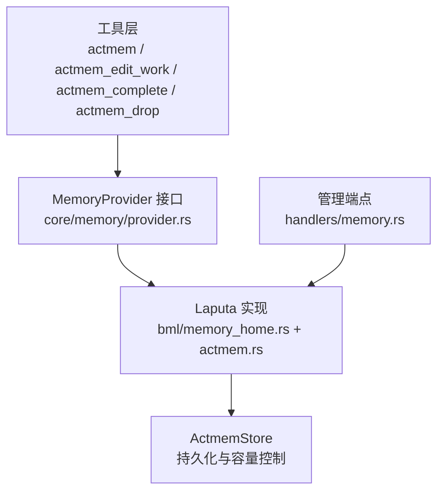
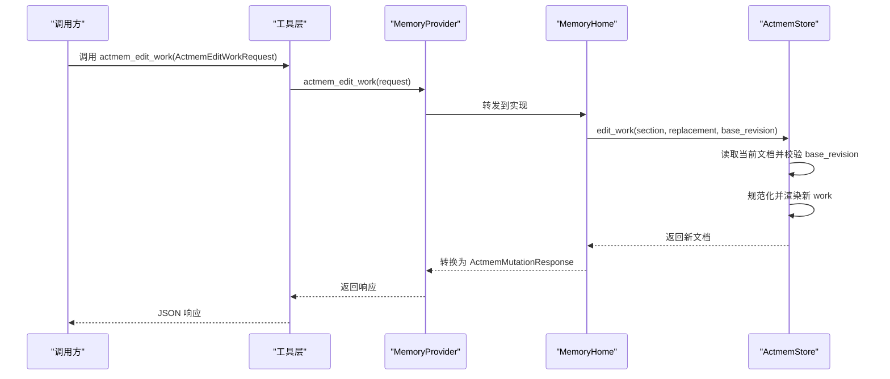
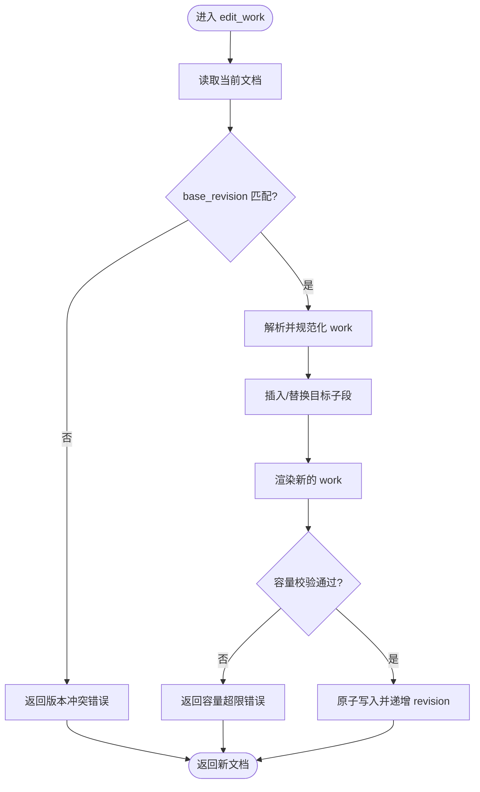
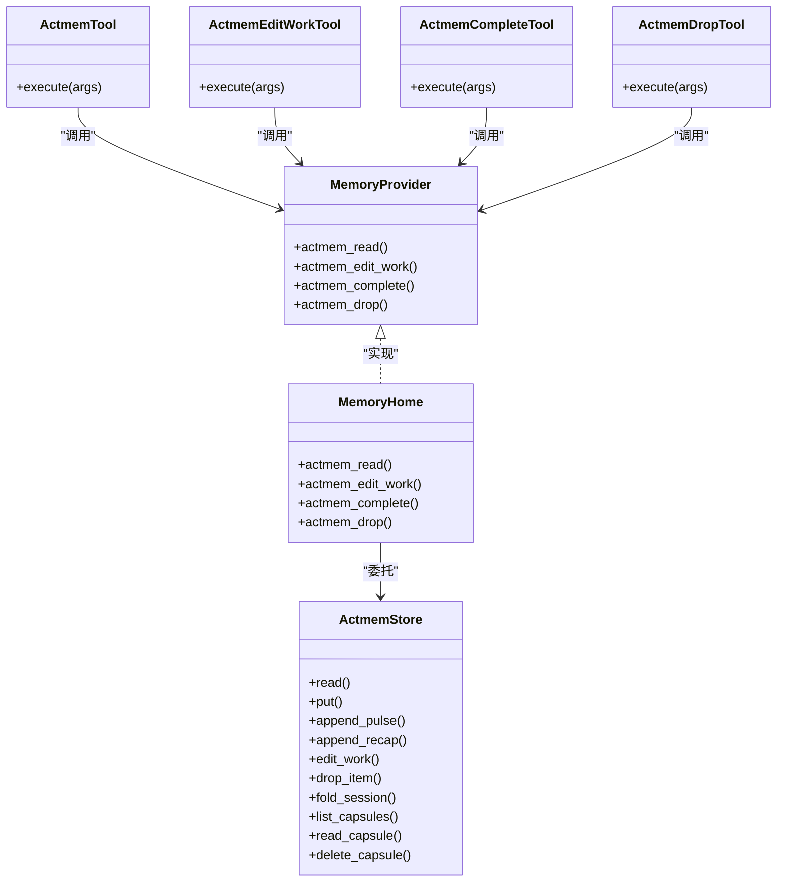

# ACTMEM 系统

<cite>
**本文引用的文件**
- [agent-diva-core/src/memory/actmem.rs](file://agent-diva-core/src/memory/actmem.rs)
- [agent-diva-core/src/memory/provider.rs](file://agent-diva-core/src/memory/provider.rs)
- [agent-diva-tools/src/actmem.rs](file://agent-diva-tools/src/actmem.rs)
- [agent-diva-tools/src/actmem_item.rs](file://agent-diva-tools/src/actmem_item.rs)
- [agent-diva-tools/src/actmem_edit_work.rs](file://agent-diva-tools/src/actmem_edit_work.rs)
- [agent-diva-laputa/src/actmem.rs](file://agent-diva-laputa/src/actmem.rs)
- [agent-diva-laputa/src/bml/memory_home.rs](file://agent-diva-laputa/src/bml/memory_home.rs)
- [agent-diva-manager/src/handlers/memory.rs](file://agent-diva-manager/src/handlers/memory.rs)
</cite>

## 目录
1. [简介](#简介)
2. [项目结构](#项目结构)
3. [核心组件](#核心组件)
4. [架构总览](#架构总览)
5. [详细组件分析](#详细组件分析)
6. [依赖关系分析](#依赖关系分析)
7. [性能考量](#性能考量)
8. [故障排除指南](#故障排除指南)
9. [结论](#结论)
10. [附录：API 使用示例](#附录api-使用示例)

## 简介
ACTMEM 是 Agent-Diva 的“活动记忆”子系统，用于在会话与跨会话之间维护轻量、有界、可合并的工作状态。它通过一组受控的读写接口（读投影、替换工作区子段、完成或删除条目）以及基于版本号的比较交换（CAS）机制，确保多并发写入下的数据一致性。ACTMEM 的核心数据结构包括 ActmemItemRequest 和 ActmemEditWorkRequest，分别用于对 Work 中的条目进行原子操作和对指定子段进行整段替换。

## 项目结构
ACTMEM 涉及三层职责：
- 契约层（core）：定义统一的请求/响应类型与 MemoryProvider 接口，屏蔽具体存储实现。
- 工具层（tools）：将契约暴露为可调用的工具（如 actmem、actmem_edit_work、actmem_complete、actmem_drop）。
- 实现层（laputa）：提供机器级 ACTMEM 权威存储（ActmemStore），负责持久化、容量限制、胶囊归档等。
- 管理层（manager）：对外暴露 HTTP 处理器，便于上层服务调用。

图表来源
- [agent-diva-core/src/memory/provider.rs:415-575](file://agent-diva-core/src/memory/provider.rs#L415-L575)
- [agent-diva-laputa/src/bml/memory_home.rs:733-796](file://agent-diva-laputa/src/bml/memory_home.rs#L733-L796)
- [agent-diva-laputa/src/actmem.rs:115-404](file://agent-diva-laputa/src/actmem.rs#L115-L404)
- [agent-diva-manager/src/handlers/memory.rs:143-191](file://agent-diva-manager/src/handlers/memory.rs#L143-L191)

章节来源
- [agent-diva-core/src/memory/mod.rs:1-47](file://agent-diva-core/src/memory/mod.rs#L1-L47)

## 核心组件
- 契约类型（core/memory/actmem.rs）
  - ActmemReadTarget：限定读取目标（pulse/recap/work/head/capsules/capsule）。
  - ActmemReadRequest/Response：带版本的有界读取。
  - ActmemEditWorkRequest：按 base_revision 替换一个已注册的 Work 子段。
  - ActmemItemRequest：按 base_revision 删除或完成某一行条目。
  - ActmemMutationResponse：返回新版本号与更新时间。
  - MemoryRulesResponse：返回记忆规则内容及其来源。
- 提供者接口（core/memory/provider.rs）
  - MemoryProvider 定义了 actmem_read、actmem_edit_work、actmem_complete、actmem_drop 等方法，默认返回不可用错误，由 Laputa 实现覆盖。
- 工具封装（tools）
  - actmem：只读读取投影。
  - actmem_edit_work：替换子段。
  - actmem_complete：完成 Open 条目（内部调用 drop）。
  - actmem_drop：删除任意子段中指定索引的条目。
- 存储实现（laputa）
  - ActmemStore：文件型权威存储，包含头部文档、脉冲/回顾环形缓冲区、工作区五段式结构、胶囊归档；提供 CAS 校验、容量限制、原子写入。
  - MemoryHome：BML 权威入口，桥接 MemoryProvider 与 ActmemStore，并处理错误码映射。

章节来源
- [agent-diva-core/src/memory/actmem.rs:1-51](file://agent-diva-core/src/memory/actmem.rs#L1-L51)
- [agent-diva-core/src/memory/provider.rs:415-575](file://agent-diva-core/src/memory/provider.rs#L415-L575)
- [agent-diva-tools/src/actmem.rs:1-68](file://agent-diva-tools/src/actmem.rs#L1-L68)
- [agent-diva-tools/src/actmem_item.rs:1-110](file://agent-diva-tools/src/actmem_item.rs#L1-L110)
- [agent-diva-tools/src/actmem_edit_work.rs:1-65](file://agent-diva-tools/src/actmem_edit_work.rs#L1-L65)
- [agent-diva-laputa/src/actmem.rs:15-44](file://agent-diva-laputa/src/actmem.rs#L15-L44)
- [agent-diva-laputa/src/actmem.rs:115-404](file://agent-diva-laputa/src/actmem.rs#L115-L404)
- [agent-diva-laputa/src/bml/memory_home.rs:733-796](file://agent-diva-laputa/src/bml/memory_home.rs#L733-L796)

## 架构总览
ACTMEM 采用“契约-工具-实现”分层设计：
- 契约层稳定且与传输无关，避免上层耦合 CLI/MCP/HTTP 细节。
- 工具层将契约序列化为 JSON 参数，调用 MemoryProvider 并返回结果。
- 实现层以文件为权威源，使用写锁与版本号保证并发安全，并通过容量限制保持投影有界。

图表来源
- [agent-diva-tools/src/actmem_edit_work.rs:50-63](file://agent-diva-tools/src/actmem_edit_work.rs#L50-L63)
- [agent-diva-core/src/memory/provider.rs:533-539](file://agent-diva-core/src/memory/provider.rs#L533-L539)
- [agent-diva-laputa/src/bml/memory_home.rs:747-763](file://agent-diva-laputa/src/bml/memory_home.rs#L747-L763)
- [agent-diva-laputa/src/actmem.rs:220-236](file://agent-diva-laputa/src/actmem.rs#L220-L236)

## 详细组件分析

### 数据结构设计理念与实现细节
- ActmemEditWorkRequest
  - 字段：section（目标子段）、replacement（新内容）、base_revision（基准版本）。
  - 设计意图：以 CAS 方式替换一个已注册子段，防止并发覆盖。
  - 约束：section 必须属于已注册集合（Goal/Open/Next/Constraints/Pointers），内容需经规范化与容量校验。
  - 参考路径
    - [agent-diva-core/src/memory/actmem.rs:26-31](file://agent-diva-core/src/memory/actmem.rs#L26-L31)
    - [agent-diva-laputa/src/actmem.rs:529-532](file://agent-diva-laputa/src/actmem.rs#L529-L532)
    - [agent-diva-laputa/src/actmem.rs:569-582](file://agent-diva-laputa/src/actmem.rs#L569-L582)
- ActmemItemRequest
  - 字段：section、item_index（从 0 开始）、base_revision。
  - 设计意图：对某个子段的单行条目进行原子删除或完成（Open 专用）。
  - 约束：index 必须在范围内；complete 仅允许 section=Open。
  - 参考路径
    - [agent-diva-core/src/memory/actmem.rs:33-38](file://agent-diva-core/src/memory/actmem.rs#L33-L38)
    - [agent-diva-laputa/src/bml/memory_home.rs:765-782](file://agent-diva-laputa/src/bml/memory_home.rs#L765-L782)
    - [agent-diva-laputa/src/actmem.rs:246-267](file://agent-diva-laputa/src/actmem.rs#L246-L267)

章节来源
- [agent-diva-core/src/memory/actmem.rs:1-51](file://agent-diva-core/src/memory/actmem.rs#L1-L51)
- [agent-diva-laputa/src/actmem.rs:220-267](file://agent-diva-laputa/src/actmem.rs#L220-L267)
- [agent-diva-laputa/src/bml/memory_home.rs:765-796](file://agent-diva-laputa/src/bml/memory_home.rs#L765-L796)

### 工作机制：项目创建、编辑工作与状态管理
- 项目创建
  - 首次读取不存在时返回空文档，自动初始化各子段与元信息。
  - 参考路径
    - [agent-diva-laputa/src/actmem.rs:69-83](file://agent-diva-laputa/src/actmem.rs#L69-L83)
    - [agent-diva-laputa/src/actmem.rs:412-418](file://agent-diva-laputa/src/actmem.rs#L412-L418)
- 编辑工作（edit_work）
  - 流程：读取当前文档 -> 校验 base_revision -> 解析并规范化 work -> 插入/替换指定子段 -> 渲染 -> 容量校验 -> 原子写入。
  - 参考路径
    - [agent-diva-laputa/src/actmem.rs:220-236](file://agent-diva-laputa/src/actmem.rs#L220-L236)
    - [agent-diva-laputa/src/actmem.rs:529-532](file://agent-diva-laputa/src/actmem.rs#L529-L532)
    - [agent-diva-laputa/src/actmem.rs:569-582](file://agent-diva-laputa/src/actmem.rs#L569-L582)
    - [agent-diva-laputa/src/actmem.rs:389-403](file://agent-diva-laputa/src/actmem.rs#L389-L403)
- 状态管理（版本与容量）
  - 版本：每次提交递增 revision，写入前强制比较 base_revision，冲突则拒绝。
  - 容量：对 pulse/recap/work/capsule 设置字符上限，超限报错。
  - 参考路径
    - [agent-diva-laputa/src/actmem.rs:497-508](file://agent-diva-laputa/src/actmem.rs#L497-L508)
    - [agent-diva-laputa/src/actmem.rs:510-518](file://agent-diva-laputa/src/actmem.rs#L510-L518)
    - [agent-diva-laputa/src/actmem.rs:389-403](file://agent-diva-laputa/src/actmem.rs#L389-L403)

图表来源
- [agent-diva-laputa/src/actmem.rs:220-236](file://agent-diva-laputa/src/actmem.rs#L220-L236)
- [agent-diva-laputa/src/actmem.rs:389-403](file://agent-diva-laputa/src/actmem.rs#L389-L403)
- [agent-diva-laputa/src/actmem.rs:497-508](file://agent-diva-laputa/src/actmem.rs#L497-L508)
- [agent-diva-laputa/src/actmem.rs:510-518](file://agent-diva-laputa/src/actmem.rs#L510-L518)

章节来源
- [agent-diva-laputa/src/actmem.rs:69-83](file://agent-diva-laputa/src/actmem.rs#L69-L83)
- [agent-diva-laputa/src/actmem.rs:220-236](file://agent-diva-laputa/src/actmem.rs#L220-L236)
- [agent-diva-laputa/src/actmem.rs:389-403](file://agent-diva-laputa/src/actmem.rs#L389-L403)
- [agent-diva-laputa/src/actmem.rs:497-518](file://agent-diva-laputa/src/actmem.rs#L497-L518)

### 与工作记忆的集成与数据流转
- 工作记忆（Working Memory）通过 session checkpoint 与 ACTMEM 协作：
  - 会话内短期上下文由 working 模块提供，可在 turn 期间注入。
  - 长期/跨会话的“活动工作”由 ACTMEM 维护，作为权威投影。
- 数据流转：
  - 工具层发起 actmem_* 调用 -> MemoryProvider -> MemoryHome -> ActmemStore -> 文件持久化。
  - 读取侧通过 actmem_read 获取有界投影（如 work/pulse/recap），供上层消费。
- 参考路径
  - [agent-diva-core/src/memory/provider.rs:528-555](file://agent-diva-core/src/memory/provider.rs#L528-L555)
  - [agent-diva-laputa/src/bml/memory_home.rs:733-745](file://agent-diva-laputa/src/bml/memory_home.rs#L733-L745)
  - [agent-diva-laputa/src/actmem.rs:162-218](file://agent-diva-laputa/src/actmem.rs#L162-L218)

章节来源
- [agent-diva-core/src/memory/provider.rs:528-555](file://agent-diva-core/src/memory/provider.rs#L528-L555)
- [agent-diva-laputa/src/bml/memory_home.rs:733-745](file://agent-diva-laputa/src/bml/memory_home.rs#L733-L745)
- [agent-diva-laputa/src/actmem.rs:162-218](file://agent-diva-laputa/src/actmem.rs#L162-L218)

### API 使用示例（通过工具调用）
- 读取投影（actmem）
  - 参数：target（pulse/recap/work/head/capsules/capsule），可选 capsule_name。
  - 行为：返回 revision 与截断后的 content。
  - 参考路径
    - [agent-diva-tools/src/actmem.rs:42-66](file://agent-diva-tools/src/actmem.rs#L42-L66)
    - [agent-diva-core/src/memory/actmem.rs:14-24](file://agent-diva-core/src/memory/actmem.rs#L14-L24)
- 编辑子段（actmem_edit_work）
  - 参数：section、replacement、base_revision。
  - 行为：以 CAS 方式替换指定子段，返回新 revision 与 updated_at。
  - 参考路径
    - [agent-diva-tools/src/actmem_edit_work.rs:42-63](file://agent-diva-tools/src/actmem_edit_work.rs#L42-L63)
    - [agent-diva-core/src/memory/actmem.rs:26-31](file://agent-diva-core/src/memory/actmem.rs#L26-L31)
- 完成条目（actmem_complete）
  - 参数：section（必须为 Open）、item_index、base_revision。
  - 行为：删除该条目（内部调用 drop）。
  - 参考路径
    - [agent-diva-tools/src/actmem_item.rs:51-78](file://agent-diva-tools/src/actmem_item.rs#L51-L78)
    - [agent-diva-laputa/src/bml/memory_home.rs:765-782](file://agent-diva-laputa/src/bml/memory_home.rs#L765-L782)
- 删除条目（actmem_drop）
  - 参数：section、item_index、base_revision。
  - 行为：删除指定子段中第 item_index 行。
  - 参考路径
    - [agent-diva-tools/src/actmem_item.rs:81-109](file://agent-diva-tools/src/actmem_item.rs#L81-L109)
    - [agent-diva-laputa/src/actmem.rs:246-267](file://agent-diva-laputa/src/actmem.rs#L246-L267)

章节来源
- [agent-diva-tools/src/actmem.rs:42-66](file://agent-diva-tools/src/actmem.rs#L42-L66)
- [agent-diva-tools/src/actmem_edit_work.rs:42-63](file://agent-diva-tools/src/actmem_edit_work.rs#L42-L63)
- [agent-diva-tools/src/actmem_item.rs:51-109](file://agent-diva-tools/src/actmem_item.rs#L51-L109)
- [agent-diva-core/src/memory/actmem.rs:14-38](file://agent-diva-core/src/memory/actmem.rs#L14-L38)
- [agent-diva-laputa/src/bml/memory_home.rs:765-796](file://agent-diva-laputa/src/bml/memory_home.rs#L765-L796)
- [agent-diva-laputa/src/actmem.rs:246-267](file://agent-diva-laputa/src/actmem.rs#L246-L267)

## 依赖关系分析
- 工具层依赖 core 契约与 provider 接口。
- Laputa 实现依赖 core 契约并提供 MemoryProvider 的具体实现。
- Manager 通过 MemoryHome 直接访问 ActmemStore 暴露 REST 能力。

图表来源
- [agent-diva-core/src/memory/provider.rs:415-575](file://agent-diva-core/src/memory/provider.rs#L415-L575)
- [agent-diva-tools/src/actmem.rs:10-66](file://agent-diva-tools/src/actmem.rs#L10-L66)
- [agent-diva-tools/src/actmem_edit_work.rs:10-63](file://agent-diva-tools/src/actmem_edit_work.rs#L10-L63)
- [agent-diva-tools/src/actmem_item.rs:10-109](file://agent-diva-tools/src/actmem_item.rs#L10-L109)
- [agent-diva-laputa/src/bml/memory_home.rs:85-145](file://agent-diva-laputa/src/bml/memory_home.rs#L85-L145)
- [agent-diva-laputa/src/actmem.rs:115-404](file://agent-diva-laputa/src/actmem.rs#L115-L404)

章节来源
- [agent-diva-core/src/memory/provider.rs:415-575](file://agent-diva-core/src/memory/provider.rs#L415-L575)
- [agent-diva-laputa/src/bml/memory_home.rs:85-145](file://agent-diva-laputa/src/bml/memory_home.rs#L85-L145)
- [agent-diva-laputa/src/actmem.rs:115-404](file://agent-diva-laputa/src/actmem.rs#L115-L404)

## 性能考量
- 容量限制
  - Pulse/Recap/Work/Capsule 均设字符上限，避免无界增长影响读取与渲染性能。
  - 参考路径
    - [agent-diva-laputa/src/actmem.rs:15-22](file://agent-diva-laputa/src/actmem.rs#L15-L22)
    - [agent-diva-laputa/src/actmem.rs:497-508](file://agent-diva-laputa/src/actmem.rs#L497-L508)
- 并发控制
  - 写路径使用异步互斥锁保护，避免并发写导致竞争条件。
  - 参考路径
    - [agent-diva-laputa/src/actmem.rs:115-120](file://agent-diva-laputa/src/actmem.rs#L115-L120)
    - [agent-diva-laputa/src/actmem.rs:139-160](file://agent-diva-laputa/src/actmem.rs#L139-L160)
- 有界读取
  - actmem_read 返回截断内容，降低传输与渲染开销。
  - 参考路径
    - [agent-diva-laputa/src/bml/memory_home.rs:733-745](file://agent-diva-laputa/src/bml/memory_home.rs#L733-L745)
- 原子写入
  - commit_if_changed 仅在内容变化时递增版本并写入，减少不必要 I/O。
  - 参考路径
    - [agent-diva-laputa/src/actmem.rs:389-403](file://agent-diva-laputa/src/actmem.rs#L389-L403)

章节来源
- [agent-diva-laputa/src/actmem.rs:15-22](file://agent-diva-laputa/src/actmem.rs#L15-L22)
- [agent-diva-laputa/src/actmem.rs:115-120](file://agent-diva-laputa/src/actmem.rs#L115-L120)
- [agent-diva-laputa/src/actmem.rs:389-403](file://agent-diva-laputa/src/actmem.rs#L389-L403)
- [agent-diva-laputa/src/bml/memory_home.rs:733-745](file://agent-diva-laputa/src/bml/memory_home.rs#L733-L745)

## 故障排除指南
- 版本冲突（actmem_revision_conflict）
  - 现象：base_revision 与当前不一致，写入被拒绝。
  - 处理：重新读取最新文档，更新 base_revision 后重试。
  - 参考路径
    - [agent-diva-laputa/src/actmem.rs:34-36](file://agent-diva-laputa/src/actmem.rs#L34-L36)
    - [agent-diva-laputa/src/actmem.rs:510-518](file://agent-diva-laputa/src/actmem.rs#L510-L518)
- 容量超限（actmem_cap_exceeded）
  - 现象：写入内容超过对应区域上限。
  - 处理：压缩或拆分内容，确保不超过限制。
  - 参考路径
    - [agent-diva-laputa/src/actmem.rs:36-37](file://agent-diva-laputa/src/actmem.rs#L36-L37)
    - [agent-diva-laputa/src/actmem.rs:497-508](file://agent-diva-laputa/src/actmem.rs#L497-L508)
- 非法子段或索引（actmem_invalid_edit）
  - 现象：section 不在注册列表，或 item_index 越界。
  - 处理：检查 section 是否为 Goal/Open/Next/Constraints/Pointers；确认 index 范围。
  - 参考路径
    - [agent-diva-laputa/src/actmem.rs:38-41](file://agent-diva-laputa/src/actmem.rs#L38-L41)
    - [agent-diva-laputa/src/actmem.rs:584-590](file://agent-diva-laputa/src/actmem.rs#L584-L590)
    - [agent-diva-laputa/src/actmem.rs:256-261](file://agent-diva-laputa/src/actmem.rs#L256-L261)
- 胶囊无效（actmem_capsule_invalid）
  - 现象：请求的胶囊名称不在服务器投影中。
  - 处理：先列出可用胶囊再选择。
  - 参考路径
    - [agent-diva-laputa/src/actmem.rs:42-43](file://agent-diva-laputa/src/actmem.rs#L42-L43)
    - [agent-diva-laputa/src/actmem.rs:330-339](file://agent-diva-laputa/src/actmem.rs#L330-L339)
- I/O 错误（actmem_io_error）
  - 现象：文件读写失败。
  - 处理：检查文件系统权限与磁盘空间。
  - 参考路径
    - [agent-diva-laputa/src/actmem.rs:26-31](file://agent-diva-laputa/src/actmem.rs#L26-L31)

章节来源
- [agent-diva-laputa/src/actmem.rs:26-43](file://agent-diva-laputa/src/actmem.rs#L26-L43)
- [agent-diva-laputa/src/actmem.rs:256-261](file://agent-diva-laputa/src/actmem.rs#L256-L261)
- [agent-diva-laputa/src/actmem.rs:330-339](file://agent-diva-laputa/src/actmem.rs#L330-L339)
- [agent-diva-laputa/src/actmem.rs:497-518](file://agent-diva-laputa/src/actmem.rs#L497-L518)
- [agent-diva-laputa/src/actmem.rs:584-590](file://agent-diva-laputa/src/actmem.rs#L584-L590)

## 结论
ACTMEM 通过清晰的契约与严格的 CAS 机制，提供了可靠的活动记忆管理能力。其设计兼顾了并发安全、容量控制与有界读取，适合在多会话与跨会话场景中维护轻量但关键的工作状态。配合工具层与管理端点，开发者可以便捷地读取、编辑和管理 ACTMEM 项目，同时获得一致的错误反馈与性能保障。

## 附录：API 使用示例
- 读取工作区（work）
  - 调用：actmem(target="work")
  - 返回：revision 与截断后的 work 内容。
  - 参考路径
    - [agent-diva-tools/src/actmem.rs:42-66](file://agent-diva-tools/src/actmem.rs#L42-L66)
    - [agent-diva-core/src/memory/actmem.rs:14-24](file://agent-diva-core/src/memory/actmem.rs#L14-L24)
- 编辑子段（例如更新 Next）
  - 调用：actmem_edit_work(section="Next", replacement="<新内容>", base_revision=<当前版本>)
  - 返回：新 revision 与 updated_at。
  - 参考路径
    - [agent-diva-tools/src/actmem_edit_work.rs:42-63](file://agent-diva-tools/src/actmem_edit_work.rs#L42-L63)
    - [agent-diva-core/src/memory/actmem.rs:26-31](file://agent-diva-core/src/memory/actmem.rs#L26-L31)
- 完成 Open 条目
  - 调用：actmem_complete(section="Open", item_index=<从0开始>, base_revision=<当前版本>)
  - 行为：删除该条目。
  - 参考路径
    - [agent-diva-tools/src/actmem_item.rs:51-78](file://agent-diva-tools/src/actmem_item.rs#L51-L78)
    - [agent-diva-laputa/src/bml/memory_home.rs:765-782](file://agent-diva-laputa/src/bml/memory_home.rs#L765-L782)
- 删除任意条目
  - 调用：actmem_drop(section=<目标子段>, item_index=<从0开始>, base_revision=<当前版本>)
  - 行为：删除指定行。
  - 参考路径
    - [agent-diva-tools/src/actmem_item.rs:81-109](file://agent-diva-tools/src/actmem_item.rs#L81-L109)
    - [agent-diva-laputa/src/actmem.rs:246-267](file://agent-diva-laputa/src/actmem.rs#L246-L267)

章节来源
- [agent-diva-tools/src/actmem.rs:42-66](file://agent-diva-tools/src/actmem.rs#L42-L66)
- [agent-diva-tools/src/actmem_edit_work.rs:42-63](file://agent-diva-tools/src/actmem_edit_work.rs#L42-L63)
- [agent-diva-tools/src/actmem_item.rs:51-109](file://agent-diva-tools/src/actmem_item.rs#L51-L109)
- [agent-diva-core/src/memory/actmem.rs:14-38](file://agent-diva-core/src/memory/actmem.rs#L14-L38)
- [agent-diva-laputa/src/bml/memory_home.rs:765-796](file://agent-diva-laputa/src/bml/memory_home.rs#L765-L796)
- [agent-diva-laputa/src/actmem.rs:246-267](file://agent-diva-laputa/src/actmem.rs#L246-L267)