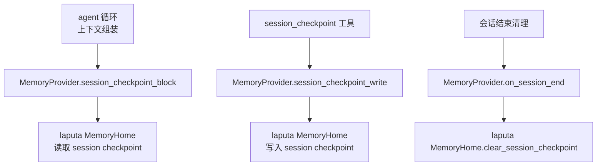
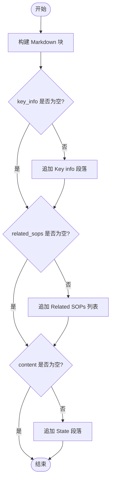
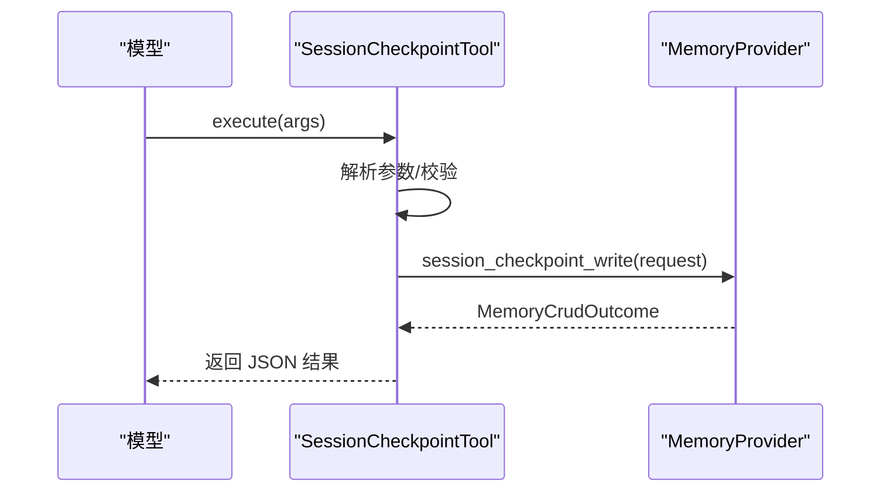
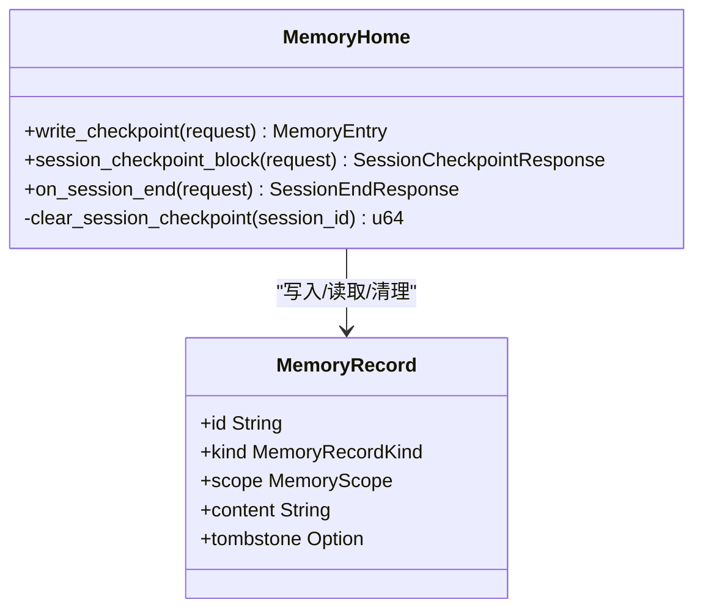
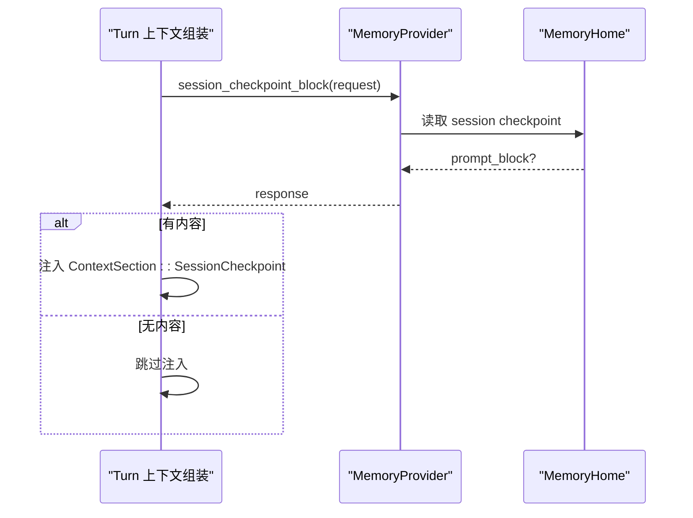
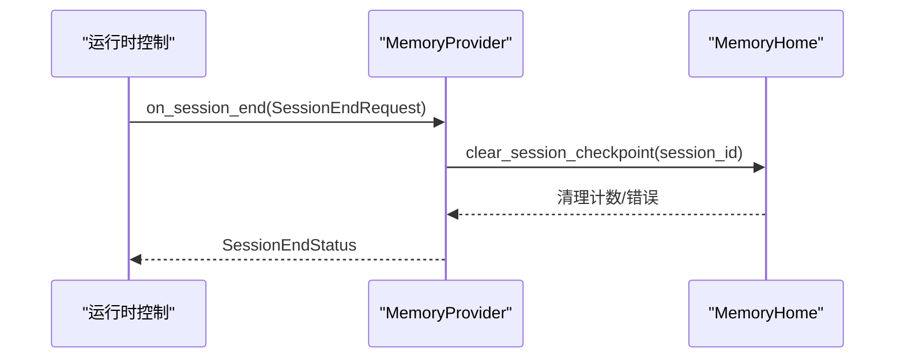
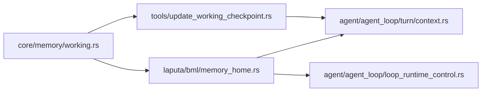

# 会话检查点

<cite>
**本文引用的文件**
- [working.rs](file://agent-diva-core/src/memory/working.rs)
- [update_working_checkpoint.rs](file://agent-diva-tools/src/update_working_checkpoint.rs)
- [memory_home.rs](file://agent-diva-laputa/src/bml/memory_home.rs)
- [context.rs](file://agent-diva-agent/src/agent_loop/turn/context.rs)
- [loop_runtime_control.rs](file://agent-diva-agent/src/agent_loop/loop_runtime_control.rs)
- [mod.rs](file://agent-diva-core/src/memory/mod.rs)
</cite>

## 目录
1. [简介](#简介)
2. [项目结构](#项目结构)
3. [核心组件](#核心组件)
4. [架构总览](#架构总览)
5. [详细组件分析](#详细组件分析)
6. [依赖关系分析](#依赖关系分析)
7. [性能考量](#性能考量)
8. [故障排查指南](#故障排查指南)
9. [结论](#结论)
10. [附录：使用示例与最佳实践](#附录使用示例与最佳实践)

## 简介
本文件聚焦“会话级检查点”能力，围绕以下目标展开：
- 解释 SessionCheckpointRequest 与 SessionCheckpointWriteRequest 的数据结构与用途。
- 说明会话级检查点的生命周期：写入、注入到上下文、会话结束清理。
- 详解 render_session_checkpoint_block 的实现原理与使用方式。
- 提供在智能体循环中创建与管理会话检查点的实践示例。
- 给出最佳实践与常见问题解决方案。

## 项目结构
会话检查点涉及四个关键位置：
- 数据契约与渲染函数：core/memory/working.rs
- 工具层封装：tools/update_working_checkpoint.rs
- 存储实现与生命周期钩子：laputa/bml/memory_home.rs
- 上下文注入与会话结束清理：agent/agent_loop/turn/context.rs、agent/agent_loop/loop_runtime_control.rs



图表来源
- [context.rs:420-439](file://agent-diva-agent/src/agent_loop/turn/context.rs#L420-L439)
- [memory_home.rs:845-868](file://agent-diva-laputa/src/bml/memory_home.rs#L845-L868)
- [memory_home.rs:439-491](file://agent-diva-laputa/src/bml/memory_home.rs#L439-L491)
- [memory_home.rs:885-905](file://agent-diva-laputa/src/bml/memory_home.rs#L885-L905)
- [loop_runtime_control.rs:83-100](file://agent-diva-agent/src/agent_loop/loop_runtime_control.rs#L83-L100)
- [loop_runtime_control.rs:123-147](file://agent-diva-agent/src/agent_loop/loop_runtime_control.rs#L123-L147)

章节来源
- [context.rs:420-439](file://agent-diva-agent/src/agent_loop/turn/context.rs#L420-L439)
- [memory_home.rs:439-491](file://agent-diva-laputa/src/bml/memory_home.rs#L439-L491)
- [memory_home.rs:845-868](file://agent-diva-laputa/src/bml/memory_home.rs#L845-L868)
- [memory_home.rs:885-905](file://agent-diva-laputa/src/bml/memory_home.rs#L885-L905)
- [loop_runtime_control.rs:83-100](file://agent-diva-agent/src/agent_loop/loop_runtime_control.rs#L83-L100)
- [loop_runtime_control.rs:123-147](file://agent-diva-agent/src/agent_loop/loop_runtime_control.rs#L123-L147)

## 核心组件
- 数据契约（core/memory/working.rs）
  - SessionCheckpointRequest：用于查询当前会话的检查点块。包含 workspace_root 与 session_id。
  - SessionCheckpointResponse：返回 prompt_block（可选），为空则不注入任何内容。
  - SessionCheckpointWriteRequest：用于写入检查点。包含 workspace_root、session_id、key_info、related_sops、content。
  - render_session_checkpoint_block：将 key_info、related_sops、content 渲染为结构化 Markdown 块。
- 工具封装（tools/update_working_checkpoint.rs）
  - SessionCheckpointTool：暴露名为 session_checkpoint 的工具，负责参数校验、调用 provider 的写入接口并返回结果。
- 存储实现（laputa/bml/memory_home.rs）
  - write_checkpoint：将请求渲染为 Markdown 后以 SessionCheckpoint 类型持久化，scope 绑定 session_id。
  - session_checkpoint_block：按 session_id 检索最新未删除的记录，返回 prompt_block。
  - on_session_end：会话结束时清理该 session_id 下的会话级记录。
- 上下文注入（agent/agent_loop/turn/context.rs）
  - 每轮上下文组装时调用 session_checkpoint_block，若返回非空块则作为 ContextSection::SessionCheckpoint 注入动态部分。
- 会话结束清理（agent/agent_loop/loop_runtime_control.rs）
  - 在 ResetSession 与 DeleteSession 路径上调用 memory_provider.on_session_end，触发清理。

章节来源
- [working.rs:20-76](file://agent-diva-core/src/memory/working.rs#L20-L76)
- [update_working_checkpoint.rs:11-125](file://agent-diva-tools/src/update_working_checkpoint.rs#L11-L125)
- [memory_home.rs:439-491](file://agent-diva-laputa/src/bml/memory_home.rs#L439-L491)
- [memory_home.rs:845-868](file://agent-diva-laputa/src/bml/memory_home.rs#L845-L868)
- [memory_home.rs:885-905](file://agent-diva-laputa/src/bml/memory_home.rs#L885-L905)
- [context.rs:420-439](file://agent-diva-agent/src/agent_loop/turn/context.rs#L420-L439)
- [loop_runtime_control.rs:83-100](file://agent-diva-agent/src/agent_loop/loop_runtime_control.rs#L83-L100)
- [loop_runtime_control.rs:123-147](file://agent-diva-agent/src/agent_loop/loop_runtime_control.rs#L123-L147)

## 架构总览
会话检查点贯穿“写-读-清”三阶段：
- 写：智能体通过 session_checkpoint 工具写入 key_info、related_sops、content；后端将其渲染为 Markdown 并以 SessionCheckpoint 类型持久化，scope 限定在当前 session_id。
- 读：每轮上下文组装时，调用 session_checkpoint_block 获取最新检查点块，注入到动态上下文区域。
- 清：会话重置或删除时，调用 on_session_end，清理该 session_id 下的会话级记录。

```mermaid
sequenceDiagram
participant Agent as "智能体"
participant Tool as "session_checkpoint 工具"
participant Provider as "MemoryProvider"
participant Home as "MemoryHome"
participant Loop as "上下文组装"
Agent->>Tool : 调用 session_checkpoint(key_info, related_sops, content)
Tool->>Provider : session_checkpoint_write(request)
Provider->>Home : write_checkpoint()
Home-->>Provider : 返回写入结果
Provider-->>Tool : 返回结果
Tool-->>Agent : 返回执行结果
Loop->>Provider : session_checkpoint_block(request)
Provider->>Home : 读取 session checkpoint
Home-->>Provider : 返回 prompt_block
Provider-->>Loop : 返回 prompt_block
Loop-->>Loop : 注入为 ContextSection : : SessionCheckpoint
```

图表来源
- [update_working_checkpoint.rs:97-125](file://agent-diva-tools/src/update_working_checkpoint.rs#L97-L125)
- [memory_home.rs:439-491](file://agent-diva-laputa/src/bml/memory_home.rs#L439-L491)
- [memory_home.rs:845-868](file://agent-diva-laputa/src/bml/memory_home.rs#L845-L868)
- [context.rs:420-439](file://agent-diva-agent/src/agent_loop/turn/context.rs#L420-L439)

## 详细组件分析

### 数据结构与渲染函数
- SessionCheckpointRequest
  - 字段：workspace_root、session_id
  - 用途：查询当前会话的检查点块，供上下文注入使用。
- SessionCheckpointResponse
  - 字段：prompt_block（可选）
  - 语义：为空表示无检查点或不可用，不注入任何内容。
- SessionCheckpointWriteRequest
  - 字段：workspace_root、session_id、key_info、related_sops、content
  - 用途：写入会话工作检查点，仅在该会话内可见，会话结束即清理。
- render_session_checkpoint_block
  - 输入：key_info、related_sops、content
  - 输出：Markdown 块，包含标题、Key info、Related SOPs、State 等段落；空段将被省略。



图表来源
- [working.rs:55-76](file://agent-diva-core/src/memory/working.rs#L55-L76)

章节来源
- [working.rs:20-76](file://agent-diva-core/src/memory/working.rs#L20-L76)

### 工具层：session_checkpoint 工具
- 名称：session_checkpoint
- 描述：记录当前任务状态到会话的易失性检查点；仅在会话内可见，重置/删除/显式会话结束时物理清除；不是长期记忆。
- 参数：
  - key_info（必填）：结构化关键事实
  - related_sops（可选）：相关技能/SOP 名称
  - content（可选）：自由格式检查点内容
- 执行流程：
  - 解析参数
  - 校验 provider/workspace/session_id 可用性
  - 调用 provider.session_checkpoint_write
  - 返回 JSON 结果



图表来源
- [update_working_checkpoint.rs:54-125](file://agent-diva-tools/src/update_working_checkpoint.rs#L54-L125)

章节来源
- [update_working_checkpoint.rs:54-125](file://agent-diva-tools/src/update_working_checkpoint.rs#L54-L125)

### 存储实现：写入、读取与清理
- 写入（write_checkpoint）
  - 校验 session_id 非空
  - 生成唯一 id（基于 session_id 摘要）
  - 渲染 Markdown 块
  - 构造 MemoryRecord（kind=SessionCheckpoint，scope.session_id=当前会话）
  - 持久化并返回 entry
- 读取（session_checkpoint_block）
  - 根据 session_id 计算 id
  - 查询记录，过滤 kind=SessionCheckpoint、scope=session_id、未 tombstone
  - 返回 prompt_block
- 清理（on_session_end）
  - 调用 clear_session_checkpoint(session_id)
  - 返回清理状态（Noop/Triggered/Failed）



图表来源
- [memory_home.rs:439-491](file://agent-diva-laputa/src/bml/memory_home.rs#L439-L491)
- [memory_home.rs:845-868](file://agent-diva-laputa/src/bml/memory_home.rs#L845-L868)
- [memory_home.rs:885-905](file://agent-diva-laputa/src/bml/memory_home.rs#L885-L905)

章节来源
- [memory_home.rs:439-491](file://agent-diva-laputa/src/bml/memory_home.rs#L439-L491)
- [memory_home.rs:845-868](file://agent-diva-laputa/src/bml/memory_home.rs#L845-L868)
- [memory_home.rs:885-905](file://agent-diva-laputa/src/bml/memory_home.rs#L885-L905)

### 上下文注入：每轮组装时读取并注入
- 在 turn 上下文组装过程中，调用 session_checkpoint_block
- 若返回非空 prompt_block，则作为 ContextSection::SessionCheckpoint 注入到动态部分
- 注入顺序位于历史消息之后、当前用户消息之前



图表来源
- [context.rs:420-439](file://agent-diva-agent/src/agent_loop/turn/context.rs#L420-L439)

章节来源
- [context.rs:420-439](file://agent-diva-agent/src/agent_loop/turn/context.rs#L420-L439)

### 会话结束清理：重置与删除路径
- ResetSession：调用 on_session_end，失败时记录警告日志
- DeleteSession：先删除会话，再调用 on_session_end，失败时记录警告日志
- 清理逻辑由 MemoryHome 实现，实际调用 clear_session_checkpoint 进行 GC



图表来源
- [loop_runtime_control.rs:83-100](file://agent-diva-agent/src/agent_loop/loop_runtime_control.rs#L83-L100)
- [loop_runtime_control.rs:123-147](file://agent-diva-agent/src/agent_loop/loop_runtime_control.rs#L123-L147)
- [memory_home.rs:885-905](file://agent-diva-laputa/src/bml/memory_home.rs#L885-L905)

章节来源
- [loop_runtime_control.rs:83-100](file://agent-diva-agent/src/agent_loop/loop_runtime_control.rs#L83-L100)
- [loop_runtime_control.rs:123-147](file://agent-diva-agent/src/agent_loop/loop_runtime_control.rs#L123-L147)
- [memory_home.rs:885-905](file://agent-diva-laputa/src/bml/memory_home.rs#L885-L905)

## 依赖关系分析
- core/memory/working.rs 定义契约与渲染函数，被 tools 与 laputa 共同引用。
- agent-diva-tools 通过 MemoryProvider 抽象与具体实现解耦。
- agent-diva-laputa 提供 MemoryProvider 的具体实现，负责持久化与生命周期管理。
- agent 层在 turn 上下文组装与运行时控制中消费这些能力。



图表来源
- [mod.rs:43-46](file://agent-diva-core/src/memory/mod.rs#L43-L46)
- [update_working_checkpoint.rs:1-10](file://agent-diva-tools/src/update_working_checkpoint.rs#L1-L10)
- [memory_home.rs:439-491](file://agent-diva-laputa/src/bml/memory_home.rs#L439-L491)
- [context.rs:420-439](file://agent-diva-agent/src/agent_loop/turn/context.rs#L420-L439)
- [loop_runtime_control.rs:83-100](file://agent-diva-agent/src/agent_loop/loop_runtime_control.rs#L83-L100)

章节来源
- [mod.rs:43-46](file://agent-diva-core/src/memory/mod.rs#L43-L46)

## 性能考量
- 检查点块体积较小，渲染与注入开销低。
- 写入采用幂等覆盖策略（基于 session_id 的固定 id），避免重复记录膨胀。
- 读取仅在每轮上下文组装时进行一次，且空结果直接跳过注入。
- 清理在会话结束时批量 GC，减少运行时负担。
- 建议：
  - 保持 key_info 精炼，避免过长导致上下文压力。
  - 合理组织 related_sops，便于后续检索与审计。
  - 避免频繁写入相同内容，减少不必要的存储更新。

## 故障排查指南
- 工具返回“memory provider unavailable”
  - 原因：未配置或未注入 MemoryProvider
  - 处理：确保工具装配时传入 provider
- 工具返回“no active session”
  - 原因：未绑定 session_id
  - 处理：在工具装配时绑定当前会话键
- 上下文注入失败（非致命）
  - 现象：日志中出现 working memory block failed
  - 处理：不影响主流程，可忽略；若持续出现，检查存储可用性
- 会话结束清理失败
  - 现象：reset/delete 时出现 cleanup failed 警告
  - 处理：检查 MemoryHome 可用性与存储权限；必要时手动清理

章节来源
- [update_working_checkpoint.rs:100-125](file://agent-diva-tools/src/update_working_checkpoint.rs#L100-L125)
- [context.rs:420-439](file://agent-diva-agent/src/agent_loop/turn/context.rs#L420-L439)
- [loop_runtime_control.rs:83-100](file://agent-diva-agent/src/agent_loop/loop_runtime_control.rs#L83-L100)
- [loop_runtime_control.rs:123-147](file://agent-diva-agent/src/agent_loop/loop_runtime_control.rs#L123-L147)

## 结论
会话检查点提供了轻量、会话级、易失性的上下文增强能力：
- 通过工具写入结构化状态，渲染为 Markdown 块。
- 每轮上下文组装时自动注入，帮助模型感知当前任务进度。
- 会话结束时自动清理，避免污染长期记忆。
- 与长期记忆区分明确，需要持久化知识应通过 memory_distill 提升。

## 附录：使用示例与最佳实践

### 在智能体循环中使用检查点
- 写入检查点
  - 调用 session_checkpoint 工具，提供 key_info、related_sops、content
  - 参考路径：[update_working_checkpoint.rs:54-125](file://agent-diva-tools/src/update_working_checkpoint.rs#L54-L125)
- 读取检查点
  - 上下文组装自动调用 session_checkpoint_block
  - 参考路径：[context.rs:420-439](file://agent-diva-agent/src/agent_loop/turn/context.rs#L420-L439)
- 清理检查点
  - 会话重置或删除时自动调用 on_session_end
  - 参考路径：[loop_runtime_control.rs:83-100](file://agent-diva-agent/src/agent_loop/loop_runtime_control.rs#L83-L100)、[loop_runtime_control.rs:123-147](file://agent-diva-agent/src/agent_loop/loop_runtime_control.rs#L123-L147)

### 最佳实践
- 保持 key_info 简洁、可索引，便于后续检索与审计。
- 使用 related_sops 关联技能或流程，提高可追溯性。
- 避免在检查点中写入敏感信息或过大文本。
- 如需跨会话保留重要信息，请使用 memory_distill 提升到长期记忆。
- 定期检查清理是否成功，避免残留会话级数据。

### 常见问题
- 检查点未注入
  - 可能原因：provider 不可用、session_id 为空、存储不可用
  - 处理：检查工具装配与运行时环境
- 检查点未清理
  - 可能原因：on_session_end 未调用或失败
  - 处理：确认 reset/delete 路径正确触发清理；必要时手动清理

章节来源
- [update_working_checkpoint.rs:54-125](file://agent-diva-tools/src/update_working_checkpoint.rs#L54-L125)
- [context.rs:420-439](file://agent-diva-agent/src/agent_loop/turn/context.rs#L420-L439)
- [loop_runtime_control.rs:83-100](file://agent-diva-agent/src/agent_loop/loop_runtime_control.rs#L83-L100)
- [loop_runtime_control.rs:123-147](file://agent-diva-agent/src/agent_loop/loop_runtime_control.rs#L123-L147)