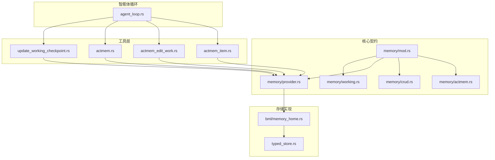
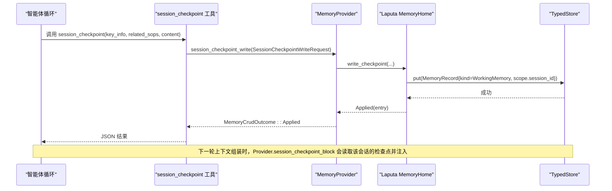
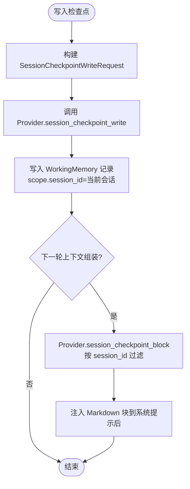
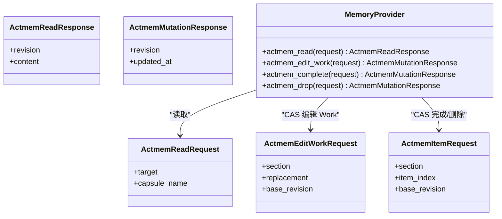
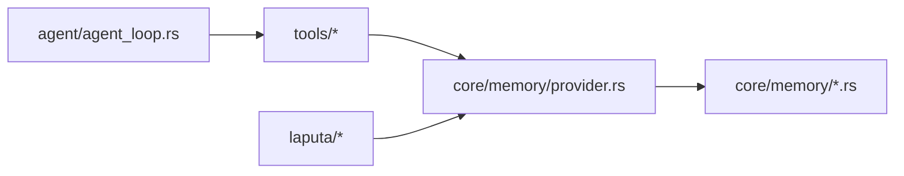

# 工作记忆

<cite>
**本文引用的文件**
- [agent-diva-core/src/memory/mod.rs](file://agent-diva-core/src/memory/mod.rs)
- [agent-diva-core/src/memory/working.rs](file://agent-diva-core/src/memory/working.rs)
- [agent-diva-core/src/memory/provider.rs](file://agent-diva-core/src/memory/provider.rs)
- [agent-diva-core/src/memory/crud.rs](file://agent-diva-core/src/memory/crud.rs)
- [agent-diva-core/src/memory/actmem.rs](file://agent-diva-core/src/memory/actmem.rs)
- [agent-diva-tools/src/update_working_checkpoint.rs](file://agent-diva-tools/src/update_working_checkpoint.rs)
- [agent-diva-tools/src/actmem.rs](file://agent-diva-tools/src/actmem.rs)
- [agent-diva-tools/src/actmem_edit_work.rs](file://agent-diva-tools/src/actmem_edit_work.rs)
- [agent-diva-tools/src/actmem_item.rs](file://agent-diva-tools/src/actmem_item.rs)
- [agent-diva-agent/src/agent_loop.rs](file://agent-diva-agent/src/agent_loop.rs)
- [agent-diva-laputa/src/bml/memory_home.rs](file://agent-diva-laputa/src/bml/memory_home.rs)
- [agent-diva-laputa/src/typed_store.rs](file://agent-diva-laputa/src/typed_store.rs)
</cite>

## 目录
1. [简介](#简介)
2. [项目结构](#项目结构)
3. [核心组件](#核心组件)
4. [架构总览](#架构总览)
5. [详细组件分析](#详细组件分析)
6. [依赖关系分析](#依赖关系分析)
7. [性能考虑](#性能考虑)
8. [故障排除指南](#故障排除指南)
9. [结论](#结论)
10. [附录：使用示例与最佳实践](#附录使用示例与最佳实践)

## 简介
本文件面向“工作记忆（L0）”模块，聚焦以下目标：
- 解释 L0 工作记忆的设计目标与实现原理：会话级、易失性、非权威、可注入上下文。
- 说明会话检查点机制：SessionCheckpointRequest、SessionCheckpointWriteRequest 的读写流程与生命周期。
- 描述 ACTMEM 系统：ActmemReadRequest、ActmemEditWorkRequest、ActmemItemRequest 等操作的边界与用途。
- 总结自动管理与清理策略：空闲折叠、会话结束清理、启动时 GC 能力。
- 提供在智能体循环中的正确使用示例与性能优化建议，并给出故障排除指引。

## 项目结构
工作记忆由 core 层定义契约与数据结构，tools 层暴露工具调用，agent 层负责在智能体循环中装配与调度，laputa 层提供具体存储与清理实现。



**图表来源**
- [agent-diva-core/src/memory/mod.rs:1-47](file://agent-diva-core/src/memory/mod.rs#L1-L47)
- [agent-diva-core/src/memory/working.rs:1-123](file://agent-diva-core/src/memory/working.rs#L1-L123)
- [agent-diva-core/src/memory/provider.rs:414-617](file://agent-diva-core/src/memory/provider.rs#L414-L617)
- [agent-diva-core/src/memory/crud.rs:1-192](file://agent-diva-core/src/memory/crud.rs#L1-L192)
- [agent-diva-core/src/memory/actmem.rs:1-51](file://agent-diva-core/src/memory/actmem.rs#L1-L51)
- [agent-diva-tools/src/update_working_checkpoint.rs:1-205](file://agent-diva-tools/src/update_working_checkpoint.rs#L1-L205)
- [agent-diva-tools/src/actmem.rs:1-68](file://agent-diva-tools/src/actmem.rs#L1-L68)
- [agent-diva-tools/src/actmem_edit_work.rs:1-65](file://agent-diva-tools/src/actmem_edit_work.rs#L1-L65)
- [agent-diva-tools/src/actmem_item.rs:1-110](file://agent-diva-tools/src/actmem_item.rs#L1-L110)
- [agent-diva-agent/src/agent_loop.rs:142-157](file://agent-diva-agent/src/agent_loop.rs#L142-L157)
- [agent-diva-laputa/src/bml/memory_home.rs:843-878](file://agent-diva-laputa/src/bml/memory_home.rs#L843-L878)
- [agent-diva-laputa/src/typed_store.rs:643-739](file://agent-diva-laputa/src/typed_store.rs#L643-L739)

**章节来源**
- [agent-diva-core/src/memory/mod.rs:1-47](file://agent-diva-core/src/memory/mod.rs#L1-L47)

## 核心组件
- 工作记忆契约与策略
  - L0_MEMORY_POLICY：指导模型将“会话进度”写入工作检查点而非长期记忆，遵循“动作验证写”和“最小指针”原则。
  - SessionCheckpointRequest / SessionCheckpointResponse：读取当前会话的检查点块，用于每轮上下文注入。
  - SessionCheckpointWriteRequest：写入会话检查点，包含 key_info、related_sops、content。
- 提供者边界 MemoryProvider
  - session_checkpoint_block：返回当前会话检查点 Markdown 块。
  - session_checkpoint_write：写入会话检查点（立即生效，非治理提案）。
  - on_session_end：会话结束时触发清理。
  - actmem_*：ACTMEM 读/写/完成/删除等能力。
- 工具层
  - session_checkpoint：会话检查点写入工具，参数仅暴露业务字段，workspace/session_id 由装配注入。
  - actmem、actmem_edit_work、actmem_complete、actmem_drop：ACTMEM 操作工具。
- 存储实现（Laputa）
  - memory_home：实现 session_checkpoint_block/write，按 session_id 过滤 tombstone 与 scope。
  - typed_store：提供会话级物理删除（gc_session_scoped）与过期会话清理（gc_stale_session_scoped）。

**章节来源**
- [agent-diva-core/src/memory/working.rs:10-52](file://agent-diva-core/src/memory/working.rs#L10-L52)
- [agent-diva-core/src/memory/provider.rs:586-617](file://agent-diva-core/src/memory/provider.rs#L586-L617)
- [agent-diva-tools/src/update_working_checkpoint.rs:11-20](file://agent-diva-tools/src/update_working_checkpoint.rs#L11-L20)
- [agent-diva-laputa/src/bml/memory_home.rs:843-878](file://agent-diva-laputa/src/bml/memory_home.rs#L843-L878)
- [agent-diva-laputa/src/typed_store.rs:664-739](file://agent-diva-laputa/src/typed_store.rs#L664-L739)

## 架构总览
工作记忆贯穿“工具调用 → 提供者 → 存储 → 上下文注入 → 会话结束清理”的完整链路。



**图表来源**
- [agent-diva-tools/src/update_working_checkpoint.rs:97-125](file://agent-diva-tools/src/update_working_checkpoint.rs#L97-L125)
- [agent-diva-core/src/memory/provider.rs:599-609](file://agent-diva-core/src/memory/provider.rs#L599-L609)
- [agent-diva-laputa/src/bml/memory_home.rs:870-878](file://agent-diva-laputa/src/bml/memory_home.rs#L870-L878)

## 详细组件分析

### 会话检查点机制（L0 工作记忆）
- 设计目标
  - 会话级、易失性、非权威：仅在当前会话有效，不成为长期权威；持久化知识需通过 memory_distill 显式提升。
  - 每轮注入：通过 Provider.session_checkpoint_block 将检查点 Markdown 注入到系统提示之后、prefetch 索引之前。
- 写入路径
  - 工具 session_checkpoint 接收 key_info、related_sops、content；workspace_root 与 session_id 由装配绑定，模型不可见。
  - 调用 Provider.session_checkpoint_write，最终落库为 WorkingMemory 记录，scope.session_id 限定会话范围。
- 读取路径
  - 每轮上下文组装时调用 Provider.session_checkpoint_block，按 session_id 过滤 tombstone 与 scope，返回 prompt_block。
- 清理策略
  - 会话结束：AgentLoop 遍历 list_sessions() 逐个调用 on_session_end，触发存储端清理。
  - 启动时 GC：存在 run_startup_gc 能力，但生产调用位置有限；对活跃会话保留，其余会话的工作记忆可被物理删除。
  - 物理删除顺序：先 supersedes，再 FTS，最后 records，保证外键约束。



**图表来源**
- [agent-diva-tools/src/update_working_checkpoint.rs:54-125](file://agent-diva-tools/src/update_working_checkpoint.rs#L54-L125)
- [agent-diva-core/src/memory/provider.rs:586-609](file://agent-diva-core/src/memory/provider.rs#L586-L609)
- [agent-diva-laputa/src/bml/memory_home.rs:843-878](file://agent-diva-laputa/src/bml/memory_home.rs#L843-L878)

**章节来源**
- [agent-diva-core/src/memory/working.rs:1-52](file://agent-diva-core/src/memory/working.rs#L1-L52)
- [agent-diva-core/src/memory/provider.rs:586-617](file://agent-diva-core/src/memory/provider.rs#L586-L617)
- [agent-diva-laputa/src/typed_store.rs:664-739](file://agent-diva-laputa/src/typed_store.rs#L664-L739)

### ACTMEM 系统
- 目标
  - 提供受控的、有边界的“活动记忆”投影与编辑能力，支持 Pulse、Recap、Work、Head、Capsules/Capsule 等目标。
  - Work 子节采用 CAS（base_revision）确保并发安全。
- 读操作
  - ActmemReadRequest(target, capsule_name?) → Provider.actmem_read → ActmemReadResponse(revision, content)。
  - 工具 actmem 暴露受限枚举 target，避免任意访问。
- 写操作
  - ActmemEditWorkRequest(section, replacement, base_revision) → Provider.actmem_edit_work → ActmemMutationResponse(revision, updated_at)。
  - ActmemComplete/Drop 针对 Open 项进行 CAS 完成或删除。
- 规则与注入
  - 可通过 Provider.memory_rules 获取写作手册，在写前注入以约束行为。



**图表来源**
- [agent-diva-core/src/memory/actmem.rs:1-51](file://agent-diva-core/src/memory/actmem.rs#L1-L51)
- [agent-diva-core/src/memory/provider.rs:528-559](file://agent-diva-core/src/memory/provider.rs#L528-L559)
- [agent-diva-tools/src/actmem.rs:32-66](file://agent-diva-tools/src/actmem.rs#L32-L66)
- [agent-diva-tools/src/actmem_edit_work.rs:32-63](file://agent-diva-tools/src/actmem_edit_work.rs#L32-L63)
- [agent-diva-tools/src/actmem_item.rs:51-108](file://agent-diva-tools/src/actmem_item.rs#L51-L108)

**章节来源**
- [agent-diva-core/src/memory/actmem.rs:1-51](file://agent-diva-core/src/memory/actmem.rs#L1-L51)
- [agent-diva-core/src/memory/provider.rs:528-559](file://agent-diva-core/src/memory/provider.rs#L528-L559)
- [agent-diva-tools/src/actmem.rs:1-68](file://agent-diva-tools/src/actmem.rs#L1-L68)
- [agent-diva-tools/src/actmem_edit_work.rs:1-65](file://agent-diva-tools/src/actmem_edit_work.rs#L1-L65)
- [agent-diva-tools/src/actmem_item.rs:1-110](file://agent-diva-tools/src/actmem_item.rs#L1-L110)

### 自动管理与清理策略
- 空闲折叠（Idle Fold）
  - 每个活跃会话维护一个计时器，空闲 10 分钟后尝试 fold_actmem_session；若期间有新活动则取消并重排。
  - 通过 mark_actmem_session_active 重置活动代次，schedule_actmem_idle_fold 安排任务。
- 会话结束清理
  - AgentLoop 退出时对 list_sessions() 逐会话调用 on_session_end，触发存储端清理。
- 启动时 GC
  - 提供 gc_session_scoped/gc_stale_session_scoped，按 session_id 物理删除工作记忆相关数据（supersedes→fts→records）。
  - 注意：生产调用位置有限，需结合运行时控制确保清理时机。

```mermaid
sequenceDiagram
participant Loop as "AgentLoop"
participant Prov as "MemoryProvider"
participant Store as "TypedStore"
Loop->>Prov : on_session_end(session_id)
Prov->>Store : gc_session_scoped(session_id)
Store-->>Prov : 删除计数
Prov-->>Loop : SessionEndStatus(Triggered/Noop/Failed)
```

**图表来源**
- [agent-diva-agent/src/agent_loop.rs:1035-1074](file://agent-diva-agent/src/agent_loop.rs#L1035-L1074)
- [agent-diva-laputa/src/typed_store.rs:664-739](file://agent-diva-laputa/src/typed_store.rs#L664-L739)

**章节来源**
- [agent-diva-agent/src/agent_loop.rs:142-157](file://agent-diva-agent/src/agent_loop.rs#L142-L157)
- [agent-diva-agent/src/agent_loop.rs:1035-1074](file://agent-diva-agent/src/agent_loop.rs#L1035-L1074)
- [agent-diva-laputa/src/typed_store.rs:664-739](file://agent-diva-laputa/src/typed_store.rs#L664-L739)

## 依赖关系分析
- 耦合与内聚
  - core 层只暴露领域契约（请求/响应/状态），tools 层封装工具调用，agent 层编排生命周期，laputa 层专注存储细节，层次清晰。
- 直接依赖
  - tools → core::memory::provider（MemoryProvider 接口）。
  - agent_loop → tools（工具注册与执行）、core（策略与类型）。
  - laputa → core（MemoryRecord/MemoryScope 等）。
- 外部集成点
  - 存储后端 SQLite（typed_store），通过事务与外键约束保证一致性。
- 潜在循环依赖
  - 无直接循环；通过 provider 接口解耦。



**图表来源**
- [agent-diva-core/src/memory/provider.rs:414-617](file://agent-diva-core/src/memory/provider.rs#L414-L617)
- [agent-diva-tools/src/update_working_checkpoint.rs:1-205](file://agent-diva-tools/src/update_working_checkpoint.rs#L1-L205)
- [agent-diva-agent/src/agent_loop.rs:142-157](file://agent-diva-agent/src/agent_loop.rs#L142-L157)
- [agent-diva-laputa/src/bml/memory_home.rs:843-878](file://agent-diva-laputa/src/bml/memory_home.rs#L843-L878)

**章节来源**
- [agent-diva-core/src/memory/provider.rs:414-617](file://agent-diva-core/src/memory/provider.rs#L414-L617)

## 性能考虑
- 上下文注入成本
  - 工作记忆块仅在每轮注入一次，且为空或 tombstone 时跳过，减少无效开销。
- 并发与 CAS
  - ACTMEM 写操作使用 base_revision 进行 CAS，避免覆盖冲突；建议在批量更新前先读取最新 revision。
- 空闲折叠与 GC
  - 空闲折叠延迟 10 分钟，避免频繁 I/O；GC 按会话粒度物理删除，降低查询与索引体积。
- 启动刷新
  - 通过 refresh_system_prompt_projection 合并重复/乱序刷新，减少重复渲染成本。

[本节为通用性能建议，不直接分析具体文件]

## 故障排除指南
- 工具不可用或未装配
  - 现象：session_checkpoint 返回“memory provider unavailable”或“no active session”。
  - 排查：确认 ToolAssembly 已注入 provider/workspace/session_id；检查 gate 是否允许 working_memory。
- 检查点未注入
  - 现象：下一轮上下文无工作记忆块。
  - 排查：确认 Provider.session_checkpoint_block 返回空块；检查 session_id 是否匹配、记录是否 tombstoned。
- 并发冲突
  - 现象：ACTMEM 写失败。
  - 排查：使用 base_revision 重试；确保先读取最新内容再编辑。
- 清理未生效
  - 现象：会话结束后仍有残留。
  - 排查：确认 on_session_end 被调用；检查 gc_session_scoped 是否执行；核对 list_sessions() 是否包含该会话。

**章节来源**
- [agent-diva-tools/src/update_working_checkpoint.rs:97-125](file://agent-diva-tools/src/update_working_checkpoint.rs#L97-L125)
- [agent-diva-laputa/src/bml/memory_home.rs:843-878](file://agent-diva-laputa/src/bml/memory_home.rs#L843-L878)
- [agent-diva-laputa/src/typed_store.rs:664-739](file://agent-diva-laputa/src/typed_store.rs#L664-L739)

## 结论
工作记忆（L0）通过会话级检查点实现了“短期、易失、非权威”的上下文增强，配合 ACTMEM 提供受控的活动记忆能力。其设计强调：
- 明确边界：工作记忆不入长期权威，需显式 distill。
- 安全并发：ACTMEM 使用 CAS 保护关键段。
- 自动管理：空闲折叠与会话结束清理保障资源回收。
在生产环境中，应确保工具装配正确、会话生命周期管理完善，并结合启动刷新与 GC 策略维持性能与一致性。

[本节为总结性内容，不直接分析具体文件]

## 附录：使用示例与最佳实践
- 在智能体循环中使用工作记忆
  - 写入检查点：在任务推进过程中调用 session_checkpoint，记录 key_info、related_sops、content。
  - 读取检查点：每轮上下文组装会自动注入；如需显式读取，调用 Provider.session_checkpoint_block。
  - 会话结束：确保 on_session_end 被调用，触发清理。
- ACTMEM 使用
  - 读取：actmem(target=capsules/capsule/work/head/pulse/recap)。
  - 编辑：actmem_edit_work(section=Goal/Open/Next/Constraints/Pointers, replacement, base_revision)。
  - 完成/删除：actmem_complete/drop(item_index, section, base_revision)。
- 最佳实践
  - 遵循 L0_MEMORY_POLICY：仅写入动作验证的事实，避免将临时进度写入长期记忆。
  - 使用最小指针：启动注入仅携带紧凑索引，按需检索详情。
  - 幂等与重试：对 CAS 写操作捕获冲突并基于最新 revision 重试。
  - 监控与日志：关注空闲折叠失败、GC 异常、刷新失败等降级路径。

**章节来源**
- [agent-diva-core/src/memory/working.rs:10-52](file://agent-diva-core/src/memory/working.rs#L10-L52)
- [agent-diva-core/src/memory/provider.rs:586-617](file://agent-diva-core/src/memory/provider.rs#L586-L617)
- [agent-diva-tools/src/actmem.rs:32-66](file://agent-diva-tools/src/actmem.rs#L32-L66)
- [agent-diva-tools/src/actmem_edit_work.rs:32-63](file://agent-diva-tools/src/actmem_edit_work.rs#L32-L63)
- [agent-diva-tools/src/actmem_item.rs:51-108](file://agent-diva-tools/src/actmem_item.rs#L51-L108)
- [agent-diva-agent/src/agent_loop.rs:1035-1074](file://agent-diva-agent/src/agent_loop.rs#L1035-L1074)