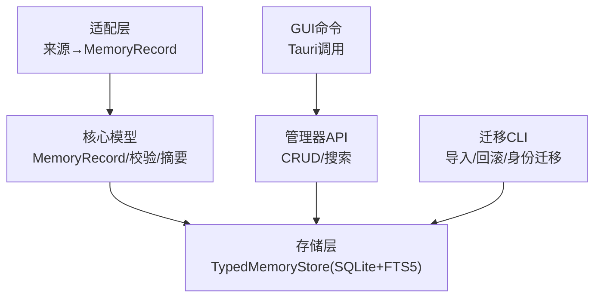
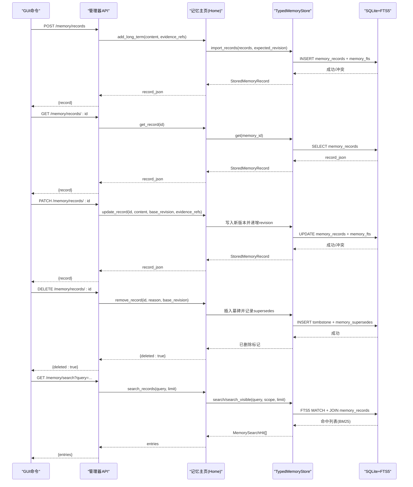
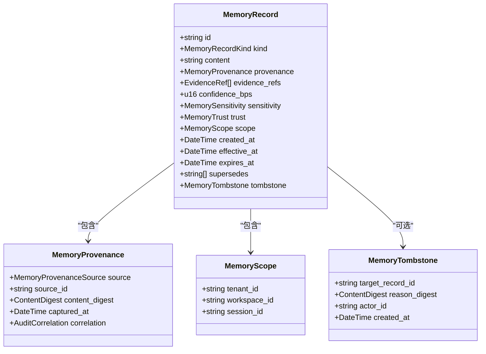
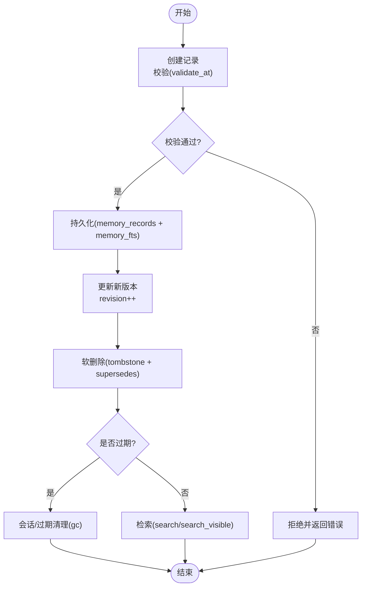
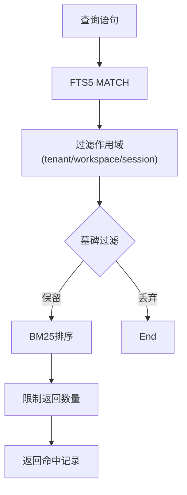
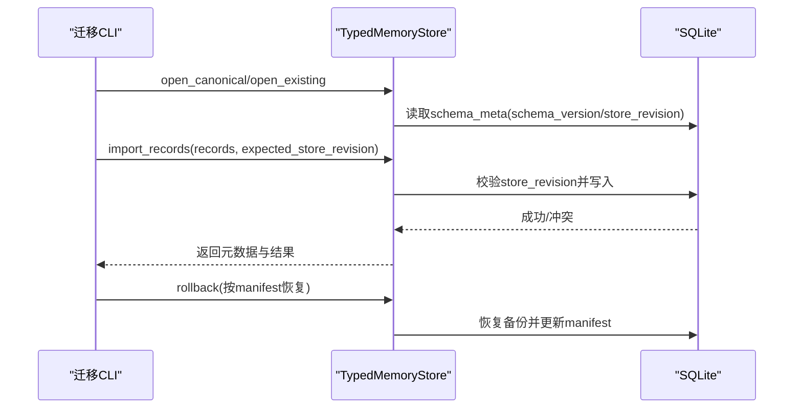
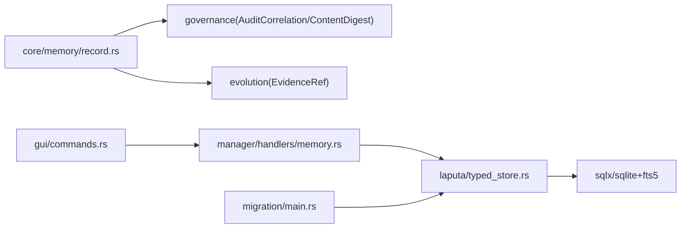
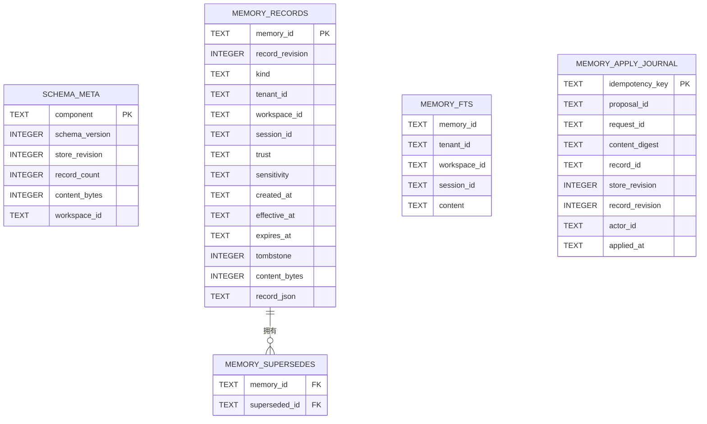

# 数据模型

<cite>
**本文引用的文件**
- [agent-diva-core/src/memory/record.rs](file://agent-diva-core/src/memory/record.rs)
- [agent-diva-laputa/src/typed_store.rs](file://agent-diva-laputa/src/typed_store.rs)
- [agent-diva-laputa/src/memory_records.rs](file://agent-diva-laputa/src/memory_records.rs)
- [agent-diva-manager/src/handlers/memory.rs](file://agent-diva-manager/src/handlers/memory.rs)
- [agent-diva-gui/src-tauri/src/commands.rs](file://agent-diva-gui/src-tauri/src/commands.rs)
- [agent-diva-migration/src/main.rs](file://agent-diva-migration/src/main.rs)
</cite>

## 目录
1. [简介](#简介)
2. [项目结构](#项目结构)
3. [核心组件](#核心组件)
4. [架构总览](#架构总览)
5. [详细组件分析](#详细组件分析)
6. [依赖关系分析](#依赖关系分析)
7. [性能考虑](#性能考虑)
8. [故障排查指南](#故障排查指南)
9. [结论](#结论)
10. [附录](#附录)

## 简介
本文件聚焦记忆数据模型，围绕 MemoryRecord 的结构设计、生命周期状态转换、元数据管理（信任度、敏感度、来源等）、索引与检索机制、以及数据迁移与版本管理进行系统化说明。文档同时提供数据库 Schema 图与实体关系图，帮助读者快速理解从持久化到查询的完整链路。

## 项目结构
记忆数据模型由以下模块协同实现：
- 核心数据模型与校验：定义 MemoryRecord 及其相关枚举、校验规则、摘要计算与提示渲染工具。
- 存储层：基于 SQLite 的 TypedMemoryStore，负责记录持久化、FTS5 全文检索、工作区隔离、会话清理、完整性检查与并发控制。
- 适配与迁移：将历史来源（Markdown、Laputa 段落）规范化为 MemoryRecord；提供离线迁移 CLI 与工件清单。
- 服务与接口：Manager HTTP 处理器暴露 CRUD 与搜索能力；GUI Tauri 命令通过后端 API 访问记忆。

图表来源
- [agent-diva-core/src/memory/record.rs:103-120](file://agent-diva-core/src/memory/record.rs#L103-L120)
- [agent-diva-laputa/src/typed_store.rs:476-589](file://agent-diva-laputa/src/typed_store.rs#L476-L589)
- [agent-diva-laputa/src/memory_records.rs:65-160](file://agent-diva-laputa/src/memory_records.rs#L65-L160)
- [agent-diva-manager/src/handlers/memory.rs:66-122](file://agent-diva-manager/src/handlers/memory.rs#L66-L122)
- [agent-diva-gui/src-tauri/src/commands.rs:854-891](file://agent-diva-gui/src-tauri/src/commands.rs#L854-L891)
- [agent-diva-migration/src/main.rs:80-139](file://agent-diva-migration/src/main.rs#L80-L139)

章节来源
- [agent-diva-core/src/memory/record.rs:103-120](file://agent-diva-core/src/memory/record.rs#L103-L120)
- [agent-diva-laputa/src/typed_store.rs:476-589](file://agent-diva-laputa/src/typed_store.rs#L476-L589)
- [agent-diva-laputa/src/memory_records.rs:65-160](file://agent-diva-laputa/src/memory_records.rs#L65-L160)
- [agent-diva-manager/src/handlers/memory.rs:66-122](file://agent-diva-manager/src/handlers/memory.rs#L66-L122)
- [agent-diva-gui/src-tauri/src/commands.rs:854-891](file://agent-diva-gui/src-tauri/src/commands.rs#L854-L891)
- [agent-diva-migration/src/main.rs:80-139](file://agent-diva-migration/src/main.rs#L80-L139)

## 核心组件
- MemoryRecord：稳定化的记忆记录，包含标识、类型、内容、来源、证据、置信度、敏感度、信任、作用域、时间戳、失效期、替代关系与墓碑标记。
- 元数据与约束：
  - 来源：MemoryProvenanceSource（如 Laputa 应用段落、遗留 Markdown、用户输入、工具结果、会话同步、AutoDream、上下文压缩、文件）。
  - 敏感度：MemorySensitivity（Public/Internal/Private/Restricted）。
  - 信任：MemoryTrust（AppliedAuthority/UserAsserted/Observed/Inferred/Untrusted）。
  - 作用域：MemoryScope（tenant_id/workspace_id/session_id）。
  - 置信度：confidence_bps，上限为 10000。
  - 时间：created_at/effective_at/expires_at 需满足严格时序约束。
  - 替代与墓碑：supersedes 列表与可选 tombstone 标记用于软删除与版本演进。
- 校验与完整性：
  - validate_at 对必填字段、摘要一致性、未知枚举、置信度范围、时间顺序、墓碑语义等进行强校验。
  - compare_normalized_records 生成 MemoryIntegrityReport，报告重复 ID、断裂 supersedes、过期与墓碑计数等。
- 存储与检索：
  - TypedMemoryStore 使用 SQLite + FTS5，维护 schema_meta、memory_records、memory_supersedes、memory_fts 等表。
  - 支持按租户/工作区/会话精确过滤的 search/search_visible，返回 BM25 排序结果。
  - 提供导入、列表、获取、垃圾回收、完整性检查等方法。
- 适配与迁移：
  - 将历史来源（Markdown/Laputa 段落）转换为 MemoryRecord，并赋予可信度与敏感度。
  - 离线迁移 CLI 支持 DryRun/Apply/Rollback，以及工作区身份迁移。

章节来源
- [agent-diva-core/src/memory/record.rs:14-74](file://agent-diva-core/src/memory/record.rs#L14-L74)
- [agent-diva-core/src/memory/record.rs:103-120](file://agent-diva-core/src/memory/record.rs#L103-L120)
- [agent-diva-core/src/memory/record.rs:193-289](file://agent-diva-core/src/memory/record.rs#L193-L289)
- [agent-diva-core/src/memory/record.rs:291-350](file://agent-diva-core/src/memory/record.rs#L291-L350)
- [agent-diva-laputa/src/typed_store.rs:476-589](file://agent-diva-laputa/src/typed_store.rs#L476-L589)
- [agent-diva-laputa/src/typed_store.rs:1119-1205](file://agent-diva-laputa/src/typed_store.rs#L1119-L1205)
- [agent-diva-laputa/src/memory_records.rs:65-160](file://agent-diva-laputa/src/memory_records.rs#L65-L160)
- [agent-diva-migration/src/main.rs:80-139](file://agent-diva-migration/src/main.rs#L80-L139)

## 架构总览
下图展示从 GUI/Manager 到存储层的调用链路与数据流，包括创建、更新、删除与搜索。

图表来源
- [agent-diva-gui/src-tauri/src/commands.rs:854-891](file://agent-diva-gui/src-tauri/src/commands.rs#L854-L891)
- [agent-diva-manager/src/handlers/memory.rs:66-122](file://agent-diva-manager/src/handlers/memory.rs#L66-L122)
- [agent-diva-laputa/src/typed_store.rs:750-800](file://agent-diva-laputa/src/typed_store.rs#L750-L800)
- [agent-diva-laputa/src/typed_store.rs:1119-1205](file://agent-diva-laputa/src/typed_store.rs#L1119-L1205)

## 详细组件分析

### MemoryRecord 结构与约束
- 字段概览：
  - id：唯一标识。
  - kind：记录类别（身份、关系、承诺、偏好、长期、历史、日/周/月、日志、学习、会话检查点）。
  - content：正文内容。
  - provenance：不可变来源信息（source/source_id/content_digest/captured_at/correlation）。
  - evidence_refs：证据引用列表。
  - confidence_bps：置信度（基点），上限 10000。
  - sensitivity：敏感度边界（公开/内部/私有/受限）。
  - trust：信任等级（权威应用/用户断言/观察/推断/不信任）。
  - scope：作用域（tenant/workspace/session）。
  - created_at/effective_at/expires_at：时间线约束。
  - supersedes：被当前记录替代的记录ID集合。
  - tombstone：可选墓碑，表示软删除。
- 关键约束：
  - 必填字段校验（id、scope.tenant_id、scope.workspace_id、provenance.source_id）。
  - 内容摘要一致性：非墓碑时 content 必须匹配 provenance.content_digest。
  - 未知枚举禁止（kind/source/sensitivity/trust 不得为 Unknown）。
  - 置信度范围限制（<=10000）。
  - 时间顺序：effective_at >= created_at；expires_at > effective_at（若存在）。
  - 墓碑语义：tombstone 记录不得含内容；target_record_id 必须在 supersedes 中；actor_id 与 reason_digest 必填。
  - 权威信任限制：当 trust=AppliedAuthority 时，source 必须来自受控来源，且证据来源不能是 AutoDreamRun/ContextCompaction。
  - 工作区隔离：validate_workspace 确保记录属于目标工作区。

图表来源
- [agent-diva-core/src/memory/record.rs:103-120](file://agent-diva-core/src/memory/record.rs#L103-L120)
- [agent-diva-core/src/memory/record.rs:84-101](file://agent-diva-core/src/memory/record.rs#L84-L101)

章节来源
- [agent-diva-core/src/memory/record.rs:14-74](file://agent-diva-core/src/memory/record.rs#L14-L74)
- [agent-diva-core/src/memory/record.rs:103-120](file://agent-diva-core/src/memory/record.rs#L103-L120)
- [agent-diva-core/src/memory/record.rs:193-289](file://agent-diva-core/src/memory/record.rs#L193-L289)

### 生命周期状态与转换
- 创建：
  - 通过 Manager 或适配器生成 MemoryRecord，经 validate_at 校验后导入存储。
  - 存储层在事务中写入 memory_records 与 memory_fts，并递增 store_revision。
- 更新：
  - 以新版本写入，保持旧版本可追溯；通过 revision 乐观锁避免覆盖冲突。
- 删除（软删除）：
  - 写入 tombstone 并记录 supersedes 指向被替代记录；读取侧排除墓碑目标。
- 过期与清理：
  - expires_at 用于逻辑过期；会话级记录可通过 gc_session_scoped/gc_stale_session_scoped 物理清理。
- 可见性：
  - search 要求精确 session 匹配；search_visible 允许全局与工作区级可见性叠加。

图表来源
- [agent-diva-core/src/memory/record.rs:193-289](file://agent-diva-core/src/memory/record.rs#L193-L289)
- [agent-diva-laputa/src/typed_store.rs:750-800](file://agent-diva-laputa/src/typed_store.rs#L750-L800)
- [agent-diva-laputa/src/typed_store.rs:664-743](file://agent-diva-laputa/src/typed_store.rs#L664-L743)
- [agent-diva-laputa/src/typed_store.rs:1119-1205](file://agent-diva-laputa/src/typed_store.rs#L1119-L1205)

章节来源
- [agent-diva-core/src/memory/record.rs:193-289](file://agent-diva-core/src/memory/record.rs#L193-L289)
- [agent-diva-laputa/src/typed_store.rs:664-743](file://agent-diva-laputa/src/typed_store.rs#L664-L743)
- [agent-diva-laputa/src/typed_store.rs:1119-1205](file://agent-diva-laputa/src/typed_store.rs#L1119-L1205)

### 记忆元数据管理
- 信任度（trust）：
  - AppliedAuthority：来自受控来源（如 Laputa 应用段落、遗留 Markdown 所有者、AutoDream），配合严格证据来源限制。
  - UserAsserted/Observed/Inferred/Untrusted：根据来源与上下文赋予不同信任等级。
- 敏感度（sensitivity）：
  - Public/Internal/Private/Restricted：用于召回与渲染前的访问控制边界。
- 来源（provenance）：
  - source/source_id：追踪原始来源与标识。
  - content_digest：内容摘要，保证内容未被篡改。
  - captured_at/correlation：捕获时间与审计关联（request_id/turn_id/session_id）。
- 证据（evidence_refs）：
  - 记录支撑证据的来源与引用，限制权威信任的证据来源。

章节来源
- [agent-diva-core/src/memory/record.rs:35-74](file://agent-diva-core/src/memory/record.rs#L35-L74)
- [agent-diva-core/src/memory/record.rs:84-101](file://agent-diva-core/src/memory/record.rs#L84-L101)
- [agent-diva-core/src/memory/record.rs:193-289](file://agent-diva-core/src/memory/record.rs#L193-L289)
- [agent-diva-laputa/src/memory_records.rs:65-160](file://agent-diva-laputa/src/memory_records.rs#L65-L160)

### 记忆索引与检索机制
- 全文索引：
  - 使用 SQLite FTS5 虚拟表 memory_fts，tokenize='unicode61'，支持多语言分词。
  - 索引字段包含 memory_id、tenant_id、workspace_id、session_id、content。
- 检索方法：
  - search：精确作用域匹配（tenant/workspace/session），过滤墓碑，按 BM25 排序。
  - search_visible：放宽 session 限制，允许全局与工作区级可见性叠加，按 BM25 与 effective_at 排序。
- 启动索引：
  - L1 索引块仅注入指针与预览，避免注入完整内容，遵循最小指针原则。

图表来源
- [agent-diva-laputa/src/typed_store.rs:537-551](file://agent-diva-laputa/src/typed_store.rs#L537-L551)
- [agent-diva-laputa/src/typed_store.rs:1119-1205](file://agent-diva-laputa/src/typed_store.rs#L1119-L1205)
- [agent-diva-core/src/memory/record.rs:314-350](file://agent-diva-core/src/memory/record.rs#L314-L350)

章节来源
- [agent-diva-laputa/src/typed_store.rs:537-551](file://agent-diva-laputa/src/typed_store.rs#L537-L551)
- [agent-diva-laputa/src/typed_store.rs:1119-1205](file://agent-diva-laputa/src/typed_store.rs#L1119-L1205)
- [agent-diva-core/src/memory/record.rs:314-350](file://agent-diva-core/src/memory/record.rs#L314-L350)

### 数据迁移与版本管理
- 存储版本：
  - schema_version 与 store_revision 在 schema_meta 中维护，写操作前进行乐观锁校验。
- 工作区身份迁移：
  - 支持从旧路径身份升级到规范工作区 ID，附带备份与清单验证。
- 离线迁移 CLI：
  - 提供 Memory/Experience 子命令，支持 DryRun/Apply/Rollback。
  - 通过 feature flags 控制 Apply 权限，确保变更可控。
- 工件清单：
  - 迁移产物包含 records.json、rollback.json、manifest.json，确保可回滚与审计。

图表来源
- [agent-diva-laputa/src/typed_store.rs:201-237](file://agent-diva-laputa/src/typed_store.rs#L201-L237)
- [agent-diva-laputa/src/typed_store.rs:750-800](file://agent-diva-laputa/src/typed_store.rs#L750-L800)
- [agent-diva-migration/src/main.rs:80-139](file://agent-diva-migration/src/main.rs#L80-L139)

章节来源
- [agent-diva-laputa/src/typed_store.rs:201-237](file://agent-diva-laputa/src/typed_store.rs#L201-L237)
- [agent-diva-laputa/src/typed_store.rs:750-800](file://agent-diva-laputa/src/typed_store.rs#L750-L800)
- [agent-diva-migration/src/main.rs:80-139](file://agent-diva-migration/src/main.rs#L80-L139)

## 依赖关系分析
- 核心模型依赖治理与演化模块（AuditCorrelation、ContentDigest、EvidenceRef）。
- 存储层依赖 SQLx 与 SQLite FTS5，提供事务、外键、并发与容量限制。
- 管理器与 GUI 通过 HTTP/Tauri 调用记忆主页，间接依赖存储层。
- 迁移 CLI 依赖存储层进行导入与回滚，并通过 feature flags 控制执行。

图表来源
- [agent-diva-core/src/memory/record.rs:6-9](file://agent-diva-core/src/memory/record.rs#L6-L9)
- [agent-diva-laputa/src/typed_store.rs:15-18](file://agent-diva-laputa/src/typed_store.rs#L15-L18)
- [agent-diva-manager/src/handlers/memory.rs:66-122](file://agent-diva-manager/src/handlers/memory.rs#L66-L122)
- [agent-diva-gui/src-tauri/src/commands.rs:854-891](file://agent-diva-gui/src-tauri/src/commands.rs#L854-L891)
- [agent-diva-migration/src/main.rs:80-139](file://agent-diva-migration/src/main.rs#L80-L139)

章节来源
- [agent-diva-core/src/memory/record.rs:6-9](file://agent-diva-core/src/memory/record.rs#L6-L9)
- [agent-diva-laputa/src/typed_store.rs:15-18](file://agent-diva-laputa/src/typed_store.rs#L15-L18)
- [agent-diva-manager/src/handlers/memory.rs:66-122](file://agent-diva-manager/src/handlers/memory.rs#L66-L122)
- [agent-diva-gui/src-tauri/src/commands.rs:854-891](file://agent-diva-gui/src-tauri/src/commands.rs#L854-L891)
- [agent-diva-migration/src/main.rs:80-139](file://agent-diva-migration/src/main.rs#L80-L139)

## 性能考虑
- 容量限制：
  - MAX_MEMORY_RECORDS=10000，MAX_MEMORY_CONTENT_BYTES=32MB，防止存储膨胀。
- 并发与锁：
  - 写操作使用内存锁与事务，避免并发写入冲突；store_revision 乐观锁保障一致性。
- 检索优化：
  - FTS5 BM25 排序提升相关性；UNINDEXED 字段减少索引开销。
- 启动索引：
  - L1 索引块限制行数与预览长度，避免注入过多内容影响性能。

章节来源
- [agent-diva-laputa/src/typed_store.rs:26-29](file://agent-diva-laputa/src/typed_store.rs#L26-L29)
- [agent-diva-laputa/src/typed_store.rs:537-551](file://agent-diva-laputa/src/typed_store.rs#L537-L551)
- [agent-diva-core/src/memory/record.rs:314-350](file://agent-diva-core/src/memory/record.rs#L314-L350)

## 故障排查指南
- 常见错误：
  - 记录无效：MissingRequiredField/Unknown* 枚举/CreatedInFuture/EffectiveBeforeCreation/InvalidExpiry/SelfSupersedes/TombstoneContainsContent/TombstoneTargetMismatch/InvalidAuthoritySource/InvalidAuthorityEvidence/WorkspaceMismatch。
  - 存储冲突：StoreRevisionConflict/RecordRevisionConflict/ImportConflict。
  - 环境异常：UnsupportedSchema/FtsUnavailable/CapacityExceeded/CorruptRecord。
- 诊断建议：
  - 使用 integrity() 检查 schema_version、store_revision、record_count、tombstone_count、content_bytes、fts_row_count、corrupt_record_ids、orphan_fts_rows。
  - 检查墓碑与替代关系：superseded_target_ids 获取被墓碑目标的记录ID集合。
  - 会话清理：gc_session_scoped/gc_stale_session_scoped 清理残留会话记录。

章节来源
- [agent-diva-core/src/memory/record.rs:153-191](file://agent-diva-core/src/memory/record.rs#L153-L191)
- [agent-diva-core/src/memory/record.rs:193-289](file://agent-diva-core/src/memory/record.rs#L193-L289)
- [agent-diva-laputa/src/typed_store.rs:31-76](file://agent-diva-laputa/src/typed_store.rs#L31-L76)
- [agent-diva-laputa/src/typed_store.rs:640-662](file://agent-diva-laputa/src/typed_store.rs#L640-L662)
- [agent-diva-laputa/src/typed_store.rs:1207-1213](file://agent-diva-laputa/src/typed_store.rs#L1207-L1213)

## 结论
MemoryRecord 提供了稳定、可校验、可追溯的记忆数据模型，结合严格的元数据管理与生命周期约束，确保数据一致性与安全性。存储层通过 SQLite + FTS5 提供高效检索与作用域隔离，迁移工具与工作区身份升级保障了平滑演进。整体架构清晰、可扩展，适合大规模记忆管理与检索场景。

## 附录

### 数据库 Schema 图

图表来源
- [agent-diva-laputa/src/typed_store.rs:476-589](file://agent-diva-laputa/src/typed_store.rs#L476-L589)