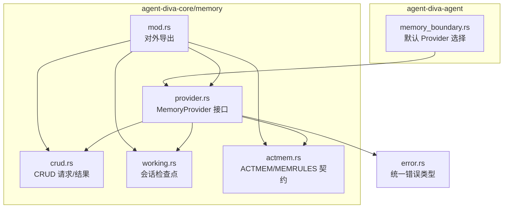
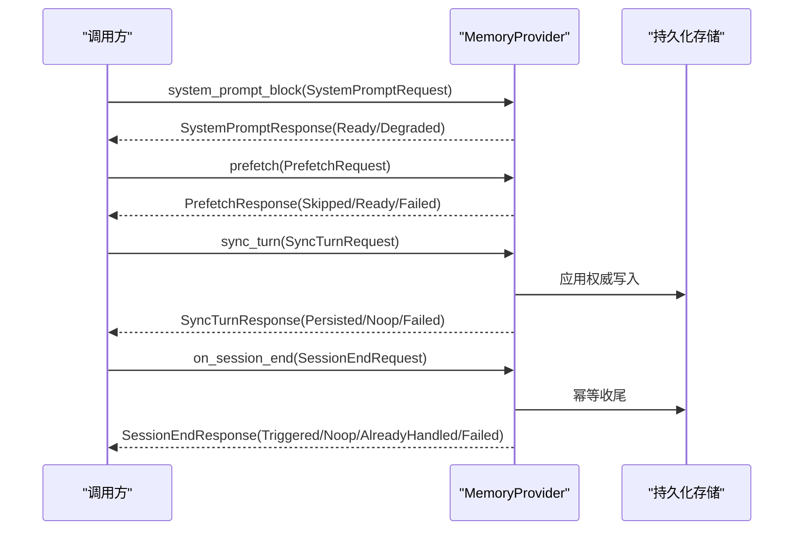
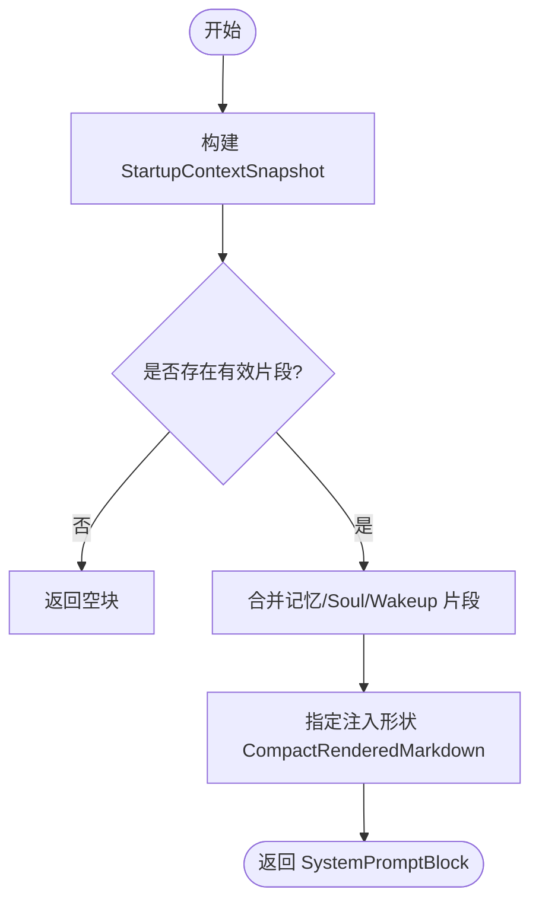
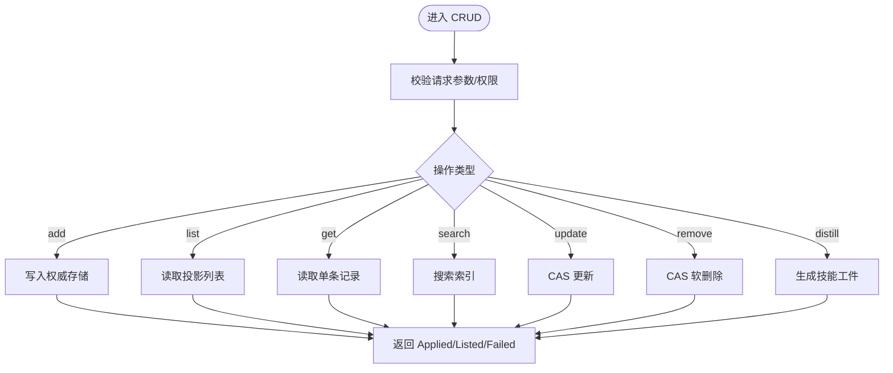
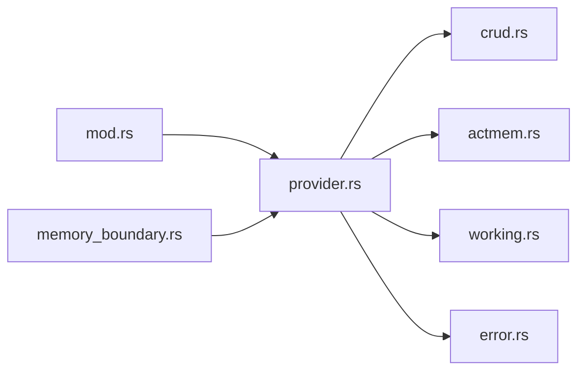

# Provider 抽象层

<cite>
**本文引用的文件**
- [provider.rs](file://agent-diva-core/src/memory/provider.rs)
- [crud.rs](file://agent-diva-core/src/memory/crud.rs)
- [mod.rs](file://agent-diva-core/src/memory/mod.rs)
- [working.rs](file://agent-diva-core/src/memory/working.rs)
- [actmem.rs](file://agent-diva-core/src/memory/actmem.rs)
- [memory_boundary.rs](file://agent-diva-agent/src/memory_boundary.rs)
- [error.rs](file://agent-diva-core/src/error.rs)
</cite>

## 目录
1. [简介](#简介)
2. [项目结构](#项目结构)
3. [核心组件](#核心组件)
4. [架构总览](#架构总览)
5. [详细组件分析](#详细组件分析)
6. [依赖关系分析](#依赖关系分析)
7. [性能考量](#性能考量)
8. [故障排查指南](#故障排查指南)
9. [结论](#结论)
10. [附录](#附录)

## 简介
本文件聚焦 MemoryProvider 抽象层，系统性说明 Provider 接口的设计原则、扩展机制与统一 CRUD 契约；解释启动上下文快照（StartupContextSnapshot）与系统提示刷新机制；描述会话结束处理（SessionEndRequest）与同步轮次（SyncTurnRequest）的处理逻辑；并提供自定义 Provider 的实现指南、最佳实践、错误处理模式与接口示例路径。

## 项目结构
MemoryProvider 抽象层位于 agent-diva-core 的 memory 模块中，围绕 provider 接口、CRUD 请求/响应、工作区会话检查点、ACTMEM 工具契约等组织：
- provider.rs：定义 MemoryProvider trait、生命周期钩子、启动/刷新/预取/同步/会话结束等请求与响应类型。
- crud.rs：定义面向 Agent 的记忆增删改查请求、条目模型与统一结果枚举。
- working.rs：定义会话级工作检查点（volatile, session-scoped）及其渲染。
- actmem.rs：定义 Provider 中立的 ACTMEM/MEMRULES 工具契约。
- mod.rs：对外导出上述能力，供上层 agent 与 manager 使用。
- memory_boundary.rs：在 agent 层选择默认 MemoryProvider（指向 Laputa 的 MemoryHome）。
- error.rs：统一的 Error 类型，用于 Provider 调用链的错误传播。

图表来源
- [provider.rs:414-617](file://agent-diva-core/src/memory/provider.rs#L414-L617)
- [crud.rs:1-192](file://agent-diva-core/src/memory/crud.rs#L1-L192)
- [working.rs:1-123](file://agent-diva-core/src/memory/working.rs#L1-L123)
- [actmem.rs:1-51](file://agent-diva-core/src/memory/actmem.rs#L1-L51)
- [mod.rs:1-47](file://agent-diva-core/src/memory/mod.rs#L1-L47)
- [memory_boundary.rs:1-44](file://agent-diva-agent/src/memory_boundary.rs#L1-L44)
- [error.rs:1-73](file://agent-diva-core/src/error.rs#L1-L73)

章节来源
- [provider.rs:1-770](file://agent-diva-core/src/memory/provider.rs#L1-L770)
- [crud.rs:1-192](file://agent-diva-core/src/memory/crud.rs#L1-L192)
- [working.rs:1-123](file://agent-diva-core/src/memory/working.rs#L1-L123)
- [actmem.rs:1-51](file://agent-diva-core/src/memory/actmem.rs#L1-L51)
- [mod.rs:1-47](file://agent-diva-core/src/memory/mod.rs#L1-L47)
- [memory_boundary.rs:1-44](file://agent-diva-agent/src/memory_boundary.rs#L1-L44)
- [error.rs:1-73](file://agent-diva-core/src/error.rs#L1-L73)

## 核心组件
- MemoryProvider trait：定义启动注入、预取、同步、会话结束、CRUD、ACTMEM、规则获取、会话检查点等能力边界。
- StartupContextSnapshot：将多源启动数据（Soul/Wakeup/记忆等）渲染为紧凑 Markdown 块，注入系统提示。
- SystemPromptRefreshRequest/Response：外部权威写入后刷新缓存的启动投影，返回最新权威版本与是否变更。
- Prefetch/PrefetchResponse：意图感知的可选预取，失败或无意图时以状态表达而非抛错。
- SyncTurnRequest/Response：成功轮次后的持久化同步，报告已持久化、无需操作或失败。
- SessionEndRequest/Response：会话关闭时的幂等收尾钩子。
- CRUD 统一契约：add/list/get/search/update/remove/distill 等操作的请求与统一结果 MemoryCrudOutcome。
- 会话检查点：session_checkpoint_block/write，用于会话内临时状态注入与清理。
- ACTMEM/MEMRULES：Provider 中立的工作项读取与编辑、能力规则获取。

章节来源
- [provider.rs:22-617](file://agent-diva-core/src/memory/provider.rs#L22-L617)
- [crud.rs:11-143](file://agent-diva-core/src/memory/crud.rs#L11-L143)
- [working.rs:10-52](file://agent-diva-core/src/memory/working.rs#L10-L52)
- [actmem.rs:1-51](file://agent-diva-core/src/memory/actmem.rs#L1-L51)

## 架构总览
MemoryProvider 作为 Agent-Diva 与任意长时记忆后端之间的隔离层，遵循“领域契约优先、不泄露传输细节”的原则。启动阶段通过 system_prompt_block 提供系统提示片段；运行期通过 prefetch 进行可选召回；成功后通过 sync_turn 持久化证据；会话结束时通过 on_session_end 完成幂等收尾。CRUD 与 ACTMEM 提供细粒度读写能力，会话检查点提供会话内临时状态。

图表来源
- [provider.rs:414-617](file://agent-diva-core/src/memory/provider.rs#L414-L617)

## 详细组件分析

### Provider 接口设计与扩展机制
- 设计原则
  - 启动方法必须同步且无副作用，仅读取本地/缓存状态。
  - 运行期方法（prefetch/sync_turn/on_session_end）可异步，承载 I/O。
  - 预取是可选的，失败不应中断主流程；同步是持久化专属，不得用于回填启动内容。
  - 会话结束需幂等，避免重复处理。
  - 当存在 .laputa 工作区但无法打开时，应返回明确的降级状态，禁止静默回退到 Markdown 第二真相。
  - 所有请求/响应均为领域结构体，不泄露 MCP/CLI/HTTP/后端模型。
- 扩展点
  - 新增能力可通过实现对应方法并返回默认不支持的结果（如 MemoryCrudOutcome::unsupported），逐步开放。
  - 支持 CRON/审计/安全策略的 Provider 可在 on_session_end 中触发收尾任务。
  - 对启动投影有缓存的 Provider 可实现 refresh_system_prompt_projection 以响应权威写入。

章节来源
- [provider.rs:391-617](file://agent-diva-core/src/memory/provider.rs#L391-L617)

### 启动上下文快照（StartupContextSnapshot）与系统提示刷新
- StartupContextSnapshot
  - 聚合 laputa_state_root、soul_markdown、wakeup_markdown、wakeup_pack、memory_markdown 等片段。
  - 通过 into_system_prompt_block 渲染为紧凑 Markdown 块，按固定顺序拼接，不包含节奏/报告内容。
- 系统提示刷新
  - refresh_system_prompt_projection 接收 workspace_root 与 authority_revision，返回最新权威版本与是否变更。
  - 未维护可刷新投影的 Provider 可忽略变更，保持兼容。

图表来源
- [provider.rs:127-180](file://agent-diva-core/src/memory/provider.rs#L127-L180)
- [provider.rs:249-279](file://agent-diva-core/src/memory/provider.rs#L249-L279)

章节来源
- [provider.rs:127-279](file://agent-diva-core/src/memory/provider.rs#L127-L279)

### 会话结束处理（SessionEndRequest）
- 语义：会话关闭时的幂等收尾钩子，用于清理资源、折叠会话、提交证据等。
- 状态：Triggered/Noop/AlreadyHandled/Failed，确保重复调用不会造成副作用。
- 约束：不得补偿缺失的 sync_turn 写入，除非 Provider 明确文档化该行为。

章节来源
- [provider.rs:364-389](file://agent-diva-core/src/memory/provider.rs#L364-L389)

### 同步轮次（SyncTurnRequest）
- 语义：成功轮次后将记忆更新或历史/证据行持久化到权威存储。
- 状态：Persisted/Noop/Failed，失败时应尽量不阻断会话继续。
- 约束：仅做持久化，不做启动回填或实时召回。

章节来源
- [provider.rs:316-345](file://agent-diva-core/src/memory/provider.rs#L316-L345)

### 预取（Prefetch）
- 语义：基于当前轮次的意图与房间上下文，尝试召回相关片段注入上下文。
- 状态：SkippedNoIntent/Ready/Failed，失败时不应抛出顶层错误。
- 约束：只做召回组装，不做持久化。

章节来源
- [provider.rs:281-314](file://agent-diva-core/src/memory/provider.rs#L281-L314)

### 统一 CRUD 接口定义与标准流程
- 请求类型
  - add：低风险的即时写入（事实/偏好），附带证据引用。
  - list：列出已应用的记忆投影，支持 limit。
  - get：按稳定 id 检索单条记录。
  - search：全文搜索已应用记忆，支持 limit。
  - update：对 BML 记录的 CAS 更新，包含 base_revision。
  - remove：对 BML 记录的 CAS 软删除，包含 reason 与 base_revision。
  - distill：主动经验蒸馏为技能工件，附带证据。
- 结果类型
  - Applied/Listed/Failed，其中 Failed 提供稳定原因，便于上层区分“不支持”和“执行失败”。
- 标准流程
  - 校验请求参数与权限。
  - 执行底层存储操作（读/写/搜索）。
  - 返回统一结果，必要时附带 entry/evidence_advisory。
  - 对于不支持的操作，返回 unsupported 的 Failed。

图表来源
- [crud.rs:11-143](file://agent-diva-core/src/memory/crud.rs#L11-L143)
- [crud.rs:105-136](file://agent-diva-core/src/memory/crud.rs#L105-L136)

章节来源
- [crud.rs:1-192](file://agent-diva-core/src/memory/crud.rs#L1-L192)

### 会话检查点（Working Checkpoint）
- 语义：会话内临时状态，非权威，注入到轮次上下文，会话结束清除。
- 能力：读取当前检查点、写入检查点、渲染结构化 Markdown。
- 约束：长期化需显式通过 memory_distill 提升。

章节来源
- [working.rs:1-76](file://agent-diva-core/src/memory/working.rs#L1-L76)

### ACTMEM 与 MEMRULES
- ACTMEM：读取 Pulse/Recap/Work/Head/Capsules/Capsule，编辑 Work 子节，完成/丢弃条目，均带 revision 控制。
- MEMRULES：返回记忆写入手册，供写入时注入。

章节来源
- [actmem.rs:1-51](file://agent-diva-core/src/memory/actmem.rs#L1-L51)

## 依赖关系分析
- 模块耦合
  - provider.rs 依赖 crud.rs、actmem.rs、working.rs 的请求/响应类型。
  - mod.rs 集中导出，降低上层耦合。
  - agent 层 memory_boundary.rs 选择默认 Provider（Laputa MemoryHome）。
- 外部依赖
  - 错误类型来自 core 的 error.rs，保证跨模块一致。
- 潜在循环
  - 当前结构单向依赖，未见循环导入迹象。

图表来源
- [provider.rs:1-20](file://agent-diva-core/src/memory/provider.rs#L1-L20)
- [mod.rs:1-47](file://agent-diva-core/src/memory/mod.rs#L1-L47)
- [memory_boundary.rs:1-44](file://agent-diva-agent/src/memory_boundary.rs#L1-L44)
- [error.rs:1-73](file://agent-diva-core/src/error.rs#L1-L73)

章节来源
- [provider.rs:1-20](file://agent-diva-core/src/memory/provider.rs#L1-L20)
- [mod.rs:1-47](file://agent-diva-core/src/memory/mod.rs#L1-L47)
- [memory_boundary.rs:1-44](file://agent-diva-agent/src/memory_boundary.rs#L1-L44)
- [error.rs:1-73](file://agent-diva-core/src/error.rs#L1-L73)

## 性能考量
- 启动方法必须同步且轻量，避免阻塞 I/O，保障 prompt 组装延迟可控。
- 预取失败不应影响主流程，采用状态表达降级。
- 同步写入失败应尽可能记录日志并降级，避免阻断会话继续。
- 会话检查点为内存/会话级，避免频繁落盘。
- 刷新启动投影仅在权威写入后按需触发，减少重复计算。

## 故障排查指南
- 常见错误分类
  - 配置错误、I/O 错误、序列化错误、会话错误、通道错误、Provider 错误、工具错误、验证错误、未找到、未授权、内部错误。
- 建议处理模式
  - 将底层 I/O/序列化错误转换为统一 Error 类型，便于上层捕获与展示。
  - 对不支持的操作返回 MemoryCrudOutcome::unsupported，避免误报成功。
  - 对网络/数据库错误，结合日志与重试策略，并在 UI/管理面暴露可读信息。
- 参考路径
  - 统一错误类型定义与转换。
  - Manager 层对 ActmemError 的状态码映射示例。

章节来源
- [error.rs:1-73](file://agent-diva-core/src/error.rs#L1-L73)

## 结论
MemoryProvider 抽象层通过清晰的领域契约，将启动注入、运行期预取、轮次同步、会话收尾与 CRUD/ACTMEM 能力解耦到可插拔的后端实现。其设计强调幂等、降级与可观测性，既保证了 Agent 主流程的稳定性，也为扩展新的记忆后端提供了最小侵入的接入点。

## 附录

### 自定义 Provider 实现指南与最佳实践
- 起步
  - 实现 MemoryProvider trait，至少覆盖 system_prompt_block、prefetch、sync_turn、on_session_end。
  - 对暂不支持的 CRUD/ACTMEM 方法，返回默认不支持结果，逐步开放。
- 启动与刷新
  - system_prompt_block 仅读取本地/缓存状态，返回紧凑 Markdown。
  - 若维护启动投影缓存，实现 refresh_system_prompt_projection 以响应权威写入。
- 运行期
  - prefetch 根据 intent/current_room/user_message 决定召回策略，失败返回状态而非抛错。
  - sync_turn 负责持久化，失败时返回 Failed 并记录日志。
- 会话收尾
  - on_session_end 幂等处理，避免重复执行。
- 错误处理
  - 使用统一 Error 类型，区分配置/I/O/序列化/会话/Provider/工具/验证/未找到/未授权/内部错误。
  - 对不支持操作返回 MemoryCrudOutcome::unsupported。
- 示例路径
  - 测试用 DummyProvider：[provider.rs:619-770](file://agent-diva-core/src/memory/provider.rs#L619-L770)
  - 追踪型 Provider（跟踪生命周期调用）：[agent_loop.rs:2298-2395](file://agent-diva-agent/src/agent_loop.rs#L2298-L2395)
  - 默认 Provider 选择（Laputa MemoryHome）：[memory_boundary.rs:13-16](file://agent-diva-agent/src/memory_boundary.rs#L13-L16)

### 接口示例与错误处理模式
- 启动注入
  - 请求：SystemPromptRequest
  - 响应：SystemPromptResponse（Ready/Degraded + SystemPromptBlock）
  - 参考：[provider.rs:237-279](file://agent-diva-core/src/memory/provider.rs#L237-L279)
- 预取
  - 请求：PrefetchRequest
  - 响应：PrefetchResponse（SkippedNoIntent/Ready/Failed）
  - 参考：[provider.rs:281-314](file://agent-diva-core/src/memory/provider.rs#L281-L314)
- 同步
  - 请求：SyncTurnRequest
  - 响应：SyncTurnResponse（Persisted/Noop/Failed）
  - 参考：[provider.rs:316-345](file://agent-diva-core/src/memory/provider.rs#L316-L345)
- 会话结束
  - 请求：SessionEndRequest
  - 响应：SessionEndResponse（Triggered/Noop/AlreadyHandled/Failed）
  - 参考：[provider.rs:364-389](file://agent-diva-core/src/memory/provider.rs#L364-L389)
- CRUD
  - 请求：MemoryAddRequest/MemoryListRequest/MemoryGetRequest/MemorySearchRequest/MemoryUpdateRequest/MemoryRemoveRequest/MemoryDistillRequest
  - 结果：MemoryCrudOutcome（Applied/Listed/Failed）
  - 参考：[crud.rs:11-143](file://agent-diva-core/src/memory/crud.rs#L11-L143), [crud.rs:105-136](file://agent-diva-core/src/memory/crud.rs#L105-L136)
- 错误
  - 统一错误类型与转换：[error.rs:1-73](file://agent-diva-core/src/error.rs#L1-L73)