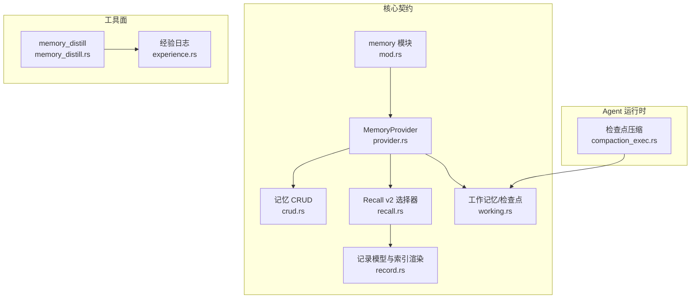
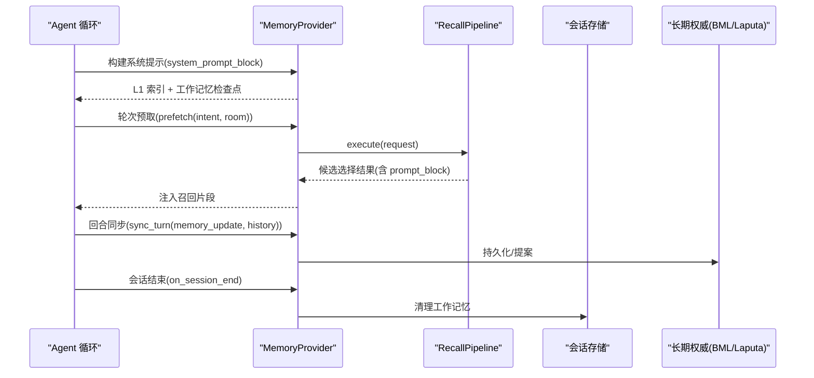
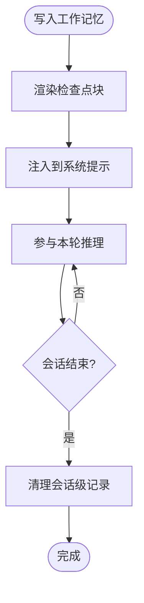
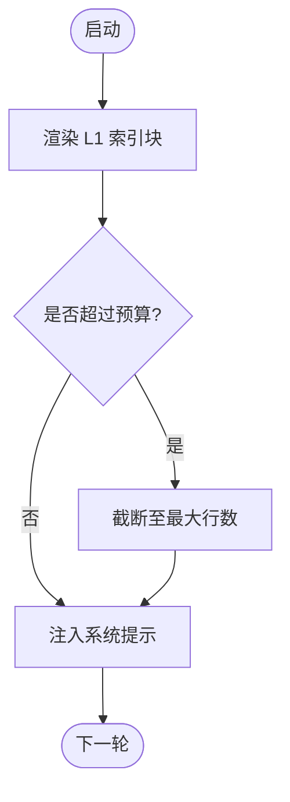
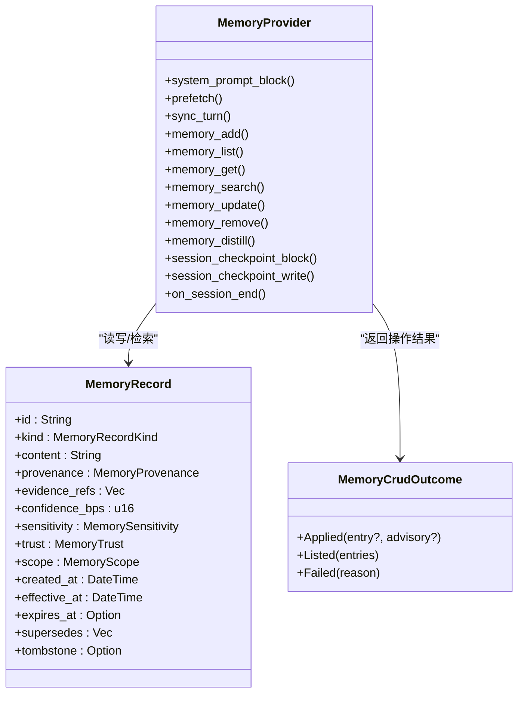
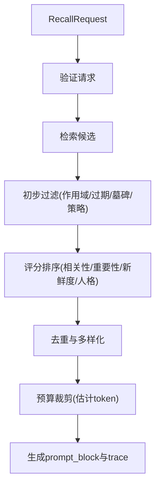
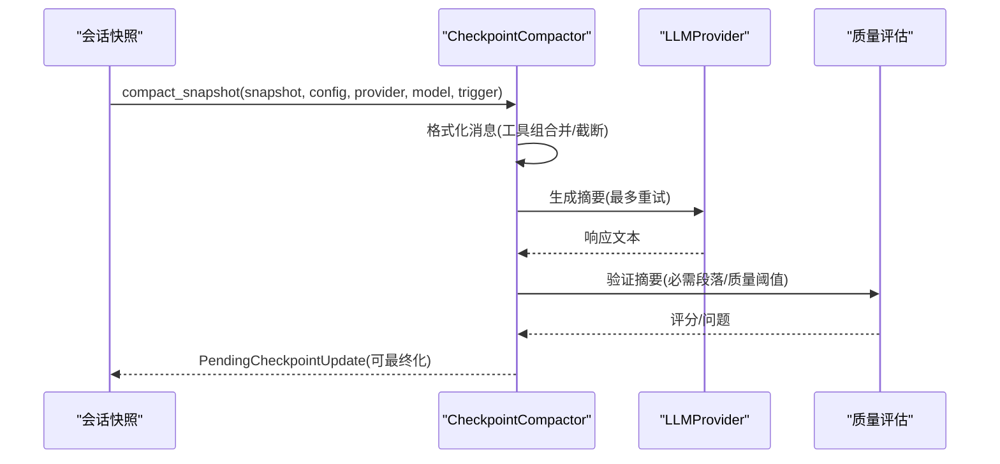
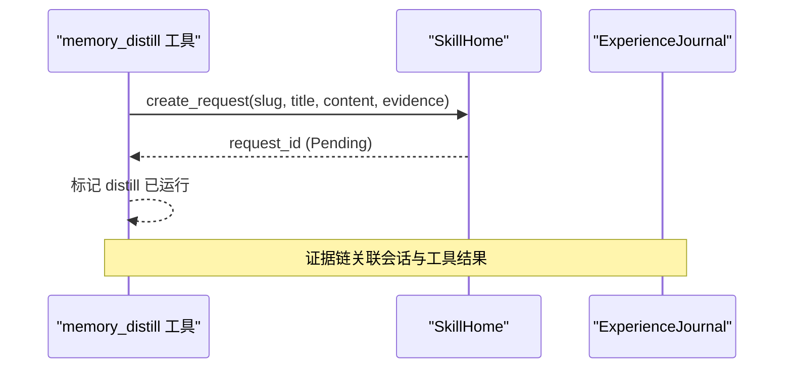
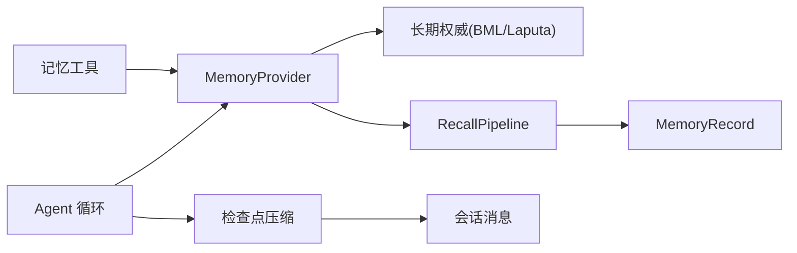

# 分层记忆架构

<cite>
**本文引用的文件**
- [agent-diva-core/src/memory/mod.rs](file://agent-diva-core/src/memory/mod.rs)
- [agent-diva-core/src/memory/working.rs](file://agent-diva-core/src/memory/working.rs)
- [agent-diva-core/src/memory/provider.rs](file://agent-diva-core/src/memory/provider.rs)
- [agent-diva-core/src/memory/crud.rs](file://agent-diva-core/src/memory/crud.rs)
- [agent-diva-core/src/memory/recall.rs](file://agent-diva-core/src/memory/recall.rs)
- [agent-diva-core/src/memory/record.rs](file://agent-diva-core/src/memory/record.rs)
- [agent-diva-agent/src/compaction/mod.rs](file://agent-diva-agent/src/compaction/mod.rs)
- [agent-diva-agent/src/compaction/compaction_exec.rs](file://agent-diva-agent/src/compaction/compaction_exec.rs)
- [agent-diva-tools/src/memory_distill.rs](file://agent-diva-tools/src/memory_distill.rs)
- [agent-diva-core/src/experience.rs](file://agent-diva-core/src/experience.rs)
</cite>

## 目录
1. [简介](#简介)
2. [项目结构](#项目结构)
3. [核心组件](#核心组件)
4. [架构总览](#架构总览)
5. [详细组件分析](#详细组件分析)
6. [依赖关系分析](#依赖关系分析)
7. [性能考量](#性能考量)
8. [故障排查指南](#故障排查指南)
9. [结论](#结论)
10. [附录](#附录)

## 简介
本文件系统化阐述 Agent-Diva 的分层记忆架构，围绕 L0 工作记忆、L1 短期索引与 L2+ 长期权威进行职责划分、存储策略、访问模式与生命周期管理。重点说明：
- 各层记忆的边界与隔离机制（会话级隔离、权威与非权威分离）
- 数据流转机制（晋升、压缩、归档、回收）
- 启动注入、轮次召回、回合同步与会话结束清理
- 配置参数与优化建议
- 架构图与关键流程图

## 项目结构
记忆系统以 agent-diva-core 为核心契约层，向外暴露 MemoryProvider 接口；agent-diva-agent 负责上下文装配、检查点压缩与预算控制；agent-diva-tools 提供记忆工具面（CRUD 与蒸馏）；experience 模块为 AutoDream 反思提供无载荷执行证据。

**图表来源**
- [agent-diva-core/src/memory/mod.rs:1-47](file://agent-diva-core/src/memory/mod.rs#L1-L47)
- [agent-diva-core/src/memory/provider.rs:414-617](file://agent-diva-core/src/memory/provider.rs#L414-L617)
- [agent-diva-core/src/memory/crud.rs:1-192](file://agent-diva-core/src/memory/crud.rs#L1-L192)
- [agent-diva-core/src/memory/recall.rs:214-359](file://agent-diva-core/src/memory/recall.rs#L214-L359)
- [agent-diva-core/src/memory/record.rs:314-350](file://agent-diva-core/src/memory/record.rs#L314-L350)
- [agent-diva-core/src/memory/working.rs:1-123](file://agent-diva-core/src/memory/working.rs#L1-L123)
- [agent-diva-agent/src/compaction/compaction_exec.rs:94-247](file://agent-diva-agent/src/compaction/compaction_exec.rs#L94-L247)
- [agent-diva-tools/src/memory_distill.rs:91-131](file://agent-diva-tools/src/memory_distill.rs#L91-L131)
- [agent-diva-core/src/experience.rs:182-230](file://agent-diva-core/src/experience.rs#L182-L230)

**章节来源**
- [agent-diva-core/src/memory/mod.rs:1-47](file://agent-diva-core/src/memory/mod.rs#L1-L47)

## 核心组件
- 工作记忆（L0）：会话级检查点，易失、非权威，用于本轮任务状态与 SOP 引用，随会话结束清理。
- 短期索引（L1）：启动时注入的有界索引块，仅包含存在性指针与规则提示，详情按需检索。
- 长期权威（L2+）：BML/Laputa 应用权威，承载事实、偏好、学习等类型化记录，支持搜索、更新、删除与蒸馏。
- 召回管道（Recall v2）：基于预算、信任度、敏感度、新鲜度与角色相关性的确定性选择流程。
- 检查点压缩：将长会话历史折叠为单一规范检查点，保持活跃尾部完整。
- 经验日志：无载荷执行证据，支撑 AutoDream 反思与去重。

**章节来源**
- [agent-diva-core/src/memory/working.rs:10-52](file://agent-diva-core/src/memory/working.rs#L10-L52)
- [agent-diva-core/src/memory/record.rs:314-350](file://agent-diva-core/src/memory/record.rs#L314-L350)
- [agent-diva-core/src/memory/crud.rs:11-81](file://agent-diva-core/src/memory/crud.rs#L11-L81)
- [agent-diva-core/src/memory/recall.rs:37-68](file://agent-diva-core/src/memory/recall.rs#L37-L68)
- [agent-diva-agent/src/compaction/mod.rs:1-33](file://agent-diva-agent/src/compaction/mod.rs#L1-L33)
- [agent-diva-core/src/experience.rs:1-48](file://agent-diva-core/src/experience.rs#L1-L48)

## 架构总览
分层记忆通过 MemoryProvider 统一接入 Agent 上下文装配与工具面。启动阶段注入 L1 索引与工作记忆检查点；轮次中根据意图进行 Recall 预取并注入；回合结束后持久化证据或更新；会话结束时清理工作记忆并触发收尾节奏。

**图表来源**
- [agent-diva-core/src/memory/provider.rs:414-617](file://agent-diva-core/src/memory/provider.rs#L414-L617)
- [agent-diva-core/src/memory/recall.rs:214-359](file://agent-diva-core/src/memory/recall.rs#L214-L359)

## 详细组件分析

### L0 工作记忆（会话检查点）
- 职责：维护当前会话的关键信息、SOP 引用与临时状态；不进入长期权威。
- 存储策略：会话级键空间（workspace_root + session_id），写入后注入到每轮上下文，会话结束清理。
- 访问模式：工具写（SessionCheckpointWriteRequest）、启动/轮次渲染（render_session_checkpoint_block）。
- 生命周期：会话开始可见，会话结束物理清理（由 Provider on_session_end 调用 GC）。
- 隔离机制：scope.session_id 限定可见范围；tombstone/supersede 可用于显式失效。

**图表来源**
- [agent-diva-core/src/memory/working.rs:20-76](file://agent-diva-core/src/memory/working.rs#L20-L76)
- [agent-diva-core/src/memory/provider.rs:586-617](file://agent-diva-core/src/memory/provider.rs#L586-L617)

**章节来源**
- [agent-diva-core/src/memory/working.rs:1-123](file://agent-diva-core/src/memory/working.rs#L1-L123)
- [agent-diva-core/src/memory/provider.rs:586-617](file://agent-diva-core/src/memory/provider.rs#L586-L617)

### L1 短期索引（启动注入与最小指针原则）
- 职责：在系统提示中注入有界索引块，限制行数与预览长度，避免全文注入。
- 存储策略：索引行来自已应用的权威记录集合；默认预算为固定行数。
- 访问模式：启动时渲染索引块；详情通过 memory_search / memory_list 按 id 获取。
- 生命周期：每次启动重新渲染；外部权威变更通过 revision 刷新缓存。
- 隔离机制：按 workspace 作用域过滤；空预算或空权威不注入。

**图表来源**
- [agent-diva-core/src/memory/record.rs:314-350](file://agent-diva-core/src/memory/record.rs#L314-L350)
- [agent-diva-core/src/memory/provider.rs:425-447](file://agent-diva-core/src/memory/provider.rs#L425-L447)

**章节来源**
- [agent-diva-core/src/memory/record.rs:314-350](file://agent-diva-core/src/memory/record.rs#L314-L350)

### L2+ 长期权威（记录模型与 CRUD）
- 职责：承载可信事实、偏好、学习与历史记录；支持增删改查与蒸馏。
- 存储策略：类型化记录（kind/trust/sensitivity/scope），带内容摘要与时间戳；支持 tombstone 与 supersedes。
- 访问模式：MemoryProvider 暴露 add/list/get/search/update/remove/distill；默认不支持的操作返回明确失败原因。
- 生命周期：创建→生效→可选过期→被覆盖/墓碑→归档或保留。
- 隔离机制：tenant/workspace/session 作用域校验；信任与敏感度策略过滤。

**图表来源**
- [agent-diva-core/src/memory/record.rs:103-120](file://agent-diva-core/src/memory/record.rs#L103-L120)
- [agent-diva-core/src/memory/crud.rs:83-127](file://agent-diva-core/src/memory/crud.rs#L83-L127)
- [agent-diva-core/src/memory/provider.rs:414-617](file://agent-diva-core/src/memory/provider.rs#L414-L617)

**章节来源**
- [agent-diva-core/src/memory/crud.rs:1-192](file://agent-diva-core/src/memory/crud.rs#L1-L192)
- [agent-diva-core/src/memory/record.rs:103-120](file://agent-diva-core/src/memory/record.rs#L103-L120)
- [agent-diva-core/src/memory/provider.rs:414-617](file://agent-diva-core/src/memory/provider.rs#L414-L617)

### 召回管道（Recall v2）
- 职责：基于请求预算、策略与候选评分，选择少量高价值记录注入上下文。
- 评分维度：相关性、重要性、新鲜度、人格相关性；按权重加权排序。
- 过滤规则：工作区/会话匹配、过期、墓碑、替代、重复、信任与敏感度策略、预算上限。
- 输出：选定记录的转义块与审计追踪；降级路径保证轮次继续。

**图表来源**
- [agent-diva-core/src/memory/recall.rs:214-359](file://agent-diva-core/src/memory/recall.rs#L214-L359)
- [agent-diva-core/src/memory/recall.rs:406-489](file://agent-diva-core/src/memory/recall.rs#L406-L489)
- [agent-diva-core/src/memory/recall.rs:509-583](file://agent-diva-core/src/memory/recall.rs#L509-L583)

**章节来源**
- [agent-diva-core/src/memory/recall.rs:214-359](file://agent-diva-core/src/memory/recall.rs#L214-L359)

### 检查点压缩（会话上下文收敛）
- 职责：将长会话历史折叠为单一规范检查点，保留活跃尾部与工具组完整性。
- 策略：机械折叠优先（已完成工具组标记），必要时语义摘要；质量门限拒绝低质摘要。
- 边界：安全截断点位于用户消息或完整工具调用边界；避免破坏未决调用。
- 输出：CanonicalCheckpoint（body、索引、分数、问题列表），供后续注入。

**图表来源**
- [agent-diva-agent/src/compaction/compaction_exec.rs:94-247](file://agent-diva-agent/src/compaction/compaction_exec.rs#L94-L247)
- [agent-diva-agent/src/compaction/compaction_exec.rs:249-328](file://agent-diva-agent/src/compaction/compaction_exec.rs#L249-L328)
- [agent-diva-agent/src/compaction/compaction_exec.rs:399-430](file://agent-diva-agent/src/compaction/compaction_exec.rs#L399-L430)

**章节来源**
- [agent-diva-agent/src/compaction/mod.rs:1-33](file://agent-diva-agent/src/compaction/mod.rs#L1-L33)
- [agent-diva-agent/src/compaction/compaction_exec.rs:94-247](file://agent-diva-agent/src/compaction/compaction_exec.rs#L94-L247)

### 经验日志与蒸馏（晋升与归档）
- 经验日志：无载荷事件追加，具备唯一 ID、去重、容量保留与跨进程锁；用于 AutoDream 反思输入。
- 蒸馏工具：创建受管 Skill 请求（pending），附带会话证据与 artifact 指针，不直接写入技能。
- 晋升路径：工作记忆 → 蒸馏 → 治理审批 → 应用为长期权威（Skill/经验条目）。

**图表来源**
- [agent-diva-tools/src/memory_distill.rs:91-131](file://agent-diva-tools/src/memory_distill.rs#L91-L131)
- [agent-diva-core/src/experience.rs:182-230](file://agent-diva-core/src/experience.rs#L182-L230)

**章节来源**
- [agent-diva-tools/src/memory_distill.rs:91-131](file://agent-diva-tools/src/memory_distill.rs#L91-L131)
- [agent-diva-core/src/experience.rs:182-230](file://agent-diva-core/src/experience.rs#L182-L230)

## 依赖关系分析
- MemoryProvider 是 Agent-Diva 与长期记忆后端的稳定契约，屏蔽传输细节。
- RecallPipeline 依赖 record 模型与 token 估算器，产出可审计的选择结果。
- 检查点压缩依赖会话消息与 LLMProvider，输出规范化检查点。
- 工具面通过 MemoryProvider 扩展 API 实现 CRUD 与蒸馏，遵循分级路由与治理约束。

**图表来源**
- [agent-diva-core/src/memory/provider.rs:414-617](file://agent-diva-core/src/memory/provider.rs#L414-L617)
- [agent-diva-core/src/memory/recall.rs:214-359](file://agent-diva-core/src/memory/recall.rs#L214-L359)
- [agent-diva-agent/src/compaction/compaction_exec.rs:94-247](file://agent-diva-agent/src/compaction/compaction_exec.rs#L94-L247)

**章节来源**
- [agent-diva-core/src/memory/provider.rs:414-617](file://agent-diva-core/src/memory/provider.rs#L414-L617)

## 性能考量
- 启动注入预算：L1 索引行数默认有限制，避免大段内容进入系统提示。
- 召回预算：Recall v2 使用保守 token 估算，超预算即停止追加。
- 检查点压缩：机械折叠优先，减少 LLM 调用次数；质量门限防止低效摘要。
- 会话隔离：工作记忆按 session_id 隔离，降低跨会话污染风险。
- 异步边界：provider 的 prefetch/sync_turn/on_session_end 为异步，避免阻塞上下文装配。

[本节为通用指导，无需特定文件引用]

## 故障排查指南
- 启动降级：当无法组装启动连续性时，返回 Degraded 状态并注入可读原因；避免静默回退到旧源。
- 召回失败：检索不可用或请求无效时，返回 Degraded/Failed 且不影响轮次继续；检查 policy 与预算。
- 工具不支持：默认 CRUD 方法返回 unsupported 失败原因；确认 Provider 是否实现对应能力。
- 会话清理：on_session_end 应幂等处理重复调用；若失败仅 warn，不阻断主流程。
- 检查点质量：摘要未达阈值会报错；检查输入消息格式与 LLM 响应结构。

**章节来源**
- [agent-diva-core/src/memory/provider.rs:22-65](file://agent-diva-core/src/memory/provider.rs#L22-L65)
- [agent-diva-core/src/memory/recall.rs:214-234](file://agent-diva-core/src/memory/recall.rs#L214-L234)
- [agent-diva-core/src/memory/crud.rs:129-136](file://agent-diva-core/src/memory/crud.rs#L129-L136)
- [agent-diva-agent/src/compaction/compaction_exec.rs:199-204](file://agent-diva-agent/src/compaction/compaction_exec.rs#L199-L204)

## 结论
Agent-Diva 的分层记忆架构通过明确的层级边界、稳定的契约与可审计的流程，实现了会话级工作记忆、有界短期索引与长期权威的协同。Recall v2 与检查点压缩确保上下文高效可用，蒸馏与经验日志打通从临时到长期的晋升路径。建议在部署中合理配置 L1 预算、Recall 策略与压缩阈值，以获得最佳性能与稳定性。

[本节为总结性内容，无需特定文件引用]

## 附录
- 配置要点
  - L1 索引行数：默认有限预算，可按需求调整。
  - Recall 预算：token_budget 与 max_candidates 控制注入规模。
  - 检查点质量阈值：QUALITY_THRESHOLD 影响摘要接受标准。
  - 会话清理：on_session_end 需幂等处理，确保工作记忆释放。
- 最佳实践
  - 坚持最小指针原则：启动只注入索引，详情按需检索。
  - 区分权威与非权威：工作记忆不进入长期权威，晋升走蒸馏与治理。
  - 利用审计追踪：Recall trace 与 Experience Journal 便于问题定位与回溯。

[本节为补充信息，无需特定文件引用]