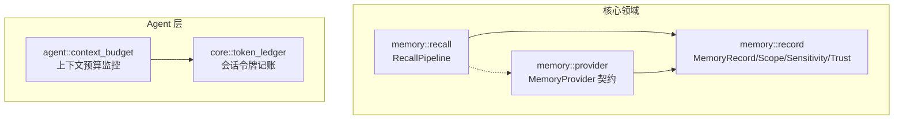
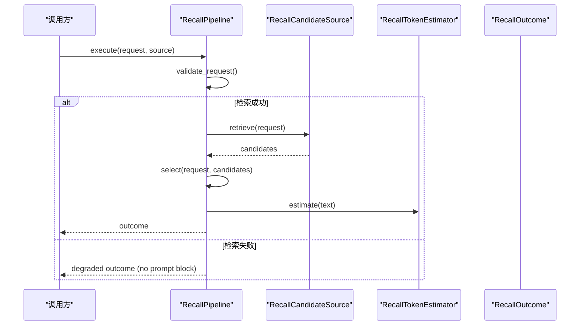
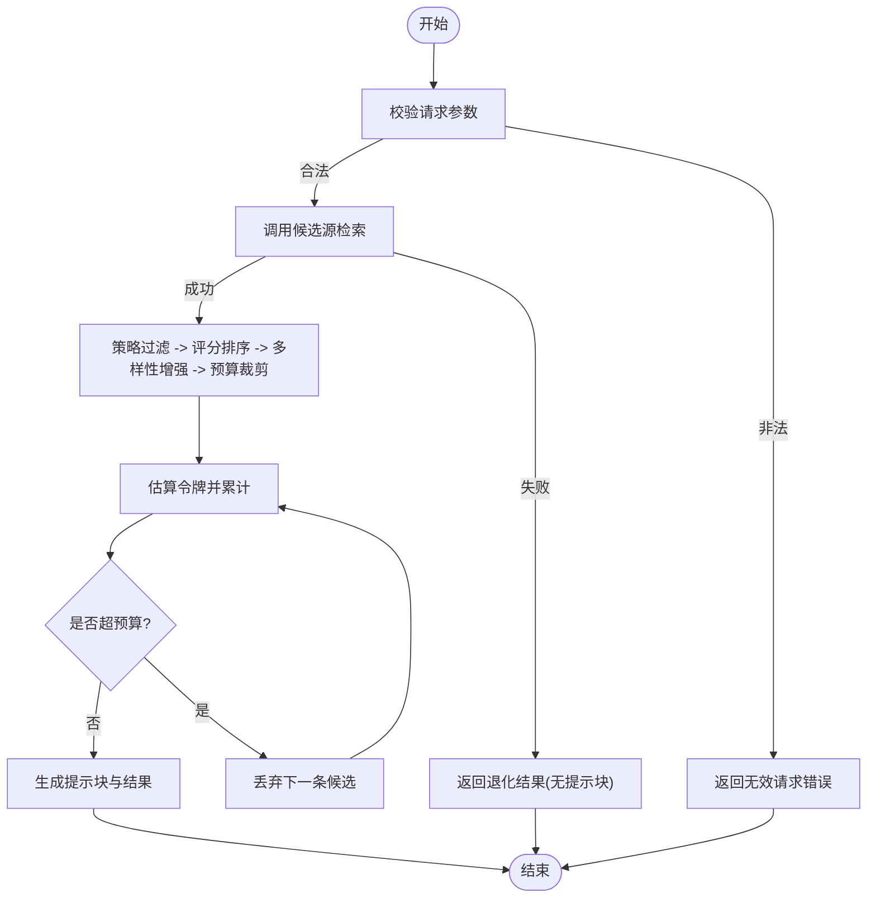
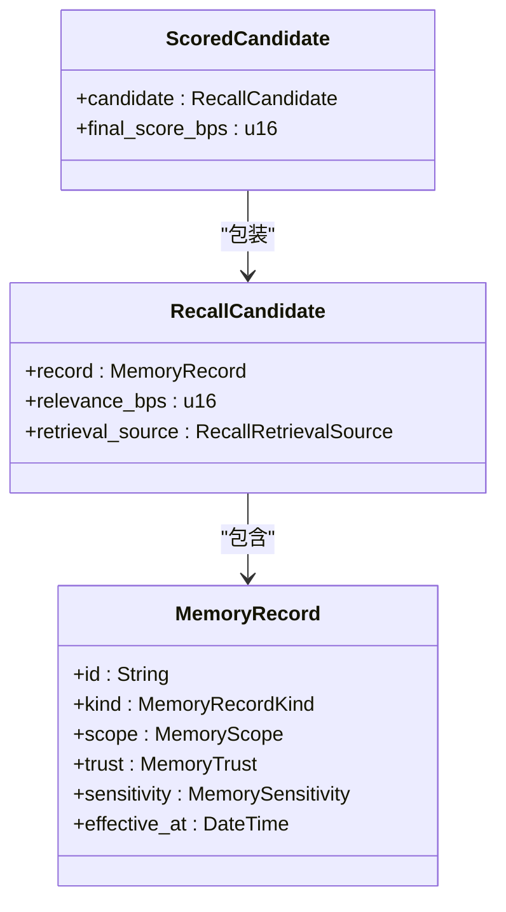
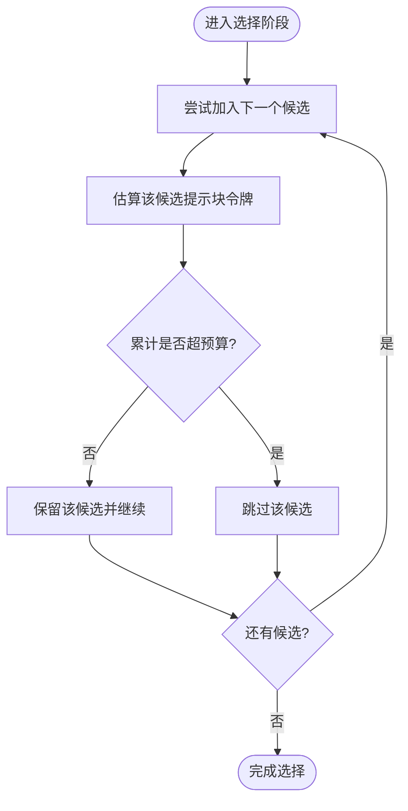
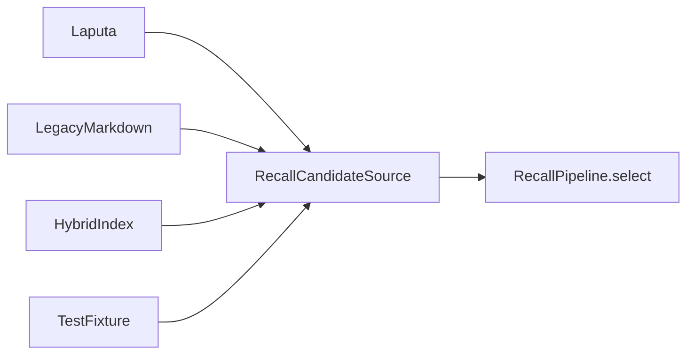
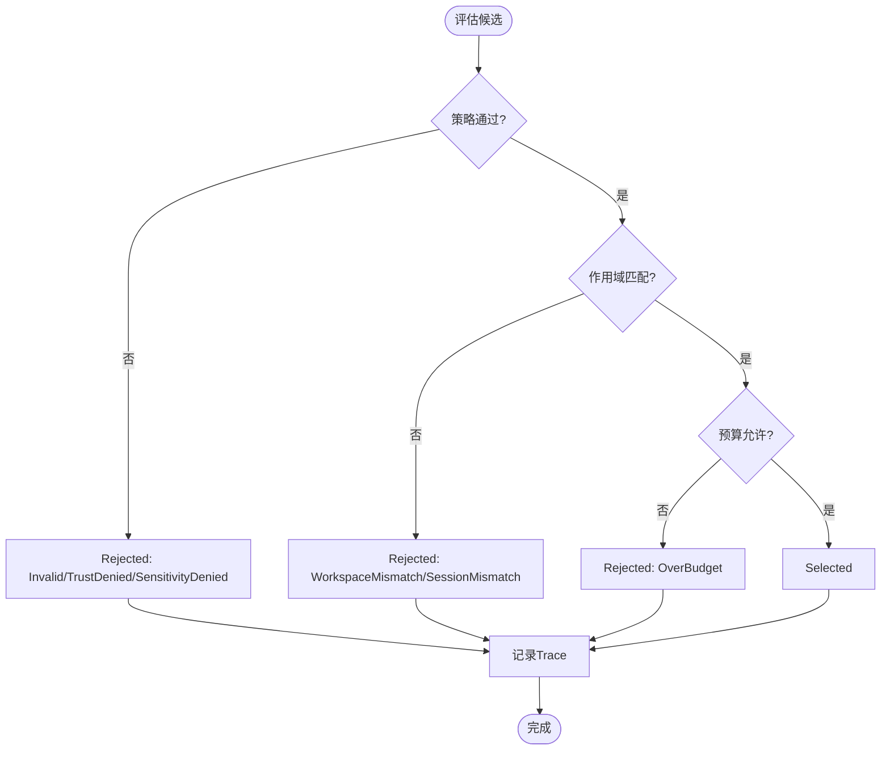
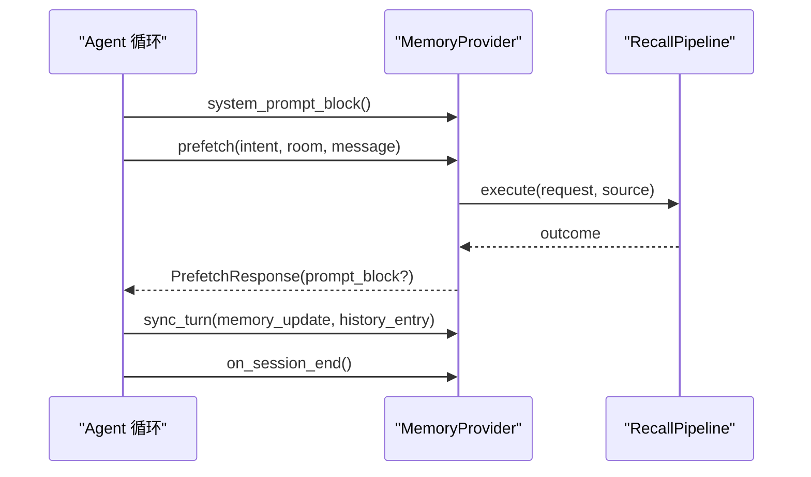
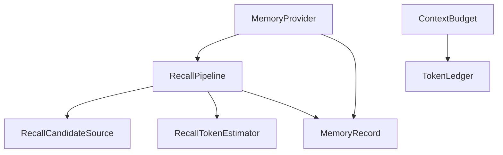
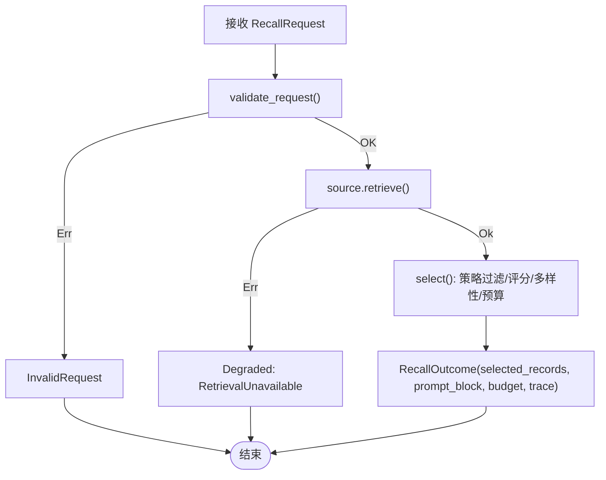

# 检索与召回系统

<cite>
**本文引用的文件**
- [recall.rs](file://agent-diva-core/src/memory/recall.rs)
- [mod.rs](file://agent-diva-core/src/memory/mod.rs)
- [provider.rs](file://agent-diva-core/src/memory/provider.rs)
- [record.rs](file://agent-diva-core/src/memory/record.rs)
- [context_budget.rs](file://agent-diva-agent/src/context_budget.rs)
- [budget.rs](file://agent-diva-core/src/token_ledger/budget.rs)
</cite>

## 目录
1. [简介](#简介)
2. [项目结构](#项目结构)
3. [核心组件](#核心组件)
4. [架构总览](#架构总览)
5. [详细组件分析](#详细组件分析)
6. [依赖关系分析](#依赖关系分析)
7. [性能考量](#性能考量)
8. [故障排查指南](#故障排查指南)
9. [结论](#结论)
10. [附录：配置示例与流程图](#附录配置示例与流程图)

## 简介
本文件面向“检索与召回系统”的设计与实现，聚焦 RecallPipeline 的确定性选择流程、候选记忆的选择策略与排序算法、召回预算管理与令牌估算机制、不同召回源（RecallRetrievalSource）的集成方式、召回决策（RecallDecision）的制定过程与影响因素，并提供优化建议、调试方法与可视化流程图。该系统的目标是：在严格的预算与安全策略约束下，从多种来源召回最相关的记忆片段，并以可审计、可复现的方式输出到提示词中。

## 项目结构
- 领域边界位于 agent-diva-core::memory，提供稳定的内存记录模型、召回接口与提供者契约。
- RecallPipeline 位于 memory::recall，负责将“查询 + 策略 + 预算”转化为“已选记忆 + 提示块 + 预算使用 + 追溯”。
- MemoryProvider 位于 memory::provider，定义启动注入、预取、同步、会话结束等生命周期钩子，是上层 Agent 与后端存储之间的稳定契约。
- 上下文预算与令牌估算位于 agent-diva-agent::context_budget 与 core::token_ledger，用于整体上下文窗口控制与会话级令牌记账。

图表来源
- [recall.rs:1-24](file://agent-diva-core/src/memory/recall.rs#L1-L24)
- [provider.rs:414-617](file://agent-diva-core/src/memory/provider.rs#L414-L617)
- [record.rs:76-120](file://agent-diva-core/src/memory/record.rs#L76-L120)
- [context_budget.rs:1-20](file://agent-diva-agent/src/context_budget.rs#L1-L20)
- [budget.rs:1-9](file://agent-diva-core/src/token_ledger/budget.rs#L1-L9)

章节来源
- [mod.rs:1-47](file://agent-diva-core/src/memory/mod.rs#L1-L47)

## 核心组件
- RecallRequest：一次召回执行的输入，包含查询、作用域、审计关联、当前时间、令牌预算、候选上限与策略。
- RecallCandidate：归一化的候选项，携带原始记录、相关性分数与召回来源。
- RecallPolicy：最小权限策略，限定允许的信任级别与敏感度等级。
- RecallPipeline：无状态编排器，执行请求校验、调用候选源、筛选排序、预算裁剪、生成提示块与追踪。
- RecallTokenEstimator：可替换的令牌估算器，默认保守估算 Unicode 文本。
- RecallRetrievalSource：候选来源分类（如 Laputa、LegacyMarkdown、HybridIndex、TestFixture）。
- RecallOutcome/RecallTrace/RecallBudgetUsage：结果、逐条决策追踪与预算使用统计。
- MemoryProvider：长时记忆的提供者契约，封装启动注入、预取、同步、会话结束等能力。

章节来源
- [recall.rs:58-197](file://agent-diva-core/src/memory/recall.rs#L58-L197)
- [recall.rs:214-360](file://agent-diva-core/src/memory/recall.rs#L214-L360)
- [provider.rs:414-617](file://agent-diva-core/src/memory/provider.rs#L414-L617)

## 架构总览
RecallPipeline 以“先检索、后选择”的两阶段模式工作：
- 第一阶段：通过 RecallCandidateSource 异步获取候选集合；失败则降级为“空结果+退化状态”，不污染提示。
- 第二阶段：对候选进行策略过滤、评分排序、多样性增强、预算裁剪，最终产出确定性的已选记录与提示块。

图表来源
- [recall.rs:218-243](file://agent-diva-core/src/memory/recall.rs#L218-L243)
- [recall.rs:340-360](file://agent-diva-core/src/memory/recall.rs#L340-L360)

## 详细组件分析

### RecallPipeline 设计与处理流程
- 入口方法 execute：
  - 校验请求字段与作用域、策略合法性。
  - 调用候选源检索；若失败返回退化结果（无提示块），避免传播错误。
- 选择方法 select/select_with_estimator：
  - 策略过滤：按信任与敏感度白名单过滤。
  - 评分排序：基于相关性、重要性、新鲜度、人格权重的综合得分。
  - 多样性增强：防止同类型记录过度集中。
  - 预算裁剪：按预估令牌数累加，确保不超过 token_budget。
  - 输出：selected_records、prompt_block、预算使用统计、trace。

图表来源
- [recall.rs:218-243](file://agent-diva-core/src/memory/recall.rs#L218-L243)
- [recall.rs:340-360](file://agent-diva-core/src/memory/recall.rs#L340-L360)

章节来源
- [recall.rs:214-360](file://agent-diva-core/src/memory/recall.rs#L214-L360)

### 候选记忆的选择策略与排序算法
- 权重体系：
  - 相关性权重最高，体现查询匹配质量。
  - 重要性权重次之，反映内容价值。
  - 新鲜度权重随时间衰减，鼓励近期内容。
  - 人格权重用于强调与角色/身份相关的内容。
- 排序规则：
  - 主键：最终得分降序。
  - 次键：生效时间较新者优先。
  - 末键：记录 ID 字典序，保证稳定性。
- 多样性：
  - 限制同一类型的记录数量，避免同质化。
- 策略过滤：
  - 信任与敏感度必须属于允许列表。
  - 超出置信上限或未知来源直接拒绝。

图表来源
- [recall.rs:400-412](file://agent-diva-core/src/memory/recall.rs#L400-L412)
- [recall.rs:70-76](file://agent-diva-core/src/memory/recall.rs#L70-L76)
- [record.rs:103-120](file://agent-diva-core/src/memory/record.rs#L103-L120)

章节来源
- [recall.rs:400-597](file://agent-diva-core/src/memory/recall.rs#L400-L597)
- [record.rs:103-120](file://agent-diva-core/src/memory/record.rs#L103-L120)

### 召回预算管理与令牌估算机制
- 预算来源：
  - RecallRequest.token_budget：本次召回可使用的令牌上限。
  - 上下文预算：由 context_budget 模块计算历史消息与检查点占用，触发压缩以避免超过模型上下文窗口。
- 估算器：
  - ConservativeRecallTokenEstimator：保守估算 Unicode 文本令牌数（字符数/3向上取整）。
  - 可替换 RecallTokenEstimator：便于未来接入 provider tokenizer。
- 预算裁剪：
  - 按候选顺序累加预估令牌，一旦超过预算即停止添加后续候选。
  - 即使预算为 0，也不截断已选记录，仅不继续追加。

图表来源
- [recall.rs:340-360](file://agent-diva-core/src/memory/recall.rs#L340-L360)
- [recall.rs:394-398](file://agent-diva-core/src/memory/recall.rs#L394-L398)
- [context_budget.rs:164-207](file://agent-diva-agent/src/context_budget.rs#L164-L207)

章节来源
- [recall.rs:340-398](file://agent-diva-core/src/memory/recall.rs#L340-L398)
- [context_budget.rs:1-207](file://agent-diva-agent/src/context_budget.rs#L1-L207)

### 不同召回源（RecallRetrievalSource）的实现与集成
- 来源分类：
  - Laputa：生产环境权威存储。
  - LegacyMarkdown：遗留 Markdown 文件作为次要来源。
  - HybridIndex：混合索引（可能结合图数据库/向量索引）。
  - TestFixture：测试用固定数据。
  - Unknown：未知来源，会被策略拒绝。
- 集成方式：
  - 通过 RecallCandidateSource trait 暴露 retrieve 方法，返回标准化候选。
  - 上层 MemoryProvider 可在 prefetch/sync_turn 等生命周期中组合多个来源。
  - 来源信息随候选一起进入选择流程，影响可信度与可见性。

图表来源
- [recall.rs:25-35](file://agent-diva-core/src/memory/recall.rs#L25-L35)
- [recall.rs:190-197](file://agent-diva-core/src/memory/recall.rs#L190-L197)
- [provider.rs:449-464](file://agent-diva-core/src/memory/provider.rs#L449-L464)

章节来源
- [recall.rs:25-35](file://agent-diva-core/src/memory/recall.rs#L25-L35)
- [recall.rs:190-197](file://agent-diva-core/src/memory/recall.rs#L190-L197)
- [provider.rs:449-464](file://agent-diva-core/src/memory/provider.rs#L449-L464)

### 召回决策（RecallDecision）的制定过程与影响因素
- 决策类型：Selected / Rejected。
- 拒绝原因：
  - 无效：相关性分数越界或来源未知。
  - 信任拒绝：不在允许的信任列表中。
  - 敏感度拒绝：不在允许的敏感度列表中。
  - 工作区/会话不匹配：作用域不一致。
  - 预算不足：无法容纳更多候选。
- 追踪：
  - 每条候选都会产生一条 RecallTrace，记录决策、原因、相关性分数、最终得分（若已评分）、预估令牌等。

图表来源
- [recall.rs:509-583](file://agent-diva-core/src/memory/recall.rs#L509-L583)
- [recall.rs:599-643](file://agent-diva-core/src/memory/recall.rs#L599-L643)

章节来源
- [recall.rs:509-643](file://agent-diva-core/src/memory/recall.rs#L509-L643)

### 与 MemoryProvider 的协作
- MemoryProvider 定义了启动注入、预取、同步、会话结束等钩子，供 Agent 在 turn 生命周期内调用。
- 预取（prefetch）可用于意图感知的召回，返回可选的提示块注入到对话上下文中。
- 同步（sync_turn）用于成功后持久化证据或更新长期记忆。
- 会话结束（on_session_end）用于收尾与清理。

图表来源
- [provider.rs:414-617](file://agent-diva-core/src/memory/provider.rs#L414-L617)
- [recall.rs:218-243](file://agent-diva-core/src/memory/recall.rs#L218-L243)

章节来源
- [provider.rs:414-617](file://agent-diva-core/src/memory/provider.rs#L414-L617)

## 依赖关系分析
- 低耦合：RecallPipeline 只依赖抽象的 RecallCandidateSource 与 RecallTokenEstimator，便于替换与测试。
- 安全边界：MemoryRecord 的 trust/sensitivity/scope 贯穿选择与渲染，确保只有符合策略的内容进入提示。
- 预算协同：RecallPipeline 的 token_budget 与 Agent 层的上下文预算共同保障不溢出模型上下文窗口。
- 可观测性：RecallTrace 与 ShadowReport 支持对比新旧方案差异，便于回归验证。

图表来源
- [recall.rs:190-197](file://agent-diva-core/src/memory/recall.rs#L190-L197)
- [provider.rs:414-617](file://agent-diva-core/src/memory/provider.rs#L414-L617)
- [context_budget.rs:164-207](file://agent-diva-agent/src/context_budget.rs#L164-L207)
- [budget.rs:23-64](file://agent-diva-core/src/token_ledger/budget.rs#L23-L64)

章节来源
- [recall.rs:190-197](file://agent-diva-core/src/memory/recall.rs#L190-L197)
- [provider.rs:414-617](file://agent-diva-core/src/memory/provider.rs#L414-L617)
- [context_budget.rs:164-207](file://agent-diva-agent/src/context_budget.rs#L164-L207)
- [budget.rs:23-64](file://agent-diva-core/src/token_ledger/budget.rs#L23-L64)

## 性能考量
- 确定性排序：使用稳定排序键（得分、时间、ID），避免抖动。
- 早期拒绝：策略与范围检查在评分前执行，减少不必要计算。
- 预算优先：按预估令牌增量裁剪，避免构建过大提示块。
- 可插拔估算器：可替换为更精确的 tokenizer，降低估算误差。
- 降级路径：检索失败不抛错，返回退化结果，提升鲁棒性。
- 上下文预算：结合上下文压缩阈值，提前触发历史压缩，避免尾部截断。

[本节为通用指导，无需特定文件引用]

## 故障排查指南
- 检索不可用：
  - 现象：RecallOutcome.status=Degraded，failure=RetrievalUnavailable，无提示块。
  - 排查：检查候选源实现与网络/存储可用性；确认请求参数与作用域正确。
- 策略拒绝：
  - 现象：大量候选被标记为 TrustDenied/SensitivityDenied。
  - 排查：调整 RecallPolicy.allowed_trust/allowed_sensitivity；确认记录标签正确。
- 预算不足：
  - 现象：selected_count 较少，rejected_count 较高，reason=OverBudget。
  - 排查：提高 token_budget；优化候选大小；更换更紧凑的渲染格式。
- 上下文溢出：
  - 现象：should_compact=true，压力比接近或超过 1.0。
  - 排查：调小 system_budget_ratio 或 compact_threshold_ratio；启用历史压缩；减少 checkpoint 长度。
- 令牌估算偏差：
  - 现象：实际使用与估算差异较大。
  - 排查：替换 RecallTokenEstimator 为 provider tokenizer；校准估算函数。

章节来源
- [recall.rs:218-243](file://agent-diva-core/src/memory/recall.rs#L218-L243)
- [recall.rs:509-583](file://agent-diva-core/src/memory/recall.rs#L509-L583)
- [context_budget.rs:164-207](file://agent-diva-agent/src/context_budget.rs#L164-L207)
- [budget.rs:23-64](file://agent-diva-core/src/token_ledger/budget.rs#L23-L64)

## 结论
RecallPipeline 提供了确定性、可审计、可回退的召回流程，通过策略、评分、多样性与预算四重保障，确保在高负载与多来源环境下仍能稳定输出高质量上下文。配合 MemoryProvider 的生命周期钩子与上下文预算监控，形成端到端的检索与召回闭环。未来可通过更精确的令牌估算、更智能的评分模型与更强的多样性控制进一步优化效果。

[本节为总结，无需特定文件引用]

## 附录：配置示例与流程图

### 配置要点（概念性说明）
- RecallRequest：
  - query：用户查询或意图摘要。
  - scope：tenant_id/workspace_id/session_id。
  - correlation：request_id/turn_id/session_id。
  - now：当前时间。
  - token_budget：本次召回可用令牌上限。
  - max_candidates：候选上限。
  - policy：allowed_trust/allowed_sensitivity。
- MemoryProvider：
  - system_prompt_block：启动注入。
  - prefetch：意图感知预取。
  - sync_turn：成功后持久化。
  - on_session_end：会话结束清理。

[本节为概念性说明，无需特定文件引用]

### 召回流程图（代码映射）

图表来源
- [recall.rs:218-243](file://agent-diva-core/src/memory/recall.rs#L218-L243)
- [recall.rs:340-360](file://agent-diva-core/src/memory/recall.rs#L340-L360)