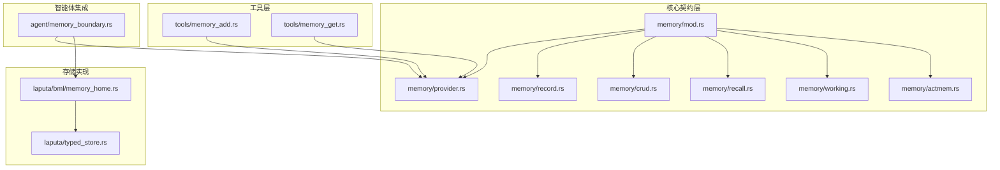
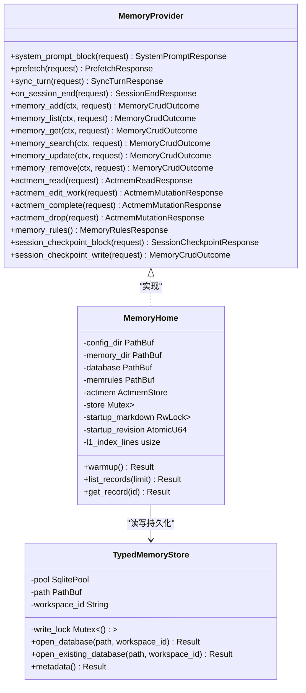
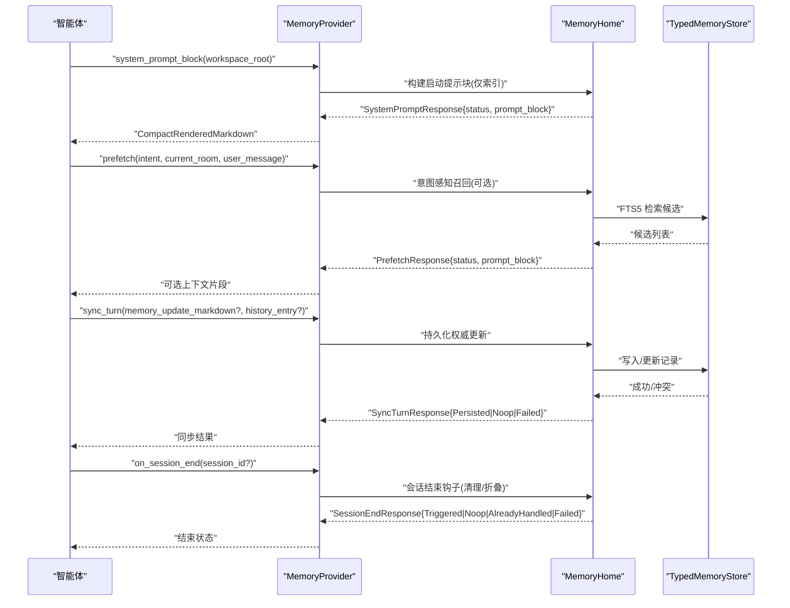
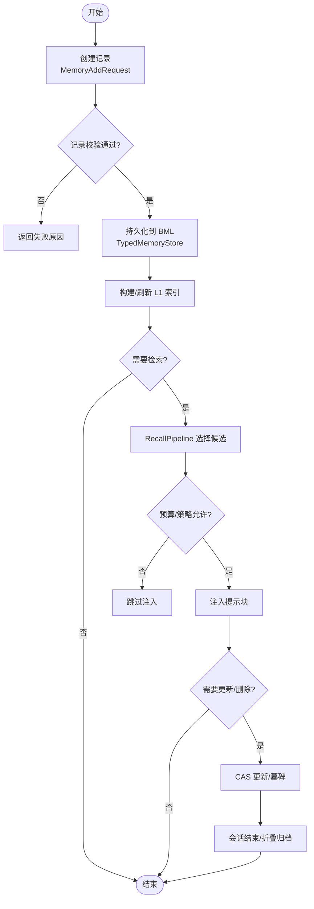
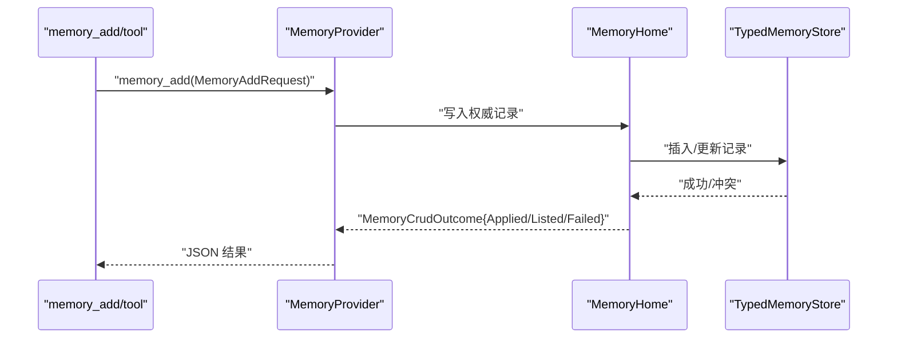
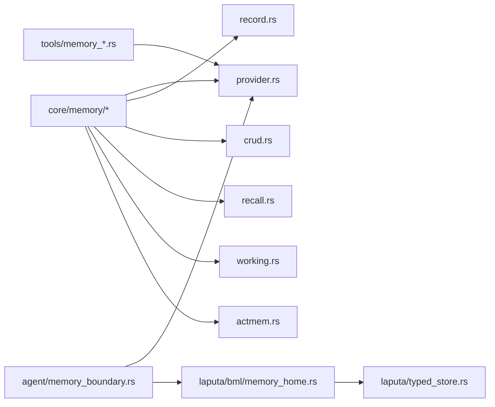

# 记忆架构设计

<cite>
**本文引用的文件**
- [agent-diva-core/src/memory/mod.rs](file://agent-diva-core/src/memory/mod.rs)
- [agent-diva-core/src/memory/provider.rs](file://agent-diva-core/src/memory/provider.rs)
- [agent-diva-core/src/memory/working.rs](file://agent-diva-core/src/memory/working.rs)
- [agent-diva-core/src/memory/crud.rs](file://agent-diva-core/src/memory/crud.rs)
- [agent-diva-core/src/memory/recall.rs](file://agent-diva-core/src/memory/recall.rs)
- [agent-diva-core/src/memory/record.rs](file://agent-diva-core/src/memory/record.rs)
- [agent-diva-core/src/memory/actmem.rs](file://agent-diva-core/src/memory/actmem.rs)
- [agent-diva-agent/src/memory_boundary.rs](file://agent-diva-agent/src/memory_boundary.rs)
- [agent-diva-laputa/src/bml/memory_home.rs](file://agent-diva-laputa/src/bml/memory_home.rs)
- [agent-diva-laputa/src/typed_store.rs](file://agent-diva-laputa/src/typed_store.rs)
- [agent-diva-tools/src/memory_add.rs](file://agent-diva-tools/src/memory_add.rs)
- [agent-diva-tools/src/memory_get.rs](file://agent-diva-tools/src/memory_get.rs)
</cite>

## 目录
1. [简介](#简介)
2. [项目结构](#项目结构)
3. [核心组件](#核心组件)
4. [架构总览](#架构总览)
5. [详细组件分析](#详细组件分析)
6. [依赖关系分析](#依赖关系分析)
7. [性能考虑](#性能考虑)
8. [故障排查指南](#故障排查指南)
9. [结论](#结论)
10. [附录：配置与使用模式](#附录配置与使用模式)

## 简介
本文件面向 Agent-Diva 的记忆系统，系统性阐述分层记忆架构的设计理念与实现：工作记忆（L0）、短期记忆（L1）与长期记忆（L2+）的职责划分；MemoryProvider 接口如何抽象多种存储后端；记忆数据从创建、检索到归档的完整生命周期；以及不同层级之间的数据流转与同步策略。文档同时提供架构图、关键流程时序图、类图与流程图，并给出可操作的配置示例与使用模式。

## 项目结构
记忆系统以 agent-diva-core 为核心契约层，定义 MemoryProvider 接口、记录模型、召回管道与工作区检查点协议；agent-diva-agent 负责在智能体循环中装配上下文并调用记忆边界；agent-diva-laputa 提供生产级 BML 存储实现（SQLite + FTS5），作为机器级权威记忆源；agent-diva-tools 暴露 memory_* 工具以便智能体直接读写记忆。



**图表来源**
- [agent-diva-core/src/memory/mod.rs:1-47](file://agent-diva-core/src/memory/mod.rs#L1-L47)
- [agent-diva-core/src/memory/provider.rs:391-617](file://agent-diva-core/src/memory/provider.rs#L391-L617)
- [agent-diva-core/src/memory/record.rs:103-120](file://agent-diva-core/src/memory/record.rs#L103-L120)
- [agent-diva-core/src/memory/crud.rs:11-81](file://agent-diva-core/src/memory/crud.rs#L11-L81)
- [agent-diva-core/src/memory/recall.rs:214-359](file://agent-diva-core/src/memory/recall.rs#L214-L359)
- [agent-diva-core/src/memory/working.rs:10-52](file://agent-diva-core/src/memory/working.rs#L10-L52)
- [agent-diva-core/src/memory/actmem.rs:1-51](file://agent-diva-core/src/memory/actmem.rs#L1-L51)
- [agent-diva-agent/src/memory_boundary.rs:13-16](file://agent-diva-agent/src/memory_boundary.rs#L13-L16)
- [agent-diva-laputa/src/bml/memory_home.rs:85-125](file://agent-diva-laputa/src/bml/memory_home.rs#L85-L125)
- [agent-diva-laputa/src/typed_store.rs:135-199](file://agent-diva-laputa/src/typed_store.rs#L135-L199)
- [agent-diva-tools/src/memory_add.rs:11-88](file://agent-diva-tools/src/memory_add.rs#L11-L88)
- [agent-diva-tools/src/memory_get.rs:10-73](file://agent-diva-tools/src/memory_get.rs#L10-L73)

**章节来源**
- [agent-diva-core/src/memory/mod.rs:1-47](file://agent-diva-core/src/memory/mod.rs#L1-L47)
- [agent-diva-agent/src/memory_boundary.rs:1-44](file://agent-diva-agent/src/memory_boundary.rs#L1-L44)

## 核心组件
- MemoryProvider 接口：统一抽象启动提示注入、意图感知预取、回合后同步、会话结束钩子、ACTMEM 读写、记忆 CRUD、会话检查点等能力，屏蔽底层存储差异。
- 记忆记录模型：标准化 MemoryRecord，包含种类、信任等级、敏感度、范围、时间戳、证据引用、覆盖与墓碑等，确保跨来源一致性与完整性校验。
- 召回管道 RecallPipeline：基于预算、策略、权重评分与多样性约束，将候选记录选择为提示块，支持影子对比与审计追踪。
- 工作记忆与会话检查点：L0 会话级临时状态，通过 SessionCheckpointRequest/Write 写入并在会话结束时清理，不成为权威持久化内容。
- 工具层：memory_add、memory_get 等工具通过 MemoryProvider 暴露给智能体执行低风险直写或读取。

**章节来源**
- [agent-diva-core/src/memory/provider.rs:391-617](file://agent-diva-core/src/memory/provider.rs#L391-L617)
- [agent-diva-core/src/memory/record.rs:103-120](file://agent-diva-core/src/memory/record.rs#L103-L120)
- [agent-diva-core/src/memory/recall.rs:214-359](file://agent-diva-core/src/memory/recall.rs#L214-L359)
- [agent-diva-core/src/memory/working.rs:10-52](file://agent-diva-core/src/memory/working.rs#L10-L52)
- [agent-diva-tools/src/memory_add.rs:11-88](file://agent-diva-tools/src/memory_add.rs#L11-L88)
- [agent-diva-tools/src/memory_get.rs:10-73](file://agent-diva-tools/src/memory_get.rs#L10-L73)

## 架构总览
分层记忆架构将“即时上下文”“短期索引”“长期权威”解耦，保证提示注入轻量、检索可控、持久化权威明确。



**图表来源**
- [agent-diva-core/src/memory/provider.rs:391-617](file://agent-diva-core/src/memory/provider.rs#L391-L617)
- [agent-diva-laputa/src/bml/memory_home.rs:85-125](file://agent-diva-laputa/src/bml/memory_home.rs#L85-L125)
- [agent-diva-laputa/src/typed_store.rs:135-199](file://agent-diva-laputa/src/typed_store.rs#L135-L199)

## 详细组件分析

### 分层记忆职责与数据流
- L0 工作记忆（会话级）：通过 SessionCheckpointRequest/Write 写入 key_info、related_sops、content 等结构化信息，渲染为会话检查点 Markdown 块注入当前回合上下文；会话结束时清空，不进入长期权威。
- L1 短期记忆（启动索引）：系统提示注入仅携带紧凑索引行（默认最多 30 行），不包含完整条目；完整内容需通过 memory_search/memory_list 按 id 获取，遵循最小指针原则。
- L2+ 长期记忆（权威存储）：由 BML MemoryHome 管理，基于 SQLite + FTS5，提供增删改查、搜索、规则手册、ACTMEM 操作、会话折叠与经验蒸馏等能力。



**图表来源**
- [agent-diva-core/src/memory/provider.rs:391-617](file://agent-diva-core/src/memory/provider.rs#L391-L617)
- [agent-diva-core/src/memory/working.rs:10-52](file://agent-diva-core/src/memory/working.rs#L10-L52)
- [agent-diva-laputa/src/bml/memory_home.rs:147-177](file://agent-diva-laputa/src/bml/memory_home.rs#L147-L177)
- [agent-diva-laputa/src/typed_store.rs:144-199](file://agent-diva-laputa/src/typed_store.rs#L144-L199)

**章节来源**
- [agent-diva-core/src/memory/working.rs:10-52](file://agent-diva-core/src/memory/working.rs#L10-L52)
- [agent-diva-core/src/memory/provider.rs:391-617](file://agent-diva-core/src/memory/provider.rs#L391-L617)
- [agent-diva-laputa/src/bml/memory_home.rs:147-177](file://agent-diva-laputa/src/bml/memory_home.rs#L147-L177)

### 记忆数据生命周期与完整性
- 创建：用户或工具通过 memory_add 写入事实或偏好；提供者将内容规范化为 MemoryRecord，附带 provenance、evidence_refs、trust、sensitivity、scope、时间戳等。
- 验证：validate_at 校验必填字段、内容摘要一致性、置信度范围、时间顺序、覆盖与墓碑规则、权威来源限制等。
- 检索：RecallPipeline 根据策略与预算选择候选，生成提示块；L1 索引仅携带指针，避免注入全文。
- 更新/删除：memory_update/memory_remove 使用 CAS 版本控制；墓碑用于软删除并标记被覆盖记录。
- 归档：会话检查点仅在会话内有效；经验可通过 memory_distill 折叠为技能工件；ACTMEM 支持 Pulse/Recap/Work 等子区的读改与折叠。



**图表来源**
- [agent-diva-core/src/memory/crud.rs:11-81](file://agent-diva-core/src/memory/crud.rs#L11-L81)
- [agent-diva-core/src/memory/record.rs:193-288](file://agent-diva-core/src/memory/record.rs#L193-L288)
- [agent-diva-core/src/memory/recall.rs:214-359](file://agent-diva-core/src/memory/recall.rs#L214-L359)
- [agent-diva-core/src/memory/working.rs:10-52](file://agent-diva-core/src/memory/working.rs#L10-L52)

**章节来源**
- [agent-diva-core/src/memory/record.rs:193-288](file://agent-diva-core/src/memory/record.rs#L193-L288)
- [agent-diva-core/src/memory/recall.rs:214-359](file://agent-diva-core/src/memory/recall.rs#L214-L359)
- [agent-diva-core/src/memory/crud.rs:11-81](file://agent-diva-core/src/memory/crud.rs#L11-L81)

### 不同层级间的同步策略
- 启动阶段：system_prompt_block 仅返回紧凑索引，避免注入全文；若无法生成可用唤醒包，返回降级状态并显式说明。
- 回合期间：prefetch 进行意图感知召回，返回可选上下文片段；若检索不可用或失败，保持降级而非中断回合。
- 回合后：sync_turn 将本轮产生的记忆更新与历史证据持久化；若主路径成功但次要路径失败，记录降级而非失败。
- 会话结束：on_session_end 触发折叠/清理等节奏任务，幂等处理重复调用。

```mermaid
sequenceDiagram
participant Loop as "智能体循环"
participant Provider as "MemoryProvider"
participant Home as "MemoryHome"
Loop->>Provider : "system_prompt_block()"
Provider-->>Loop : "启动索引(紧凑)"
Loop->>Provider : "prefetch(intent, room, message)"
Provider-->>Loop : "可选召回片段(可能为空)"
Loop->>Provider : "sync_turn(update?, history?)"
Provider-->>Loop : "持久化结果(Persisted/Noop/Failed)"
Loop->>Provider : "on_session_end()"
Provider-->>Loop : "结束状态(Triggered/Noop/AlreadyHandled/Failed)"
```

**图表来源**
- [agent-diva-core/src/memory/provider.rs:391-617](file://agent-diva-core/src/memory/provider.rs#L391-L617)

**章节来源**
- [agent-diva-core/src/memory/provider.rs:391-617](file://agent-diva-core/src/memory/provider.rs#L391-L617)

### 工具与提供者绑定
- 工具侧：memory_add、memory_get 等工具封装参数解析与错误处理，调用 MemoryProvider 对应方法，返回稳定 JSON 结果。
- 绑定侧：agent/memory_boundary 默认选择 Machine-wide BML MemoryHome 作为唯一长期记忆权威，移除旧有混合/回退提供者。



**图表来源**
- [agent-diva-tools/src/memory_add.rs:11-88](file://agent-diva-tools/src/memory_add.rs#L11-L88)
- [agent-diva-agent/src/memory_boundary.rs:13-16](file://agent-diva-agent/src/memory_boundary.rs#L13-L16)
- [agent-diva-laputa/src/bml/memory_home.rs:147-177](file://agent-diva-laputa/src/bml/memory_home.rs#L147-L177)
- [agent-diva-laputa/src/typed_store.rs:144-199](file://agent-diva-laputa/src/typed_store.rs#L144-L199)

**章节来源**
- [agent-diva-tools/src/memory_add.rs:11-88](file://agent-diva-tools/src/memory_add.rs#L11-L88)
- [agent-diva-agent/src/memory_boundary.rs:13-16](file://agent-diva-agent/src/memory_boundary.rs#L13-L16)

## 依赖关系分析
- 契约与实现解耦：core 定义 provider、record、crud、recall、working、actmem 等模块；laputa 提供 MemoryHome 实现；agent 仅依赖 core 接口并通过 boundary 选择默认实现。
- 存储依赖：MemoryHome 维护数据库路径、启动 Markdown 缓存、L1 索引行数预算；TypedMemoryStore 管理 SQLite 连接池、工作区身份、容量与 FTS5 可用性。
- 工具依赖：工具通过 MemoryProvider 抽象访问记忆，无需关心具体存储细节。



**图表来源**
- [agent-diva-core/src/memory/mod.rs:1-47](file://agent-diva-core/src/memory/mod.rs#L1-L47)
- [agent-diva-agent/src/memory_boundary.rs:13-16](file://agent-diva-agent/src/memory_boundary.rs#L13-L16)
- [agent-diva-laputa/src/bml/memory_home.rs:85-125](file://agent-diva-laputa/src/bml/memory_home.rs#L85-L125)
- [agent-diva-laputa/src/typed_store.rs:135-199](file://agent-diva-laputa/src/typed_store.rs#L135-L199)

**章节来源**
- [agent-diva-core/src/memory/mod.rs:1-47](file://agent-diva-core/src/memory/mod.rs#L1-L47)
- [agent-diva-agent/src/memory_boundary.rs:13-16](file://agent-diva-agent/src/memory_boundary.rs#L13-L16)

## 性能考虑
- 启动注入轻量化：L1 索引行上限默认 30，避免注入全文，减少提示长度与成本。
- 召回预算控制：RecallPipeline 使用 token 预算与策略过滤，防止过量注入；保守估算器降低误判风险。
- 存储并发与容量：TypedMemoryStore 使用连接池与写锁，限制记录数与内容字节上限，避免资源耗尽。
- 降级优先：检索失败或二次写入失败时采用降级状态而非中断流程，提升鲁棒性。

[本节为通用指导，不直接分析具体文件]

## 故障排查指南
- 启动提示降级：当无法生成可用唤醒包时，返回 Degraded 状态并说明原因；检查 .laputa 状态根与投影生成逻辑。
- 检索不可用：RecallPipeline 遇到检索失败会返回空结果与 Degraded 状态；确认 FTS5 可用性与数据库存在性。
- 权限与策略：RecallPolicy 限制信任与敏感度；若拒绝，检查 allowed_trust/allowed_sensitivity 配置。
- 版本冲突：更新/删除使用 CAS，出现 RevisionConflict 时需重试或协商最新版本；查看 store revision 与 record revision。
- 会话结束幂等：on_session_end 应幂等处理重复调用；若 AlreadyHandled，忽略后续请求。

**章节来源**
- [agent-diva-core/src/memory/provider.rs:22-111](file://agent-diva-core/src/memory/provider.rs#L22-L111)
- [agent-diva-core/src/memory/recall.rs:119-136](file://agent-diva-core/src/memory/recall.rs#L119-L136)
- [agent-diva-laputa/src/typed_store.rs:31-76](file://agent-diva-laputa/src/typed_store.rs#L31-L76)

## 结论
该记忆架构通过清晰的层次划分与稳定的接口契约，实现了轻量启动注入、可控召回与权威持久化的解耦。MemoryProvider 抽象使多后端替换成为可能；RecallPipeline 保障提示质量与预算；BML MemoryHome 提供机器级权威存储与丰富的管理能力。整体设计兼顾性能、安全与可维护性，适合在生产环境中扩展与演进。

[本节为总结性内容，不直接分析具体文件]

## 附录：配置与使用模式
- 默认提供者绑定：在智能体边界选择 Machine-wide BML MemoryHome 作为唯一长期记忆权威。
- 启动提示注入：调用 system_prompt_block 获取紧凑索引；如需刷新，使用 refresh_system_prompt_projection 并比较 authority_revision。
- 意图感知召回：构造 PrefetchRequest，传入 intent/current_room/user_message；根据 PrefetchStatus 决定是否注入上下文。
- 回合后同步：调用 sync_turn 提交 memory_update_markdown 与 history_entry；根据 SyncTurnStatus 判断是否持久化。
- 会话检查点：通过 session_checkpoint_write 写入 key_info/related_sops/content；会话结束自动清理。
- 记忆 CRUD：使用 memory_add/list/get/search/update/remove 工具；未支持的操作返回 Failed 并附稳定原因。
- 规则手册：调用 memory_rules 获取写作手册，便于智能体遵循最小指针与证据要求。

**章节来源**
- [agent-diva-agent/src/memory_boundary.rs:13-16](file://agent-diva-agent/src/memory_boundary.rs#L13-L16)
- [agent-diva-core/src/memory/provider.rs:391-617](file://agent-diva-core/src/memory/provider.rs#L391-L617)
- [agent-diva-core/src/memory/crud.rs:11-81](file://agent-diva-core/src/memory/crud.rs#L11-L81)
- [agent-diva-core/src/memory/working.rs:10-52](file://agent-diva-core/src/memory/working.rs#L10-L52)
- [agent-diva-core/src/memory/actmem.rs:1-51](file://agent-diva-core/src/memory/actmem.rs#L1-L51)