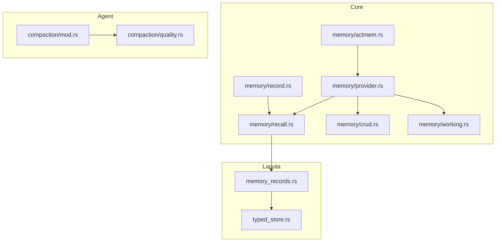
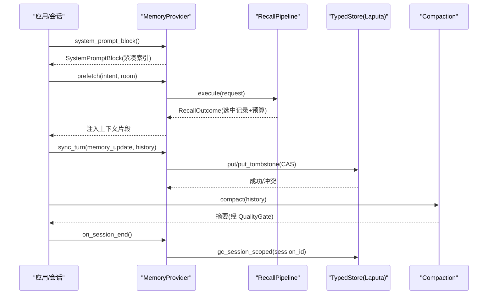
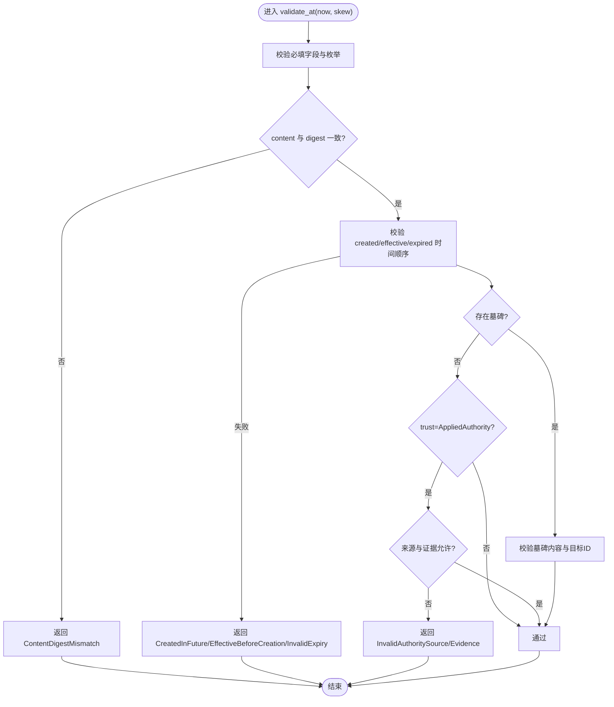
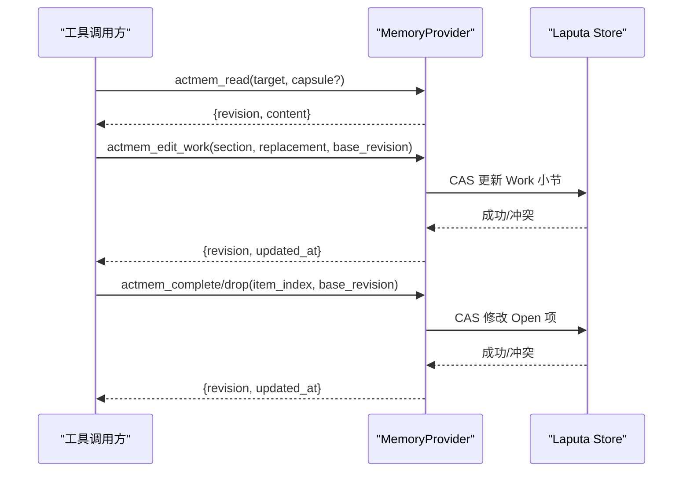
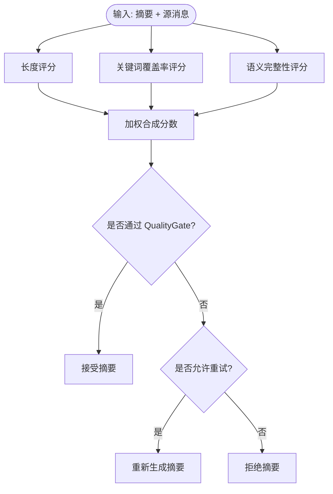
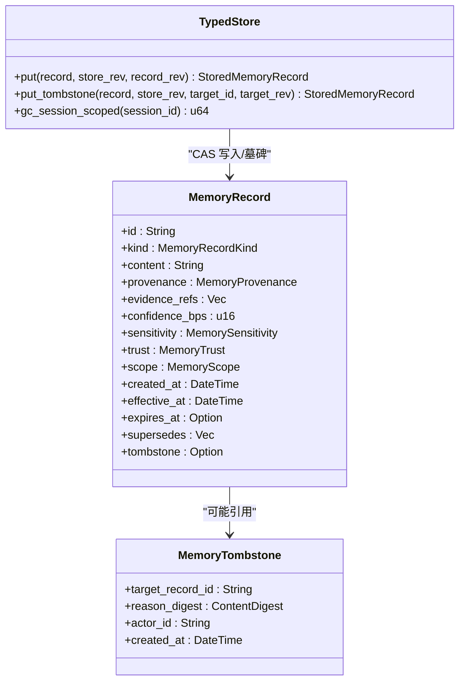
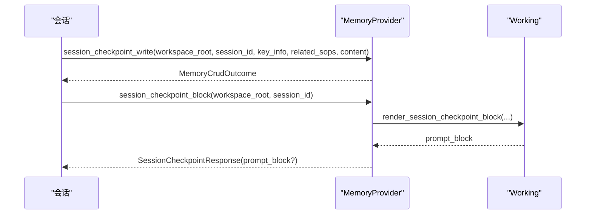
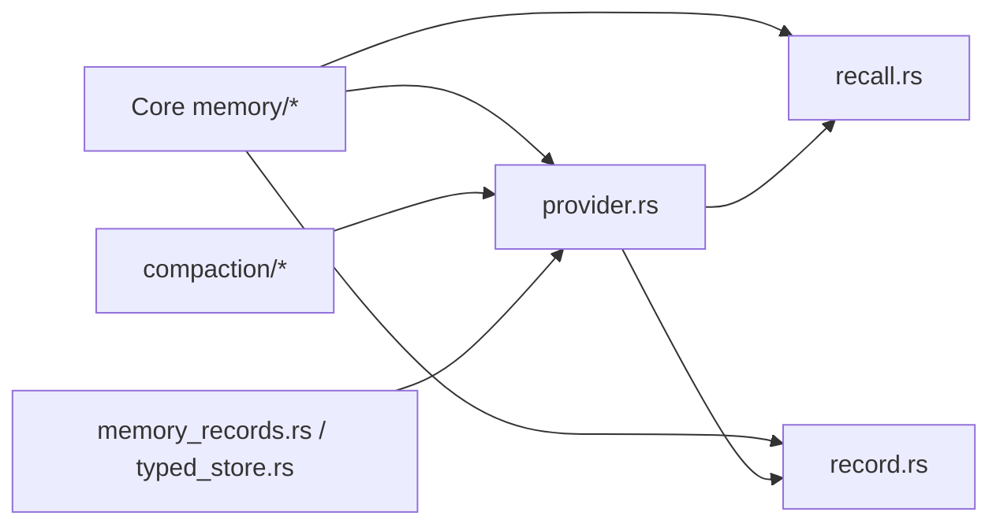
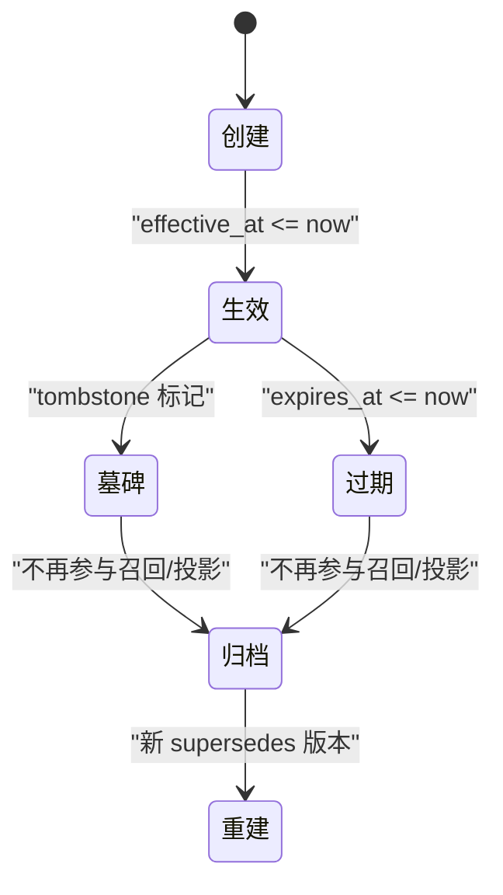

# 记忆生命周期管理

<cite>
**本文引用的文件**
- [agent-diva-core/src/memory/mod.rs](file://agent-diva-core/src/memory/mod.rs)
- [agent-diva-core/src/memory/record.rs](file://agent-diva-core/src/memory/record.rs)
- [agent-diva-core/src/memory/actmem.rs](file://agent-diva-core/src/memory/actmem.rs)
- [agent-diva-core/src/memory/provider.rs](file://agent-diva-core/src/memory/provider.rs)
- [agent-diva-core/src/memory/recall.rs](file://agent-diva-core/src/memory/recall.rs)
- [agent-diva-core/src/memory/crud.rs](file://agent-diva-core/src/memory/crud.rs)
- [agent-diva-core/src/memory/working.rs](file://agent-diva-core/src/memory/working.rs)
- [agent-diva-agent/src/compaction/mod.rs](file://agent-diva-agent/src/compaction/mod.rs)
- [agent-diva-agent/src/compaction/quality.rs](file://agent-diva-agent/src/compaction/quality.rs)
- [agent-diva-laputa/src/memory_records.rs](file://agent-diva-laputa/src/memory_records.rs)
- [agent-diva-laputa/src/typed_store.rs](file://agent-diva-laputa/src/typed_store.rs)
</cite>

## 目录
1. [简介](#简介)
2. [项目结构](#项目结构)
3. [核心组件](#核心组件)
4. [架构总览](#架构总览)
5. [详细组件分析](#详细组件分析)
6. [依赖关系分析](#依赖关系分析)
7. [性能考量](#性能考量)
8. [故障排查指南](#故障排查指南)
9. [结论](#结论)
10. [附录：状态转换与配置示例](#附录状态转换与配置示例)

## 简介
本文件系统化阐述 Agent-Diva 的记忆生命周期管理，覆盖从记录创建、编辑、读取、召回、压缩到归档的完整流程。重点包括：
- MemoryRecord 的结构定义与校验规则（元数据、内容摘要、信任度评分）
- ACTMEM 操作的工作机制（编辑工作区与读取请求）
- 记忆完整性检查与质量评估机制
- 记忆压缩、去重与版本控制策略
- 生命周期状态转换图与可运行配置要点

## 项目结构
记忆系统由 core 层提供稳定领域契约，agent 层实现上下文压缩与质量门控，laputa 层提供持久化存储与迁移能力。关键模块如下：
- memory: 记录模型、ACTMEM 契约、CRUD 接口、Provider 边界、Recall 管线、会话工作区
- compaction: 上下文压缩执行与质量评估
- laputa: 规范化适配、类型化存储、版本 CAS 与 tombstone 支持

图表来源
- [agent-diva-core/src/memory/mod.rs:1-47](file://agent-diva-core/src/memory/mod.rs#L1-L47)
- [agent-diva-core/src/memory/record.rs:103-120](file://agent-diva-core/src/memory/record.rs#L103-L120)
- [agent-diva-core/src/memory/actmem.rs:1-51](file://agent-diva-core/src/memory/actmem.rs#L1-L51)
- [agent-diva-core/src/memory/provider.rs:414-617](file://agent-diva-core/src/memory/provider.rs#L414-L617)
- [agent-diva-core/src/memory/recall.rs:214-359](file://agent-diva-core/src/memory/recall.rs#L214-L359)
- [agent-diva-core/src/memory/crud.rs:1-192](file://agent-diva-core/src/memory/crud.rs#L1-L192)
- [agent-diva-core/src/memory/working.rs:1-123](file://agent-diva-core/src/memory/working.rs#L1-L123)
- [agent-diva-agent/src/compaction/mod.rs:1-33](file://agent-diva-agent/src/compaction/mod.rs#L1-L33)
- [agent-diva-agent/src/compaction/quality.rs:1-611](file://agent-diva-agent/src/compaction/quality.rs#L1-L611)
- [agent-diva-laputa/src/memory_records.rs:1-703](file://agent-diva-laputa/src/memory_records.rs#L1-L703)
- [agent-diva-laputa/src/typed_store.rs:881-1023](file://agent-diva-laputa/src/typed_store.rs#L881-L1023)

章节来源
- [agent-diva-core/src/memory/mod.rs:1-47](file://agent-diva-core/src/memory/mod.rs#L1-L47)

## 核心组件
- MemoryRecord 与相关枚举：定义记录的分类、来源、敏感度、信任等级、范围、时间戳、失效期、替代链与墓碑标记；提供严格校验与提示转义渲染。
- Provider 边界：统一启动注入、预取召回、回合同步、会话结束钩子、ACTMEM 读写、CRUD 与蒸馏入口。
- Recall 管线：候选获取、策略过滤、评分排序、去重、多样性、预算控制与输出拼装。
- CRUD：面向代理的直接增删改查与蒸馏接口，返回确定性结果。
- Working：会话级检查点写入与渲染，强调“非权威、易失性”。
- Compaction：上下文压缩执行与质量门控，保障长会话不溢出上下文窗口。
- Laputa 适配与存储：将旧格式与已应用段规范为 MemoryRecord，提供类型化存储、CAS 版本控制、tombstone 软删除与完整性报告。

章节来源
- [agent-diva-core/src/memory/record.rs:103-120](file://agent-diva-core/src/memory/record.rs#L103-L120)
- [agent-diva-core/src/memory/provider.rs:414-617](file://agent-diva-core/src/memory/provider.rs#L414-L617)
- [agent-diva-core/src/memory/recall.rs:214-359](file://agent-diva-core/src/memory/recall.rs#L214-L359)
- [agent-diva-core/src/memory/crud.rs:1-192](file://agent-diva-core/src/memory/crud.rs#L1-L192)
- [agent-diva-core/src/memory/working.rs:1-123](file://agent-diva-core/src/memory/working.rs#L1-L123)
- [agent-diva-agent/src/compaction/mod.rs:1-33](file://agent-diva-agent/src/compaction/mod.rs#L1-L33)
- [agent-diva-agent/src/compaction/quality.rs:1-611](file://agent-diva-agent/src/compaction/quality.rs#L1-L611)
- [agent-diva-laputa/src/memory_records.rs:1-703](file://agent-diva-laputa/src/memory_records.rs#L1-L703)
- [agent-diva-laputa/src/typed_store.rs:881-1023](file://agent-diva-laputa/src/typed_store.rs#L881-L1023)

## 架构总览
记忆系统以 Provider 为边界，向上对接 Prompt 装配与会话编排，向下对接 Laputa 存储与工具调用。核心路径：
- 启动阶段：Provider.system_prompt_block 产出 L1 索引块，仅包含指针，不注入全文。
- 回合中：可选 Prefetch 召回，按策略与预算选择并注入上下文。
- 回合后：SyncTurn 持久化证据或更新。
- 会话结束：on_session_end 清理工作区或触发归档节奏。
- 压缩：Compactor 在上下文接近上限时生成摘要，QualityGate 评估是否接受。

图表来源
- [agent-diva-core/src/memory/provider.rs:414-617](file://agent-diva-core/src/memory/provider.rs#L414-L617)
- [agent-diva-core/src/memory/recall.rs:214-359](file://agent-diva-core/src/memory/recall.rs#L214-L359)
- [agent-diva-laputa/src/typed_store.rs:881-1023](file://agent-diva-laputa/src/typed_store.rs#L881-L1023)
- [agent-diva-agent/src/compaction/mod.rs:1-33](file://agent-diva-agent/src/compaction/mod.rs#L1-L33)

## 详细组件分析

### MemoryRecord 结构与校验
- 关键字段
  - id、kind、content、provenance(source/source_id/content_digest/captured_at/correlation)
  - evidence_refs、confidence_bps、sensitivity、trust、scope(tenant/workspace/session)
  - created_at/effective_at/expires_at、supersedes、tombstone(target_record_id/reason_digest/actor_id/created_at)
- 校验要点
  - 必填字段、未知枚举拒绝、digest 算法与值校验
  - 内容哈希必须匹配 provenance.content_digest
  - 时间约束：created_at 不得超前于 now（允许时钟偏差）、effective_at >= created_at、expires_at > effective_at
  - 自我替代禁止、墓碑内容与目标一致性、权威来源限制
- 提示安全
  - escape_memory_for_prompt 对内容进行 HTML 转义，避免注入攻击
  - render_l1_index_block 仅注入有限行索引，不注入全文

图表来源
- [agent-diva-core/src/memory/record.rs:193-289](file://agent-diva-core/src/memory/record.rs#L193-L289)
- [agent-diva-core/src/memory/record.rs:291-356](file://agent-diva-core/src/memory/record.rs#L291-L356)

章节来源
- [agent-diva-core/src/memory/record.rs:103-120](file://agent-diva-core/src/memory/record.rs#L103-L120)
- [agent-diva-core/src/memory/record.rs:193-289](file://agent-diva-core/src/memory/record.rs#L193-L289)
- [agent-diva-core/src/memory/record.rs:291-356](file://agent-diva-core/src/memory/record.rs#L291-L356)

### ACTMEM 工作机制
- 读取目标：Pulse/Recap/Work/Head/Capsules/Capsule
- 读取请求：ActmemReadRequest(target, capsule_name)，响应 ActmemReadResponse(revision, content)
- 编辑工作：ActmemEditWorkRequest(section, replacement, base_revision)，响应 ActmemMutationResponse(revision, updated_at)
- 项目项操作：ActmemItemRequest(section, item_index, base_revision)，用于完成/丢弃条目
- Provider 默认不可用，需具体实现覆盖 actmem_read/edit_work/complete/drop

图表来源
- [agent-diva-core/src/memory/actmem.rs:1-51](file://agent-diva-core/src/memory/actmem.rs#L1-L51)
- [agent-diva-core/src/memory/provider.rs:528-555](file://agent-diva-core/src/memory/provider.rs#L528-L555)
- [agent-diva-laputa/src/typed_store.rs:881-1023](file://agent-diva-laputa/src/typed_store.rs#L881-L1023)

章节来源
- [agent-diva-core/src/memory/actmem.rs:1-51](file://agent-diva-core/src/memory/actmem.rs#L1-L51)
- [agent-diva-core/src/memory/provider.rs:528-555](file://agent-diva-core/src/memory/provider.rs#L528-L555)

### 记忆完整性检查与质量评估
- 完整性检查
  - compare_normalized_records 检测重复 ID、断裂 supersedes、过期与墓碑计数
  - store.integrity 统计 tombstone_count、fts_row_count、supersedes_edge_count、orphan_fts_rows
- 质量评估（压缩摘要）
  - 三维度评分：长度、关键词覆盖率、语义完整性
  - QualityGate 阈值门控，支持重试预算
  - 权重：长度 20%、关键词 40%、完整性 40%

图表来源
- [agent-diva-agent/src/compaction/quality.rs:17-96](file://agent-diva-agent/src/compaction/quality.rs#L17-L96)
- [agent-diva-agent/src/compaction/quality.rs:176-305](file://agent-diva-agent/src/compaction/quality.rs#L176-L305)
- [agent-diva-laputa/src/memory_records.rs:162-222](file://agent-diva-laputa/src/memory_records.rs#L162-L222)

章节来源
- [agent-diva-agent/src/compaction/quality.rs:17-96](file://agent-diva-agent/src/compaction/quality.rs#L17-L96)
- [agent-diva-agent/src/compaction/quality.rs:176-305](file://agent-diva-agent/src/compaction/quality.rs#L176-L305)
- [agent-diva-laputa/src/memory_records.rs:162-222](file://agent-diva-laputa/src/memory_records.rs#L162-L222)

### 记忆压缩、去重与版本控制策略
- 压缩
  - 上下文压缩在 agent 层进行，受 TokenEstimator 与 ContextBudgetMonitor 驱动，CheckpointCompactor 生成摘要，QualityGate 决定接受与否
  - 压缩产物不得再作为压缩输入，保持深度限制，保留高价值来源摘录
- 去重
  - RecallPipeline 基于 provenance.content_digest 去重，避免重复注入
  - 规范化阶段 detect duplicate_record_ids
- 版本控制
  - 使用 supersedes 链接新版本与旧版本
  - 使用 tombstone 软删除旧记录，审计原因与执行者
  - TypedStore 提供 store_revision 与 record_revision 双重 CAS，确保并发安全
  - 会话级工作区在会话结束时物理清理（非权威）

图表来源
- [agent-diva-core/src/memory/record.rs:103-120](file://agent-diva-core/src/memory/record.rs#L103-L120)
- [agent-diva-core/src/memory/record.rs:94-101](file://agent-diva-core/src/memory/record.rs#L94-L101)
- [agent-diva-laputa/src/typed_store.rs:881-1023](file://agent-diva-laputa/src/typed_store.rs#L881-L1023)

章节来源
- [agent-diva-agent/src/compaction/mod.rs:1-33](file://agent-diva-agent/src/compaction/mod.rs#L1-L33)
- [agent-diva-core/src/memory/recall.rs:292-306](file://agent-diva-core/src/memory/recall.rs#L292-L306)
- [agent-diva-laputa/src/memory_records.rs:162-222](file://agent-diva-laputa/src/memory_records.rs#L162-L222)
- [agent-diva-laputa/src/typed_store.rs:881-1023](file://agent-diva-laputa/src/typed_store.rs#L881-L1023)

### 会话工作区与启动注入
- 工作区检查点
  - SessionCheckpointWriteRequest 写入 key_info、related_sops、content
  - render_session_checkpoint_block 生成结构化 Markdown 块，注入当前回合上下文
  - 工作区内容易失，不在长期权威中持久化
- 启动注入
  - StartupContextSnapshot 合并 memory/soul/wakeup 等投影，渲染为 CompactRenderedMarkdown
  - 降级状态明确告知 last_usable_wakeup 缺失原因

图表来源
- [agent-diva-core/src/memory/working.rs:20-76](file://agent-diva-core/src/memory/working.rs#L20-L76)
- [agent-diva-core/src/memory/provider.rs:586-609](file://agent-diva-core/src/memory/provider.rs#L586-L609)

章节来源
- [agent-diva-core/src/memory/working.rs:20-76](file://agent-diva-core/src/memory/working.rs#L20-L76)
- [agent-diva-core/src/memory/provider.rs:127-180](file://agent-diva-core/src/memory/provider.rs#L127-L180)

## 依赖关系分析
- Core 提供稳定契约，Agent 与 Laputa 分别实现运行时与持久化
- Provider 聚合 CRUD、ACTMEM、Recall、Working 能力，屏蔽底层差异
- Recall 依赖 Record 模型与 Escape 渲染，保证最小指针原则
- Compaction 依赖 QualityGate 与 TokenEstimator，保障上下文窗口可控
- Laputa 提供类型化存储、CAS、tombstone、GC 与完整性报告

图表来源
- [agent-diva-core/src/memory/mod.rs:1-47](file://agent-diva-core/src/memory/mod.rs#L1-L47)
- [agent-diva-core/src/memory/provider.rs:414-617](file://agent-diva-core/src/memory/provider.rs#L414-L617)
- [agent-diva-core/src/memory/recall.rs:214-359](file://agent-diva-core/src/memory/recall.rs#L214-L359)
- [agent-diva-agent/src/compaction/mod.rs:1-33](file://agent-diva-agent/src/compaction/mod.rs#L1-L33)
- [agent-diva-laputa/src/memory_records.rs:1-703](file://agent-diva-laputa/src/memory_records.rs#L1-L703)
- [agent-diva-laputa/src/typed_store.rs:881-1023](file://agent-diva-laputa/src/typed_store.rs#L881-L1023)

章节来源
- [agent-diva-core/src/memory/mod.rs:1-47](file://agent-diva-core/src/memory/mod.rs#L1-L47)

## 性能考量
- 启动注入仅携带 L1 索引，减少上下文体积
- Recall 预算控制：header_tokens + 每条记录估算 token，超预算即停止
- 去重与多样性：基于 digest 去重、按 kind 多样化，避免冗余
- 压缩：在接近上下文上限时触发，质量门控降低低质摘要风险
- 存储：store_revision 与 record_revision 双重 CAS 防止竞态；会话 GC 物理删除工作区数据

[本节为通用指导，无需特定文件来源]

## 故障排查指南
- 记录校验失败
  - 常见错误：缺少必填字段、未知枚举、digest 不匹配、时间顺序非法、自我替代、墓碑内容非法、权威来源受限
  - 定位：validate_at 与 validate_workspace
- 召回失败或降级
  - 检索不可用会返回 Degraded 且空结果；无效请求返回 Failed
  - 定位：RecallPipeline.execute/select_with_estimator
- 版本冲突
  - store_revision 或 record_revision 不一致导致冲突
  - 定位：TypedStore.put_inner 中的 CAS 检查
- 完整性问题
  - 重复 ID、断裂 supersedes、过期与墓碑计数异常
  - 定位：compare_normalized_records 与 store integrity

章节来源
- [agent-diva-core/src/memory/record.rs:193-289](file://agent-diva-core/src/memory/record.rs#L193-L289)
- [agent-diva-core/src/memory/recall.rs:214-359](file://agent-diva-core/src/memory/recall.rs#L214-L359)
- [agent-diva-laputa/src/typed_store.rs:915-1023](file://agent-diva-laputa/src/typed_store.rs#L915-L1023)
- [agent-diva-laputa/src/memory_records.rs:162-222](file://agent-diva-laputa/src/memory_records.rs#L162-L222)

## 结论
该记忆系统通过稳定的领域契约与分层实现，实现了从创建、编辑、读取、召回、压缩到归档的全生命周期管理。核心优势包括：
- 强校验与审计追踪（provenance、correlation、digest）
- 最小指针原则与预算控制，避免上下文膨胀
- 版本化与软删除，支持回溯与合规
- 质量门控与压缩，保障长会话稳定性
- 清晰的 Provider 边界，便于替换后端与扩展能力

[本节为总结，无需特定文件来源]

## 附录：状态转换与配置示例

### 记忆记录生命周期状态转换

[此图为概念性流程图，不直接映射具体源码，故无图表来源]

### 配置要点示例（文本描述）
- 启动注入
  - 使用 StartupContextSnapshot 组合 memory/soul/wakeup 投影，渲染为 CompactRenderedMarkdown
  - 若无法生成 wakeup，则返回 Degraded 并说明原因
- 召回策略
  - RecallPolicy.default_prompt() 仅允许 AppliedAuthority 与 Public/Internal/Private 敏感度
  - token_budget 控制注入总量；max_candidates 限制候选数量
- 压缩质量门控
  - QualityGate 默认 min_completeness=0.4、min_keyword_coverage=0.2、min_score=0.5、max_retry=2
  - 可根据业务调整阈值与重试次数
- 版本控制
  - 写操作需提供 base_revision；tombstone 需指定 target_record_id 与 reason_digest
  - 会话结束使用 gc_session_scoped 清理工作区数据

章节来源
- [agent-diva-core/src/memory/provider.rs:127-180](file://agent-diva-core/src/memory/provider.rs#L127-L180)
- [agent-diva-core/src/memory/recall.rs:37-56](file://agent-diva-core/src/memory/recall.rs#L37-L56)
- [agent-diva-agent/src/compaction/quality.rs:42-61](file://agent-diva-agent/src/compaction/quality.rs#L42-L61)
- [agent-diva-laputa/src/typed_store.rs:881-1023](file://agent-diva-laputa/src/typed_store.rs#L881-L1023)