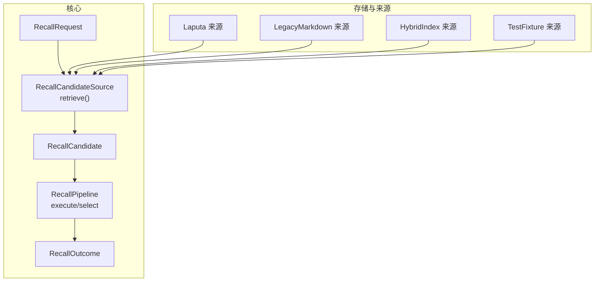
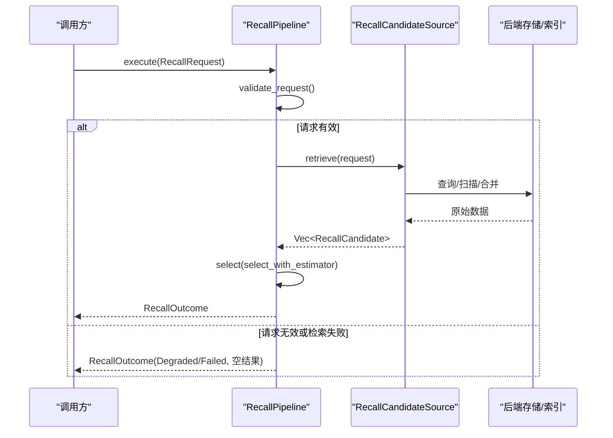
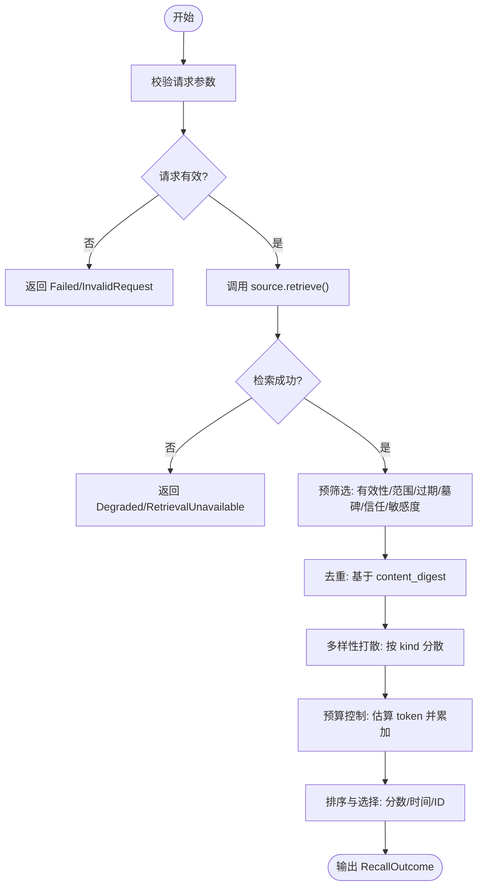
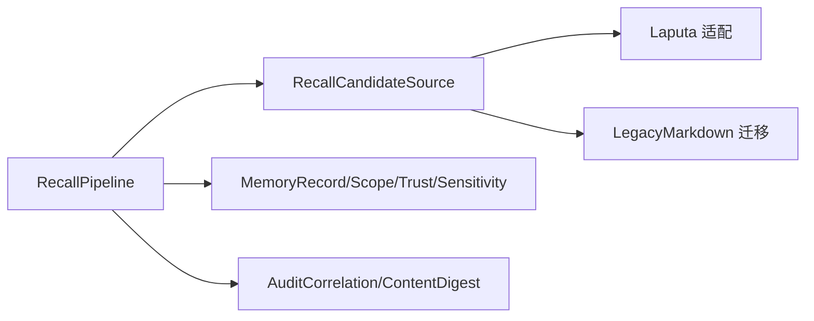

# 候选项来源

<cite>
**本文引用的文件**
- [agent-diva-core/src/memory/recall.rs](file://agent-diva-core/src/memory/recall.rs)
- [agent-diva-core/src/memory/record.rs](file://agent-diva-core/src/memory/record.rs)
- [agent-diva-core/src/memory/mod.rs](file://agent-diva-core/src/memory/mod.rs)
- [agent-diva-laputa/src/memory_records.rs](file://agent-diva-laputa/src/memory_records.rs)
- [agent-diva-migration/src/typed_memory.rs](file://agent-diva-migration/src/typed_memory.rs)
</cite>

## 目录
1. [简介](#简介)
2. [项目结构](#项目结构)
3. [核心组件](#核心组件)
4. [架构总览](#架构总览)
5. [详细组件分析](#详细组件分析)
6. [依赖关系分析](#依赖关系分析)
7. [性能考量](#性能考量)
8. [故障排查指南](#故障排查指南)
9. [结论](#结论)
10. [附录](#附录)

## 简介
本文件围绕“候选项来源”展开，系统性说明 Recall v2 的异步检索接口、候选项标准化流程、来源追踪机制，以及四种候选项来源类型（Laputa、LegacyMarkdown、HybridIndex、TestFixture）的特点与适用场景。同时提供自定义来源实现指南、性能优化建议与错误处理最佳实践，帮助读者在不深入源码的情况下理解并扩展该子系统。

## 项目结构
- 召回核心在 agent-diva-core 的 memory 模块中定义：
  - 统一的数据结构与选择管线：RecallRequest、RecallCandidate、RecallOutcome、RecallPipeline 等。
  - 稳定的来源分类枚举：RecallRetrievalSource（包含 Laputa、LegacyMarkdown、HybridIndex、TestFixture）。
  - 标准化的记录模型：MemoryRecord、MemoryScope、MemoryProvenance、信任与敏感度策略等。
- 具体来源适配位于其他 crate：
  - Laputa 来源将 Laputa 章节规范化为 MemoryRecord，并标注来源。
  - LegacyMarkdown 迁移路径将历史 Markdown 内容转换为标准记录。
  - HybridIndex 与 TestFixture 作为预留或测试用途的来源分类。

图表来源
- [agent-diva-core/src/memory/recall.rs:25-35](file://agent-diva-core/src/memory/recall.rs#L25-L35)
- [agent-diva-core/src/memory/recall.rs:190-197](file://agent-diva-core/src/memory/recall.rs#L190-L197)
- [agent-diva-core/src/memory/recall.rs:218-234](file://agent-diva-core/src/memory/recall.rs#L218-L234)

章节来源
- [agent-diva-core/src/memory/recall.rs:1-234](file://agent-diva-core/src/memory/recall.rs#L1-L234)
- [agent-diva-core/src/memory/mod.rs:1-47](file://agent-diva-core/src/memory/mod.rs#L1-L47)

## 核心组件
- RecallCandidateSource 异步接口
  - retrieve(request) -> Result<Vec<RecallCandidate>, RecallSourceError>
  - 要求实现方返回已标准化的候选项列表；失败时返回无内容的错误，由上层降级处理。
- RecallPipeline 编排
  - execute：先校验请求，再调用 source.retrieve；若检索失败，返回空结果并标记 Degraded。
  - select/select_with_estimator：对候选项执行去重、过期/墓碑/范围/信任/敏感度过滤、多样性打散、预算控制与排序，输出最终 prompt_block 与 trace。
- 数据来源分类
  - RecallRetrievalSource 枚举明确区分 Laputa、LegacyMarkdown、HybridIndex、TestFixture，便于审计与统计。
- 标准化记录
  - MemoryRecord 携带 id、kind、content、provenance、evidence_refs、confidence_bps、sensitivity、trust、scope、时间戳、supersedes、tombstone 等字段，确保可验证、可追溯、可审计。

章节来源
- [agent-diva-core/src/memory/recall.rs:58-76](file://agent-diva-core/src/memory/recall.rs#L58-L76)
- [agent-diva-core/src/memory/recall.rs:190-234](file://agent-diva-core/src/memory/recall.rs#L190-L234)
- [agent-diva-core/src/memory/recall.rs:236-359](file://agent-diva-core/src/memory/recall.rs#L236-L359)
- [agent-diva-core/src/memory/record.rs:103-120](file://agent-diva-core/src/memory/record.rs#L103-L120)

## 架构总览
下图展示一次完整的 recall 调用从请求到结果输出的时序，包括来源检索、选择阶段与预算控制。

图表来源
- [agent-diva-core/src/memory/recall.rs:218-234](file://agent-diva-core/src/memory/recall.rs#L218-L234)
- [agent-diva-core/src/memory/recall.rs:236-359](file://agent-diva-core/src/memory/recall.rs#L236-L359)

## 详细组件分析

### RecallCandidateSource 与 retrieve 异步接口规范
- 职责边界
  - 仅负责读取并返回已标准化的候选项；不执行跨来源合并与打分。
  - 所有私有诊断应在实现内部记录，错误类型不包含敏感内容。
- 输入输出
  - 输入：RecallRequest（query、scope、correlation、now、token_budget、max_candidates、policy）。
  - 输出：Vec<RecallCandidate>，每个候选项包含 MemoryRecord 与 retrieval_source、relevance_bps。
- 错误处理
  - 返回 RecallSourceError 表示不可用；上层会降级为 Degraded，避免注入陈旧上下文。
- 并发与生命周期
  - trait 要求 Send + Sync，适合多线程环境下的共享与复用。

章节来源
- [agent-diva-core/src/memory/recall.rs:190-197](file://agent-diva-core/src/memory/recall.rs#L190-L197)
- [agent-diva-core/src/memory/recall.rs:218-234](file://agent-diva-core/src/memory/recall.rs#L218-L234)

### 候选项数据结构与标准化过程
- RecallCandidate
  - record: MemoryRecord（标准化后的记忆条目）
  - relevance_bps: 相关性评分（basis points）
  - retrieval_source: 来源分类（Laputa/LegacyMarkdown/HybridIndex/Test Fixture/Unknown）
- MemoryRecord 关键字段
  - id、kind、content、provenance、evidence_refs、confidence_bps、sensitivity、trust、scope、created_at/effective_at/expires_at、supersedes、tombstone
  - provenance.source_id 与 content_digest 用于完整性校验与溯源
- 标准化流程要点
  - 各来源适配器需产出符合 MemoryRecord 约束的记录，并正确设置 trust/sensitivity/scope/provenance
  - 通过 escape_memory_for_prompt 将内容安全包裹为 data block，防止提示注入
  - 使用 estimate_recall_tokens 或可替换的 RecallTokenEstimator 估算 token 占用

章节来源
- [agent-diva-core/src/memory/recall.rs:70-76](file://agent-diva-core/src/memory/recall.rs#L70-L76)
- [agent-diva-core/src/memory/record.rs:103-120](file://agent-diva-core/src/memory/record.rs#L103-L120)
- [agent-diva-core/src/memory/record.rs:299-312](file://agent-diva-core/src/memory/record.rs#L299-L312)
- [agent-diva-core/src/memory/recall.rs:394-398](file://agent-diva-core/src/memory/recall.rs#L394-L398)

### 四种候选项来源类型与适用场景
- Laputa
  - 特点：来自结构化章节（如 identity、relationship、commitment、preferences、memory_md），映射为 typed MemoryRecord，具备强一致性与治理约束。
  - 适用：权威型、长期稳定、需要严格信任与敏感度控制的上下文注入。
  - 代码证据：来源分类与记录映射逻辑可见于 Laputa 适配层。
- LegacyMarkdown
  - 特点：将历史 MEMORY.md/HISTORY.md 等 Markdown 迁移为标准记录，保留来源信息但受限于旧格式能力。
  - 适用：存量数据兼容与迁移期过渡。
  - 代码证据：迁移路径将 Markdown 内容转为 MemoryRecord 并标注来源。
- HybridIndex
  - 特点：预留分类，适用于混合检索（例如 FTS + embedding 合并后进入 recall 管线）的场景。
  - 适用：未来引入向量/全文混合检索时的统一入口。
- TestFixture
  - 特点：测试与仿真数据源，便于端到端验证与回归。
  - 适用：单元测试、集成测试、性能基准。

章节来源
- [agent-diva-core/src/memory/recall.rs:25-35](file://agent-diva-core/src/memory/recall.rs#L25-L35)
- [agent-diva-laputa/src/memory_records.rs:421-432](file://agent-diva-laputa/src/memory_records.rs#L421-L432)
- [agent-diva-migration/src/typed_memory.rs:287-318](file://agent-diva-migration/src/typed_memory.rs#L287-L318)

### 候选项来源追踪机制
- 每个候选项都携带 retrieval_source，用于：
  - 审计与统计：了解哪些来源贡献了上下文
  - 策略控制：未知来源会被拒绝（Invalid）
  - 问题定位：结合 RecallTrace 中的 reason 与 final_score_bps 进行排障
- 选择阶段的 trace 记录
  - 记录每个候选项的决策（Selected/Rejected）、原因（WorkspaceMismatch/Expired/Tombstoned/Superseded/Duplicate/TrustDenied/SensitivityDenied/Invalid/OverBudget/CandidateLimit）
  - 记录 estimated_tokens 与 final_score_bps，便于预算与排序分析

章节来源
- [agent-diva-core/src/memory/recall.rs:78-117](file://agent-diva-core/src/memory/recall.rs#L78-L117)
- [agent-diva-core/src/memory/recall.rs:532-583](file://agent-diva-core/src/memory/recall.rs#L532-L583)
- [agent-diva-core/src/memory/recall.rs:599-643](file://agent-diva-core/src/memory/recall.rs#L599-L643)

### 自定义候选项来源实现指南
- 步骤概览
  1. 实现 RecallCandidateSource trait，提供 retrieve(request) 方法
  2. 在 retrieve 中访问你的后端（数据库/文件系统/远程服务），并将结果标准化为 Vec<RecallCandidate>
  3. 为每个候选项设置正确的 retrieval_source（如 HybridIndex）与 relevance_bps
  4. 确保 MemoryRecord 满足约束（id、scope、provenance、digest、trust/sensitivity 等）
  5. 在调用处将你的 source 注入 RecallPipeline.execute
- 关键注意事项
  - 错误不要泄露敏感内容；使用 RecallSourceError 表达不可用
  - 保持幂等与可重试性；上游会在失败时降级
  - 合理设置 relevance_bps，避免超出 MAX_CONFIDENCE_BPS
  - 如需精确 token 估算，可实现 RecallTokenEstimator 并通过 select_with_estimator 传入

章节来源
- [agent-diva-core/src/memory/recall.rs:190-202](file://agent-diva-core/src/memory/recall.rs#L190-L202)
- [agent-diva-core/src/memory/recall.rs:236-259](file://agent-diva-core/src/memory/recall.rs#L236-L259)
- [agent-diva-core/src/memory/record.rs:193-276](file://agent-diva-core/src/memory/record.rs#L193-L276)

### 选择与预算管线流程图

图表来源
- [agent-diva-core/src/memory/recall.rs:236-359](file://agent-diva-core/src/memory/recall.rs#L236-L359)
- [agent-diva-core/src/memory/recall.rs:532-583](file://agent-diva-core/src/memory/recall.rs#L532-L583)

## 依赖关系分析
- 核心依赖
  - governance::AuditCorrelation、ContentDigest：用于关联审计与内容完整性
  - memory::MemoryRecord、MemoryScope、MemorySensitivity、MemoryTrust：标准化记录与策略
- 外部来源
  - Laputa 适配层：将章节映射为 MemoryRecord 并设置来源
  - Migration 适配层：将历史 Markdown 转换为标准记录
- 耦合与内聚
  - RecallPipeline 与 RecallCandidateSource 解耦，便于替换不同后端
  - 选择阶段与来源实现分离，提升可测试性与可维护性

图表来源
- [agent-diva-core/src/memory/recall.rs:218-234](file://agent-diva-core/src/memory/recall.rs#L218-L234)
- [agent-diva-core/src/memory/record.rs:103-120](file://agent-diva-core/src/memory/record.rs#L103-L120)
- [agent-diva-laputa/src/memory_records.rs:421-432](file://agent-diva-laputa/src/memory_records.rs#L421-L432)
- [agent-diva-migration/src/typed_memory.rs:287-318](file://agent-diva-migration/src/typed_memory.rs#L287-L318)

章节来源
- [agent-diva-core/src/memory/recall.rs:218-234](file://agent-diva-core/src/memory/recall.rs#L218-L234)
- [agent-diva-core/src/memory/record.rs:103-120](file://agent-diva-core/src/memory/record.rs#L103-L120)

## 性能考量
- 确定性估算
  - 默认保守 Unicode 估算器：ceil(chars / 3)，保证上限可控
  - 支持替换为更精确的 tokenizer 估算器，通过 select_with_estimator 注入
- 预算控制
  - 头部提示块占固定 token；后续每条记录追加分隔符与内容 token
  - 超过预算立即停止添加，避免溢出
- 去重与多样性
  - 基于 content_digest 去重，减少冗余
  - 按 kind 多样性打散，避免单一类型主导上下文
- I/O 与并发
  - 来源实现应缓存热点数据、限制扫描范围、避免阻塞线程
  - 使用异步 I/O，配合 tokio 运行时提高吞吐

章节来源
- [agent-diva-core/src/memory/recall.rs:204-212](file://agent-diva-core/src/memory/recall.rs#L204-L212)
- [agent-diva-core/src/memory/recall.rs:308-337](file://agent-diva-core/src/memory/recall.rs#L308-L337)
- [agent-diva-core/src/memory/recall.rs:394-398](file://agent-diva-core/src/memory/recall.rs#L394-L398)

## 故障排查指南
- 常见失败模式
  - 检索不可用：RecallStatus=Degraded，failure=RetrievalUnavailable，prompt_block 为空
  - 请求无效：RecallStatus=Failed，failure=InvalidRequest
  - 候选项被拒绝：trace 中包含 WorkspaceMismatch/SessionMismatch/Expired/Tombstoned/Superseded/Duplicate/TrustDenied/SensitivityDenied/Invalid/OverBudget/CandidateLimit
- 排查步骤
  1. 检查 RecallRequest 必填字段与 policy 是否合法
  2. 查看 trace 中每个候选项的 decision/reason/final_score_bps/estimated_tokens
  3. 确认 MemoryRecord 的 scope/trust/sensitivity 是否符合策略
  4. 核对 content_digest 与 provenance.source_id 是否正确
  5. 对于来源实现，检查 I/O 错误与日志，必要时增加本地诊断
- 降级策略
  - 检索失败不会抛出异常，而是返回空结果并标记 Degraded，避免注入陈旧上下文

章节来源
- [agent-diva-core/src/memory/recall.rs:119-136](file://agent-diva-core/src/memory/recall.rs#L119-L136)
- [agent-diva-core/src/memory/recall.rs:218-234](file://agent-diva-core/src/memory/recall.rs#L218-L234)
- [agent-diva-core/src/memory/recall.rs:532-583](file://agent-diva-core/src/memory/recall.rs#L532-L583)
- [agent-diva-core/src/memory/recall.rs:599-643](file://agent-diva-core/src/memory/recall.rs#L599-L643)

## 结论
Recall v2 通过统一的异步接口与严格的标准化流程，实现了多来源候选项的安全、可控、可审计注入。Laputa 提供权威结构化来源，LegacyMarkdown 保障历史兼容，HybridIndex 与 TestFixture 为未来扩展与测试预留空间。选择管线内置预算控制、去重与多样性打散，确保上下文质量与稳定性。通过实现 RecallCandidateSource 与可选的 RecallTokenEstimator，团队可以灵活接入新的检索后端，并在生产环境中获得一致的降级与可观测性。

## 附录
- 术语速查
  - RecallCandidate：标准化候选项（含 MemoryRecord、relevance_bps、retrieval_source）
  - RecallPipeline：选择与预算编排器
  - MemoryRecord：标准化记忆记录，含可信度、敏感度、范围、时间戳、证据与墓碑
  - RecallRetrievalSource：来源分类（Laputa/LegacyMarkdown/HybridIndex/Test Fixture/Unknown）
- 相关导出
  - memory 模块对外导出 recall 与 record 的关键类型与工具函数，便于上层集成

章节来源
- [agent-diva-core/src/memory/mod.rs:22-41](file://agent-diva-core/src/memory/mod.rs#L22-L41)