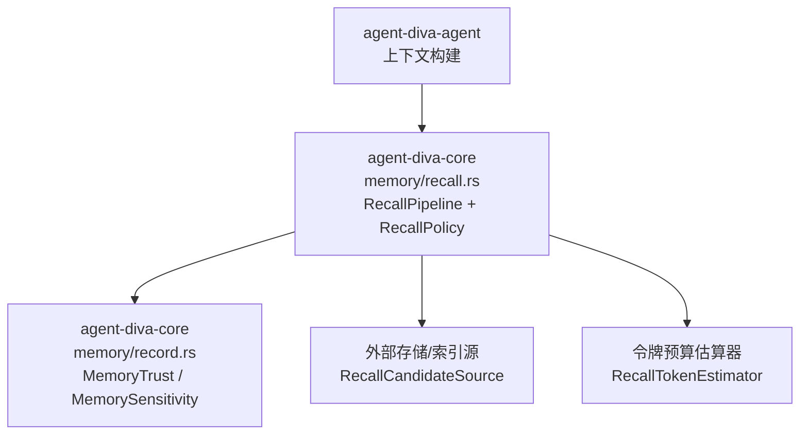
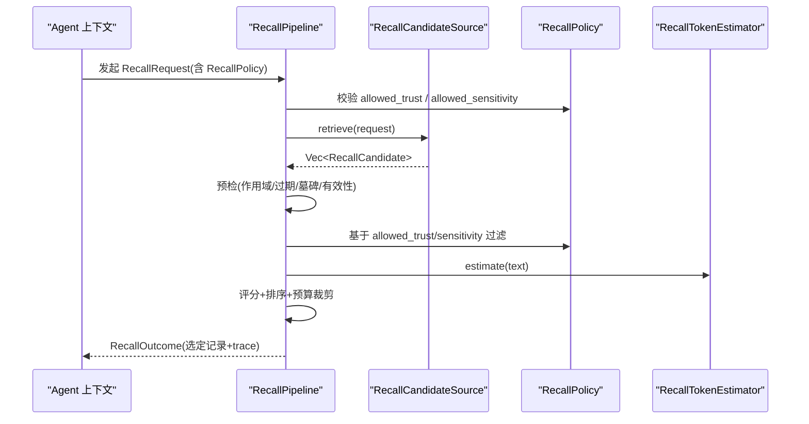
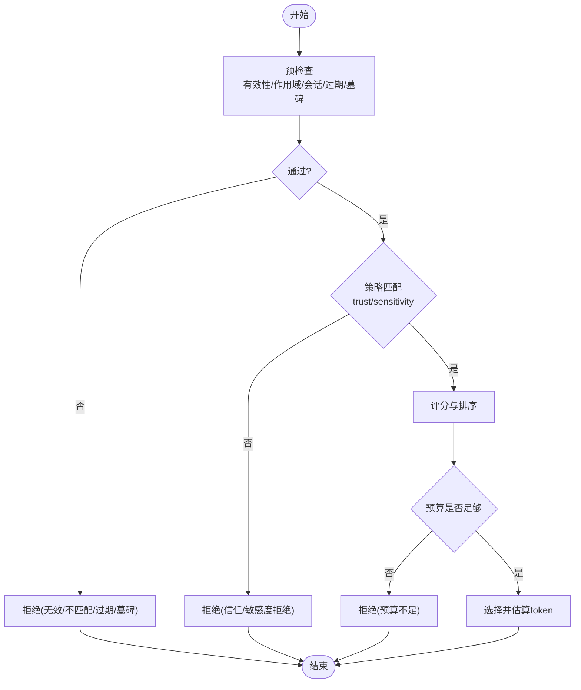
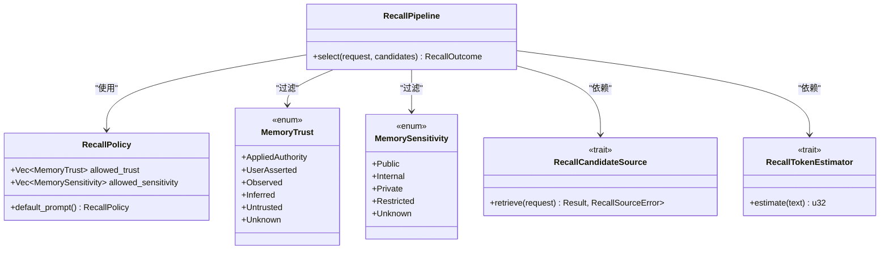

# 召回策略配置

<cite>
**本文引用的文件**
- [agent-diva-core/src/memory/recall.rs](file://agent-diva-core/src/memory/recall.rs)
- [agent-diva-core/src/memory/record.rs](file://agent-diva-core/src/memory/record.rs)
- [agent-diva-core/src/memory/mod.rs](file://agent-diva-core/src/memory/mod.rs)
- [agent-diva-agent/src/context.rs](file://agent-diva-agent/src/context.rs)
</cite>

## 目录
1. [简介](#简介)
2. [项目结构](#项目结构)
3. [核心组件](#核心组件)
4. [架构总览](#架构总览)
5. [详细组件分析](#详细组件分析)
6. [依赖关系分析](#依赖关系分析)
7. [性能考虑](#性能考虑)
8. [故障排查指南](#故障排查指南)
9. [结论](#结论)
10. [附录](#附录)

## 简介
本文件面向“召回策略配置”，聚焦 RecallPolicy 的设计理念与配置项，解释 allowed_trust 与 allowed_sensitivity 的作用机制，说明信任级别（AppliedAuthority、UserAsserted、Observed、Inferred、Untrusted）与敏感度级别（Public、Internal、Private、Restricted）的含义与使用场景。文档还给出默认策略、按业务定制的策略模式、最佳实践与安全原则，帮助在系统提示注入与上下文组装阶段安全、可控地召回记忆内容。

## 项目结构
召回策略相关代码集中在 agent-diva-core 的 memory 模块中，并通过 agent-diva-agent 的上下文构建流程接入系统提示注入。关键文件：
- 召回管道与策略定义：agent-diva-core/src/memory/recall.rs
- 记录模型与枚举定义：agent-diva-core/src/memory/record.rs
- 模块对外导出：agent-diva-core/src/memory/mod.rs
- 上下文构建与策略使用入口：agent-diva-agent/src/context.rs

图表来源
- [agent-diva-core/src/memory/recall.rs:37-68](file://agent-diva-core/src/memory/recall.rs#L37-L68)
- [agent-diva-core/src/memory/record.rs:51-74](file://agent-diva-core/src/memory/record.rs#L51-L74)
- [agent-diva-core/src/memory/mod.rs:29-35](file://agent-diva-core/src/memory/mod.rs#L29-L35)

章节来源
- [agent-diva-core/src/memory/recall.rs:1-68](file://agent-diva-core/src/memory/recall.rs#L1-L68)
- [agent-diva-core/src/memory/record.rs:51-74](file://agent-diva-core/src/memory/record.rs#L51-L74)
- [agent-diva-core/src/memory/mod.rs:29-35](file://agent-diva-core/src/memory/mod.rs#L29-L35)

## 核心组件
- RecallPolicy：控制一次召回可进入提示的内容白名单，包含 allowed_trust 与 allowed_sensitivity 两个列表。
- RecallRequest：单次召回请求，携带查询、作用域、审计关联、时间、令牌预算、候选上限以及策略。
- RecallCandidate：被检索到的候选记录及其相关性分数、来源分类。
- RecallPipeline：执行选择、评分、预算裁剪与输出，返回选定记录与追踪信息。
- MemoryTrust/MemorySensitivity：记录的信任与敏感度标签，用于策略过滤。

章节来源
- [agent-diva-core/src/memory/recall.rs:37-68](file://agent-diva-core/src/memory/recall.rs#L37-L68)
- [agent-diva-core/src/memory/recall.rs:70-84](file://agent-diva-core/src/memory/recall.rs#L70-L84)
- [agent-diva-core/src/memory/record.rs:51-74](file://agent-diva-core/src/memory/record.rs#L51-L74)

## 架构总览
召回流程以“最小权限”为默认原则：仅允许高信任且非受限敏感度的记录进入系统提示。整体调用链如下：

图表来源
- [agent-diva-core/src/memory/recall.rs:37-68](file://agent-diva-core/src/memory/recall.rs#L37-L68)
- [agent-diva-core/src/memory/recall.rs:509-583](file://agent-diva-core/src/memory/recall.rs#L509-L583)
- [agent-diva-core/src/memory/recall.rs:585-663](file://agent-diva-core/src/memory/recall.rs#L585-L663)

## 详细组件分析

### RecallPolicy 设计与默认策略
- 设计理念：fail-closed（失败关闭），默认只注入最高信任且非受限敏感度的内容，避免将低可信或高敏感数据误入提示。
- 默认策略：default_prompt() 仅允许 AppliedAuthority 信任级别，并允许 Public、Internal、Private 敏感度，排除 Restricted。
- 扩展点：通过传入不同的 allowed_trust/allowed_sensitivity 列表，可在不同上下文中放宽或收紧策略。

章节来源
- [agent-diva-core/src/memory/recall.rs:37-56](file://agent-diva-core/src/memory/recall.rs#L37-L56)
- [agent-diva-core/src/memory/recall.rs:711-712](file://agent-diva-core/src/memory/recall.rs#L711-L712)

### 信任级别 MemoryTrust
- AppliedAuthority：由权威来源应用写入的记录，适合默认注入。
- UserAsserted：用户明确断言的内容，可用于需要体现用户意图的场景。
- Observed：系统观察到的事实，置信度低于断言。
- Inferred：推断出的内容，需谨慎使用。
- Untrusted：不可信来源，默认不应进入提示。
- Unknown：未知值会被拒绝，防止回退到宽松策略。

使用建议：
- 默认提示注入：仅 Allowed Authority。
- 交互增强：可按需加入 UserAsserted/Observed，但应配合敏感度限制。
- 推理辅助：仅在受控环境启用 Inferred，并严格限制敏感度。

章节来源
- [agent-diva-core/src/memory/record.rs:63-74](file://agent-diva-core/src/memory/record.rs#L63-L74)
- [agent-diva-core/src/memory/recall.rs:519-521](file://agent-diva-core/src/memory/recall.rs#L519-L521)

### 敏感度级别 MemorySensitivity
- Public：公开信息，风险最低。
- Internal：内部信息，一般可注入。
- Private：私有信息，默认允许但需结合信任级别控制。
- Restricted：受限信息，默认禁止注入，避免泄露。
- Unknown：未知值会被拒绝。

使用建议：
- 默认策略允许 Public/Internal/Private，禁止 Restricted。
- 对涉及隐私或合规的数据，保持 Restricted 不被注入。
- 当业务需要展示更多上下文时，优先提升信任级别而非放宽敏感度。

章节来源
- [agent-diva-core/src/memory/record.rs:51-61](file://agent-diva-core/src/memory/record.rs#L51-L61)
- [agent-diva-core/src/memory/recall.rs:49-53](file://agent-diva-core/src/memory/recall.rs#L49-L53)
- [agent-diva-core/src/memory/recall.rs:522-528](file://agent-diva-core/src/memory/recall.rs#L522-L528)

### 过滤与决策流程
- 预检查：有效性、作用域匹配、会话匹配、过期与墓碑标记。
- 策略过滤：若记录的 trust/sensitivity 不在 allowed 列表中，则拒绝并记录原因。
- 评分与预算：根据相关性、重要性、新鲜度、人格权重进行评分，按令牌预算裁剪。
- 追踪：每次拒绝或选择都会生成 trace，便于审计与调试。

图表来源
- [agent-diva-core/src/memory/recall.rs:509-583](file://agent-diva-core/src/memory/recall.rs#L509-L583)
- [agent-diva-core/src/memory/recall.rs:585-663](file://agent-diva-core/src/memory/recall.rs#L585-L663)

章节来源
- [agent-diva-core/src/memory/recall.rs:509-583](file://agent-diva-core/src/memory/recall.rs#L509-L583)
- [agent-diva-core/src/memory/recall.rs:585-663](file://agent-diva-core/src/memory/recall.rs#L585-L663)

### 在上下文中的使用
- 默认策略通过 default_prompt() 提供，确保系统提示注入遵循最小权限。
- 上下文构建会引用该策略，保证注入的记忆片段既相关又安全。

章节来源
- [agent-diva-core/src/memory/recall.rs:44-56](file://agent-diva-core/src/memory/recall.rs#L44-L56)
- [agent-diva-agent/src/context.rs:1110-1120](file://agent-diva-agent/src/context.rs#L1110-L1120)

## 依赖关系分析
- RecallPolicy 依赖 MemoryTrust 与 MemorySensitivity 枚举，作为过滤条件。
- RecallPipeline 依赖 RecallCandidateSource 获取候选，依赖 RecallTokenEstimator 估算 token。
- 模块通过 mod.rs 统一导出接口，供上层上下文构建与工具调用使用。

图表来源
- [agent-diva-core/src/memory/recall.rs:37-68](file://agent-diva-core/src/memory/recall.rs#L37-L68)
- [agent-diva-core/src/memory/record.rs:51-74](file://agent-diva-core/src/memory/record.rs#L51-L74)
- [agent-diva-core/src/memory/mod.rs:29-35](file://agent-diva-core/src/memory/mod.rs#L29-L35)

章节来源
- [agent-diva-core/src/memory/recall.rs:37-68](file://agent-diva-core/src/memory/recall.rs#L37-L68)
- [agent-diva-core/src/memory/record.rs:51-74](file://agent-diva-core/src/memory/record.rs#L51-L74)
- [agent-diva-core/src/memory/mod.rs:29-35](file://agent-diva-core/src/memory/mod.rs#L29-L35)

## 性能考虑
- 评分权重：相关性占主导，辅以重要性、新鲜度与人格权重，减少无关内容进入提示。
- 预算控制：通过令牌预算估算与裁剪，避免超出模型上下文窗口。
- 预检查前置：尽早拒绝无效或不匹配候选，降低后续计算成本。
- 稳定排序：最终评分相同的情况下，按生效时间与记录ID排序，保证结果确定性。

章节来源
- [agent-diva-core/src/memory/recall.rs:18-23](file://agent-diva-core/src/memory/recall.rs#L18-L23)
- [agent-diva-core/src/memory/recall.rs:585-597](file://agent-diva-core/src/memory/recall.rs#L585-L597)
- [agent-diva-core/src/memory/recall.rs:645-663](file://agent-diva-core/src/memory/recall.rs#L645-L663)

## 故障排查指南
- 未知信任/敏感度：若策略中包含 Unknown 值，会在请求验证阶段直接拒绝。
- 作用域/会话不匹配：跨租户、工作区或会话的候选将被拒绝。
- 过期/墓碑：已过期或被墓碑标记的记录不会进入提示。
- 预算不足：在高相关性候选较多时，可能因预算限制被裁剪。
- 追踪定位：通过 RecallTrace 中的 decision 与 reason 快速定位拒绝原因。

章节来源
- [agent-diva-core/src/memory/recall.rs:171-183](file://agent-diva-core/src/memory/recall.rs#L171-L183)
- [agent-diva-core/src/memory/recall.rs:509-583](file://agent-diva-core/src/memory/recall.rs#L509-L583)
- [agent-diva-core/src/memory/recall.rs:599-643](file://agent-diva-core/src/memory/recall.rs#L599-L643)

## 结论
RecallPolicy 以最小权限为核心，通过 allowed_trust 与 allowed_sensitivity 精确控制哪些记忆可进入系统提示。默认策略仅注入高信任且非受限敏感度的内容，保障安全与稳定性。实际使用中，可根据业务需求逐步放宽信任范围或调整敏感度白名单，同时结合令牌预算与评分机制，实现高质量、低风险的上下文注入。

## 附录

### 常见配置模式与最佳实践
- 默认生产模式：使用 default_prompt()，仅注入 AppliedAuthority 与 Public/Internal/Private。
- 用户意图增强：在特定对话中临时加入 UserAsserted，但仍限制敏感度。
- 观察性上下文：在可信环境中引入 Observed，避免 Inferred 直接进入提示。
- 受限数据保护：始终禁止 Restricted 进入默认提示；如需展示，必须经审批与脱敏。
- 预算优先：先调优评分与筛选，再考虑放宽策略；避免单纯扩大白名单。
- 审计与追踪：利用 trace 与拒绝原因持续优化策略与数据来源质量。

### 安全与权限控制指导原则
- 默认拒绝：未知信任/敏感度一律拒绝，防止回退到宽松策略。
- 分层控制：信任级别决定“能否注入”，敏感度级别决定“是否允许”。
- 边界清晰：严格按租户/工作区/会话作用域隔离，避免跨域泄露。
- 可观测性：所有拒绝与选择均需记录 trace，支持事后审计与问题定位。
- 渐进放开：任何策略放宽都应经过测试与评估，优先提升信任级别而非放宽敏感度。