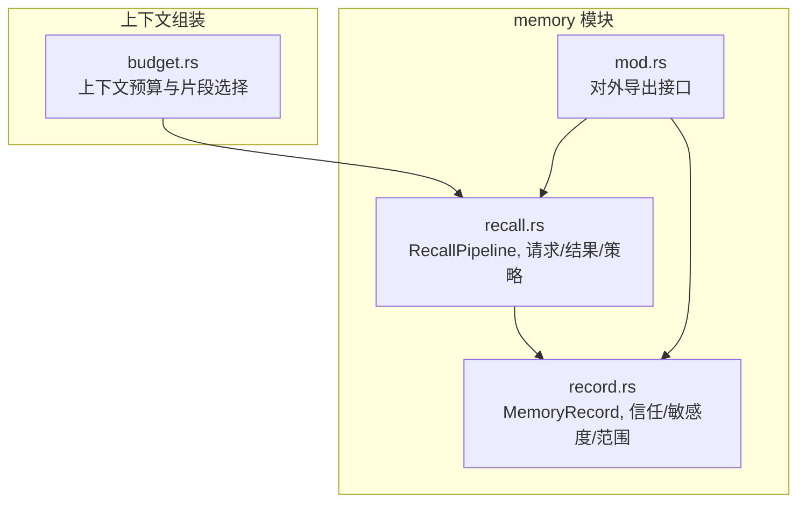
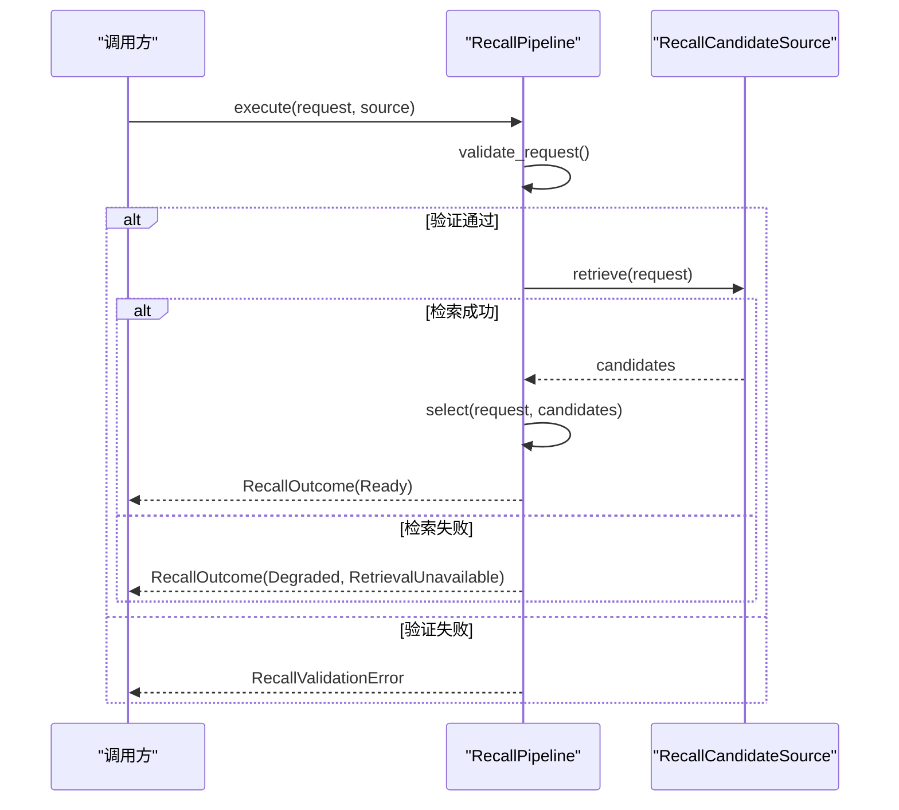
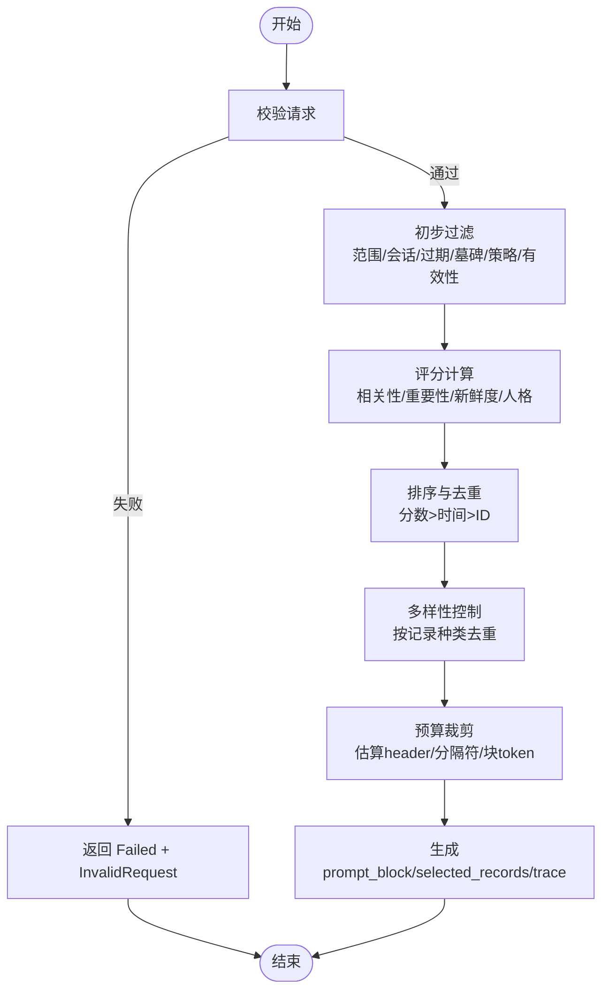
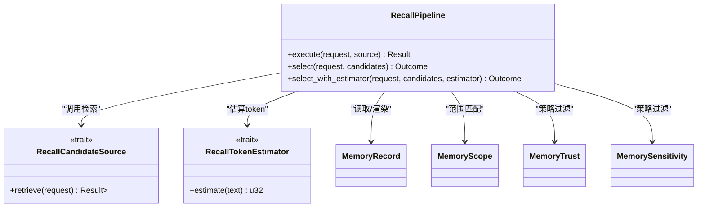

# 召回管道核心

<cite>
**本文引用的文件**
- [agent-diva-core/src/memory/recall.rs](file://agent-diva-core/src/memory/recall.rs)
- [agent-diva-core/src/memory/mod.rs](file://agent-diva-core/src/memory/mod.rs)
- [agent-diva-core/src/memory/record.rs](file://agent-diva-core/src/memory/record.rs)
- [agent-diva-agent/src/context_assembly/budget.rs](file://agent-diva-agent/src/context_assembly/budget.rs)
</cite>

## 目录
1. [简介](#简介)
2. [项目结构](#项目结构)
3. [核心组件](#核心组件)
4. [架构总览](#架构总览)
5. [详细组件分析](#详细组件分析)
6. [依赖关系分析](#依赖关系分析)
7. [性能考量](#性能考量)
8. [故障排查指南](#故障排查指南)
9. [结论](#结论)
10. [附录：使用示例与最佳实践](#附录：使用示例与最佳实践)

## 简介
本文件聚焦于“召回管道”（Recall Pipeline）的核心设计与实现，围绕 RecallPipeline 的 execute 与 select 方法展开，系统阐述候选项预处理、评分计算、去重与多样性控制机制；解释预算管理机制（token 估算与分配策略）；说明错误处理与降级策略；并提供可操作的配置与执行示例以及性能优化建议与监控指标。

## 项目结构
召回管道位于 agent-diva-core 的 memory 模块中，对外通过 mod.rs 统一导出类型与能力。核心文件 recall.rs 实现了无状态、确定性的选择与预算管线；record.rs 定义了记忆记录、信任度、敏感度、范围等基础模型；context_assembly/budget.rs 展示了上层上下文组装如何与召回结果协同进行预算管理与片段选择。

图表来源
- [agent-diva-core/src/memory/recall.rs:1-120](file://agent-diva-core/src/memory/recall.rs#L1-L120)
- [agent-diva-core/src/memory/record.rs:50-120](file://agent-diva-core/src/memory/record.rs#L50-L120)
- [agent-diva-core/src/memory/mod.rs:1-47](file://agent-diva-core/src/memory/mod.rs#L1-L47)
- [agent-diva-agent/src/context_assembly/budget.rs:197-230](file://agent-diva-agent/src/context_assembly/budget.rs#L197-L230)

章节来源
- [agent-diva-core/src/memory/recall.rs:1-120](file://agent-diva-core/src/memory/recall.rs#L1-L120)
- [agent-diva-core/src/memory/mod.rs:1-47](file://agent-diva-core/src/memory/mod.rs#L1-L47)

## 核心组件
- RecallRequest：单次召回执行的输入，包含查询、作用域、审计关联、当前时间、token 预算、候选上限与安全策略。
- RecallCandidate：被检索到的候选项，携带原始 MemoryRecord 与检索相关性分数、来源分类。
- RecallPolicy：最小权限策略，限定允许的信任级别与敏感度级别。
- RecallOutcome：执行结果，包含状态、失败原因、选中记录、提示块、预算使用统计与逐条决策轨迹。
- RecallPipeline：无状态编排器，提供 execute（异步检索+选择）与 select/select_with_estimator（确定性选择）。
- RecallTokenEstimator：可替换的 token 估算器，默认保守估计用于预算控制。
- 辅助类型：RecallRetrievalSource、RecallDecision、RecallSelectionReason、RecallTrace、RecallBudgetUsage、RecallShadowReport 等。

章节来源
- [agent-diva-core/src/memory/recall.rs:58-170](file://agent-diva-core/src/memory/recall.rs#L58-L170)
- [agent-diva-core/src/memory/recall.rs:190-216](file://agent-diva-core/src/memory/recall.rs#L190-L216)
- [agent-diva-core/src/memory/recall.rs:218-360](file://agent-diva-core/src/memory/recall.rs#L218-L360)

## 架构总览
RecallPipeline 将“检索”和“选择”解耦：execute 负责调用外部 RecallCandidateSource 获取候选，select 在内存中对候选进行确定性筛选、评分、去重、多样性控制与预算裁剪，最终产出结构化结果与审计轨迹。

图表来源
- [agent-diva-core/src/memory/recall.rs:218-234](file://agent-diva-core/src/memory/recall.rs#L218-L234)
- [agent-diva-core/src/memory/recall.rs:236-360](file://agent-diva-core/src/memory/recall.rs#L236-L360)

## 详细组件分析

### execute 方法：端到端流程与降级
- 前置校验：validate_request 检查必填字段、候选上限、策略合法性。
- 检索阶段：调用 source.retrieve 获取候选集合。
- 降级策略：若检索失败，返回空结果并标记 Degraded + RetrievalUnavailable，避免传播错误到上层。
- 选择阶段：成功时进入 select，进行后续确定性处理。

章节来源
- [agent-diva-core/src/memory/recall.rs:218-234](file://agent-diva-core/src/memory/recall.rs#L218-L234)

### select 方法：确定性选择流水线
select 内部委托 select_with_estimator，完成以下阶段：
1) 请求再次校验，失败直接返回 Failed 状态。
2) 初步过滤：按 max_candidates 限制、工作区/会话匹配、过期、墓碑、信任/敏感度策略、有效性等拒绝不合规候选，并记录拒绝原因。
3) 评分计算：对通过初步过滤的候选计算 final_score_bps，权重包括相关性、重要性、新鲜度、人格相关度。
4) 排序与去重：按分数降序、有效时间、ID 稳定排序；基于内容摘要去重。
5) 多样性控制：按记录种类（kind）做首次出现优先，保证类别覆盖。
6) 预算裁剪：以 PROMPT_HEADER 为固定开销，逐项估算渲染块与分隔符的 token，超过预算则拒绝并记录 OverBudget。
7) 输出：生成 prompt_block（仅当有选中记录）、selected_records、预算使用统计与 trace。

图表来源
- [agent-diva-core/src/memory/recall.rs:245-360](file://agent-diva-core/src/memory/recall.rs#L245-L360)
- [agent-diva-core/src/memory/recall.rs:400-507](file://agent-diva-core/src/memory/recall.rs#L400-L507)
- [agent-diva-core/src/memory/recall.rs:532-597](file://agent-diva-core/src/memory/recall.rs#L532-L597)

#### 评分计算细节
- 相关性权重：relevance_bps × 55
- 重要性权重：由信任级别、记录种类、置信度推导
- 新鲜度权重：基于 effective_at 与 now 的天数差，每 30 天一个衰减步长
- 人格相关度：当记录种类为身份/关系/偏好且查询命中关键词或内容词时加分
- 最终分数：加权求和后归一化为 bps

章节来源
- [agent-diva-core/src/memory/recall.rs:400-473](file://agent-diva-core/src/memory/recall.rs#L400-L473)

#### 去重与多样性
- 去重：基于记录的内容摘要（content_digest），保留首个出现的记录。
- 多样性：按记录种类（kind）映射键，确保每种 kind 至少一条，再追加其余候选。

章节来源
- [agent-diva-core/src/memory/recall.rs:276-308](file://agent-diva-core/src/memory/recall.rs#L276-L308)
- [agent-diva-core/src/memory/recall.rs:475-507](file://agent-diva-core/src/memory/recall.rs#L475-L507)

#### 预算管理与 token 估算
- 固定开销：PROMPT_HEADER 的 token 估算作为起始占用。
- 增量开销：每个记录的渲染块与分隔符（换行）的 token 估算。
- 估算器：默认 ConservativeRecallRecallTokenEstimator 使用保守 Unicode 估算（字符数/3 向上取整），支持替换为更精确的估算器。
- 预算策略：严格不超过 token_budget；若 selected_count 为 0，used_tokens 强制为 0，避免误报。

章节来源
- [agent-diva-core/src/memory/recall.rs:204-212](file://agent-diva-core/src/memory/recall.rs#L204-L212)
- [agent-diva-core/src/memory/recall.rs:309-358](file://agent-diva-core/src/memory/recall.rs#L309-L358)
- [agent-diva-core/src/memory/recall.rs:394-398](file://agent-diva-core/src/memory/recall.rs#L394-L398)

### 错误处理与降级
- 请求级错误：返回 RecallValidationError，阻止检索。
- 检索失败：返回 RecallOutcome(status=Degraded, failure=RetrievalUnavailable)，不泄露内部错误，保持系统可用。
- 记录级拒绝：每条候选均产生 RecallTrace，明确拒绝原因（如 WorkspaceMismatch、Expired、Tombstoned、Superseded、Duplicate、TrustDenied、SensitivityDenied、Invalid、OverBudget、CandidateLimit）。

章节来源
- [agent-diva-core/src/memory/recall.rs:171-188](file://agent-diva-core/src/memory/recall.rs#L171-L188)
- [agent-diva-core/src/memory/recall.rs:218-234](file://agent-diva-core/src/memory/recall.rs#L218-L234)
- [agent-diva-core/src/memory/recall.rs:532-597](file://agent-diva-core/src/memory/recall.rs#L532-L597)

### 数据流与审计
- 每次决策写入 RecallTrace，包含 record_id、content_digest、retrieval_source、decision、reason、relevance_bps、final_score_bps、estimated_tokens。
- compare_recall_shadow 可用于对比旧版预取与 Recall v2 的差异，仅暴露摘要与统计，不暴露内容。

章节来源
- [agent-diva-core/src/memory/recall.rs:106-156](file://agent-diva-core/src/memory/recall.rs#L106-L156)
- [agent-diva-core/src/memory/recall.rs:362-392](file://agent-diva-core/src/memory/recall.rs#L362-L392)

## 依赖关系分析
- 与 memory/record.rs 的依赖：使用 MemoryRecord、MemoryScope、MemoryTrust、MemorySensitivity、MAX_CONFIDENCE_BPS、escape_memory_for_prompt、memory_content_digest 等。
- 与治理模块的依赖：AuditCorrelation、ContentDigest 用于审计追踪与内容摘要。
- 与上下文组装的协作：上层 context_assembly 根据整体预算与层级策略决定召回片段是否纳入上下文，并在压力下进行压缩或丢弃。

图表来源
- [agent-diva-core/src/memory/recall.rs:190-216](file://agent-diva-core/src/memory/recall.rs#L190-L216)
- [agent-diva-core/src/memory/recall.rs:218-360](file://agent-diva-core/src/memory/recall.rs#L218-L360)
- [agent-diva-core/src/memory/record.rs:50-120](file://agent-diva-core/src/memory/record.rs#L50-L120)

章节来源
- [agent-diva-core/src/memory/recall.rs:190-360](file://agent-diva-core/src/memory/recall.rs#L190-L360)
- [agent-diva-core/src/memory/record.rs:50-120](file://agent-diva-core/src/memory/record.rs#L50-L120)

## 性能考量
- 确定性排序与去重：使用 BTreeMap/BTreeSet 保证稳定顺序与高效去重。
- 评分计算：常数时间复杂度，主要成本在字符串比较与时间差计算。
- 多样性控制：线性扫描，维护已见种类集合。
- 预算估算：保守估算避免超支，但可能过于保守导致选中的记录偏少；可通过替换 RecallTokenEstimator 提升精度。
- I/O 分离：检索与选择解耦，便于并行化检索与缓存候选。
- 建议：
  - 在高吞吐场景下，缓存 RecallCandidateSource 的结果并按请求参数索引。
  - 针对多语言文本，接入更精确的 tokenizer 估算器以减少浪费。
  - 合理设置 max_candidates 与 token_budget，避免过多候选进入评分与多样性阶段。

[本节为通用性能指导，不直接分析具体文件]

## 故障排查指南
- 常见问题定位：
  - 检索不可用：查看 RecallOutcome.status 是否为 Degraded，failure 是否为 RetrievalUnavailable。
  - 请求非法：检查 RecallValidationError 的具体原因（缺失字段、未知信任/敏感度、候选上限无效）。
  - 记录被拒绝：通过 RecallTrace.reason 判断是范围不匹配、过期、墓碑、信任/敏感度拒绝、重复、预算不足还是候选上限。
- 调试建议：
  - 启用 trace 输出，关注 selected_count、rejected_count、used_tokens、budget_tokens。
  - 使用 compare_recall_shadow 对比新旧方案差异，确认内容是否变化及 token 变化量。
  - 替换 RecallTokenEstimator 进行回归测试，验证预算行为是否符合预期。

章节来源
- [agent-diva-core/src/memory/recall.rs:171-188](file://agent-diva-core/src/memory/recall.rs#L171-L188)
- [agent-diva-core/src/memory/recall.rs:218-234](file://agent-diva-core/src/memory/recall.rs#L218-L234)
- [agent-diva-core/src/memory/recall.rs:532-597](file://agent-diva-core/src/memory/recall.rs#L532-L597)
- [agent-diva-core/src/memory/recall.rs:362-392](file://agent-diva-core/src/memory/recall.rs#L362-L392)

## 结论
RecallPipeline 提供了安全、确定、可审计的召回选择管线，通过严格的策略过滤、稳定的评分与多样性控制、以及稳健的预算管理与降级策略，确保系统在部分故障时仍能正常工作。其无状态设计便于测试与扩展，结合可替换的 token 估算器与外部检索源，能够灵活适配不同业务需求。

[本节为总结性内容，不直接分析具体文件]

## 附录：使用示例与最佳实践

### 配置与执行步骤
- 构造 RecallRequest：
  - 设置 query、scope（tenant_id、workspace_id、可选 session_id）、correlation（request_id、turn_id、session_id）、now、token_budget、max_candidates、policy（allowed_trust、allowed_sensitivity）。
- 实现 RecallCandidateSource：
  - 提供 retrieve 方法，返回 Vec<RecallCandidate>，包含 MemoryRecord、relevance_bps、retrieval_source。
- 调用 RecallPipeline.execute：
  - 传入 request 与 source，得到 RecallOutcome。
- 可选：使用 select_with_estimator 替换 token 估算器以获得更精确的预算控制。

章节来源
- [agent-diva-core/src/memory/recall.rs:58-68](file://agent-diva-core/src/memory/recall.rs#L58-L68)
- [agent-diva-core/src/memory/recall.rs:190-212](file://agent-diva-core/src/memory/recall.rs#L190-L212)
- [agent-diva-core/src/memory/recall.rs:218-243](file://agent-diva-core/src/memory/recall.rs#L218-L243)

### 监控指标
- 成功率：RecallOutcome.status == Ready 的比例。
- 降级率：RecallOutcome.status == Degraded 的比例。
- 预算使用率：budget.used_tokens / budget.budget_tokens。
- 选择率：selected_count / (selected_count + rejected_count)。
- 拒绝原因分布：按 RecallSelectionReason 统计。
- 内容变更：compare_recall_shadow.content_changed 与 token_delta。

章节来源
- [agent-diva-core/src/memory/recall.rs:119-156](file://agent-diva-core/src/memory/recall.rs#L119-L156)
- [agent-diva-core/src/memory/recall.rs:362-392](file://agent-diva-core/src/memory/recall.rs#L362-L392)

### 与上下文组装的协作
- 上层 context_assembly 根据整体预算与层级策略，决定是否将召回片段纳入上下文，并在压力下选择丢弃或压缩。
- 召回结果可作为动态片段之一，参与全局预算分配与优先级排序。

章节来源
- [agent-diva-agent/src/context_assembly/budget.rs:197-230](file://agent-diva-agent/src/context_assembly/budget.rs#L197-L230)