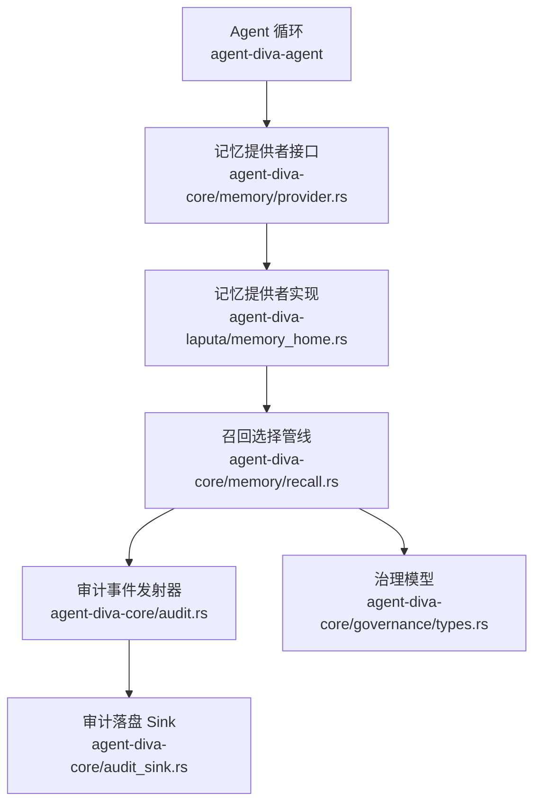
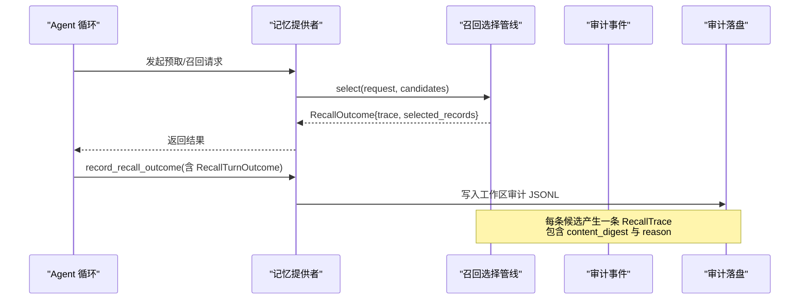
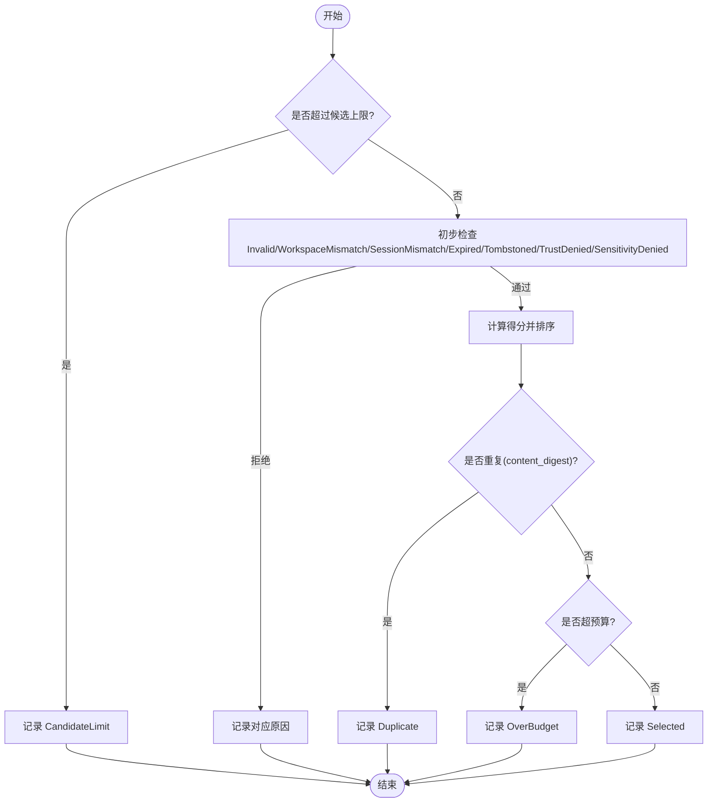
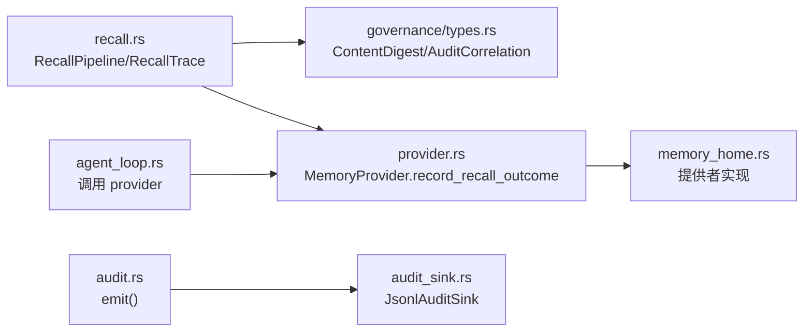

# 审计追踪

<cite>
**本文引用的文件**
- [agent-diva-core/src/memory/recall.rs](file://agent-diva-core/src/memory/recall.rs)
- [agent-diva-core/src/audit.rs](file://agent-diva-core/src/audit.rs)
- [agent-diva-core/src/audit_sink.rs](file://agent-diva-core/src/audit_sink.rs)
- [agent-diva-core/src/governance/types.rs](file://agent-diva-core/src/governance/types.rs)
- [agent-diva-core/src/memory/provider.rs](file://agent-diva-core/src/memory/provider.rs)
- [agent-diva-agent/src/agent_loop.rs](file://agent-diva-agent/src/agent_loop.rs)
- [agent-diva-laputa/src/bml/memory_home.rs](file://agent-diva-laputa/src/bml/memory_home.rs)
</cite>

## 目录
1. [简介](#简介)
2. [项目结构](#项目结构)
3. [核心组件](#核心组件)
4. [架构总览](#架构总览)
5. [详细组件分析](#详细组件分析)
6. [依赖关系分析](#依赖关系分析)
7. [性能考虑](#性能考虑)
8. [故障排查指南](#故障排查指南)
9. [结论](#结论)
10. [附录](#附录)

## 简介
本文件围绕 RecallTrace 的设计与实现，系统化说明每次候选项的完整决策轨迹记录。文档覆盖以下要点：
- 每个决策原因（Selected、WorkspaceMismatch、SessionMismatch、Expired、Tombstoned、Superseded、Duplicate、TrustDenied、SensitivityDenied、Invalid、OverBudget、CandidateLimit）的含义与触发条件。
- 内容摘要 ContentDigest 的作用：在不暴露具体内容的前提下进行可验证审计。
- 追踪数据的存储与分析方法、性能影响与存储优化策略。
- 审计日志使用示例与故障排查方法。
- 合规性要求与数据保护考虑。

## 项目结构
与审计追踪直接相关的代码分布在以下模块：
- 记忆召回与选择管线：定义 RecallPipeline、RecallTrace、RecallSelectionReason、RecallOutcome 等类型，并实现确定性选择与预算控制。
- 全局审计事件与落盘：通过 audit::emit 输出结构化审计事件，并通过 AuditSink 将事件写入工作区 JSONL 文件。
- 治理模型：ContentDigest、AuditCorrelation 等用于绑定内容与关联上下文。
- 记忆提供者接口：MemoryProvider 提供 record_recall_outcome 等能力，供上层在 turn 结束后持久化 Recall 结果。
- Agent 循环：调用 MemoryProvider 记录 Recall 结果，形成端到端闭环。

图表来源
- [agent-diva-agent/src/agent_loop.rs](file://agent-diva-agent/src/agent_loop.rs)
- [agent-diva-core/src/memory/provider.rs](file://agent-diva-core/src/memory/provider.rs)
- [agent-diva-laputa/src/bml/memory_home.rs](file://agent-diva-laputa/src/bml/memory_home.rs)
- [agent-diva-core/src/memory/recall.rs](file://agent-diva-core/src/memory/recall.rs)
- [agent-diva-core/src/audit.rs](file://agent-diva-core/src/audit.rs)
- [agent-diva-core/src/audit_sink.rs](file://agent-diva-core/src/audit_sink.rs)
- [agent-diva-core/src/governance/types.rs](file://agent-diva-core/src/governance/types.rs)

章节来源
- [agent-diva-core/src/memory/recall.rs:1-170](file://agent-diva-core/src/memory/recall.rs#L1-L170)
- [agent-diva-core/src/audit.rs:1-253](file://agent-diva-core/src/audit.rs#L1-L253)
- [agent-diva-core/src/audit_sink.rs:1-258](file://agent-diva-core/src/audit_sink.rs#L1-L258)
- [agent-diva-core/src/governance/types.rs:96-119](file://agent-diva-core/src/governance/types.rs#L96-L119)
- [agent-diva-core/src/memory/provider.rs:350-469](file://agent-diva-core/src/memory/provider.rs#L350-L469)
- [agent-diva-agent/src/agent_loop.rs:1090-1100](file://agent-diva-agent/src/agent_loop.rs#L1090-L1100)
- [agent-diva-laputa/src/bml/memory_home.rs:570-590](file://agent-diva-laputa/src/bml/memory_home.rs#L570-L590)

## 核心组件
- RecallPipeline：无状态的选择编排器，负责从候选集中筛选进入提示的内容，并生成每条候选的 RecallTrace。
- RecallTrace：单条候选的不可变审计轨迹，包含 record_id、content_digest、retrieval_source、decision、reason、relevance_bps、final_score_bps、estimated_tokens。
- RecallSelectionReason：机器可读的决策原因枚举，覆盖所有拒绝与选中场景。
- AuditEvent/AuditSink：系统级审计事件统一入口与可插拔落盘后端，支持按日滚动 JSONL 文件。
- ContentDigest/AuditCorrelation：治理层通用模型，用于内容指纹与跨事件关联。
- MemoryProvider.record_recall_outcome：将 Recall 结果持久化的扩展点，供上层在 turn 结束后回写。

章节来源
- [agent-diva-core/src/memory/recall.rs:78-156](file://agent-diva-core/src/memory/recall.rs#L78-L156)
- [agent-diva-core/src/memory/recall.rs:218-359](file://agent-diva-core/src/memory/recall.rs#L218-L359)
- [agent-diva-core/src/audit.rs:224-253](file://agent-diva-core/src/audit.rs#L224-L253)
- [agent-diva-core/src/audit_sink.rs:145-258](file://agent-diva-core/src/audit_sink.rs#L145-L258)
- [agent-diva-core/src/governance/types.rs:96-119](file://agent-diva-core/src/governance/types.rs#L96-L119)
- [agent-diva-core/src/memory/provider.rs:466-469](file://agent-diva-core/src/memory/provider.rs#L466-L469)

## 架构总览
下图展示了从候选检索到审计落盘的完整链路，以及 RecallTrace 如何被构造和消费。

图表来源
- [agent-diva-agent/src/agent_loop.rs:1090-1100](file://agent-diva-agent/src/agent_loop.rs#L1090-L1100)
- [agent-diva-core/src/memory/provider.rs:350-469](file://agent-diva-core/src/memory/provider.rs#L350-L469)
- [agent-diva-core/src/memory/recall.rs:218-359](file://agent-diva-core/src/memory/recall.rs#L218-L359)
- [agent-diva-core/src/audit_sink.rs:145-258](file://agent-diva-core/src/audit_sink.rs#L145-L258)

## 详细组件分析

### RecallTrace 与决策原因
RecallTrace 为每条候选生成不可变的审计轨迹，字段包括：
- record_id：记忆记录稳定标识。
- content_digest：内容摘要，用于不暴露正文的可验证审计。
- retrieval_source：候选来源分类（如 Laputa、LegacyMarkdown、HybridIndex、TestFixture、Unknown）。
- decision：Selected 或 Rejected。
- reason：机器可读的原因枚举。
- relevance_bps/final_score_bps：相关性评分与最终得分（以基点为单位）。
- estimated_tokens：估计 token 数（用于预算审计）。

决策原因及触发条件：
- Selected：候选通过全部检查且满足预算，被选入提示。
- WorkspaceMismatch：候选 scope.workspace_id 与请求不一致。
- SessionMismatch：当记录存在 session_id 时，必须与请求 session_id 一致。
- Expired：expires_at <= now。
- Tombstoned：记录存在 tombstone。
- Superseded：候选 id 出现在其他记录的 supersedes 列表中。
- Duplicate：基于 content_digest 去重，重复者被拒绝。
- TrustDenied：record.trust 不在 allowed_trust 白名单。
- SensitivityDenied：record.sensitivity 不在 allowed_sensitivity 白名单。
- Invalid：relevance_bps 超出上限或 retrieval_source 为 Unknown；或记录自身校验失败。
- OverBudget：加入该候选会超过 token_budget。
- CandidateLimit：候选索引超过 max_candidates。

图表来源
- [agent-diva-core/src/memory/recall.rs:260-359](file://agent-diva-core/src/memory/recall.rs#L260-L359)
- [agent-diva-core/src/memory/recall.rs:532-583](file://agent-diva-core/src/memory/recall.rs#L532-L583)
- [agent-diva-core/src/memory/recall.rs:599-643](file://agent-diva-core/src/memory/recall.rs#L599-L643)

章节来源
- [agent-diva-core/src/memory/recall.rs:78-156](file://agent-diva-core/src/memory/recall.rs#L78-L156)
- [agent-diva-core/src/memory/recall.rs:260-359](file://agent-diva-core/src/memory/recall.rs#L260-L359)
- [agent-diva-core/src/memory/recall.rs:532-583](file://agent-diva-core/src/memory/recall.rs#L532-L583)
- [agent-diva-core/src/memory/recall.rs:599-643](file://agent-diva-core/src/memory/recall.rs#L599-L643)

### 内容摘要 ContentDigest 的作用
- 作用：对记忆内容进行哈希，得到稳定的内容指纹，用于审计与完整性校验，而不暴露实际内容。
- 使用位置：
  - 记忆记录创建与校验时计算并比对 content_digest。
  - RecallTrace 中记录 content_digest，便于后续审计与对比。
  - 治理层 ApprovalRequest/ApprovalReceipt 也使用 content_digest 绑定具体请求内容。
- 优势：即使审计日志中包含 digest，也不会泄露敏感文本；同时可用于检测篡改或版本差异。

章节来源
- [agent-diva-core/src/memory/record.rs:200-228](file://agent-diva-core/src/memory/record.rs#L200-L228)
- [agent-diva-core/src/memory/recall.rs:293-305](file://agent-diva-core/src/memory/recall.rs#L293-L305)
- [agent-diva-core/src/governance/types.rs:96-119](file://agent-diva-core/src/governance/types.rs#L96-L119)

### 追踪数据的存储与分析
- 存储方式：
  - 审计事件通过 audit::emit 统一输出，目标为 tracing 的 "audit" target。
  - 可选的全局 AuditSink（默认 JsonlAuditSink）将事件追加写入工作区目录下的 .agent-diva/audit/audit-{YYYY-MM-DD}.jsonl。
  - 文件按日滚动，写入后 flush，保证同进程读者可即时观测。
- 分析方法：
  - 过滤 target == "audit" 的事件流，结合 correlation.request_id/turn_id/session_id 进行关联分析。
  - 针对 Recall 审计，可聚合 trace 中的 reason 分布、selected_count、rejected_count、token 使用等指标。
- 性能影响：
  - emit 路径设计为低开销，错误被吞掉以避免中断业务逻辑。
  - 文件写入采用缓冲与每日滚动，降低频繁 I/O 成本。
  - 建议在生产环境配置合适的日志轮转与保留策略。

章节来源
- [agent-diva-core/src/audit.rs:224-253](file://agent-diva-core/src/audit.rs#L224-L253)
- [agent-diva-core/src/audit_sink.rs:80-94](file://agent-diva-core/src/audit_sink.rs#L80-L94)
- [agent-diva-core/src/audit_sink.rs:145-258](file://agent-diva-core/src/audit_sink.rs#L145-L258)

### 审计日志的使用示例
- 启用工作区 JSONL 审计：
  - 在启动阶段注册 sink：ensure_workspace_jsonl_sink(workspace_root)。
  - 之后所有 emit 的事件将自动写入工作区审计目录。
- 读取与分析：
  - 定位工作区目录下的 .agent-diva/audit/audit-YYYY-MM-DD.jsonl。
  - 使用日志工具过滤 target="audit"，并按 request_id/turn_id/session_id 分组。
  - 针对 Recall 审计，统计各 reason 出现次数与 token 使用情况。

章节来源
- [agent-diva-core/src/audit_sink.rs:80-94](file://agent-diva-core/src/audit_sink.rs#L80-L94)
- [agent-diva-core/src/audit_sink.rs:145-258](file://agent-diva-core/src/audit_sink.rs#L145-L258)

### 故障排查方法
- 若 recall 未返回任何内容：
  - 检查 RecallStatus 是否为 Degraded/Failed，查看 failure 字段。
  - 核对 policy.allowed_trust/allowed_sensitivity 是否过严。
  - 检查 workspace/session 范围是否匹配。
- 若大量候选被拒绝：
  - 统计 reason 分布，重点关注 WorkspaceMismatch、SessionMismatch、Expired、Tombstoned、TrustDenied、SensitivityDenied、Invalid。
  - 对于 OverBudget/CandidateLimit，调整 token_budget 或 max_candidates。
- 若审计日志缺失：
  - 确认已注册 AuditSink，检查工作区目录权限与磁盘空间。
  - 查看 emit 路径的错误日志（sink 内部错误会被记录但不中断业务）。

章节来源
- [agent-diva-core/src/memory/recall.rs:218-234](file://agent-diva-core/src/memory/recall.rs#L218-L234)
- [agent-diva-core/src/memory/recall.rs:260-359](file://agent-diva-core/src/memory/recall.rs#L260-L359)
- [agent-diva-core/src/audit_sink.rs:226-258](file://agent-diva-core/src/audit_sink.rs#L226-L258)

### 合规性与数据保护
- 最小化暴露：
  - RecallTrace 仅包含 content_digest 而非正文，避免敏感信息外泄。
  - 审计事件不包含记忆体内容，仅包含元数据与摘要。
- 访问控制：
  - 通过 RecallPolicy 限制 trust/sensitivity，确保只有授权内容进入提示。
  - 通过 scope.tenant_id/workspace_id/session_id 严格隔离多租户与会话。
- 完整性与可追溯：
  - content_digest 绑定具体请求与决策，便于事后核验。
  - AuditCorrelation 提供 request_id/turn_id/session_id/trace_id 关联链。
- 数据保留：
  - 审计日志按日滚动，建议配合企业日志策略进行保留与脱敏。

章节来源
- [agent-diva-core/src/memory/recall.rs:37-56](file://agent-diva-core/src/memory/recall.rs#L37-L56)
- [agent-diva-core/src/memory/recall.rs:532-583](file://agent-diva-core/src/memory/recall.rs#L532-L583)
- [agent-diva-core/src/governance/types.rs:112-119](file://agent-diva-core/src/governance/types.rs#L112-L119)
- [agent-diva-core/src/audit_sink.rs:145-258](file://agent-diva-core/src/audit_sink.rs#L145-L258)

## 依赖关系分析

图表来源
- [agent-diva-core/src/memory/recall.rs:218-359](file://agent-diva-core/src/memory/recall.rs#L218-L359)
- [agent-diva-core/src/governance/types.rs:96-119](file://agent-diva-core/src/governance/types.rs#L96-L119)
- [agent-diva-core/src/memory/provider.rs:350-469](file://agent-diva-core/src/memory/provider.rs#L350-L469)
- [agent-diva-core/src/audit.rs:224-253](file://agent-diva-core/src/audit.rs#L224-L253)
- [agent-diva-core/src/audit_sink.rs:145-258](file://agent-diva-core/src/audit_sink.rs#L145-L258)
- [agent-diva-agent/src/agent_loop.rs:1090-1100](file://agent-diva-agent/src/agent_loop.rs#L1090-L1100)
- [agent-diva-laputa/src/bml/memory_home.rs:570-590](file://agent-diva-laputa/src/bml/memory_home.rs#L570-L590)

章节来源
- [agent-diva-core/src/memory/recall.rs:218-359](file://agent-diva-core/src/memory/recall.rs#L218-L359)
- [agent-diva-core/src/memory/provider.rs:350-469](file://agent-diva-core/src/memory/provider.rs#L350-L469)
- [agent-diva-core/src/audit.rs:224-253](file://agent-diva-core/src/audit.rs#L224-L253)
- [agent-diva-core/src/audit_sink.rs:145-258](file://agent-diva-core/src/audit_sink.rs#L145-L258)
- [agent-diva-agent/src/agent_loop.rs:1090-1100](file://agent-diva-agent/src/agent_loop.rs#L1090-L1100)
- [agent-diva-laputa/src/bml/memory_home.rs:570-590](file://agent-diva-laputa/src/bml/memory_home.rs#L570-L590)

## 性能考虑
- 选择管线：
  - 使用确定性评分与排序，避免随机性导致的审计不可复现。
  - 通过 diversify_by_kind 提升多样性，减少冗余。
  - 使用保守 token 估算，防止高估导致预算溢出。
- 审计落盘：
  - emit 路径低开销，错误吞掉不影响主流程。
  - JsonlAuditSink 按日滚动，缓冲写入并立即 flush，兼顾性能与可观测性。
- 存储优化：
  - 审计事件不含正文，仅含摘要与元数据，体积可控。
  - 建议结合日志轮转与压缩策略，控制长期存储成本。

章节来源
- [agent-diva-core/src/memory/recall.rs:475-489](file://agent-diva-core/src/memory/recall.rs#L475-L489)
- [agent-diva-core/src/memory/recall.rs:394-398](file://agent-diva-core/src/memory/recall.rs#L394-L398)
- [agent-diva-core/src/audit.rs:224-253](file://agent-diva-core/src/audit.rs#L224-L253)
- [agent-diva-core/src/audit_sink.rs:145-258](file://agent-diva-core/src/audit_sink.rs#L145-L258)

## 故障排查指南
- 常见问题定位：
  - 召回结果为空：检查 RecallStatus 与 failure，确认 retrieval 可用性。
  - 大量拒绝：统计 reason 分布，针对性调整 policy 或输入范围。
  - 审计日志缺失：确认 sink 注册与工作区目录权限。
- 调试步骤：
  - 在工作区启用 JSONL sink，观察 audit-YYYY-MM-DD.jsonl。
  - 使用 request_id/turn_id/session_id 关联事件，重建决策链。
  - 对比 content_digest 变化，判断内容是否被替换或过期。

章节来源
- [agent-diva-core/src/memory/recall.rs:218-234](file://agent-diva-core/src/memory/recall.rs#L218-L234)
- [agent-diva-core/src/memory/recall.rs:260-359](file://agent-diva-core/src/memory/recall.rs#L260-L359)
- [agent-diva-core/src/audit_sink.rs:145-258](file://agent-diva-core/src/audit_sink.rs#L145-L258)

## 结论
RecallTrace 提供了细粒度、不可变、内容安全的审计轨迹，覆盖从候选检索到选择的每一步决策。通过 ContentDigest 与 AuditCorrelation，系统在保护隐私的同时实现了强可追溯性。结合审计事件与 JSONL 落盘，团队可以高效分析召回行为、优化策略与预算使用，并满足合规与数据保护要求。

## 附录
- 关键类型速查：
  - RecallDecision：Selected/Rejected。
  - RecallSelectionReason：Selected、WorkspaceMismatch、SessionMismatch、Expired、Tombstoned、Superseded、Duplicate、TrustDenied、SensitivityDenied、Invalid、OverBudget、CandidateLimit。
  - RecallStatus：Ready/Degraded/Failed。
  - RecallFailure：RetrievalUnavailable/InvalidRequest/Unknown。
- 最佳实践：
  - 始终设置合理的 RecallPolicy，遵循最小权限原则。
  - 使用 AuditCorrelation 关联跨层事件，便于全链路追踪。
  - 定期审查审计日志，识别异常模式与潜在风险。