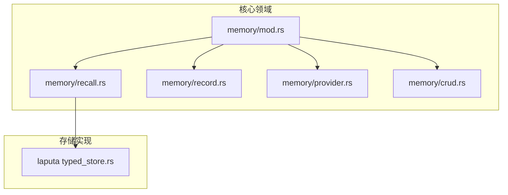
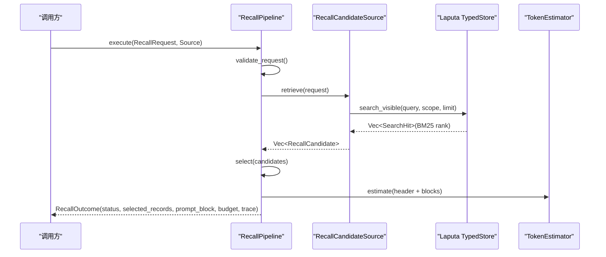
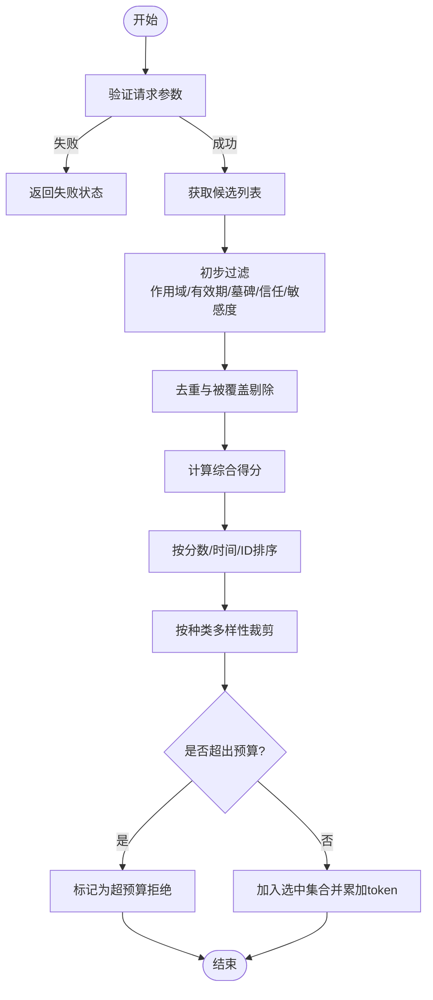
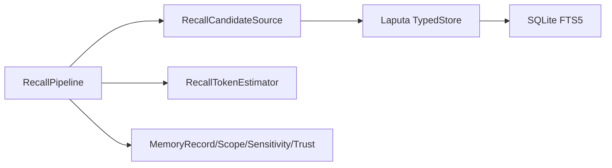

# 记忆检索系统

<cite>
**本文引用的文件**
- [agent-diva-core/src/memory/mod.rs](file://agent-diva-core/src/memory/mod.rs)
- [agent-diva-core/src/memory/recall.rs](file://agent-diva-core/src/memory/recall.rs)
- [agent-diva-core/src/memory/record.rs](file://agent-diva-core/src/memory/record.rs)
- [agent-diva-core/src/memory/provider.rs](file://agent-diva-core/src/memory/provider.rs)
- [agent-diva-core/src/memory/crud.rs](file://agent-diva-core/src/memory/crud.rs)
- [agent-diva-laputa/src/typed_store.rs](file://agent-diva-laputa/src/typed_store.rs)
</cite>

## 目录
1. [简介](#简介)
2. [项目结构](#项目结构)
3. [核心组件](#核心组件)
4. [架构总览](#架构总览)
5. [详细组件分析](#详细组件分析)
6. [依赖关系分析](#依赖关系分析)
7. [性能考虑](#性能考虑)
8. [故障排查指南](#故障排查指南)
9. [结论](#结论)
10. [附录：检索策略与使用示例](#附录：检索策略与使用示例)

## 简介
本文件系统性地梳理并文档化 Agent-Diva 的记忆检索能力，重点围绕 RecallPipeline 的设计与实现、RecallPolicy 的配置与场景化调整、语义搜索的实现机制（基于 SQLite FTS5 的关键词/BM25 检索）、召回预算管理机制，以及可观测性与性能调优建议。目标是帮助读者在不深入源码的情况下理解“如何检索、为何这样选择、以及如何控制成本”。

## 项目结构
记忆模块位于 agent-diva-core 的 memory 子模块中，对外暴露稳定的领域契约；Laputa 提供具体的持久化与检索实现。关键组织方式如下：
- 领域契约与编排：memory/mod.rs 聚合导出 CRUD、Provider、Recall、Record、Working 等子模块类型。
- 检索编排：memory/recall.rs 定义 RecallPipeline、RecallRequest、RecallPolicy、RecallCandidate、RecallOutcome 等，负责候选生成后的评分、去重、多样性、预算控制与输出组装。
- 记录模型：memory/record.rs 定义 MemoryRecord、MemoryScope、MemorySensitivity、MemoryTrust 等稳定数据结构与校验规则。
- Provider 边界：memory/provider.rs 定义启动注入、预取、同步、会话结束等高层交互契约。
- CRUD 接口：memory/crud.rs 定义面向 Agent 的增删改查请求与结果形态。
- 存储与检索实现：agent-diva-laputa/src/typed_store.rs 提供基于 SQLite FTS5 的关键词检索（BM25）与可见性范围查询。

图表来源
- [agent-diva-core/src/memory/mod.rs:1-47](file://agent-diva-core/src/memory/mod.rs#L1-L47)
- [agent-diva-core/src/memory/recall.rs:1-120](file://agent-diva-core/src/memory/recall.rs#L1-L120)
- [agent-diva-core/src/memory/record.rs:1-120](file://agent-diva-core/src/memory/record.rs#L1-L120)
- [agent-diva-core/src/memory/provider.rs:1-120](file://agent-diva-core/src/memory/provider.rs#L1-L120)
- [agent-diva-core/src/memory/crud.rs:1-60](file://agent-diva-core/src/memory/crud.rs#L1-L60)
- [agent-diva-laputa/src/typed_store.rs:1120-1205](file://agent-diva-laputa/src/typed_store.rs#L1120-L1205)

章节来源
- [agent-diva-core/src/memory/mod.rs:1-47](file://agent-diva-core/src/memory/mod.rs#L1-L47)

## 核心组件
- RecallPipeline：无状态编排器，负责从候选源获取候选项，执行筛选、评分、去重、多样性、预算控制与最终提示块组装。
- RecallRequest/RecallPolicy：单次检索的请求与策略配置，包括查询、作用域、审计关联、时间、token 预算、最大候选数、信任与敏感度白名单。
- RecallCandidate/RecallOutcome/RecallTrace：候选项、结果与逐条决策的可审计追踪。
- MemoryRecord/MemoryScope/MemorySensitivity/MemoryTrust：稳定的记录模型与作用域、敏感度、可信度标签。
- Laputa TypedStore：基于 SQLite FTS5 的关键词检索实现，提供精确作用域与可见性范围的 BM25 排序结果。

章节来源
- [agent-diva-core/src/memory/recall.rs:58-156](file://agent-diva-core/src/memory/recall.rs#L58-L156)
- [agent-diva-core/src/memory/record.rs:76-120](file://agent-diva-core/src/memory/record.rs#L76-L120)
- [agent-diva-laputa/src/typed_store.rs:1120-1205](file://agent-diva-laputa/src/typed_store.rs#L1120-L1205)

## 架构总览
下图展示了从调用方到存储层的端到端流程：调用方构造 RecallRequest，通过 RecallPipeline.execute 驱动 RecallCandidateSource 检索候选，再由 Pipeline 进行确定性评分与预算控制，最终产出可选的 prompt_block 与完整 trace。

图表来源
- [agent-diva-core/src/memory/recall.rs:218-359](file://agent-diva-core/src/memory/recall.rs#L218-L359)
- [agent-diva-laputa/src/typed_store.rs:1166-1205](file://agent-diva-laputa/src/typed_store.rs#L1166-L1205)

## 详细组件分析

### RecallPipeline：候选生成、评分与选择策略
- 候选来源抽象：RecallCandidateSource::retrieve 返回标准化候选，屏蔽底层实现差异。
- 初步过滤：依据相关性上限、未知来源、记录有效性、工作区/会话作用域匹配、过期、墓碑、信任与敏感度白名单进行快速拒绝。
- 覆盖关系处理：收集 supersedes 集合，剔除被覆盖的记录。
- 评分与排序：综合相关性、重要性、新鲜度、人格相关度加权得分，并按分数、生效时间、ID 稳定排序。
- 多样性：按记录种类做首次出现保留，避免同质化内容过多。
- 预算控制：估算头部与每条记录的 token 数，累计不超过 token_budget；未达预算则继续追加。
- 输出组装：生成 prompt_block 与包含每条候选决策的 trace，便于审计与调试。

图表来源
- [agent-diva-core/src/memory/recall.rs:236-359](file://agent-diva-core/src/memory/recall.rs#L236-L359)
- [agent-diva-core/src/memory/recall.rs:400-489](file://agent-diva-core/src/memory/recall.rs#L400-L489)
- [agent-diva-core/src/memory/recall.rs:509-583](file://agent-diva-core/src/memory/recall.rs#L509-L583)

章节来源
- [agent-diva-core/src/memory/recall.rs:218-359](file://agent-diva-core/src/memory/recall.rs#L218-L359)
- [agent-diva-core/src/memory/recall.rs:400-489](file://agent-diva-core/src/memory/recall.rs#L400-L489)
- [agent-diva-core/src/memory/recall.rs:509-583](file://agent-diva-core/src/memory/recall.rs#L509-L583)

### RecallPolicy：配置选项与场景化调整
- allowed_trust：允许进入本次检索的信任等级集合，默认仅允许已应用权威级别，防止低可信数据污染上下文。
- allowed_sensitivity：允许进入本次检索的敏感度等级集合，默认包含公共、内部、私有，排除受限等敏感级别。
- 场景建议：
  - 强安全场景：收紧 allowed_trust 与 allowed_sensitivity，减少误注入风险。
  - 探索/调试场景：放宽敏感度以观察更多候选，但需配合严格的作用域与审计。
  - 多租户隔离：通过 RecallRequest.scope 限定 tenant/workspace/session，确保跨租户不可见。

章节来源
- [agent-diva-core/src/memory/recall.rs:37-56](file://agent-diva-core/src/memory/recall.rs#L37-L56)
- [agent-diva-core/src/memory/recall.rs:509-583](file://agent-diva-core/src/memory/recall.rs#L509-L583)

### 语义搜索实现机制：向量检索与关键词匹配
- 当前实现：基于 SQLite FTS5 的关键词/BM25 检索，支持精确作用域与可见性范围查询，返回带 BM25 排名的候选。
- 向量检索：代码库中未发现内置向量嵌入与相似度检索实现；历史研究文档提及过混合检索方案，但当前生产路径以 FTS5 为主。
- 适用性：FTS5 对中英文关键词匹配具备基线质量，适合短查询与明确意图；长查询或模糊语义可通过上层评分与多样性缓解。

章节来源
- [agent-diva-laputa/src/typed_store.rs:1120-1205](file://agent-diva-laputa/src/typed_store.rs#L1120-L1205)
- [agent-diva-core/src/memory/recall.rs:25-35](file://agent-diva-core/src/memory/recall.rs#L25-L35)

### 召回预算管理机制：控制检索成本
- 预算单位：token 数量，由 RecallRequest.token_budget 指定。
- 估算策略：使用保守 Unicode 估算器估计头部与每条记录渲染后的 token 数，避免低估导致溢出。
- 控制逻辑：按顺序累加，若加入下一条会超过预算则拒绝该候选，保证不截断已选中的记录。
- 可观测性：RecallBudgetUsage 报告预算、已用、选中与拒绝计数；RecallTrace 记录每条候选的决策与估计 token。

章节来源
- [agent-diva-core/src/memory/recall.rs:138-156](file://agent-diva-core/src/memory/recall.rs#L138-L156)
- [agent-diva-core/src/memory/recall.rs:199-212](file://agent-diva-core/src/memory/recall.rs#L199-L212)
- [agent-diva-core/src/memory/recall.rs:309-359](file://agent-diva-core/src/memory/recall.rs#L309-L359)

### 记录模型与校验：MemoryRecord 与约束
- 关键字段：id、kind、content、provenance、confidence_bps、sensitivity、trust、scope、时间戳、supersedes、tombstone。
- 校验要点：必填字段、置信度范围、时间一致性、过期、墓碑、作用域一致性、内容摘要匹配等。
- 用途：作为 RecallPipeline 的输入基础，确保后续评分与渲染的安全性与稳定性。

章节来源
- [agent-diva-core/src/memory/record.rs:103-120](file://agent-diva-core/src/memory/record.rs#L103-L120)
- [agent-diva-core/src/memory/record.rs:193-200](file://agent-diva-core/src/memory/record.rs#L193-L200)

## 依赖关系分析
- RecallPipeline 依赖：
  - RecallCandidateSource：解耦候选来源，便于替换不同后端。
  - RecallTokenEstimator：可插拔 token 估算器，默认保守估算。
  - MemoryRecord/Scope/Sensitivity/Trust：用于过滤与评分。
- Laputa TypedStore 依赖：
  - SQLite FTS5：提供关键词匹配与 BM25 排名。
  - 作用域过滤：tenant/workspace/session 精确匹配或可见性范围。

图表来源
- [agent-diva-core/src/memory/recall.rs:190-212](file://agent-diva-core/src/memory/recall.rs#L190-L212)
- [agent-diva-laputa/src/typed_store.rs:1120-1205](file://agent-diva-laputa/src/typed_store.rs#L1120-L1205)

章节来源
- [agent-diva-core/src/memory/recall.rs:190-212](file://agent-diva-core/src/memory/recall.rs#L190-L212)
- [agent-diva-laputa/src/typed_store.rs:1120-1205](file://agent-diva-laputa/src/typed_store.rs#L1120-L1205)

## 性能考虑
- 检索层：
  - 限制 limit：search/search_visible 将 limit 上限控制在合理范围，避免过大结果集。
  - 作用域过滤：在 SQL 层尽早过滤 tenant/workspace/session，降低扫描范围。
- 评分与预算：
  - 先过滤后评分：无效、过期、墓碑、作用域不匹配等快速拒绝，减少后续开销。
  - 多样性裁剪：避免重复种类占用预算。
  - 保守 token 估算：防止低估导致的上下文溢出。
- 可观测性：
  - 使用 RecallTrace 与 RecallBudgetUsage 监控命中率、拒绝原因分布与预算使用情况。
  - 对比旧版与新版 prompt_block 的 digest 与 token 估算，评估变更影响。

[本节为通用指导，无需特定文件引用]

## 故障排查指南
- 常见错误分类：
  - 请求校验失败：缺少必填字段、max_candidates 非法、策略包含未知信任/敏感度。
  - 检索不可用：候选源异常时降级为空结果，状态为 Degraded。
  - 记录无效：相关性超限、未知来源、记录校验失败。
  - 作用域不匹配：租户/工作区/会话不一致。
  - 过期/墓碑/被覆盖：按策略拒绝。
  - 预算不足：无法容纳下一条记录。
- 定位方法：
  - 检查 RecallOutcome.trace 中每条候选的 decision 与 reason。
  - 核对 RecallPolicy.allowed_trust/allowed_sensitivity 与记录标签。
  - 确认 RecallRequest.scope 与记录 scope 一致。
  - 查看预算使用与估计 token，必要时提高 token_budget 或优化候选大小。

章节来源
- [agent-diva-core/src/memory/recall.rs:171-188](file://agent-diva-core/src/memory/recall.rs#L171-L188)
- [agent-diva-core/src/memory/recall.rs:218-234](file://agent-diva-core/src/memory/recall.rs#L218-L234)
- [agent-diva-core/src/memory/recall.rs:509-583](file://agent-diva-core/src/memory/recall.rs#L509-L583)

## 结论
RecallPipeline 提供了确定性强、可审计、可控成本的记忆检索编排能力。其通过严格的请求校验、作用域与权限过滤、多维度评分、多样性与预算控制，确保注入上下文的准确性与安全性。当前语义搜索以 SQLite FTS5 关键词/BM25 为主，满足大多数场景需求；未来如需更强语义匹配，可在保持现有 Pipeline 不变的前提下扩展候选来源。

[本节为总结性内容，无需特定文件引用]

## 附录：检索策略与使用示例
以下示例展示如何根据场景调整 RecallRequest 与 RecallPolicy，并通过 provider 契约完成一次检索。注意：以下为概念性步骤，具体实现细节请参考对应文件路径。

- 示例一：最小权限注入
  - 目标：仅注入高可信、非受限的内容。
  - 配置：RecallPolicy.default_prompt()，RecallRequest.scope 限定租户与工作区。
  - 预期：多数低可信或受限记录被拒绝，trace 中可见 TrustDenied/SensitivityDenied。
  - 参考路径
    - [agent-diva-core/src/memory/recall.rs:37-56](file://agent-diva-core/src/memory/recall.rs#L37-L56)
    - [agent-diva-core/src/memory/recall.rs:509-583](file://agent-diva-core/src/memory/recall.rs#L509-L583)

- 示例二：会话内精准检索
  - 目标：仅检索当前会话相关的记忆。
  - 配置：RecallRequest.scope.session_id 设置为当前会话 ID。
  - 预期：跨会话记录因 SessionMismatch 被拒绝。
  - 参考路径
    - [agent-diva-core/src/memory/recall.rs:532-583](file://agent-diva-core/src/memory/recall.rs#L532-L583)
    - [agent-diva-laputa/src/typed_store.rs:1120-1160](file://agent-diva-laputa/src/typed_store.rs#L1120-L1160)

- 示例三：宽松探索模式
  - 目标：扩大敏感度范围以观察更多候选。
  - 配置：RecallPolicy.allowed_sensitivity 包含更宽泛级别，结合审计跟踪。
  - 预期：更多候选进入评分阶段，trace 中可见更多 Selected/Rejected 原因。
  - 参考路径
    - [agent-diva-core/src/memory/recall.rs:37-56](file://agent-diva-core/src/memory/recall.rs#L37-L56)
    - [agent-diva-core/src/memory/recall.rs:309-359](file://agent-diva-core/src/memory/recall.rs#L309-L359)

- 示例四：预算受限场景
  - 目标：严格控制 token 使用。
  - 配置：设置较小的 token_budget，观察预算耗尽时的拒绝原因 OverBudget。
  - 预期：仅高优先级且体积小的记录被选中。
  - 参考路径
    - [agent-diva-core/src/memory/recall.rs:138-156](file://agent-diva-core/src/memory/recall.rs#L138-L156)
    - [agent-diva-core/src/memory/recall.rs:309-359](file://agent-diva-core/src/memory/recall.rs#L309-L359)

- 示例五：结合 Provider 预取
  - 目标：在对话前预取可能需要的记忆。
  - 配置：调用 Provider 的预取入口，传入工作区与意图，获得可选 prompt_block。
  - 预期：若检索不可用则返回 Skipped/Failed，不影响主流程。
  - 参考路径
    - [agent-diva-core/src/memory/provider.rs:77-86](file://agent-diva-core/src/memory/provider.rs#L77-L86)
    - [agent-diva-core/src/memory/provider.rs:127-180](file://agent-diva-core/src/memory/provider.rs#L127-L180)