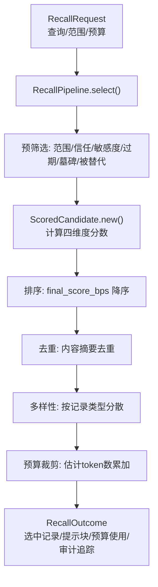
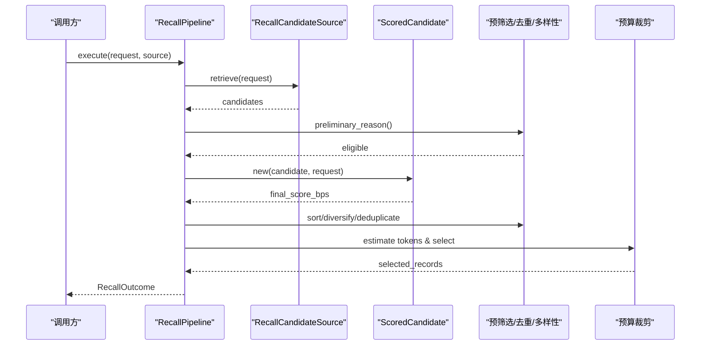
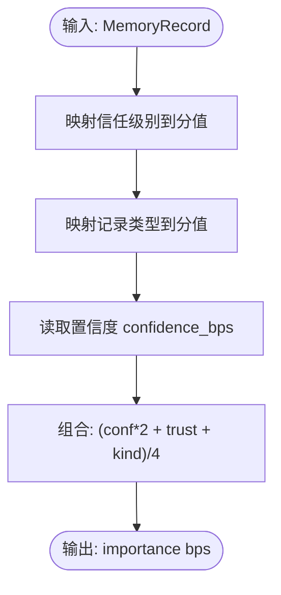
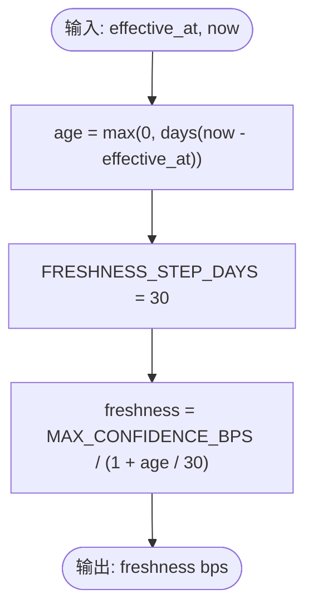
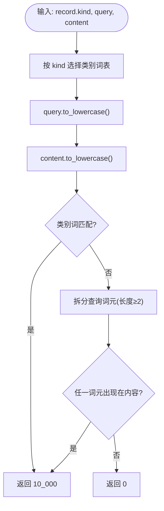
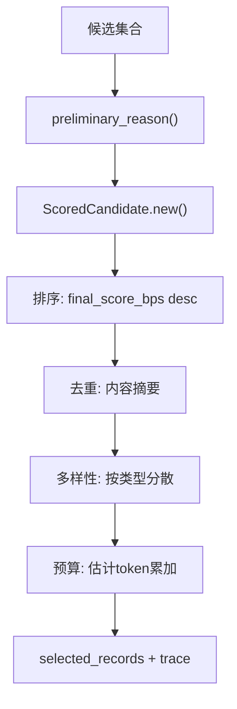
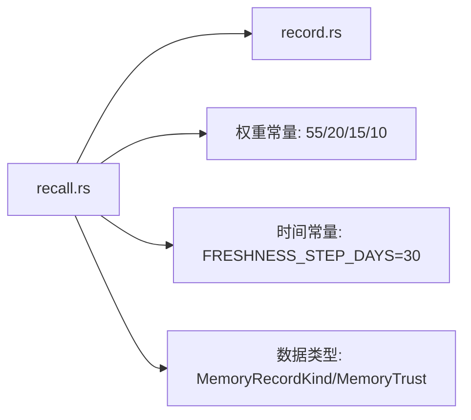

# 评分算法

<cite>
**本文引用的文件**
- [recall.rs](file://agent-diva-core/src/memory/recall.rs)
- [record.rs](file://agent-diva-core/src/memory/record.rs)
</cite>

## 目录
1. [简介](#简介)
2. [项目结构](#项目结构)
3. [核心组件](#核心组件)
4. [架构总览](#架构总览)
5. [详细组件分析](#详细组件分析)
6. [依赖关系分析](#依赖关系分析)
7. [性能考量](#性能考量)
8. [故障排查指南](#故障排查指南)
9. [结论](#结论)
10. [附录](#附录)

## 简介
本文件系统性说明 Agent-Diva 记忆召回管线中的评分算法，重点解释 ScoredCandidate 的加权评分机制，包括相关性分数、重要性分数、新鲜度分数与人设相关性的计算方式；阐述权重配置 SCORE_RELEVANCE_WEIGHT(55)、SCORE_IMPORTANCE_WEIGHT(20)、SCORE_FRESHNESS_WEIGHT(15)、SCORE_PERSONA_WEIGHT(10)的设计原理；详解 derived_importance_bps 与 persona_relevance_bps 的实现逻辑；并提供调优指南与效果评估方法。

## 项目结构
评分算法位于 agent-diva-core 的记忆模块中，核心实现集中在 recall.rs，数据结构定义在 record.rs。整体流程为：召回候选 → 预筛选（范围、信任、敏感度、过期等）→ 计算综合得分 → 去重与多样性打散 → 按预算选择并输出结果与审计追踪。

图表来源
- [recall.rs:237-359](file://agent-diva-core/src/memory/recall.rs#L237-L359)

章节来源
- [recall.rs:1-120](file://agent-diva-core/src/memory/recall.rs#L1-L120)
- [record.rs:1-120](file://agent-diva-core/src/memory/record.rs#L1-L120)

## 核心组件
- RecallRequest：一次召回请求，包含查询文本、作用域、审计关联、当前时间、token预算、最大候选数、策略。
- RecallCandidate：候选项，包含原始记录、相关性分数 relevance_bps、检索来源。
- ScoredCandidate：内部评分包装，计算 final_score_bps 用于排序。
- RecallPipeline：编排选择流程，含预筛选、评分、去重、多样性、预算控制。
- MemoryRecord/MemoryRecordKind/MemoryTrust：记录类型、信任级别等基础数据模型。

章节来源
- [recall.rs:58-156](file://agent-diva-core/src/memory/recall.rs#L58-L156)
- [record.rs:14-120](file://agent-diva-core/src/memory/record.rs#L14-L120)

## 架构总览
评分算法是召回管线的一部分，负责将“相关性”与其他维度融合为单一可排序分数，确保结果既与查询相关，又兼顾重要性与时效性，同时考虑人设相关关键词匹配，并在预算内输出多样化结果。

图表来源
- [recall.rs:218-359](file://agent-diva-core/src/memory/recall.rs#L218-L359)

## 详细组件分析

### ScoredCandidate 评分机制
ScoredCandidate 在构造时计算四个维度的分数，并以固定权重线性加权得到最终分数：
- 相关性分数 relevance_bps：来自候选项本身，表示该记录与查询的相关程度。
- 重要性分数 importance：由 derived_importance_bps 计算，基于记录的置信度、信任级别与记录类型。
- 新鲜度分数 freshness：根据记录生效时间与当前时间的天数差，按步长衰减计算。
- 人设相关性 persona：由 persona_relevance_bps 计算，基于记录类型与查询关键词匹配。

加权公式（整数运算，单位统一为基点 bps）：
final_score_bps = (relevance_bps × 55 + importance × 20 + freshness × 15 + persona × 10) / 100

设计要点：
- 相关性占主导（55%），确保最相关的记录优先。
- 重要性次之（20%），保证高可信、高价值内容不被忽略。
- 新鲜度（15%）鼓励近期有效信息进入上下文。
- 人设相关性（10%）在特定查询下提升身份/关系/偏好类内容的可见性。

章节来源
- [recall.rs:400-425](file://agent-diva-core/src/memory/recall.rs#L400-L425)
- [recall.rs:413-423](file://agent-diva-core/src/memory/recall.rs#L413-L423)

### 权重配置与设计原理
- SCORE_RELEVANCE_WEIGHT=55：强调语义相关性，避免无关但“重要/新鲜”的内容干扰。
- SCORE_IMPORTANCE_WEIGHT=20：通过信任与类型加权，保障关键事实与长期知识优先。
- SCORE_FRESHNESS_WEIGHT=15：以30天为步长的分段衰减，平衡时效与稳定性。
- SCORE_PERSONA_WEIGHT=10：在涉及身份、关系、偏好的查询中给予额外加分，增强个性化体验。

这些权重共同构成一个稳定、可解释、可调试的打分体系，便于在不同场景下微调。

章节来源
- [recall.rs:18-22](file://agent-diva-core/src/memory/recall.rs#L18-L22)

### 重要性分数 derived_importance_bps
derived_importance_bps 将三个因素融合为一个重要性分数：
- 信任级别 trust：AppliedAuthority > UserAsserted > Observed > Inferred > Untrusted/Unknown。
- 记录类型 kind：Identity/Relationship/Commitment/Preference 最高，LongTerm/Learning 次之，History/Daily/Weekly/Monthly/Journal/SessionCheckpoint 再次，Unknown 最低。
- 置信度 confidence_bps：直接参与计算，体现对内容确定性的量化。

计算公式（bps 为单位）：
importance = (confidence_bps × 2 + trust_value + kind_value) / 4

其中 trust_value 与 kind_value 为映射到固定分档的整数值，确保不同来源的记录可在同一尺度比较。

图表来源
- [recall.rs:427-450](file://agent-diva-core/src/memory/recall.rs#L427-L450)

章节来源
- [recall.rs:427-450](file://agent-diva-core/src/memory/recall.rs#L427-L450)
- [record.rs:63-74](file://agent-diva-core/src/memory/record.rs#L63-L74)
- [record.rs:14-33](file://agent-diva-core/src/memory/record.rs#L14-L33)

### 新鲜度分数 freshness
freshness 基于 effective_at 与当前时间 now 的天数差 age，按固定步长 FRESHNESS_STEP_DAYS=30 进行分段衰减：
- age=0 时，freshness 接近最大值 MAX_CONFIDENCE_BPS。
- 随着 age 增加，分母增大，分数逐步下降。
- 该函数确保较新的记录更容易获得较高分数，但不会无限放大短期波动。

图表来源
- [recall.rs:408-414](file://agent-diva-core/src/memory/recall.rs#L408-L414)

章节来源
- [recall.rs:18-23](file://agent-diva-core/src/memory/recall.rs#L18-L23)
- [record.rs:11-12](file://agent-diva-core/src/memory/record.rs#L11-L12)

### 人设相关性 persona_relevance_bps
persona_relevance_bps 针对 Identity、Relationship、Preference 三类记录，结合查询关键词与记录内容进行匹配：
- 类别词匹配：若查询包含对应类别的关键术语（如 identity/persona/name/身份/人格/名字 等），则返回满分。
- 内容词匹配：将查询拆分为长度≥2的词元，若在记录内容中出现任一匹配，也返回满分。
- 否则返回 0。

该函数提供“硬阈值”的人设相关加分，使特定查询能更可靠地命中身份/关系/偏好类记忆。

图表来源
- [recall.rs:452-473](file://agent-diva-core/src/memory/recall.rs#L452-L473)

章节来源
- [recall.rs:452-473](file://agent-diva-core/src/memory/recall.rs#L452-L473)

### 评分与排序流程
- 预筛选：检查有效性、作用域、会话、过期、墓碑、信任与敏感度策略。
- 评分：ScoredCandidate.new 计算 final_score_bps。
- 排序：按 final_score_bps 降序，同分再按 effective_at 与 id 稳定排序。
- 去重：基于内容摘要去重，保留首次出现者。
- 多样性：按记录类型分散，避免同一类型过多。
- 预算：估计 token 数，按预算裁剪。

图表来源
- [recall.rs:237-359](file://agent-diva-core/src/memory/recall.rs#L237-L359)
- [recall.rs:585-597](file://agent-diva-core/src/memory/recall.rs#L585-L597)

章节来源
- [recall.rs:509-583](file://agent-diva-core/src/memory/recall.rs#L509-L583)
- [recall.rs:585-597](file://agent-diva-core/src/memory/recall.rs#L585-L597)

## 依赖关系分析
- recall.rs 依赖 record.rs 的数据模型（MemoryRecord、MemoryRecordKind、MemoryTrust、MAX_CONFIDENCE_BPS）。
- 评分函数仅依赖静态常量与输入字段，无外部状态，保证确定性。
- 管道阶段相互解耦：预筛选、评分、去重、多样性、预算各自独立，便于测试与替换。

图表来源
- [recall.rs:1-23](file://agent-diva-core/src/memory/recall.rs#L1-L23)
- [record.rs:11-33](file://agent-diva-core/src/memory/record.rs#L11-L33)

章节来源
- [recall.rs:1-23](file://agent-diva-core/src/memory/recall.rs#L1-L23)
- [record.rs:11-33](file://agent-diva-core/src/memory/record.rs#L11-L33)

## 性能考量
- 评分函数均为 O(1) 或 O(n) 线性操作，n 为候选数量。
- 去重使用内容摘要哈希，避免重复渲染。
- 多样性通过集合跟踪已见类型，常数时间插入与判断。
- 预算估算采用保守 Unicode 估计，避免过度占用上下文。

优化建议：
- 在高吞吐场景下，可将 token 估算器替换为更精确的提供者 tokenizer。
- 对大规模候选集，可在检索阶段提前限制候选数量，减少后续处理成本。

[本节为通用指导，不直接分析具体文件]

## 故障排查指南
常见问题与定位方法：
- 相关性异常：检查 candidate.relevance_bps 是否超出 MAX_CONFIDENCE_BPS，或被标记为 Unknown 来源。
- 重要性偏低：确认 MemoryTrust 与 MemoryRecordKind 是否正确设置；confidence_bps 是否在合理范围。
- 新鲜度不足：核对 effective_at 与 now 的时间差；调整 FRESHNESS_STEP_DAYS 或权重。
- 人设相关性未命中：检查查询是否包含类别词或内容词；必要时扩展类别词表。
- 预算不足：查看 estimated_tokens 与 budget 使用情况；减少候选或降低权重。

章节来源
- [recall.rs:509-583](file://agent-diva-core/src/memory/recall.rs#L509-L583)
- [recall.rs:599-643](file://agent-diva-core/src/memory/recall.rs#L599-L643)

## 结论
该评分算法以相关性为核心，结合重要性、新鲜度与人设相关性，形成稳定、可解释、可调试的综合打分体系。通过明确的权重与函数实现，能够在不同业务场景下灵活调优，并通过审计追踪与预算控制保障系统可靠性与用户体验。

[本节为总结，不直接分析具体文件]

## 附录

### 调优指南
- 调整权重：
  - 提高相关性权重（如 60）以强化语义匹配。
  - 提高重要性权重（如 25）以突出高可信/高价值内容。
  - 提高新鲜度权重（如 20）以增强时效性。
  - 提高人设权重（如 15）以增强个性化。
- 调整新鲜度步长：
  - 缩短步长（如 15 天）以更快衰减旧内容。
  - 延长步长（如 60 天）以保持长期内容可见性。
- 扩展人设关键词：
  - 在 persona_relevance_bps 中增加更多类别词或语言变体。
- 验证与回归：
  - 使用单元测试覆盖典型场景（新近、重要、人设相关、过期、墓碑、被替代、重复、超预算）。
  - 对比历史结果，确保变更不破坏稳定性。

章节来源
- [recall.rs:18-23](file://agent-diva-core/src/memory/recall.rs#L18-L23)
- [recall.rs:408-473](file://agent-diva-core/src/memory/recall.rs#L408-L473)

### 效果评估方法
- 指标：
  - 命中率：查询命中目标记录的比例。
  - NDCG：排序质量评估。
  - 预算利用率：used_tokens/budget_tokens。
  - 多样性指数：不同类型记录占比。
- 实验：
  - 构建测试集：包含身份、关系、偏好、长期、历史等类型记录。
  - 多组权重对比：A/B 测试不同权重组合的效果。
  - 时间窗口分析：评估新鲜度衰减对不同时段内容的影响。
- 工具：
  - 利用 RecallOutcome.trace 分析每个候选的决策原因与分数。
  - 使用 compare_recall_shadow 对比新旧版本差异。

章节来源
- [recall.rs:147-169](file://agent-diva-core/src/memory/recall.rs#L147-L169)
- [recall.rs:362-392](file://agent-diva-core/src/memory/recall.rs#L362-L392)