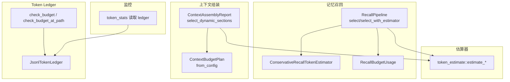
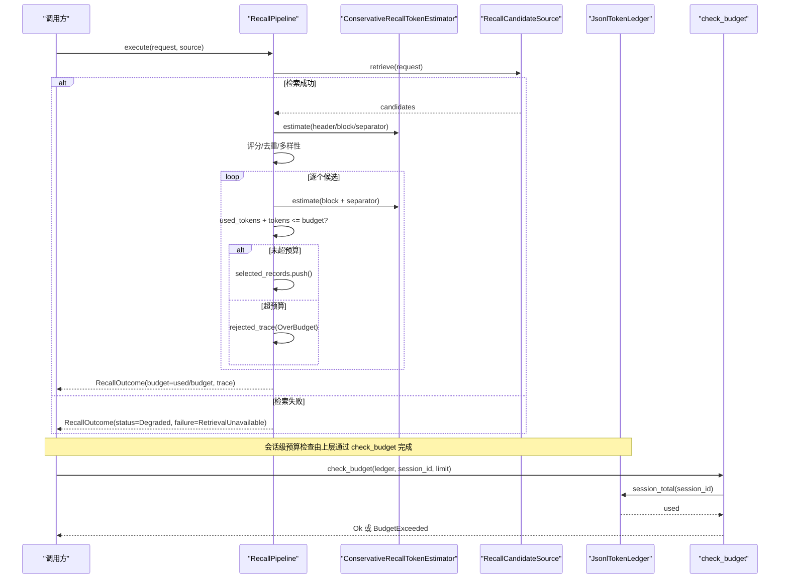
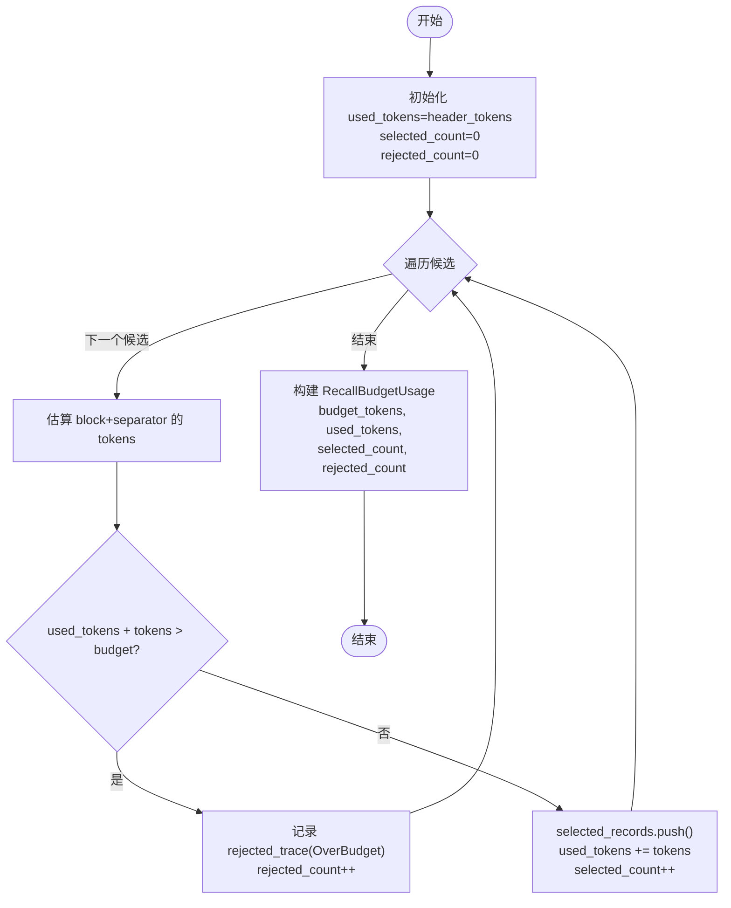
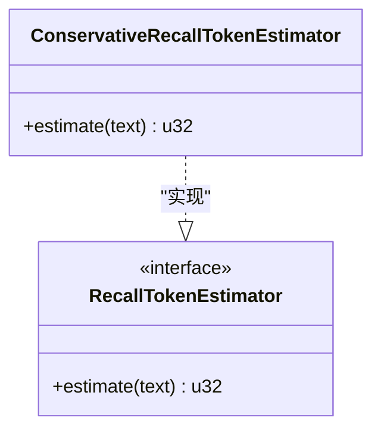
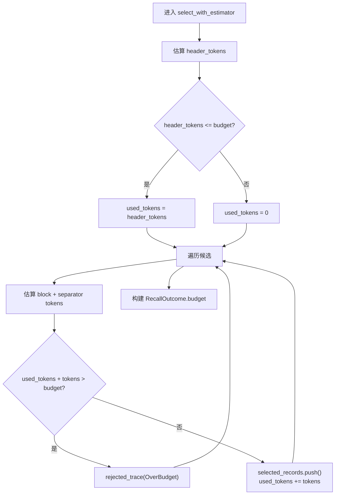
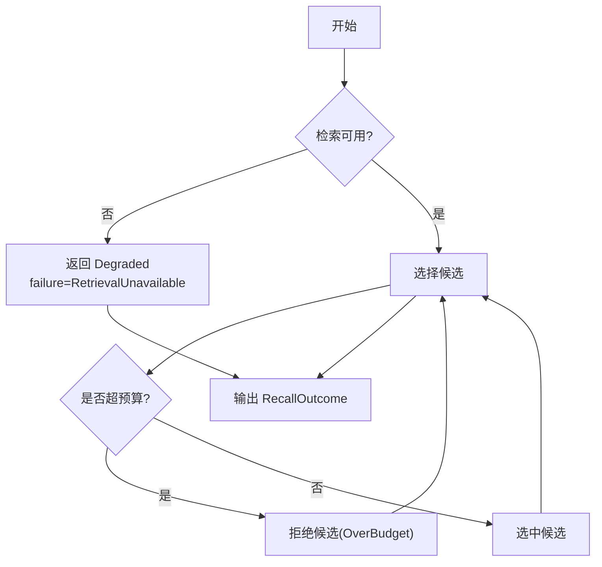
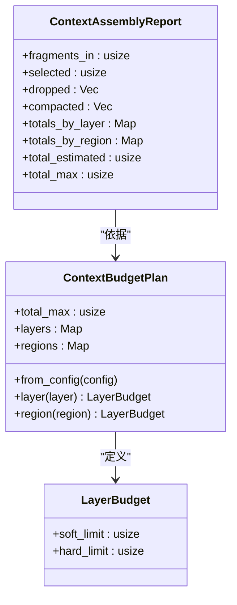
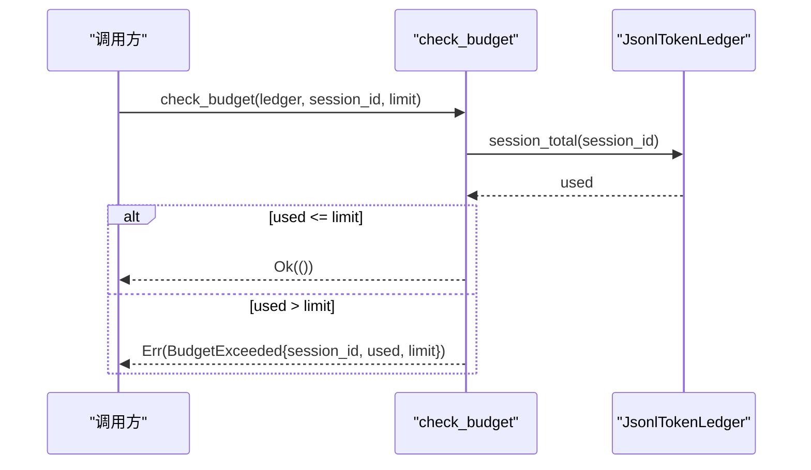
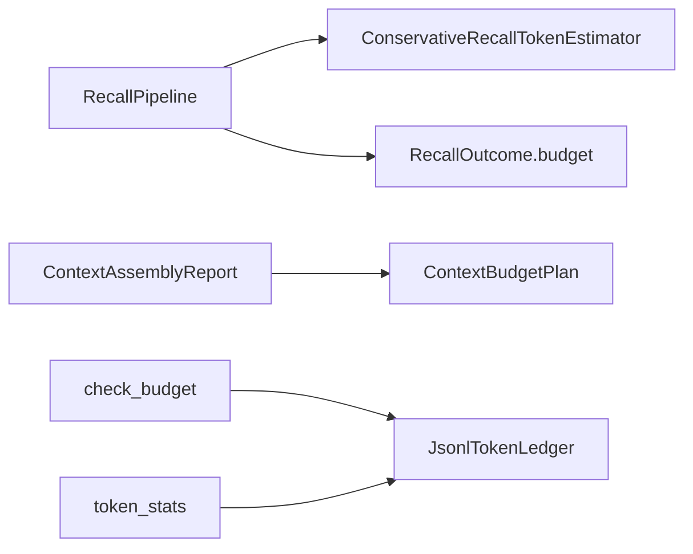

# 预算管理

<cite>
**本文引用的文件**
- [agent-diva-core/src/memory/recall.rs](file://agent-diva-core/src/memory/recall.rs)
- [agent-diva-core/src/token_ledger/budget.rs](file://agent-diva-core/src/token_ledger/budget.rs)
- [agent-diva-core/src/token_ledger/store.rs](file://agent-diva-core/src/token_ledger/store.rs)
- [agent-diva-agent/src/context_assembly/budget.rs](file://agent-diva-agent/src/context_assembly/budget.rs)
- [agent-diva-agent/src/context_budget.rs](file://agent-diva-agent/src/context_budget.rs)
- [agent-diva-agent/src/token_estimate.rs](file://agent-diva-agent/src/token_estimate.rs)
- [agent-diva-core/src/quality/context_budget.rs](file://agent-diva-core/src/quality/context_budget.rs)
- [agent-diva-manager/src/handlers/token_stats.rs](file://agent-diva-manager/src/handlers/token_stats.rs)
</cite>

## 目录
1. [简介](#简介)
2. [项目结构](#项目结构)
3. [核心组件](#核心组件)
4. [架构总览](#架构总览)
5. [详细组件分析](#详细组件分析)
6. [依赖关系分析](#依赖关系分析)
7. [性能考量](#性能考量)
8. [故障排查指南](#故障排查指南)
9. [结论](#结论)
10. [附录](#附录)

## 简介
本文件围绕“预算管理”主题，系统性梳理并解释以下关键能力：
- RecallBudgetUsage 的设计与实现：预算分配、使用跟踪与剩余预算计算。
- ConservativeRecallTokenEstimator 的工作原理：面向 Unicode 文本的保守 token 估算策略。
- 预算检查机制：在添加新候选项时如何验证是否超出预算限制。
- 预算超出的处理策略：候选项拒绝与回退机制。
- 预算配置最佳实践：不同场景下的预算设置建议。
- 预算监控与性能分析方法：基于 Token Ledger 的统计与可视化。

## 项目结构
预算管理涉及多个模块协同工作：
- 记忆召回管线（Recall v2）负责按预算选择候选记录，输出 RecallBudgetUsage。
- Token Ledger 提供持久化的 token 使用记录与预算校验。
- 上下文组装层对消息、工具定义等片段进行分层预算控制与丢弃/压缩决策。
- 估算器提供快速、Unicode 安全的 token 估算。
- 质量策略提供溢出动作（警告、截断、阻断、合并）。
- 管理器提供 token 用量统计接口，便于监控与性能分析。

图表来源
- [agent-diva-core/src/memory/recall.rs:218-359](file://agent-diva-core/src/memory/recall.rs#L218-L359)
- [agent-diva-agent/src/context_assembly/budget.rs:119-178](file://agent-diva-agent/src/context_assembly/budget.rs#L119-L178)
- [agent-diva-core/src/token_ledger/budget.rs:23-64](file://agent-diva-core/src/token_ledger/budget.rs#L23-L64)
- [agent-diva-agent/src/token_estimate.rs:39-81](file://agent-diva-agent/src/token_estimate.rs#L39-L81)
- [agent-diva-manager/src/handlers/token_stats.rs:124-142](file://agent-diva-manager/src/handlers/token_stats.rs#L124-L142)

章节来源
- [agent-diva-core/src/memory/recall.rs:218-359](file://agent-diva-core/src/memory/recall.rs#L218-L359)
- [agent-diva-agent/src/context_assembly/budget.rs:119-178](file://agent-diva-agent/src/context_assembly/budget.rs#L119-L178)
- [agent-diva-core/src/token_ledger/budget.rs:23-64](file://agent-diva-core/src/token_ledger/budget.rs#L23-L64)
- [agent-diva-agent/src/token_estimate.rs:39-81](file://agent-diva-agent/src/token_estimate.rs#L39-L81)
- [agent-diva-manager/src/handlers/token_stats.rs:124-142](file://agent-diva-manager/src/handlers/token_stats.rs#L124-L142)

## 核心组件
- RecallBudgetUsage：描述一次召回执行的预算使用情况，包括预算总量、已用 token、选中与拒绝数量。
- ConservativeRecallTokenEstimator：默认保守的 Unicode token 估算器，采用 ceil(chars/3)。
- RecallPipeline：执行召回请求，进行筛选、评分、去重、多样性、预算检查，产出结果与预算使用报告。
- ContextBudgetPlan：将全局最大 token 拆分为各层与区域的软/硬限制，指导上下文组装时的取舍。
- JsonlTokenLedger 与 check_budget：持久化 token 使用记录并提供会话级预算检查。
- OverflowAction：上下文溢出策略（警告、截断、阻断、合并）。

章节来源
- [agent-diva-core/src/memory/recall.rs:138-156](file://agent-diva-core/src/memory/recall.rs#L138-L156)
- [agent-diva-core/src/memory/recall.rs:199-212](file://agent-diva-core/src/memory/recall.rs#L199-L212)
- [agent-diva-core/src/memory/recall.rs:218-359](file://agent-diva-core/src/memory/recall.rs#L218-L359)
- [agent-diva-agent/src/context_assembly/budget.rs:111-178](file://agent-diva-agent/src/context_assembly/budget.rs#L111-L178)
- [agent-diva-core/src/token_ledger/budget.rs:23-64](file://agent-diva-core/src/token_ledger/budget.rs#L23-L64)
- [agent-diva-core/src/quality/context_budget.rs:8-20](file://agent-diva-core/src/quality/context_budget.rs#L8-L20)

## 架构总览
下图展示从请求到最终输出的完整流程，包含预算估算、候选项选择、预算检查与回退路径。

图表来源
- [agent-diva-core/src/memory/recall.rs:218-359](file://agent-diva-core/src/memory/recall.rs#L218-L359)
- [agent-diva-core/src/token_ledger/budget.rs:23-64](file://agent-diva-core/src/token_ledger/budget.rs#L23-L64)
- [agent-diva-core/src/token_ledger/store.rs:182-190](file://agent-diva-core/src/token_ledger/store.rs#L182-L190)

## 详细组件分析

### RecallBudgetUsage：预算分配、使用跟踪与剩余预算计算
- 预算分配：RecallRequest.token_budget 作为本次召回可使用的上限；头部提示块也计入预算。
- 使用跟踪：每次选中候选会累加其 block 与分隔符的估算 token；rejected_count 与 selected_count 来自 trace 统计。
- 剩余预算计算：剩余 = budget_tokens - used_tokens；当 selected_count == 0 时 used_tokens 强制为 0，避免误报。

图表来源
- [agent-diva-core/src/memory/recall.rs:309-359](file://agent-diva-core/src/memory/recall.rs#L309-L359)

章节来源
- [agent-diva-core/src/memory/recall.rs:138-156](file://agent-diva-core/src/memory/recall.rs#L138-L156)
- [agent-diva-core/src/memory/recall.rs:309-359](file://agent-diva-core/src/memory/recall.rs#L309-L359)

### ConservativeRecallTokenEstimator：Unicode 文本的保守 token 估算策略
- 策略：ceil(chars/3)，即字符数除以 3 向上取整。
- Unicode 安全：使用 chars().count() 正确计数多字节字符。
- 保守性：相比实际 tokenizer，通常高估，有助于避免上下文溢出。
- 适用场景：Recall v2 默认估算器，直到接入 provider tokenizer。

图表来源
- [agent-diva-core/src/memory/recall.rs:199-212](file://agent-diva-core/src/memory/recall.rs#L199-L212)
- [agent-diva-core/src/memory/recall.rs:394-398](file://agent-diva-core/src/memory/recall.rs#L394-L398)

章节来源
- [agent-diva-core/src/memory/recall.rs:199-212](file://agent-diva-core/src/memory/recall.rs#L199-L212)
- [agent-diva-core/src/memory/recall.rs:394-398](file://agent-diva-core/src/memory/recall.rs#L394-L398)

### 预算检查机制：添加新候选项时的预算验证
- 头部提示块优先占用预算；若 header_tokens > budget，则 header 不计入。
- 每个候选的 block 与分隔符（首个无分隔符）分别估算；累计 used_tokens。
- 若 used_tokens + tokens > budget，则拒绝该候选并记录原因 OverBudget。
- 最终输出中 selected_count 与 rejected_count 来自 trace，用于审计与监控。

图表来源
- [agent-diva-core/src/memory/recall.rs:309-359](file://agent-diva-core/src/memory/recall.rs#L309-L359)

章节来源
- [agent-diva-core/src/memory/recall.rs:309-359](file://agent-diva-core/src/memory/recall.rs#L309-L359)

### 预算超出的处理策略：候选项拒绝与回退机制
- 候选项拒绝：当新增候选导致超预算，直接拒绝并记录 OverBudget。
- 检索不可用回退：若检索失败，返回状态 Degraded，failure=RetrievalUnavailable，且预算使用为 0。
- 上下文组装回退：根据 EvictionPolicy 与层/区域限制，动态丢弃或压缩低优先级片段（如 PrefetchRecall 优先被丢弃）。
- 会话级预算阻断：check_budget 若发现累积使用超过限额，返回致命错误，阻止后续操作。

图表来源
- [agent-diva-core/src/memory/recall.rs:218-234](file://agent-diva-core/src/memory/recall.rs#L218-L234)
- [agent-diva-core/src/memory/recall.rs:309-359](file://agent-diva-core/src/memory/recall.rs#L309-L359)
- [agent-diva-agent/src/context_assembly/budget.rs:230-285](file://agent-diva-agent/src/context_assembly/budget.rs#L230-L285)
- [agent-diva-core/src/token_ledger/budget.rs:23-64](file://agent-diva-core/src/token_ledger/budget.rs#L23-L64)

章节来源
- [agent-diva-core/src/memory/recall.rs:218-234](file://agent-diva-core/src/memory/recall.rs#L218-L234)
- [agent-diva-core/src/memory/recall.rs:309-359](file://agent-diva-core/src/memory/recall.rs#L309-L359)
- [agent-diva-agent/src/context_assembly/budget.rs:230-285](file://agent-diva-agent/src/context_assembly/budget.rs#L230-L285)
- [agent-diva-core/src/token_ledger/budget.rs:23-64](file://agent-diva-core/src/token_ledger/budget.rs#L23-L64)

### 上下文组装预算：分层与区域控制
- 分层预算：系统规则、工具定义、索引、会话检查点、召回摘要、历史、工具结果、当前轮等各自有软/硬限制。
- 区域预算：稳定前缀、规范检查点、活跃尾部三个顶层区域分别限制。
- 丢弃策略：PrefetchRecall 在压力下优先丢弃；历史可压缩；当前轮与稳定前缀不丢弃。
- 报告：ContextAssemblyReport 记录选中、丢弃、压缩及按层/区域汇总。

图表来源
- [agent-diva-agent/src/context_assembly/budget.rs:111-178](file://agent-diva-agent/src/context_assembly/budget.rs#L111-L178)
- [agent-diva-agent/src/context_assembly/budget.rs:204-228](file://agent-diva-agent/src/context_assembly/budget.rs#L204-L228)

章节来源
- [agent-diva-agent/src/context_assembly/budget.rs:111-178](file://agent-diva-agent/src/context_assembly/budget.rs#L111-L178)
- [agent-diva-agent/src/context_assembly/budget.rs:204-228](file://agent-diva-agent/src/context_assembly/budget.rs#L204-L228)

### Token Ledger 与会话级预算检查
- 记录：每条 TokenLedgerEntry 包含输入/输出/总计 token，支持缓存与成本估计。
- 查询：按会话、模型、时间范围过滤；session_total 聚合 total_tokens。
- 检查：check_budget 读取 session_total，若超过 budget_limit 返回致命错误。
- 路径便捷：check_budget_at_path 自动创建临时 ledger 句柄。

图表来源
- [agent-diva-core/src/token_ledger/budget.rs:23-64](file://agent-diva-core/src/token_ledger/budget.rs#L23-L64)
- [agent-diva-core/src/token_ledger/store.rs:182-190](file://agent-diva-core/src/token_ledger/store.rs#L182-L190)

章节来源
- [agent-diva-core/src/token_ledger/budget.rs:23-64](file://agent-diva-core/src/token_ledger/budget.rs#L23-L64)
- [agent-diva-core/src/token_ledger/store.rs:182-190](file://agent-diva-core/src/token_ledger/store.rs#L182-L190)

### 估算器与消息 token 估算
- 基础估算：estimate_tokens 使用 chars/4 × 4/3 ≈ chars/3，Unicode 安全。
- 消息估算：estimate_message_tokens 累加 content、reasoning_content、tool_calls、thinking_blocks。
- 总估算：estimate_total_tokens 对消息列表求和。

章节来源
- [agent-diva-agent/src/token_estimate.rs:39-81](file://agent-diva-agent/src/token_estimate.rs#L39-L81)

### 溢出策略与质量配置
- OverflowAction：Warn（默认）、Truncate、Block、Consolidate。
- ContextBudgetPolicy：为系统、记忆、技能、工具、子代理、输出等设定预算与溢出动作。

章节来源
- [agent-diva-core/src/quality/context_budget.rs:8-20](file://agent-diva-core/src/quality/context_budget.rs#L8-L20)
- [agent-diva-core/src/quality/context_budget.rs:22-56](file://agent-diva-core/src/quality/context_budget.rs#L22-L56)

## 依赖关系分析
- RecallPipeline 依赖 RecallTokenEstimator（默认 ConservativeRecallTokenEstimator）进行估算。
- ContextAssemblyReport 依赖 ContextBudgetPlan 提供的层/区域限制进行取舍。
- check_budget 依赖 JsonlTokenLedger 的 session_total 进行累积使用统计。
- 监控端点依赖 JsonlTokenLedger 的 read 接口进行聚合统计。

图表来源
- [agent-diva-core/src/memory/recall.rs:218-359](file://agent-diva-core/src/memory/recall.rs#L218-L359)
- [agent-diva-agent/src/context_assembly/budget.rs:119-178](file://agent-diva-agent/src/context_assembly/budget.rs#L119-L178)
- [agent-diva-core/src/token_ledger/budget.rs:23-64](file://agent-diva-core/src/token_ledger/budget.rs#L23-L64)
- [agent-diva-manager/src/handlers/token_stats.rs:124-142](file://agent-diva-manager/src/handlers/token_stats.rs#L124-L142)

章节来源
- [agent-diva-core/src/memory/recall.rs:218-359](file://agent-diva-core/src/memory/recall.rs#L218-L359)
- [agent-diva-agent/src/context_assembly/budget.rs:119-178](file://agent-diva-agent/src/context_assembly/budget.rs#L119-L178)
- [agent-diva-core/src/token_ledger/budget.rs:23-64](file://agent-diva-core/src/token_ledger/budget.rs#L23-L64)
- [agent-diva-manager/src/handlers/token_stats.rs:124-142](file://agent-diva-manager/src/handlers/token_stats.rs#L124-L142)

## 性能考量
- 估算器复杂度：estimate_recall_tokens 与 estimate_tokens 均为 O(n) 字符扫描，开销极低。
- 选择阶段复杂度：排序与去重为 O(m log m) 与 O(m)，m 为候选数量。
- 预算检查：check_budget 读取 JSONL 并聚合，I/O 成本随条目增长线性增加；可通过时间范围过滤降低读取量。
- 上下文组装：按层/区域统计与丢弃为线性扫描，适合高频调用。
- 监控接口：token_stats 通过 UsageFilters.since 限定时间窗口，减少全量扫描。

[本节为通用性能讨论，无需特定文件引用]

## 故障排查指南
- 预算超限：
  - 现象：check_budget 返回 BudgetExceeded，错误类别为 Fatal。
  - 排查：查看 session_total 与实际 limit；确认是否有异常写入或重复追加。
  - 参考：[agent-diva-core/src/token_ledger/budget.rs:8-21](file://agent-diva-core/src/token_ledger/budget.rs#L8-L21)
- 检索不可用：
  - 现象：RecallOutcome.status=Degraded，failure=RetrievalUnavailable。
  - 排查：检查 RecallCandidateSource.retrieve 实现与下游存储可用性。
  - 参考：[agent-diva-core/src/memory/recall.rs:218-234](file://agent-diva-core/src/memory/recall.rs#L218-L234)
- 候选被拒绝：
  - 现象：trace 中 reason=OverBudget/CandidateLimit/Superseded/Duplicate 等。
  - 排查：调整 token_budget、max_candidates、policy 信任/敏感度策略。
  - 参考：[agent-diva-core/src/memory/recall.rs:260-359](file://agent-diva-core/src/memory/recall.rs#L260-L359)
- 上下文组装压力：
  - 现象：report.dropped/compacted 非空，has_pressure_action=true。
  - 排查：调整 system_budget_ratio、compact_threshold_ratio、keep_recent_count。
  - 参考：[agent-diva-agent/src/context_budget.rs:164-207](file://agent-diva-agent/src/context_budget.rs#L164-L207)
- 监控数据缺失：
  - 现象：token_stats 无法读取或为空。
  - 排查：确认 .agent-diva/token_ledger.jsonl 存在且可读；检查 since 过滤条件。
  - 参考：[agent-diva-manager/src/handlers/token_stats.rs:124-142](file://agent-diva-manager/src/handlers/token_stats.rs#L124-L142)

章节来源
- [agent-diva-core/src/token_ledger/budget.rs:8-21](file://agent-diva-core/src/token_ledger/budget.rs#L8-L21)
- [agent-diva-core/src/memory/recall.rs:218-234](file://agent-diva-core/src/memory/recall.rs#L218-L234)
- [agent-diva-core/src/memory/recall.rs:260-359](file://agent-diva-core/src/memory/recall.rs#L260-L359)
- [agent-diva-agent/src/context_budget.rs:164-207](file://agent-diva-agent/src/context_budget.rs#L164-L207)
- [agent-diva-manager/src/handlers/token_stats.rs:124-142](file://agent-diva-manager/src/handlers/token_stats.rs#L124-L142)

## 结论
本项目的预算管理以“估算—选择—检查—回退”为主线：
- 通过保守的 Unicode token 估算确保上下文不溢出。
- 在候选选择阶段严格遵循预算，拒绝超预算项并记录审计轨迹。
- 上下文组装层提供分层与区域预算控制，支持丢弃与压缩策略。
- Token Ledger 提供持久化使用记录与会话级预算检查，保障资源上限。
- 监控接口便于观察用量趋势与性能瓶颈，支撑持续优化。

[本节为总结性内容，无需特定文件引用]

## 附录

### 预算配置最佳实践
- 小模型/短上下文：
  - max_tokens 较小，system_budget_ratio 提高至 0.2–0.3，预留更多空间给系统指令。
  - compact_threshold_ratio 设为 0.7–0.8，提前触发压缩。
  - keep_recent_count 保持 5–10，确保最近对话可见。
- 大模型/长上下文：
  - max_tokens 较大，system_budget_ratio 可降至 0.1–0.15。
  - compact_threshold_ratio 可设为 0.8–0.9，延迟压缩以提升连贯性。
  - keep_recent_count 可提升至 10–20。
- 高并发/多会话：
  - 结合 Token Ledger 的 session_total 与 check_budget，设置严格的 per-session 上限。
  - 使用 UsageFilters.since 限制统计窗口，降低 I/O 压力。
- 多语言/Unicode 文本：
  - 保守估算器 ceil(chars/3) 在高估方向更稳妥，避免溢出风险。
  - 对含大量 emoji/多字节字符的内容，适当提高预算余量。

[本节为通用建议，无需特定文件引用]

### 预算监控与性能分析方法
- 使用 token_stats 接口读取过去 1d/3d/1w/1m/6m/1y 的用量，按 period 与 group_by 分组。
- 通过 UsageFilters.since 精确限定时间窗口，减少全量扫描。
- 关注 BudgetExceeded 频率与 RecallOutcome.trace 中的 OverBudget 比例，定位热点。
- 对比 ContextAssemblyReport 的 totals_by_layer/totals_by_region，识别高消耗层与区域。

章节来源
- [agent-diva-manager/src/handlers/token_stats.rs:124-142](file://agent-diva-manager/src/handlers/token_stats.rs#L124-L142)
- [agent-diva-agent/src/context_assembly/budget.rs:204-228](file://agent-diva-agent/src/context_assembly/budget.rs#L204-L228)