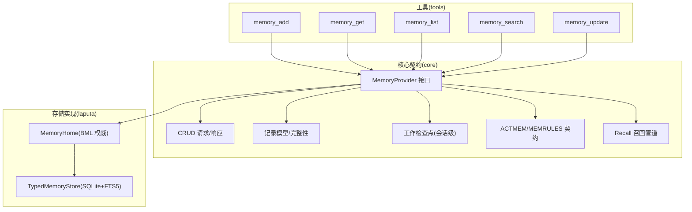
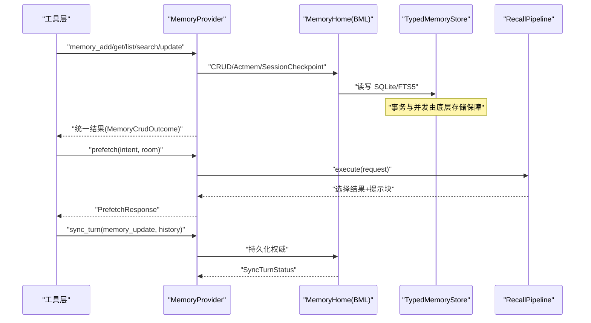
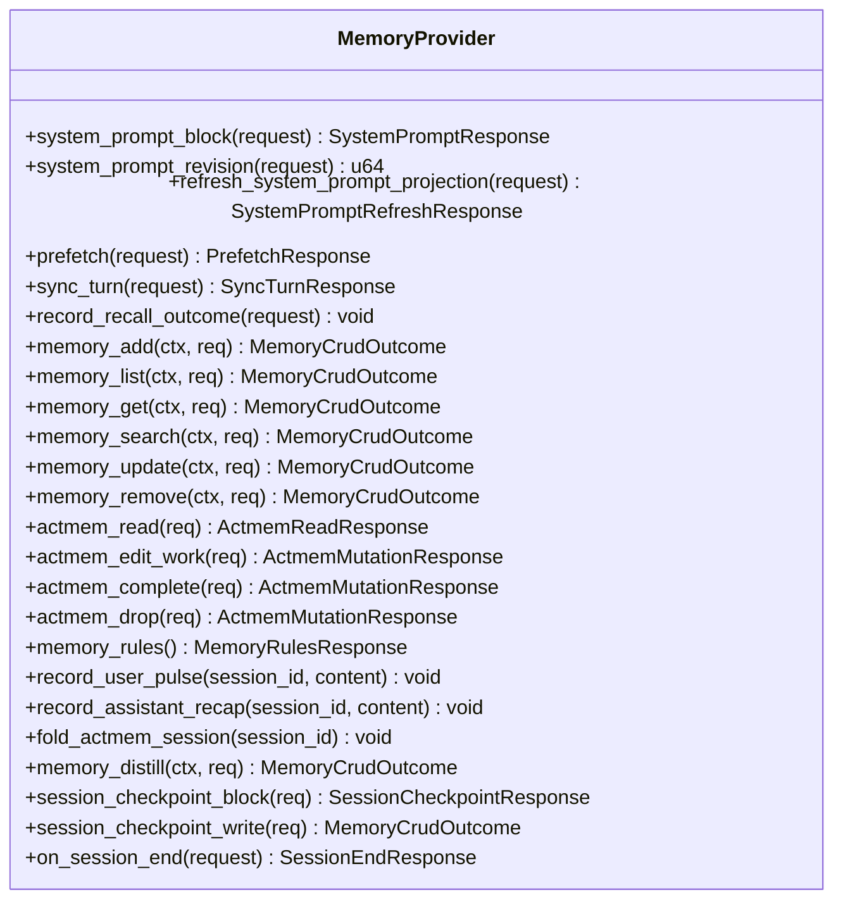
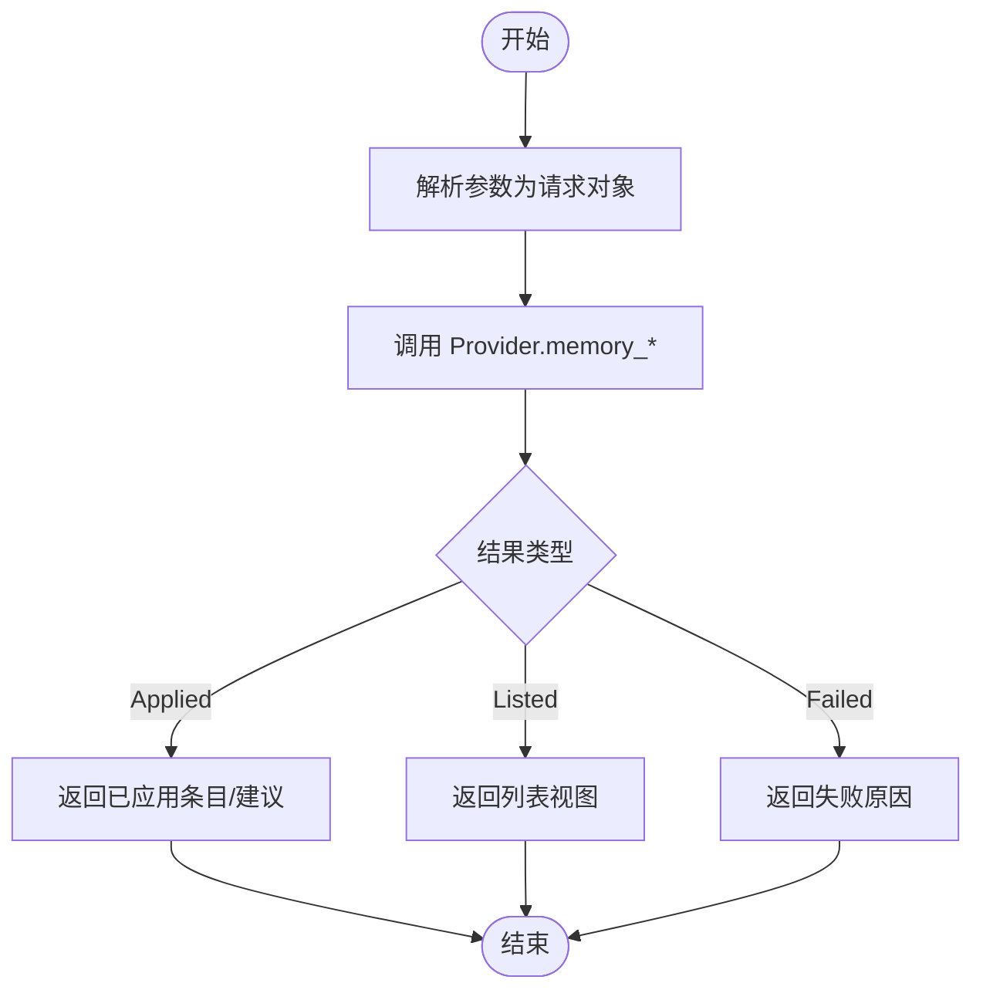
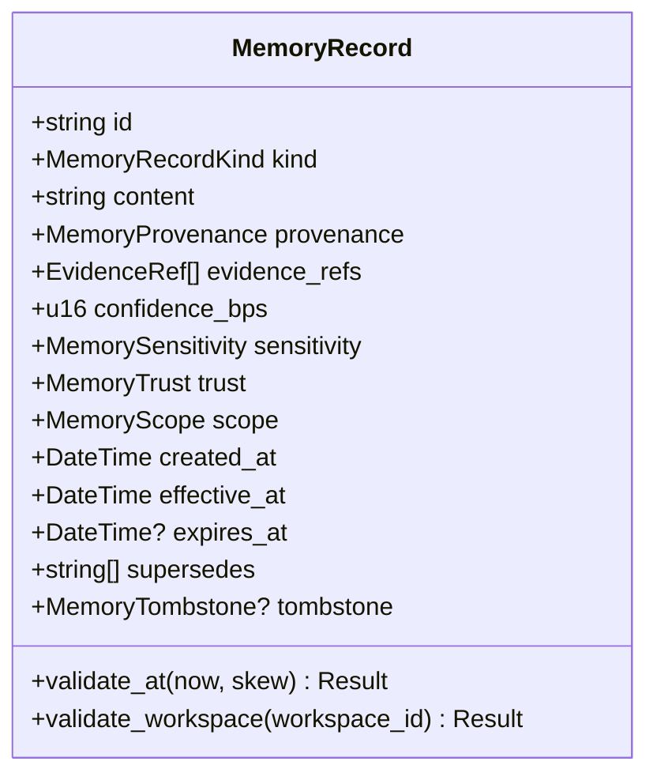
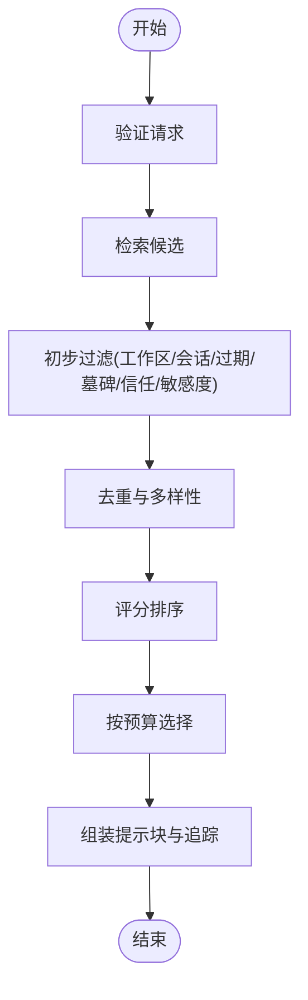
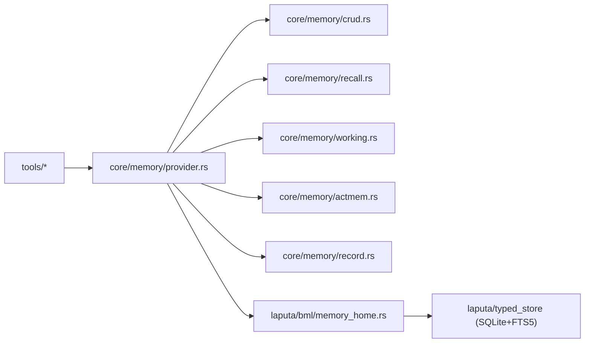

# 记忆系统

<cite>
**本文引用的文件**
- [agent-diva-core/src/memory/mod.rs](file://agent-diva-core/src/memory/mod.rs)
- [agent-diva-core/src/memory/provider.rs](file://agent-diva-core/src/memory/provider.rs)
- [agent-diva-core/src/memory/crud.rs](file://agent-diva-core/src/memory/crud.rs)
- [agent-diva-core/src/memory/working.rs](file://agent-diva-core/src/memory/working.rs)
- [agent-diva-core/src/memory/actmem.rs](file://agent-diva-core/src/memory/actmem.rs)
- [agent-diva-core/src/memory/record.rs](file://agent-diva-core/src/memory/record.rs)
- [agent-diva-core/src/memory/recall.rs](file://agent-diva-core/src/memory/recall.rs)
- [agent-diva-laputa/src/bml/mod.rs](file://agent-diva-laputa/src/bml/mod.rs)
- [agent-diva-laputa/src/bml/memory_home.rs](file://agent-diva-laputa/src/bml/memory_home.rs)
- [agent-diva-tools/src/memory_add.rs](file://agent-diva-tools/src/memory_add.rs)
- [agent-diva-tools/src/memory_get.rs](file://agent-diva-tools/src/memory_get.rs)
- [agent-diva-tools/src/memory_list.rs](file://agent-diva-tools/src/memory_list.rs)
- [agent-diva-tools/src/memory_search.rs](file://agent-diva-tools/src/memory_search.rs)
- [agent-diva-tools/src/memory_update.rs](file://agent-diva-tools/src/memory_update.rs)
</cite>

## 目录
1. [简介](#简介)
2. [项目结构](#项目结构)
3. [核心组件](#核心组件)
4. [架构总览](#架构总览)
5. [详细组件分析](#详细组件分析)
6. [依赖关系分析](#依赖关系分析)
7. [性能考量](#性能考量)
8. [故障排查指南](#故障排查指南)
9. [结论](#结论)
10. [附录：使用示例与最佳实践](#附录使用示例与最佳实践)

## 简介
本文件面向 Agent-Diva 的记忆系统，系统性阐述分层架构（工作记忆、长期记忆、BML 存储层）、CRUD 操作机制、Memory Provider 接口设计、记忆生命周期管理以及数据流转。文档同时提供架构图与流程图，帮助读者从高层到代码级理解记忆系统的实现与使用方式。

## 项目结构
记忆系统由 core 层的领域契约与 Laputa 层的 BML 存储实现组成，并通过 tools 层暴露工具调用入口。关键组织方式如下：
- agent-diva-core/memory：定义 MemoryProvider、CRUD 请求/响应、记录模型、召回管道与工作检查点等核心契约。
- agent-diva-laputa/bml：实现机器级 BML 权威存储（SQLite + FTS5），对外暴露 MemoryHome 作为唯一生产权威。
- agent-diva-tools：将 CRUD 能力以工具形式暴露给上层 Agent，如 memory_add、memory_get、memory_list、memory_search、memory_update。

图表来源
- [agent-diva-core/src/memory/provider.rs:414-617](file://agent-diva-core/src/memory/provider.rs#L414-L617)
- [agent-diva-laputa/src/bml/mod.rs:1-37](file://agent-diva-laputa/src/bml/mod.rs#L1-L37)
- [agent-diva-laputa/src/bml/memory_home.rs:85-177](file://agent-diva-laputa/src/bml/memory_home.rs#L85-L177)
- [agent-diva-tools/src/memory_add.rs:41-88](file://agent-diva-tools/src/memory_add.rs#L41-L88)
- [agent-diva-tools/src/memory_get.rs:37-72](file://agent-diva-tools/src/memory_get.rs#L37-L72)
- [agent-diva-tools/src/memory_list.rs:41-79](file://agent-diva-tools/src/memory_list.rs#L41-L79)
- [agent-diva-tools/src/memory_search.rs:41-79](file://agent-diva-tools/src/memory_search.rs#L41-L79)
- [agent-diva-tools/src/memory_update.rs:41-79](file://agent-diva-tools/src/memory_update.rs#L41-L79)

章节来源
- [agent-diva-core/src/memory/mod.rs:1-47](file://agent-diva-core/src/memory/mod.rs#L1-L47)
- [agent-diva-laputa/src/bml/mod.rs:1-37](file://agent-diva-laputa/src/bml/mod.rs#L1-L37)

## 核心组件
- MemoryProvider：Agent-Diva 与任意长时记忆后端的隔离层，统一启动注入、意图预取、回合同步、会话结束钩子及 CRUD/ACTMEM 能力。
- CRUD 契约：定义增删改查的请求体、条目结构与统一结果枚举，支持 CAS 更新/删除与证据引用。
- 记录模型与完整性：稳定化的 MemoryRecord、信任等级、敏感度、范围与作用域、时间有效性、墓碑标记与校验规则。
- 召回管道：基于策略的候选筛选、评分与预算控制，输出可注入提示的片段与审计追踪。
- 工作检查点：会话级临时状态，用于回合上下文注入，不进入长期权威。
- ACTMEM/MEMRULES：进程内/会话内的活动记忆读取与编辑契约，配合规则文档。

章节来源
- [agent-diva-core/src/memory/provider.rs:414-617](file://agent-diva-core/src/memory/provider.rs#L414-L617)
- [agent-diva-core/src/memory/crud.rs:1-192](file://agent-diva-core/src/memory/crud.rs#L1-L192)
- [agent-diva-core/src/memory/record.rs:103-289](file://agent-diva-core/src/memory/record.rs#L103-L289)
- [agent-diva-core/src/memory/recall.rs:214-360](file://agent-diva-core/src/memory/recall.rs#L214-L360)
- [agent-diva-core/src/memory/working.rs:10-76](file://agent-diva-core/src/memory/working.rs#L10-L76)
- [agent-diva-core/src/memory/actmem.rs:1-51](file://agent-diva-core/src/memory/actmem.rs#L1-L51)

## 架构总览
记忆系统采用“契约-实现”分层：core 定义跨后端稳定的领域契约；laputa 提供机器级 BML 权威（SQLite + FTS5）；tools 通过 MemoryProvider 暴露工具能力。启动阶段生成最小化索引注入提示；回合中按需召回；回合后持久化变更；会话结束时清理工作检查点。

图表来源
- [agent-diva-core/src/memory/provider.rs:414-617](file://agent-diva-core/src/memory/provider.rs#L414-L617)
- [agent-diva-core/src/memory/recall.rs:214-360](file://agent-diva-core/src/memory/recall.rs#L214-L360)
- [agent-diva-laputa/src/bml/memory_home.rs:179-200](file://agent-diva-laputa/src/bml/memory_home.rs#L179-L200)

## 详细组件分析

### MemoryProvider 接口设计
- 启动注入：system_prompt_block/system_prompt_revision/refresh_system_prompt_projection，返回紧凑 Markdown 或降级状态。
- 回合预取：prefetch，基于意图进行可选召回，失败不应中断回合。
- 回合同步：sync_turn，仅做持久化写入，不回填启动状态。
- 会话结束：on_session_end，幂等执行收尾任务。
- CRUD/ACTMEM：默认不支持，需具体实现覆盖；支持 CAS 更新/删除与审计关联。
- 工作检查点：session_checkpoint_block/write，会话级临时状态。

图表来源
- [agent-diva-core/src/memory/provider.rs:414-617](file://agent-diva-core/src/memory/provider.rs#L414-L617)

章节来源
- [agent-diva-core/src/memory/provider.rs:22-389](file://agent-diva-core/src/memory/provider.rs#L22-L389)
- [agent-diva-core/src/memory/provider.rs:414-617](file://agent-diva-core/src/memory/provider.rs#L414-L617)

### CRUD 操作与事务/并发
- 请求/响应：MemoryAddRequest/MemoryGetRequest/MemoryListRequest/MemorySearchRequest/MemoryUpdateRequest/MemoryRemoveRequest；统一结果 MemoryCrudOutcome（Applied/Listed/Failed）。
- 并发与一致性：更新/删除使用 base_revision 进行 CAS，避免竞态；未支持的操作用 Failed 明确拒绝。
- 证据引用：可选 EvidenceRef，增强可追溯性。
- 工具封装：tools 层将 JSON 参数解析为请求并调用 provider，错误统一转换为 ToolError。

图表来源
- [agent-diva-core/src/memory/crud.rs:11-136](file://agent-diva-core/src/memory/crud.rs#L11-L136)
- [agent-diva-tools/src/memory_add.rs:64-88](file://agent-diva-tools/src/memory_add.rs#L64-L88)
- [agent-diva-tools/src/memory_get.rs:51-72](file://agent-diva-tools/src/memory_get.rs#L51-L72)
- [agent-diva-tools/src/memory_list.rs:55-79](file://agent-diva-tools/src/memory_list.rs#L55-L79)
- [agent-diva-tools/src/memory_search.rs:55-79](file://agent-diva-tools/src/memory_search.rs#L55-L79)
- [agent-diva-tools/src/memory_update.rs:55-79](file://agent-diva-tools/src/memory_update.rs#L55-L79)

章节来源
- [agent-diva-core/src/memory/crud.rs:1-192](file://agent-diva-core/src/memory/crud.rs#L1-L192)
- [agent-diva-tools/src/memory_add.rs:1-114](file://agent-diva-tools/src/memory_add.rs#L1-L114)
- [agent-diva-tools/src/memory_get.rs:1-74](file://agent-diva-tools/src/memory_get.rs#L1-L74)
- [agent-diva-tools/src/memory_list.rs:1-105](file://agent-diva-tools/src/memory_list.rs#L1-L105)
- [agent-diva-tools/src/memory_search.rs:1-105](file://agent-diva-tools/src/memory_search.rs#L1-L105)
- [agent-diva-tools/src/memory_update.rs:1-105](file://agent-diva-tools/src/memory_update.rs#L1-L105)

### 长期记忆记录模型与完整性
- 记录字段：id、kind、content、provenance、evidence_refs、confidence_bps、sensitivity、trust、scope、时间戳、supersedes、tombstone。
- 校验规则：必填字段、内容摘要匹配、时间合法性、过期/墓碑/自替换限制、权威来源约束、工作区边界。
- 安全渲染：escape_memory_for_prompt 将不可信内容包裹在数据边界内，防止提示注入。
- L1 索引：render_l1_index_block 仅注入最小指针，完整条目按需检索。

图表来源
- [agent-diva-core/src/memory/record.rs:103-289](file://agent-diva-core/src/memory/record.rs#L103-L289)
- [agent-diva-core/src/memory/record.rs:291-350](file://agent-diva-core/src/memory/record.rs#L291-L350)

章节来源
- [agent-diva-core/src/memory/record.rs:103-350](file://agent-diva-core/src/memory/record.rs#L103-L350)

### 召回管道（Recall v2）
- 输入：RecallRequest（查询、范围、审计关联、当前时间、token 预算、候选上限、策略）。
- 处理：初步过滤（工作区/会话/过期/墓碑/信任/敏感度）、去重、多样性、评分排序、预算分配。
- 输出：RecallOutcome（状态、失败分类、选中记录、提示块、预算使用、追踪）。
- 估算：ConservativeRecallTokenEstimator 保守估计 token 数，保证预算安全。

图表来源
- [agent-diva-core/src/memory/recall.rs:214-360](file://agent-diva-core/src/memory/recall.rs#L214-L360)
- [agent-diva-core/src/memory/recall.rs:394-498](file://agent-diva-core/src/memory/recall.rs#L394-L498)

章节来源
- [agent-diva-core/src/memory/recall.rs:1-203](file://agent-diva-core/src/memory/recall.rs#L1-L203)
- [agent-diva-core/src/memory/recall.rs:214-360](file://agent-diva-core/src/memory/recall.rs#L214-L360)
- [agent-diva-core/src/memory/recall.rs:394-498](file://agent-diva-core/src/memory/recall.rs#L394-L498)

### 工作记忆（会话检查点）
- 目的：会话级临时状态，注入回合上下文，不成为长期权威。
- 写入：SessionCheckpointWriteRequest（key_info、related_sops、content）。
- 渲染：render_session_checkpoint_block 生成结构化 Markdown 块。
- 清理：会话结束时清除，确保不污染长期存储。

章节来源
- [agent-diva-core/src/memory/working.rs:1-76](file://agent-diva-core/src/memory/working.rs#L1-L76)

### ACTMEM 与 MEMRULES
- 读取目标：Pulse、Recap、Work、Head、Capsules、Capsule。
- 编辑 Work：CAS 替换指定小节，返回新版本号。
- 完成/丢弃项：CAS 操作 Open 项。
- 规则文档：MemoryRulesResponse 提供写时注入的手册。

章节来源
- [agent-diva-core/src/memory/actmem.rs:1-51](file://agent-diva-core/src/memory/actmem.rs#L1-L51)

### BML 存储层（Laputa）
- 权威：MemoryHome 是机器级 BML 权威，单一实例共享 TypedMemoryStore（SQLite + FTS5）。
- 启动预热：warmup 刷新启动索引；startup_markdown 缓存提示块；revision 原子递增。
- 读写路径：existing_store/writable_store 懒加载数据库；list/get 过滤被替代/墓碑记录。
- 边界：非 BML 模块禁止直接调用原始写入 API，通过 MemoryProvider 访问。

章节来源
- [agent-diva-laputa/src/bml/mod.rs:1-37](file://agent-diva-laputa/src/bml/mod.rs#L1-L37)
- [agent-diva-laputa/src/bml/memory_home.rs:85-177](file://agent-diva-laputa/src/bml/memory_home.rs#L85-L177)
- [agent-diva-laputa/src/bml/memory_home.rs:179-200](file://agent-diva-laputa/src/bml/memory_home.rs#L179-L200)

## 依赖关系分析
- 工具层依赖 core 的 MemoryProvider 与 CRUD 契约。
- core 的 provider 聚合 recall、working、actmem、crud、record 等子模块。
- laputa 的 MemoryHome 实现 provider 契约，并依赖 TypedMemoryStore 与 ActmemStore。
- 外部依赖：SQLite + FTS5（存储）、chrono（时间）、serde（序列化）。

图表来源
- [agent-diva-core/src/memory/provider.rs:414-617](file://agent-diva-core/src/memory/provider.rs#L414-L617)
- [agent-diva-laputa/src/bml/memory_home.rs:85-177](file://agent-diva-laputa/src/bml/memory_home.rs#L85-L177)

章节来源
- [agent-diva-core/src/memory/mod.rs:1-47](file://agent-diva-core/src/memory/mod.rs#L1-L47)
- [agent-diva-laputa/src/bml/mod.rs:1-37](file://agent-diva-laputa/src/bml/mod.rs#L1-L37)

## 性能考量
- 启动注入最小化：L1 索引行限制（默认 30 行），避免注入全文，减少提示开销。
- 召回预算控制：token 预算与头部开销预留，超预算即停止追加，保证稳定性。
- 去重与多样性：按内容摘要去重并按类别多样化，提升召回质量与可读性。
- 懒加载存储：existing_store/writable_store 仅在需要时打开数据库，降低冷启动成本。
- 保守估算：默认 token 估算器保守估计，避免超预算风险。

章节来源
- [agent-diva-core/src/memory/record.rs:314-350](file://agent-diva-core/src/memory/record.rs#L314-L350)
- [agent-diva-core/src/memory/recall.rs:214-360](file://agent-diva-core/src/memory/recall.rs#L214-L360)
- [agent-diva-laputa/src/bml/memory_home.rs:147-177](file://agent-diva-laputa/src/bml/memory_home.rs#L147-L177)

## 故障排查指南
- 启动降级：当无法生成唤醒内容时返回 Degraded 状态，包含原因与最后可用唤醒块（可能为空）。
- 召回失败：检索不可用会降级为空结果，不中断回合；可通过 RecallFailure 分类定位。
- 更新冲突：base_revision 不匹配导致 CAS 失败，应重新获取最新 revision 重试。
- 权限/范围：工作区/会话不匹配将被拒绝；信任/敏感度不在允许列表也会被拒绝。
- 工具不可用：未配置 provider 或 workspace 时返回失败原因，便于快速定位。

章节来源
- [agent-diva-core/src/memory/provider.rs:22-65](file://agent-diva-core/src/memory/provider.rs#L22-L65)
- [agent-diva-core/src/memory/recall.rs:119-188](file://agent-diva-core/src/memory/recall.rs#L119-L188)
- [agent-diva-core/src/memory/crud.rs:105-136](file://agent-diva-core/src/memory/crud.rs#L105-L136)
- [agent-diva-tools/src/memory_add.rs:64-88](file://agent-diva-tools/src/memory_add.rs#L64-L88)

## 结论
记忆系统通过清晰的契约与实现分离，实现了工作记忆、长期记忆与 BML 存储的分层治理。CRUD 操作具备 CAS 一致性与审计追踪；召回管道在预算与策略约束下提供稳定可控的上下文注入；工作检查点确保会话级状态不污染权威存储。整体设计兼顾可扩展性、安全性与性能，适合多后端集成与大规模部署。

## 附录：使用示例与最佳实践
- 添加记忆：调用 memory_add 工具传入 content（可附带证据引用），provider 将其写入 BML 权威。
- 列出记忆：调用 memory_list 获取可见条目与当前 revision，用于后续更新/删除。
- 检索记忆：调用 memory_search 根据查询搜索已应用记忆。
- 更新记忆：先 memory_list 获取 base_revision，再调用 memory_update 进行 CAS 更新。
- 删除记忆：先 memory_list 获取 base_revision，再调用 memory_remove 进行软删除。
- 回合预取：在 turn 开始时调用 prefetch，基于意图注入相关记忆片段。
- 回合同步：turn 结束后调用 sync_turn 持久化记忆更新与历史条目。
- 会话结束：调用 on_session_end 清理工作检查点与收尾任务。

章节来源
- [agent-diva-tools/src/memory_add.rs:41-88](file://agent-diva-tools/src/memory_add.rs#L41-L88)
- [agent-diva-tools/src/memory_list.rs:41-79](file://agent-diva-tools/src/memory_list.rs#L41-L79)
- [agent-diva-tools/src/memory_search.rs:41-79](file://agent-diva-tools/src/memory_search.rs#L41-L79)
- [agent-diva-tools/src/memory_update.rs:41-79](file://agent-diva-tools/src/memory_update.rs#L41-L79)
- [agent-diva-core/src/memory/provider.rs:414-617](file://agent-diva-core/src/memory/provider.rs#L414-L617)