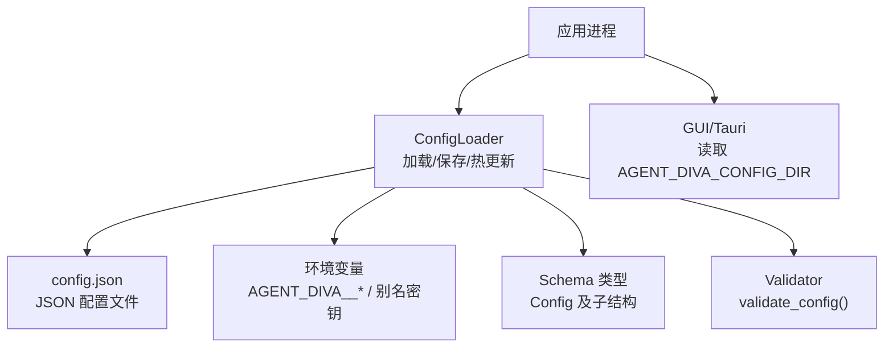
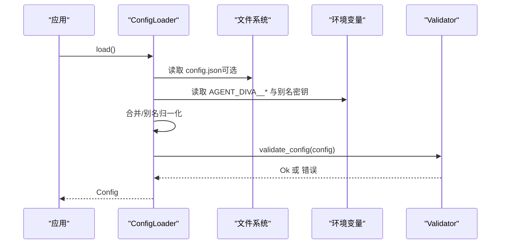
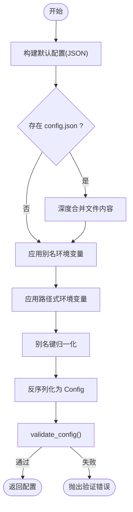
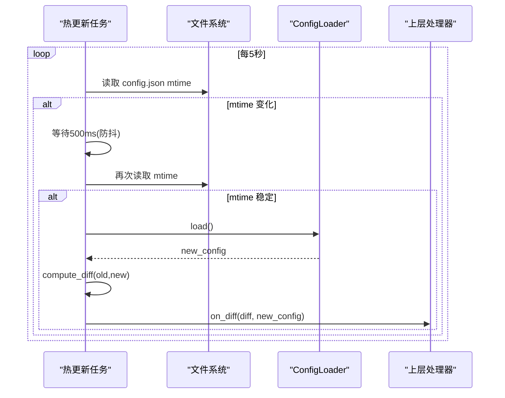
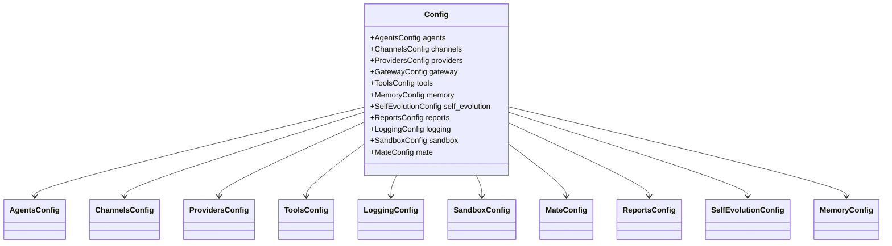
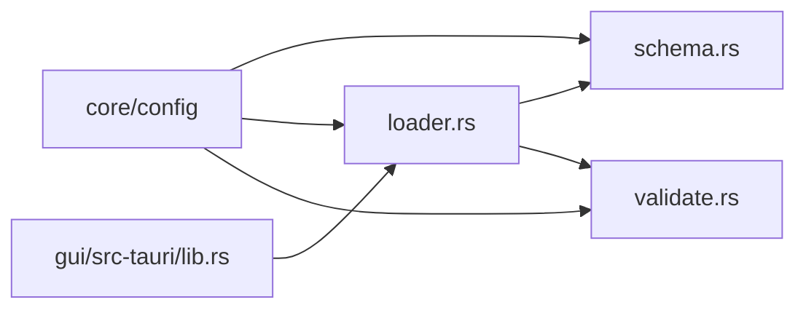

# 配置管理

<cite>
**本文引用的文件**
- [agent-diva-core/src/config/mod.rs](file://agent-diva-core/src/config/mod.rs)
- [agent-diva-core/src/config/loader.rs](file://agent-diva-core/src/config/loader.rs)
- [agent-diva-core/src/config/schema.rs](file://agent-diva-core/src/config/schema.rs)
- [agent-diva-core/src/config/validate.rs](file://agent-diva-core/src/config/validate.rs)
- [agent-diva-providers/src/providers.yaml](file://agent-diva-providers/src/providers.yaml)
- [agent-diva-gui/src-tauri/src/lib.rs](file://agent-diva-gui/src-tauri/src/lib.rs)
</cite>

## 目录
1. [简介](#简介)
2. [项目结构](#项目结构)
3. [核心组件](#核心组件)
4. [架构总览](#架构总览)
5. [详细组件分析](#详细组件分析)
6. [依赖关系分析](#依赖关系分析)
7. [性能与热更新特性](#性能与热更新特性)
8. [故障排查指南](#故障排查指南)
9. [结论](#结论)
10. [附录：配置项参考与示例](#附录配置项参考与示例)

## 简介
本文件系统性说明 Agent-Diva 的配置管理系统，涵盖配置加载、合并、验证、热更新、优先级与覆盖规则、多环境支持、以及各配置项之间的关系。目标是帮助开发者与运维人员正确理解并安全地配置系统各组件（代理、通道、提供商、工具、日志、沙箱、Mate 等）。

## 项目结构
配置系统位于 agent-diva-core 的 config 模块中，由三个子模块组成：
- schema：定义所有配置项的数据结构与默认值
- loader：负责从 JSON 配置文件与环境变量加载、合并、别名归一化、保存与热更新
- validate：对最终配置进行业务级校验

此外，GUI 层通过环境变量 AGENT_DIVA_CONFIG_DIR 指定配置目录，并在启动时加载配置以初始化日志等子系统。

图表来源
- [agent-diva-core/src/config/loader.rs:19-74](file://agent-diva-core/src/config/loader.rs#L19-L74)
- [agent-diva-core/src/config/schema.rs:278-309](file://agent-diva-core/src/config/schema.rs#L278-L309)
- [agent-diva-core/src/config/validate.rs:6-99](file://agent-diva-core/src/config/validate.rs#L6-L99)
- [agent-diva-gui/src-tauri/src/lib.rs:48-53](file://agent-diva-gui/src-tauri/src/lib.rs#L48-L53)

章节来源
- [agent-diva-core/src/config/mod.rs:1-11](file://agent-diva-core/src/config/mod.rs#L1-L11)
- [agent-diva-core/src/config/loader.rs:19-74](file://agent-diva-core/src/config/loader.rs#L19-L74)
- [agent-diva-core/src/config/schema.rs:278-309](file://agent-diva-core/src/config/schema.rs#L278-L309)
- [agent-diva-core/src/config/validate.rs:6-99](file://agent-diva-core/src/config/validate.rs#L6-L99)
- [agent-diva-gui/src-tauri/src/lib.rs:48-53](file://agent-diva-gui/src-tauri/src/lib.rs#L48-L53)

## 核心组件
- ConfigLoader：封装配置目录与文件路径，提供 load/save/start_hot_reload 等方法；内部实现 JSON 与环境的合并、别名归一化与差异计算。
- Schema：定义根配置 Config 及其子结构（agents、channels、providers、tools、logging、sandbox、mate、reports、self_evolution、memory 等）与默认值。
- Validator：集中业务校验规则，如 agents.defaults.temperature 范围、MCP Server 传输方式、web search provider 白名单与上限、Mate ASR/TTS 提供者与参数范围等。

章节来源
- [agent-diva-core/src/config/loader.rs:12-178](file://agent-diva-core/src/config/loader.rs#L12-L178)
- [agent-diva-core/src/config/schema.rs:278-309](file://agent-diva-core/src/config/schema.rs#L278-L309)
- [agent-diva-core/src/config/validate.rs:6-99](file://agent-diva-core/src/config/validate.rs#L6-L99)

## 架构总览
配置加载流程如下：
1. 构造 ConfigLoader（默认目录 ~/.agent-diva，或自定义目录/文件）。
2. 读取默认 Config 的 JSON 表示作为基线。
3. 若存在 config.json，则解析为 Value 并与基线深度合并。
4. 应用别名覆盖与环境变量覆盖（含路径式与别名式）。
5. 将合并后的 Value 反序列化为强类型 Config。
6. 调用 validate_config 进行业务校验。
7. 返回有效配置；同时可持久化保存。

图表来源
- [agent-diva-core/src/config/loader.rs:57-74](file://agent-diva-core/src/config/loader.rs#L57-L74)
- [agent-diva-core/src/config/loader.rs:371-416](file://agent-diva-core/src/config/loader.rs#L371-L416)
- [agent-diva-core/src/config/validate.rs:6-99](file://agent-diva-core/src/config/validate.rs#L6-L99)

## 详细组件分析

### 配置加载与合并策略
- 基线：使用 Config::default() 的 JSON 表示作为基线。
- 文件覆盖：若存在 config.json，则按对象键递归合并（overlay 覆盖 base）。
- 环境变量覆盖：
  - 路径式：AGENT_DIVA__AGENTS__DEFAULTS__MODEL 映射到 agents.defaults.model。
  - 别名式：OPENAI_API_KEY 等映射到 providers.openai.api_key。
- 别名归一化：
  - channels.neuro-link 接受别名 neuro_link/generic_pipe。
  - tools.mcpServers/mcp_servers 统一为 mcp_servers。
  - 顶层 pet 迁移为 mate。
- 顺序：默认值 → 文件 → 别名环境变量 → 路径式环境变量（最高优先级）。

图表来源
- [agent-diva-core/src/config/loader.rs:57-74](file://agent-diva-core/src/config/loader.rs#L57-L74)
- [agent-diva-core/src/config/loader.rs:308-323](file://agent-diva-core/src/config/loader.rs#L308-L323)
- [agent-diva-core/src/config/loader.rs:371-416](file://agent-diva-core/src/config/loader.rs#L371-L416)
- [agent-diva-core/src/config/loader.rs:429-463](file://agent-diva-core/src/config/loader.rs#L429-L463)

章节来源
- [agent-diva-core/src/config/loader.rs:57-74](file://agent-diva-core/src/config/loader.rs#L57-L74)
- [agent-diva-core/src/config/loader.rs:308-323](file://agent-diva-core/src/config/loader.rs#L308-L323)
- [agent-diva-core/src/config/loader.rs:371-416](file://agent-diva-core/src/config/loader.rs#L371-L416)
- [agent-diva-core/src/config/loader.rs:429-463](file://agent-diva-core/src/config/loader.rs#L429-L463)

### 热更新机制
- 后台任务：start_hot_reload 每 5 秒轮询 config.json 的 mtime。
- 防抖：检测到变化后等待 500ms 再次检查，避免编辑器自动保存导致的多次触发。
- 差异计算：compute_diff 将新旧配置序列化为 JSON 并递归比较，生成 ChangedField 列表，并按 classify_field 分类为“可热重载”或“需重启”。
- 回调：on_diff(diff, new_config) 通知上层处理变更。

图表来源
- [agent-diva-core/src/config/loader.rs:94-172](file://agent-diva-core/src/config/loader.rs#L94-L172)
- [agent-diva-core/src/config/loader.rs:248-306](file://agent-diva-core/src/config/loader.rs#L248-L306)

章节来源
- [agent-diva-core/src/config/loader.rs:94-172](file://agent-diva-core/src/config/loader.rs#L94-L172)
- [agent-diva-core/src/config/loader.rs:248-306](file://agent-diva-core/src/config/loader.rs#L248-L306)

### 配置验证机制
validate_config 执行以下关键校验：
- agents.defaults.workspace 非空
- agents.defaults.max_tokens > 0
- agents.defaults.temperature ∈ [0.0, 2.0]
- agents.defaults.max_tool_iterations > 0
- agents.defaults.reasoning_effort ∈ {low, medium, high}
- tools.mcp_servers.* 必须设置 command（stdio）或 url（http）之一
- tools.web.search.provider ∈ {brave, bocha, zhipu}，且 max_results 在允许范围内（bocha/zhipu 上限更高）
- mate.asr_provider ∈ {web_speech, siliconflow}
- mate.tts_provider ∈ {browser, openai, siliconflow, minimax}
- mate.tts_speed > 0，tts_volume ∈ [0.0, 2.0]
- reports.llm_curation 的子项校验（timeout/max_input/max_output/fallback）

章节来源
- [agent-diva-core/src/config/validate.rs:6-99](file://agent-diva-core/src/config/validate.rs#L6-L99)

### 配置优先级与覆盖规则
- 优先级（低到高）：
  1) 默认值（Config::default）
  2) config.json 文件
  3) 别名环境变量（如 OPENAI_API_KEY）
  4) 路径式环境变量（AGENT_DIVA__...）
- 覆盖语义：
  - 文件与路径式环境变量均按字段路径精确覆盖。
  - 路径式环境变量优先级高于别名与环境变量中的其他形式。
- 多环境支持：
  - 通过 AGENT_DIVA_CONFIG_DIR 切换不同配置目录（GUI 层已支持）。
  - 通过不同环境变量的组合实现开发/测试/生产差异化。

章节来源
- [agent-diva-core/src/config/loader.rs:371-416](file://agent-diva-core/src/config/loader.rs#L371-L416)
- [agent-diva-gui/src-tauri/src/lib.rs:48-53](file://agent-diva-gui/src-tauri/src/lib.rs#L48-L53)

### 配置项关系图
下图展示根配置与各子模块的关系，便于理解依赖与影响面。

图表来源
- [agent-diva-core/src/config/schema.rs:278-309](file://agent-diva-core/src/config/schema.rs#L278-L309)

章节来源
- [agent-diva-core/src/config/schema.rs:278-309](file://agent-diva-core/src/config/schema.rs#L278-L309)

## 依赖关系分析
- ConfigLoader 依赖：
  - schema::Config（数据结构）
  - validate::validate_config（校验）
  - serde_json（Value/Map 用于合并与差异计算）
  - tokio（异步热更新任务）
- GUI 层依赖：
  - ConfigLoader（通过 AGENT_DIVA_CONFIG_DIR 选择配置目录）
  - agent_diva_core::logging（根据配置初始化日志）

图表来源
- [agent-diva-core/src/config/mod.rs:6-11](file://agent-diva-core/src/config/mod.rs#L6-L11)
- [agent-diva-core/src/config/loader.rs:1-11](file://agent-diva-core/src/config/loader.rs#L1-L11)
- [agent-diva-gui/src-tauri/src/lib.rs:48-88](file://agent-diva-gui/src-tauri/src/lib.rs#L48-L88)

章节来源
- [agent-diva-core/src/config/mod.rs:6-11](file://agent-diva-core/src/config/mod.rs#L6-L11)
- [agent-diva-core/src/config/loader.rs:1-11](file://agent-diva-core/src/config/loader.rs#L1-L11)
- [agent-diva-gui/src-tauri/src/lib.rs:48-88](file://agent-diva-gui/src-tauri/src/lib.rs#L48-L88)

## 性能与热更新特性
- 热更新轮询间隔：5 秒，适合大多数场景。
- 防抖：检测到 mtime 变化后等待 500ms 再确认，减少重复 reload。
- 差异计算：基于 JSON Value 的递归比较，时间复杂度与配置树大小线性相关；对于典型配置规模开销很小。
- 可热重载字段（白名单）：
  - agents.defaults.model
  - agents.defaults.temperature
  - agents.defaults.max_tool_iterations
  - agents.defaults.reasoning_effort
  - tools.budget
  - tools.exec.timeout
  - tools.web.search.enabled
  - tools.web.fetch.enabled
  - sandbox.mode
  - sandbox.approval_policy
  - logging.level
- 需要重启的字段：除上述白名单外的任何变更（如 providers、channels、端口、密钥等）。

章节来源
- [agent-diva-core/src/config/loader.rs:94-172](file://agent-diva-core/src/config/loader.rs#L94-L172)
- [agent-diva-core/src/config/loader.rs:219-239](file://agent-diva-core/src/config/loader.rs#L219-L239)

## 故障排查指南
常见错误与定位方法：
- 验证失败：当 validate_config 返回错误时，会聚合多条错误信息（例如 temperature 超出范围、MCP server 未设置传输方式等）。请检查对应字段。
- 热更新未生效：
  - 确认修改的是可热重载字段；否则需要重启服务。
  - 检查编辑器是否频繁保存导致防抖跳过；稍等片刻重试。
- 环境变量未生效：
  - 确认使用了正确的 AGENT_DIVA__ 前缀与双下划线分隔。
  - 路径式环境变量优先级高于别名环境变量与文件配置。
- 配置目录不正确：
  - GUI 可通过 AGENT_DIVA_CONFIG_DIR 指定目录；确保该目录下存在 config.json。

章节来源
- [agent-diva-core/src/config/validate.rs:6-99](file://agent-diva-core/src/config/validate.rs#L6-L99)
- [agent-diva-core/src/config/loader.rs:94-172](file://agent-diva-core/src/config/loader.rs#L94-L172)
- [agent-diva-core/src/config/loader.rs:371-416](file://agent-diva-core/src/config/loader.rs#L371-L416)
- [agent-diva-gui/src-tauri/src/lib.rs:48-53](file://agent-diva-gui/src-tauri/src/lib.rs#L48-L53)

## 结论
Agent-Diva 的配置系统提供了清晰的分层与严格的校验，结合 JSON 配置文件与环境变量实现了灵活的多环境管理。热更新机制使得部分运行时参数可在不重启的情况下生效，提升了运维效率。遵循本文档的优先级与覆盖规则，可以安全、可靠地配置系统各组件。

## 附录：配置项参考与示例

### 支持的配置格式
- 主配置：config.json（JSON）
- 环境变量：AGENT_DIVA__*（路径式），以及一组别名密钥（如 OPENAI_API_KEY）
- 提供商清单：providers.yaml（用于提供商发现与模型列表，非用户配置入口）

章节来源
- [agent-diva-core/src/config/loader.rs:57-74](file://agent-diva-core/src/config/loader.rs#L57-L74)
- [agent-diva-providers/src/providers.yaml:1-120](file://agent-diva-providers/src/providers.yaml#L1-L120)

### 环境变量与覆盖规则
- 路径式环境变量：AGENT_DIVA__AGENTS__DEFAULTS__MODEL=...
- 别名环境变量：OPENAI_API_KEY=...
- 优先级：路径式 > 别名式 > 文件 > 默认值

章节来源
- [agent-diva-core/src/config/loader.rs:371-416](file://agent-diva-core/src/config/loader.rs#L371-L416)

### 常用配置项速查
- agents.defaults：workspace、provider、model、max_tokens、temperature、max_tool_iterations、reasoning_effort、thinking_mode
- channels：telegram、discord、whatsapp、feishu、dingtalk、email、slack、qq、matrix、neuro-link、irc、mattermost、nextcloud_talk
- tools：budget、exec.timeout、web.search（provider、max_results）、mcp_servers（command/url）
- logging：level、format、dir、overrides、retention_days
- sandbox：mode、windows_level、network_access、approval_policy、writable_roots、protected_paths、deny_patterns、timeout_seconds
- mate：asr_provider、tts_provider、tts_speed、tts_volume
- reports.llm_curation：enabled、provider、model、language、max_input_tokens、max_output_tokens、timeout_secs、fallback
- self_evolution：enabled、autodream_frequency、trigger_threshold_sessions/messages、auto_merge_confidence、require_confirmation_for
- memory：l1_index_lines

章节来源
- [agent-diva-core/src/config/schema.rs:511-557](file://agent-diva-core/src/config/schema.rs#L511-L557)
- [agent-diva-core/src/config/schema.rs:559-603](file://agent-diva-core/src/config/schema.rs#L559-L603)
- [agent-diva-core/src/config/schema.rs:605-642](file://agent-diva-core/src/config/schema.rs#L605-L642)
- [agent-diva-core/src/config/schema.rs:644-800](file://agent-diva-core/src/config/schema.rs#L644-L800)
- [agent-diva-core/src/config/schema.rs:1026-1168](file://agent-diva-core/src/config/schema.rs#L1026-L1168)
- [agent-diva-core/src/config/schema.rs:378-444](file://agent-diva-core/src/config/schema.rs#L378-L444)
- [agent-diva-core/src/config/schema.rs:465-509](file://agent-diva-core/src/config/schema.rs#L465-L509)
- [agent-diva-core/src/config/schema.rs:311-331](file://agent-diva-core/src/config/schema.rs#L311-L331)

### 使用模式建议
- 本地开发：使用默认配置目录，通过环境变量快速覆盖 model、temperature 等。
- 多环境部署：通过 AGENT_DIVA_CONFIG_DIR 指向不同目录，分别放置 dev/test/prod 的 config.json。
- 敏感信息：优先使用环境变量注入 API Key，避免写入文件。
- 热更新：仅调整白名单字段以实现无中断变更；其他变更需重启服务。

章节来源
- [agent-diva-core/src/config/loader.rs:94-172](file://agent-diva-core/src/config/loader.rs#L94-L172)
- [agent-diva-gui/src-tauri/src/lib.rs:48-53](file://agent-diva-gui/src-tauri/src/lib.rs#L48-L53)