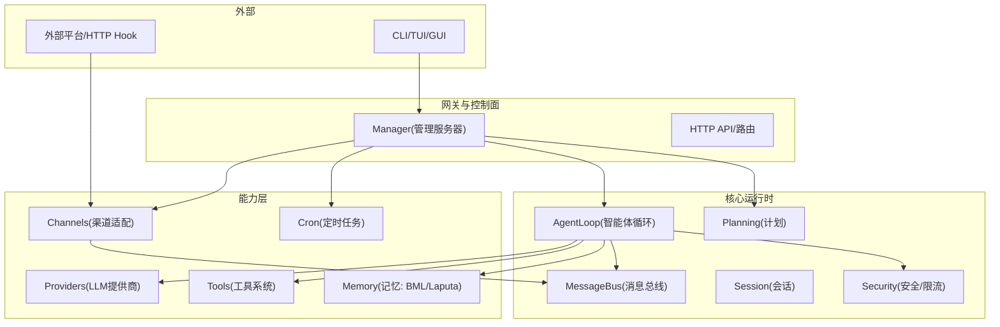
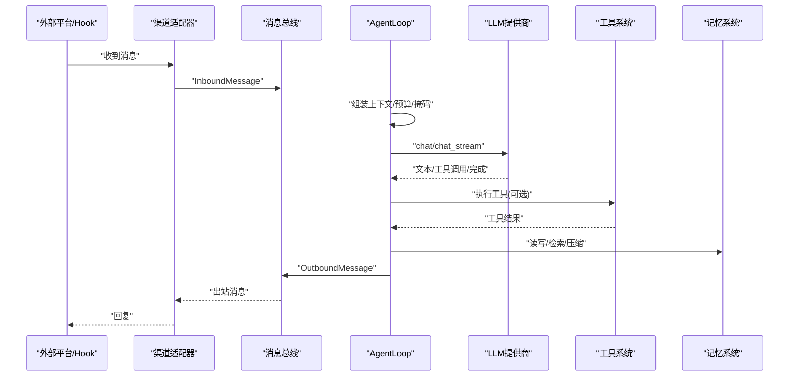
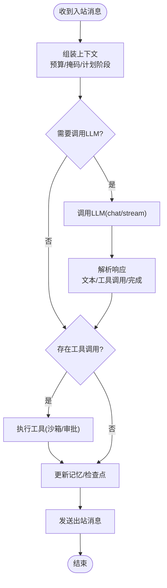
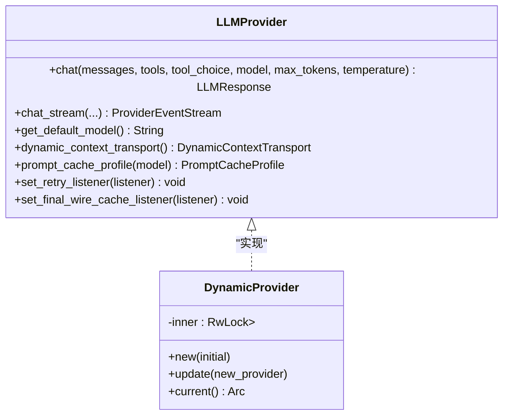
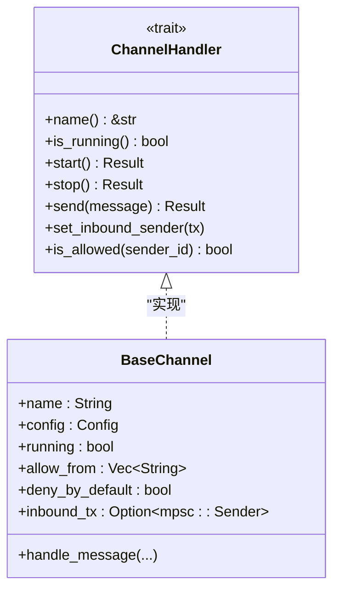
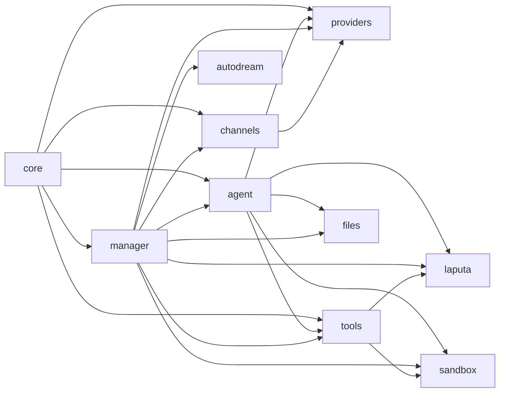

# 系统概览

<cite>
**本文引用的文件**
- [Cargo.toml](file://Cargo.toml)
- [README.md](file://README.md)
- [agent-diva-core/src/lib.rs](file://agent-diva-core/src/lib.rs)
- [agent-diva-core/src/bus/mod.rs](file://agent-diva-core/src/bus/mod.rs)
- [agent-diva-agent/src/lib.rs](file://agent-diva-agent/src/lib.rs)
- [agent-diva-agent/src/agent_loop.rs](file://agent-diva-agent/src/agent_loop.rs)
- [agent-diva-manager/src/lib.rs](file://agent-diva-manager/src/lib.rs)
- [agent-diva-manager/src/manager.rs](file://agent-diva-manager/src/manager.rs)
- [agent-diva-channels/src/lib.rs](file://agent-diva-channels/src/lib.rs)
- [agent-diva-channels/src/base.rs](file://agent-diva-channels/src/base.rs)
- [agent-diva-providers/src/lib.rs](file://agent-diva-providers/src/lib.rs)
- [agent-diva-providers/src/base.rs](file://agent-diva-providers/src/base.rs)
- [agent-diva-tools/src/lib.rs](file://agent-diva-tools/src/lib.rs)
</cite>

## 目录
1. [简介](#简介)
2. [项目结构](#项目结构)
3. [核心组件](#核心组件)
4. [架构总览](#架构总览)
5. [详细组件分析](#详细组件分析)
6. [依赖关系分析](#依赖关系分析)
7. [性能与扩展性](#性能与扩展性)
8. [故障排查指南](#故障排查指南)
9. [结论](#结论)

## 简介
Agent Diva 是一个自托管的个人 AI 网关，将多种聊天平台（如 Telegram、Discord、QQ、钉钉、飞书、邮件等）与 LLM 提供商连接起来。其核心由“智能体循环”驱动，通过消息总线解耦渠道与业务逻辑，结合记忆系统、工具系统、计划与治理、调度与审批等能力，提供可插拔的提供商、渠道与工具生态，并配套 CLI/TUI/GUI 三套交互界面。

## 项目结构
仓库采用 Rust Workspace 组织多个 crate，按职责分层：
- agent-diva-core：共享类型、配置、事件总线、会话、计划、安全、心跳、报告、令牌账本等基础能力。
- agent-diva-agent：智能体循环、上下文组装、技能加载、子智能体、工具装配与运行时控制。
- agent-diva-manager：本地网关进程与 HTTP 控制面，编排 Provider、Channel、Cron、规划与治理服务。
- agent-diva-providers：LLM 提供商抽象与实现（OpenAI 兼容、Anthropic、Ollama 等），模型能力与流式事件。
- agent-diva-channels：多渠道适配器（Telegram、Discord、QQ、钉钉、飞书、Email、NeuroLink 等）。
- agent-diva-tools：内置工具集（文件系统、Shell、Web、记忆、计划、MCP SDK 等）。
- agent-diva-laputa / agent-diva-autodream：BML 记忆存储与 Laputa 人格治理、AutoDream 提案生成。
- agent-diva-sandbox：沙箱策略与执行、审批协调。
- agent-diva-cli / agent-diva-service / agent-diva-gui：用户入口与服务封装。

图表来源
- [agent-diva-manager/src/manager.rs:27-44](file://agent-diva-manager/src/manager.rs#L27-L44)
- [agent-diva-agent/src/agent_loop.rs:110-153](file://agent-diva-agent/src/agent_loop.rs#L110-L153)
- [agent-diva-core/src/bus/mod.rs:1-14](file://agent-diva-core/src/bus/mod.rs#L1-L14)
- [agent-diva-channels/src/base.rs:9-32](file://agent-diva-channels/src/base.rs#L9-L32)
- [agent-diva-providers/src/base.rs:708-780](file://agent-diva-providers/src/base.rs#L708-L780)

章节来源
- [Cargo.toml:1-20](file://Cargo.toml#L1-L20)
- [README.md:87-108](file://README.md#L87-L108)

## 核心组件
- 智能体循环（AgentLoop）：负责接收入站消息、组装上下文、调用 LLM、执行工具、处理工具调用结果、更新会话与记忆，并通过消息总线回写出站消息。支持思考模式、预算控制、拒绝熔断、速率限制、子智能体与 MCP 工具集成。
- 记忆系统（BML + Laputa）：以 SQLite+FTS5 为单一权威存储；Laputa 在之上提供提案、治理、回滚与审计；AutoDream 作为提案生成器不直接写入人格状态。
- 提供商管理（Providers）：统一 LLMProvider 接口，支持多实现与动态切换（DynamicProvider）、模型能力探测、流式事件、重试与缓存策略。
- 渠道适配（Channels）：统一 ChannelHandler 接口，屏蔽各平台差异，接入消息总线；支持白名单/通配符访问控制。
- 工具系统（Tools）：注册表驱动的 ToolRegistry，内置文件系统、Shell、Web、记忆、计划、MCP 等工具，支持超时、审批、工作区隔离与后台任务。
- 管理与编排（Manager）：HTTP 控制面，聚合 Provider、Channel、Cron、规划、治理与文件服务，提供会话、计划、技能、MCP、工具等管理能力。

章节来源
- [agent-diva-agent/src/agent_loop.rs:110-153](file://agent-diva-agent/src/agent_loop.rs#L110-L153)
- [agent-diva-providers/src/lib.rs:46-124](file://agent-diva-providers/src/lib.rs#L46-L124)
- [agent-diva-channels/src/base.rs:9-32](file://agent-diva-channels/src/base.rs#L9-L32)
- [agent-diva-tools/src/lib.rs:1-74](file://agent-diva-tools/src/lib.rs#L1-L74)
- [agent-diva-manager/src/manager.rs:27-44](file://agent-diva-manager/src/manager.rs#L27-L44)

## 架构总览
Agent Diva 采用“网关 + 循环 + 能力层”的分层架构：
- 网关（Manager）暴露 HTTP API，统一管理 Provider、Channel、Cron、规划与治理，并将命令下发到 AgentLoop。
- 智能体循环（AgentLoop）是核心引擎，消费消息总线中的入站消息，组合上下文，调用 LLM 与工具，产出出站消息。
- 能力层包括 Providers、Channels、Tools、Memory、Planning、Security 等，均通过清晰接口与循环交互。
- 渠道适配器将外部平台消息转换为 InboundMessage 进入总线；AgentLoop 处理后通过 OutboundMessage 返回渠道或 GUI/CLI。

图表来源
- [agent-diva-core/src/bus/mod.rs:1-14](file://agent-diva-core/src/bus/mod.rs#L1-L14)
- [agent-diva-agent/src/agent_loop.rs:110-153](file://agent-diva-agent/src/agent_loop.rs#L110-L153)
- [agent-diva-providers/src/base.rs:708-780](file://agent-diva-providers/src/base.rs#L708-L780)
- [agent-diva-channels/src/base.rs:186-229](file://agent-diva-channels/src/base.rs#L186-L229)

## 详细组件分析

### 智能体循环（AgentLoop）
- 职责：维护会话、上下文、工具集、记忆提供者、子智能体管理器、安全与限流、思考模式、缓存观察、检查点更新等。
- 关键流程：
  - 构建工具集：根据工作区、网络配置、计划阶段、MCP 服务器、Cron、运行存储、掩码、执行会话等参数装配 ToolRegistry。
  - 消息处理：解析入站消息元数据（如审批策略），重建工具表面，调用 LLM，处理工具调用，更新记忆与检查点。
  - 安全与稳定性：拒绝熔断、每会话/每小时动作限制、全局超时、工作区隔离、子智能体资源限额。
- 扩展点：
  - 自定义工具：通过 ToolRegistry 注册。
  - 自定义记忆提供者：注入 MemoryProvider。
  - 运行时控制：支持动态设置审批策略、ask-user 协调器、MCP 更新等。

图表来源
- [agent-diva-agent/src/agent_loop.rs:258-312](file://agent-diva-agent/src/agent_loop.rs#L258-L312)
- [agent-diva-agent/src/agent_loop.rs:373-442](file://agent-diva-agent/src/agent_loop.rs#L373-L442)
- [agent-diva-agent/src/agent_loop.rs:473-558](file://agent-diva-agent/src/agent_loop.rs#L473-L558)

章节来源
- [agent-diva-agent/src/agent_loop.rs:110-153](file://agent-diva-agent/src/agent_loop.rs#L110-L153)
- [agent-diva-agent/src/agent_loop.rs:258-312](file://agent-diva-agent/src/agent_loop.rs#L258-L312)
- [agent-diva-agent/src/agent_loop.rs:373-442](file://agent-diva-agent/src/agent_loop.rs#L373-L442)
- [agent-diva-agent/src/agent_loop.rs:473-558](file://agent-diva-agent/src/agent_loop.rs#L473-L558)

### 提供商管理（Providers）
- 统一接口 LLMProvider：定义 chat/chat_stream、默认模型、动态上下文传输、提示词缓存策略、重试监听、最终线缓存监听等。
- 动态切换 DynamicProvider：运行时可替换底层实现，便于热更与灰度。
- 模型能力：基于模型 ID 与配置保守推断是否支持视觉、推理、工具与上下文窗口大小。
- 流式事件：LLMStreamEvent 支持增量文本、推理内容、工具调用增量与完成事件。

图表来源
- [agent-diva-providers/src/base.rs:708-780](file://agent-diva-providers/src/base.rs#L708-L780)
- [agent-diva-providers/src/lib.rs:46-124](file://agent-diva-providers/src/lib.rs#L46-L124)

章节来源
- [agent-diva-providers/src/base.rs:708-780](file://agent-diva-providers/src/base.rs#L708-L780)
- [agent-diva-providers/src/lib.rs:46-124](file://agent-diva-providers/src/lib.rs#L46-L124)

### 渠道适配（Channels）
- 统一接口 ChannelHandler：name、start/stop、send、set_inbound_sender、is_allowed。
- BaseChannel：提供通用能力，包括允许列表与通配符匹配、复合 ID 支持、入站消息封装与发送。
- 多平台实现：Telegram、Discord、QQ、钉钉、飞书、Email、NeuroLink 等，部分通过 Cargo feature 按需编译。

图表来源
- [agent-diva-channels/src/base.rs:9-32](file://agent-diva-channels/src/base.rs#L9-L32)
- [agent-diva-channels/src/base.rs:73-229](file://agent-diva-channels/src/base.rs#L73-L229)

章节来源
- [agent-diva-channels/src/lib.rs:1-53](file://agent-diva-channels/src/lib.rs#L1-L53)
- [agent-diva-channels/src/base.rs:9-32](file://agent-diva-channels/src/base.rs#L9-L32)
- [agent-diva-channels/src/base.rs:186-229](file://agent-diva-channels/src/base.rs#L186-L229)

### 工具系统（Tools）
- 工具注册表 ToolRegistry：支持分区注册、超时、延迟激活、工作区隔离、审批策略、MCP 工具发现与执行。
- 内置工具：文件系统、Shell、Web、记忆 CRUD、计划、技能、MCP SDK、后台任务、工作区检查点等。
- 与 AgentLoop 协作：按轮次重建工具表面，注入计划阶段、执行会话、背景任务上下文、MCP 服务器、Cron 服务等。

章节来源
- [agent-diva-tools/src/lib.rs:1-74](file://agent-diva-tools/src/lib.rs#L1-L74)
- [agent-diva-agent/src/agent_loop.rs:258-312](file://agent-diva-agent/src/agent_loop.rs#L258-L312)

### 管理与编排（Manager）
- 职责：聚合 Provider、Channel、Cron、规划、治理与文件服务；提供 HTTP 控制面；向 AgentLoop 下发运行时控制命令。
- 关键能力：会话标题生成、计划报告管理、MCP 配置刷新、技能重载、工具更新、渠道更新、提供商模型归一化等。

章节来源
- [agent-diva-manager/src/lib.rs:1-20](file://agent-diva-manager/src/lib.rs#L1-L20)
- [agent-diva-manager/src/manager.rs:27-44](file://agent-diva-manager/src/manager.rs#L27-L44)
- [agent-diva-manager/src/manager.rs:263-396](file://agent-diva-manager/src/manager.rs#L263-L396)

## 依赖关系分析
- 顶层 Workspace 声明了所有成员 crate，统一版本与依赖。
- 依赖层次：
  - core 被 agent、manager、channels、providers、tools 等广泛依赖。
  - agent 依赖 core、providers、tools、sandbox、laputa、files。
  - manager 依赖 core、agent、providers、channels、tools、sandbox、autodream、laputa、files。
  - channels 依赖 core、providers。
  - providers 依赖 core。
  - tools 依赖 core、files、laputa、tooling、sandbox。

图表来源
- [Cargo.toml:1-20](file://Cargo.toml#L1-L20)
- [agent-diva-agent/Cargo.toml:15-23](file://agent-diva-agent/Cargo.toml#L15-L23)
- [agent-diva-manager/Cargo.toml:31-44](file://agent-diva-manager/Cargo.toml#L31-L44)
- [agent-diva-channels/Cargo.toml:22-25](file://agent-diva-channels/Cargo.toml#L22-L25)
- [agent-diva-providers/Cargo.toml:12-14](file://agent-diva-providers/Cargo.toml#L12-L14)
- [agent-diva-tools/Cargo.toml:12-18](file://agent-diva-tools/Cargo.toml#L12-L18)

章节来源
- [Cargo.toml:1-20](file://Cargo.toml#L1-L20)

## 性能与扩展性
- 性能要点
  - 流式响应：Provider 层支持 chat_stream，降低首字节延迟。
  - 上下文预算与压缩：AgentLoop 内建上下文预算与记忆压缩，避免上下文膨胀。
  - 安全与限流：拒绝熔断、每小时动作限制、全局超时与工作区隔离，保障稳定性。
  - 缓存策略：Provider 可声明 prompt cache profile，减少重复请求成本。
- 扩展性设计
  - 新 LLM 提供商：实现 LLMProvider 接口，或通过 OpenAI 兼容客户端快速接入；使用 DynamicProvider 进行热切换。
  - 新聊天平台：实现 ChannelHandler 接口，注册到 ChannelManager，通过消息总线接入。
  - 自定义工具：实现 Tool 接口并注册到 ToolRegistry，可按需启用/禁用与分区管理。
  - 记忆与治理：通过 MemoryProvider 与 Laputa 治理接口扩展记忆与人格演化路径。

[本节为通用指导，不直接分析具体文件]

## 故障排查指南
- 渠道接入问题
  - 检查 ChannelHandler 的 is_allowed 与 allow_from 配置，确认发送者是否被允许。
  - 查看 handle_message 的入站消息封装与 inbound_tx 发送是否成功。
- 提供商调用失败
  - 关注 ProviderError 分类（重试/配置/致命），结合错误信息定位网络、鉴权或模型能力问题。
  - 使用 set_retry_listener 观察重试过程，必要时调整重试策略。
- 工具执行异常
  - 检查 ToolRegistry 的超时与审批策略，确认工作区隔离与沙箱策略。
  - 对于 MCP 工具，确认服务端连通性与协议兼容性。
- 会话与计划
  - 通过 Manager 提供的会话与计划 API 检查状态，必要时重置会话或恢复未完成的计划审批。

章节来源
- [agent-diva-channels/src/base.rs:186-229](file://agent-diva-channels/src/base.rs#L186-L229)
- [agent-diva-providers/src/base.rs:10-67](file://agent-diva-providers/src/base.rs#L10-L67)
- [agent-diva-manager/src/manager.rs:263-396](file://agent-diva-manager/src/manager.rs#L263-L396)

## 结论
Agent Diva 以清晰的模块化设计与稳定的核心接口，实现了“网关 + 循环 + 能力层”的可扩展架构。通过统一的 LLMProvider、ChannelHandler 与 ToolRegistry，系统能够灵活接入新的提供商、聊天平台与工具；配合记忆治理、计划与审批、调度与安全机制，提供了生产可用的个人 AI 助手平台。开发者可在不侵入核心逻辑的前提下，以插件方式扩展系统能力，满足多样化场景需求。