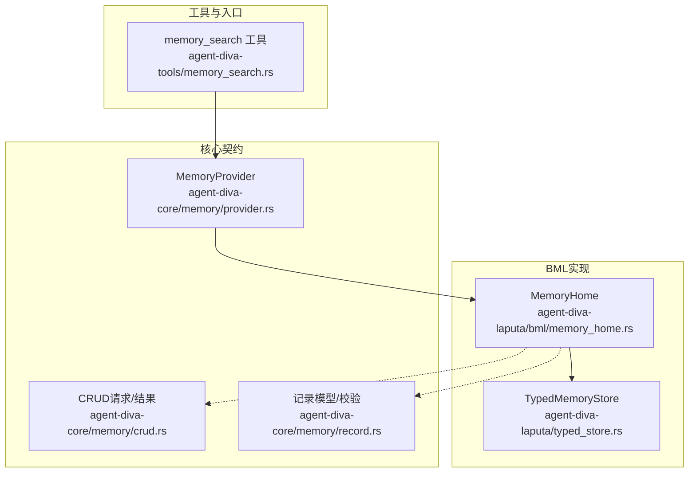
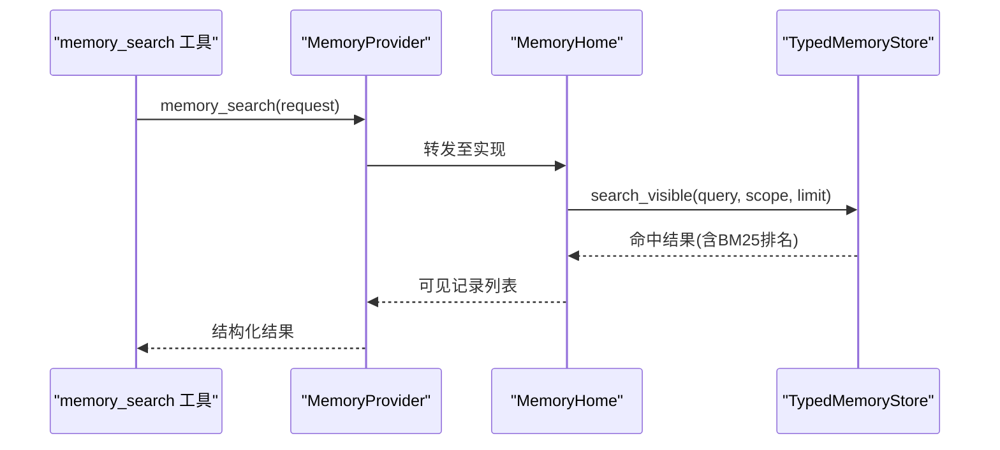
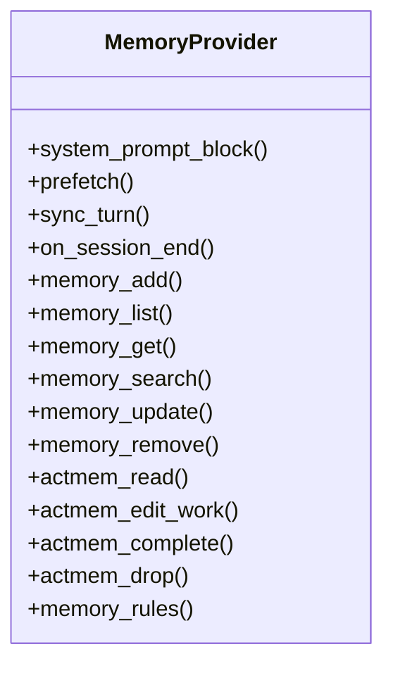
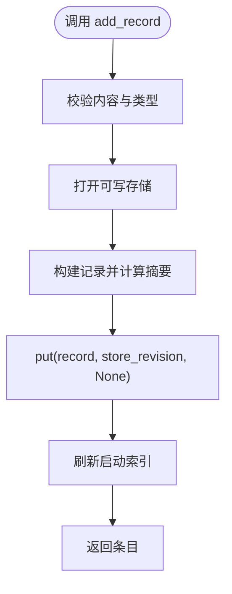
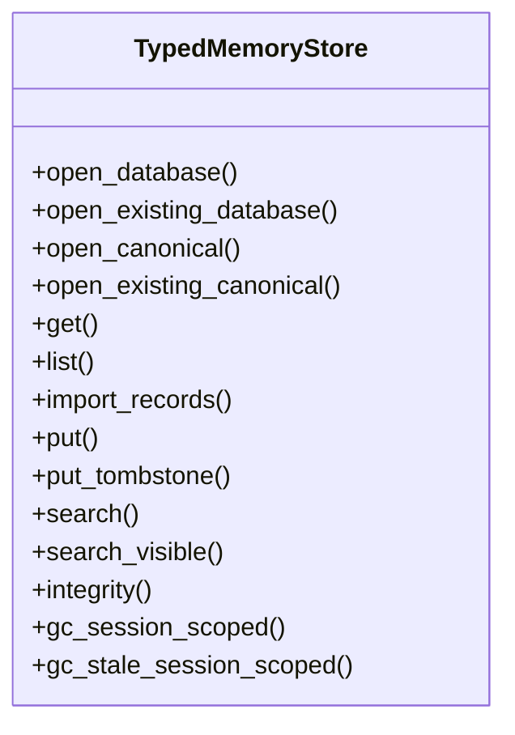
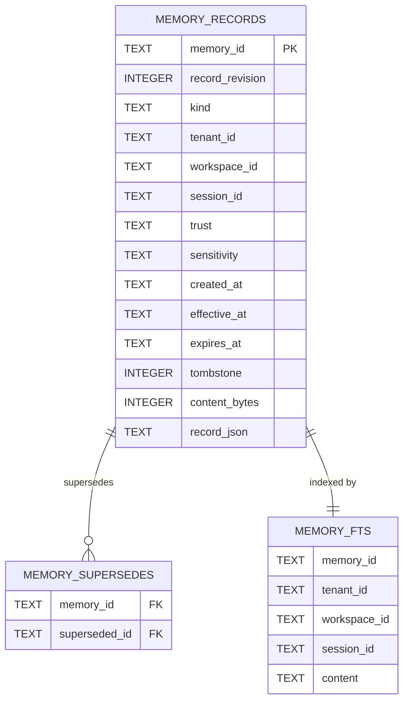
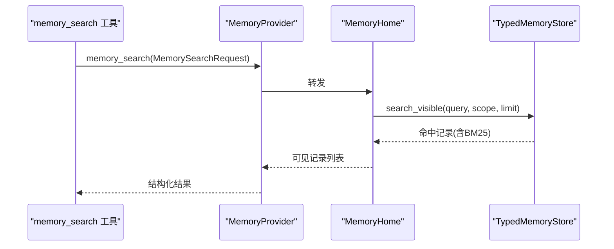
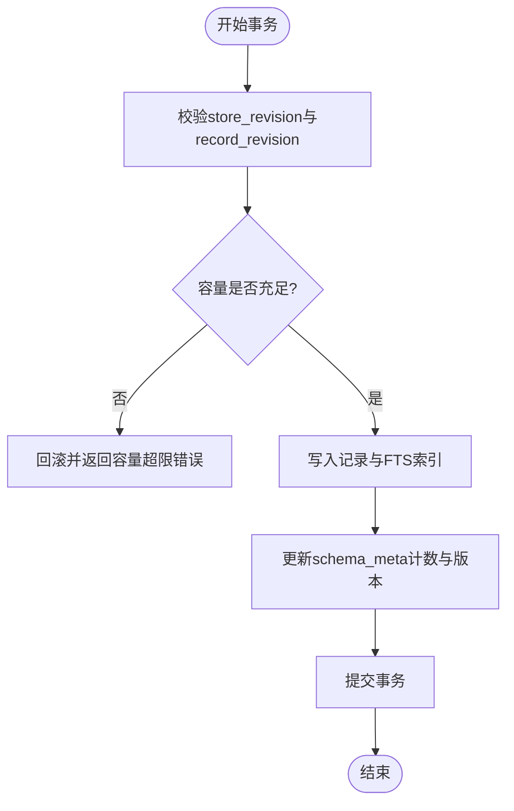

# BML接口规范

<cite>
**本文引用的文件**
- [agent-diva-laputa/src/bml/mod.rs](file://agent-diva-laputa/src/bml/mod.rs)
- [agent-diva-laputa/src/bml/memory_home.rs](file://agent-diva-laputa/src/bml/memory_home.rs)
- [agent-diva-core/src/memory/provider.rs](file://agent-diva-core/src/memory/provider.rs)
- [agent-diva-core/src/memory/crud.rs](file://agent-diva-core/src/memory/crud.rs)
- [agent-diva-core/src/memory/record.rs](file://agent-diva-core/src/memory/record.rs)
- [agent-diva-laputa/src/typed_store.rs](file://agent-diva-laputa/src/typed_store.rs)
- [agent-diva-tools/src/memory_search.rs](file://agent-diva-tools/src/memory_search.rs)
</cite>

## 目录
1. [简介](#简介)
2. [项目结构](#项目结构)
3. [核心组件](#核心组件)
4. [架构总览](#架构总览)
5. [详细组件分析](#详细组件分析)
6. [依赖关系分析](#依赖关系分析)
7. [性能考量](#性能考量)
8. [故障排查指南](#故障排查指南)
9. [结论](#结论)
10. [附录：扩展指南与最佳实践](#附录：扩展指南与最佳实践)

## 简介
本规范定义行为记忆层（BML）的职责与接口，统一记忆操作的CRUD、搜索、事务与一致性保障。BML以机器级SQLite + FTS5作为持久化权威存储，通过MemoryHome暴露生产可用的记忆能力；上层Agent-Diva通过稳定的MemoryProvider契约消费记忆服务，而不感知具体后端实现。

BML的核心目标：
- 提供统一的记忆抽象层，屏蔽底层存储细节。
- 保证记录的原子写入、版本冲突检测与数据一致性。
- 支持全文检索与可见性过滤的查询能力。
- 在会话与工作区维度上管理记录生命周期。
- 为新的存储后端提供清晰的适配扩展点。

## 项目结构
BML相关代码主要分布在以下模块：
- agent-diva-core/memory：定义跨进程/跨模块的稳定契约（请求/响应、提供者接口、记录模型）。
- agent-diva-laputa/bml：生产级BML权威实现（MemoryHome），封装TypedMemoryStore并提供启动索引、规则、ACTMEM等能力。
- agent-diva-laputa/typed_store：基于SQLite + FTS5的有界存储实现，负责事务、CAS、容量限制、完整性检查与迁移。
- agent-diva-tools/memory_search：面向工具的搜索入口，调用MemoryProvider进行全文检索。

**图表来源**
- [agent-diva-core/src/memory/provider.rs:414-617](file://agent-diva-core/src/memory/provider.rs#L414-L617)
- [agent-diva-core/src/memory/crud.rs:11-143](file://agent-diva-core/src/memory/crud.rs#L11-L143)
- [agent-diva-core/src/memory/record.rs:103-120](file://agent-diva-core/src/memory/record.rs#L103-L120)
- [agent-diva-laputa/src/bml/memory_home.rs:85-125](file://agent-diva-laputa/src/bml/memory_home.rs#L85-L125)
- [agent-diva-laputa/src/typed_store.rs:135-142](file://agent-diva-laputa/src/typed_store.rs#L135-L142)
- [agent-diva-tools/src/memory_search.rs:11-79](file://agent-diva-tools/src/memory_search.rs#L11-L79)

**章节来源**
- [agent-diva-laputa/src/bml/mod.rs:1-37](file://agent-diva-laputa/src/bml/mod.rs#L1-L37)
- [agent-diva-core/src/memory/mod.rs:1-47](file://agent-diva-core/src/memory/mod.rs#L1-L47)

## 核心组件
- MemoryProvider：Agent-Diva与长时记忆后端的稳定契约，包含系统提示注入、预取召回、回合同步、会话结束钩子以及CRUD/搜索/ACTMEM等能力。默认实现返回“不支持”，由MemoryHome在生产环境覆盖。
- MemoryHome：机器级BML权威，封装TypedMemoryStore，提供记录增删改查、搜索、启动索引刷新、会话清理、规则读写等。
- TypedMemoryStore：有界SQLite存储，提供事务化写入、CAS更新、软删除（墓碑）、FTS5全文检索、工作区隔离、容量限制与完整性报告。
- 记录模型与校验：MemoryRecord及其字段、信任等级、敏感度、范围与作用域；提供严格的校验规则，确保内容摘要一致、时间顺序合法、墓碑与替代关系正确。
- CRUD契约：统一的请求/响应类型，包括添加、列表、获取、搜索、更新、移除、蒸馏等。

**章节来源**
- [agent-diva-core/src/memory/provider.rs:414-617](file://agent-diva-core/src/memory/provider.rs#L414-L617)
- [agent-diva-core/src/memory/crud.rs:11-143](file://agent-diva-core/src/memory/crud.rs#L11-L143)
- [agent-diva-core/src/memory/record.rs:103-120](file://agent-diva-core/src/memory/record.rs#L103-L120)
- [agent-diva-laputa/src/bml/memory_home.rs:85-125](file://agent-diva-laputa/src/bml/memory_home.rs#L85-L125)
- [agent-diva-laputa/src/typed_store.rs:135-142](file://agent-diva-laputa/src/typed_store.rs#L135-L142)

## 架构总览
BML采用“契约+实现”的分层设计：
- 契约层（core）：定义MemoryProvider、CRUD请求/结果、记录模型与校验。
- 实现层（laputa）：MemoryHome作为唯一生产权威，内部持有TypedMemoryStore，负责事务、CAS、FTS5检索、工作区隔离、容量限制与完整性检查。
- 工具层（tools）：memory_search工具通过MemoryProvider调用搜索能力。

**图表来源**
- [agent-diva-tools/src/memory_search.rs:55-79](file://agent-diva-tools/src/memory_search.rs#L55-L79)
- [agent-diva-core/src/memory/provider.rs:501-508](file://agent-diva-core/src/memory/provider.rs#L501-L508)
- [agent-diva-laputa/src/bml/memory_home.rs:640-663](file://agent-diva-laputa/src/bml/memory_home.rs#L640-L663)
- [agent-diva-laputa/src/typed_store.rs:1120-1160](file://agent-diva-laputa/src/typed_store.rs#L1120-L1160)

## 详细组件分析

### MemoryProvider契约
- 职责：定义系统提示块生成、回合预取、回合同步、会话结束处理、记忆CRUD与搜索、ACTMEM读取与编辑、规则获取等。
- 关键约束：
  - system_prompt_block为同步方法，仅使用本地状态，不执行异步I/O。
  - prefetch为召回专用，不得做持久化写或会话结束工作。
  - sync_turn为持久化专用，不得用于回补启动提示或实时召回。
  - on_session_end需幂等，避免重复处理。
  - Markdown记忆仅在无Laputa工作区时为权威；若存在.laputa但无法打开，必须返回降级状态而非静默回退。

**图表来源**
- [agent-diva-core/src/memory/provider.rs:414-617](file://agent-diva-core/src/memory/provider.rs#L414-L617)

**章节来源**
- [agent-diva-core/src/memory/provider.rs:391-617](file://agent-diva-core/src/memory/provider.rs#L391-L617)

### MemoryHome（BML权威）
- 职责：唯一生产Memory authority，封装TypedMemoryStore，提供记录增删改查、搜索、启动索引刷新、会话清理、规则读写、ACTMEM集成。
- 关键特性：
  - 启动索引：维护轻量L1索引块，仅包含指针与预览，完整条目通过search/list获取。
  - 可见性过滤：排除被墓碑替代的记录。
  - 会话清理：按session_id物理删除工作记忆，或在启动时清理过期会话记录。
  - 规则文件：MEMRULES.MD加载与写入，支持默认与文件两种来源。

**图表来源**
- [agent-diva-laputa/src/bml/memory_home.rs:214-236](file://agent-diva-laputa/src/bml/memory_home.rs#L214-L236)
- [agent-diva-laputa/src/bml/memory_home.rs:394-418](file://agent-diva-laputa/src/bml/memory_home.rs#L394-L418)

**章节来源**
- [agent-diva-laputa/src/bml/memory_home.rs:85-125](file://agent-diva-laputa/src/bml/memory_home.rs#L85-L125)
- [agent-diva-laputa/src/bml/memory_home.rs:179-236](file://agent-diva-laputa/src/bml/memory_home.rs#L179-L236)
- [agent-diva-laputa/src/bml/memory_home.rs:348-392](file://agent-diva-laputa/src/bml/memory_home.rs#L348-L392)
- [agent-diva-laputa/src/bml/memory_home.rs:420-491](file://agent-diva-laputa/src/bml/memory_home.rs#L420-L491)

### TypedMemoryStore（SQLite + FTS5）
- 职责：有界存储实现，提供事务化写入、CAS更新、软删除、FTS5检索、工作区隔离、容量限制、完整性检查与迁移。
- 关键特性：
  - 事务与CAS：put/put_tombstone在事务内校验store_revision与record_revision，防止并发冲突。
  - 容量限制：限制记录数与内容字节总数，超限则拒绝写入。
  - 全文检索：FTS5虚拟表，支持按tenant/workspace/session过滤与BM25排序。
  - 可见性：superseded_target_ids用于排除被墓碑替代的记录。
  - 会话清理：gc_session_scoped与gc_stale_session_scoped按session_id物理删除。
  - 迁移：支持工作区身份升级与回滚，保留apply_journal表以保持向后兼容。

**图表来源**
- [agent-diva-laputa/src/typed_store.rs:135-142](file://agent-diva-laputa/src/typed_store.rs#L135-L142)
- [agent-diva-laputa/src/typed_store.rs:615-743](file://agent-diva-laputa/src/typed_store.rs#L615-L743)
- [agent-diva-laputa/src/typed_store.rs:881-1023](file://agent-diva-laputa/src/typed_store.rs#L881-L1023)
- [agent-diva-laputa/src/typed_store.rs:1120-1213](file://agent-diva-laputa/src/typed_store.rs#L1120-L1213)

**章节来源**
- [agent-diva-laputa/src/typed_store.rs:1-800](file://agent-diva-laputa/src/typed_store.rs#L1-L800)
- [agent-diva-laputa/src/typed_store.rs:857-1023](file://agent-diva-laputa/src/typed_store.rs#L857-L1023)
- [agent-diva-laputa/src/typed_store.rs:1108-1213](file://agent-diva-laputa/src/typed_store.rs#L1108-L1213)

### 记忆记录存储格式与序列化协议
- 记录模型：MemoryRecord包含id、kind、content、provenance、evidence_refs、confidence_bps、sensitivity、trust、scope、时间戳、supersedes、tombstone等字段。
- 序列化：JSON序列化，测试用例保证固定契约往返一致。
- 索引策略：
  - FTS5虚拟表：memory_fts包含memory_id、tenant_id、workspace_id、session_id、content，使用unicode61分词器。
  - 可见性：通过superseded_target_ids排除被墓碑替代的记录。
- 查询优化：
  - search_exact：精确session匹配。
  - search_visible：允许workspace全局记录与当前session记录合并，按effective_at降序与BM25排名。
  - 限制limit上限，避免过大结果集。

**图表来源**
- [agent-diva-laputa/src/typed_store.rs:476-589](file://agent-diva-laputa/src/typed_store.rs#L476-L589)
- [agent-diva-laputa/src/typed_store.rs:640-662](file://agent-diva-laputa/src/typed_store.rs#L640-L662)
- [agent-diva-laputa/src/typed_store.rs:1120-1160](file://agent-diva-laputa/src/typed_store.rs#L1120-L1160)

**章节来源**
- [agent-diva-core/src/memory/record.rs:103-120](file://agent-diva-core/src/memory/record.rs#L103-L120)
- [agent-diva-core/src/memory/record.rs:291-350](file://agent-diva-core/src/memory/record.rs#L291-L350)
- [agent-diva-laputa/src/typed_store.rs:476-589](file://agent-diva-laputa/src/typed_store.rs#L476-L589)
- [agent-diva-laputa/src/typed_store.rs:1120-1213](file://agent-diva-laputa/src/typed_store.rs#L1120-L1213)

### 记忆搜索API设计
- 入口：MemorySearchRequest包含query与可选limit。
- 实现：MemoryHome.memory_search调用search_records，后者使用TypedMemoryStore.search_visible进行FTS5检索与可见性过滤。
- 工具：memory_search工具解析参数并调用provider.memory_search，返回结构化结果。
- 语义搜索：当前实现基于FTS5全文检索；如需语义搜索，可在Provider层引入向量检索并融合BM25排名。

**图表来源**
- [agent-diva-tools/src/memory_search.rs:55-79](file://agent-diva-tools/src/memory_search.rs#L55-L79)
- [agent-diva-core/src/memory/crud.rs:35-42](file://agent-diva-core/src/memory/crud.rs#L35-L42)
- [agent-diva-laputa/src/bml/memory_home.rs:640-663](file://agent-diva-laputa/src/bml/memory_home.rs#L640-L663)
- [agent-diva-laputa/src/typed_store.rs:1162-1205](file://agent-diva-laputa/src/typed_store.rs#L1162-L1205)

**章节来源**
- [agent-diva-core/src/memory/crud.rs:35-42](file://agent-diva-core/src/memory/crud.rs#L35-L42)
- [agent-diva-laputa/src/bml/memory_home.rs:640-663](file://agent-diva-laputa/src/bml/memory_home.rs#L640-L663)
- [agent-diva-tools/src/memory_search.rs:11-79](file://agent-diva-tools/src/memory_search.rs#L11-L79)

### 事务处理机制与ACID特性
- 事务边界：所有写操作（put/import_records/垃圾回收）均在SQL事务中执行，失败时回滚。
- CAS更新：put与put_tombstone在事务内校验store_revision与record_revision，确保并发安全。
- 容量限制：在事务内计算next_count与next_bytes，超过阈值则拒绝写入。
- 一致性：schema_meta维护store_revision、record_count、content_bytes；FTS5与主表保持一致性。
- 恢复：支持工作区身份迁移与回滚，保留apply_journal表以兼容旧路径。

**图表来源**
- [agent-diva-laputa/src/typed_store.rs:881-1023](file://agent-diva-laputa/src/typed_store.rs#L881-L1023)
- [agent-diva-laputa/src/typed_store.rs:745-800](file://agent-diva-laputa/src/typed_store.rs#L745-L800)

**章节来源**
- [agent-diva-laputa/src/typed_store.rs:881-1023](file://agent-diva-laputa/src/typed_store.rs#L881-L1023)
- [agent-diva-laputa/src/typed_store.rs:745-800](file://agent-diva-laputa/src/typed_store.rs#L745-L800)

## 依赖关系分析
- MemoryProvider依赖core中的CRUD与记录模型，MemoryHome实现该契约并依赖TypedMemoryStore。
- TypedMemoryStore依赖SQLite池、FTS5、工作区标识与原子写入工具。
- memory_search工具依赖MemoryProvider，间接依赖MemoryHome与TypedMemoryStore。

**图表来源**
- [agent-diva-tools/src/memory_search.rs:55-79](file://agent-diva-tools/src/memory_search.rs#L55-L79)
- [agent-diva-core/src/memory/provider.rs:414-617](file://agent-diva-core/src/memory/provider.rs#L414-L617)
- [agent-diva-laputa/src/bml/memory_home.rs:85-125](file://agent-diva-laputa/src/bml/memory_home.rs#L85-L125)
- [agent-diva-laputa/src/typed_store.rs:135-142](file://agent-diva-laputa/src/typed_store.rs#L135-L142)

**章节来源**
- [agent-diva-core/src/memory/provider.rs:414-617](file://agent-diva-core/src/memory/provider.rs#L414-L617)
- [agent-diva-laputa/src/bml/memory_home.rs:85-125](file://agent-diva-laputa/src/bml/memory_home.rs#L85-L125)
- [agent-diva-laputa/src/typed_store.rs:135-142](file://agent-diva-laputa/src/typed_store.rs#L135-L142)

## 性能考量
- FTS5检索：使用BM25排名，限制limit上限，避免大结果集。
- 可见性过滤：通过superseded_target_ids一次性加载并过滤，减少多次查询。
- 会话清理：按session_id批量删除，尊重外键顺序（supersedes -> fts -> records）。
- 容量限制：在写入前预估next_count与next_bytes，防止存储膨胀。
- 连接池：SQLite池最大连接数为4，busy_timeout为5秒，平衡并发与稳定性。

[本节为通用指导，无需特定文件来源]

## 故障排查指南
- 常见错误：
  - 工作区不匹配：记录或数据库属于不同workspace_id。
  - 版本冲突：store_revision或record_revision不一致，需重试或重新获取最新状态。
  - 容量超限：记录数或内容字节超过限制，需清理或归档。
  - FTS不可用：SQLite未启用FTS5扩展，需检查运行时配置。
  - 备份无效：备份路径不存在或非有效数据库。
- 诊断步骤：
  - 使用integrity()获取存储健康状态，检查corrupt_record_ids与orphan_fts_rows。
  - 检查schema_meta中的store_revision与record_count是否与预期一致。
  - 查看FTS5表与主表的一致性，必要时重建索引。

**章节来源**
- [agent-diva-laputa/src/typed_store.rs:31-76](file://agent-diva-laputa/src/typed_store.rs#L31-L76)
- [agent-diva-laputa/src/typed_store.rs:1207-1213](file://agent-diva-laputa/src/typed_store.rs#L1207-L1213)

## 结论
BML通过MemoryProvider契约与MemoryHome实现，提供了稳定、一致、可扩展的记忆抽象层。TypedMemoryStore基于SQLite + FTS5实现了事务化写入、CAS更新、全文检索与容量限制，确保数据一致性与性能。上层工具与Agent通过稳定契约消费记忆能力，便于未来替换或扩展存储后端。

[本节为总结，无需特定文件来源]

## 附录：扩展指南与最佳实践
- 为新存储后端实现适配层：
  - 实现MemoryProvider接口，覆盖memory_*方法与ACTMEM相关方法。
  - 保持请求/响应类型为core中的domain结构，不泄露后端类型。
  - 对于全文检索，可结合向量检索与BM25排名，提供语义搜索能力。
  - 遵循事务与CAS约定，确保并发安全与一致性。
- 最佳实践：
  - 使用L1索引块提供轻量启动上下文，完整条目通过search/list获取。
  - 严格校验记录模型，确保内容摘要、时间顺序与墓碑关系正确。
  - 合理设置limit与预算，避免过大结果集影响性能。
  - 定期运行完整性检查与垃圾回收，保持存储健康。

[本节为通用指导，无需特定文件来源]