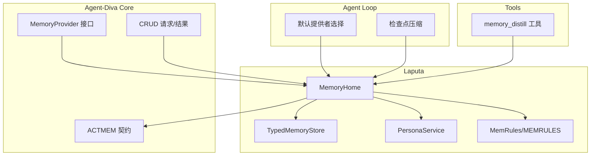
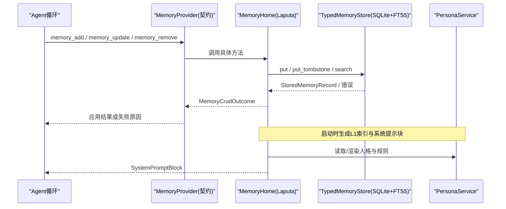
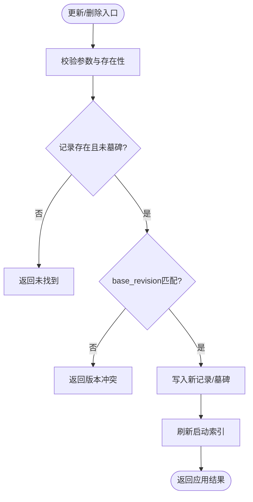
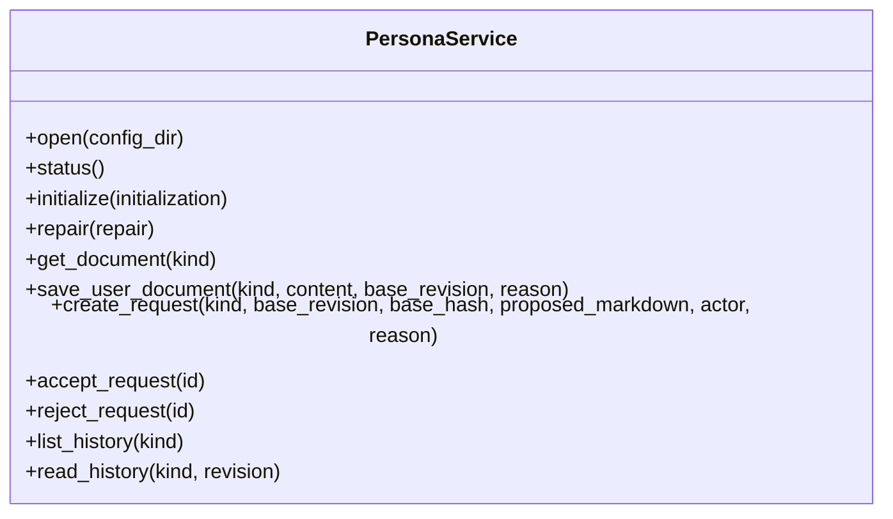
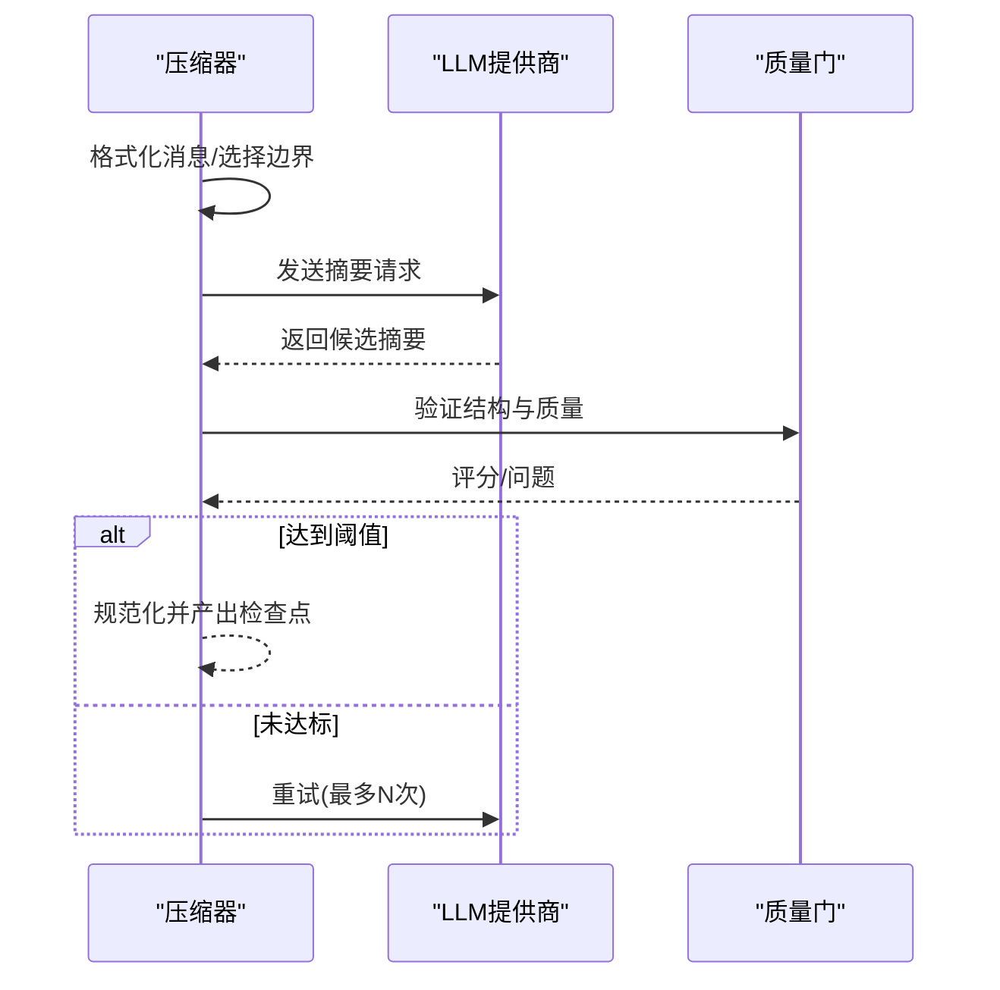
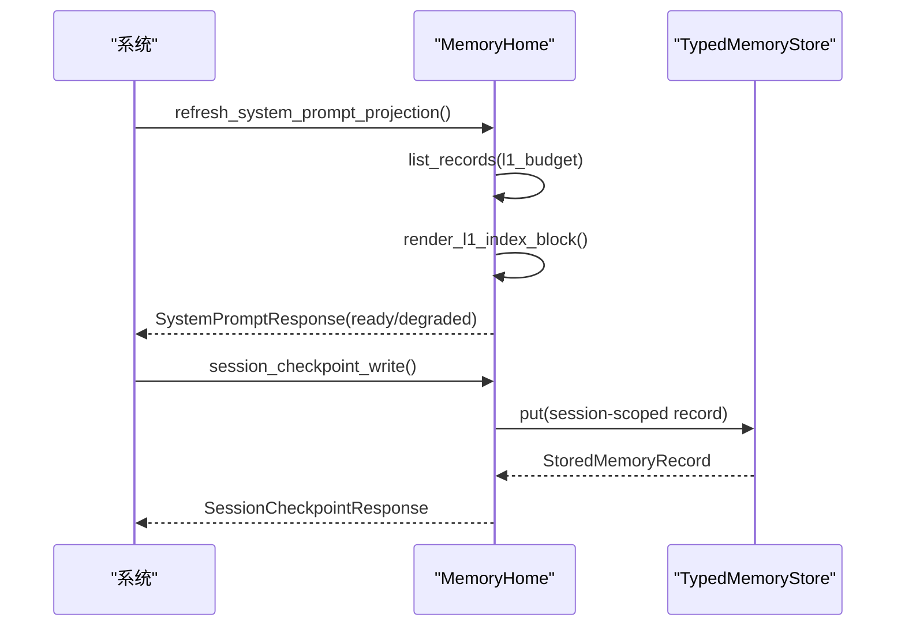
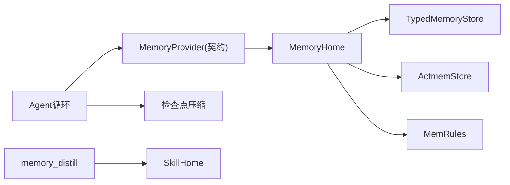
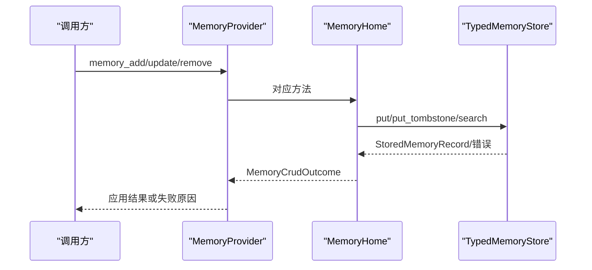
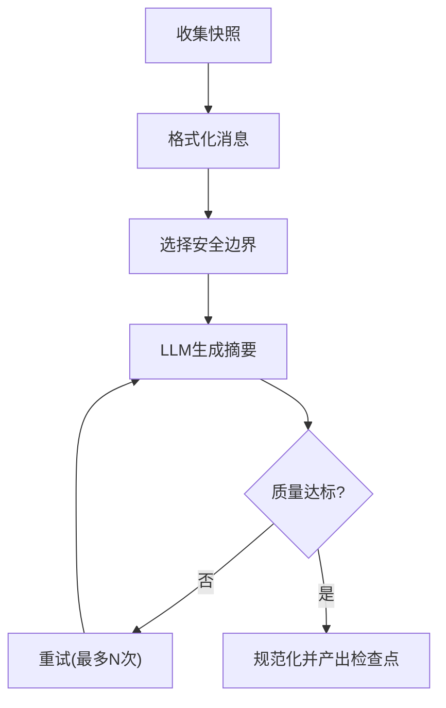

# Laputa记忆层边界

<cite>
**本文引用的文件**
- [agent-diva-laputa/src/lib.rs](file://agent-diva-laputa/src/lib.rs)
- [agent-diva-laputa/src/bml/mod.rs](file://agent-diva-laputa/src/bml/mod.rs)
- [agent-diva-laputa/src/bml/memory_home.rs](file://agent-diva-laputa/src/bml/memory_home.rs)
- [agent-diva-laputa/src/typed_store.rs](file://agent-diva-laputa/src/typed_store.rs)
- [agent-diva-core/src/memory/provider.rs](file://agent-diva-core/src/memory/provider.rs)
- [agent-diva-core/src/memory/crud.rs](file://agent-diva-core/src/memory/crud.rs)
- [agent-diva-core/src/memory/actmem.rs](file://agent-diva-core/src/memory/actmem.rs)
- [agent-diva-agent/src/memory_boundary.rs](file://agent-diva-agent/src/memory_boundary.rs)
- [agent-diva-agent/src/compaction/mod.rs](file://agent-diva-agent/src/compaction/mod.rs)
- [agent-diva-agent/src/compaction/compaction_exec.rs](file://agent-diva-agent/src/compaction/compaction_exec.rs)
- [agent-diva-tools/src/memory_distill.rs](file://agent-diva-tools/src/memory_distill.rs)
</cite>

## 目录
1. [简介](#简介)
2. [项目结构](#项目结构)
3. [核心组件](#核心组件)
4. [架构总览](#架构总览)
5. [详细组件分析](#详细组件分析)
6. [依赖关系分析](#依赖关系分析)
7. [性能与容量调优](#性能与容量调优)
8. [故障恢复与一致性](#故障恢复与一致性)
9. [结论](#结论)
10. [附录：关键流程与时序图](#附录：关键流程与时序图)

## 简介
本文件聚焦Laputa作为“记忆治理层”的边界与职责，明确其与BML（行为记忆层）存储抽象的关系，并系统阐述Persona服务边界、记忆生命周期与版本控制、BML接口契约（CRUD、查询、事务）、记忆压缩与蒸馏机制、跨进程同步与一致性策略，以及性能调优与故障恢复实践。目标是让非专业读者也能理解Laputa如何安全、可审计地管理机器级长期记忆与工作记忆。

## 项目结构
Laputa以“文件即权威”的方式组织记忆相关能力：
- BML逻辑层：通过MemoryHome暴露机器级SQLite+FTS5权威存储，提供长时记忆的CRUD、搜索、会话检查点等能力。
- Persona服务：基于Markdown的单一机器级人格权威，支持初始化、修复、变更请求审批流、历史快照与差异。
- ACTMEM与MEMRULES：工作记忆与记忆规则的可读/可写边界，受工具契约约束。
- TypedStore：类型化SQLite持久化，包含记录、墓碑、FTS索引、迁移与完整性校验。

**图表来源**
- [agent-diva-core/src/memory/provider.rs:414-617](file://agent-diva-core/src/memory/provider.rs#L414-L617)
- [agent-diva-core/src/memory/crud.rs:1-192](file://agent-diva-core/src/memory/crud.rs#L1-L192)
- [agent-diva-core/src/memory/actmem.rs:1-51](file://agent-diva-core/src/memory/actmem.rs#L1-L51)
- [agent-diva-laputa/src/bml/memory_home.rs:85-125](file://agent-diva-laputa/src/bml/memory_home.rs#L85-L125)
- [agent-diva-laputa/src/typed_store.rs:135-143](file://agent-diva-laputa/src/typed_store.rs#L135-L143)
- [agent-diva-agent/src/memory_boundary.rs:13-16](file://agent-diva-agent/src/memory_boundary.rs#L13-L16)
- [agent-diva-agent/src/compaction/mod.rs:1-33](file://agent-diva-agent/src/compaction/mod.rs#L1-L33)
- [agent-diva-tools/src/memory_distill.rs:13-133](file://agent-diva-tools/src/memory_distill.rs#L13-L133)

**章节来源**
- [agent-diva-laputa/src/lib.rs:1-56](file://agent-diva-laputa/src/lib.rs#L1-L56)
- [agent-diva-laputa/src/bml/mod.rs:1-37](file://agent-diva-laputa/src/bml/mod.rs#L1-L37)

## 核心组件
- MemoryProvider（Core）：定义启动注入、意图预取、回合同步、会话结束钩子及可选的CRUD/ACTMEM能力边界。实现者不得泄露传输细节，保持领域契约稳定。
- MemoryHome（Laputa）：唯一生产级BML权威，封装SQLite+FTS5读写、启动索引、会话检查点、MEMRULES读写、ACTMEM读取与编辑。
- TypedMemoryStore（Laputa）：类型化SQLite存储，负责记录持久化、墓碑覆盖、FTS索引、工作区身份迁移、容量限制与完整性报告。
- PersonaService（Laputa）：Markdown人格权威，提供状态视图、初始化、修复、文档读写、变更请求创建/接受/拒绝、历史快照与差异。
- 压缩与蒸馏（Agent/Tools）：检查点压缩将对话历史折叠为有质量阈值的替代摘要；经验蒸馏将可复用经验提案为Skill请求，不直接启用技能。

**章节来源**
- [agent-diva-core/src/memory/provider.rs:414-617](file://agent-diva-core/src/memory/provider.rs#L414-L617)
- [agent-diva-laputa/src/bml/memory_home.rs:85-125](file://agent-diva-laputa/src/bml/memory_home.rs#L85-L125)
- [agent-diva-laputa/src/typed_store.rs:135-143](file://agent-diva-laputa/src/typed_store.rs#L135-L143)
- [agent-diva-laputa/src/persona/service.rs:24-36](file://agent-diva-laputa/src/persona/service.rs#L24-L36)
- [agent-diva-agent/src/compaction/mod.rs:1-33](file://agent-diva-agent/src/compaction/mod.rs#L1-L33)
- [agent-diva-tools/src/memory_distill.rs:13-133](file://agent-diva-tools/src/memory_distill.rs#L13-L133)

## 架构总览
Laputa在Agent-Diva中承担“记忆治理层”角色：对外暴露稳定的MemoryProvider契约，对内统一调度BML存储、ACTMEM、MEMRULES与Persona Markdown权威。Agent循环通过默认提供者选择绑定到Machine-wide MemoryHome，所有长时记忆写入均经过该权威，确保一致性与可审计性。

**图表来源**
- [agent-diva-core/src/memory/provider.rs:414-617](file://agent-diva-core/src/memory/provider.rs#L414-L617)
- [agent-diva-laputa/src/bml/memory_home.rs:494-710](file://agent-diva-laputa/src/bml/memory_home.rs#L494-L710)
- [agent-diva-laputa/src/typed_store.rs:615-638](file://agent-diva-laputa/src/typed_store.rs#L615-L638)

## 详细组件分析

### BML接口与MemoryHome实现
- 职责边界：
  - 仅允许LongTerm写入，其他kind在生产BML中被禁止。
  - 列表/获取/搜索返回可见条目，自动过滤被墓碑覆盖的记录。
  - 更新/删除采用CAS（base_revision），冲突返回明确错误码。
  - 会话检查点按session_id隔离，支持清理与GC。
  - MEMRULES读写原子化，空内容拒绝。
- 数据模型：
  - MemoryEntry：id、content、trust、provenance、evidence_refs、revision、时间戳。
  - MemoryStoreMetadata：schema_version、store_revision、workspace_id。
  - StoredMemoryRecord：record + store-level revision。
- 查询语法：
  - 全文检索通过FTS5，search_visible结合scope过滤。
  - 列表按ID排序，limit受MAX_MEMORY_RECORDS保护。
- 事务处理：
  - 导入/删除/更新使用事务，保证一致性。
  - 墓碑记录supersedes边，读侧投影需排除被覆盖目标。

**图表来源**
- [agent-diva-laputa/src/bml/memory_home.rs:238-346](file://agent-diva-laputa/src/bml/memory_home.rs#L238-L346)
- [agent-diva-core/src/memory/crud.rs:44-67](file://agent-diva-core/src/memory/crud.rs#L44-L67)

**章节来源**
- [agent-diva-laputa/src/bml/memory_home.rs:35-125](file://agent-diva-laputa/src/bml/memory_home.rs#L35-L125)
- [agent-diva-core/src/memory/crud.rs:1-192](file://agent-diva-core/src/memory/crud.rs#L1-L192)
- [agent-diva-core/src/memory/provider.rs:414-617](file://agent-diva-core/src/memory/provider.rs#L414-L617)

### 人格（Persona）服务边界
- 权威范围：机器级配置根下的Markdown人格文件，含User/Dream/Dark/Identity/Relationship/Redline/World等类型。
- 生命周期：
  - 初始化：校验必填类型、归一化Markdown、原子写入并记录历史。
  - 修复：仅允许对Incomplete状态的非必需类型进行修复，避免覆盖有效内容。
  - 变更请求：Agent/AutoDream可按actor权限创建请求，支持接受/拒绝，拒绝后标记过期。
  - 历史：每个修订保存快照与unified diff，log.jsonl追加记录。
- 一致性：
  - 写入前比较base_revision与content_hash，冲突则拒绝。
  - 写入成功后使同kind的待处理请求失效。
- 安全与合规：
  - 内容长度限制、可见长度计算、用户/世界内容保护段校验。
  - 特定actor修改受限（如Agent不可改USER Observations）。

**图表来源**
- [agent-diva-laputa/src/persona/service.rs:24-36](file://agent-diva-laputa/src/persona/service.rs#L24-L36)
- [agent-diva-laputa/src/persona/service.rs:123-200](file://agent-diva-laputa/src/persona/service.rs#L123-L200)
- [agent-diva-laputa/src/persona/service.rs:258-385](file://agent-diva-laputa/src/persona/service.rs#L258-L385)
- [agent-diva-laputa/src/persona/service.rs:399-443](file://agent-diva-laputa/src/persona/service.rs#L399-L443)
- [agent-diva-laputa/src/persona/service.rs:492-580](file://agent-diva-laputa/src/persona/service.rs#L492-L580)

**章节来源**
- [agent-diva-laputa/src/persona/service.rs:24-36](file://agent-diva-laputa/src/persona/service.rs#L24-L36)
- [agent-diva-laputa/src/persona/service.rs:123-200](file://agent-diva-laputa/src/persona/service.rs#L123-L200)
- [agent-diva-laputa/src/persona/service.rs:258-385](file://agent-diva-laputa/src/persona/service.rs#L258-L385)
- [agent-diva-laputa/src/persona/service.rs:492-580](file://agent-diva-laputa/src/persona/service.rs#L492-L580)

### 记忆压缩与蒸馏
- 检查点压缩：
  - 输入：上一检查点、完整消息、当前回合消息、非压缩底线。
  - 过程：格式化消息、选择安全压缩边界（工具组/用户边界）、LLM生成摘要、质量门限校验、规范化输出。
  - 输出：CanonicalCheckpoint（body、指标、问题、重试次数），替换旧检查点。
- 经验蒸馏：
  - 工具memory_distill创建Skill提案请求，附带证据（会话键、ACTMEM指针、artifact），不直接启用技能。
  - 通过SkillHome管理提案生命周期，确保可审查与回滚。

**图表来源**
- [agent-diva-agent/src/compaction/compaction_exec.rs:94-247](file://agent-diva-agent/src/compaction/compaction_exec.rs#L94-L247)
- [agent-diva-agent/src/compaction/compaction_exec.rs:306-328](file://agent-diva-agent/src/compaction/compaction_exec.rs#L306-L328)
- [agent-diva-tools/src/memory_distill.rs:91-133](file://agent-diva-tools/src/memory_distill.rs#L91-L133)

**章节来源**
- [agent-diva-agent/src/compaction/mod.rs:1-33](file://agent-diva-agent/src/compaction/mod.rs#L1-L33)
- [agent-diva-agent/src/compaction/compaction_exec.rs:94-247](file://agent-diva-agent/src/compaction/compaction_exec.rs#L94-L247)
- [agent-diva-tools/src/memory_distill.rs:91-133](file://agent-diva-tools/src/memory_distill.rs#L91-L133)

### 记忆同步与会话检查点
- 启动系统提示：
  - MemoryHome维护startup_markdown与revision，列出最近长时记忆并渲染L1索引，结合MEMRULES指针形成紧凑Markdown注入系统提示。
- 会话检查点：
  - 写入会话检查点（SessionCheckpointWriteRequest），按session_id隔离，支持清理与GC。
  - 会话结束时可通过on_session_end触发清理。
- 同步语义：
  - sync_turn用于回合后持久化，provider可返回Persisted/Noop/Failed。
  - prefetch用于回合内意图感知召回，失败不应中断回合。

**图表来源**
- [agent-diva-laputa/src/bml/memory_home.rs:394-418](file://agent-diva-laputa/src/bml/memory_home.rs#L394-L418)
- [agent-diva-laputa/src/bml/memory_home.rs:439-491](file://agent-diva-laputa/src/bml/memory_home.rs#L439-L491)
- [agent-diva-core/src/memory/provider.rs:414-464](file://agent-diva-core/src/memory/provider.rs#L414-L464)

**章节来源**
- [agent-diva-laputa/src/bml/memory_home.rs:394-491](file://agent-diva-laputa/src/bml/memory_home.rs#L394-L491)
- [agent-diva-core/src/memory/provider.rs:414-464](file://agent-diva-core/src/memory/provider.rs#L414-L464)

### ACTMEM与MEMRULES
- ACTMEM：
  - 读取Pulse/Recap/Work/Head/Capsules/Capsule，带revision与截断保护。
  - 编辑Work与完成/丢弃Open项，使用CAS确保并发安全。
- MEMRULES：
  - 读取/写入规则文件，空内容拒绝，原子写入保证一致性。
  - 作为系统提示的一部分参与启动上下文。

**章节来源**
- [agent-diva-core/src/memory/actmem.rs:1-51](file://agent-diva-core/src/memory/actmem.rs#L1-L51)
- [agent-diva-laputa/src/bml/memory_home.rs:348-372](file://agent-diva-laputa/src/bml/memory_home.rs#L348-L372)
- [agent-diva-laputa/src/bml/memory_home.rs:712-796](file://agent-diva-laputa/src/bml/memory_home.rs#L712-L796)

## 依赖关系分析
- Agent循环依赖Core的MemoryProvider契约，默认实现为Laputa的MemoryHome。
- MemoryHome依赖TypedMemoryStore进行持久化，依赖ActmemStore进行工作记忆操作，依赖MemRules进行规则加载。
- PersonaService独立于BML，但共享原子写入与Markdown处理工具。
- 压缩模块依赖LLMProvider与质量门，蒸馏工具依赖SkillHome。

**图表来源**
- [agent-diva-agent/src/memory_boundary.rs:13-16](file://agent-diva-agent/src/memory_boundary.rs#L13-L16)
- [agent-diva-laputa/src/bml/memory_home.rs:85-125](file://agent-diva-laputa/src/bml/memory_home.rs#L85-L125)
- [agent-diva-laputa/src/typed_store.rs:135-143](file://agent-diva-laputa/src/typed_store.rs#L135-L143)
- [agent-diva-tools/src/memory_distill.rs:91-133](file://agent-diva-tools/src/memory_distill.rs#L91-L133)

**章节来源**
- [agent-diva-agent/src/memory_boundary.rs:13-16](file://agent-diva-agent/src/memory_boundary.rs#L13-L16)
- [agent-diva-laputa/src/bml/memory_home.rs:85-125](file://agent-diva-laputa/src/bml/memory_home.rs#L85-L125)
- [agent-diva-laputa/src/typed_store.rs:135-143](file://agent-diva-laputa/src/typed_store.rs#L135-L143)

## 性能与容量调优
- 存储容量：
  - MAX_MEMORY_RECORDS与MAX_MEMORY_CONTENT_BYTES限制记录数与内容总量，防止无限增长。
  - FTS5行计数与孤儿行检测用于健康度评估。
- 连接池与并发：
  - SQLite连接池最大连接数为4，WAL模式提升并发读性能。
  - busy_timeout=5s缓解短暂锁竞争。
- 启动索引预算：
  - L1索引行数可配置，控制系统提示体积。
- 压缩质量与重试：
  - 检查点压缩设置质量阈值与最大重试次数，避免低质量摘要污染上下文。
- 建议：
  - 在高并发场景下监控SQLite忙超时与FTS索引重建成本。
  - 合理设置L1预算与keep_recent_count，平衡上下文大小与回溯能力。
  - 定期运行完整性检查与GC，清理会话残留。

**章节来源**
- [agent-diva-laputa/src/typed_store.rs:22-29](file://agent-diva-laputa/src/typed_store.rs#L22-L29)
- [agent-diva-laputa/src/typed_store.rs:171-179](file://agent-diva-laputa/src/typed_store.rs#L171-L179)
- [agent-diva-laputa/src/bml/memory_home.rs:107-125](file://agent-diva-laputa/src/bml/memory_home.rs#L107-L125)
- [agent-diva-agent/src/compaction/compaction_exec.rs:145-198](file://agent-diva-agent/src/compaction/compaction_exec.rs#L145-L198)

## 故障恢复与一致性
- 版本冲突：
  - 更新/删除使用base_revision进行CAS，冲突返回明确错误码。
  - Persona服务同时比较content_hash，避免重复写入。
- 墓碑与覆盖：
  - 删除通过墓碑记录supersedes边，读侧投影排除被覆盖目标。
  - 会话检查点物理删除，无需审计轨迹。
- 迁移与回滚：
  - 工作区身份迁移提供备份与manifest，支持回滚到迁移前状态。
  - 导入记录时校验workspace_id与store_revision，冲突中止。
- 可用性降级：
  - 启动时若数据库不存在，返回空索引与降级提示。
  - prefetch失败不中断回合，返回Skipped/Failed状态。

**章节来源**
- [agent-diva-laputa/src/bml/memory_home.rs:238-346](file://agent-diva-laputa/src/bml/memory_home.rs#L238-L346)
- [agent-diva-laputa/src/persona/service.rs:492-580](file://agent-diva-laputa/src/persona/service.rs#L492-L580)
- [agent-diva-laputa/src/typed_store.rs:239-325](file://agent-diva-laputa/src/typed_store.rs#L239-L325)
- [agent-diva-core/src/memory/provider.rs:449-464](file://agent-diva-core/src/memory/provider.rs#L449-L464)

## 结论
Laputa通过清晰的边界将记忆治理与存储实现解耦：Core定义稳定契约，Laputa提供机器级权威存储与人格管理，Agent循环通过默认提供者接入。记忆生命周期由CAS、墓碑、会话隔离与GC保障；压缩与蒸馏在保持语义完整性的同时优化上下文与空间；迁移与回滚机制确保数据安全。遵循本文档的实践可有效提升系统的可靠性、可维护性与可扩展性。

## 附录：关键流程与时序图

### 记忆CRUD时序

**图表来源**
- [agent-diva-core/src/memory/provider.rs:471-526](file://agent-diva-core/src/memory/provider.rs#L471-L526)
- [agent-diva-laputa/src/bml/memory_home.rs:583-710](file://agent-diva-laputa/src/bml/memory_home.rs#L583-L710)
- [agent-diva-laputa/src/typed_store.rs:615-638](file://agent-diva-laputa/src/typed_store.rs#L615-L638)

### 检查点压缩流程

**图表来源**
- [agent-diva-agent/src/compaction/compaction_exec.rs:94-247](file://agent-diva-agent/src/compaction/compaction_exec.rs#L94-L247)
- [agent-diva-agent/src/compaction/compaction_exec.rs:306-328](file://agent-diva-agent/src/compaction/compaction_exec.rs#L306-L328)