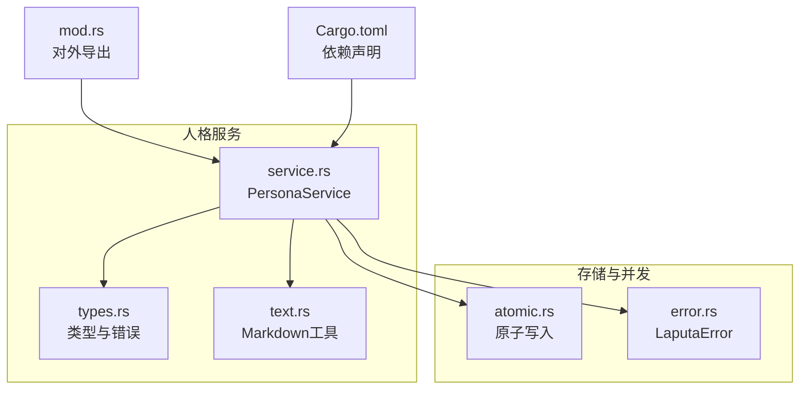
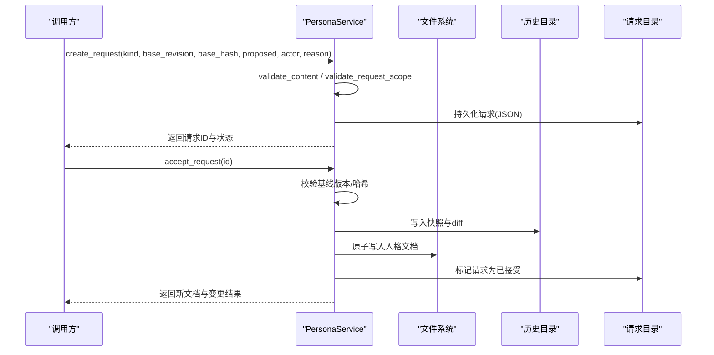
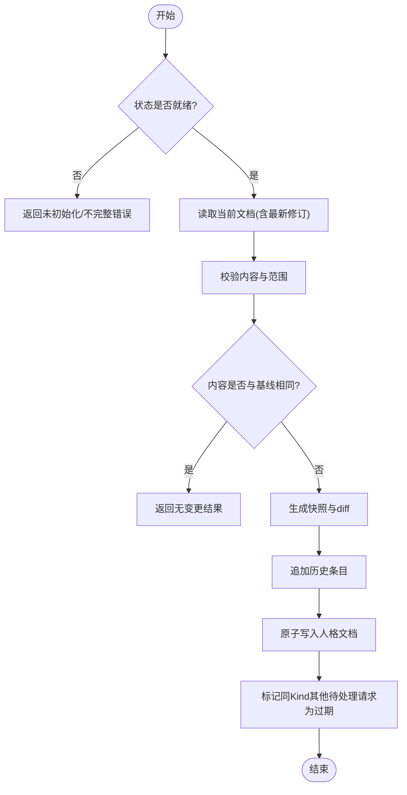
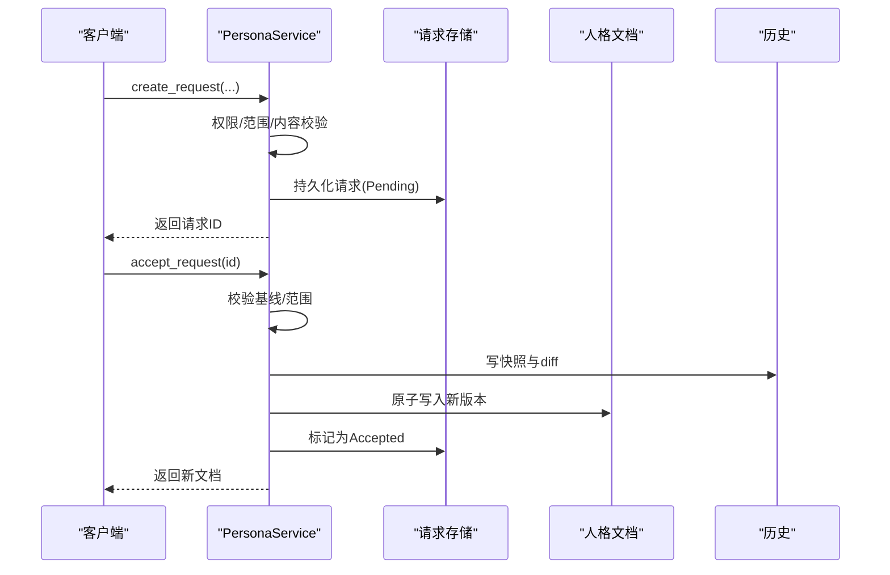
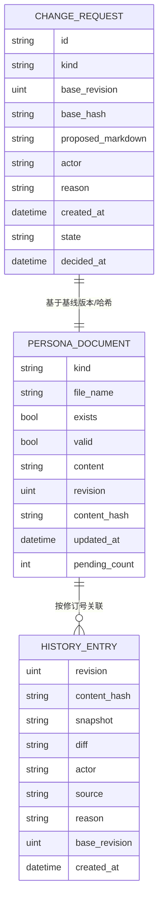
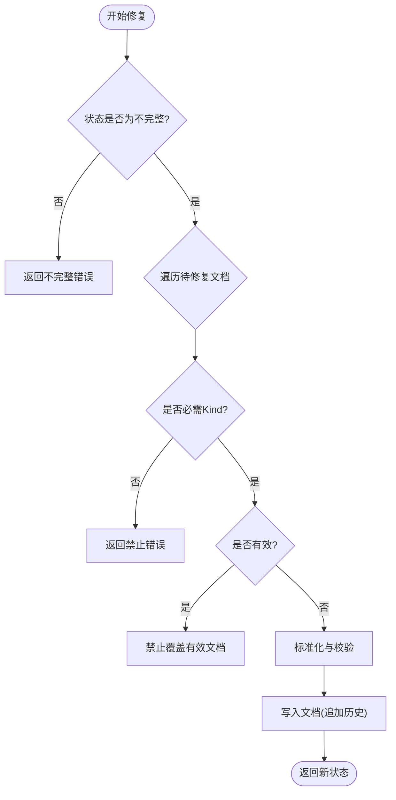
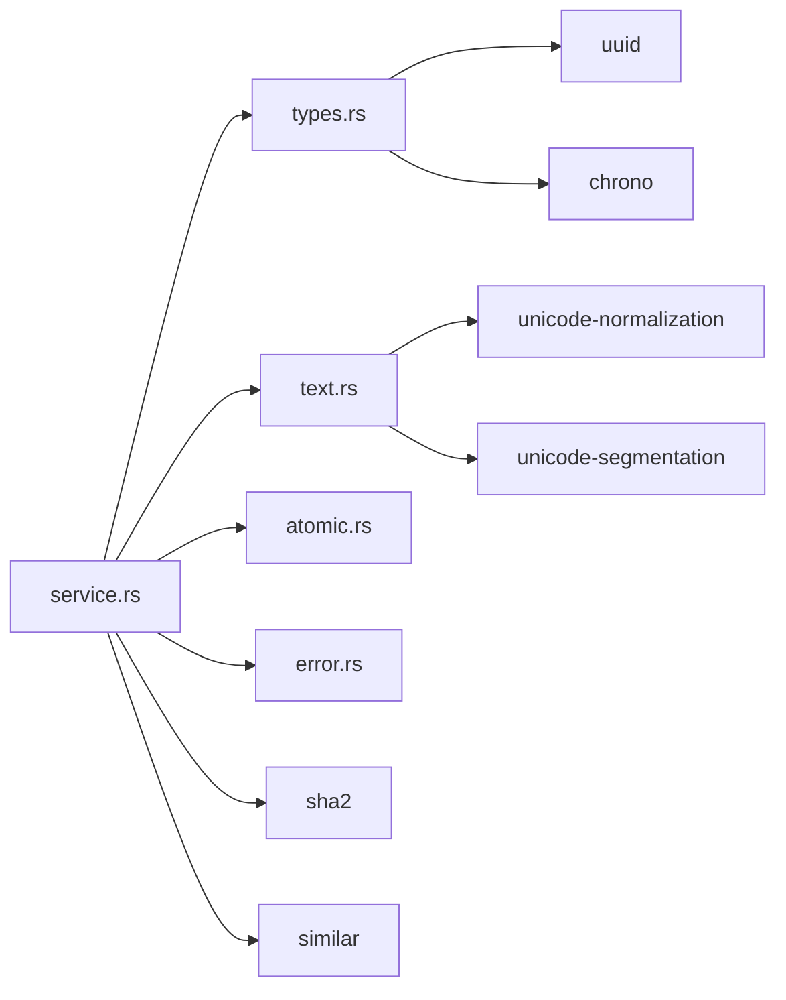

# 人格服务边界

<cite>
**本文引用的文件**
- [agent-diva-laputa/src/persona/mod.rs](file://agent-diva-laputa/src/persona/mod.rs)
- [agent-diva-laputa/src/persona/service.rs](file://agent-diva-laputa/src/persona/service.rs)
- [agent-diva-laputa/src/persona/types.rs](file://agent-diva-laputa/src/persona/types.rs)
- [agent-diva-laputa/src/persona/text.rs](file://agent-diva-laputa/src/persona/text.rs)
- [agent-diva-laputa/src/atomic.rs](file://agent-diva-laputa/src/atomic.rs)
- [agent-diva-laputa/src/error.rs](file://agent-diva-laputa/src/error.rs)
- [agent-diva-laputa/Cargo.toml](file://agent-diva-laputa/Cargo.toml)
</cite>

## 目录
1. [简介](#简介)
2. [项目结构](#项目结构)
3. [核心组件](#核心组件)
4. [架构总览](#架构总览)
5. [详细组件分析](#详细组件分析)
6. [依赖关系分析](#依赖关系分析)
7. [性能考虑](#性能考虑)
8. [故障排查指南](#故障排查指南)
9. [结论](#结论)
10. [附录](#附录)

## 简介
本文件面向Laputa人格服务的边界与实现，聚焦PersonaService的核心职责：人格文档的生命周期管理、版本控制与状态同步；变更请求的验证、审批与执行；人格文件的存储格式与元数据管理；历史记录维护策略；人格修复（PersonaRepair）机制；并发安全保证与错误处理策略；以及配置选项与性能调优建议。目标是帮助读者在不深入源码的情况下理解系统如何安全、可审计地演进“人格”这一关键资产。

## 项目结构
Laputa的人格模块以“文件优先”的方式组织，所有持久化状态均落在配置根目录下的persona子目录中，包含当前人格文档、历史快照与差异、变更请求等。文本规范化、可见长度计算、段落提取等工具函数独立成模块，便于复用与测试。原子写入与统一错误类型由laputa通用层提供，确保跨模块一致性与可靠性。

**图示来源**
- [agent-diva-laputa/src/persona/mod.rs:1-14](file://agent-diva-laputa/src/persona/mod.rs#L1-L14)
- [agent-diva-laputa/src/persona/service.rs:1-40](file://agent-diva-laputa/src/persona/service.rs#L1-L40)
- [agent-diva-laputa/src/persona/types.rs:1-30](file://agent-diva-laputa/src/persona/types.rs#L1-L30)
- [agent-diva-laputa/src/persona/text.rs:1-20](file://agent-diva-laputa/src/persona/text.rs#L1-L20)
- [agent-diva-laputa/src/atomic.rs:1-20](file://agent-diva-laputa/src/atomic.rs#L1-L20)
- [agent-diva-laputa/src/error.rs:1-20](file://agent-diva-laputa/src/error.rs#L1-L20)
- [agent-diva-laputa/Cargo.toml:11-25](file://agent-diva-laputa/Cargo.toml#L11-L25)

**章节来源**
- [agent-diva-laputa/src/persona/mod.rs:1-14](file://agent-diva-laputa/src/persona/mod.rs#L1-L14)
- [agent-diva-laputa/Cargo.toml:11-25](file://agent-diva-laputa/Cargo.toml#L11-L25)

## 核心组件
- PersonaService：人格服务的核心入口，负责打开工作目录、初始化、读取/写入文档、创建/审批/拒绝变更请求、查询状态与历史、执行修复等。
- 类型与错误：定义人格种类、状态、文档、历史、请求、写入来源、错误码等，贯穿整个服务。
- Markdown工具：提供标准化、可见长度统计、段落提取与替换，确保内容一致性、容量限制与结构化校验。
- 原子写入：通过临时文件+重命名实现无中断更新，并同步父目录，避免部分写入导致的损坏。
- Laputa错误：统一的I/O、JSON、锁超时等错误封装，便于上层调用方识别与处理。

**章节来源**
- [agent-diva-laputa/src/persona/service.rs:19-40](file://agent-diva-laputa/src/persona/service.rs#L19-L40)
- [agent-diva-laputa/src/persona/types.rs:6-123](file://agent-diva-laputa/src/persona/types.rs#L6-L123)
- [agent-diva-laputa/src/persona/text.rs:4-20](file://agent-diva-laputa/src/persona/text.rs#L4-L20)
- [agent-diva-laputa/src/atomic.rs:15-36](file://agent-diva-laputa/src/atomic.rs#L15-L36)
- [agent-diva-laputa/src/error.rs:7-34](file://agent-diva-laputa/src/error.rs#L7-L34)

## 架构总览
PersonaService围绕“文件+历史+请求”的三元模型构建：
- 人格文档：每个PersonaKind对应一个Markdown文件，作为当前版本。
- 历史日志：按修订号递增记录，保存快照与差异，支持回溯与审计。
- 变更请求：Agent或AutoDream发起的变更需经审批流程，避免越权修改。

**图示来源**
- [agent-diva-laputa/src/persona/service.rs:258-321](file://agent-diva-laputa/src/persona/service.rs#L258-L321)
- [agent-diva-laputa/src/persona/service.rs:346-385](file://agent-diva-laputa/src/persona/service.rs#L346-L385)
- [agent-diva-laputa/src/persona/service.rs:492-580](file://agent-diva-laputa/src/persona/service.rs#L492-L580)
- [agent-diva-laputa/src/atomic.rs:15-36](file://agent-diva-laputa/src/atomic.rs#L15-L36)

## 详细组件分析

### PersonaService：生命周期、版本与状态同步
- 打开与初始化：open创建persona根目录及history、requests子目录，清理残留暂存目录；initialize将必需的人格文档写入并建立初始历史，User文档自动注入Preferences段。
- 状态视图：status聚合各Kind的存在性、有效性、修订号、更新时间与待处理请求数，并给出整体状态（未初始化/就绪/不完整）。
- 读取与写入：get_document在就绪或不完整状态下允许读取；save_user_document与save_agent_p16分别用于用户直接编辑与Agent对特定段的P16写入；write_document_core负责版本检查、去重、生成快照与diff、追加历史、原子写入主文档，并在写入后使其他待处理请求失效。
- 修复：repair仅允许覆盖不完整的必需文档，且不会覆盖有效文档；User文档同样会注入Preferences段。

**图示来源**
- [agent-diva-laputa/src/persona/service.rs:492-580](file://agent-diva-laputa/src/persona/service.rs#L492-L580)
- [agent-diva-laputa/src/persona/service.rs:590-645](file://agent-diva-laputa/src/persona/service.rs#L590-L645)
- [agent-diva-laputa/src/persona/service.rs:665-680](file://agent-diva-laputa/src/persona/service.rs#L665-L680)

**章节来源**
- [agent-diva-laputa/src/persona/service.rs:24-121](file://agent-diva-laputa/src/persona/service.rs#L24-L121)
- [agent-diva-laputa/src/persona/service.rs:123-200](file://agent-diva-laputa/src/persona/service.rs#L123-L200)
- [agent-diva-laputa/src/persona/service.rs:202-256](file://agent-diva-laputa/src/persona/service.rs#L202-L256)
- [agent-diva-laputa/src/persona/service.rs:492-580](file://agent-diva-laputa/src/persona/service.rs#L492-L580)

### 变更请求：验证、审批与执行
- 创建请求：create_request校验Actor权限、禁止重复待处理请求、校验基线版本与哈希、规范化与内容校验、范围校验（如USER Observations与World保护），持久化请求。
- 列表与获取：list_requests按时间倒序列出；get_request从请求目录读取单个请求。
- 审批流程：accept_request再次校验基线与范围，根据Actor选择写入来源，写入文档并标记请求为已接受；reject_request标记为拒绝；两者均要求当前状态为就绪。
- 过期处理：任何成功写入都会调用stale_pending，将同Kind的其他待处理请求标记为过期，防止并发冲突。

**图示来源**
- [agent-diva-laputa/src/persona/service.rs:258-321](file://agent-diva-laputa/src/persona/service.rs#L258-L321)
- [agent-diva-laputa/src/persona/service.rs:323-397](file://agent-diva-laputa/src/persona/service.rs#L323-L397)
- [agent-diva-laputa/src/persona/service.rs:665-680](file://agent-diva-laputa/src/persona/service.rs#L665-L680)

**章节来源**
- [agent-diva-laputa/src/persona/service.rs:258-321](file://agent-diva-laputa/src/persona/service.rs#L258-L321)
- [agent-diva-laputa/src/persona/service.rs:323-397](file://agent-diva-laputa/src/persona/service.rs#L323-L397)
- [agent-diva-laputa/src/persona/service.rs:647-680](file://agent-diva-laputa/src/persona/service.rs#L647-L680)

### 人格文件存储格式与元数据管理
- 文件格式：每个PersonaKind对应一个Markdown文件，名称固定（如IDENTITY.MD、USER.MD等），内容经过normalize_markdown标准化（CRLF转LF、NFC归一、首尾空白修剪）。
- 元数据：
  - 修订号：基于历史最大修订号+1。
  - 内容哈希：对标准化后的内容计算SHA256，前缀sha256:。
  - 更新时间：来自文件元数据。
  - 待处理请求数：按Kind统计Pending数量。
- 历史存储：
  - 目录结构：history/{kind}/log.jsonl记录每次写入的历史条目；同一目录下存放{revision}.md快照与{revision}.diff差异。
  - 条目字段：revision、content_hash、snapshot、diff、actor、source、reason、base_revision、created_at。
- 请求存储：requests/{id}.json，包含请求ID、Kind、基线信息、提议内容、Actor、原因、时间与状态。

**图示来源**
- [agent-diva-laputa/src/persona/types.rs:143-192](file://agent-diva-laputa/src/persona/types.rs#L143-L192)
- [agent-diva-laputa/src/persona/types.rs:215-248](file://agent-diva-laputa/src/persona/types.rs#L215-L248)
- [agent-diva-laputa/src/persona/service.rs:499-580](file://agent-diva-laputa/src/persona/service.rs#L499-L580)
- [agent-diva-laputa/src/persona/service.rs:656-663](file://agent-diva-laputa/src/persona/service.rs#L656-L663)

**章节来源**
- [agent-diva-laputa/src/persona/types.rs:18-98](file://agent-diva-laputa/src/persona/types.rs#L18-L98)
- [agent-diva-laputa/src/persona/types.rs:143-192](file://agent-diva-laputa/src/persona/types.rs#L143-L192)
- [agent-diva-laputa/src/persona/types.rs:215-248](file://agent-diva-laputa/src/persona/types.rs#L215-L248)
- [agent-diva-laputa/src/persona/service.rs:499-580](file://agent-diva-laputa/src/persona/service.rs#L499-L580)
- [agent-diva-laputa/src/persona/service.rs:656-663](file://agent-diva-laputa/src/persona/service.rs#L656-L663)

### 人格修复（PersonaRepair）机制
- 触发条件：仅在状态为Incomplete时允许修复；Uninitialized或Ready不允许。
- 约束：
  - 仅允许修复必需Kind（Identity、Relationship、Redline、User、World）。
  - 不能覆盖已有效的文档。
  - User文档会自动注入Preferences段。
  - 内容需通过校验（非空、不超过容量限制）。
- 执行：以latest_revision为基线，写入新文档并追加历史，最终返回新的状态视图。

**图示来源**
- [agent-diva-laputa/src/persona/service.rs:169-200](file://agent-diva-laputa/src/persona/service.rs#L169-L200)

**章节来源**
- [agent-diva-laputa/src/persona/service.rs:169-200](file://agent-diva-laputa/src/persona/service.rs#L169-L200)

### 并发安全与错误处理
- 并发安全：
  - 原子写入：使用临时文件+rename实现无中断更新，并同步父目录，避免部分写入。
  - 不可变快照：历史快照与diff使用“新建即写”模式，避免覆盖已有修订。
  - 版本冲突：写入前比较base_revision与content_hash，不一致则拒绝。
  - 请求过期：成功写入后，将同Kind的其他待处理请求标记为Stale，避免后续审批基于旧基线。
- 错误处理：
  - 统一错误类型：PersonaError涵盖未初始化、不完整、版本冲突、请求相关错误、容量超限、范围禁止、WORLD保护与门禁、无效内容、I/O与JSON错误，并提供稳定code便于上层分类。
  - I/O封装：io辅助方法统一路径与错误源，便于定位问题。
  - 原子写入失败：清理临时文件，避免脏数据残留。

**章节来源**
- [agent-diva-laputa/src/atomic.rs:15-36](file://agent-diva-laputa/src/atomic.rs#L15-L36)
- [agent-diva-laputa/src/persona/service.rs:523-580](file://agent-diva-laputa/src/persona/service.rs#L523-L580)
- [agent-diva-laputa/src/persona/service.rs:665-680](file://agent-diva-laputa/src/persona/service.rs#L665-L680)
- [agent-diva-laputa/src/persona/types.rs:250-309](file://agent-diva-laputa/src/persona/types.rs#L250-L309)
- [agent-diva-laputa/src/error.rs:7-34](file://agent-diva-laputa/src/error.rs#L7-L34)

### 配置选项与性能调优
- 配置项（来源于类型与行为）：
  - 人格种类与容量限制：每种Kind有content_limit与frozen_limit，用于控制内容大小与冻结段长度。
  - 必需集合：REQUIRED决定初始化与就绪判定。
  - 写入来源：区分用户直接、Agent P16、P5接受、AutoDream P5接受、初始化、历史重保存等，便于审计与策略控制。
- 性能建议：
  - 批量操作：尽量合并多次写入以减少历史膨胀与磁盘IO。
  - 容量控制：遵循各Kind的content_limit，避免超大Markdown导致解析与比对开销。
  - 历史压缩：定期归档或压缩历史快照与diff，降低磁盘占用与读取延迟。
  - 并发访问：利用原子写入与版本冲突检测，避免竞态；在高并发场景下结合外部锁（如文件锁）进一步保障。
  - 缓存策略：对频繁读取的文档与历史进行内存缓存，注意失效策略与一致性。

**章节来源**
- [agent-diva-laputa/src/persona/types.rs:18-98](file://agent-diva-laputa/src/persona/types.rs#L18-L98)
- [agent-diva-laputa/src/persona/types.rs:156-165](file://agent-diva-laputa/src/persona/types.rs#L156-L165)
- [agent-diva-laputa/src/persona/service.rs:590-610](file://agent-diva-laputa/src/persona/service.rs#L590-L610)

## 依赖关系分析
- 内部依赖：
  - service依赖types定义的数据结构与错误，依赖text提供的Markdown工具。
  - service通过atomic进行原子写入，通过error统一错误。
- 外部依赖：
  - chrono用于时间戳。
  - sha2用于内容哈希。
  - similar用于生成unified diff。
  - uuid用于请求ID。
  - serde/serde_json用于序列化请求与历史。
  - unicode-normalization与unicode-segmentation用于文本规范化与可见长度统计。

**图示来源**
- [agent-diva-laputa/Cargo.toml:11-25](file://agent-diva-laputa/Cargo.toml#L11-L25)
- [agent-diva-laputa/src/persona/service.rs:1-17](file://agent-diva-laputa/src/persona/service.rs#L1-L17)
- [agent-diva-laputa/src/persona/text.rs:1-3](file://agent-diva-laputa/src/persona/text.rs#L1-L3)

**章节来源**
- [agent-diva-laputa/Cargo.toml:11-25](file://agent-diva-laputa/Cargo.toml#L11-L25)

## 性能考虑
- 文本处理：normalize_markdown与visible_len在每次写入与校验时调用，应避免对超大文档频繁调用；可在应用层做增量校验。
- 历史增长：每次写入产生快照与diff，长期运行会导致历史目录膨胀；建议定期归档或清理旧历史。
- 并发写入：原子写入与版本冲突检测保证一致性，但高并发下可能增加重试成本；可通过队列串行化写入或引入分布式锁。
- 网络与I/O：请求与历史的读写均为本地文件操作，注意文件系统性能与配额；在慢速磁盘上可考虑预分配或批处理。

[本节为通用指导，无需具体文件引用]

## 故障排查指南
- 常见错误与定位：
  - 未初始化/不完整：检查status视图中的files与required集合，确认必需文档是否存在且有效。
  - 版本冲突：对比base_revision与current revision，重新获取最新文档后再提交。
  - 请求过期：若accept_request报Stale，说明基线已被覆盖，需重新创建请求。
  - 容量超限：减少Markdown内容或拆分到合适的段落。
  - 范围禁止：检查Actor权限与WORLD保护规则，确保不越权修改受保护段。
  - I/O错误：查看错误中的path与source，确认权限、磁盘空间与路径合法性。
- 调试步骤：
  - 查看历史log.jsonl，定位最近一次写入的actor、source与reason。
  - 对比快照与diff，确认变更是否符合预期。
  - 检查requests目录中的请求状态与时间戳，判断是否被标记为Stale。
  - 使用status视图快速概览各Kind的状态与待处理请求数。

**章节来源**
- [agent-diva-laputa/src/persona/types.rs:250-309](file://agent-diva-laputa/src/persona/types.rs#L250-L309)
- [agent-diva-laputa/src/persona/service.rs:42-121](file://agent-diva-laputa/src/persona/service.rs#L42-L121)
- [agent-diva-laputa/src/persona/service.rs:399-443](file://agent-diva-laputa/src/persona/service.rs#L399-L443)

## 结论
PersonaService以文件为中心，提供了严谨的人格文档生命周期管理、版本控制与状态同步机制。通过变更请求的验证与审批流程，确保了Agent与AutoDream的修改边界与安全。历史快照与差异保证了可追溯性，原子写入与版本冲突检测保障了并发安全。配合明确的错误分类与调试手段，开发者可以快速定位与解决问题。建议在大规模部署中关注历史归档、容量控制与并发策略，以获得更优的性能与稳定性。

[本节为总结性内容，无需具体文件引用]

## 附录
- 术语表：
  - PersonaKind：人格种类，包括身份、关系、红线、用户、世界、梦境、黑暗等。
  - PersonaStatus：人格状态，包括未初始化、就绪、不完整。
  - PersonaChangeRequest：变更请求，包含基线信息与提议内容。
  - PersonaHistoryEntry：历史条目，记录每次写入的元数据与位置。
- 参考路径：
  - 服务入口与核心逻辑：[service.rs](file://agent-diva-laputa/src/persona/service.rs)
  - 类型与错误：[types.rs](file://agent-diva-laputa/src/persona/types.rs)
  - Markdown工具：[text.rs](file://agent-diva-laputa/src/persona/text.rs)
  - 原子写入：[atomic.rs](file://agent-diva-laputa/src/atomic.rs)
  - 统一错误：[error.rs](file://agent-diva-laputa/src/error.rs)

[本节为补充信息，无需具体文件引用]