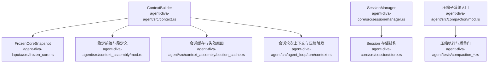
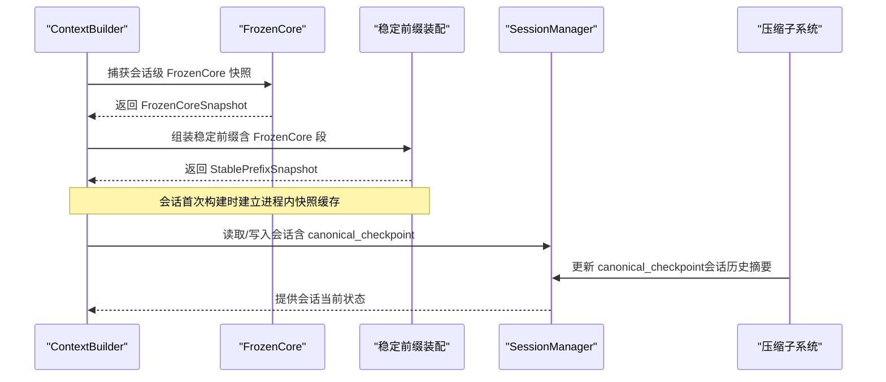
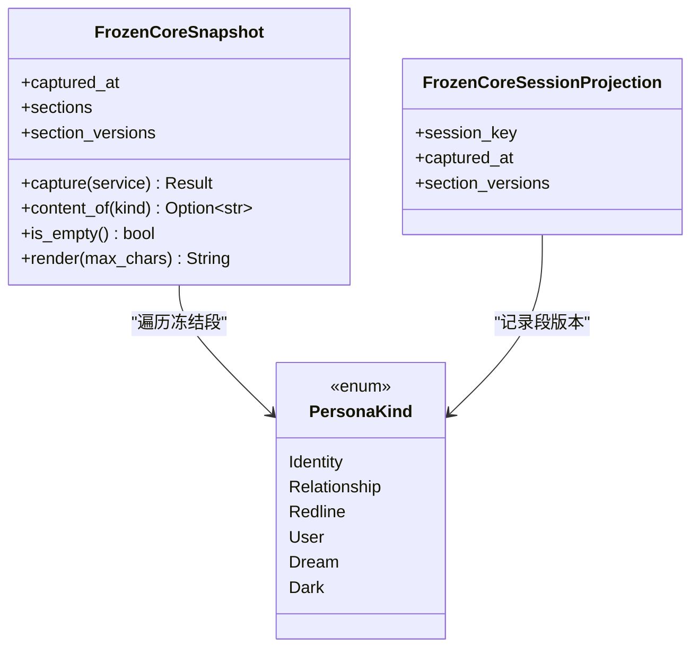
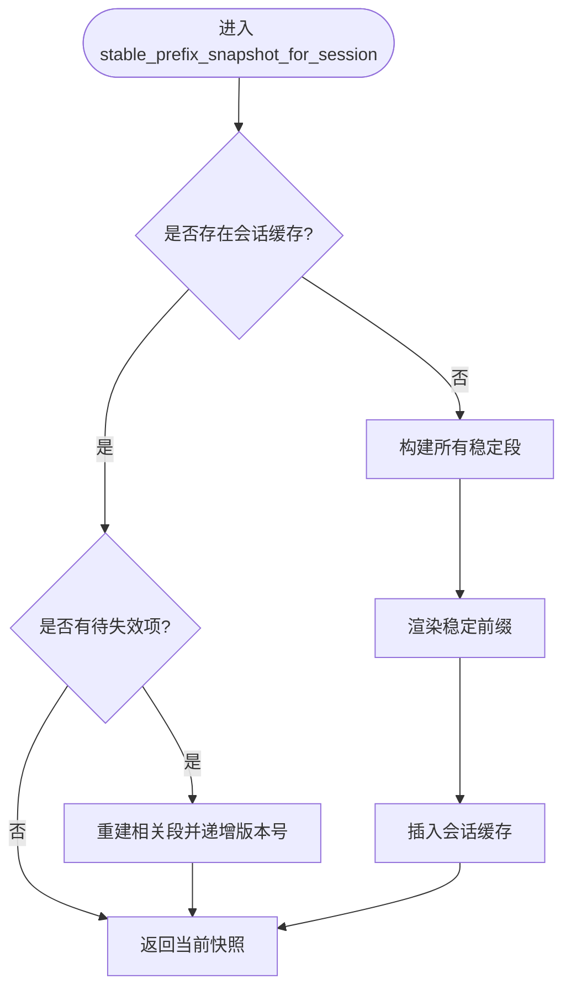
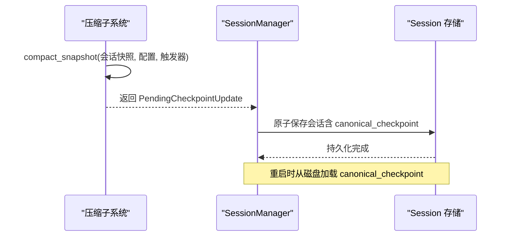
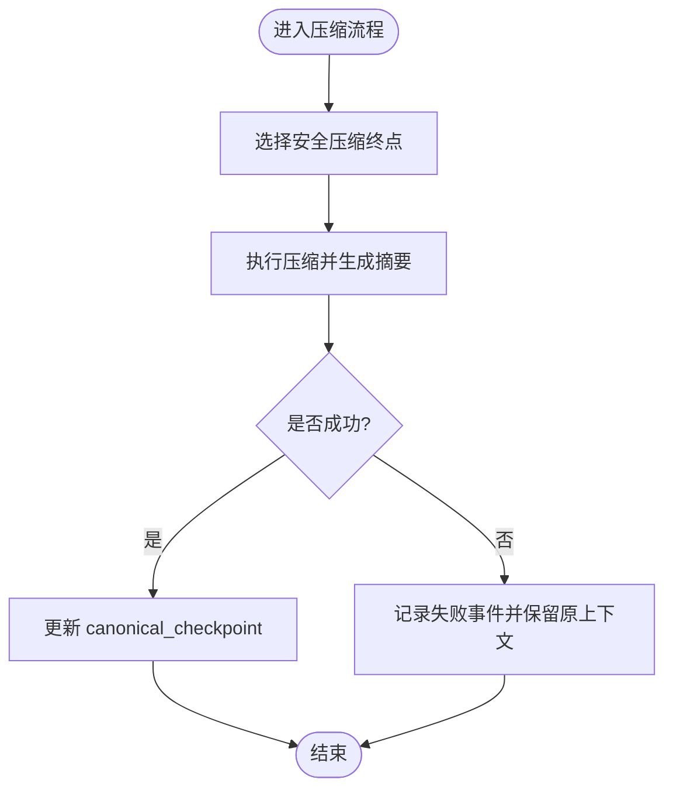
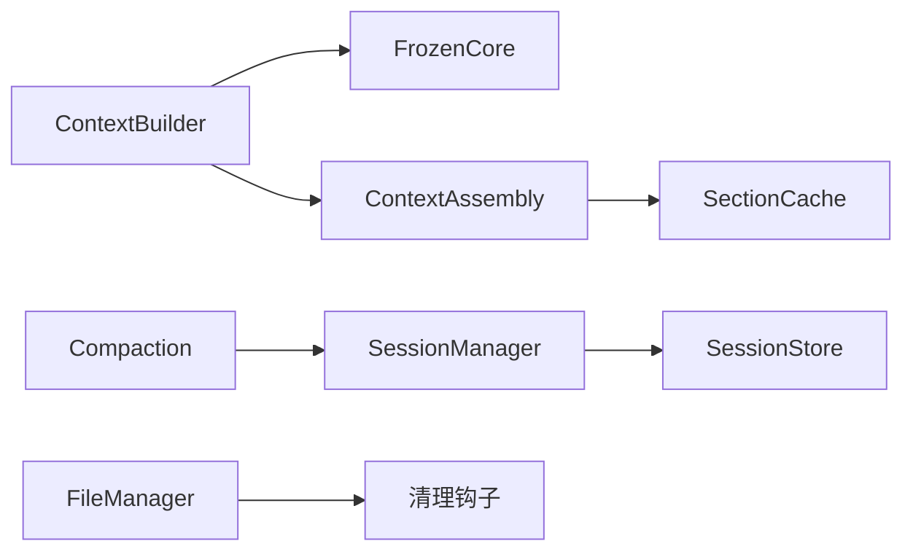

# 冻结核心快照

<cite>
**本文引用的文件**
- [agent-diva-laputa/src/frozen_core.rs](file://agent-diva-laputa/src/frozen_core.rs)
- [agent-diva-agent/src/context.rs](file://agent-diva-agent/src/context.rs)
- [agent-diva-agent/src/context_assembly/mod.rs](file://agent-diva-agent/src/context_assembly/mod.rs)
- [agent-diva-agent/src/context_assembly/section_cache.rs](file://agent-diva-agent/src/context_assembly/section_cache.rs)
- [agent-diva-core/src/session/store.rs](file://agent-diva-core/src/session/store.rs)
- [agent-diva-core/src/session/manager.rs](file://agent-diva-core/src/session/manager.rs)
- [agent-diva-agent/tests/compaction_integration.rs](file://agent-diva-agent/tests/compaction_integration.rs)
- [agent-diva-agent/tests/compaction_e2e.rs](file://agent-diva-agent/tests/compaction_e2e.rs)
- [agent-diva-agent/src/agent_loop/turn/context.rs](file://agent-diva-agent/src/agent_loop/turn/context.rs)
- [agent-diva-agent/src/compaction/mod.rs](file://agent-diva-agent/src/compaction/mod.rs)
- [agent-diva-files/src/manager.rs](file://agent-diva-files/src/manager.rs)
- [agent-diva-laputa/src/persona/types.rs](file://agent-diva-laputa/src/persona/types.rs)
</cite>

## 目录
1. [简介](#简介)
2. [项目结构](#项目结构)
3. [核心组件](#核心组件)
4. [架构总览](#架构总览)
5. [详细组件分析](#详细组件分析)
6. [依赖关系分析](#依赖关系分析)
7. [性能与优化](#性能与优化)
8. [故障排查指南](#故障排查指南)
9. [结论](#结论)
10. [附录](#附录)

## 简介
本文件系统化说明“冻结核心快照”机制：以会话为粒度，将人格权威（身份、关系、红线、用户偏好、愿景、暗面等）在启动时冻结为稳定上下文投影，确保后续对话轮次中该部分不随运行时变化而漂移。文档覆盖以下要点：
- FrozenCore 的概念与作用：为会话提供稳定的记忆上下文投影，避免人格内容热更新导致提示词抖动。
- 快照捕获时机与触发条件：会话首次构建稳定前缀时自动捕获；会话重置或结束时进行缓存失效与释放。
- 版本管理与增量更新策略：通过段级版本哈希与进程内快照注册表实现增量重建与比较。
- 序列化与持久化格式：快照可序列化为 JSON，支持跨进程共享与恢复；会话级 canonical checkpoint 用于历史压缩后的状态恢复。
- 压缩与优化：可见字符截断、默认预算控制、进程内缓存上限与 LRU 淘汰。
- 最佳实践：清理策略、性能考虑与观测指标。

## 项目结构
围绕冻结核心快照的关键代码分布在 Laputa 人格服务、Agent 上下文装配、会话存储与压缩子系统：
- Laputa 层负责从 Persona 权威读取并裁剪生成 FrozenCoreSnapshot。
- Agent 层在 ContextBuilder 中按固定顺序组装稳定前缀，其中包含 FrozenCore 段。
- 会话管理器负责加载/保存会话及 canonical_checkpoint，支撑跨进程恢复。
- 压缩子系统维护会话历史摘要，作为会话级“当前状态”的补充。

图表来源
- [agent-diva-agent/src/context.rs:138-195](file://agent-diva-agent/src/context.rs#L138-L195)
- [agent-diva-laputa/src/frozen_core.rs:17-96](file://agent-diva-laputa/src/frozen_core.rs#L17-L96)
- [agent-diva-agent/src/context_assembly/mod.rs:38-110](file://agent-diva-agent/src/context_assembly/mod.rs#L38-L110)
- [agent-diva-agent/src/context_assembly/section_cache.rs:1-56](file://agent-diva-agent/src/context_assembly/section_cache.rs#L1-L56)
- [agent-diva-core/src/session/manager.rs:125-200](file://agent-diva-core/src/session/manager.rs#L125-L200)
- [agent-diva-core/src/session/store.rs:787-801](file://agent-diva-core/src/session/store.rs#L787-L801)
- [agent-diva-agent/src/compaction/mod.rs:1-33](file://agent-diva-agent/src/compaction/mod.rs#L1-L33)
- [agent-diva-agent/tests/compaction_integration.rs:79-118](file://agent-diva-agent/tests/compaction_integration.rs#L79-L118)
- [agent-diva-agent/src/agent_loop/turn/context.rs:305-362](file://agent-diva-agent/src/agent_loop/turn/context.rs#L305-L362)

章节来源
- [agent-diva-agent/src/context.rs:138-195](file://agent-diva-agent/src/context.rs#L138-L195)
- [agent-diva-laputa/src/frozen_core.rs:17-96](file://agent-diva-laputa/src/frozen_core.rs#L17-L96)
- [agent-diva-agent/src/context_assembly/mod.rs:38-110](file://agent-diva-agent/src/context_assembly/mod.rs#L38-L110)
- [agent-diva-core/src/session/manager.rs:125-200](file://agent-diva-core/src/session/manager.rs#L125-L200)
- [agent-diva-core/src/session/store.rs:787-801](file://agent-diva-core/src/session/store.rs#L787-L801)
- [agent-diva-agent/src/compaction/mod.rs:1-33](file://agent-diva-agent/src/compaction/mod.rs#L1-L33)

## 核心组件
- FrozenCoreSnapshot：记录捕获时间、各段内容与段级版本哈希，支持渲染为带预算限制的文本块。
- FrozenCoreSessionProjection：会话维度的轻量投影，仅保留 session_key、捕获时间与段版本列表，便于追踪变更。
- ContextSection::FrozenCore：稳定前缀中的固定逻辑段，属于 SessionStable 稳定性级别，参与稳定前缀缓存。
- StablePrefixSnapshot：会话级稳定前缀快照，包含已渲染文本、各段与版本号，以及缓存失效原因集合。
- SessionManager/Session：会话生命周期管理，持久化 canonical_checkpoint，支持跨进程恢复。
- 压缩子系统：对会话历史进行有界压缩，产出 canonical_checkpoint，作为会话“当前状态”的持久化视图。

章节来源
- [agent-diva-laputa/src/frozen_core.rs:17-96](file://agent-diva-laputa/src/frozen_core.rs#L17-L96)
- [agent-diva-agent/src/context_assembly/mod.rs:38-110](file://agent-diva-agent/src/context_assembly/mod.rs#L38-L110)
- [agent-diva-agent/src/context_assembly/section_cache.rs:1-56](file://agent-diva-agent/src/context_assembly/section_cache.rs#L1-L56)
- [agent-diva-core/src/session/manager.rs:125-200](file://agent-diva-core/src/session/manager.rs#L125-L200)
- [agent-diva-core/src/session/store.rs:787-801](file://agent-diva-core/src/session/store.rs#L787-L801)
- [agent-diva-agent/src/compaction/mod.rs:1-33](file://agent-diva-agent/src/compaction/mod.rs#L1-L33)

## 架构总览
冻结核心快照在上下文装配流程中被注入到稳定前缀，保证会话期间身份与规则的一致性；同时，会话历史通过压缩形成 canonical_checkpoint，二者共同构成会话的“稳定上下文投影”。

图表来源
- [agent-diva-agent/src/context.rs:138-195](file://agent-diva-agent/src/context.rs#L138-L195)
- [agent-diva-laputa/src/frozen_core.rs:98-156](file://agent-diva-laputa/src/frozen_core.rs#L98-L156)
- [agent-diva-core/src/session/manager.rs:125-200](file://agent-diva-core/src/session/manager.rs#L125-L200)
- [agent-diva-agent/src/compaction/mod.rs:1-33](file://agent-diva-agent/src/compaction/mod.rs#L1-L33)

## 详细组件分析

### 冻结核心快照（FrozenCoreSnapshot）
- 作用：从 Persona 权威中抽取固定集合的人格段落，按可见字符限制裁剪，并以段级版本哈希记录变更。
- 关键行为：
  - 捕获前校验 Persona 服务就绪。
  - 遍历冻结段集合，提取内容并计算可见字符长度，超过限制则截断。
  - 记录每个段的 content_hash（sha256），用于后续增量判断。
  - 提供 render(max_chars) 方法，按预算输出带标题的段落串。
- 进程内缓存：
  - 使用 OnceLock + RwLock<HashMap<(root_key, session_key), Snapshot>> 缓存快照。
  - 容量上限为 128，超出时按 captured_at 最小值淘汰最旧项。
  - 提供 release_session_projection 释放特定会话的快照。

图表来源
- [agent-diva-laputa/src/frozen_core.rs:17-96](file://agent-diva-laputa/src/frozen_core.rs#L17-L96)
- [agent-diva-laputa/src/persona/types.rs:6-55](file://agent-diva-laputa/src/persona/types.rs#L6-L55)

章节来源
- [agent-diva-laputa/src/frozen_core.rs:17-96](file://agent-diva-laputa/src/frozen_core.rs#L17-L96)
- [agent-diva-laputa/src/persona/types.rs:6-55](file://agent-diva-laputa/src/persona/types.rs#L6-L55)

### 上下文装配与稳定前缀（ContextBuilder & ContextSection）
- 稳定前缀包含固定顺序的逻辑段，其中 FrozenCore 属于 SessionStable 稳定性级别，参与稳定前缀缓存。
- ContextBuilder 为每个 session_key 维护会话级稳定缓存，首次构建时调用 build_all_stable_sections，渲染后存入 SessionStableCache。
- 当 mask、技能、记忆版本或会话重置发生变化时，标记 pending_invalidations 并递增 prefix_version。
- 提供 stable_prefix_snapshot_for_session 获取当前版本的 StablePrefixSnapshot，包含 sections、rendered 与 prefix_version。

图表来源
- [agent-diva-agent/src/context.rs:138-195](file://agent-diva-agent/src/context.rs#L138-L195)
- [agent-diva-agent/src/context_assembly/mod.rs:38-110](file://agent-diva-agent/src/context_assembly/mod.rs#L38-L110)
- [agent-diva-agent/src/context_assembly/section_cache.rs:1-56](file://agent-diva-agent/src/context_assembly/section_cache.rs#L1-L56)

章节来源
- [agent-diva-agent/src/context.rs:138-195](file://agent-diva-agent/src/context.rs#L138-L195)
- [agent-diva-agent/src/context_assembly/mod.rs:38-110](file://agent-diva-agent/src/context_assembly/mod.rs#L38-L110)
- [agent-diva-agent/src/context_assembly/section_cache.rs:1-56](file://agent-diva-agent/src/context_assembly/section_cache.rs#L1-L56)

### 会话快照与持久化（SessionManager & canonical_checkpoint）
- SessionManager 负责会话的加载与保存，会话文件包含消息、元数据与 canonical_checkpoint。
- canonical_checkpoint 由压缩子系统产出，表示会话历史的有界摘要，用于跨进程恢复与上下文恢复。
- 测试验证了保存与恢复过程中 checkpoint_id 的一致性。

图表来源
- [agent-diva-agent/tests/compaction_integration.rs:79-118](file://agent-diva-agent/tests/compaction_integration.rs#L79-L118)
- [agent-diva-agent/tests/compaction_e2e.rs:78-121](file://agent-diva-agent/tests/compaction_e2e.rs#L78-L121)
- [agent-diva-core/src/session/manager.rs:125-200](file://agent-diva-core/src/session/manager.rs#L125-L200)
- [agent-diva-core/src/session/store.rs:787-801](file://agent-diva-core/src/session/store.rs#L787-L801)

章节来源
- [agent-diva-core/src/session/manager.rs:125-200](file://agent-diva-core/src/session/manager.rs#L125-L200)
- [agent-diva-core/src/session/store.rs:787-801](file://agent-diva-core/src/session/store.rs#L787-L801)
- [agent-diva-agent/tests/compaction_integration.rs:79-118](file://agent-diva-agent/tests/compaction_integration.rs#L79-L118)
- [agent-diva-agent/tests/compaction_e2e.rs:78-121](file://agent-diva-agent/tests/compaction_e2e.rs#L78-L121)

### 压缩与触发（Auto/Manual/Reactive）
- 压缩触发类型包括 Auto、Manual、Reactive，三者遵循相同的安全边界与渲染顺序，仅用于诊断。
- 会话轮次上下文中，压缩失败不会阻塞主流程，但会记录事件；成功则更新 canonical_checkpoint。
- 测试验证不同触发类型不会改变快照边界或顺序。

图表来源
- [agent-diva-agent/src/agent_loop/turn/context.rs:305-362](file://agent-diva-agent/src/agent_loop/turn/context.rs#L305-L362)
- [agent-diva-agent/tests/compaction_integration.rs:112-118](file://agent-diva-agent/tests/compaction_integration.rs#L112-L118)
- [agent-diva-agent/src/compaction/mod.rs:1-33](file://agent-diva-agent/src/compaction/mod.rs#L1-L33)

章节来源
- [agent-diva-agent/src/agent_loop/turn/context.rs:305-362](file://agent-diva-agent/src/agent_loop/turn/context.rs#L305-L362)
- [agent-diva-agent/tests/compaction_integration.rs:112-118](file://agent-diva-agent/tests/compaction_integration.rs#L112-L118)
- [agent-diva-agent/src/compaction/mod.rs:1-33](file://agent-diva-agent/src/compaction/mod.rs#L1-L33)

## 依赖关系分析
- ContextBuilder 依赖 Laputa 的 FrozenCore 能力以捕获人格快照，并将其注入稳定前缀。
- 稳定前缀装配依赖 ContextSection 的顺序与稳定性定义，确保 FrozenCore 位于早期且稳定。
- SessionManager 与压缩子系统协作，将会话历史摘要持久化到会话文件中，供跨进程恢复。
- 文件管理器提供通用清理钩子，可用于清理过期或不再引用的快照/附件。

图表来源
- [agent-diva-agent/src/context.rs:138-195](file://agent-diva-agent/src/context.rs#L138-L195)
- [agent-diva-agent/src/context_assembly/mod.rs:38-110](file://agent-diva-agent/src/context_assembly/mod.rs#L38-L110)
- [agent-diva-core/src/session/manager.rs:125-200](file://agent-diva-core/src/session/manager.rs#L125-L200)
- [agent-diva-files/src/manager.rs:526-625](file://agent-diva-files/src/manager.rs#L526-L625)

章节来源
- [agent-diva-agent/src/context.rs:138-195](file://agent-diva-agent/src/context.rs#L138-L195)
- [agent-diva-agent/src/context_assembly/mod.rs:38-110](file://agent-diva-agent/src/context_assembly/mod.rs#L38-L110)
- [agent-diva-core/src/session/manager.rs:125-200](file://agent-diva-core/src/session/manager.rs#L125-L200)
- [agent-diva-files/src/manager.rs:526-625](file://agent-diva-files/src/manager.rs#L526-L625)

## 性能与优化
- 可见字符截断：FrozenCore 渲染时按可见字符计数，忽略空白，避免过长内容影响上下文预算。
- 默认预算：render 方法在未指定 max_chars 时使用默认预算，防止一次性注入过多内容。
- 进程内缓存：会话级快照缓存上限为 128，采用 LRU 式淘汰策略，降低内存占用。
- 稳定前缀缓存：会话级稳定前缀缓存仅在 mask、技能、记忆版本或会话重置时失效，减少重复构建成本。
- 压缩有界：canonical_checkpoint 保持有界大小，避免会话历史无限增长。

章节来源
- [agent-diva-laputa/src/frozen_core.rs:75-96](file://agent-diva-laputa/src/frozen_core.rs#L75-L96)
- [agent-diva-laputa/src/frozen_core.rs:117-128](file://agent-diva-laputa/src/frozen_core.rs#L117-L128)
- [agent-diva-agent/src/context.rs:169-195](file://agent-diva-agent/src/context.rs#L169-L195)
- [agent-diva-agent/tests/compaction_integration.rs:91-108](file://agent-diva-agent/tests/compaction_integration.rs#L91-L108)

## 故障排查指南
- 快照捕获失败：若 Persona 服务未初始化或处于不完整状态，捕获将返回错误；日志会记录失败原因。
- 会话重置导致缓存失效：reset_session_cache 会清空会话缓存，下次构建重新捕获 FrozenCore。
- 会话结束释放快照：end_session_cache 会移除会话级快照，避免长期驻留内存。
- 压缩失败不影响主流程：压缩失败会记录事件并保留原始上下文，确保会话继续运行。
- 清理策略：文件管理器支持基于引用计数与最大年龄的清理，可通过钩子扩展清理逻辑。

章节来源
- [agent-diva-laputa/src/frozen_core.rs:35-62](file://agent-diva-laputa/src/frozen_core.rs#L35-L62)
- [agent-diva-agent/src/context.rs:1508-1541](file://agent-diva-agent/src/context.rs#L1508-L1541)
- [agent-diva-agent/src/agent_loop/turn/context.rs:347-362](file://agent-diva-agent/src/agent_loop/turn/context.rs#L347-L362)
- [agent-diva-files/src/manager.rs:526-625](file://agent-diva-files/src/manager.rs#L526-L625)

## 结论
冻结核心快照机制通过会话级人格快照与稳定前缀装配，为对话提供一致且稳定的上下文投影；结合会话历史压缩与持久化，实现了长会话的可控上下文窗口与跨进程恢复。通过可见字符截断、默认预算、进程内缓存与 LRU 淘汰等优化手段，系统在功能性与性能之间取得平衡。建议在生产环境中结合清理策略与观测指标，持续监控快照命中率与上下文预算使用情况。

## 附录
- 术语说明：
  - FrozenCore：冻结的核心人格段落集合，用于会话稳定上下文。
  - 稳定前缀：上下文装配中固定顺序、SessionStable 级别的段落集合。
  - canonical_checkpoint：会话历史压缩后的有界摘要，用于状态恢复。
- 参考路径：
  - 快照捕获与渲染：[agent-diva-laputa/src/frozen_core.rs:17-96](file://agent-diva-laputa/src/frozen_core.rs#L17-L96)
  - 稳定前缀装配：[agent-diva-agent/src/context.rs:138-195](file://agent-diva-agent/src/context.rs#L138-L195)
  - 会话持久化：[agent-diva-core/src/session/manager.rs:125-200](file://agent-diva-core/src/session/manager.rs#L125-L200)
  - 压缩触发与执行：[agent-diva-agent/src/compaction/mod.rs:1-33](file://agent-diva-agent/src/compaction/mod.rs#L1-L33)