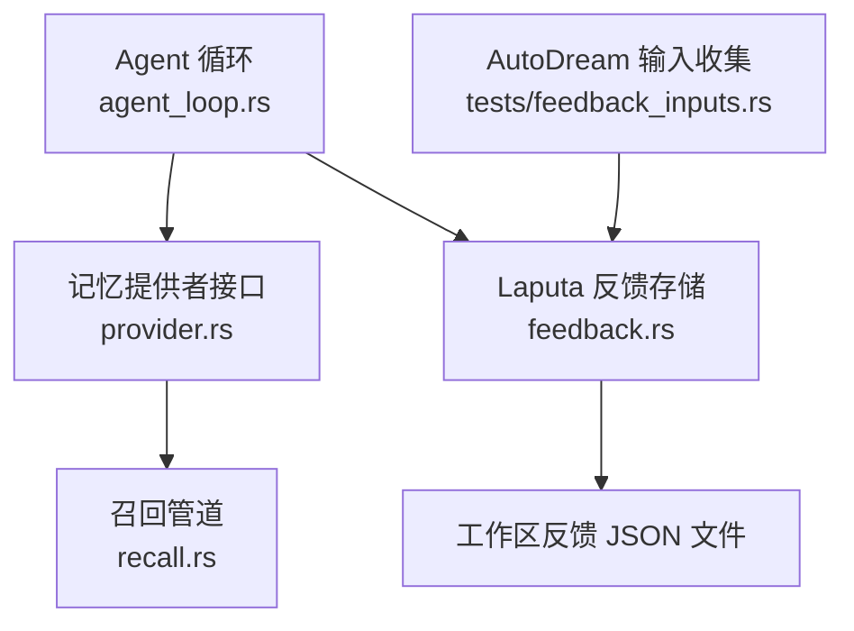
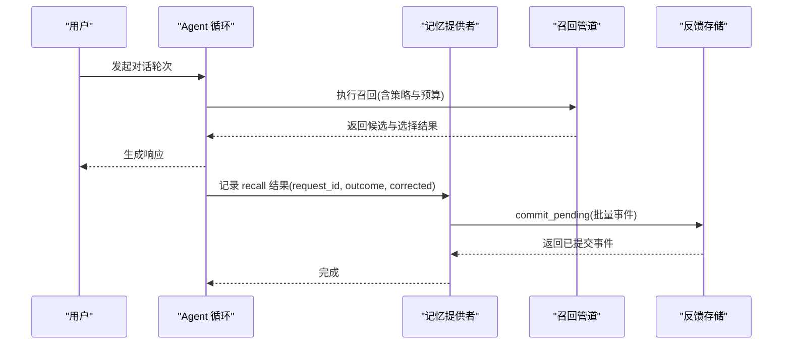
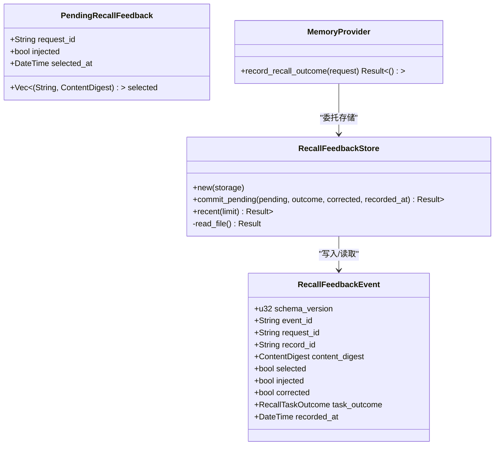

# 反馈系统

<cite>
**本文引用的文件**
- [agent-diva-laputa/src/feedback.rs](file://agent-diva-laputa/src/feedback.rs)
- [agent-diva-core/src/memory/recall.rs](file://agent-diva-core/src/memory/recall.rs)
- [agent-diva-core/src/memory/provider.rs](file://agent-diva-core/src/memory/provider.rs)
- [agent-diva-agent/src/agent_loop.rs](file://agent-diva-agent/src/agent_loop.rs)
- [agent-diva-autodream/tests/feedback_inputs.rs](file://agent-diva-autodream/tests/feedback_inputs.rs)
- [agent-diva-laputa/tests/feedback.rs](file://agent-diva-laputa/tests/feedback.rs)
</cite>

## 目录
1. [简介](#简介)
2. [项目结构](#项目结构)
3. [核心组件](#核心组件)
4. [架构总览](#架构总览)
5. [详细组件分析](#详细组件分析)
6. [依赖关系分析](#依赖关系分析)
7. [性能与容量特性](#性能与容量特性)
8. [故障排查指南](#故障排查指南)
9. [结论](#结论)
10. [附录：配置与自定义规则](#附录：配置与自定义规则)

## 简介
本文件面向记忆系统的“召回质量反馈”闭环，围绕以下目标展开：
- 解释 RecallFeedbackEvent 的作用：记录用户对某次记忆召回结果的选择、注入方式、任务结果以及是否经过修正等信号。
- 说明待处理反馈队列（PendingRecallFeedback）的管理方式：批量提交、去重、持久化与最近读取。
- 阐述反馈数据的存储与分析机制：事件文件、排序裁剪、与自动改进流程的衔接。
- 描述反馈驱动的自动改进流程：如何识别低质量记忆并触发修正、删除或补充。
- 提供反馈统计与报告能力：用于监控记忆系统的质量趋势。
- 给出反馈系统的配置选项与可定制规则建议。

## 项目结构
反馈系统主要分布在 Laputa 模块的本地存储层与 Agent 运行时的调用链中，并与核心层的召回管道和提供者接口解耦：
- Laputa 层负责将“待处理反馈”落盘为不可变事件序列，并提供最近事件查询。
- Agent 层在 turn 结束时将“成功/失败 + 是否修正”的结果写入反馈链路。
- 核心层提供稳定的召回管道与提供者契约，使反馈不侵入具体实现。
- 自动化采集侧（AutoDream）可从反馈事件中提取证据，优先使用无负载反馈以保护隐私。

图表来源
- [agent-diva-agent/src/agent_loop.rs:992-1033](file://agent-diva-agent/src/agent_loop.rs#L992-L1033)
- [agent-diva-core/src/memory/provider.rs:347-362](file://agent-diva-core/src/memory/provider.rs#L347-L362)
- [agent-diva-core/src/memory/recall.rs:214-359](file://agent-diva-core/src/memory/recall.rs#L214-L359)
- [agent-diva-laputa/src/feedback.rs:67-120](file://agent-diva-laputa/src/feedback.rs#L67-L120)
- [agent-diva-autodream/tests/feedback_inputs.rs:11-46](file://agent-diva-autodream/tests/feedback_inputs.rs#L11-L46)

章节来源
- [agent-diva-laputa/src/feedback.rs:1-144](file://agent-diva-laputa/src/feedback.rs#L1-L144)
- [agent-diva-core/src/memory/recall.rs:1-800](file://agent-diva-core/src/memory/recall.rs#L1-L800)
- [agent-diva-core/src/memory/provider.rs:1-770](file://agent-diva-core/src/memory/provider.rs#L1-L770)
- [agent-diva-agent/src/agent_loop.rs:992-1033](file://agent-diva-agent/src/agent_loop.rs#L992-L1033)
- [agent-diva-autodream/tests/feedback_inputs.rs:1-47](file://agent-diva-autodream/tests/feedback_inputs.rs#L1-L47)
- [agent-diva-laputa/tests/feedback.rs:1-10](file://agent-diva-laputa/tests/feedback.rs#L1-L10)

## 核心组件
- RecallFeedbackEvent：单条反馈事件，包含 schema 版本、唯一事件 ID、请求 ID、被选中的记忆记录 ID、内容摘要、是否注入、是否修正、任务结果与记录时间。
- PendingRecallFeedback：一次召回批次的待提交反馈集合，包含请求 ID、选中项列表、是否注入、选择时间。
- RecallFeedbackStore：反馈存储，负责加锁、合并去重、按时间排序、限制最大事件数、原子写入与最近事件读取。
- 提供者契约中的 recall 结果回传：通过 RecordOutcomeRequest 将 turn 的成功/失败与是否修正信号传递给提供者，供其落地到反馈存储。
- 召回管道：提供稳定、可审计的候选检索与选择流程，输出 trace 与预算使用信息，便于后续分析与优化。

章节来源
- [agent-diva-laputa/src/feedback.rs:20-40](file://agent-diva-laputa/src/feedback.rs#L20-L40)
- [agent-diva-laputa/src/feedback.rs:57-120](file://agent-diva-laputa/src/feedback.rs#L57-L120)
- [agent-diva-core/src/memory/provider.rs:347-362](file://agent-diva-core/src/memory/provider.rs#L347-L362)
- [agent-diva-core/src/memory/recall.rs:147-156](file://agent-diva-core/src/memory/recall.rs#L147-L156)

## 架构总览
反馈系统采用“事件追加 + 最近窗口”的轻量设计：
- Agent 在一次 turn 结束后，根据最终结果与是否修正，构造 RecallOutcomeRequest 并交给 MemoryProvider 记录。
- 提供者将 pending 反馈转换为 RecallFeedbackEvent 序列，加锁后写入工作区的反馈 JSON 文件。
- AutoDream 等消费方可以拉取最近的反馈事件，作为证据源参与报告或自动化改进。

图表来源
- [agent-diva-agent/src/agent_loop.rs:992-1033](file://agent-diva-agent/src/agent_loop.rs#L992-L1033)
- [agent-diva-core/src/memory/provider.rs:347-362](file://agent-diva-core/src/memory/provider.rs#L347-L362)
- [agent-diva-core/src/memory/recall.rs:214-359](file://agent-diva-core/src/memory/recall.rs#L214-L359)
- [agent-diva-laputa/src/feedback.rs:67-120](file://agent-diva-laputa/src/feedback.rs#L67-L120)

## 详细组件分析

### RecallFeedbackEvent：反馈事件模型
- 字段含义
  - schema_version：事件格式版本，保证向后兼容。
  - event_id：由 request_id、record_id、selected_at 微秒时间拼接的唯一标识，避免重复。
  - request_id：关联一次召回请求。
  - record_id：被用户选中的记忆记录 ID。
  - content_digest：内容摘要，便于跨系统比对而不暴露原文。
  - selected：标记该事件为“选中”。
  - injected：是否在本次 turn 中被注入上下文。
  - corrected：本次 turn 是否对记忆进行了修正。
  - task_outcome：任务结果（成功/失败/未知）。
  - recorded_at：事件记录时间。
- 用途
  - 作为不可变审计线索，支撑质量评估、趋势统计与自动化改进。

章节来源
- [agent-diva-laputa/src/feedback.rs:20-32](file://agent-diva-laputa/src/feedback.rs#L20-L32)

### PendingRecallFeedback：待处理反馈队列
- 结构
  - request_id：批次所属的请求 ID。
  - selected：选中项列表，每项包含 record_id 与 content_digest。
  - injected：该批次是否注入了上下文。
  - selected_at：选择发生的时间点。
- 管理要点
  - 批量提交：一次 commit_pending 可处理多个 recall 批次。
  - 去重：基于 event_id 去重，避免重复落盘。
  - 排序与裁剪：按 recorded_at 排序，保留最近 MAX_FEEDBACK_EVENTS 条。
  - 原子写入：使用原子写保障文件一致性。

章节来源
- [agent-diva-laputa/src/feedback.rs:34-40](file://agent-diva-laputa/src/feedback.rs#L34-L40)
- [agent-diva-laputa/src/feedback.rs:67-120](file://agent-diva-laputa/src/feedback.rs#L67-L120)

### RecallFeedbackStore：存储与访问
- 关键方法
  - new：绑定 LaputaStorage。
  - commit_pending：批量提交待处理反馈，加锁、去重、排序、裁剪、原子写入。
  - recent：按时间倒序读取最近 N 条事件，上限受 MAX_FEEDBACK_EVENTS 约束。
  - read_file：内部读取 JSON 文件，不存在时返回默认空结构。
- 并发与一致性
  - 使用 LaputaLock 获取名为 “recall-feedback” 的锁，超时短以避免阻塞主流程。
  - 事件按 recorded_at 排序，确保最近优先。
  - 超过阈值时丢弃最旧事件，控制文件大小。

章节来源
- [agent-diva-laputa/src/feedback.rs:57-143](file://agent-diva-laputa/src/feedback.rs#L57-L143)

### 提供者契约与 Agent 集成
- 提供者接口
  - record_recall_outcome：接收 RecallOutcomeRequest，携带 workspace_root、request_id、outcome、corrected。
- Agent 循环
  - 在 turn 结束处，根据成功/失败与是否修正，调用提供者记录结果。
- 作用
  - 将“任务结果 + 是否修正”的信号与“选中记录”的事件关联起来，形成完整反馈闭环。

章节来源
- [agent-diva-core/src/memory/provider.rs:347-362](file://agent-diva-core/src/memory/provider.rs#L347-L362)
- [agent-diva-agent/src/agent_loop.rs:992-1033](file://agent-diva-agent/src/agent_loop.rs#L992-L1033)

### 召回管道：选择与预算
- 输入
  - RecallRequest：查询、范围、审计关联、当前时间、token 预算、候选上限、策略。
- 过程
  - 预过滤：信任度、敏感度、过期、墓碑、覆盖、重复、预算等。
  - 评分：相关性、重要性、新鲜度、人格相关度加权。
  - 多样性：按 kind 分散选择。
  - 预算：估算 token 使用，超出则拒绝。
- 输出
  - RecallOutcome：状态、失败原因、选中记录、提示块、预算使用、trace。
- 价值
  - 为反馈分析提供结构化 trace，便于定位低质量召回的原因。

章节来源
- [agent-diva-core/src/memory/recall.rs:58-156](file://agent-diva-core/src/memory/recall.rs#L58-L156)
- [agent-diva-core/src/memory/recall.rs:214-359](file://agent-diva-core/src/memory/recall.rs#L214-L359)
- [agent-diva-core/src/memory/recall.rs:400-489](file://agent-diva-core/src/memory/recall.rs#L400-L489)

### 自动改进与证据采集
- 证据来源
  - AutoDream 测试用例表明，收集器会优先使用“无负载”的 recall_feedback 证据，避免泄露记忆原文。
- 证据内容
  - 包含 corrected=true 等元信息，便于判断是否需要修正或删除。
- 改进方向
  - 若频繁出现 corrected=true 且任务失败，可触发记忆修正或删除。
  - 若大量 rejected 且 reason 为 OverBudget/CandidateLimit，可调整召回策略或预算。

章节来源
- [agent-diva-autodream/tests/feedback_inputs.rs:11-46](file://agent-diva-autodream/tests/feedback_inputs.rs#L11-L46)

## 依赖关系分析
- 松耦合
  - Agent 仅依赖 provider 契约，不直接操作反馈存储。
  - 反馈存储仅依赖 LaputaStorage 路径与锁机制。
- 关键依赖
  - agent_diva_core::governance::ContentDigest：用于内容摘要。
  - chrono：时间戳与排序。
  - serde：序列化/反序列化。
- 潜在风险
  - 若提供者未实现 record_recall_outcome，则无法形成闭环；需确保实现存在。
  - 若反馈文件损坏或权限不足，recent/commit 可能失败；应做好降级与告警。

图表来源
- [agent-diva-laputa/src/feedback.rs:20-40](file://agent-diva-laputa/src/feedback.rs#L20-L40)
- [agent-diva-laputa/src/feedback.rs:57-120](file://agent-diva-laputa/src/feedback.rs#L57-L120)
- [agent-diva-core/src/memory/provider.rs:347-362](file://agent-diva-core/src/memory/provider.rs#L347-L362)

章节来源
- [agent-diva-laputa/src/feedback.rs:1-144](file://agent-diva-laputa/src/feedback.rs#L1-L144)
- [agent-diva-core/src/memory/provider.rs:347-362](file://agent-diva-core/src/memory/provider.rs#L347-L362)

## 性能与容量特性
- 容量限制
  - MAX_FEEDBACK_EVENTS=5000，超过时丢弃最旧事件，避免文件膨胀。
- 排序与读取
  - 写入时按 recorded_at 排序；读取时按时间倒序，截断到 limit。
- 并发控制
  - 使用短超时锁（5 秒），降低阻塞风险。
- 预算与选择
  - 召回管道保守估算 token，避免超预算导致提示过长。
- 建议
  - 定期归档或导出反馈事件，以便离线分析。
  - 在高吞吐场景下，考虑异步落盘与批处理合并。

章节来源
- [agent-diva-laputa/src/feedback.rs:9-10](file://agent-diva-laputa/src/feedback.rs#L9-L10)
- [agent-diva-laputa/src/feedback.rs:77-83](file://agent-diva-laputa/src/feedback.rs#L77-L83)
- [agent-diva-laputa/src/feedback.rs:115-120](file://agent-diva-laputa/src/feedback.rs#L115-L120)
- [agent-diva-core/src/memory/recall.rs:309-337](file://agent-diva-core/src/memory/recall.rs#L309-L337)

## 故障排查指南
- 常见问题
  - 反馈未写入：检查提供者是否实现 record_recall_outcome，以及 Agent 是否在 turn 结束处调用。
  - 文件读写失败：确认工作区路径权限与磁盘空间；查看 IO 错误日志。
  - 事件重复：确认 event_id 生成逻辑未被外部篡改；检查去重逻辑。
  - 数据丢失：确认 MAX_FEEDBACK_EVENTS 阈值是否过小；必要时提高阈值或增加归档频率。
- 诊断步骤
  - 读取最近事件：调用 recent(limit)，观察是否存在异常模式（如大量 corrected=true）。
  - 检查任务结果：结合 task_outcome 与 corrected，定位失败与修正热点。
  - 联动召回 trace：对照 RecallOutcome.trace，分析 rejected 原因（OverBudget、Duplicate 等）。

章节来源
- [agent-diva-laputa/tests/feedback.rs:1-10](file://agent-diva-laputa/tests/feedback.rs#L1-L10)
- [agent-diva-core/src/memory/recall.rs:532-583](file://agent-diva-core/src/memory/recall.rs#L532-L583)

## 结论
反馈系统通过轻量事件模型与稳定提供者契约，实现了“召回质量反馈”的可观测性与可改进性：
- 事件驱动：每次选中与修正都留下不可变痕迹。
- 可控容量：固定上限与排序裁剪保障存储健康。
- 可组合：与召回管道、提供者、自动化采集无缝协作。
- 可扩展：支持统计、报告与自动改进规则的持续演进。

## 附录：配置与自定义规则
- 内置常量
  - SCHEMA_VERSION：事件格式版本。
  - MAX_FEEDBACK_EVENTS：最大事件数。
- 可调参数建议
  - 反馈窗口大小：根据工作区规模调整 MAX_FEEDBACK_EVENTS。
  - 锁超时：在高竞争环境下可适当延长，但需权衡延迟。
  - 召回预算：根据模型与上下文长度调整 token_budget。
  - 策略权重：相关性、重要性、新鲜度、人格相关度的权重可按业务调优。
- 自定义规则示例
  - 低质量判定：当 corrected=true 且 task_outcome=Failed 的比例超过阈值，触发记忆修正或删除。
  - 预算敏感：当 OverBudget 比例上升，收紧候选上限或提升筛选严格度。
  - 注入偏好：injected=false 的高频选中项，提示注入策略可能需要优化。

章节来源
- [agent-diva-laputa/src/feedback.rs:9-10](file://agent-diva-laputa/src/feedback.rs#L9-L10)
- [agent-diva-core/src/memory/recall.rs:18-23](file://agent-diva-core/src/memory/recall.rs#L18-L23)
- [agent-diva-core/src/memory/recall.rs:406-424](file://agent-diva-core/src/memory/recall.rs#L406-L424)