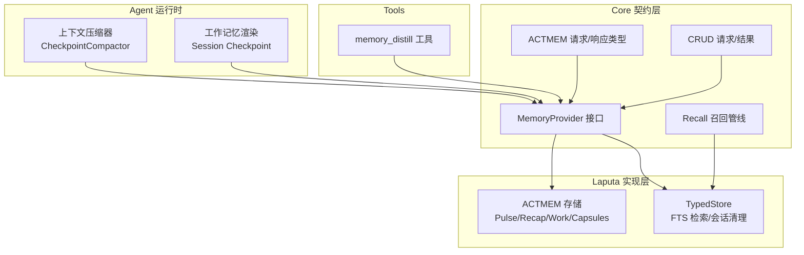
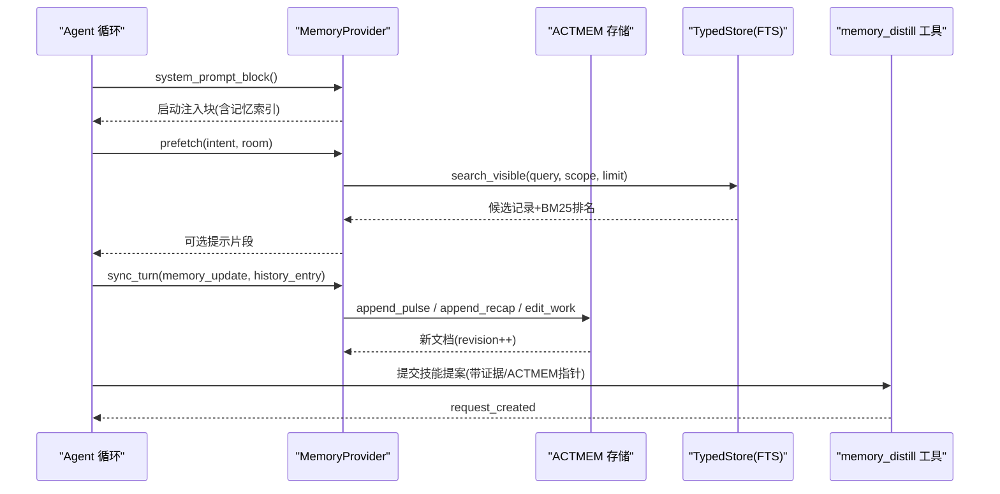
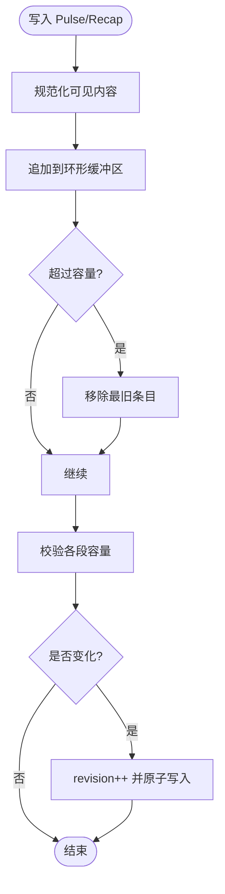
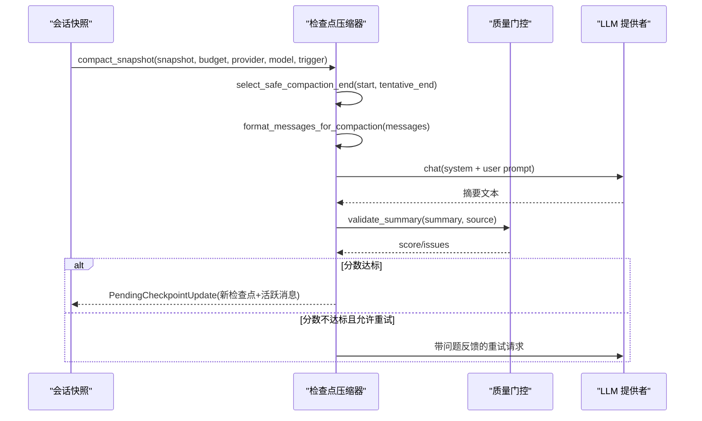
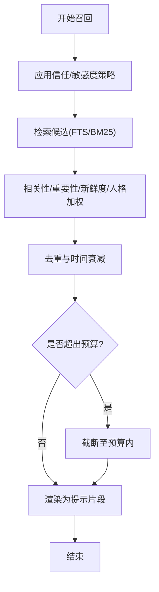
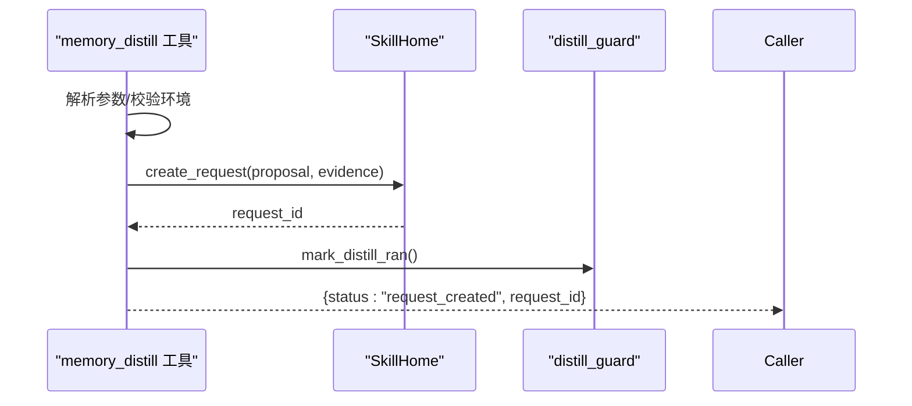
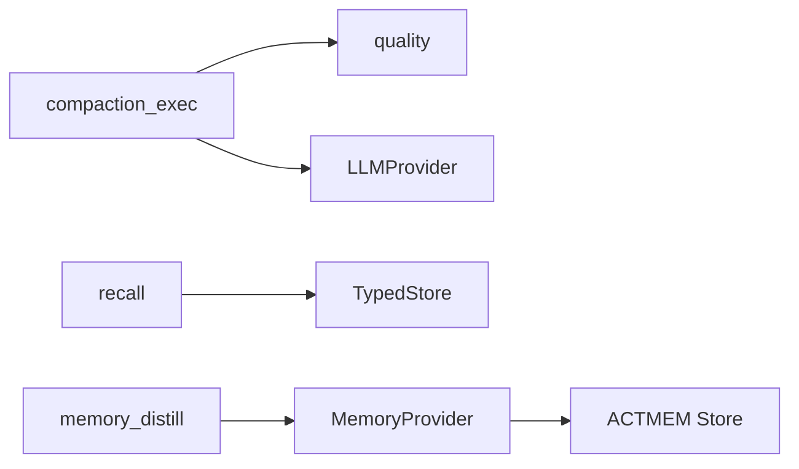

# 记忆压缩与蒸馏

<cite>
**本文引用的文件**
- [agent-diva-core/src/memory/actmem.rs](file://agent-diva-core/src/memory/actmem.rs)
- [agent-diva-core/src/memory/mod.rs](file://agent-diva-core/src/memory/mod.rs)
- [agent-diva-core/src/memory/provider.rs](file://agent-diva-core/src/memory/provider.rs)
- [agent-diva-core/src/memory/recall.rs](file://agent-diva-core/src/memory/recall.rs)
- [agent-diva-core/src/memory/crud.rs](file://agent-diva-core/src/memory/crud.rs)
- [agent-diva-core/src/memory/working.rs](file://agent-diva-core/src/memory/working.rs)
- [agent-diva-agent/src/compaction/mod.rs](file://agent-diva-agent/src/compaction/mod.rs)
- [agent-diva-agent/src/compaction/compaction_exec.rs](file://agent-diva-agent/src/compaction/compaction_exec.rs)
- [agent-diva-agent/src/compaction/quality.rs](file://agent-diva-agent/src/compaction/quality.rs)
- [agent-diva-laputa/src/actmem.rs](file://agent-diva-laputa/src/actmem.rs)
- [agent-diva-laputa/src/typed_store.rs](file://agent-diva-laputa/src/typed_store.rs)
- [agent-diva-tools/src/memory_distill.rs](file://agent-diva-tools/src/memory_distill.rs)
</cite>

## 目录
1. [简介](#简介)
2. [项目结构](#项目结构)
3. [核心组件](#核心组件)
4. [架构总览](#架构总览)
5. [详细组件分析](#详细组件分析)
6. [依赖关系分析](#依赖关系分析)
7. [性能考量](#性能考量)
8. [故障排查指南](#故障排查指南)
9. [结论](#结论)
10. [附录：参数与指标](#附录：参数与指标)

## 简介
本文件系统性说明 Agent-Diva 的记忆压缩与蒸馏机制，围绕 ACTMEM（Active Memory）的工作记忆、环形缓冲区和摘要缓存管理策略展开；阐述上下文检查点压缩算法如何在保持语义完整性的同时减少存储空间占用；描述将长期经验蒸馏为可复用技能的流程；说明基于语义相似度的记忆召回机制；并给出生命周期管理与自动清理策略。文末提供可调优的压缩率与召回精度参数及性能监控指标建议。

## 项目结构
记忆系统横跨 core、laputa、agent 与 tools 四个层次：
- core/memory：定义跨实现的契约（ACTMEM、CRUD、Provider、Recall、Working），是上层工具与运行时调用的稳定边界。
- laputa：实现 ACTMEM 持久化存储、胶囊归档、会话级清理等具体能力。
- agent/compaction：负责对话上下文的检查点压缩，保障长会话不超出模型上下文窗口。
- tools：暴露 memory_distill 等工具，驱动“经验→技能”的蒸馏流程。

图表来源
- [agent-diva-agent/src/compaction/compaction_exec.rs:94-247](file://agent-diva-agent/src/compaction/compaction_exec.rs#L94-L247)
- [agent-diva-core/src/memory/provider.rs:414-617](file://agent-diva-core/src/memory/provider.rs#L414-L617)
- [agent-diva-core/src/memory/recall.rs:1-45](file://agent-diva-core/src/memory/recall.rs#L1-L45)
- [agent-diva-laputa/src/actmem.rs:115-404](file://agent-diva-laputa/src/actmem.rs#L115-L404)
- [agent-diva-laputa/src/typed_store.rs:1162-1180](file://agent-diva-laputa/src/typed_store.rs#L1162-L1180)
- [agent-diva-tools/src/memory_distill.rs:65-133](file://agent-diva-tools/src/memory_distill.rs#L65-L133)

章节来源
- [agent-diva-core/src/memory/mod.rs:1-47](file://agent-diva-core/src/memory/mod.rs#L1-L47)
- [agent-diva-agent/src/compaction/mod.rs:1-33](file://agent-diva-agent/src/compaction/mod.rs#L1-L33)

## 核心组件
- ACTMEM 契约与工具
  - 读取目标包括 pulse、recap、work、head、capsules、capsule，用于在运行期以有界视图访问活跃记忆。
  - 通过 MemoryProvider 暴露 actmem_read/edit/complete/drop 等能力，默认不可用由提供者按需实现。
- 工作记忆（Session Checkpoint）
  - 会话内临时状态，注入到当前轮次上下文，会话结束即清理；不成为权威长期记忆。
  - 支持写入 key_info、related_sops、content，并以结构化 Markdown 块注入提示词。
- 上下文检查点压缩
  - 将历史消息折叠为固定结构的检查点摘要，保留关键决定、未完成事项、下一步等，避免上下文膨胀。
  - 质量门控评估摘要长度、关键词覆盖、语义完整性，必要时重试生成。
- 记忆召回
  - 基于意图感知的前取与预算控制，结合信任、敏感度、新鲜度、人格权重进行排序与去重，最终产出可注入的提示片段。
- 经验蒸馏
  - 通过 memory_distill 工具创建待审技能提案，附带会话证据与可选 ACTMEM 指针，不直接启用技能。

章节来源
- [agent-diva-core/src/memory/actmem.rs:1-51](file://agent-diva-core/src/memory/actmem.rs#L1-L51)
- [agent-diva-core/src/memory/provider.rs:528-617](file://agent-diva-core/src/memory/provider.rs#L528-L617)
- [agent-diva-core/src/memory/working.rs:1-76](file://agent-diva-core/src/memory/working.rs#L1-L76)
- [agent-diva-agent/src/compaction/compaction_exec.rs:94-247](file://agent-diva-agent/src/compaction/compaction_exec.rs#L94-L247)
- [agent-diva-core/src/memory/recall.rs:1-45](file://agent-diva-core/src/memory/recall.rs#L1-L45)
- [agent-diva-tools/src/memory_distill.rs:65-133](file://agent-diva-tools/src/memory_distill.rs#L65-L133)

## 架构总览
ACTMEM 作为“活跃记忆”的有界投影，配合工作记忆与长期记忆形成三层结构：
- 工作记忆：会话级、易失、即时注入。
- ACTMEM：进程级、有界、可折叠为胶囊，承载脉冲、回顾与工作区。
- 长期记忆：经 CRUD 与 Recall 管理，支持搜索、更新、删除与蒸馏。

图表来源
- [agent-diva-core/src/memory/provider.rs:414-617](file://agent-diva-core/src/memory/provider.rs#L414-L617)
- [agent-diva-laputa/src/actmem.rs:162-236](file://agent-diva-laputa/src/actmem.rs#L162-L236)
- [agent-diva-laputa/src/typed_store.rs:1162-1180](file://agent-diva-laputa/src/typed_store.rs#L1162-L1180)
- [agent-diva-tools/src/memory_distill.rs:91-133](file://agent-diva-tools/src/memory_distill.rs#L91-L133)

## 详细组件分析

### ACTMEM：工作记忆、环形缓冲区与摘要缓存
- 数据结构
  - 文档包含 revision、updated_at、pulse、recap、work、markdown。
  - Work 分为固定子节：Goal、Open、Next、Constraints、Pointers。
- 环形缓冲区
  - Pulse/Recap 追加时按字符上限裁剪，超限时移除最旧条目，保证有界增长。
  - 每条记录携带 session 标记，便于按会话折叠。
- 摘要缓存（Capsules）
  - 将某会话的 Pulse/Recap 合并后分块写入独立胶囊文件，头部限制字符数。
  - 支持列出、读取、删除胶囊。
- 并发与一致性
  - 写路径使用互斥锁保护；所有写操作采用 CAS（base_revision）防止冲突。
  - 写入前校验容量，超限返回错误。

图表来源
- [agent-diva-laputa/src/actmem.rs:162-218](file://agent-diva-laputa/src/actmem.rs#L162-L218)
- [agent-diva-laputa/src/actmem.rs:389-403](file://agent-diva-laputa/src/actmem.rs#L389-L403)
- [agent-diva-laputa/src/actmem.rs:497-508](file://agent-diva-laputa/src/actmem.rs#L497-L508)

章节来源
- [agent-diva-laputa/src/actmem.rs:59-113](file://agent-diva-laputa/src/actmem.rs#L59-L113)
- [agent-diva-laputa/src/actmem.rs:269-387](file://agent-diva-laputa/src/actmem.rs#L269-L387)
- [agent-diva-core/src/memory/actmem.rs:1-51](file://agent-diva-core/src/memory/actmem.rs#L1-L51)

### 上下文检查点压缩：保持语义完整性的有界摘要
- 输入快照
  - 包含上一检查点、持久化消息、当前轮未落盘消息、非压缩起始索引。
- 选择压缩范围
  - 根据预算保留最近 N 条消息，向前寻找安全边界（完整工具调用组或用户回合）。
- LLM 摘要生成
  - 格式化消息（折叠已完成工具组，截断过长内容），调用模型生成结构化摘要。
  - 最多重试若干次，每次失败会反馈问题提示。
- 质量门控
  - 从长度、关键词覆盖、语义完整性三个维度评分，低于阈值则拒绝并触发重试。
- 输出
  - 生成固定结构的检查点体（目标与约束、已完成事项、关键决定、当前状态、未解决问题、下一步、保留标识符与 artifact 引用），并绑定最大长度。

图表来源
- [agent-diva-agent/src/compaction/compaction_exec.rs:94-247](file://agent-diva-agent/src/compaction/compaction_exec.rs#L94-L247)
- [agent-diva-agent/src/compaction/compaction_exec.rs:249-303](file://agent-diva-agent/src/compaction/compaction_exec.rs#L249-L303)
- [agent-diva-agent/src/compaction/compaction_exec.rs:399-430](file://agent-diva-agent/src/compaction/compaction_exec.rs#L399-L430)
- [agent-diva-agent/src/compaction/quality.rs:272-305](file://agent-diva-agent/src/compaction/quality.rs#L272-L305)

章节来源
- [agent-diva-agent/src/compaction/compaction_exec.rs:20-82](file://agent-diva-agent/src/compaction/compaction_exec.rs#L20-L82)
- [agent-diva-agent/src/compaction/quality.rs:17-96](file://agent-diva-agent/src/compaction/quality.rs#L17-L96)

### 记忆召回：意图感知与预算控制
- 召回策略
  - 依据信任、敏感度、新鲜度、人格权重加权打分；新鲜度按固定步长衰减。
  - 对候选进行去重、时间衰减、token 预算控制，最终渲染为提示片段。
- 前取与同步
  - 每轮开始前可执行 prefetch，仅做检索与组装，不做持久化写。
  - 成功后通过 sync_turn 持久化证据或记忆更新。
- 可视范围
  - 支持工作区全局与精确会话范围的可见性组合，确保注入安全。

图表来源
- [agent-diva-core/src/memory/recall.rs:1-45](file://agent-diva-core/src/memory/recall.rs#L1-L45)
- [agent-diva-core/src/memory/provider.rs:281-314](file://agent-diva-core/src/memory/provider.rs#L281-L314)
- [agent-diva-laputa/src/typed_store.rs:1162-1180](file://agent-diva-laputa/src/typed_store.rs#L1162-L1180)

章节来源
- [agent-diva-core/src/memory/recall.rs:1-45](file://agent-diva-core/src/memory/recall.rs#L1-L45)
- [agent-diva-core/src/memory/provider.rs:449-469](file://agent-diva-core/src/memory/provider.rs#L449-L469)

### 经验蒸馏：将长期记忆转化为紧凑技能
- 入口工具
  - memory_distill 接收 slug、title、description、content、reason，以及可选 actmem_pointer 与 artifact。
  - 构建 SKILL.md 元数据与正文，创建待审提案，不直接启用技能。
- 证据链
  - 提案附带会话键、ACTMEM 指针、工具来源等信息，便于审计与回溯。
- 守卫
  - 若配置目录缺失或会话证据为空，返回明确失败码，避免无凭据蒸馏。

图表来源
- [agent-diva-tools/src/memory_distill.rs:65-133](file://agent-diva-tools/src/memory_distill.rs#L65-L133)
- [agent-diva-tools/src/memory_distill.rs:135-145](file://agent-diva-tools/src/memory_distill.rs#L135-L145)

章节来源
- [agent-diva-tools/src/memory_distill.rs:1-199](file://agent-diva-tools/src/memory_distill.rs#L1-L199)

### 工作记忆：会话检查点
- 写入与注入
  - 通过 SessionCheckpointWriteRequest 写入 key_info、related_sops、content。
  - 通过 render_session_checkpoint_block 生成结构化 Markdown 块，注入到当前轮提示中。
- 生命周期
  - 会话结束时由提供者清理；不进入长期权威。

章节来源
- [agent-diva-core/src/memory/working.rs:1-76](file://agent-diva-core/src/memory/working.rs#L1-L76)
- [agent-diva-core/src/memory/provider.rs:586-609](file://agent-diva-core/src/memory/provider.rs#L586-L609)

## 依赖关系分析
- 模块耦合
  - compaction 依赖 token_estimate、context_budget 与 LLMProvider，产出检查点。
  - recall 依赖 TypedStore 的 FTS 检索与聚合打分逻辑。
  - ACTMEM 存储位于 Laputa，受 MemoryProvider 抽象隔离。
- 外部依赖
  - LLM 调用用于压缩与蒸馏；SQLite FTS5 用于检索；文件系统用于 ACTMEM 与胶囊持久化。
- 潜在环路与风险
  - 压缩与蒸馏均依赖 LLM，需关注超时与失败重试策略。
  - ACTMEM 写路径需严格 CAS，避免并发冲突。

图表来源
- [agent-diva-agent/src/compaction/compaction_exec.rs:94-247](file://agent-diva-agent/src/compaction/compaction_exec.rs#L94-L247)
- [agent-diva-core/src/memory/provider.rs:414-617](file://agent-diva-core/src/memory/provider.rs#L414-L617)
- [agent-diva-laputa/src/typed_store.rs:1162-1180](file://agent-diva-laputa/src/typed_store.rs#L1162-L1180)

章节来源
- [agent-diva-agent/src/compaction/mod.rs:1-33](file://agent-diva-agent/src/compaction/mod.rs#L1-L33)
- [agent-diva-core/src/memory/mod.rs:1-47](file://agent-diva-core/src/memory/mod.rs#L1-L47)

## 性能考量
- 压缩阶段
  - 消息格式化阶段折叠已完成工具组，减少冗余；超长内容截断，降低 LLM 输入成本。
  - 质量门控避免低质摘要反复污染上下文；重试次数有限制。
- 召回阶段
  - BM25 检索限制返回数量；新鲜度衰减与预算控制避免注入过大。
- 存储阶段
  - ACTMEM 环形缓冲与胶囊大小限制，防止无限增长；原子写入与 CAS 提升一致性与可靠性。
- 蒸馏阶段
  - 仅创建待审提案，避免频繁启用技能带来的开销；证据链最小化。

[本节为通用性能讨论，不直接分析具体文件]

## 故障排查指南
- ACTMEM 写入冲突
  - 现象：RevisionConflict。原因：base_revision 与实际不一致。处理：重新读取最新 revision 后重试。
- 容量超限
  - 现象：CapacityExceeded。原因：Pulse/Recap/Work/Capsule 超过上限。处理：减小写入量或调整折叠策略。
- 压缩失败
  - 现象：空响应或质量门控拒绝。处理：检查输入消息格式、增加重试、优化提示模板。
- 召回失败
  - 现象：PrefetchStatus.Failed。处理：检查检索索引、权限与敏感度过滤策略。
- 蒸馏不可用
  - 现象：skill_unavailable 或 skill_evidence_required。处理：配置 config_dir 并提供 session_key。

章节来源
- [agent-diva-laputa/src/actmem.rs:24-57](file://agent-diva-laputa/src/actmem.rs#L24-L57)
- [agent-diva-agent/src/compaction/compaction_exec.rs:145-204](file://agent-diva-agent/src/compaction/compaction_exec.rs#L145-L204)
- [agent-diva-core/src/memory/provider.rs:449-469](file://agent-diva-core/src/memory/provider.rs#L449-L469)
- [agent-diva-tools/src/memory_distill.rs:91-133](file://agent-diva-tools/src/memory_distill.rs#L91-L133)

## 结论
该记忆系统通过 ACTMEM 的有界活跃记忆、会话级工作记忆与长期记忆的协同，实现了长会话下的上下文可控与经验沉淀。检查点压缩在质量门控下保障语义完整性；召回管线兼顾相关性与预算；蒸馏流程将经验转化为可治理的技能提案。整体设计强调边界清晰、可审计与可扩展，适合在生产环境中持续演进。

[本节为总结性内容，不直接分析具体文件]

## 附录：参数与指标
- 压缩相关
  - 预算配置：keep_recent_count（保留最近消息数）、max_tokens（上下文上限）。
  - 质量门控：min_completeness、min_keyword_coverage、min_score、max_retry。
  - 检查点体长度上限：bound_checkpoint_body 约束。
- 召回相关
  - 权重：SCORE_RELEVANCE_WEIGHT、SCORE_IMPORTANCE_WEIGHT、SCORE_FRESHNESS_WEIGHT、SCORE_PERSONA_WEIGHT。
  - 新鲜度步长：FRESHNESS_STEP_DAYS。
  - 检索限制：limit（默认不超过 100）。
- 存储相关
  - ACTMEM 容量：ACTMEM_RING_CAP_CHARS、ACTMEM_WORK_CAP_CHARS、ACTMEM_READ_CAP_CHARS、ACTMEM_CAPSULE_CAP_CHARS、PULSE_ITEM_CAP_CHARS、RECAP_ITEM_CAP_CHARS。
- 生命周期清理
  - 会话结束物理删除会话级记录：gc_session_scoped。
  - 启动时清理过期会话记录：gc_stale_session_scoped。
- 性能监控指标建议
  - 压缩：尝试次数、平均质量分数、摘要长度、源消息 token 数、失败率。
  - 召回：候选数、命中数、注入 token 数、失败率、延迟。
  - 存储：写入冲突率、容量超限率、胶囊数量与大小分布。
  - 蒸馏：提案创建成功率、证据完整率、启用转化率。

章节来源
- [agent-diva-agent/src/compaction/quality.rs:36-62](file://agent-diva-agent/src/compaction/quality.rs#L36-L62)
- [agent-diva-core/src/memory/recall.rs:18-23](file://agent-diva-core/src/memory/recall.rs#L18-L23)
- [agent-diva-laputa/src/actmem.rs:15-22](file://agent-diva-laputa/src/actmem.rs#L15-L22)
- [agent-diva-laputa/src/typed_store.rs:664-739](file://agent-diva-laputa/src/typed_store.rs#L664-L739)
- [agent-diva-core/src/memory/provider.rs:449-469](file://agent-diva-core/src/memory/provider.rs#L449-L469)