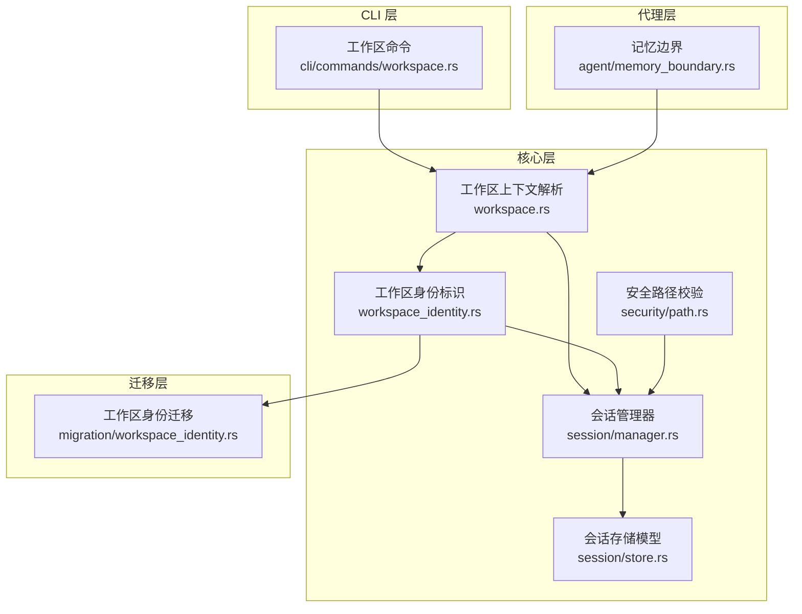
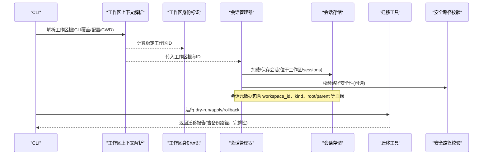
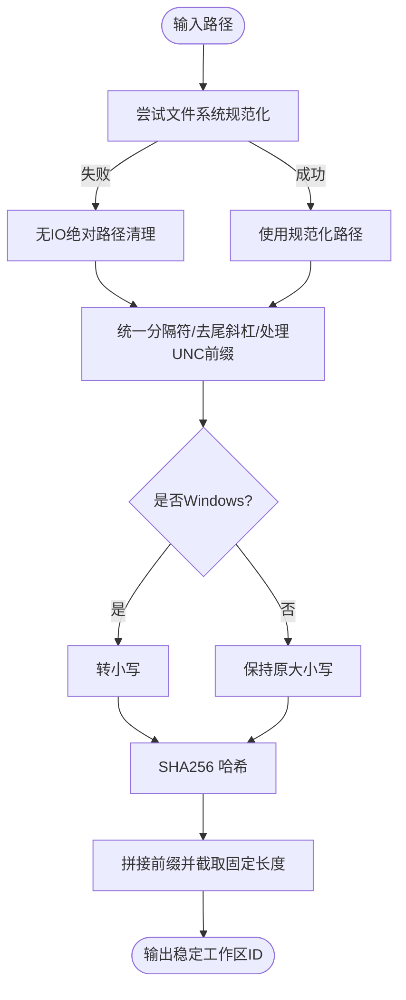
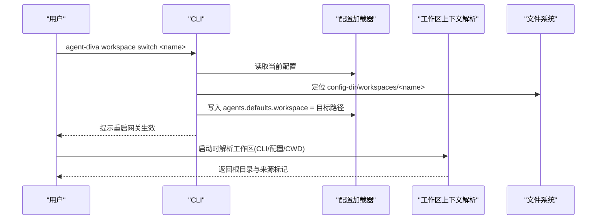
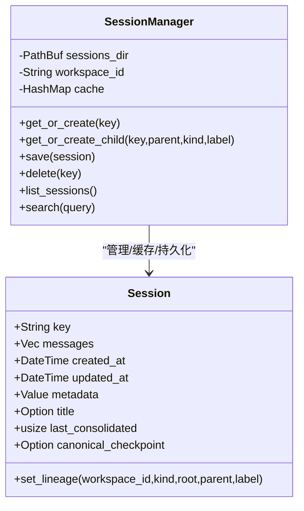
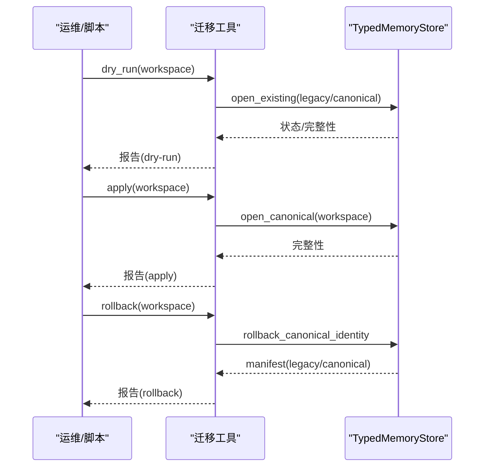
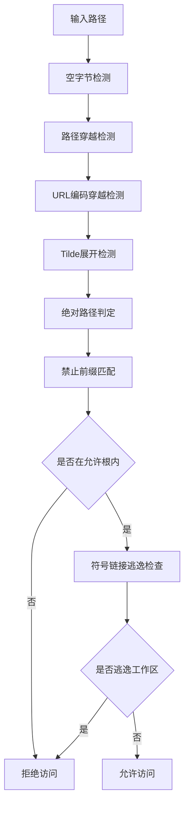
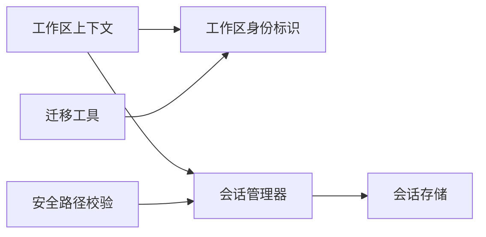

# 工作区隔离机制

<cite>
**本文引用的文件**
- [agent-diva-core/src/workspace_identity.rs](file://agent-diva-core/src/workspace_identity.rs)
- [agent-diva-core/src/workspace.rs](file://agent-diva-core/src/workspace.rs)
- [agent-diva-migration/src/workspace_identity.rs](file://agent-diva-migration/src/workspace_identity.rs)
- [agent-diva-core/src/session/manager.rs](file://agent-diva-core/src/session/manager.rs)
- [agent-diva-core/src/session/store.rs](file://agent-diva-core/src/session/store.rs)
- [agent-diva-cli/src/commands/workspace.rs](file://agent-diva-cli/src/commands/workspace.rs)
- [agent-diva-agent/src/memory_boundary.rs](file://agent-diva-agent/src/memory_boundary.rs)
- [agent-diva-core/src/security/path.rs](file://agent-diva-core/src/security/path.rs)
</cite>

## 目录
1. [简介](#简介)
2. [项目结构](#项目结构)
3. [核心组件](#核心组件)
4. [架构总览](#架构总览)
5. [详细组件分析](#详细组件分析)
6. [依赖关系分析](#依赖关系分析)
7. [性能考量](#性能考量)
8. [故障排查指南](#故障排查指南)
9. [结论](#结论)
10. [附录](#附录)

## 简介
本文件系统性阐述 Agent-Diva 的“工作区隔离机制”，覆盖以下关键主题：
- 工作区身份标识生成算法：路径规范化、SHA256 哈希计算与跨平台兼容性。
- 数据隔离策略：文件系统隔离、数据库（持久化）隔离、内存隔离。
- 工作区切换机制：会话状态与配置文件的绑定与生效流程。
- 迁移与升级：历史兼容性与可回滚策略。
- 安全边界与测试验证：路径校验、符号链接逃逸防护、端到端用例建议。

该机制确保不同用户或项目之间的数据互不可见，避免跨工作区的误读误写，同时保证在系统升级时平滑迁移并支持回滚。

## 项目结构
围绕工作区隔离的相关代码主要分布在以下模块：
- 核心层：工作区解析、工作区身份标识、会话管理与存储、安全路径校验。
- CLI 层：工作区创建、列出、切换、删除等管理命令。
- 迁移层：工作区身份标识从旧格式到新格式的迁移、干跑与应用、回滚。
- 代理层：默认记忆提供者绑定到机器级配置根，实现与项目工作区解耦的长期记忆权威。

图表来源
- [agent-diva-core/src/workspace_identity.rs:1-103](file://agent-diva-core/src/workspace_identity.rs#L1-L103)
- [agent-diva-core/src/workspace.rs:1-208](file://agent-diva-core/src/workspace.rs#L1-L208)
- [agent-diva-core/src/session/manager.rs:1-800](file://agent-diva-core/src/session/manager.rs#L1-L800)
- [agent-diva-core/src/session/store.rs:1-800](file://agent-diva-core/src/session/store.rs#L1-L800)
- [agent-diva-cli/src/commands/workspace.rs:1-202](file://agent-diva-cli/src/commands/workspace.rs#L1-L202)
- [agent-diva-migration/src/workspace_identity.rs:1-131](file://agent-diva-migration/src/workspace_identity.rs#L1-L131)
- [agent-diva-agent/src/memory_boundary.rs:1-45](file://agent-diva-agent/src/memory_boundary.rs#L1-L45)
- [agent-diva-core/src/security/path.rs:1-210](file://agent-diva-core/src/security/path.rs#L1-L210)

章节来源
- [agent-diva-core/src/workspace_identity.rs:1-103](file://agent-diva-core/src/workspace_identity.rs#L1-L103)
- [agent-diva-core/src/workspace.rs:1-208](file://agent-diva-core/src/workspace.rs#L1-L208)
- [agent-diva-core/src/session/manager.rs:1-800](file://agent-diva-core/src/session/manager.rs#L1-L800)
- [agent-diva-core/src/session/store.rs:1-800](file://agent-diva-core/src/session/store.rs#L1-L800)
- [agent-diva-cli/src/commands/workspace.rs:1-202](file://agent-diva-cli/src/commands/workspace.rs#L1-L202)
- [agent-diva-migration/src/workspace_identity.rs:1-131](file://agent-diva-migration/src/workspace_identity.rs#L1-L131)
- [agent-diva-agent/src/memory_boundary.rs:1-45](file://agent-diva-agent/src/memory_boundary.rs#L1-L45)
- [agent-diva-core/src/security/path.rs:1-210](file://agent-diva-core/src/security/path.rs#L1-L210)

## 核心组件
- 工作区身份标识：基于规范化绝对路径的 SHA256 哈希，生成稳定且与平台无关的工作区 ID，用于所有持久化接缝的唯一标识。
- 工作区上下文解析：按优先级解析工作区根目录（CLI 覆盖 > 配置文件 > 进程启动 CWD），并对路径进行规范化与绝对化。
- 会话管理器与存储：以工作区为作用域，将会话文件保存在工作区内的 sessions 目录；会话元数据包含工作区血缘信息，确保跨会话、分支、子代理的归属清晰。
- 工作区管理 CLI：提供创建、列出、切换、删除受管工作区的命令，写入配置以切换当前工作区。
- 迁移工具：对旧版工作区身份（直接路径字符串）迁移至新式稳定 ID，支持干跑、应用与回滚，并记录完整性报告。
- 记忆边界：默认记忆提供者绑定到机器级配置根，使长期记忆与工作区解耦，避免工作区间记忆污染。
- 安全路径校验：多层路径安全检查，包括空字节、路径穿越、URL 编码穿越、禁止前缀、符号链接逃逸等。

章节来源
- [agent-diva-core/src/workspace_identity.rs:1-103](file://agent-diva-core/src/workspace_identity.rs#L1-L103)
- [agent-diva-core/src/workspace.rs:1-208](file://agent-diva-core/src/workspace.rs#L1-L208)
- [agent-diva-core/src/session/manager.rs:1-800](file://agent-diva-core/src/session/manager.rs#L1-L800)
- [agent-diva-core/src/session/store.rs:1-800](file://agent-diva-core/src/session/store.rs#L1-L800)
- [agent-diva-cli/src/commands/workspace.rs:1-202](file://agent-diva-cli/src/commands/workspace.rs#L1-L202)
- [agent-diva-migration/src/workspace_identity.rs:1-131](file://agent-diva-migration/src/workspace_identity.rs#L1-L131)
- [agent-diva-agent/src/memory_boundary.rs:1-45](file://agent-diva-agent/src/memory_boundary.rs#L1-L45)
- [agent-diva-core/src/security/path.rs:1-210](file://agent-diva-core/src/security/path.rs#L1-L210)

## 架构总览
工作区隔离由“身份标识 + 上下文解析 + 会话/存储 + 迁移 + 安全边界”共同构成。运行时通过工作区上下文确定执行根目录，会话管理器在工作区内维护会话文件，所有持久化对象均携带工作区血缘信息；迁移层确保新旧身份兼容；安全路径校验防止越权访问。

图表来源
- [agent-diva-core/src/workspace.rs:77-114](file://agent-diva-core/src/workspace.rs#L77-L114)
- [agent-diva-core/src/workspace_identity.rs:10-22](file://agent-diva-core/src/workspace_identity.rs#L10-L22)
- [agent-diva-core/src/session/manager.rs:31-56](file://agent-diva-core/src/session/manager.rs#L31-L56)
- [agent-diva-core/src/session/store.rs:186-268](file://agent-diva-core/src/session/store.rs#L186-L268)
- [agent-diva-migration/src/workspace_identity.rs:19-71](file://agent-diva-migration/src/workspace_identity.rs#L19-L71)
- [agent-diva-core/src/security/path.rs:86-123](file://agent-diva-core/src/security/path.rs#L86-L123)

## 详细组件分析

### 工作区身份标识生成算法
- 路径规范化：优先尝试文件系统 canonicalize；若失败则使用无 IO 的绝对路径清理逻辑，统一分隔符为斜杠，去除尾部多余斜杠，处理 Windows UNC 前缀。
- 跨平台兼容：Windows 下将路径转为小写，消除大小写差异；Unix 保留原始大小写。
- 哈希计算：对规范化后的字符串计算 SHA256，拼接固定前缀形成稳定 ID（长度固定）。
- 历史兼容：暴露旧版“路径即 ID”的方法供迁移层识别旧存储。

图表来源
- [agent-diva-core/src/workspace_identity.rs:10-50](file://agent-diva-core/src/workspace_identity.rs#L10-L50)
- [agent-diva-core/src/workspace_identity.rs:52-71](file://agent-diva-core/src/workspace_identity.rs#L52-L71)

章节来源
- [agent-diva-core/src/workspace_identity.rs:10-71](file://agent-diva-core/src/workspace_identity.rs#L10-L71)

### 工作区上下文解析与切换
- 解析优先级：CLI 参数覆盖 > 配置文件值（若非遗留默认）> 进程启动 CWD。
- 遗留默认处理：当配置值为遗留默认时，使用进程 CWD 并记录警告日志，提示用户显式设置工作区。
- 路径展开与规范化：支持 tilde 展开、相对路径绝对化、存在时 canonicalize。
- CLI 工作区管理：在配置目录下 workspaces 子目录中创建/列出/切换/删除受管工作区；切换时更新配置文件中的工作区路径。

图表来源
- [agent-diva-cli/src/commands/workspace.rs:97-113](file://agent-diva-cli/src/commands/workspace.rs#L97-L113)
- [agent-diva-core/src/workspace.rs:77-114](file://agent-diva-core/src/workspace.rs#L77-L114)

章节来源
- [agent-diva-core/src/workspace.rs:77-128](file://agent-diva-core/src/workspace.rs#L77-L128)
- [agent-diva-cli/src/commands/workspace.rs:36-152](file://agent-diva-cli/src/commands/workspace.rs#L36-L152)

### 会话与持久化隔离
- 会话目录：每个工作区下的 sessions 目录存放会话 JSONL 文件，文件名基于会话键的安全化处理。
- 会话血缘：会话元数据包含 workspace_id、channel、kind、root_session_key、parent_session_key、branch_label 等，明确会话归属与层级关系。
- 原子写入：会话保存采用临时文件 + rename 的原子替换，失败时清理临时文件，保障一致性。
- 列表与搜索：会话列表会扫描工作区 sessions 目录，并按更新时间排序；支持查询而不提升为运行时权威。

图表来源
- [agent-diva-core/src/session/manager.rs:20-109](file://agent-diva-core/src/session/manager.rs#L20-L109)
- [agent-diva-core/src/session/store.rs:186-268](file://agent-diva-core/src/session/store.rs#L186-L268)

章节来源
- [agent-diva-core/src/session/manager.rs:31-109](file://agent-diva-core/src/session/manager.rs#L31-L109)
- [agent-diva-core/src/session/store.rs:186-268](file://agent-diva-core/src/session/store.rs#L186-L268)

### 工作区迁移与升级
- 旧身份识别：迁移层使用旧版“路径即 ID”方法识别已有存储。
- 干跑模式：检测当前存储状态，判断是否需要迁移或已处于新式 ID。
- 应用迁移：打开新式 ID 的存储，生成迁移清单与备份文件。
- 回滚：恢复旧 ID 的存储，并记录回滚状态。
- 完整性报告：返回操作类型、状态、新旧 ID、清单路径、备份路径及存储完整性信息。

图表来源
- [agent-diva-migration/src/workspace_identity.rs:19-71](file://agent-diva-migration/src/workspace_identity.rs#L19-L71)

章节来源
- [agent-diva-migration/src/workspace_identity.rs:19-94](file://agent-diva-migration/src/workspace_identity.rs#L19-L94)

### 记忆边界与长期记忆权威
- 默认记忆提供者：绑定到机器级配置根，而非工作区根，从而避免工作区间的记忆污染。
- 隔离效果：工作区内的会话与短期上下文仍受工作区隔离保护；长期记忆集中管理于机器配置根，便于跨工作区共享或审计。

章节来源
- [agent-diva-agent/src/memory_boundary.rs:1-45](file://agent-diva-agent/src/memory_boundary.rs#L1-L45)

### 安全边界与路径校验
- 多层检查：空字节、路径穿越、URL 编码穿越、tilde 展开、绝对路径判定、禁止前缀匹配。
- 符号链接逃逸防护：检查路径及其父目录是否为符号链接，若指向工作区外则拒绝。
- 允许根校验：将解析后的路径限制在允许的根集合内。

图表来源
- [agent-diva-core/src/security/path.rs:8-60](file://agent-diva-core/src/security/path.rs#L8-L60)
- [agent-diva-core/src/security/path.rs:62-123](file://agent-diva-core/src/security/path.rs#L62-L123)

章节来源
- [agent-diva-core/src/security/path.rs:8-123](file://agent-diva-core/src/security/path.rs#L8-L123)

## 依赖关系分析
- 工作区上下文解析依赖工作区身份标识，以确保后续会话与存储均使用稳定 ID。
- 会话管理器依赖工作区上下文提供的根目录与 ID，并在其下维护 sessions 目录。
- 迁移工具依赖核心层的工作区身份标识方法，以识别旧存储并生成迁移报告。
- 安全路径校验被会话存储与工具调用链引用，防止越权路径访问。

图表来源
- [agent-diva-core/src/workspace.rs:77-114](file://agent-diva-core/src/workspace.rs#L77-L114)
- [agent-diva-core/src/workspace_identity.rs:10-22](file://agent-diva-core/src/workspace_identity.rs#L10-L22)
- [agent-diva-core/src/session/manager.rs:31-56](file://agent-diva-core/src/session/manager.rs#L31-L56)
- [agent-diva-migration/src/workspace_identity.rs:19-71](file://agent-diva-migration/src/workspace_identity.rs#L19-L71)
- [agent-diva-core/src/security/path.rs:86-123](file://agent-diva-core/src/security/path.rs#L86-L123)

章节来源
- [agent-diva-core/src/workspace.rs:77-114](file://agent-diva-core/src/workspace.rs#L77-L114)
- [agent-diva-core/src/workspace_identity.rs:10-22](file://agent-diva-core/src/workspace_identity.rs#L10-L22)
- [agent-diva-core/src/session/manager.rs:31-56](file://agent-diva-core/src/session/manager.rs#L31-L56)
- [agent-diva-migration/src/workspace_identity.rs:19-71](file://agent-diva-migration/src/workspace_identity.rs#L19-L71)
- [agent-diva-core/src/security/path.rs:86-123](file://agent-diva-core/src/security/path.rs#L86-L123)

## 性能考量
- 路径规范化与哈希计算开销较低，仅在初始化与迁移时触发。
- 会话文件采用 JSONL 行式存储，读写简单高效；原子写入避免并发竞争导致的损坏。
- 会话列表与搜索仅扫描工作区 sessions 目录，避免全局遍历。
- 记忆边界将长期记忆集中于机器配置根，减少工作区间重复存储与同步成本。

[本节为通用指导，不直接分析具体文件]

## 故障排查指南
- 工作区未生效：确认 CLI 覆盖或配置文件中的工作区路径是否正确；若为遗留默认，需显式设置工作区。
- 会话丢失或不一致：检查 sessions 目录是否存在对应 JSONL 文件；查看原子写入是否因错误导致临时文件残留。
- 迁移失败：查看迁移报告的 state 字段，确认是否需要 dry-run 后再 apply；必要时执行 rollback 恢复。
- 路径访问被拒：检查安全路径校验是否命中禁止前缀或符号链接逃逸规则；确认目标路径是否属于允许根。

章节来源
- [agent-diva-core/src/workspace.rs:77-128](file://agent-diva-core/src/workspace.rs#L77-L128)
- [agent-diva-core/src/session/manager.rs:190-250](file://agent-diva-core/src/session/manager.rs#L190-L250)
- [agent-diva-migration/src/workspace_identity.rs:19-71](file://agent-diva-migration/src/workspace_identity.rs#L19-L71)
- [agent-diva-core/src/security/path.rs:8-123](file://agent-diva-core/src/security/path.rs#L8-L123)

## 结论
Agent-Diva 的工作区隔离机制通过稳定的身份标识、严格的上下文解析、会话与存储的血缘追踪、安全的迁移流程以及多层路径校验，实现了跨用户与项目的强隔离。记忆边界将长期记忆与工作区解耦，既保证了隔离性又兼顾了可共享性。建议在部署与使用中遵循 CLI 工作区管理最佳实践，并结合迁移工具确保平滑升级与可回滚。

[本节为总结性内容，不直接分析具体文件]

## 附录
- 工作区隔离测试建议
  - 身份标识等价性：验证不同拼写与大小写的路径生成相同 ID。
  - 会话血缘：创建根会话、分支与子代理会话，验证元数据中的 workspace_id、root/parent 关系正确。
  - 迁移流程：对旧 ID 存储执行 dry-run、apply、rollback，验证备份与完整性报告。
  - 安全边界：构造路径穿越、URL 编码穿越、符号链接逃逸等用例，验证拒绝行为。
  - 切换生效：通过 CLI 切换工作区后，重启网关并验证会话与配置绑定正确。

[本节为概念性内容，不直接分析具体文件]