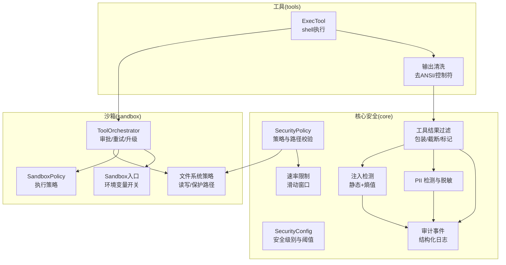
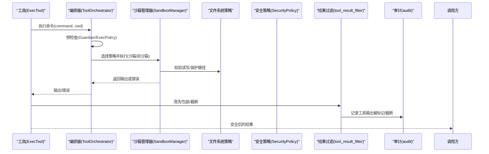
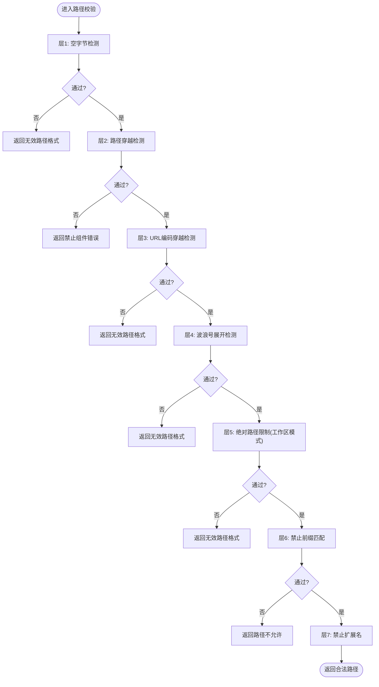
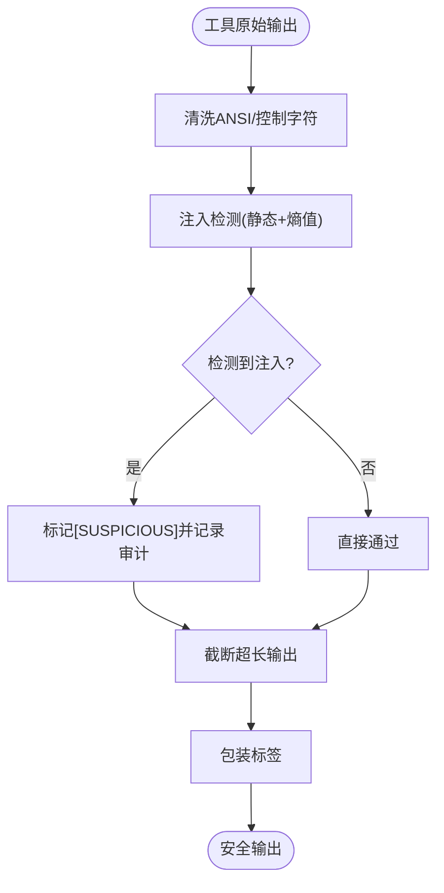
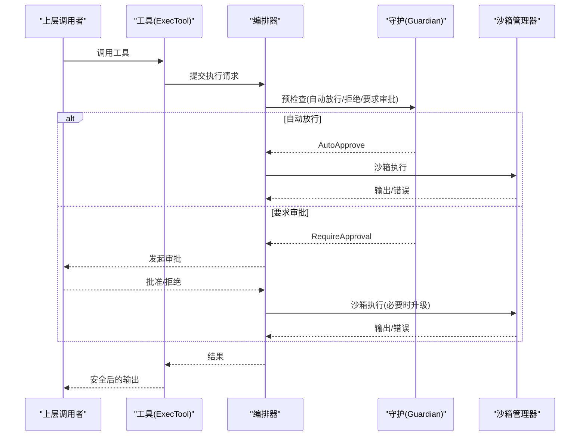
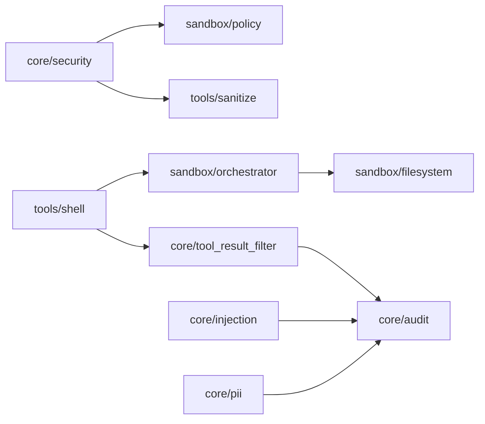

# 安全边界控制

<cite>
**本文引用的文件**
- [agent-diva-core/src/security/mod.rs](file://agent-diva-core/src/security/mod.rs)
- [agent-diva-core/src/security/policy.rs](file://agent-diva-core/src/security/policy.rs)
- [agent-diva-core/src/security/config.rs](file://agent-diva-core/src/security/config.rs)
- [agent-diva-core/src/security/path.rs](file://agent-diva-core/src/security/path.rs)
- [agent-diva-core/src/security/injection.rs](file://agent-diva-core/src/security/injection.rs)
- [agent-diva-core/src/security/tool_result_filter.rs](file://agent-diva-core/src/security/tool_result_filter.rs)
- [agent-diva-core/src/security/rate_limit.rs](file://agent-diva-core/src/security/rate_limit.rs)
- [agent-diva-core/src/security/pii.rs](file://agent-diva-core/src/security/pii.rs)
- [agent-diva-core/src/audit.rs](file://agent-diva-core/src/audit.rs)
- [agent-diva-sandbox/src/lib.rs](file://agent-diva-sandbox/src/lib.rs)
- [agent-diva-sandbox/src/policy.rs](file://agent-diva-sandbox/src/policy.rs)
- [agent-diva-sandbox/src/filesystem.rs](file://agent-diva-sandbox/src/filesystem.rs)
- [agent-diva-sandbox/src/orchestrator.rs](file://agent-diva-sandbox/src/orchestrator.rs)
- [agent-diva-tools/src/sanitize.rs](file://agent-diva-tools/src/sanitize.rs)
- [agent-diva-tools/src/shell.rs](file://agent-diva-tools/src/shell.rs)
</cite>

## 目录
1. [简介](#简介)
2. [项目结构](#项目结构)
3. [核心组件](#核心组件)
4. [架构总览](#架构总览)
5. [详细组件分析](#详细组件分析)
6. [依赖关系分析](#依赖关系分析)
7. [性能考量](#性能考量)
8. [故障排查指南](#故障排查指南)
9. [结论](#结论)
10. [附录](#附录)

## 简介
本文件系统性阐述 Agent-Diva 的“工具安全边界控制”机制，覆盖以下方面：
- 工具执行的权限模型：文件系统访问、网络请求与系统调用的限制策略。
- 工具结果过滤器：防止敏感信息泄露与恶意输出注入。
- 沙箱隔离：进程隔离、内存与资源配额、执行策略。
- 工具间安全通信协议：避免跨工具数据污染与攻击向量。
- 安全策略配置与审计日志记录。
- 安全最佳实践与常见威胁防护方案。

## 项目结构
Agent-Diva 的安全能力由 core（策略与检测）、sandbox（执行隔离与编排）、tools（工具实现与输出清洗）三部分协同完成：
- core/security：统一安全策略、路径校验、速率限制、注入检测、PII 脱敏、工具结果过滤等。
- sandbox：命令执行策略、文件系统白名单/黑名单、审批与自动放行、编排器（Orchestrator）。
- tools：具体工具（如 shell exec）的实现，负责参数校验、工作目录约束、输出清洗与调用编排器。

图表来源
- [agent-diva-core/src/security/mod.rs:26-68](file://agent-diva-core/src/security/mod.rs#L26-L68)
- [agent-diva-core/src/security/policy.rs:14-23](file://agent-diva-core/src/security/policy.rs#L14-L23)
- [agent-diva-core/src/security/config.rs:51-128](file://agent-diva-core/src/security/config.rs#L51-L128)
- [agent-diva-core/src/security/injection.rs:1-12](file://agent-diva-core/src/security/injection.rs#L1-L12)
- [agent-diva-core/src/security/tool_result_filter.rs:1-11](file://agent-diva-core/src/security/tool_result_filter.rs#L1-L11)
- [agent-diva-core/src/security/rate_limit.rs:1-13](file://agent-diva-core/src/security/rate_limit.rs#L1-L13)
- [agent-diva-core/src/audit.rs:1-9](file://agent-diva-core/src/audit.rs#L1-L9)
- [agent-diva-sandbox/src/lib.rs:1-18](file://agent-diva-sandbox/src/lib.rs#L1-L18)
- [agent-diva-sandbox/src/policy.rs:9-51](file://agent-diva-sandbox/src/policy.rs#L9-L51)
- [agent-diva-sandbox/src/filesystem.rs:9-17](file://agent-diva-sandbox/src/filesystem.rs#L9-L17)
- [agent-diva-sandbox/src/orchestrator.rs:1-6](file://agent-diva-sandbox/src/orchestrator.rs#L1-L6)
- [agent-diva-tools/src/shell.rs:1-18](file://agent-diva-tools/src/shell.rs#L1-L18)
- [agent-diva-tools/src/sanitize.rs:1-18](file://agent-diva-tools/src/sanitize.rs#L1-L18)

章节来源
- [agent-diva-core/src/security/mod.rs:26-68](file://agent-diva-core/src/security/mod.rs#L26-L68)
- [agent-diva-sandbox/src/lib.rs:1-18](file://agent-diva-sandbox/src/lib.rs#L1-L18)
- [agent-diva-tools/src/shell.rs:1-18](file://agent-diva-tools/src/shell.rs#L1-L18)

## 核心组件
- 统一安全策略（SecurityPolicy）：整合配置、路径校验、速率限制与工作区边界控制。
- 安全配置（SecurityConfig）：提供安全级别预设、阈值、超时、预算与拒绝熔断等。
- 注入检测（injection）：三层防御（静态模式匹配、熵值分析、预留模型分类），对工具输出进行可疑标记。
- 工具结果过滤（tool_result_filter）：将工具输出包裹为“不可信”，检测注入并截断超长输出。
- PII 检测与脱敏（pii）：多类别识别与替换/拦截，支持严重级别与自定义规则。
- 速率限制（rate_limit）：滑动窗口计数，防止高频操作滥用。
- 沙箱策略（SandboxPolicy）：定义执行模式（只读/工作区写入/外部沙箱/危险全开放）与网络访问控制。
- 文件系统策略（filesystem）：基于 glob/特殊路径的读写控制与默认保护路径。
- 编排器（ToolOrchestrator）：审批前置、首次尝试、失败重试/升级、缓存决策。
- 审计（audit）：统一事件发射，供 GUI/CLI 消费。

章节来源
- [agent-diva-core/src/security/policy.rs:14-23](file://agent-diva-core/src/security/policy.rs#L14-L23)
- [agent-diva-core/src/security/config.rs:51-128](file://agent-diva-core/src/security/config.rs#L51-L128)
- [agent-diva-core/src/security/injection.rs:1-12](file://agent-diva-core/src/security/injection.rs#L1-L12)
- [agent-diva-core/src/security/tool_result_filter.rs:1-11](file://agent-diva-core/src/security/tool_result_filter.rs#L1-L11)
- [agent-diva-core/src/security/pii.rs:1-21](file://agent-diva-core/src/security/pii.rs#L1-L21)
- [agent-diva-core/src/security/rate_limit.rs:1-13](file://agent-diva-core/src/security/rate_limit.rs#L1-L13)
- [agent-diva-sandbox/src/policy.rs:9-51](file://agent-diva-sandbox/src/policy.rs#L9-L51)
- [agent-diva-sandbox/src/filesystem.rs:9-17](file://agent-diva-sandbox/src/filesystem.rs#L9-L17)
- [agent-diva-sandbox/src/orchestrator.rs:1-6](file://agent-diva-sandbox/src/orchestrator.rs#L1-L6)
- [agent-diva-core/src/audit.rs:1-9](file://agent-diva-core/src/audit.rs#L1-L9)

## 架构总览
下图展示从工具调用到沙箱执行、再到结果过滤与审计的全链路流程。

图表来源
- [agent-diva-tools/src/shell.rs:333-403](file://agent-diva-tools/src/shell.rs#L333-L403)
- [agent-diva-sandbox/src/orchestrator.rs:399-430](file://agent-diva-sandbox/src/orchestrator.rs#L399-L430)
- [agent-diva-sandbox/src/filesystem.rs:44-93](file://agent-diva-sandbox/src/filesystem.rs#L44-L93)
- [agent-diva-core/src/security/policy.rs:74-201](file://agent-diva-core/src/security/policy.rs#L74-L201)
- [agent-diva-core/src/security/tool_result_filter.rs:48-132](file://agent-diva-core/src/security/tool_result_filter.rs#L48-L132)
- [agent-diva-core/src/audit.rs:224-253](file://agent-diva-core/src/audit.rs#L224-L253)

## 详细组件分析

### 权限模型与文件系统访问控制
- 路径校验与安全策略
  - 多层校验：空字节、路径穿越、URL编码穿越、波浪号展开、绝对路径限制、禁止前缀、禁止扩展名。
  - 解析后校验：规范化路径并验证是否在工作区内或允许根内；可选禁用符号链接。
  - 父目录校验：写操作前创建并校验父目录合法性。
- 沙箱文件系统策略
  - 三种模式：受限/无限制/外部沙箱；按条目匹配路径决定读/写权限。
  - 可写根与受保护子路径：默认保护 .git/.diva/.agents/.env 等敏感目录与密钥文件。
  - 读取拒绝匹配器：基于 glob 的默认保护清单。
- 工作区边界强制
  - ExecTool 在解析 working_dir 时强制落在配置的 workspace 范围内，拒绝越界。

图表来源
- [agent-diva-core/src/security/policy.rs:74-137](file://agent-diva-core/src/security/policy.rs#L74-L137)
- [agent-diva-core/src/security/path.rs:8-52](file://agent-diva-core/src/security/path.rs#L8-L52)

章节来源
- [agent-diva-core/src/security/policy.rs:74-233](file://agent-diva-core/src/security/policy.rs#L74-L233)
- [agent-diva-core/src/security/path.rs:8-149](file://agent-diva-core/src/security/path.rs#L8-L149)
- [agent-diva-sandbox/src/filesystem.rs:44-93](file://agent-diva-sandbox/src/filesystem.rs#L44-L93)
- [agent-diva-sandbox/src/filesystem.rs:308-369](file://agent-diva-sandbox/src/filesystem.rs#L308-L369)
- [agent-diva-tools/src/shell.rs:246-298](file://agent-diva-tools/src/shell.rs#L246-L298)

### 网络请求与系统调用限制
- 沙箱策略中的网络访问控制：ReadOnly/WorkspaceWrite/ExternalSandbox/DangerFullAccess 均包含 network_access 字段，默认拒绝。
- 执行策略（ExecPolicy）与守护（Guardian）：可对危险命令进行自动放行/拒绝/要求审批，结合规则库学习。
- 命令规则与禁止前缀：内置危险命令模式（如 rm -rf、格式化磁盘、关机、fork bomb）与平台相关限制。

章节来源
- [agent-diva-sandbox/src/policy.rs:9-51](file://agent-diva-sandbox/src/policy.rs#L9-L51)
- [agent-diva-sandbox/src/policy.rs:166-192](file://agent-diva-sandbox/src/policy.rs#L166-L192)
- [agent-diva-tools/src/shell.rs:170-185](file://agent-diva-tools/src/shell.rs#L170-L185)

### 工具结果过滤器（防泄露与防注入）
- 不可信包装：所有工具输出以 <untrusted>...</untrusted> 包裹，提示 LLM 该来源不可信。
- 注入检测：使用静态正则集与熵值分析，发现可疑内容则添加 [SUSPICIOUS] 标记并记录审计事件。
- 截断保护：超过阈值的输出将被截断并附加说明，防止上下文耗尽攻击。
- 输出清洗：去除 ANSI 转义与控制字符，确保 JSON/LLM 输入稳定。

图表来源
- [agent-diva-core/src/security/tool_result_filter.rs:48-132](file://agent-diva-core/src/security/tool_result_filter.rs#L48-L132)
- [agent-diva-core/src/security/injection.rs:299-409](file://agent-diva-core/src/security/injection.rs#L299-L409)
- [agent-diva-tools/src/sanitize.rs:19-74](file://agent-diva-tools/src/sanitize.rs#L19-L74)

章节来源
- [agent-diva-core/src/security/tool_result_filter.rs:48-132](file://agent-diva-core/src/security/tool_result_filter.rs#L48-L132)
- [agent-diva-core/src/security/injection.rs:299-409](file://agent-diva-core/src/security/injection.rs#L299-L409)
- [agent-diva-tools/src/sanitize.rs:19-74](file://agent-diva-tools/src/sanitize.rs#L19-L74)

### 沙箱环境的隔离机制
- 进程隔离：Windows 受限令牌隔离；Linux 计划引入 Bubblewrap/Landlock/Seccomp（Phase 2）。
- 文件系统隔离：基于白名单/黑名单与默认保护路径，限制读写范围。
- 资源与超时：全局工具超时、每会话/任务 token 预算、拒绝熔断（rejection circuit）防止死循环。
- 环境变量控制：可通过环境变量完全禁用沙箱（仅用于调试/开发）。

章节来源
- [agent-diva-sandbox/src/lib.rs:1-18](file://agent-diva-sandbox/src/lib.rs#L1-L18)
- [agent-diva-sandbox/src/lib.rs:107-115](file://agent-diva-sandbox/src/lib.rs#L107-L115)
- [agent-diva-core/src/security/config.rs:94-128](file://agent-diva-core/src/security/config.rs#L94-L128)
- [agent-diva-core/src/security/config.rs:142-178](file://agent-diva-core/src/security/config.rs#L142-L178)

### 工具间安全通信协议
- 通过编排器统一入口：所有工具执行经 ToolOrchestrator 审批与策略判定，避免绕过。
- 审批与缓存：同一命令在工作区内的审批决策可缓存复用，减少重复交互。
- 失败重试与升级：沙箱拒绝或失败时可申请升级执行（需审批），并限制危险前缀。
- 输出标准化：工具输出经 sanitize 与 tool_result_filter 处理后再进入 LLM 上下文，避免污染。

图表来源
- [agent-diva-sandbox/src/orchestrator.rs:399-430](file://agent-diva-sandbox/src/orchestrator.rs#L399-L430)
- [agent-diva-sandbox/src/orchestrator.rs:432-514](file://agent-diva-sandbox/src/orchestrator.rs#L432-L514)
- [agent-diva-sandbox/src/orchestrator.rs:579-722](file://agent-diva-sandbox/src/orchestrator.rs#L579-L722)

章节来源
- [agent-diva-sandbox/src/orchestrator.rs:399-722](file://agent-diva-sandbox/src/orchestrator.rs#L399-L722)
- [agent-diva-tools/src/shell.rs:392-440](file://agent-diva-tools/src/shell.rs#L392-L440)

### 安全策略配置方法
- 安全级别预设：Permissive/Standard/Strict/Paranoid，影响工作区限制、只读模式、速率上限等。
- 配置文件加载优先级：工作区 .agent-diva/security.json > 家目录 security.json > 家目录 config.json 的 security 段。
- 关键配置项：
  - 工作区限制、允许根、禁止路径/扩展名
  - 最大文件大小、符号链接策略
  - 全局工具超时、token 预算、拒绝熔断窗口与阈值
  - 注入检测开关与阻断阈值
  - PII 检测开关与严重级别

章节来源
- [agent-diva-core/src/security/config.rs:11-49](file://agent-diva-core/src/security/config.rs#L11-L49)
- [agent-diva-core/src/security/config.rs:51-128](file://agent-diva-core/src/security/config.rs#L51-L128)
- [agent-diva-core/src/security/config.rs:181-231](file://agent-diva-core/src/security/config.rs#L181-L231)
- [agent-diva-core/src/security/config.rs:249-273](file://agent-diva-core/src/security/config.rs#L249-L273)

### 审计日志记录机制
- 统一事件发射：所有重要安全事件通过 audit::emit 以 target="audit" 的结构化 JSON 行输出。
- 事件类型包括：工具调用/拒绝、注入检测、PII 脱敏、工具输出被标记/截断、技能加载/拒绝/隔离、渠道认证失败、策略决策、定时任务、提供者调用等。
- 消费者：GUI/CLI 订阅审计流，用于可视化与告警。

章节来源
- [agent-diva-core/src/audit.rs:1-9](file://agent-diva-core/src/audit.rs#L1-L9)
- [agent-diva-core/src/audit.rs:33-222](file://agent-diva-core/src/audit.rs#L33-L222)
- [agent-diva-core/src/audit.rs:224-253](file://agent-diva-core/src/audit.rs#L224-L253)

## 依赖关系分析
- core 与 sandbox 的桥接：SandboxPolicy 与 SecurityPolicy 相互转换，保证策略一致性。
- tools 与 core/sandbox：工具通过编排器调用沙箱，并对输出进行清洗与过滤。
- 审计贯穿全链路：注入检测、PII 脱敏、工具输出处理均产生审计事件。

图表来源
- [agent-diva-sandbox/src/policy.rs:64-108](file://agent-diva-sandbox/src/policy.rs#L64-L108)
- [agent-diva-sandbox/src/policy.rs:230-283](file://agent-diva-sandbox/src/policy.rs#L230-L283)
- [agent-diva-tools/src/shell.rs:333-403](file://agent-diva-tools/src/shell.rs#L333-L403)
- [agent-diva-core/src/security/tool_result_filter.rs:48-132](file://agent-diva-core/src/security/tool_result_filter.rs#L48-L132)
- [agent-diva-core/src/security/injection.rs:299-409](file://agent-diva-core/src/security/injection.rs#L299-L409)
- [agent-diva-core/src/security/pii.rs:298-627](file://agent-diva-core/src/security/pii.rs#L298-L627)
- [agent-diva-core/src/audit.rs:224-253](file://agent-diva-core/src/audit.rs#L224-L253)

章节来源
- [agent-diva-sandbox/src/policy.rs:64-108](file://agent-diva-sandbox/src/policy.rs#L64-L108)
- [agent-diva-sandbox/src/policy.rs:230-283](file://agent-diva-sandbox/src/policy.rs#L230-L283)
- [agent-diva-tools/src/shell.rs:333-403](file://agent-diva-tools/src/shell.rs#L333-L403)
- [agent-diva-core/src/security/tool_result_filter.rs:48-132](file://agent-diva-core/src/security/tool_result_filter.rs#L48-L132)
- [agent-diva-core/src/security/injection.rs:299-409](file://agent-diva-core/src/security/injection.rs#L299-L409)
- [agent-diva-core/src/security/pii.rs:298-627](file://agent-diva-core/src/security/pii.rs#L298-L627)
- [agent-diva-core/src/audit.rs:224-253](file://agent-diva-core/src/audit.rs#L224-L253)

## 性能考量
- 注入检测使用一次性编译的正则集与熵值计算，单次检测开销低，适合高频调用。
- 工具结果过滤采用常量级包装与线性扫描，截断按字符边界处理，避免 UTF-8 损坏。
- 速率限制使用滑动窗口与互斥锁，时间复杂度近似 O(n) 清理过期项，n 为窗口内动作数。
- 审计事件通过 tracing 低开销输出，失败不中断业务逻辑。

[本节为通用性能讨论，无需特定文件引用]

## 故障排查指南
- 常见问题定位
  - 命令被拒绝：检查 ExecPolicy/Guardian 规则与禁止前缀，确认是否触发审批流程。
  - 路径越界：检查工作区边界强制与路径校验层，确认是否存在符号链接或相对路径穿越。
  - 输出过长：查看工具结果截断标记，调整 MAX_TOOL_RESULT_CHARS 或文件预览长度。
  - 注入误报：审查注入检测模式与熵阈值，必要时调整 injection_block_threshold。
  - PII 误报/漏报：启用/关闭 PII 检测，调整类别严重级别与自定义规则。
- 审计事件检索
  - 过滤 target="audit" 的事件，关注 ToolOutputSanitized、InjectionDetected、PiiRedacted、ToolDenied 等。
- 沙箱开关
  - 开发环境可通过环境变量禁用沙箱，但生产环境务必保持开启。

章节来源
- [agent-diva-sandbox/src/orchestrator.rs:579-722](file://agent-diva-sandbox/src/orchestrator.rs#L579-L722)
- [agent-diva-core/src/security/tool_result_filter.rs:118-132](file://agent-diva-core/src/security/tool_result_filter.rs#L118-L132)
- [agent-diva-core/src/security/injection.rs:299-409](file://agent-diva-core/src/security/injection.rs#L299-L409)
- [agent-diva-core/src/security/pii.rs:298-627](file://agent-diva-core/src/security/pii.rs#L298-L627)
- [agent-diva-core/src/audit.rs:224-253](file://agent-diva-core/src/audit.rs#L224-L253)
- [agent-diva-sandbox/src/lib.rs:107-115](file://agent-diva-sandbox/src/lib.rs#L107-L115)

## 结论
Agent-Diva 的安全边界控制通过“策略—隔离—过滤—审计”的分层设计，实现了工具执行的细粒度权限控制、输出安全与可观测性。核心要点包括：
- 严格的路径与工作区边界校验，防止越权访问。
- 沙箱执行与审批流程，降低恶意命令风险。
- 工具结果的多重过滤（注入检测、PII 脱敏、截断与不可信包装），保障 LLM 上下文安全。
- 统一的审计事件流，便于监控与取证。
建议在生产环境中保持默认严格策略，按需微调阈值与规则，并结合审计进行持续优化。

[本节为总结性内容，无需特定文件引用]

## 附录
- 安全最佳实践
  - 默认启用工作区限制与只读模式，仅在必要时放宽。
  - 使用 Guardian 与 ExecPolicy 建立最小权限规则，逐步学习放行。
  - 保持注入检测与 PII 脱敏开启，定期审查误报/漏报。
  - 合理设置工具超时与 token 预算，防止资源滥用。
  - 生产环境禁用沙箱环境变量，确保隔离生效。
- 常见威胁防护
  - 提示注入：静态模式匹配 + 熵值分析 + 不可信包装。
  - 路径穿越：多层校验 + 规范化路径 + 符号链接限制。
  - 敏感信息泄露：PII 检测与替换，审计追踪。
  - 资源耗尽：速率限制、超时与预算控制。

[本节为通用指导，无需特定文件引用]