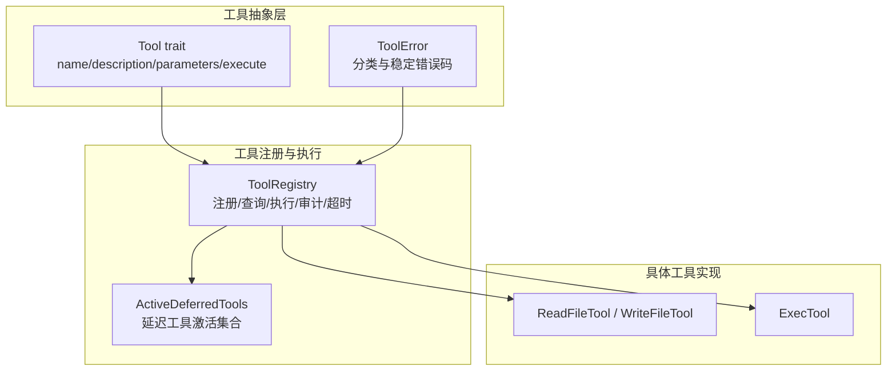
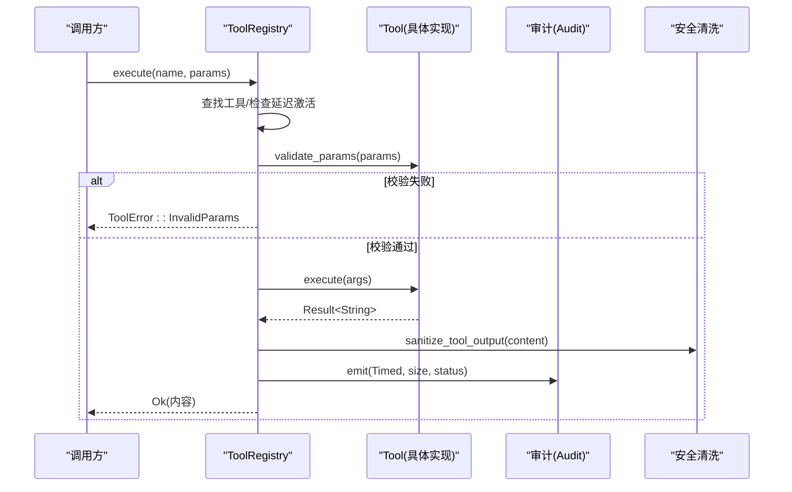
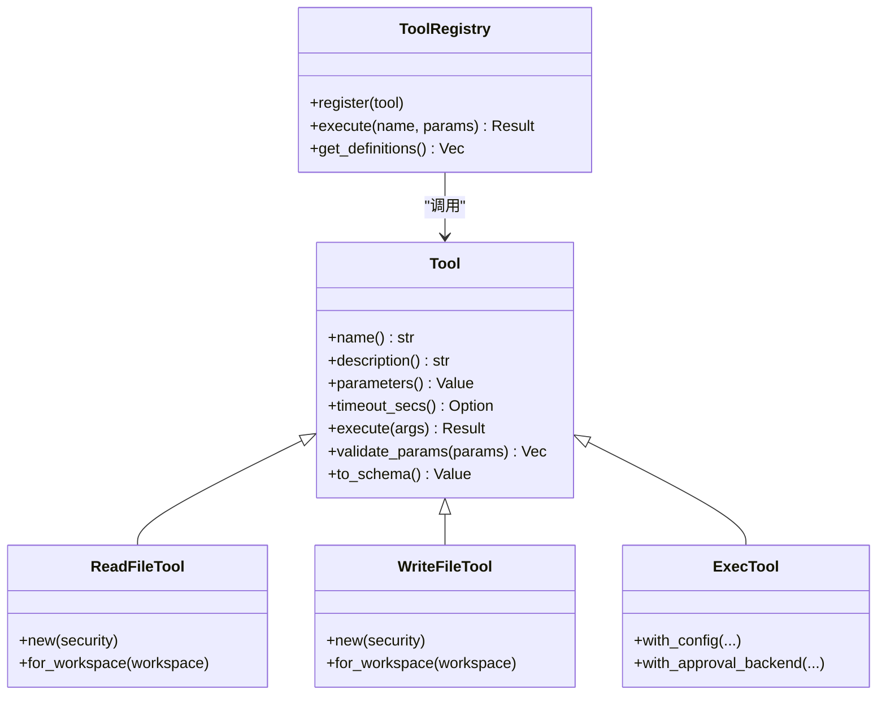
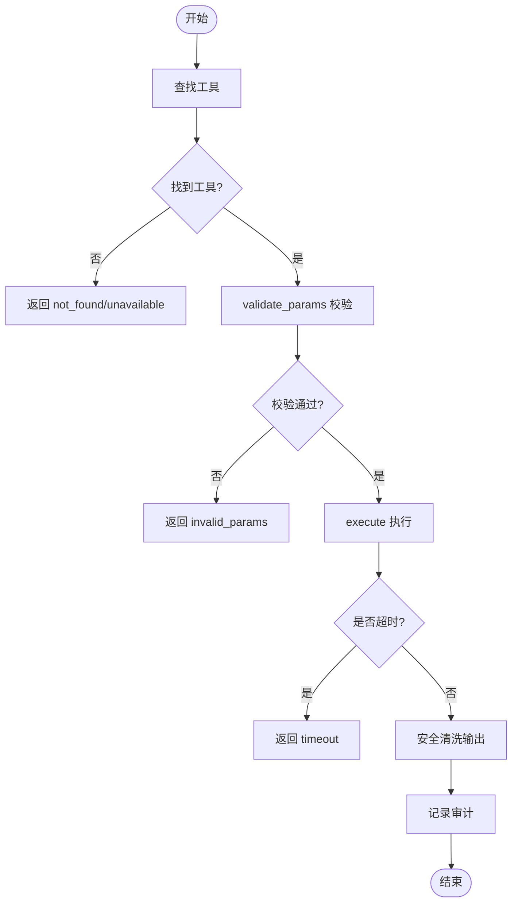

# 工具基类接口

<cite>
**本文引用的文件**
- [agent-diva-tooling/src/base.rs](file://agent-diva-tooling/src/base.rs)
- [agent-diva-tooling/src/registry.rs](file://agent-diva-tooling/src/registry.rs)
- [agent-diva-tooling/src/lib.rs](file://agent-diva-tooling/src/lib.rs)
- [agent-diva-tools/src/base.rs](file://agent-diva-tools/src/base.rs)
- [agent-diva-tools/src/filesystem.rs](file://agent-diva-tools/src/filesystem.rs)
- [agent-diva-tools/src/shell.rs](file://agent-diva-tools/src/shell.rs)
</cite>

## 目录
1. [简介](#简介)
2. [项目结构](#项目结构)
3. [核心组件](#核心组件)
4. [架构总览](#架构总览)
5. [详细组件分析](#详细组件分析)
6. [依赖关系分析](#依赖关系分析)
7. [性能考量](#性能考量)
8. [故障排查指南](#故障排查指南)
9. [结论](#结论)
10. [附录](#附录)

## 简介
本文件系统化说明 Agent-Diva 中的“工具基类接口”，围绕 Tool trait 的定义、参数验证机制、错误处理规范、生命周期方法（初始化/执行/清理）、工具元数据（名称、描述、版本与权限）以及参数类型系统与可选/必填参数约定进行阐述。同时提供自定义工具开发的基类模板与使用示例路径，帮助开发者快速构建符合框架规范的自定义工具。

## 项目结构
Agent-Diva 将工具抽象统一在 agent-diva-tooling 模块中，并通过 agent-diva-tools 提供具体实现；工具注册与执行由 registry 管理，支持延迟激活、审计、超时控制与安全输出清洗。

图表来源
- [agent-diva-tooling/src/base.rs:6-61](file://agent-diva-tooling/src/base.rs#L6-L61)
- [agent-diva-tooling/src/base.rs:63-122](file://agent-diva-tooling/src/base.rs#L63-L122)
- [agent-diva-tooling/src/registry.rs:362-717](file://agent-diva-tooling/src/registry.rs#L362-L717)
- [agent-diva-tools/src/filesystem.rs:14-145](file://agent-diva-tools/src/filesystem.rs#L14-L145)
- [agent-diva-tools/src/shell.rs:54-149](file://agent-diva-tools/src/shell.rs#L54-L149)

章节来源
- [agent-diva-tooling/src/lib.rs:1-14](file://agent-diva-tooling/src/lib.rs#L1-L14)
- [agent-diva-tooling/src/base.rs:1-123](file://agent-diva-tooling/src/base.rs#L1-L123)
- [agent-diva-tooling/src/registry.rs:1-717](file://agent-diva-tooling/src/registry.rs#L1-L717)

## 核心组件
- Tool trait：定义工具的统一契约，包括名称、描述、参数 Schema、执行入口、可选超时覆盖与参数校验。
- ToolError：统一的工具错误枚举，包含无效参数、执行失败、IO 错误、超时、不可用等，并提供错误分类与稳定机器可读的错误码。
- ToolRegistry：工具注册表，负责工具注册、查找、执行编排、审计记录、超时控制、安全输出清洗与延迟工具激活。
- 具体工具：如 ReadFileTool、WriteFileTool、ExecTool 等，遵循 Tool trait 并集成安全策略或沙箱审批。

章节来源
- [agent-diva-tooling/src/base.rs:6-61](file://agent-diva-tooling/src/base.rs#L6-L61)
- [agent-diva-tooling/src/base.rs:63-122](file://agent-diva-tooling/src/base.rs#L63-L122)
- [agent-diva-tooling/src/registry.rs:362-717](file://agent-diva-tooling/src/registry.rs#L362-L717)
- [agent-diva-tools/src/filesystem.rs:14-145](file://agent-diva-tools/src/filesystem.rs#L14-L145)
- [agent-diva-tools/src/shell.rs:54-149](file://agent-diva-tools/src/shell.rs#L54-L149)

## 架构总览
下图展示了从调用方到工具执行的完整流程，包括参数校验、超时控制、审计与结果清洗。

图表来源
- [agent-diva-tooling/src/registry.rs:534-699](file://agent-diva-tooling/src/registry.rs#L534-L699)
- [agent-diva-tooling/src/base.rs:26-48](file://agent-diva-tooling/src/base.rs#L26-L48)

章节来源
- [agent-diva-tooling/src/registry.rs:534-699](file://agent-diva-tooling/src/registry.rs#L534-L699)

## 详细组件分析

### Tool trait 定义与必需方法
- name()：返回工具唯一名称，用于注册与调用。
- description()：工具描述，参与 Schema 生成与搜索排序。
- parameters()：返回 JSON Schema（OpenAI function schema 的 parameters 部分），用于参数类型与必填项声明。
- execute(args)：异步执行入口，接收参数对象并返回字符串结果。
- timeout_secs()：可选覆盖全局超时，默认 None。
- validate_params(params)：默认实现基于 parameters 的 required 字段进行必填校验；可重写以扩展规则。
- to_schema()：将工具转换为 OpenAI function schema 格式，便于模型侧发现与调用。

章节来源
- [agent-diva-tooling/src/base.rs:6-61](file://agent-diva-tooling/src/base.rs#L6-L61)

### 参数验证机制与类型系统
- 参数类型系统：采用 JSON Schema 描述，properties 定义字段类型（string、integer、object 等），required 指定必填字段。
- 默认校验逻辑：确保参数为对象，并逐项检查 required 列表是否缺失。
- 可扩展性：可通过重写 validate_params 增加自定义校验（例如范围、格式、业务约束）。
- 典型用法参考：
  - 读取文件工具：path 必填，offset/limit 可选。
  - 写入文件工具：path 与 content 必填。
  - 复杂嵌套对象：alpha.zulu、alpha.alpha 布尔字段。

章节来源
- [agent-diva-tooling/src/base.rs:26-48](file://agent-diva-tooling/src/base.rs#L26-L48)
- [agent-diva-tools/src/filesystem.rs:48-67](file://agent-diva-tools/src/filesystem.rs#L48-L67)
- [agent-diva-tools/src/filesystem.rs:181-196](file://agent-diva-tools/src/filesystem.rs#L181-L196)
- [agent-diva-tooling/src/registry.rs:787-802](file://agent-diva-tooling/src/registry.rs#L787-L802)

### 错误处理规范与工具错误类型
- ToolError 枚举：
  - InvalidParams：参数校验失败。
  - InvalidArguments：参数解析失败（如类型不匹配）。
  - ExecutionFailed：工具执行失败。
  - Io：IO 错误。
  - Timeout：执行超时。
  - ToolUnavailable：延迟工具未激活或授权源不再提供。
  - Error：通用错误。
- 错误分类：实现 CategorizeError，将错误映射到 Timeout、Fatal、Config、Unknown 等类别，便于上层统一处理。
- 稳定错误码：code() 提供稳定的机器可读错误码，便于监控与告警。
- 执行期错误上下文：注册表在执行失败时记录参数、工具名、问题字符等上下文信息，便于定位。

章节来源
- [agent-diva-tooling/src/base.rs:63-122](file://agent-diva-tooling/src/base.rs#L63-L122)
- [agent-diva-tooling/src/registry.rs:592-699](file://agent-diva-tooling/src/registry.rs#L592-L699)

### 工具生命周期方法（初始化/执行/清理）
- 初始化：工具实例通常通过构造函数创建，并可注入安全策略、工作区路径、审批协调器等依赖。
  - 示例：ReadFileTool::for_workspace、WriteFileTool::for_workspace。
- 执行：通过 ToolRegistry.execute 或 execute_structured 触发，内部完成参数校验、超时控制、执行与结果清洗。
- 清理：Tool trait 本身未定义显式清理钩子；资源释放由工具自身管理（如文件句柄、连接关闭）。对于需要生命周期管理的模块，可使用 Module/Bootstrap 的 start/stop 机制（非 Tool 直接职责）。

章节来源
- [agent-diva-tools/src/filesystem.rs:14-36](file://agent-diva-tools/src/filesystem.rs#L14-L36)
- [agent-diva-tooling/src/registry.rs:534-699](file://agent-diva-tooling/src/registry.rs#L534-L699)
- [agent-diva-tooling/src/module.rs:219-216](file://agent-diva-tooling/src/module.rs#L219-L216)

### 工具元数据定义（名称、版本、描述、权限）
- 名称与描述：通过 name() 与 description() 暴露，参与 Schema 生成与搜索排序。
- 版本：当前 Tool trait 未内置 version 字段；如需版本控制，可在工具内部维护或通过外部配置管理。
- 权限要求：
  - 工具级权限通过 SecurityPolicy 与沙箱审批机制实现（如 ExecTool 的 with_approval_backend）。
  - 读/写能力通过工具语义与策略限制（如只读模式过滤）。
  - 延迟工具激活：通过 DeferredToolActivationHandle 控制工具可见性与可用性。

章节来源
- [agent-diva-tooling/src/base.rs:9-16](file://agent-diva-tooling/src/base.rs#L9-L16)
- [agent-diva-tools/src/shell.rs:96-149](file://agent-diva-tools/src/shell.rs#L96-L149)
- [agent-diva-tooling/src/registry.rs:45-90](file://agent-diva-tooling/src/registry.rs#L45-L90)

### 参数类型系统与可选/必填参数定义
- 必填参数：在 parameters 的 required 数组中列出，默认校验会检查是否存在。
- 可选参数：不在 required 中列出，但需在 properties 中定义类型与描述。
- 嵌套对象：支持 object 类型及 properties 嵌套，适合复杂参数结构。
- 示例：
  - read_file：path 必填，offset/limit 可选。
  - write_file：path 与 content 必填。
  - 复杂对象：alpha.zulu、alpha.alpha 布尔字段。

章节来源
- [agent-diva-tools/src/filesystem.rs:48-67](file://agent-diva-tools/src/filesystem.rs#L48-L67)
- [agent-diva-tools/src/filesystem.rs:181-196](file://agent-diva-tools/src/filesystem.rs#L181-L196)
- [agent-diva-tooling/src/registry.rs:787-802](file://agent-diva-tooling/src/registry.rs#L787-L802)

### 自定义工具开发基类模板与使用示例
- 基类模板：实现 Tool trait，提供 name、description、parameters、execute；必要时重写 validate_params 与 timeout_secs。
- 使用示例路径：
  - 文件系统工具：ReadFileTool、WriteFileTool。
  - Shell 执行工具：ExecTool（集成沙箱与审批）。
- 注册与执行：通过 ToolRegistry.register 注册工具，再调用 execute 或 execute_structured。

章节来源
- [agent-diva-tools/src/filesystem.rs:14-145](file://agent-diva-tools/src/filesystem.rs#L14-L145)
- [agent-diva-tools/src/shell.rs:54-149](file://agent-diva-tools/src/shell.rs#L54-L149)
- [agent-diva-tooling/src/registry.rs:452-476](file://agent-diva-tooling/src/registry.rs#L452-L476)

## 依赖关系分析
- Tool trait 被 ToolRegistry 与具体工具实现共同依赖。
- ToolRegistry 依赖审计、错误上下文、安全清洗等核心能力。
- 具体工具依赖安全策略与沙箱审批，体现强内聚与松耦合。

图表来源
- [agent-diva-tooling/src/base.rs:6-61](file://agent-diva-tooling/src/base.rs#L6-L61)
- [agent-diva-tooling/src/registry.rs:362-717](file://agent-diva-tooling/src/registry.rs#L362-L717)
- [agent-diva-tools/src/filesystem.rs:14-145](file://agent-diva-tools/src/filesystem.rs#L14-L145)
- [agent-diva-tools/src/shell.rs:54-149](file://agent-diva-tools/src/shell.rs#L54-L149)

章节来源
- [agent-diva-tooling/src/lib.rs:1-14](file://agent-diva-tooling/src/lib.rs#L1-L14)

## 性能考量
- 超时控制：全局超时与工具级超时覆盖，避免长时间阻塞。
- 输出清洗：对工具输出进行安全清洗与截断，减少大响应对下游的影响。
- 延迟工具激活：仅激活必要的工具，降低模型工具列表大小与搜索成本。
- 审计与日志：记录执行时长、结果大小与状态，便于性能分析与问题定位。

章节来源
- [agent-diva-tooling/src/registry.rs:534-699](file://agent-diva-tooling/src/registry.rs#L534-L699)
- [agent-diva-tooling/src/registry.rs:45-90](file://agent-diva-tooling/src/registry.rs#L45-L90)

## 故障排查指南
- 参数校验失败：检查 parameters 的 required 与 properties 是否与传入参数一致；查看 InvalidParams 错误信息与上下文。
- 工具不可用：确认延迟工具是否已激活；检查 ToolUnavailable 错误与激活集合。
- 执行超时：调整工具级 timeout_secs 或全局超时；查看 Timeout 错误与执行时长。
- IO 错误：检查文件路径、权限与大小限制；查看 Io 错误与路径解析结果。
- 执行失败：查看 ExecutionFailed 错误消息与参数上下文，定位业务逻辑问题。

章节来源
- [agent-diva-tooling/src/base.rs:63-122](file://agent-diva-tooling/src/base.rs#L63-L122)
- [agent-diva-tooling/src/registry.rs:592-699](file://agent-diva-tooling/src/registry.rs#L592-L699)

## 结论
Agent-Diva 的工具基类接口通过 Tool trait 提供了统一、可扩展且安全的工具抽象。结合 ToolRegistry 的执行编排、参数校验、超时控制与安全清洗，开发者可以专注于业务逻辑的实现。通过 JSON Schema 的参数类型系统与可选/必填约定，配合错误分类与稳定错误码，实现了健壮的错误处理与可观测性。建议在新工具开发中遵循该接口，并结合安全策略与沙箱审批，确保工具的安全与可控。

## 附录
- 工具注册与执行流程图（算法视角）：

图表来源
- [agent-diva-tooling/src/registry.rs:534-699](file://agent-diva-tooling/src/registry.rs#L534-L699)
- [agent-diva-tooling/src/base.rs:26-48](file://agent-diva-tooling/src/base.rs#L26-L48)