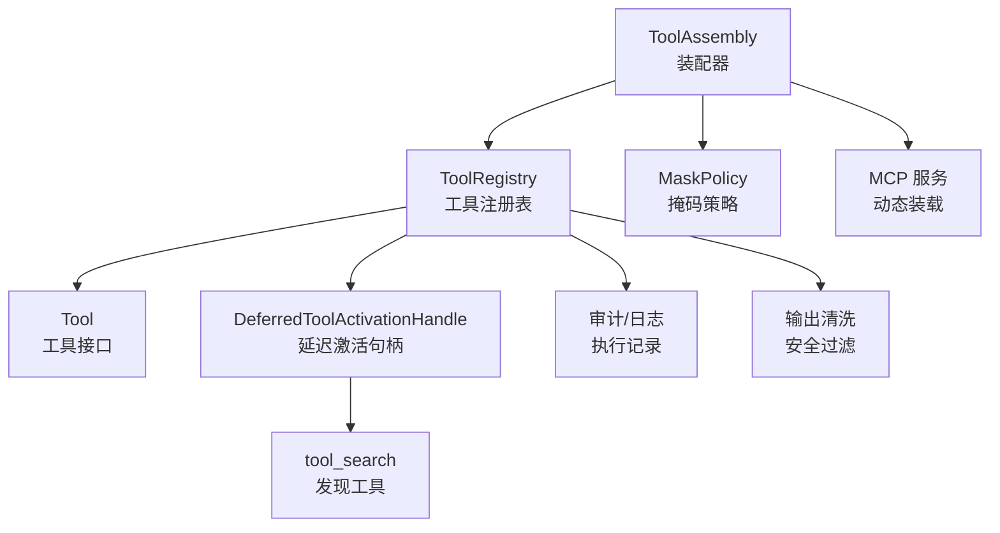
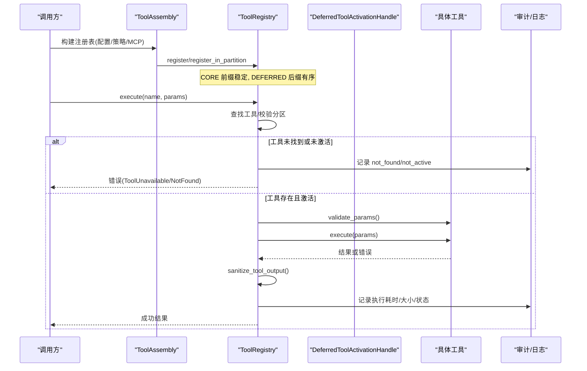
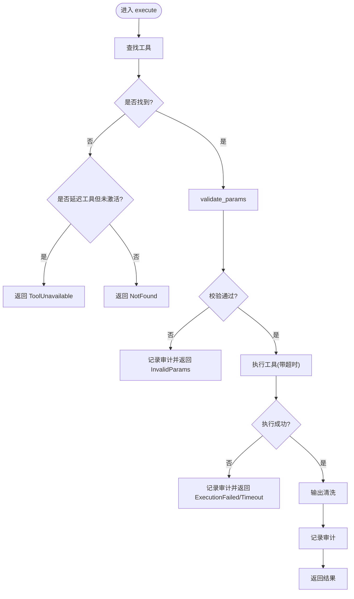
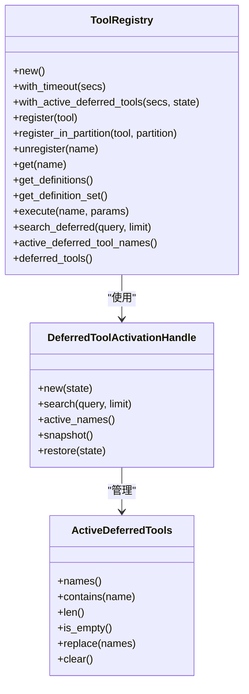
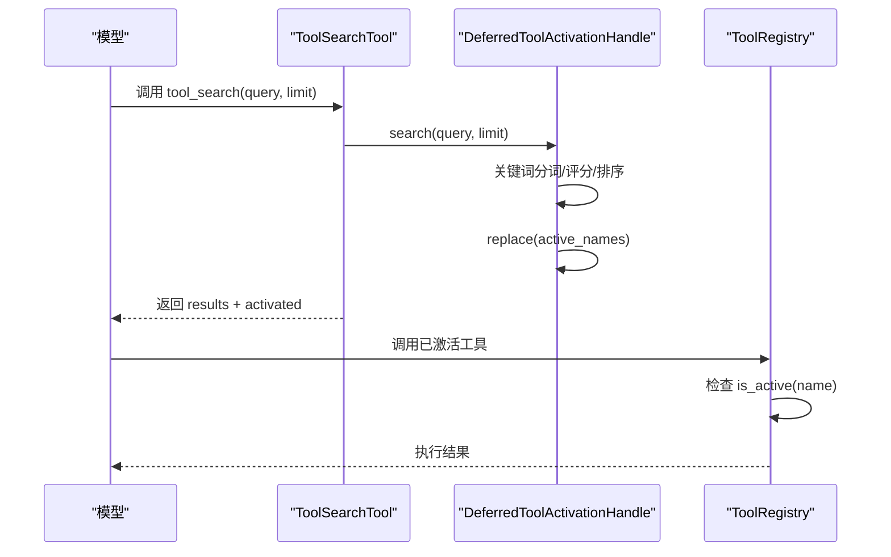
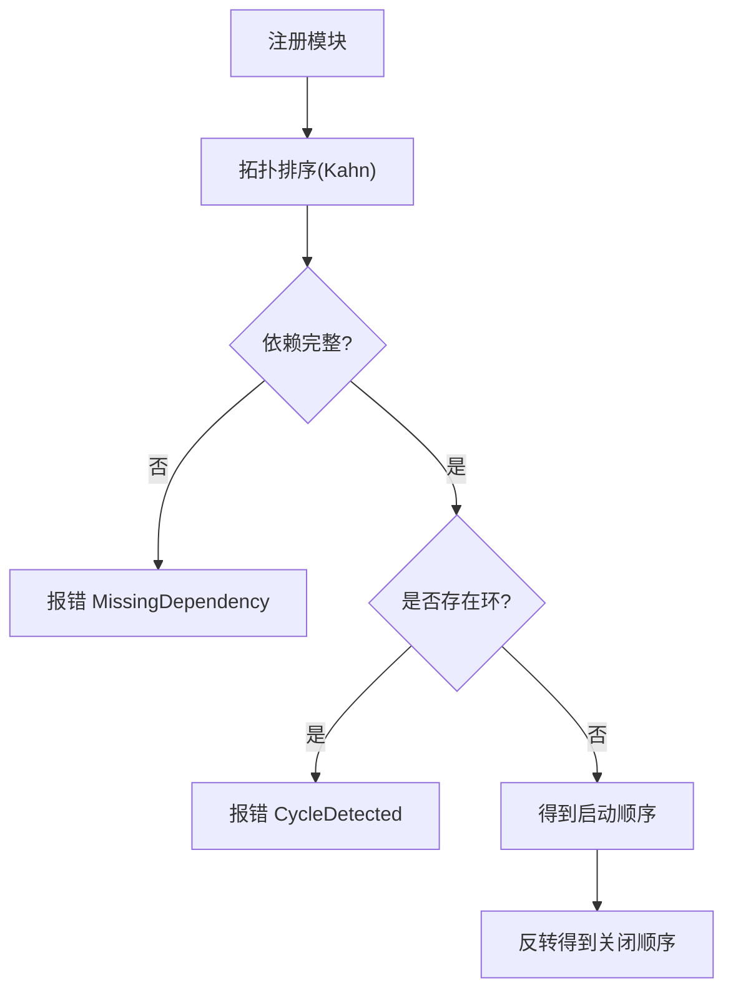
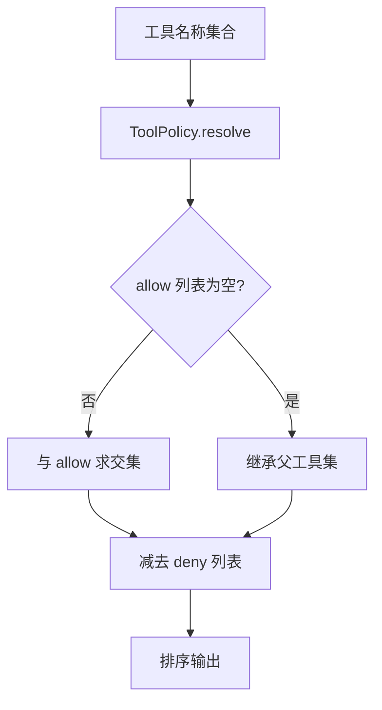
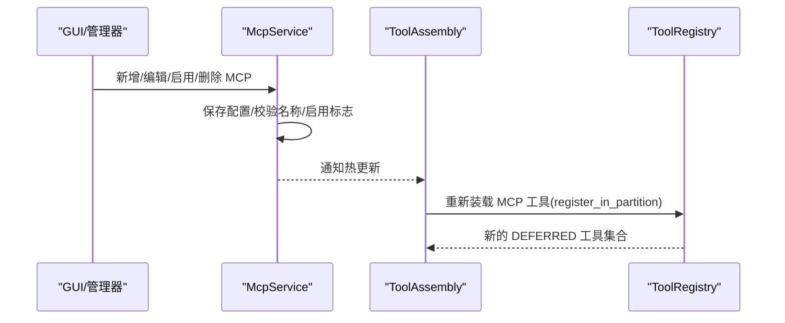
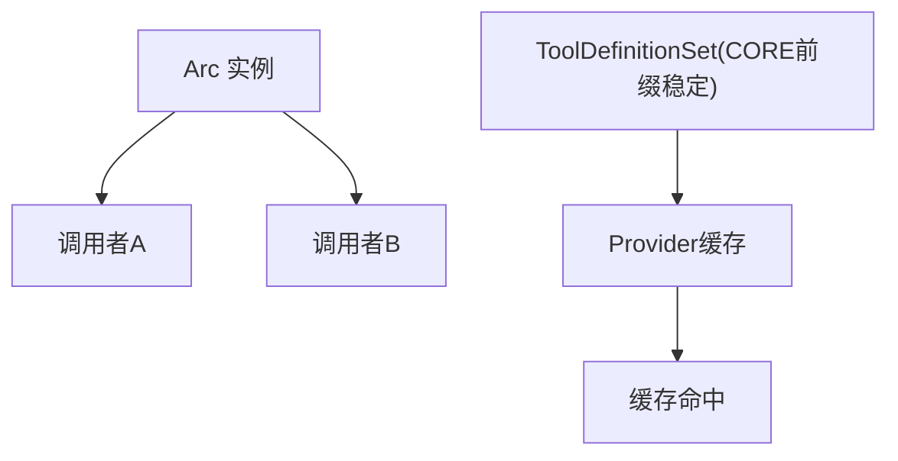
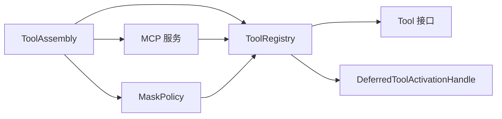

# 工具注册系统

<cite>
**本文引用的文件**
- [agent-diva-tooling/src/registry.rs](file://agent-diva-tooling/src/registry.rs)
- [agent-diva-tooling/src/base.rs](file://agent-diva-tooling/src/base.rs)
- [agent-diva-tooling/src/module.rs](file://agent-diva-tooling/src/module.rs)
- [agent-diva-tooling/src/lib.rs](file://agent-diva-tooling/src/lib.rs)
- [agent-diva-tools/src/tool_discovery.rs](file://agent-diva-tools/src/tool_discovery.rs)
- [agent-diva-agent/src/tool_assembly.rs](file://agent-diva-agent/src/tool_assembly.rs)
- [agent-diva-agent/src/mask/tool_policy.rs](file://agent-diva-agent/src/mask/tool_policy.rs)
- [agent-diva-core/src/tool_artifact/mod.rs](file://agent-diva-core/src/tool_artifact/mod.rs)
- [agent-diva-manager/src/mcp_service.rs](file://agent-diva-manager/src/mcp_service.rs)
- [agent-diva-manager/src/manager/companion_admin.rs](file://agent-diva-manager/src/manager/companion_admin.rs)
- [agent-diva-tools/src/mcp_sdk.rs](file://agent-diva-tools/src/mcp_sdk.rs)
- [agent-diva-agent/src/context_assembly/cache_observe.rs](file://agent-diva-agent/src/context_assembly/cache_observe.rs)
</cite>

## 目录
1. [简介](#简介)
2. [项目结构](#项目结构)
3. [核心组件](#核心组件)
4. [架构总览](#架构总览)
5. [详细组件分析](#详细组件分析)
6. [依赖关系分析](#依赖关系分析)
7. [性能考量](#性能考量)
8. [故障排查指南](#故障排查指南)
9. [结论](#结论)
10. [附录](#附录)

## 简介
本文件系统性阐述 Agent-Diva 的工具注册系统，覆盖工具的发现、加载、生命周期管理、动态注册与移除、依赖解析与版本兼容性检查、命名空间管理与冲突解决、配置加载与校验、实例缓存与复用机制，以及最佳实践与常见问题解决方案。该系统的核心目标是：在保持 provider 请求稳定性的同时，支持运行时按需激活扩展工具（如 MCP），并提供安全、可审计、可观测的执行环境。

## 项目结构
工具注册系统由以下关键模块组成：
- 工具基础抽象与错误模型：定义 Tool trait、执行超时、参数校验、错误分类等。
- 工具注册表：维护工具集合、分区（Core/Deferred）、搜索与激活、执行调度、审计与清理。
- 模块与引导：提供通用模块生命周期与拓扑排序启动/停止能力。
- 装配器：根据配置、掩码策略、计划阶段等条件组装最终工具集。
- 动态发现：通过 tool_search 对授权目录进行关键词检索并激活下一轮调用可见的工具。
- 外部集成：MCP 服务器探测与工具装载、热更新。
- 缓存与稳定性：CORE 前缀稳定化、DEFERRED 后缀动态挂载、序列化规范化。

**图表来源**
- [agent-diva-agent/src/tool_assembly.rs:255-616](file://agent-diva-agent/src/tool_assembly.rs#L255-L616)
- [agent-diva-tooling/src/registry.rs:363-717](file://agent-diva-tooling/src/registry.rs#L363-L717)
- [agent-diva-tooling/src/base.rs:7-61](file://agent-diva-tooling/src/base.rs#L7-L61)
- [agent-diva-tools/src/tool_discovery.rs:9-59](file://agent-diva-tools/src/tool_discovery.rs#L9-L59)
- [agent-diva-agent/src/mask/tool_policy.rs:37-88](file://agent-diva-agent/src/mask/tool_policy.rs#L37-L88)
- [agent-diva-tools/src/mcp_sdk.rs:560-570](file://agent-diva-tools/src/mcp_sdk.rs#L560-L570)

**章节来源**
- [agent-diva-tooling/src/lib.rs:1-14](file://agent-diva-tooling/src/lib.rs#L1-L14)
- [agent-diva-agent/src/tool_assembly.rs:42-68](file://agent-diva-agent/src/tool_assembly.rs#L42-L68)

## 核心组件
- Tool 接口与错误模型：统一工具名称、描述、参数 Schema、可选超时、执行与参数校验、OpenAI function schema 转换；错误类型包含无效参数、执行失败、IO、超时、不可用等，并映射到错误分类。
- ToolRegistry：维护工具映射、全局超时、延迟激活状态；提供注册、注销、查询、获取定义集、执行、搜索、活跃名列表等方法；保证 CORE/DEFERRED 分区边界与排序稳定。
- DeferredToolActivationHandle：任务级共享的“已激活工具”集合与授权目录；支持搜索、替换、快照、恢复；限制最大激活数量。
- ToolSearchTool：暴露 tool_search 能力，按名称、描述、Schema 关键词评分排序，返回结果并设置下一轮激活集合。
- ToolAssembly：根据内置配置、网络配置、掩码策略、计划阶段、MCP 服务器等条件构建最终注册表；将自定义工具与部分功能标记为 DEFERRED。
- Module/Bootstrap：通用模块生命周期与依赖拓扑排序，用于系统服务启动/停止（与工具注册解耦但可协同）。

**章节来源**
- [agent-diva-tooling/src/base.rs:7-123](file://agent-diva-tooling/src/base.rs#L7-L123)
- [agent-diva-tooling/src/registry.rs:15-717](file://agent-diva-tooling/src/registry.rs#L15-L717)
- [agent-diva-tools/src/tool_discovery.rs:9-59](file://agent-diva-tools/src/tool_discovery.rs#L9-L59)
- [agent-diva-agent/src/tool_assembly.rs:255-616](file://agent-diva-agent/src/tool_assembly.rs#L255-L616)
- [agent-diva-tooling/src/module.rs:15-293](file://agent-diva-tooling/src/module.rs#L15-L293)

## 架构总览
工具注册系统采用“装配 + 注册 + 激活”的分层设计：
- 装配层（ToolAssembly）依据配置与策略生成工具集，并将需要延迟暴露的工具放入 DEFERRED 分区。
- 注册层（ToolRegistry）维护工具映射与分区边界，提供执行与定义集生成，确保 CORE 前缀稳定、DEFERRED 后缀有序。
- 激活层（DeferredToolActivationHandle + ToolSearchTool）实现运行时发现与授权激活，控制下一轮 provider 请求中可见的工具集合。
- 外部集成（MCP）通过探测与装载，将远程工具以 DEFERRED 形式注入注册表，支持热更新。
- 安全与合规（MaskPolicy、SecurityPolicy、输出清洗）贯穿注册与执行路径。

**图表来源**
- [agent-diva-agent/src/tool_assembly.rs:255-616](file://agent-diva-agent/src/tool_assembly.rs#L255-L616)
- [agent-diva-tooling/src/registry.rs:535-699](file://agent-diva-tooling/src/registry.rs#L535-L699)
- [agent-diva-tooling/src/base.rs:7-61](file://agent-diva-tooling/src/base.rs#L7-L61)

**章节来源**
- [agent-diva-tooling/src/registry.rs:363-717](file://agent-diva-tooling/src/registry.rs#L363-L717)
- [agent-diva-agent/src/tool_assembly.rs:255-616](file://agent-diva-agent/src/tool_assembly.rs#L255-L616)

## 详细组件分析

### 工具基础与错误处理
- Tool trait 提供 name/description/parameters/to_schema/execute/validate_params/timeout_secs。默认参数校验检查 required 字段缺失。
- ToolError 分类清晰，便于上层策略处理（超时、配置、致命、未知）。
- 执行路径中，参数校验失败会记录审计事件并返回 invalid_params；执行异常记录错误上下文与问题字符；超时返回 timeout。

**图表来源**
- [agent-diva-tooling/src/registry.rs:535-699](file://agent-diva-tooling/src/registry.rs#L535-L699)
- [agent-diva-tooling/src/base.rs:7-123](file://agent-diva-tooling/src/base.rs#L7-L123)

**章节来源**
- [agent-diva-tooling/src/base.rs:7-123](file://agent-diva-tooling/src/base.rs#L7-L123)
- [agent-diva-tooling/src/registry.rs:535-699](file://agent-diva-tooling/src/registry.rs#L535-L699)

### 工具注册表与分区机制
- 分区：Core（始终可见、缓存友好前缀）与 Deferred（MCP/扩展/动态激活工具）。
- 定义集生成时按分区与工具名排序，递归规范化 JSON 对象键序，保证相同工具集的序列化字节一致。
- 注册/注销：register/register_in_partition/unregister；Deferred 工具加入授权目录并可被搜索激活。
- 执行：先检查分区与激活状态，再参数校验、执行、清洗、审计。

**图表来源**
- [agent-diva-tooling/src/registry.rs:363-717](file://agent-diva-tooling/src/registry.rs#L363-L717)
- [agent-diva-tooling/src/registry.rs:51-232](file://agent-diva-tooling/src/registry.rs#L51-L232)

**章节来源**
- [agent-diva-tooling/src/registry.rs:23-44](file://agent-diva-tooling/src/registry.rs#L23-L44)
- [agent-diva-tooling/src/registry.rs:327-532](file://agent-diva-tooling/src/registry.rs#L327-L532)
- [agent-diva-tooling/src/registry.rs:719-734](file://agent-diva-tooling/src/registry.rs#L719-L734)

### 动态工具注册流程（tool_search）
- 通过 ToolSearchTool 暴露 tool_search，允许模型按 query 搜索授权目录中的 Deferred 工具。
- 搜索算法基于名称、描述、Schema 关键词分词与匹配得分，取 top-k（默认 8，上限 20）。
- 搜索结果替换当前任务的激活集合，下一轮 provider 请求即可直接调用这些工具，无需额外 mount。

**图表来源**
- [agent-diva-tools/src/tool_discovery.rs:9-59](file://agent-diva-tools/src/tool_discovery.rs#L9-L59)
- [agent-diva-tooling/src/registry.rs:154-197](file://agent-diva-tooling/src/registry.rs#L154-L197)
- [agent-diva-tooling/src/registry.rs:415-450](file://agent-diva-tooling/src/registry.rs#L415-L450)

**章节来源**
- [agent-diva-tools/src/tool_discovery.rs:9-59](file://agent-diva-tools/src/tool_discovery.rs#L9-L59)
- [agent-diva-tooling/src/registry.rs:154-197](file://agent-diva-tooling/src/registry.rs#L154-L197)

### 工具依赖解析与版本兼容性
- 模块依赖解析：ModuleRegistry 使用 Kahn 算法进行拓扑排序，检测循环依赖与缺失依赖，确保 start/stop 顺序正确。
- 工具层面：Tool 接口无显式依赖声明；依赖通过装配器（ToolAssembly）在构建时注入（如 MemoryProvider、CronService、FileManager 等）。
- 版本兼容：工具产物（artifact）读取时校验元数据版本，不匹配则视为损坏；这为工具产物持久化的兼容性提供了保障。

**图表来源**
- [agent-diva-tooling/src/module.rs:144-216](file://agent-diva-tooling/src/module.rs#L144-L216)
- [agent-diva-core/src/tool_artifact/mod.rs:474-479](file://agent-diva-core/src/tool_artifact/mod.rs#L474-L479)

**章节来源**
- [agent-diva-tooling/src/module.rs:144-216](file://agent-diva-tooling/src/module.rs#L144-L216)
- [agent-diva-core/src/tool_artifact/mod.rs:474-479](file://agent-diva-core/src/tool_artifact/mod.rs#L474-L479)

### 命名空间管理与冲突解决
- 工具命名：Tool.name() 作为唯一标识；注册表使用 HashMap 存储，同名覆盖会导致冲突。
- 冲突解决：注册时以 name 为键插入；若需避免冲突，应在装配阶段确保名称唯一（例如使用前缀或作用域隔离）。
- 掩码策略：ToolPolicy 基于 allow/deny 列表计算有效工具集，子代理继承父工具集交集后减去 deny，保证 child ⊆ parent。

**图表来源**
- [agent-diva-agent/src/mask/tool_policy.rs:37-88](file://agent-diva-agent/src/mask/tool_policy.rs#L37-L88)

**章节来源**
- [agent-diva-tooling/src/registry.rs:452-483](file://agent-diva-tooling/src/registry.rs#L452-L483)
- [agent-diva-agent/src/mask/tool_policy.rs:37-88](file://agent-diva-agent/src/mask/tool_policy.rs#L37-L88)

### 配置加载与验证过程
- 装配器接收多种配置：内置工具开关、网络配置、MCP 服务器、掩码配置、计划阶段、执行会话 ID、命令审批策略等。
- 掩码策略：read-only 模式仅保留只读工具；计划阶段限制能力；mask tool_limits 进一步过滤。
- MCP 配置：通过 McpService 管理增删改查与启用/禁用，变更后触发运行时热更新，替换现有 mcp_* 工具集合。

**图表来源**
- [agent-diva-manager/src/mcp_service.rs:62-93](file://agent-diva-manager/src/mcp_service.rs#L62-L93)
- [agent-diva-manager/src/manager/companion_admin.rs:44-90](file://agent-diva-manager/src/manager/companion_admin.rs#L44-L90)
- [agent-diva-agent/src/tool_assembly.rs:526-534](file://agent-diva-agent/src/tool_assembly.rs#L526-L534)

**章节来源**
- [agent-diva-agent/src/tool_assembly.rs:255-616](file://agent-diva-agent/src/tool_assembly.rs#L255-L616)
- [agent-diva-manager/src/mcp_service.rs:62-93](file://agent-diva-manager/src/mcp_service.rs#L62-L93)
- [agent-diva-manager/src/manager/companion_admin.rs:44-90](file://agent-diva-manager/src/manager/companion_admin.rs#L44-L90)

### 实例缓存与复用机制
- 工具实例：注册表持有 Arc<dyn Tool>，天然支持多调用者共享同一实例，减少重复创建开销。
- 定义集缓存：CORE 前缀稳定化与 JSON 键规范化确保相同工具集的序列化字节一致，利于 provider 层缓存命中。
- 上下文观察：最终 wire 前计算稳定前缀指纹，DEFERRED 变化作为活动工具集变化处理，不污染 CORE 前缀指纹。

**图表来源**
- [agent-diva-tooling/src/registry.rs:357-367](file://agent-diva-tooling/src/registry.rs#L357-L367)
- [agent-diva-tooling/src/registry.rs:503-532](file://agent-diva-tooling/src/registry.rs#L503-L532)
- [agent-diva-agent/src/context_assembly/cache_observe.rs:207-213](file://agent-diva-agent/src/context_assembly/cache_observe.rs#L207-L213)

**章节来源**
- [agent-diva-tooling/src/registry.rs:357-367](file://agent-diva-tooling/src/registry.rs#L357-L367)
- [agent-diva-agent/src/context_assembly/cache_observe.rs:207-213](file://agent-diva-agent/src/context_assembly/cache_observe.rs#L207-L213)

## 依赖关系分析
- ToolAssembly 依赖多个子系统：MemoryProvider、CronService、FileManager、RunStore、CommandApprovalCoordinator、AskUserCoordinator、SecurityPolicy 等，通过 builder 模式注入。
- ToolRegistry 依赖 Tool 接口与 DeferredToolActivationHandle；执行路径依赖审计与安全清洗。
- MCP 集成通过 load_mcp_tools_sync 将远程工具以 DEFERRED 形式注册，支持热更新。
- MaskPolicy 在装配后期应用 allow/deny 过滤，确保最小权限原则。

**图表来源**
- [agent-diva-agent/src/tool_assembly.rs:255-616](file://agent-diva-agent/src/tool_assembly.rs#L255-L616)
- [agent-diva-agent/src/mask/tool_policy.rs:37-88](file://agent-diva-agent/src/mask/tool_policy.rs#L37-L88)
- [agent-diva-tools/src/mcp_sdk.rs:560-570](file://agent-diva-tools/src/mcp_sdk.rs#L560-L570)

**章节来源**
- [agent-diva-agent/src/tool_assembly.rs:255-616](file://agent-diva-agent/src/tool_assembly.rs#L255-L616)
- [agent-diva-agent/src/mask/tool_policy.rs:37-88](file://agent-diva-agent/src/mask/tool_policy.rs#L37-L88)
- [agent-diva-tools/src/mcp_sdk.rs:560-570](file://agent-diva-tools/src/mcp_sdk.rs#L560-L570)

## 性能考量
- 工具定义集稳定：CORE 前缀连续、DEFERRED 后缀有序、JSON 键规范化，提升 provider 缓存命中率。
- 动态激活限制：单次搜索最多激活 8 个工具，避免 provider 请求过大。
- 执行超时：全局超时与 per-tool 超时双重保护，防止长任务阻塞。
- 输出清洗：执行结果经过安全清洗，减少敏感信息泄露风险。
- 缓存观察：最终 wire 前计算稳定前缀指纹，DEFERRED 变化不污染 CORE 前缀，降低误判。

[本节为一般性指导，不直接分析具体文件]

## 故障排查指南
- 工具未找到：检查名称是否正确、是否已被掩码策略移除、是否在 DEFERRED 分区但未激活。
- 工具不可用：确认是否为 Deferred 工具且已通过 tool_search 激活；检查授权目录是否仍包含该工具。
- 参数校验失败：查看审计日志中的 invalid_params 消息与问题字符提示，修正参数结构。
- 执行超时：检查工具超时配置与实现，必要时调整 global_timeout_secs 或 per-tool timeout_secs。
- MCP 热更新失败：确认配置保存成功、启用标志正确、运行时已触发 reload；检查连接状态与错误信息。

**章节来源**
- [agent-diva-tooling/src/registry.rs:535-699](file://agent-diva-tooling/src/registry.rs#L535-L699)
- [agent-diva-tooling/src/base.rs:64-123](file://agent-diva-tooling/src/base.rs#L64-L123)
- [agent-diva-manager/src/mcp_service.rs:62-93](file://agent-diva-manager/src/mcp_service.rs#L62-L93)

## 结论
工具注册系统通过“装配 + 注册 + 激活”的分层设计，实现了稳定、安全、可扩展的工具生态。CORE/DEFERRED 分区保障了 provider 缓存友好性与动态扩展能力；tool_search 提供了运行时按需激活机制；掩码策略与安全检查确保了最小权限与输出安全；MCP 集成支持热更新与远程工具无缝接入。遵循本文的最佳实践可有效避免常见陷阱，提升系统可靠性与可维护性。

[本节为总结性内容，不直接分析具体文件]

## 附录
- 最佳实践
  - 将稳定、高频使用的工具注册为 Core，减少请求体积与缓存失效。
  - 将扩展、远程、低频工具注册为 Deferred，并通过 tool_search 按需激活。
  - 使用掩码策略精确控制可用工具集，遵循 child ⊆ parent 不变式。
  - 为长耗时工具设置合适的超时，避免阻塞主流程。
  - 定期审查工具名称与 Schema，确保唯一性与一致性。
- 常见问题
  - 名称冲突：确保装配阶段名称唯一，必要时引入命名空间前缀。
  - 激活失效：确认 tool_search 查询条件与授权目录；检查 active set 上限。
  - 配置变更未生效：确认 MCP 配置保存成功并触发热更新；检查运行时状态。

[本节为补充性内容，不直接分析具体文件]