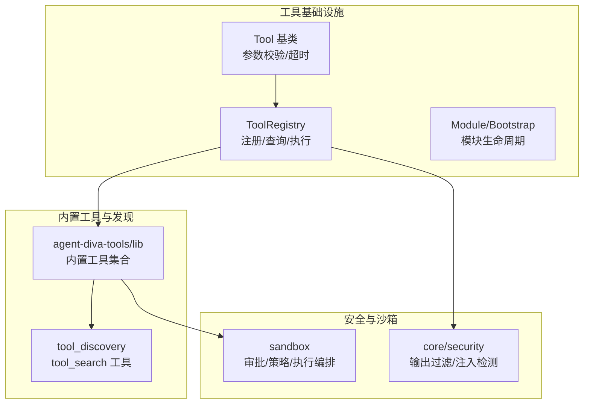
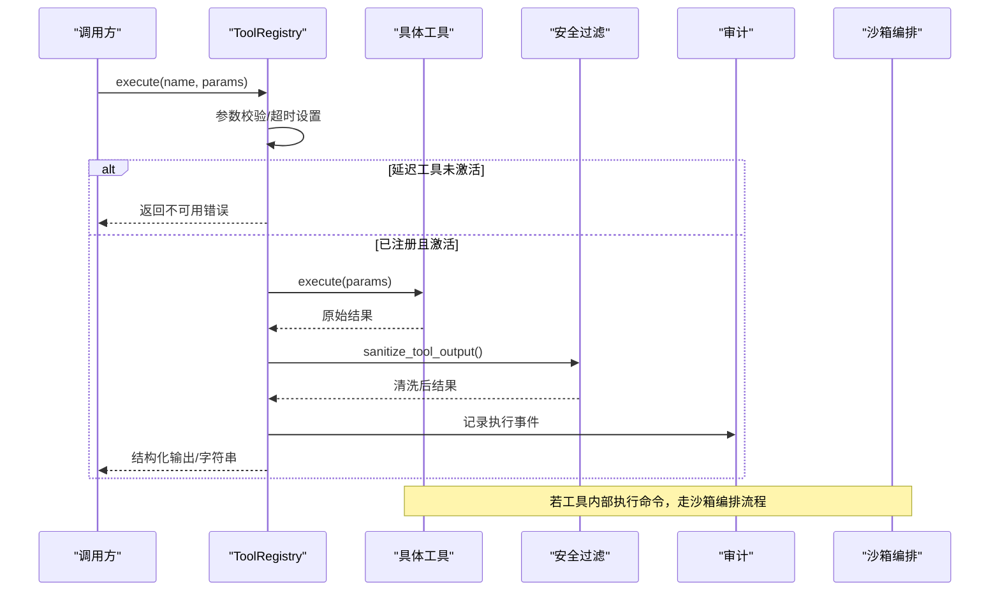
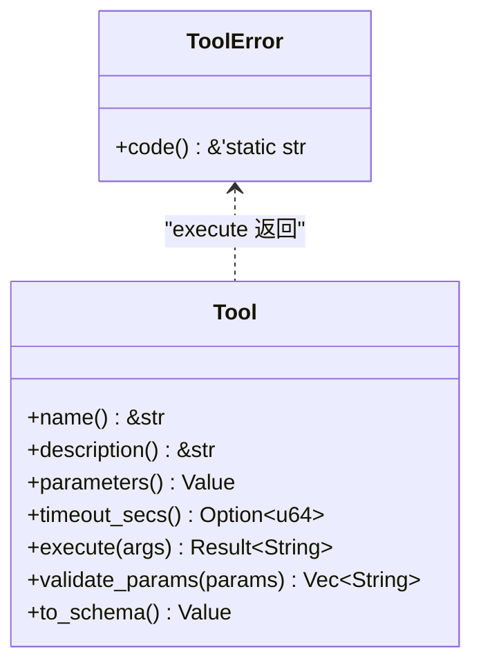
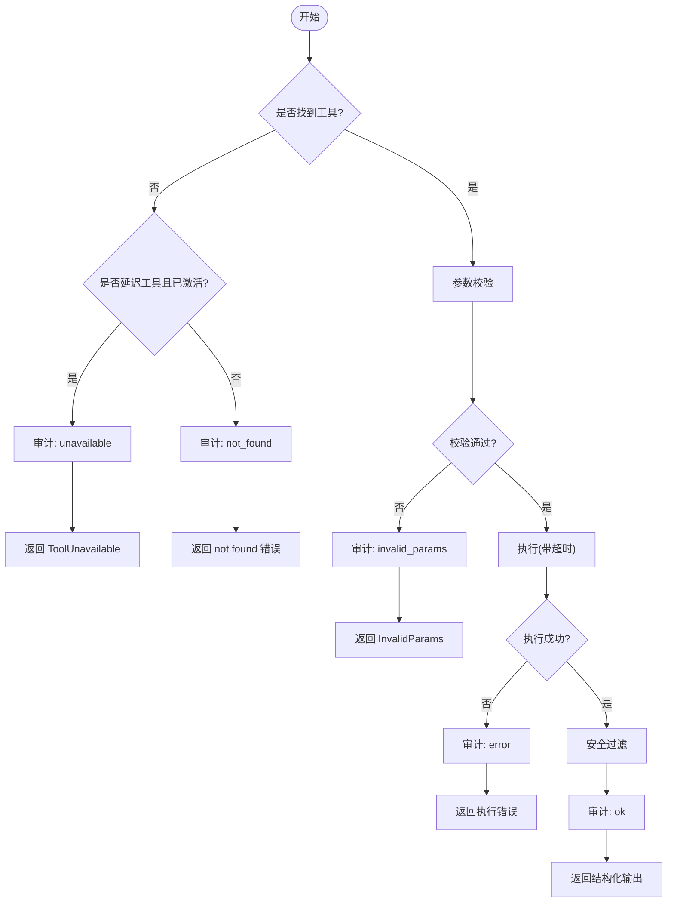
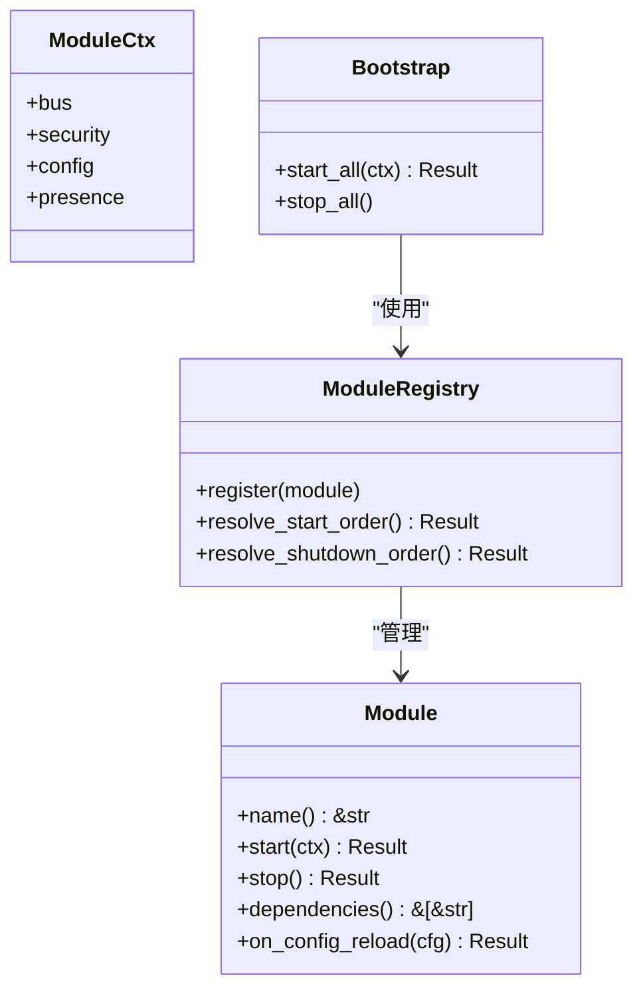
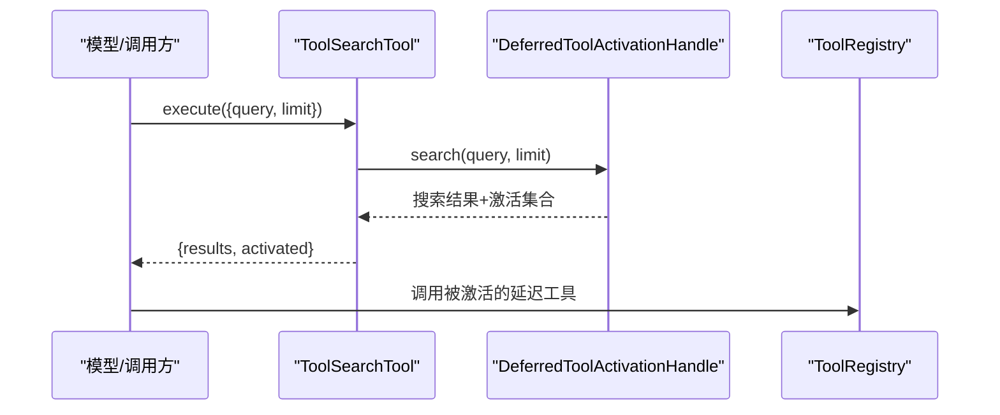
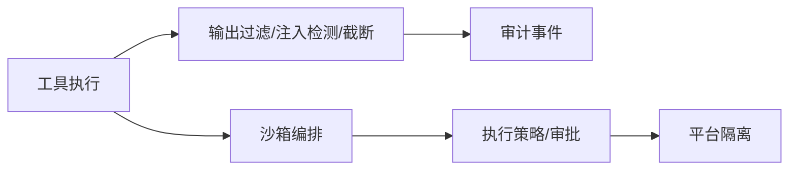
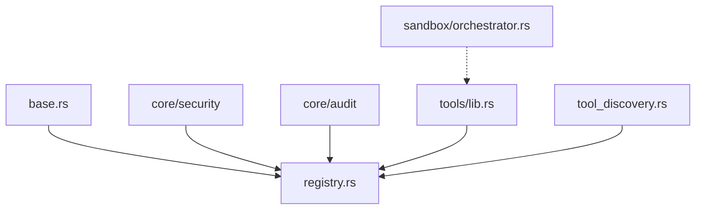

# 工具注册边界

<cite>
**本文引用的文件**
- [agent-diva-tooling/src/base.rs](file://agent-diva-tooling/src/base.rs)
- [agent-diva-tooling/src/registry.rs](file://agent-diva-tooling/src/registry.rs)
- [agent-diva-tooling/src/module.rs](file://agent-diva-tooling/src/module.rs)
- [agent-diva-tools/src/lib.rs](file://agent-diva-tools/src/lib.rs)
- [agent-diva-tools/src/tool_discovery.rs](file://agent-diva-tools/src/tool_discovery.rs)
- [agent-diva-core/src/security/mod.rs](file://agent-diva-core/src/security/mod.rs)
- [agent-diva-core/src/security/tool_result_filter.rs](file://agent-diva-core/src/security/tool_result_filter.rs)
- [agent-diva-sandbox/src/lib.rs](file://agent-diva-sandbox/src/lib.rs)
- [agent-diva-sandbox/src/orchestrator.rs](file://agent-diva-sandbox/src/orchestrator.rs)
</cite>

## 目录
1. [简介](#简介)
2. [项目结构](#项目结构)
3. [核心组件](#核心组件)
4. [架构总览](#架构总览)
5. [详细组件分析](#详细组件分析)
6. [依赖关系分析](#依赖关系分析)
7. [性能考量](#性能考量)
8. [故障排查指南](#故障排查指南)
9. [结论](#结论)
10. [附录：工具开发指南与最佳实践](#附录工具开发指南与最佳实践)

## 简介
本文件围绕“工具注册边界”展开，系统化说明工具基类（Base Tool）的接口规范、参数校验与错误处理；工具注册表（Registry）的发现、加载与生命周期管理；模块化架构与插件机制下的动态加载/卸载；安全边界（权限控制、资源限制、执行环境隔离）；工具间通信协议与数据交换格式；以及自定义工具的开发模板与最佳实践。目标是帮助开发者在统一契约下扩展工具能力，同时确保系统的安全、稳定与可观测性。

## 项目结构
本项目将工具相关能力拆分为多个 crate：
- agent-diva-tooling：定义工具基类 Trait、注册表、模块生命周期等基础设施
- agent-diva-tools：内置工具实现与工具发现（tool_search）
- agent-diva-core：安全策略、结果过滤、审计事件等通用安全能力
- agent-diva-sandbox：命令执行沙箱、审批编排与执行策略

图表来源
- [agent-diva-tooling/src/base.rs:1-123](file://agent-diva-tooling/src/base.rs#L1-L123)
- [agent-diva-tooling/src/registry.rs:1-740](file://agent-diva-tooling/src/registry.rs#L1-L740)
- [agent-diva-tooling/src/module.rs:1-293](file://agent-diva-tooling/src/module.rs#L1-L293)
- [agent-diva-tools/src/lib.rs:1-74](file://agent-diva-tools/src/lib.rs#L1-L74)
- [agent-diva-tools/src/tool_discovery.rs:1-118](file://agent-diva-tools/src/tool_discovery.rs#L1-L118)
- [agent-diva-core/src/security/mod.rs:1-69](file://agent-diva-core/src/security/mod.rs#L1-L69)
- [agent-diva-core/src/security/tool_result_filter.rs:1-313](file://agent-diva-core/src/security/tool_result_filter.rs#L1-L313)
- [agent-diva-sandbox/src/lib.rs:1-116](file://agent-diva-sandbox/src/lib.rs#L1-L116)
- [agent-diva-sandbox/src/orchestrator.rs:1-200](file://agent-diva-sandbox/src/orchestrator.rs#L1-L200)

章节来源
- [agent-diva-tooling/src/base.rs:1-123](file://agent-diva-tooling/src/base.rs#L1-L123)
- [agent-diva-tooling/src/registry.rs:1-740](file://agent-diva-tooling/src/registry.rs#L1-L740)
- [agent-diva-tooling/src/module.rs:1-293](file://agent-diva-tooling/src/module.rs#L1-L293)
- [agent-diva-tools/src/lib.rs:1-74](file://agent-diva-tools/src/lib.rs#L1-L74)
- [agent-diva-tools/src/tool_discovery.rs:1-118](file://agent-diva-tools/src/tool_discovery.rs#L1-L118)
- [agent-diva-core/src/security/mod.rs:1-69](file://agent-diva-core/src/security/mod.rs#L1-L69)
- [agent-diva-core/src/security/tool_result_filter.rs:1-313](file://agent-diva-core/src/security/tool_result_filter.rs#L1-L313)
- [agent-diva-sandbox/src/lib.rs:1-116](file://agent-diva-sandbox/src/lib.rs#L1-L116)
- [agent-diva-sandbox/src/orchestrator.rs:1-200](file://agent-diva-sandbox/src/orchestrator.rs#L1-L200)

## 核心组件
- 工具基类（Tool）：定义工具的统一接口，包括名称、描述、参数 JSON Schema、可选超时、执行入口与默认参数校验。
- 工具注册表（ToolRegistry）：集中管理工具的注册、去重、可见性分区（Core/Deferred）、搜索激活、执行调度、审计与安全过滤。
- 模块与引导（Module/Bootstrap）：提供跨服务模块的生命周期管理与拓扑启动顺序，支持热重载与依赖声明。
- 工具发现（tool_search）：通过关键词对“延迟工具”进行检索并激活，用于按需暴露工具能力。
- 安全与沙箱：输出清洗、注入检测、结果截断；命令执行的审批、策略与隔离。

章节来源
- [agent-diva-tooling/src/base.rs:1-123](file://agent-diva-tooling/src/base.rs#L1-L123)
- [agent-diva-tooling/src/registry.rs:1-740](file://agent-diva-tooling/src/registry.rs#L1-L740)
- [agent-diva-tooling/src/module.rs:1-293](file://agent-diva-tooling/src/module.rs#L1-L293)
- [agent-diva-tools/src/tool_discovery.rs:1-118](file://agent-diva-tools/src/tool_discovery.rs#L1-L118)
- [agent-diva-core/src/security/tool_result_filter.rs:1-313](file://agent-diva-core/src/security/tool_result_filter.rs#L1-L313)
- [agent-diva-sandbox/src/lib.rs:1-116](file://agent-diva-sandbox/src/lib.rs#L1-L116)

## 架构总览
下图展示了从调用方到工具执行的完整链路：调用方通过注册表查找并执行工具；注册表负责参数校验、超时控制、安全过滤与审计；对于需要外部能力的工具，可通过 tool_search 动态激活；涉及命令执行的工具由沙箱编排器进行审批与隔离。

图表来源
- [agent-diva-tooling/src/registry.rs:534-700](file://agent-diva-tooling/src/registry.rs#L534-L700)
- [agent-diva-core/src/security/tool_result_filter.rs:61-97](file://agent-diva-core/src/security/tool_result_filter.rs#L61-L97)
- [agent-diva-sandbox/src/orchestrator.rs:254-296](file://agent-diva-sandbox/src/orchestrator.rs#L254-L296)

## 详细组件分析

### 工具基类（Tool）与错误模型
- 接口要点
  - name/description：工具标识与说明，用于 schema 生成与展示
  - parameters：JSON Schema 描述参数结构，供前端/LLM 校验
  - timeout_secs：可选覆盖全局超时，适配交互式长任务
  - execute：异步执行入口，返回字符串结果
  - validate_params：默认基于 required 字段做必填校验
  - to_schema：转换为 OpenAI function 风格 schema
- 错误模型
  - ToolError 枚举涵盖参数无效、参数非法、执行失败、IO 错误、超时、工具不可用等
  - 错误分类映射至核心错误类别，便于上层统一处理
  - code() 提供稳定的机器可读错误码

图表来源
- [agent-diva-tooling/src/base.rs:6-61](file://agent-diva-tooling/src/base.rs#L6-L61)
- [agent-diva-tooling/src/base.rs:63-123](file://agent-diva-tooling/src/base.rs#L63-L123)

章节来源
- [agent-diva-tooling/src/base.rs:1-123](file://agent-diva-tooling/src/base.rs#L1-L123)

### 工具注册表（ToolRegistry）
- 功能概览
  - 注册/注销工具，支持按分区（Core/Deferred）注册
  - 生成稳定排序的工具定义集（Core 前缀优先），便于缓存
  - 延迟工具激活：通过 DeferredToolActivationHandle 维护当前会话内激活集合，上限可控
  - 执行路径：参数校验 → 超时控制 → 执行 → 安全过滤 → 审计 → 返回
- 关键数据结构
  - ToolSchemaPartition：Core（始终可见）/ Deferred（按需激活）
  - ToolDefinitionSet：包含 definitions 与 core_count，保证 CORE 前缀稳定性
  - ActiveDeferredTools：任务级激活集合，带最大数量限制
  - DeferredToolActivationHandle：共享激活状态与授权目录，支持搜索与快照恢复
- 执行流程（含错误分支）

图表来源
- [agent-diva-tooling/src/registry.rs:452-700](file://agent-diva-tooling/src/registry.rs#L452-L700)

章节来源
- [agent-diva-tooling/src/registry.rs:1-740](file://agent-diva-tooling/src/registry.rs#L1-L740)

### 模块与引导（Module/Bootstrap）
- ModuleCtx：注入消息总线、安全策略、配置、用户在线状态
- Module 生命周期：start/stop/dependencies/on_config_reload
- ModuleRegistry：注册模块、解析依赖拓扑（Kahn 算法）、检测缺失依赖与循环依赖
- Bootstrap：按依赖顺序启动，失败时回滚停止；按逆序关闭

图表来源
- [agent-diva-tooling/src/module.rs:15-82](file://agent-diva-tooling/src/module.rs#L15-L82)
- [agent-diva-tooling/src/module.rs:105-293](file://agent-diva-tooling/src/module.rs#L105-L293)

章节来源
- [agent-diva-tooling/src/module.rs:1-293](file://agent-diva-tooling/src/module.rs#L1-L293)

### 工具发现与动态加载（tool_search）
- ToolSearchTool：接收 query 与 limit，在授权目录中搜索延迟工具，并将结果设置为下一轮调用的激活集合
- 评分机制：基于名称、描述、schema 关键字匹配打分，取 Top-N
- 作用：避免一次性暴露全部工具，降低上下文开销与攻击面

图表来源
- [agent-diva-tools/src/tool_discovery.rs:1-118](file://agent-diva-tools/src/tool_discovery.rs#L1-L118)
- [agent-diva-tooling/src/registry.rs:154-232](file://agent-diva-tooling/src/registry.rs#L154-L232)

章节来源
- [agent-diva-tools/src/tool_discovery.rs:1-118](file://agent-diva-tools/src/tool_discovery.rs#L1-L118)
- [agent-diva-tooling/src/registry.rs:154-232](file://agent-diva-tooling/src/registry.rs#L154-L232)

### 安全边界与执行环境隔离
- 输出安全
  - 注入检测与标记：sanitize_tool_output 检测可疑模式并标注
  - 结果截断：truncate_tool_result 防止上下文耗尽
  - 不信任包装：wrap_untrusted 包裹外部来源内容
- 权限与策略
  - 安全策略：路径校验、速率限制、指令层级、PII 脱敏等
  - 沙箱：命令执行审批、执行策略（ExecPolicy）、文件系统访问控制、平台隔离（Windows 受限令牌、Linux Landlock/Seccomp/Bubblewrap）
  - 编排器：ToolOrchestrator 协调审批→选择沙箱→尝试→重试/升级

图表来源
- [agent-diva-core/src/security/tool_result_filter.rs:1-313](file://agent-diva-core/src/security/tool_result_filter.rs#L1-L313)
- [agent-diva-core/src/security/mod.rs:1-69](file://agent-diva-core/src/security/mod.rs#L1-L69)
- [agent-diva-sandbox/src/lib.rs:1-116](file://agent-diva-sandbox/src/lib.rs#L1-L116)
- [agent-diva-sandbox/src/orchestrator.rs:254-296](file://agent-diva-sandbox/src/orchestrator.rs#L254-L296)

章节来源
- [agent-diva-core/src/security/tool_result_filter.rs:1-313](file://agent-diva-core/src/security/tool_result_filter.rs#L1-L313)
- [agent-diva-core/src/security/mod.rs:1-69](file://agent-diva-core/src/security/mod.rs#L1-L69)
- [agent-diva-sandbox/src/lib.rs:1-116](file://agent-diva-sandbox/src/lib.rs#L1-L116)
- [agent-diva-sandbox/src/orchestrator.rs:254-296](file://agent-diva-sandbox/src/orchestrator.rs#L254-L296)

## 依赖关系分析
- 低耦合设计
  - Tool 仅依赖 JSON Schema 与异步执行，不感知注册表细节
  - Registry 封装了工具发现、激活、执行、安全与审计，对外暴露简洁 API
  - 工具发现通过 handle 解耦，允许同一轮次重建时复用授权目录
- 直接依赖
  - registry 依赖 base（Tool/ToolError）、core/security（输出过滤）、core/audit（审计）
  - tool_discovery 依赖 registry 的激活句柄
  - sandbox 与 orchestrator 独立于工具层，但被需要命令执行的工具调用
- 潜在风险
  - 延迟工具过多或搜索词过宽可能导致激活集合膨胀（已通过 MAX_ACTIVE_DEFERRED_TOOLS 限制）
  - 工具间应避免直接共享可变状态，通过注册表/消息总线/沙箱隔离交互

图表来源
- [agent-diva-tooling/src/registry.rs:1-740](file://agent-diva-tooling/src/registry.rs#L1-L740)
- [agent-diva-tools/src/lib.rs:1-74](file://agent-diva-tools/src/lib.rs#L1-L74)
- [agent-diva-tools/src/tool_discovery.rs:1-118](file://agent-diva-tools/src/tool_discovery.rs#L1-L118)
- [agent-diva-sandbox/src/orchestrator.rs:254-296](file://agent-diva-sandbox/src/orchestrator.rs#L254-L296)

章节来源
- [agent-diva-tooling/src/registry.rs:1-740](file://agent-diva-tooling/src/registry.rs#L1-L740)
- [agent-diva-tools/src/lib.rs:1-74](file://agent-diva-tools/src/lib.rs#L1-L74)
- [agent-diva-tools/src/tool_discovery.rs:1-118](file://agent-diva-tools/src/tool_discovery.rs#L1-L118)
- [agent-diva-sandbox/src/orchestrator.rs:254-296](file://agent-diva-sandbox/src/orchestrator.rs#L254-L296)

## 性能考量
- 工具定义集稳定前缀：Core 工具始终位于数组前部，减少缓存失效
- 延迟工具上限：MAX_ACTIVE_DEFERRED_TOOLS 限制单次激活数量，避免上下文爆炸
- 超时控制：全局与工具级超时双重保障，防止长时间阻塞
- 输出裁剪：结果截断与注入标记，降低 LLM 上下文压力
- 搜索效率：基于关键字分词与打分，快速定位候选工具

[本节为通用指导，无需特定文件引用]

## 故障排查指南
- 常见错误与定位
  - 工具未找到：检查名称拼写与注册分区，查看审计中的 not_found 事件
  - 参数无效：根据 InvalidParams 信息核对 JSON Schema 的 required 与类型
  - 执行超时：确认工具是否实现了合理的超时，必要时调整全局或工具级超时
  - 工具不可用：延迟工具需先通过 tool_search 激活，再调用
- 日志与审计
  - 关注 ToolExecuted 审计事件，包含 duration_ms、result_size、status
  - 输出过滤会记录 suspicious 标记，便于追踪注入风险
- 沙箱相关问题
  - 审批失败：检查 ExecPolicy 规则与 Guardian 决策
  - 平台差异：WSL1 不支持 bubblewrap，需降级策略

章节来源
- [agent-diva-tooling/src/registry.rs:534-700](file://agent-diva-tooling/src/registry.rs#L534-L700)
- [agent-diva-core/src/security/tool_result_filter.rs:61-97](file://agent-diva-core/src/security/tool_result_filter.rs#L61-L97)
- [agent-diva-sandbox/src/orchestrator.rs:254-296](file://agent-diva-sandbox/src/orchestrator.rs#L254-L296)

## 结论
本方案通过统一的 Tool 接口与强大的 ToolRegistry，实现了工具的可插拔、可发现、可审计与安全执行。结合模块化的生命周期管理与沙箱编排，系统在扩展性与安全性之间取得平衡。建议遵循本文档的契约与最佳实践，以最小耦合方式扩展工具生态。

[本节为总结，无需特定文件引用]

## 附录：工具开发指南与最佳实践
- 开发步骤
  - 实现 Tool 接口：提供 name/description/parameters/execute，必要时覆盖 timeout_secs
  - 参数校验：尽量在 validate_params 中补充业务校验，减少下游错误
  - 注册工具：使用 register/register_in_partition 加入注册表；延迟工具使用 Deferred 分区并通过 tool_search 暴露
  - 安全合规：避免直接输出敏感信息；如需命令执行，委托沙箱编排器
  - 可观测性：合理设置超时与日志，配合审计事件定位问题
- 最佳实践
  - 明确工具职责边界，避免跨工具强耦合
  - 使用 JSON Schema 精确描述参数，提升前端/LLM 可用性
  - 对长耗时操作提供超时与进度反馈
  - 对可能产生大量输出的工具启用截断与标记
  - 延迟工具仅在需要时激活，控制激活集合大小
- 参考路径
  - 工具基类与错误：[base.rs:1-123](file://agent-diva-tooling/src/base.rs#L1-L123)
  - 注册与执行：[registry.rs:452-700](file://agent-diva-tooling/src/registry.rs#L452-L700)
  - 工具发现：[tool_discovery.rs:1-118](file://agent-diva-tools/src/tool_discovery.rs#L1-L118)
  - 安全过滤：[tool_result_filter.rs:1-313](file://agent-diva-core/src/security/tool_result_filter.rs#L1-L313)
  - 沙箱编排：[orchestrator.rs:254-296](file://agent-diva-sandbox/src/orchestrator.rs#L254-L296)

章节来源
- [agent-diva-tooling/src/base.rs:1-123](file://agent-diva-tooling/src/base.rs#L1-L123)
- [agent-diva-tooling/src/registry.rs:452-700](file://agent-diva-tooling/src/registry.rs#L452-L700)
- [agent-diva-tools/src/tool_discovery.rs:1-118](file://agent-diva-tools/src/tool_discovery.rs#L1-L118)
- [agent-diva-core/src/security/tool_result_filter.rs:1-313](file://agent-diva-core/src/security/tool_result_filter.rs#L1-L313)
- [agent-diva-sandbox/src/orchestrator.rs:254-296](file://agent-diva-sandbox/src/orchestrator.rs#L254-L296)