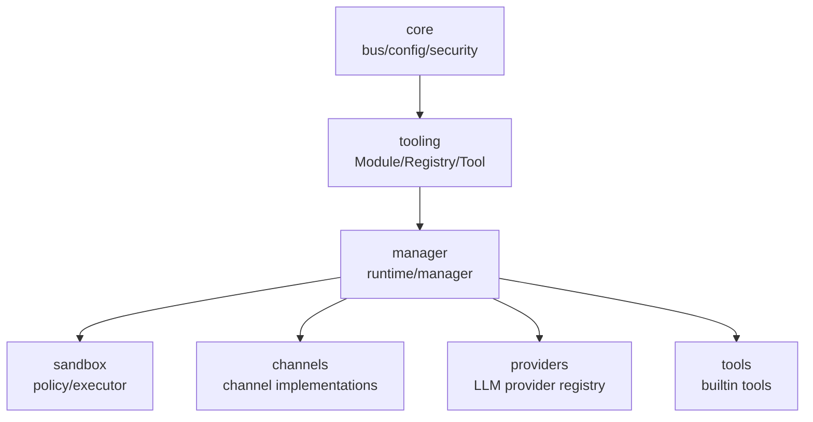
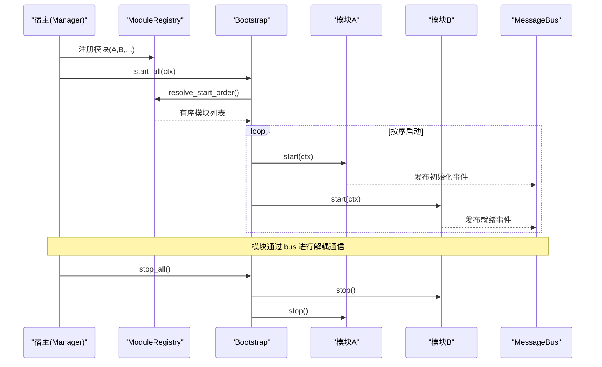
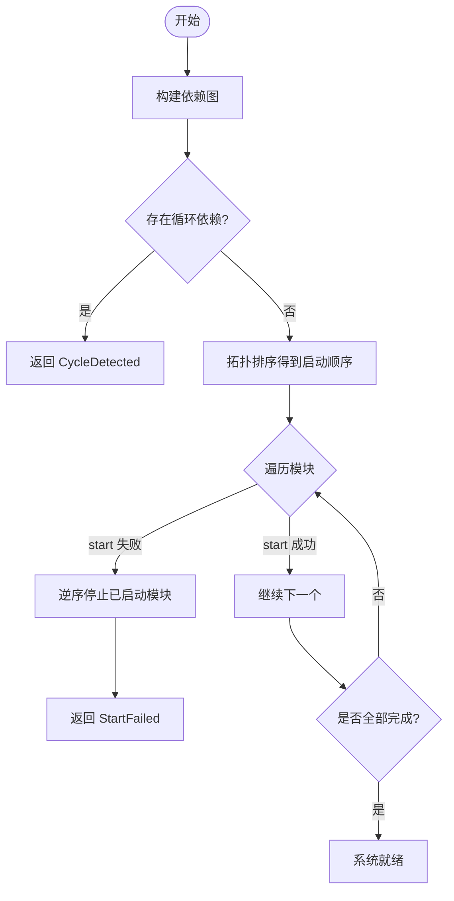
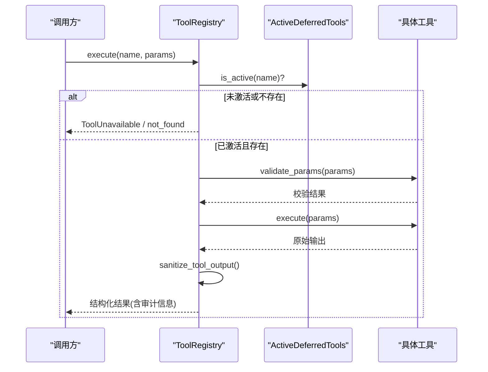
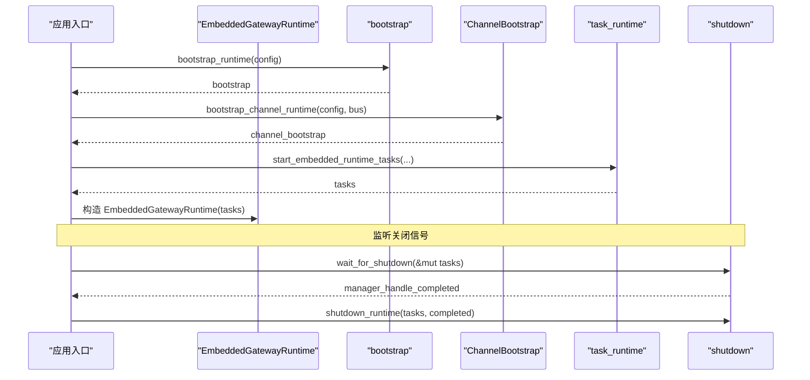
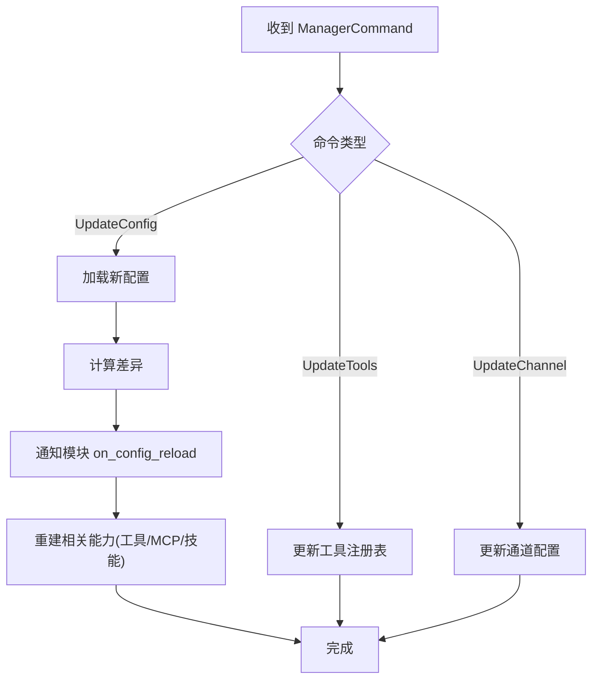
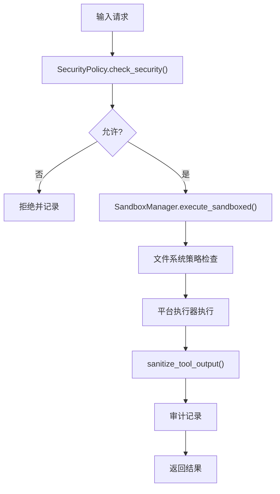
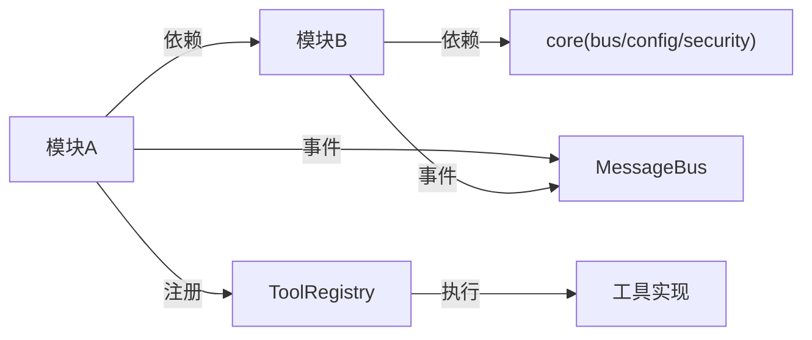
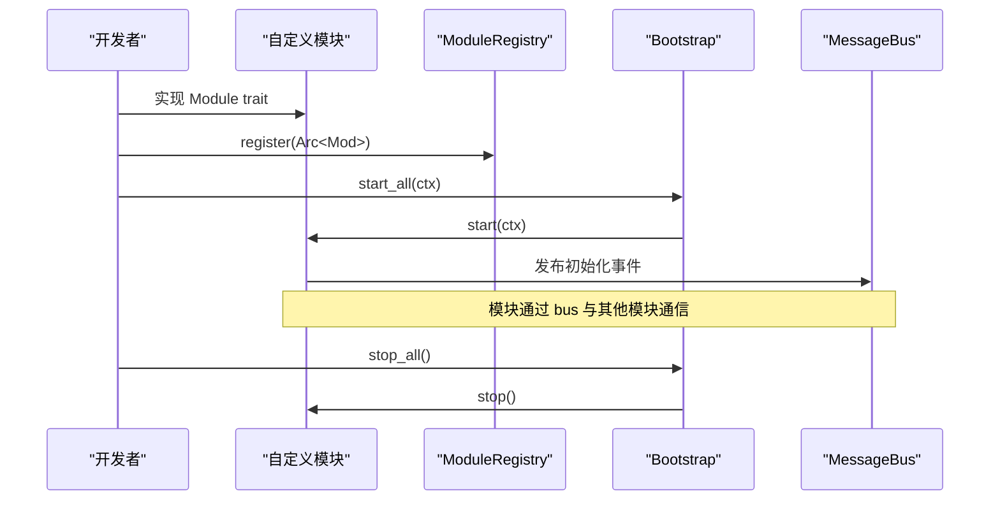

# 模块化插件架构

<cite>
**本文引用的文件**
- [agent-diva-tooling/src/lib.rs](file://agent-diva-tooling/src/lib.rs)
- [agent-diva-tooling/src/module.rs](file://agent-diva-tooling/src/module.rs)
- [agent-diva-tooling/src/registry.rs](file://agent-diva-tooling/src/registry.rs)
- [agent-diva-core/src/bus/mod.rs](file://agent-diva-core/src/bus/mod.rs)
- [agent-diva-core/src/config/mod.rs](file://agent-diva-core/src/config/mod.rs)
- [agent-diva-core/src/security/mod.rs](file://agent-diva-core/src/security/mod.rs)
- [agent-diva-manager/src/runtime.rs](file://agent-diva-manager/src/runtime.rs)
- [agent-diva-manager/src/manager.rs](file://agent-diva-manager/src/manager.rs)
- [agent-diva-sandbox/src/manager.rs](file://agent-diva-sandbox/src/manager.rs)
- [agent-diva-sandbox/src/platform/macos.rs](file://agent-diva-sandbox/src/platform/macos.rs)
</cite>

## 目录
1. [简介](#简介)
2. [项目结构](#项目结构)
3. [核心组件](#核心组件)
4. [架构总览](#架构总览)
5. [详细组件分析](#详细组件分析)
6. [依赖关系分析](#依赖关系分析)
7. [性能考量](#性能考量)
8. [故障排查指南](#故障排查指南)
9. [结论](#结论)
10. [附录：自定义模块开发指南与集成示例](#附录自定义模块开发指南与集成示例)

## 简介
本文件系统化阐述 Agent-Diva 的模块化插件架构，覆盖设计原理、实现方式与最佳实践。重点包括：
- 模块的发现、加载与卸载机制（基于编译期 crate + 运行时注册表）
- 模块间通信协议与数据交换格式（消息总线、事件模型）
- 松耦合交互方式（trait 抽象、依赖注入、拓扑排序启动）
- 生命周期管理（初始化、启动、停止、配置热重载）
- 配置管理与动态更新（配置加载器、变更通知、运行时刷新）
- 安全边界与权限控制（策略、沙箱、PII 过滤、工具输出清洗）
- 自定义模块开发与集成示例（从 trait 实现到注册与运行）

## 项目结构
Agent-Diva 采用多 crate 分层组织，围绕“核心能力 + 工具抽象 + 管理器编排”展开：
- agent-diva-core：提供基础类型、消息总线、配置、安全、会话等公共能力
- agent-diva-tooling：定义 Module 抽象、ModuleRegistry、Bootstrap 以及 Tool 注册与执行框架
- agent-diva-manager：网关运行时编排、任务调度、通道与代理集成、配置驱动
- agent-diva-sandbox：命令执行沙箱、文件系统策略、平台强制策略
- 其他 crate（channels、providers、tools 等）作为扩展能力通过 tooling 暴露为可发现/可启用的单元

图表来源
- [agent-diva-core/src/bus/mod.rs:1-14](file://agent-diva-core/src/bus/mod.rs#L1-L14)
- [agent-diva-tooling/src/module.rs:1-82](file://agent-diva-tooling/src/module.rs#L1-L82)
- [agent-diva-manager/src/runtime.rs:219-271](file://agent-diva-manager/src/runtime.rs#L219-L271)

章节来源
- [agent-diva-core/src/lib.rs:1-43](file://agent-diva-core/src/lib.rs#L1-L43)
- [agent-diva-tooling/src/lib.rs:1-14](file://agent-diva-tooling/src/lib.rs#L1-L14)
- [agent-diva-manager/src/runtime.rs:219-271](file://agent-diva-manager/src/runtime.rs#L219-L271)

## 核心组件
- 模块抽象与上下文
  - Module 接口：name、start、stop、dependencies、on_config_reload
  - ModuleCtx：注入 MessageBus、SharedSecurityPolicy、Config（RwLock）、PresenceState（RwLock）
- 模块注册与引导
  - ModuleRegistry：维护模块集合、解析启动顺序（Kahn 算法）、检测循环依赖与缺失依赖
  - Bootstrap：按依赖顺序启动所有模块，失败时回滚已启动模块；按逆序停止
- 工具注册与执行
  - ToolRegistry：注册/注销工具、生成 OpenAI 风格 schema、执行工具并审计
  - DeferredTools：延迟激活的工具目录与搜索，限制活跃数量，支持同轮重建恢复
- 运行时编排
  - GatewayRuntimeConfig：配置、工作区、端口等
  - EmbeddedGatewayRuntime/GatewayTasks：任务句柄、广播关闭信号、统一关闭流程
- 配置与安全
  - ConfigLoader：加载与校验配置，支持 diff 计算
  - SecurityPolicy：路径校验、PII 脱敏、工具输出清洗、注入检测、拒绝断路器

章节来源
- [agent-diva-tooling/src/module.rs:15-82](file://agent-diva-tooling/src/module.rs#L15-L82)
- [agent-diva-tooling/src/module.rs:105-217](file://agent-diva-tooling/src/module.rs#L105-L217)
- [agent-diva-tooling/src/module.rs:219-293](file://agent-diva-tooling/src/module.rs#L219-L293)
- [agent-diva-tooling/src/registry.rs:362-717](file://agent-diva-tooling/src/registry.rs#L362-L717)
- [agent-diva-manager/src/runtime.rs:219-271](file://agent-diva-manager/src/runtime.rs#L219-L271)
- [agent-diva-core/src/config/mod.rs:1-12](file://agent-diva-core/src/config/mod.rs#L1-L12)
- [agent-diva-core/src/security/mod.rs:1-69](file://agent-diva-core/src/security/mod.rs#L1-L69)

## 架构总览
Agent-Diva 的模块化插件架构以“trait 抽象 + 运行时注册表 + 消息总线”为核心，结合“配置驱动 + 安全策略”形成松耦合、可扩展的系统。

图表来源
- [agent-diva-tooling/src/module.rs:144-217](file://agent-diva-tooling/src/module.rs#L144-L217)
- [agent-diva-tooling/src/module.rs:219-293](file://agent-diva-tooling/src/module.rs#L219-L293)
- [agent-diva-core/src/bus/mod.rs:1-14](file://agent-diva-core/src/bus/mod.rs#L1-L14)

## 详细组件分析

### 模块抽象与生命周期（Module、ModuleCtx、Bootstrap）
- 设计要点
  - 每个模块实现 Module trait，声明 name、dependencies，并提供 start/stop/on_config_reload
  - ModuleCtx 通过 Arc 注入共享服务，避免全局状态，支持并发安全
  - Bootstrap 使用 Kahn 算法进行拓扑排序，保证依赖先于消费者启动
  - 启动失败时自动回滚已启动模块，确保系统一致性
- 关键流程
  - 解析依赖图 -> 检测缺失/循环依赖 -> 顺序启动 -> 失败回滚 -> 逆序停止

图表来源
- [agent-diva-tooling/src/module.rs:144-217](file://agent-diva-tooling/src/module.rs#L144-L217)
- [agent-diva-tooling/src/module.rs:219-293](file://agent-diva-tooling/src/module.rs#L219-L293)

章节来源
- [agent-diva-tooling/src/module.rs:15-82](file://agent-diva-tooling/src/module.rs#L15-L82)
- [agent-diva-tooling/src/module.rs:105-217](file://agent-diva-tooling/src/module.rs#L105-L217)
- [agent-diva-tooling/src/module.rs:219-293](file://agent-diva-tooling/src/module.rs#L219-L293)

### 工具注册与执行（ToolRegistry、DeferredTools）
- 设计要点
  - 工具分为 Core 与 Deferred 两类，Core 始终可见，Deferred 需通过搜索激活
  - 工具 schema 标准化输出，保持缓存友好（CORE 前缀稳定）
  - 执行路径包含参数校验、超时控制、审计记录、结果清洗
- 关键流程
  - 注册工具 -> 生成 schema -> 搜索激活 -> 执行工具 -> 审计与清洗

图表来源
- [agent-diva-tooling/src/registry.rs:452-717](file://agent-diva-tooling/src/registry.rs#L452-L717)

章节来源
- [agent-diva-tooling/src/registry.rs:15-101](file://agent-diva-tooling/src/registry.rs#L15-L101)
- [agent-diva-tooling/src/registry.rs:362-717](file://agent-diva-tooling/src/registry.rs#L362-L717)

### 运行时编排（GatewayRuntime、EmbeddedGatewayRuntime、GatewayTasks）
- 设计要点
  - GatewayRuntimeConfig 聚合配置、工作区、端口等运行时参数
  - EmbeddedGatewayRuntime 封装任务句柄，提供优雅关闭
  - GatewayTasks 持有各子系统句柄（cron、channel、agent、server），统一管理生命周期
- 关键流程
  - 构建 bootstrap -> 启动 channel runtime -> 启动任务集 -> 等待关闭 -> 统一清理

图表来源
- [agent-diva-manager/src/runtime.rs:219-271](file://agent-diva-manager/src/runtime.rs#L219-L271)
- [agent-diva-manager/src/runtime.rs:487-518](file://agent-diva-manager/src/runtime.rs#L487-L518)

章节来源
- [agent-diva-manager/src/runtime.rs:219-271](file://agent-diva-manager/src/runtime.rs#L219-L271)
- [agent-diva-manager/src/runtime.rs:487-518](file://agent-diva-manager/src/runtime.rs#L487-L518)

### 配置管理与动态更新（ConfigLoader、Manager 命令）
- 设计要点
  - ConfigLoader 负责加载与校验配置，compute_diff 用于增量更新
  - Manager 接收外部命令（如 UpdateConfig、UpdateTools、UpdateChannel），触发运行时刷新
  - 通过 RuntimeControlCommand 向子模块下发更新（如 MCP 服务器、机器技能）
- 关键流程
  - 接收命令 -> 解析变更 -> 持久化/校验 -> 通知相关模块 -> 重新构建运行时能力

图表来源
- [agent-diva-core/src/config/mod.rs:1-12](file://agent-diva-core/src/config/mod.rs#L1-L12)
- [agent-diva-manager/src/manager.rs:144-171](file://agent-diva-manager/src/manager.rs#L144-L171)
- [agent-diva-manager/src/manager.rs:263-396](file://agent-diva-manager/src/manager.rs#L263-L396)

章节来源
- [agent-diva-core/src/config/mod.rs:1-12](file://agent-diva-core/src/config/mod.rs#L1-L12)
- [agent-diva-manager/src/manager.rs:144-171](file://agent-diva-manager/src/manager.rs#L144-L171)
- [agent-diva-manager/src/manager.rs:263-396](file://agent-diva-manager/src/manager.rs#L263-L396)

### 安全边界与权限控制（SecurityPolicy、Sandbox）
- 设计要点
  - SecurityPolicy 提供路径校验、PII 脱敏、工具输出清洗、注入检测、拒绝断路器
  - Sandbox 提供命令执行隔离，支持文件系统策略与平台级强制（macOS Seatbelt、Linux bwrap）
  - 工具执行结果经过 sanitize_tool_output 处理，防止敏感信息泄露
- 关键流程
  - 请求进入 -> 安全检查 -> 策略判定 -> 沙箱执行 -> 结果清洗 -> 审计记录

图表来源
- [agent-diva-core/src/security/mod.rs:1-69](file://agent-diva-core/src/security/mod.rs#L1-L69)
- [agent-diva-sandbox/src/manager.rs:236-272](file://agent-diva-sandbox/src/manager.rs#L236-L272)
- [agent-diva-sandbox/src/platform/macos.rs:72-83](file://agent-diva-sandbox/src/platform/macos.rs#L72-L83)
- [agent-diva-tooling/src/registry.rs:622-698](file://agent-diva-tooling/src/registry.rs#L622-L698)

章节来源
- [agent-diva-core/src/security/mod.rs:1-69](file://agent-diva-core/src/security/mod.rs#L1-L69)
- [agent-diva-sandbox/src/manager.rs:236-272](file://agent-diva-sandbox/src/manager.rs#L236-L272)
- [agent-diva-sandbox/src/platform/macos.rs:72-83](file://agent-diva-sandbox/src/platform/macos.rs#L72-L83)
- [agent-diva-tooling/src/registry.rs:622-698](file://agent-diva-tooling/src/registry.rs#L622-L698)

## 依赖关系分析
- 模块间依赖通过 Module.dependencies() 声明，由 ModuleRegistry 解析为有向无环图
- 工具与模块通过 ToolRegistry 解耦，模块不直接依赖具体工具实现
- 运行时通过 MessageBus 进行事件驱动通信，降低耦合度
- 配置与安全策略贯穿各层，确保一致性与可控性

图表来源
- [agent-diva-tooling/src/module.rs:144-217](file://agent-diva-tooling/src/module.rs#L144-L217)
- [agent-diva-tooling/src/registry.rs:362-717](file://agent-diva-tooling/src/registry.rs#L362-L717)
- [agent-diva-core/src/bus/mod.rs:1-14](file://agent-diva-core/src/bus/mod.rs#L1-L14)

章节来源
- [agent-diva-tooling/src/module.rs:144-217](file://agent-diva-tooling/src/module.rs#L144-L217)
- [agent-diva-tooling/src/registry.rs:362-717](file://agent-diva-tooling/src/registry.rs#L362-L717)
- [agent-diva-core/src/bus/mod.rs:1-14](file://agent-diva-core/src/bus/mod.rs#L1-L14)

## 性能考量
- 拓扑排序复杂度 O(V+E)，适合模块数量规模
- 工具 schema 生成与过滤保持 CORE 前缀稳定，减少缓存失效
- 延迟激活工具限制最大活跃数，避免提供者负载过高
- 工具执行超时控制，防止阻塞主循环
- 审计与日志异步化，减少同步开销

[本节为通用性能讨论，不直接分析具体文件]

## 故障排查指南
- 模块启动失败
  - 检查 dependencies() 声明是否正确，是否存在缺失依赖或循环依赖
  - 查看 Bootstrap 错误类型：MissingDependency、CycleDetected、StartFailed
- 工具不可用或未激活
  - 确认工具是否为 Deferred 类型，是否通过 search 激活
  - 检查 ActiveDeferredTools 容量限制与同轮重建逻辑
- 配置更新未生效
  - 确认 on_config_reload 是否被调用，模块内部状态是否更新
  - 检查 Manager 命令分发与 RuntimeControlCommand 发送
- 安全拒绝或沙箱执行失败
  - 查看 SecurityPolicy 决策与 Sandbox 策略配置
  - 检查平台级策略（如 macOS Seatbelt）是否允许所需操作

章节来源
- [agent-diva-tooling/src/module.rs:91-103](file://agent-diva-tooling/src/module.rs#L91-L103)
- [agent-diva-tooling/src/registry.rs:547-590](file://agent-diva-tooling/src/registry.rs#L547-L590)
- [agent-diva-manager/src/manager.rs:144-171](file://agent-diva-manager/src/manager.rs#L144-L171)
- [agent-diva-sandbox/src/manager.rs:236-272](file://agent-diva-sandbox/src/manager.rs#L236-L272)

## 结论
Agent-Diva 的模块化插件架构通过清晰的 trait 抽象、运行时注册表与消息总线，实现了高内聚、低耦合的系统设计。配合配置驱动与安全策略，系统在可扩展性、可维护性与安全性方面具备良好平衡。未来可在现有基础上引入更丰富的插件类型（provider、service）与统一的 manifest 描述，进一步提升生态扩展能力。

[本节为总结性内容，不直接分析具体文件]

## 附录：自定义模块开发指南与集成示例

### 开发步骤
1. 实现 Module trait
   - 定义 name() 唯一标识
   - 实现 start(ctx) 初始化资源、订阅事件
   - 实现 stop() 释放资源、取消任务
   - 可选：实现 dependencies() 声明依赖模块
   - 可选：实现 on_config_reload(new_config) 响应配置变更
2. 注册模块
   - 在应用启动时创建 ModuleRegistry，register(Arc<dyn Module>)
   - 使用 Bootstrap::new(registry).start_all(ctx) 启动
3. 通信与数据交换
   - 通过 ModuleCtx.bus 发布/订阅事件
   - 使用 Config/RwLock 读取最新配置
   - 通过 SharedSecurityPolicy 进行安全校验
4. 配置热重载
   - 在 on_config_reload 中更新内部状态
   - 通过 RuntimeControlCommand 通知相关子系统刷新
5. 安全与沙箱
   - 使用 SecurityPolicy 校验路径与输入
   - 通过 SandboxManager 执行受限命令
   - 对工具输出进行 sanitize_tool_output 处理

### 集成示例（概念流程）

图表来源
- [agent-diva-tooling/src/module.rs:15-82](file://agent-diva-tooling/src/module.rs#L15-L82)
- [agent-diva-tooling/src/module.rs:105-217](file://agent-diva-tooling/src/module.rs#L105-L217)
- [agent-diva-tooling/src/module.rs:219-293](file://agent-diva-tooling/src/module.rs#L219-L293)

章节来源
- [agent-diva-tooling/src/module.rs:15-82](file://agent-diva-tooling/src/module.rs#L15-L82)
- [agent-diva-tooling/src/module.rs:105-217](file://agent-diva-tooling/src/module.rs#L105-L217)
- [agent-diva-tooling/src/module.rs:219-293](file://agent-diva-tooling/src/module.rs#L219-L293)