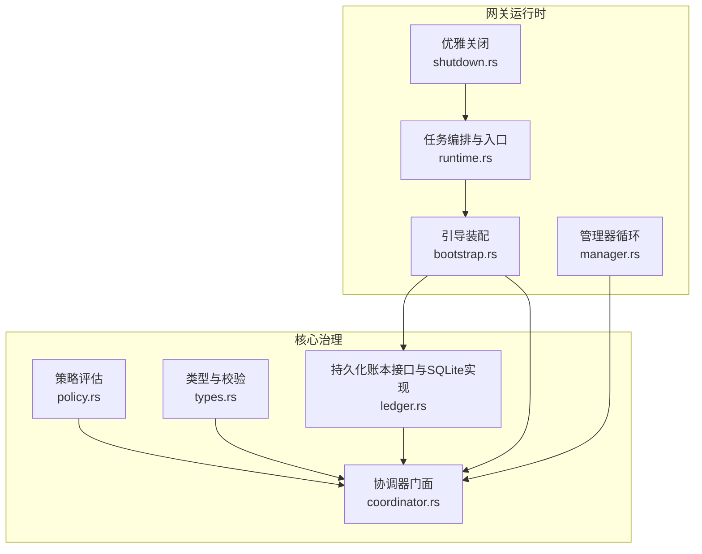
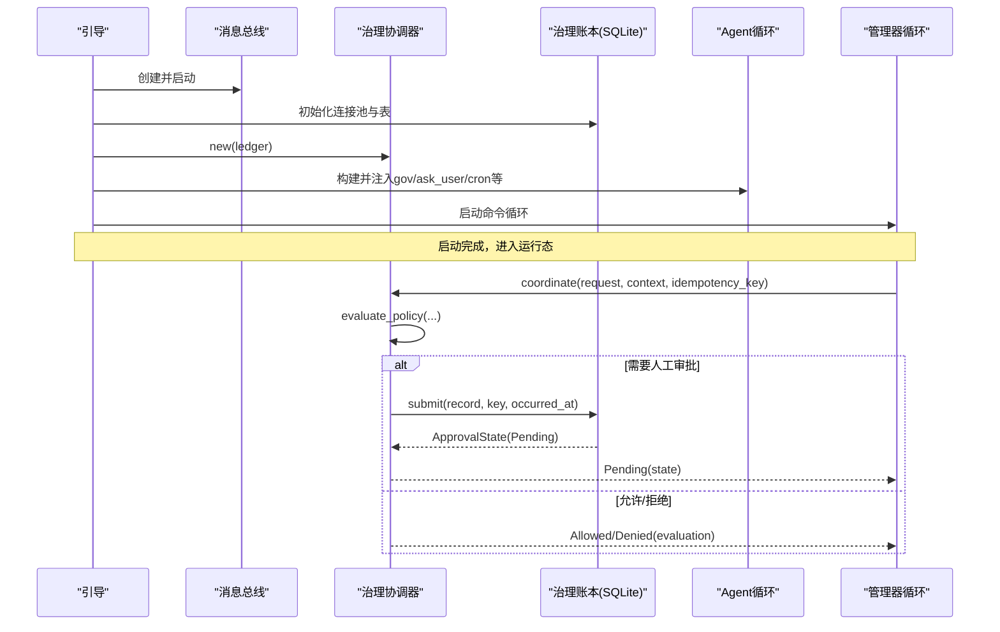
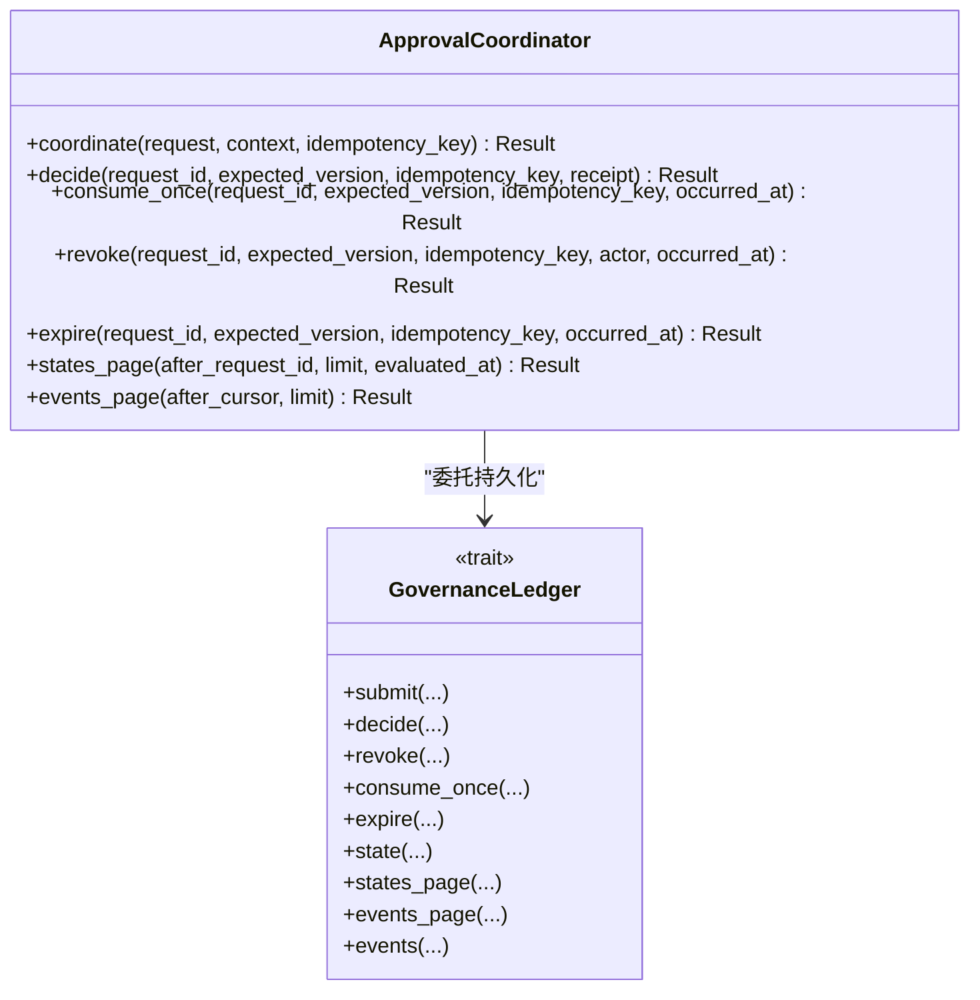
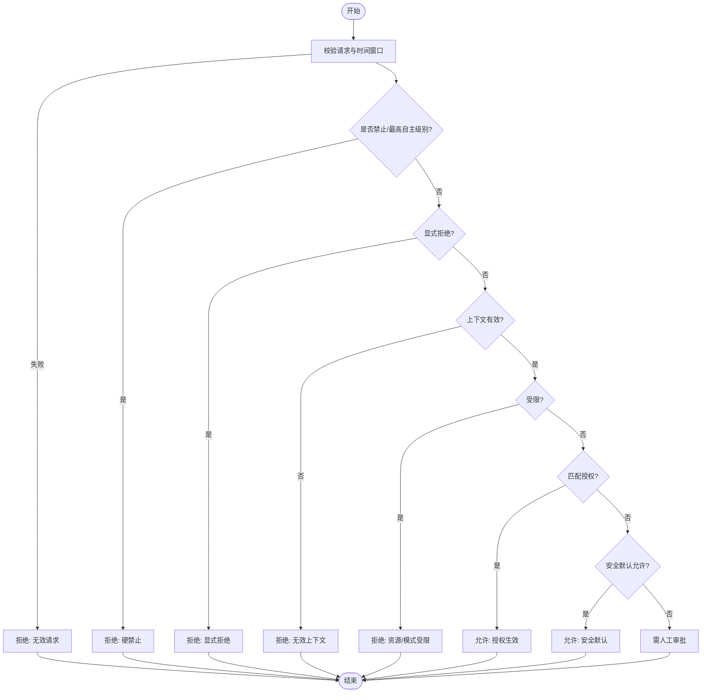
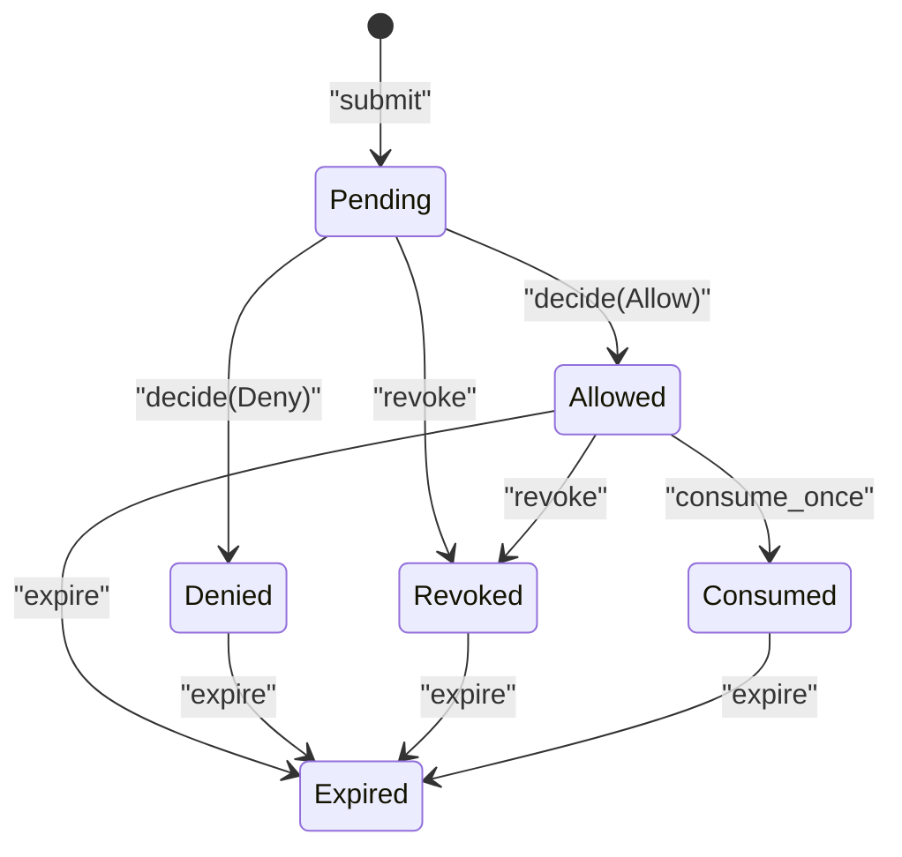
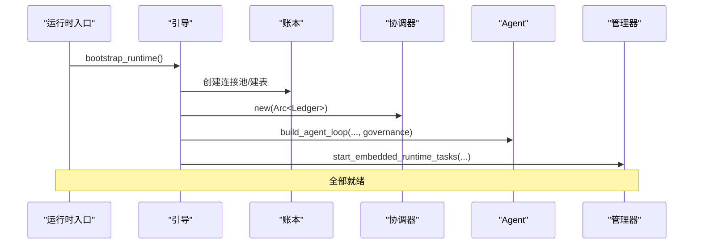
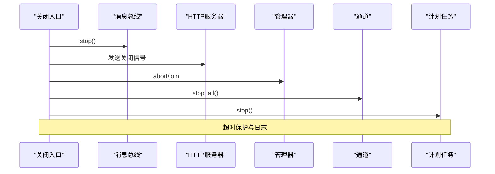
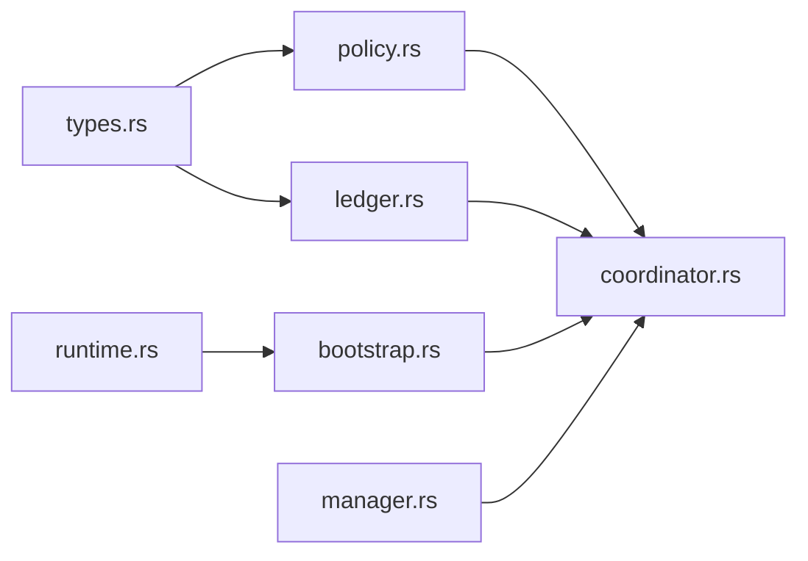
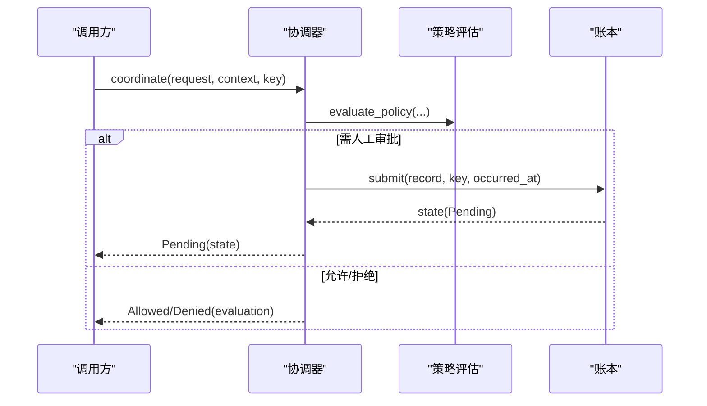
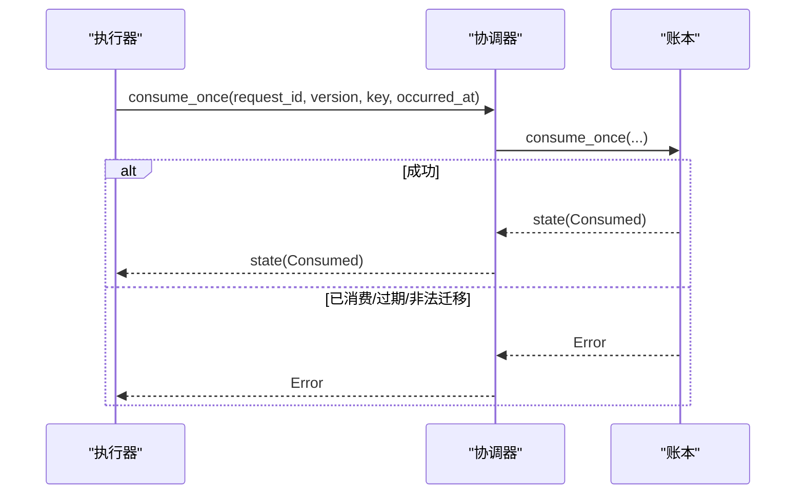

# 协调器生命周期管理

<cite>
**本文引用的文件**
- [agent-diva-core/src/governance/coordinator.rs](file://agent-diva-core/src/governance/coordinator.rs)
- [agent-diva-core/src/governance/mod.rs](file://agent-diva-core/src/governance/mod.rs)
- [agent-diva-core/src/governance/types.rs](file://agent-diva-core/src/governance/types.rs)
- [agent-diva-core/src/governance/policy.rs](file://agent-diva-core/src/governance/policy.rs)
- [agent-diva-core/src/governance/ledger.rs](file://agent-diva-core/src/governance/ledger.rs)
- [agent-diva-manager/src/runtime/bootstrap.rs](file://agent-diva-manager/src/runtime/bootstrap.rs)
- [agent-diva-manager/src/runtime/shutdown.rs](file://agent-diva-manager/src/runtime/shutdown.rs)
- [agent-diva-manager/src/runtime.rs](file://agent-diva-manager/src/runtime.rs)
- [agent-diva-manager/src/manager.rs](file://agent-diva-manager/src/manager.rs)
</cite>

## 目录
1. [简介](#简介)
2. [项目结构](#项目结构)
3. [核心组件](#核心组件)
4. [架构总览](#架构总览)
5. [详细组件分析](#详细组件分析)
6. [依赖关系分析](#依赖关系分析)
7. [性能与资源管理](#性能与资源管理)
8. [故障恢复与优雅退出](#故障恢复与优雅退出)
9. [结论](#结论)
10. [附录：关键流程时序图](#附录关键流程时序图)

## 简介
本文件聚焦于治理协调器的生命周期管理，覆盖初始化、启动、关闭机制；说明如何管理策略加载、账本初始化、事件监听注册；阐述状态转换（空闲、运行、暂停、错误）及对外集成（配置热更新、动态策略、运行时监控）；并提供故障恢复与优雅退出的实现细节和性能优化建议。

## 项目结构
治理协调器位于 agent-diva-core 的 governance 模块，由策略评估、持久化账本、协调器门面组成；在 agent-diva-manager 中完成引导装配、启动任务编排与优雅关闭。

图表来源
- [agent-diva-core/src/governance/policy.rs:98-205](file://agent-diva-core/src/governance/policy.rs#L98-L205)
- [agent-diva-core/src/governance/types.rs:121-161](file://agent-diva-core/src/governance/types.rs#L121-L161)
- [agent-diva-core/src/governance/ledger.rs:244-312](file://agent-diva-core/src/governance/ledger.rs#L244-L312)
- [agent-diva-core/src/governance/coordinator.rs:67-186](file://agent-diva-core/src/governance/coordinator.rs#L67-L186)
- [agent-diva-manager/src/runtime/bootstrap.rs:77-198](file://agent-diva-manager/src/runtime/bootstrap.rs#L77-L198)
- [agent-diva-manager/src/runtime.rs:487-518](file://agent-diva-manager/src/runtime.rs#L487-L518)
- [agent-diva-manager/src/manager.rs:263-396](file://agent-diva-manager/src/manager.rs#L263-L396)
- [agent-diva-manager/src/runtime/shutdown.rs:21-105](file://agent-diva-manager/src/runtime/shutdown.rs#L21-L105)

章节来源
- [agent-diva-core/src/governance/mod.rs:1-17](file://agent-diva-core/src/governance/mod.rs#L1-L17)
- [agent-diva-manager/src/runtime/bootstrap.rs:77-198](file://agent-diva-manager/src/runtime/bootstrap.rs#L77-L198)

## 核心组件
- 策略评估器：纯函数式决策引擎，依据请求、上下文、授权与限制得出允许/拒绝/需人工审批等结果，并附带约束与证据引用。
- 类型与校验：统一的请求/回执/审计关联等稳定数据结构，提供严格的前置校验与序列化契约。
- 持久化账本：追加只写的事件日志，基于SQLite存储，支持幂等提交、版本冲突检测、事件回放派生当前状态。
- 协调器门面：封装“评估-持久化-消费”的统一入口，屏蔽领域差异，保证一次审批、可重放、可撤销、可过期。

章节来源
- [agent-diva-core/src/governance/policy.rs:98-205](file://agent-diva-core/src/governance/policy.rs#L98-L205)
- [agent-diva-core/src/governance/types.rs:121-161](file://agent-diva-core/src/governance/types.rs#L121-L161)
- [agent-diva-core/src/governance/ledger.rs:244-312](file://agent-diva-core/src/governance/ledger.rs#L244-L312)
- [agent-diva-core/src/governance/coordinator.rs:67-186](file://agent-diva-core/src/governance/coordinator.rs#L67-L186)

## 架构总览
协调器生命周期贯穿“引导装配 -> 启动服务 -> 运行期处理 -> 优雅关闭”。引导阶段创建消息总线、配置热重载、计划任务、LLM提供者、文件管理、记忆索引、会话恢复、命令规则与治理账本，并组装 AgentLoop 与各类协调器。运行期通过管理器循环分发命令，协调器负责审批流。关闭时按顺序停止总线、HTTP、管理器、通道、代理、监督执行器等，确保资源释放。

图表来源
- [agent-diva-manager/src/runtime/bootstrap.rs:77-198](file://agent-diva-manager/src/runtime/bootstrap.rs#L77-L198)
- [agent-diva-core/src/governance/coordinator.rs:73-96](file://agent-diva-core/src/governance/coordinator.rs#L73-L96)
- [agent-diva-core/src/governance/policy.rs:98-205](file://agent-diva-core/src/governance/policy.rs#L98-L205)
- [agent-diva-core/src/governance/ledger.rs:486-518](file://agent-diva-core/src/governance/ledger.rs#L486-L518)

## 详细组件分析

### 协调器门面：ApprovalCoordinator
- 职责：统一入口，将领域请求转换为策略评估结果；仅在需要人工审批时持久化记录；提供决定、消费、撤销、过期、分页查询等能力。
- 关键方法：
  - coordinate：评估并可能提交到账本，返回允许/拒绝/待批三种结果。
  - decide：以CAS语义提交人类决定，生成回执并持久化。
  - consume_once：一次性消费已允许的审批，防止重复副作用。
  - revoke/expire：撤销或显式过期未消费的许可。
  - states_page/events_page：用于恢复与监控。

图表来源
- [agent-diva-core/src/governance/coordinator.rs:67-186](file://agent-diva-core/src/governance/coordinator.rs#L67-L186)
- [agent-diva-core/src/governance/ledger.rs:244-312](file://agent-diva-core/src/governance/ledger.rs#L244-L312)

章节来源
- [agent-diva-core/src/governance/coordinator.rs:67-186](file://agent-diva-core/src/governance/coordinator.rs#L67-L186)

### 策略评估：evaluate_policy
- 输入：ApprovalRequest、PolicyContext（含自主级别、显式用户决策、限制、授权）。
- 输出：PolicyEvaluation（decision、reason、constraints、evidence_refs）。
- 决策优先级：硬禁止 > 显式拒绝 > 上下文无效 > 资源/模式限制 > 授权匹配 > 安全默认允许 > 需人工审批。
- 安全默认：仅对低风险的特定能力在L1下允许，其他情况需人工审批。

图表来源
- [agent-diva-core/src/governance/policy.rs:98-205](file://agent-diva-core/src/governance/policy.rs#L98-L205)

章节来源
- [agent-diva-core/src/governance/policy.rs:98-205](file://agent-diva-core/src/governance/policy.rs#L98-L205)

### 账本与状态机：SqliteGovernanceLedger
- 设计：追加只写事件表，所有状态由事件回放派生；使用唯一键与指纹保证幂等；触发器阻止更新/删除。
- 状态：Pending、Allowed、Denied、Revoked、Consumed、Expired。
- 关键操作：
  - submit：提交请求事件，幂等检查后回放得到Pending。
  - decide：校验版本与状态迁移，写入Allowed/Denied事件。
  - consume_once：仅对Once授权且Allowed状态消费，转为Consumed。
  - revoke：撤销Pending/Allowed为Revoked。
  - expire：标记Expired。
  - events_page/states_page：分页回放，支持恢复与监控。

图表来源
- [agent-diva-core/src/governance/ledger.rs:486-715](file://agent-diva-core/src/governance/ledger.rs#L486-L715)

章节来源
- [agent-diva-core/src/governance/ledger.rs:486-715](file://agent-diva-core/src/governance/ledger.rs#L486-L715)

### 引导装配与启动流程
- 创建消息总线、配置热重载监听、计划任务、LLM提供者、文件管理、记忆索引、会话恢复。
- 初始化治理账本（SQLite连接池与表），构造 ApprovalCoordinator 与 CommandApprovalCoordinator，并恢复未完成审批。
- 构建 AgentLoop 并注入治理协调器、AskUser、Cron、FileManager、RunStore 等。
- 启动通道桥接、HTTP服务器、管理器循环、Agent循环等任务。

图表来源
- [agent-diva-manager/src/runtime/bootstrap.rs:77-198](file://agent-diva-manager/src/runtime/bootstrap.rs#L77-L198)
- [agent-diva-manager/src/runtime.rs:487-518](file://agent-diva-manager/src/runtime.rs#L487-L518)

章节来源
- [agent-diva-manager/src/runtime/bootstrap.rs:77-198](file://agent-diva-manager/src/runtime/bootstrap.rs#L77-L198)
- [agent-diva-manager/src/runtime.rs:487-518](file://agent-diva-manager/src/runtime.rs#L487-L518)

### 关闭机制与优雅退出
- 等待信号或管理器退出，随后依次停止消息总线、HTTP服务器、管理器、入站桥、出站调度、Agent、监督执行器、通道管理器、计划任务。
- 每个阶段设置超时，超时则中止任务，避免卡死。

图表来源
- [agent-diva-manager/src/runtime/shutdown.rs:21-105](file://agent-diva-manager/src/runtime/shutdown.rs#L21-L105)

章节来源
- [agent-diva-manager/src/runtime/shutdown.rs:21-105](file://agent-diva-manager/src/runtime/shutdown.rs#L21-L105)

### 外部系统集成
- 配置热更新：引导阶段启动配置热重载任务，检测到重启必需字段时发出提示事件；热更新字段直接反映到共享配置对象。
- 动态策略：策略评估器无I/O、无状态，随上下文变化即时生效；授权来自 PolicyContext.authorizations，支持一次性、会话级、规则级授权。
- 运行时监控：通过 events_page/states_page 拉取事件与聚合状态，结合管理器循环与消息总线进行上报与展示。

章节来源
- [agent-diva-manager/src/runtime/bootstrap.rs:26-75](file://agent-diva-manager/src/runtime/bootstrap.rs#L26-L75)
- [agent-diva-core/src/governance/policy.rs:42-50](file://agent-diva-core/src/governance/policy.rs#L42-L50)
- [agent-diva-core/src/governance/ledger.rs:725-777](file://agent-diva-core/src/governance/ledger.rs#L725-L777)

## 依赖关系分析
- 协调器依赖策略评估与账本接口；账本接口由SQLite实现提供。
- 管理器在引导阶段装配协调器并注入到Agent与管理器循环；关闭时按依赖逆序释放资源。
- 类型模块被策略与账本共同复用，保证数据契约一致。

图表来源
- [agent-diva-core/src/governance/types.rs:121-161](file://agent-diva-core/src/governance/types.rs#L121-L161)
- [agent-diva-core/src/governance/policy.rs:98-205](file://agent-diva-core/src/governance/policy.rs#L98-L205)
- [agent-diva-core/src/governance/ledger.rs:244-312](file://agent-diva-core/src/governance/ledger.rs#L244-L312)
- [agent-diva-core/src/governance/coordinator.rs:67-186](file://agent-diva-core/src/governance/coordinator.rs#L67-L186)
- [agent-diva-manager/src/runtime/bootstrap.rs:77-198](file://agent-diva-manager/src/runtime/bootstrap.rs#L77-L198)
- [agent-diva-manager/src/runtime.rs:487-518](file://agent-diva-manager/src/runtime.rs#L487-L518)
- [agent-diva-manager/src/manager.rs:263-396](file://agent-diva-manager/src/manager.rs#L263-L396)

章节来源
- [agent-diva-core/src/governance/mod.rs:1-17](file://agent-diva-core/src/governance/mod.rs#L1-L17)

## 性能与资源管理
- 幂等与去重：通过唯一 idempotency_key 与 operation_fingerprint 避免重复提交与并发冲突；提交前尝试回放已有事件，减少DB写入。
- 追加只写：SQLite表禁止更新/删除，降低锁竞争与一致性成本；状态通过回放派生，便于扩展与审计。
- 分页与游标：events_page/states_page 限制页大小并使用游标，避免全量扫描。
- 连接池：治理数据库连接池上限合理设置，避免资源耗尽。
- 超时与取消：关闭流程对各任务设置超时，防止阻塞整体退出。
- 内存与I/O：策略评估纯函数无I/O；大对象（如payload）不持久化，仅存摘要与引用，降低存储压力。

章节来源
- [agent-diva-core/src/governance/ledger.rs:320-361](file://agent-diva-core/src/governance/ledger.rs#L320-L361)
- [agent-diva-core/src/governance/ledger.rs:371-426](file://agent-diva-core/src/governance/ledger.rs#L371-L426)
- [agent-diva-core/src/governance/ledger.rs:440-481](file://agent-diva-core/src/governance/ledger.rs#L440-L481)
- [agent-diva-manager/src/runtime/shutdown.rs:107-120](file://agent-diva-manager/src/runtime/shutdown.rs#L107-L120)

## 故障恢复与优雅退出
- 启动恢复：引导阶段恢复未完成的命令审批，必要时撤销以避免悬挂状态；计划任务确保内置作业存在。
- 运行时恢复：通过 states_page/events_page 拉取事件，重建聚合状态，支持断线重连与增量同步。
- 错误分类：明确区分验证错误、不存在、版本冲突、非法迁移、过期、已消费、持久化错误，便于上层重试与告警。
- 优雅退出：按依赖逆序停止各子系统，超时保护+中止，确保资源释放与日志落盘。

章节来源
- [agent-diva-manager/src/runtime/bootstrap.rs:104-119](file://agent-diva-manager/src/runtime/bootstrap.rs#L104-L119)
- [agent-diva-core/src/governance/ledger.rs:188-236](file://agent-diva-core/src/governance/ledger.rs#L188-L236)
- [agent-diva-manager/src/runtime/shutdown.rs:21-105](file://agent-diva-manager/src/runtime/shutdown.rs#L21-L105)

## 结论
治理协调器通过“纯策略评估 + 追加只写账本 + 幂等提交 + 事件回放”的组合，实现了高可靠、可审计、可恢复的生命周期管理。引导阶段完成资源装配与恢复，运行期通过管理器循环驱动审批流，关闭阶段有序释放资源。该设计兼顾了安全性、可扩展性与运维友好性，适合在生产环境中长期稳定运行。

## 附录：关键流程时序图

### 审批提交流程（含幂等）

图表来源
- [agent-diva-core/src/governance/coordinator.rs:73-96](file://agent-diva-core/src/governance/coordinator.rs#L73-L96)
- [agent-diva-core/src/governance/policy.rs:98-205](file://agent-diva-core/src/governance/policy.rs#L98-L205)
- [agent-diva-core/src/governance/ledger.rs:486-518](file://agent-diva-core/src/governance/ledger.rs#L486-L518)

### 消费一次性审批

图表来源
- [agent-diva-core/src/governance/coordinator.rs:120-131](file://agent-diva-core/src/governance/coordinator.rs#L120-L131)
- [agent-diva-core/src/governance/ledger.rs:624-670](file://agent-diva-core/src/governance/ledger.rs#L624-L670)