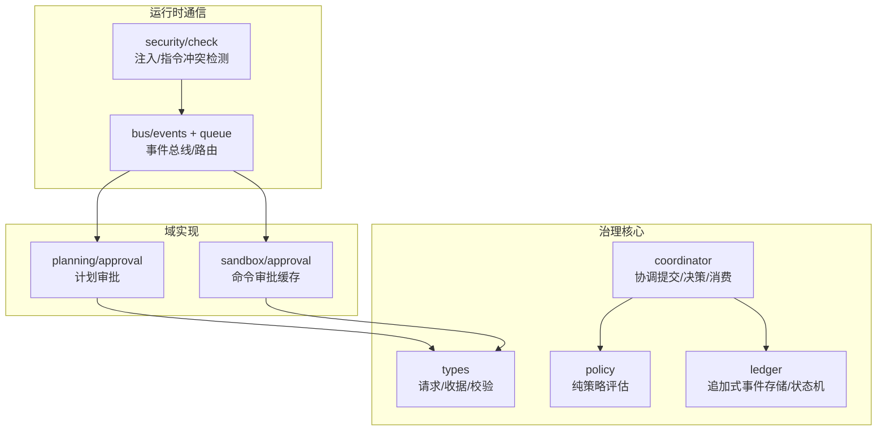
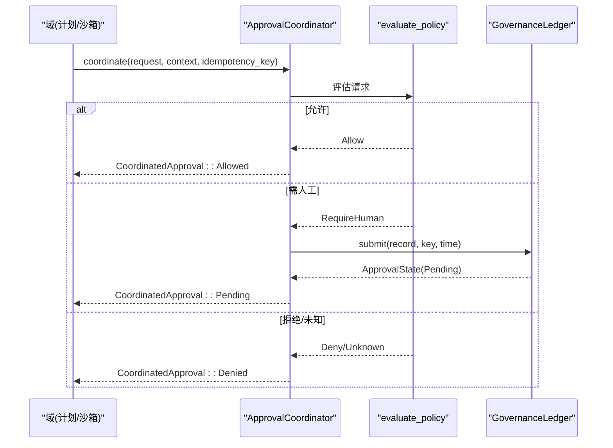
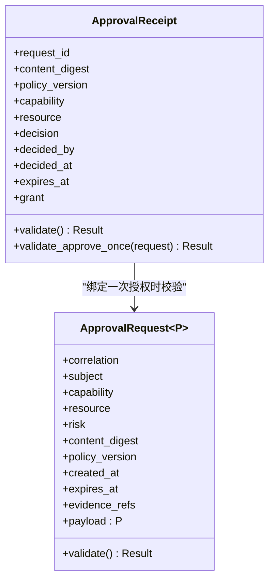
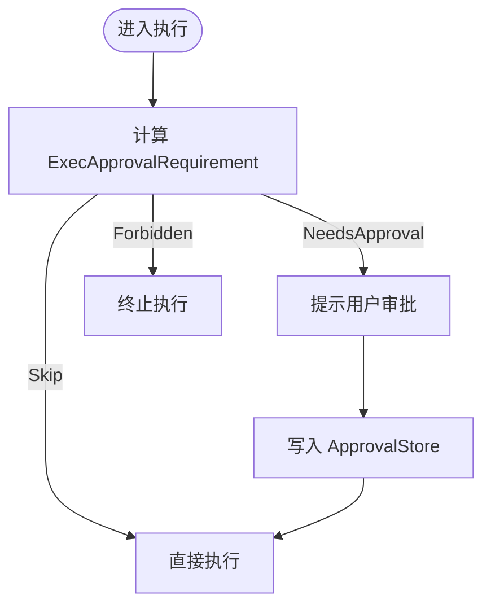
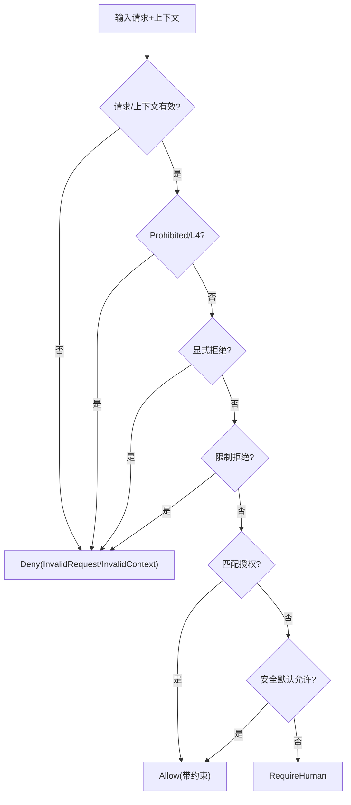
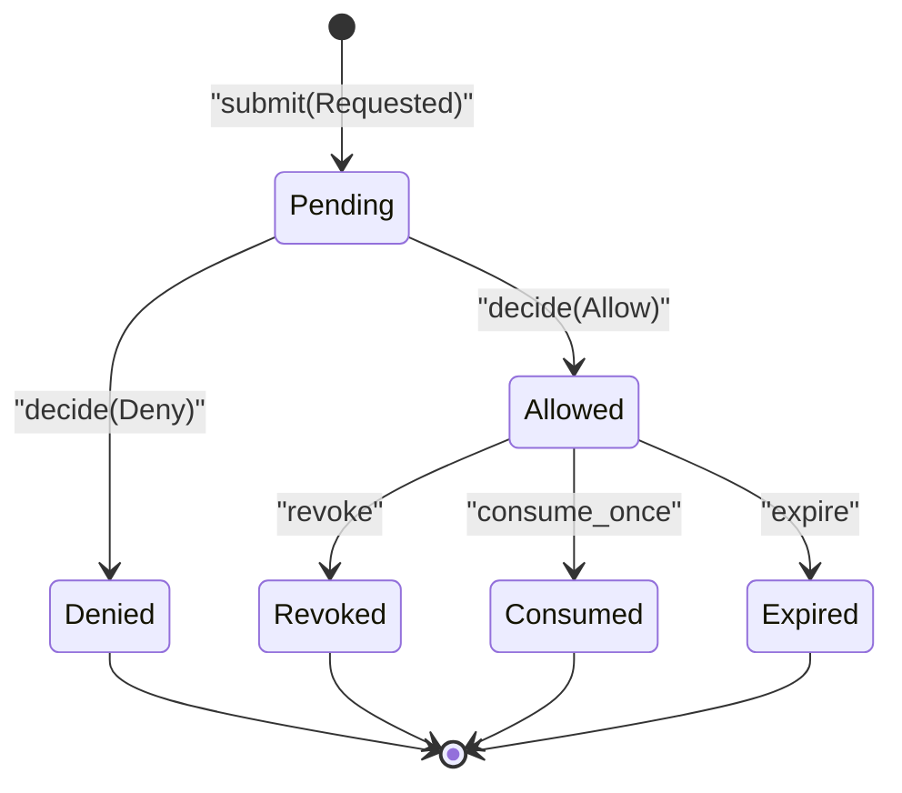
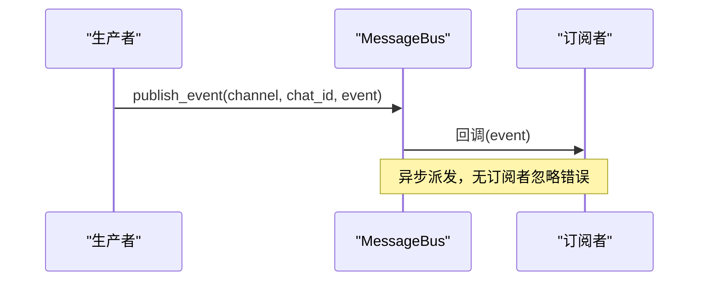
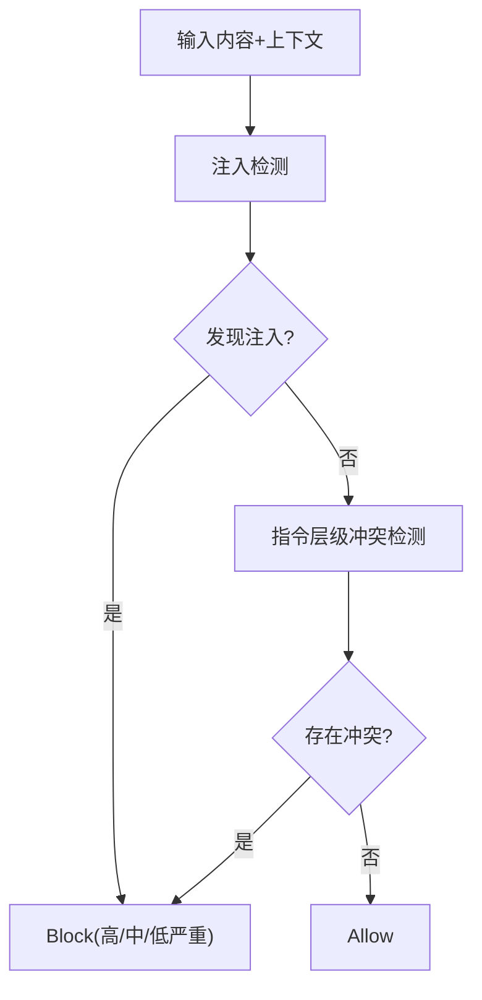
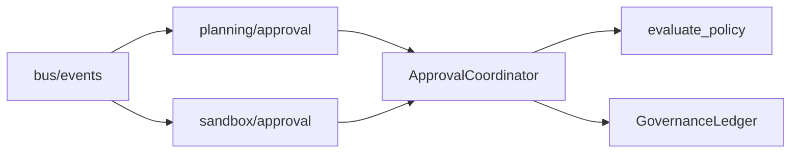

# 治理协议接口

<cite>
**本文引用的文件**
- [agent-diva-core/src/governance/mod.rs](file://agent-diva-core/src/governance/mod.rs)
- [agent-diva-core/src/governance/types.rs](file://agent-diva-core/src/governance/types.rs)
- [agent-diva-core/src/governance/coordinator.rs](file://agent-diva-core/src/governance/coordinator.rs)
- [agent-diva-core/src/governance/ledger.rs](file://agent-diva-core/src/governance/ledger.rs)
- [agent-diva-core/src/governance/policy.rs](file://agent-diva-core/src/governance/policy.rs)
- [agent-diva-core/src/planning/approval.rs](file://agent-diva-core/src/planning/approval.rs)
- [agent-diva-sandbox/src/approval.rs](file://agent-diva-sandbox/src/approval.rs)
- [agent-diva-core/src/bus/events.rs](file://agent-diva-core/src/bus/events.rs)
- [agent-diva-core/src/bus/queue.rs](file://agent-diva-core/src/bus/queue.rs)
- [agent-diva-core/src/security/check.rs](file://agent-diva-core/src/security/check.rs)
</cite>

## 目录
1. [简介](#简介)
2. [项目结构](#项目结构)
3. [核心组件](#核心组件)
4. [架构总览](#架构总览)
5. [详细组件分析](#详细组件分析)
6. [依赖关系分析](#依赖关系分析)
7. [性能与可扩展性](#性能与可扩展性)
8. [故障排查指南](#故障排查指南)
9. [结论](#结论)
10. [附录：调试与测试工具](#附录：调试与测试工具)

## 简介
本文件面向“治理协议接口”，系统化说明治理层如何与计划、沙箱等域进行通信，覆盖请求拦截、决策执行与结果反馈的标准格式。重点包括：
- 通用信封（Envelope）设计：类型安全、领域无关的数据传输。
- 审批请求结构：参数、上下文、期望响应。
- 事件发布订阅机制：事件类型、消息路由与消费者处理。
- 边界检查与安全：跨域通信的安全机制。
- 协议版本管理与向后兼容。
- 调试与测试方法：消息模拟与交互流程验证。

## 项目结构
治理协议的核心位于 agent-diva-core 的 governance 模块，提供领域无关的请求信封、策略评估、持久化账本与协调器；计划与沙箱各自维护自身 payload，并通过统一信封接入治理。消息总线在 core::bus 中提供事件通道与路由。

图表来源
- [agent-diva-core/src/governance/types.rs:121-161](file://agent-diva-core/src/governance/types.rs#L121-L161)
- [agent-diva-core/src/governance/policy.rs:98-205](file://agent-diva-core/src/governance/policy.rs#L98-L205)
- [agent-diva-core/src/governance/coordinator.rs:73-186](file://agent-diva-core/src/governance/coordinator.rs#L73-L186)
- [agent-diva-core/src/governance/ledger.rs:244-312](file://agent-diva-core/src/governance/ledger.rs#L244-L312)
- [agent-diva-core/src/planning/approval.rs:23-56](file://agent-diva-core/src/planning/approval.rs#L23-L56)
- [agent-diva-sandbox/src/approval.rs:13-81](file://agent-diva-sandbox/src/approval.rs#L13-L81)
- [agent-diva-core/src/bus/events.rs:59-153](file://agent-diva-core/src/bus/events.rs#L59-L153)
- [agent-diva-core/src/security/check.rs:15-117](file://agent-diva-core/src/security/check.rs#L15-L117)

章节来源
- [agent-diva-core/src/governance/mod.rs:1-17](file://agent-diva-core/src/governance/mod.rs#L1-L17)

## 核心组件
- 通用信封 ApprovalRequest
：携带审计关联、主体、能力、资源范围、风险等级、内容摘要、策略版本、时间戳、证据引用与领域负载。
- 审批收据 ApprovalReceipt：绑定一次或会话级授权，包含决策、决策者、有效期与授权类型。
- 策略评估 evaluate_policy：无副作用、确定性，返回允许/拒绝/需人工审批及原因与约束。
- 协调器 ApprovalCoordinator：封装提交、决策、消费一次性收据、撤销、过期、分页查询与事件回放。
- 账本 GovernanceLedger：追加式事件存储，基于 SQLite 实现，保证幂等、版本冲突与状态机一致性。
- 计划与沙箱审批：分别定义领域审批结构与本地缓存策略。
- 事件总线：AgentEvent/PokeEvent 通过 channel/chat_id 路由，支持订阅与分发。
- 安全检查：注入检测与指令层级冲突，输出统一安全决策并记录审计。

章节来源
- [agent-diva-core/src/governance/types.rs:121-161](file://agent-diva-core/src/governance/types.rs#L121-L161)
- [agent-diva-core/src/governance/policy.rs:98-205](file://agent-diva-core/src/governance/policy.rs#L98-L205)
- [agent-diva-core/src/governance/coordinator.rs:73-186](file://agent-diva-core/src/governance/coordinator.rs#L73-L186)
- [agent-diva-core/src/governance/ledger.rs:244-312](file://agent-diva-core/src/governance/ledger.rs#L244-L312)
- [agent-diva-core/src/planning/approval.rs:23-56](file://agent-diva-core/src/planning/approval.rs#L23-L56)
- [agent-diva-sandbox/src/approval.rs:13-81](file://agent-diva-sandbox/src/approval.rs#L13-L81)
- [agent-diva-core/src/bus/events.rs:59-153](file://agent-diva-core/src/bus/events.rs#L59-L153)
- [agent-diva-core/src/security/check.rs:15-117](file://agent-diva-core/src/security/check.rs#L15-L117)

## 架构总览
治理协议采用“请求-策略-账本-协调”的分层架构：
- 请求层：各域构造 ApprovalRequest
，携带领域负载与审计元数据。
- 策略层：evaluate_policy 根据自主级别、限制、授权矩阵得出决策。
- 账本层：以追加事件形式持久化，派生当前状态，支持幂等提交与 CAS 决策。
- 协调层：对外暴露统一的 coordinate/decide/consume_once/revoke/expire 等接口。

图表来源
- [agent-diva-core/src/governance/coordinator.rs:73-96](file://agent-diva-core/src/governance/coordinator.rs#L73-L96)
- [agent-diva-core/src/governance/policy.rs:98-205](file://agent-diva-core/src/governance/policy.rs#L98-L205)
- [agent-diva-core/src/governance/ledger.rs:486-518](file://agent-diva-core/src/governance/ledger.rs#L486-L518)

## 详细组件分析

### 通用信封与类型安全
- ApprovalRequest
：将审计关联、主体、能力、资源范围、风险、内容摘要、策略版本、时间窗口、证据引用与领域负载组合为单一可序列化对象。
- ApprovalReceipt：绑定一次/会话/规则授权，确保仅对匹配的能力、资源与策略版本有效。
- 校验：请求与收据均提供 validate 方法，强制非空字段、未知枚举拒绝、过期校验与摘要完整性。

图表来源
- [agent-diva-core/src/governance/types.rs:121-161](file://agent-diva-core/src/governance/types.rs#L121-L161)
- [agent-diva-core/src/governance/types.rs:204-280](file://agent-diva-core/src/governance/types.rs#L204-L280)

章节来源
- [agent-diva-core/src/governance/types.rs:121-161](file://agent-diva-core/src/governance/types.rs#L121-L161)
- [agent-diva-core/src/governance/types.rs:204-280](file://agent-diva-core/src/governance/types.rs#L204-L280)

### 审批请求与期望响应
- 计划审批：PlanSubmission 描述提交前元数据；ApprovalRequest 表示用户批准某次冻结修订；ApprovalReceipt 记录批准人、时间与 TODO 策略。
- 沙箱审批：ReviewDecision 表达单次/会话级批准；ExecApprovalRequirement 表达跳过/需审批/禁止三类需求；ApprovalStore 缓存命令级审批。

图表来源
- [agent-diva-sandbox/src/approval.rs:63-133](file://agent-diva-sandbox/src/approval.rs#L63-L133)
- [agent-diva-sandbox/src/approval.rs:155-248](file://agent-diva-sandbox/src/approval.rs#L155-L248)

章节来源
- [agent-diva-core/src/planning/approval.rs:23-56](file://agent-diva-core/src/planning/approval.rs#L23-L56)
- [agent-diva-sandbox/src/approval.rs:13-81](file://agent-diva-sandbox/src/approval.rs#L13-L81)
- [agent-diva-sandbox/src/approval.rs:155-248](file://agent-diva-sandbox/src/approval.rs#L155-L248)

### 策略评估与决策执行
- 优先级：硬禁止 > 显式拒绝 > 无效上下文 > 资源/模式限制 > 授权匹配 > 安全默认允许 > 需要人工审批。
- 授权匹配：按 grant 类型（Once/Session/Rule）与能力、资源、策略版本、会话 ID 精确匹配。
- 安全默认：仅在低风险的特定能力上允许，其余均需人工审批。

图表来源
- [agent-diva-core/src/governance/policy.rs:98-205](file://agent-diva-core/src/governance/policy.rs#L98-L205)
- [agent-diva-core/src/governance/policy.rs:207-346](file://agent-diva-core/src/governance/policy.rs#L207-L346)

章节来源
- [agent-diva-core/src/governance/policy.rs:98-205](file://agent-diva-core/src/governance/policy.rs#L98-L205)

### 持久化账本与状态机
- 事件模型：Requested/Allowed/Denied/Revoked/Consumed/Expired，追加不可变 JSON 事件。
- 状态派生：按事件顺序推导 Pending/Allowed/Denied/Revoked/Consumed/Expired。
- 幂等与 CAS：idempotency_key + operation_fingerprint 防重放；version 冲突保护。
- 一次性消费：consume_once 将 Allowed+Once 转为 Consumed，防止重复使用。

图表来源
- [agent-diva-core/src/governance/ledger.rs:119-186](file://agent-diva-core/src/governance/ledger.rs#L119-L186)
- [agent-diva-core/src/governance/ledger.rs:486-715](file://agent-diva-core/src/governance/ledger.rs#L486-L715)

章节来源
- [agent-diva-core/src/governance/ledger.rs:244-312](file://agent-diva-core/src/governance/ledger.rs#L244-L312)
- [agent-diva-core/src/governance/ledger.rs:486-715](file://agent-diva-core/src/governance/ledger.rs#L486-L715)

### 事件发布订阅机制
- AgentEvent：迭代、工具调用、计划就绪、最终响应、重试、停滞、上下文压缩等。
- AgentBusEvent：按 channel 与 chat_id 路由到订阅者。
- PokeEvent：生命周期与审计事件，用于监控与审计。
- MessageBus：提供 publish_event/publish_inbound/publish_poke_event 与 subscribe_outbound/subscribe_events/subscribe_poke_events。

图表来源
- [agent-diva-core/src/bus/events.rs:59-153](file://agent-diva-core/src/bus/events.rs#L59-L153)
- [agent-diva-core/src/bus/queue.rs:61-173](file://agent-diva-core/src/bus/queue.rs#L61-L173)

章节来源
- [agent-diva-core/src/bus/events.rs:59-153](file://agent-diva-core/src/bus/events.rs#L59-L153)
- [agent-diva-core/src/bus/queue.rs:61-173](file://agent-diva-core/src/bus/queue.rs#L61-L173)

### 边界检查与安全机制
- 安全检查入口 check_security：注入检测与指令层级冲突检测，输出 Block/Allow 等决策并记录审计。
- 治理策略中的失败关闭：未知能力/资源/风险/决策均被拒绝，避免越权。
- 资源-能力矩阵：严格匹配 Capability 与 ResourceKind，防止跨域滥用。

图表来源
- [agent-diva-core/src/security/check.rs:15-117](file://agent-diva-core/src/security/check.rs#L15-L117)
- [agent-diva-core/src/governance/policy.rs:285-303](file://agent-diva-core/src/governance/policy.rs#L285-L303)

章节来源
- [agent-diva-core/src/security/check.rs:15-117](file://agent-diva-core/src/security/check.rs#L15-L117)
- [agent-diva-core/src/governance/policy.rs:285-303](file://agent-diva-core/src/governance/policy.rs#L285-L303)

### 协议版本管理与向后兼容
- 策略版本 policy_version：请求与收据必须一致，防止旧授权用于新策略。
- 未知枚举处理：未知 capability/resource/risk/decision/grant 会被拒绝，确保新增值不会静默放行。
- 固定 JSON 契约：测试锁定通用信封与评估结果的序列化格式，保障跨版本兼容。
- 迁移原则：不引入长期 legacy 分支，不添加 /v1 别名，保持数据格式稳定，回滚即撤销提交。

章节来源
- [agent-diva-core/src/governance/types.rs:163-202](file://agent-diva-core/src/governance/types.rs#L163-L202)
- [agent-diva-core/src/governance/types.rs:384-417](file://agent-diva-core/src/governance/types.rs#L384-L417)
- [agent-diva-core/src/governance/policy.rs:654-677](file://agent-diva-core/src/governance/policy.rs#L654-L677)

## 依赖关系分析
- 协调器依赖策略与账本：coordinate 先评估策略，再决定是否提交至账本；decide/consume_once/revoke/expire 均通过账本完成状态转换。
- 计划与沙箱通过通用信封接入治理：计划使用领域 ApprovalRequest/Receipt；沙箱使用本地缓存与策略需求。
- 事件总线与治理解耦：治理事件（如 PlanReadyForApproval）通过总线广播，GUI/CLI 订阅展示。

图表来源
- [agent-diva-core/src/governance/coordinator.rs:73-186](file://agent-diva-core/src/governance/coordinator.rs#L73-L186)
- [agent-diva-core/src/planning/approval.rs:23-56](file://agent-diva-core/src/planning/approval.rs#L23-L56)
- [agent-diva-sandbox/src/approval.rs:13-81](file://agent-diva-sandbox/src/approval.rs#L13-L81)
- [agent-diva-core/src/bus/events.rs:59-153](file://agent-diva-core/src/bus/events.rs#L59-L153)

章节来源
- [agent-diva-core/src/governance/coordinator.rs:73-186](file://agent-diva-core/src/governance/coordinator.rs#L73-L186)

## 性能与可扩展性
- 策略评估无 I/O 且确定性强，适合高频调用。
- 账本基于 SQLite 追加写，索引 request_id/version，支持分页回放与游标续读。
- 事件总线使用广播通道，无订阅者时忽略错误，降低耦合与开销。
- 建议：
  - 批量读取 states_page/events_page 控制 limit，避免大页。
  - 使用 idempotency_key 避免重复提交。
  - 在高并发场景考虑连接池与事务隔离。

[本节为通用指导，不直接分析具体文件]

## 故障排查指南
- 常见错误码：NotFound/VersionConflict/IdempotencyConflict/InvalidTransition/Expired/AlreadyConsumed/Persistence。
- 定位步骤：
  - 检查请求/收据校验是否通过（缺失字段、未知枚举、过期）。
  - 核对策略版本与授权匹配（capability/resource/session_id）。
  - 查看事件流 events(request_id) 确认状态机转换。
  - 若幂等键冲突，检查操作指纹是否一致。
- 审计与日志：
  - 安全检查会记录 SecurityPolicyDecision 与 MessageBlocked。
  - 策略评估结果包含 reason 与 constraints，便于归因。

章节来源
- [agent-diva-core/src/governance/ledger.rs:188-236](file://agent-diva-core/src/governance/ledger.rs#L188-L236)
- [agent-diva-core/src/security/check.rs:119-149](file://agent-diva-core/src/security/check.rs#L119-L149)

## 结论
该治理协议通过领域无关的通用信封、严格的策略评估与追加式账本，实现了跨域的请求拦截、决策执行与结果反馈。其类型安全、失败关闭与幂等设计保障了安全性与可恢复性；事件总线提供了灵活的发布订阅机制；安全检查与资源-能力矩阵强化了边界防护。配合版本管理与固定契约，系统具备良好的向后兼容性与可演进性。

[本节为总结，不直接分析具体文件]

## 附录：调试与测试工具
- 消息模拟：
  - 使用 MessageBus 构造 InboundMessage/OutboundMessage，发布 AgentEvent 与 PokeEvent，验证订阅者行为。
  - 通过 bus.subscribe_events()/subscribe_poke_events() 捕获事件流。
- 交互流程验证：
  - 使用 coordinator.coordinate/decide/consume_once 模拟完整审批流程，断言状态与事件。
  - 利用 ledger.events(request_id) 回放事件，确认状态机正确转换。
- 推荐用例：
  - 验证安全默认允许与需要人工审批的路径。
  - 验证一次性授权消费后不可复用。
  - 验证未知枚举导致失败关闭。

章节来源
- [agent-diva-core/src/bus/events.rs:59-153](file://agent-diva-core/src/bus/events.rs#L59-L153)
- [agent-diva-core/src/bus/queue.rs:61-173](file://agent-diva-core/src/bus/queue.rs#L61-L173)
- [agent-diva-core/src/governance/coordinator.rs:285-424](file://agent-diva-core/src/governance/coordinator.rs#L285-L424)
- [agent-diva-core/src/governance/ledger.rs:779-795](file://agent-diva-core/src/governance/ledger.rs#L779-L795)