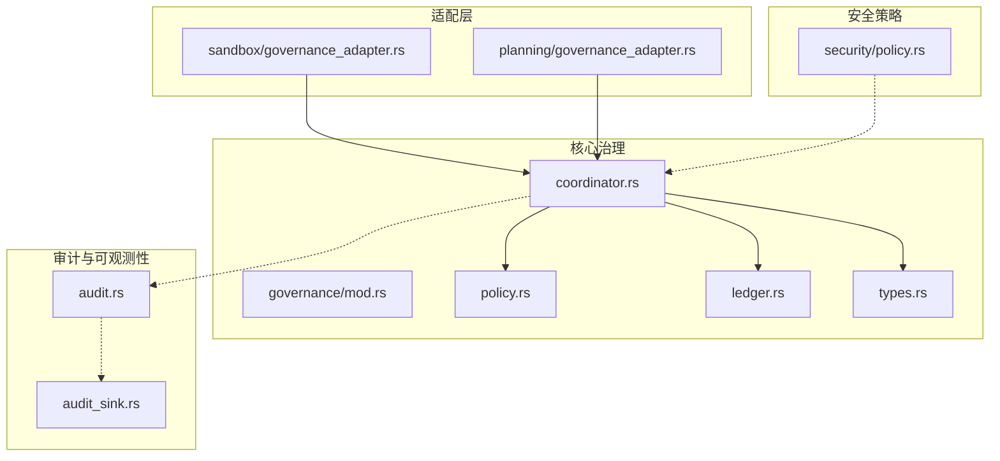
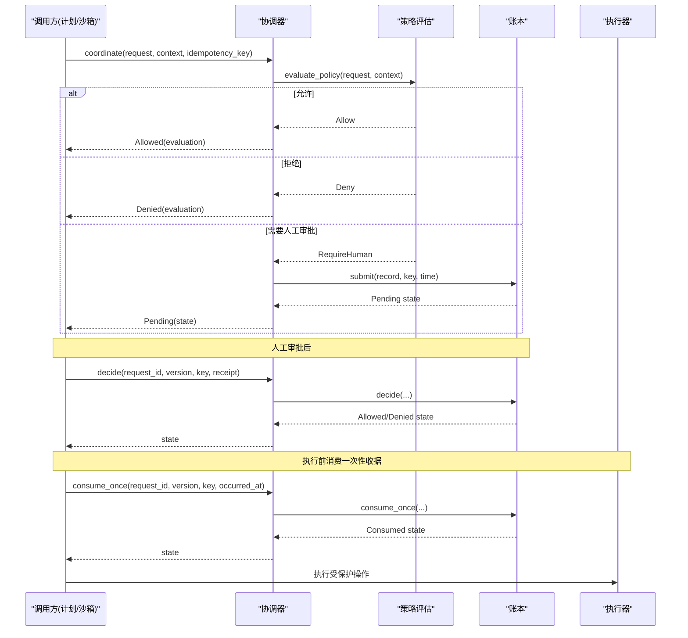
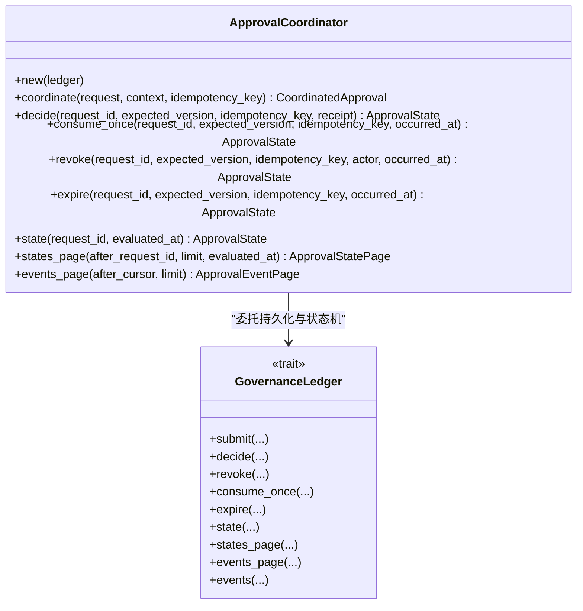
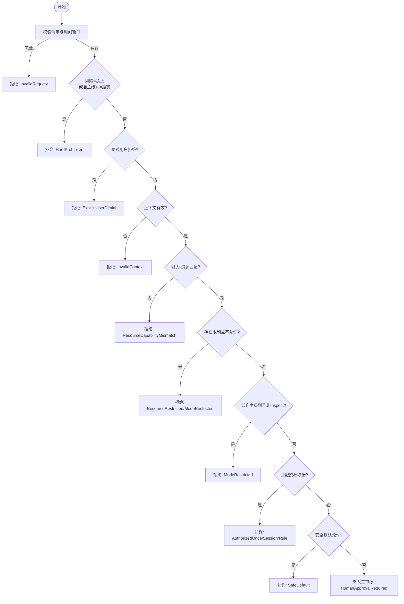
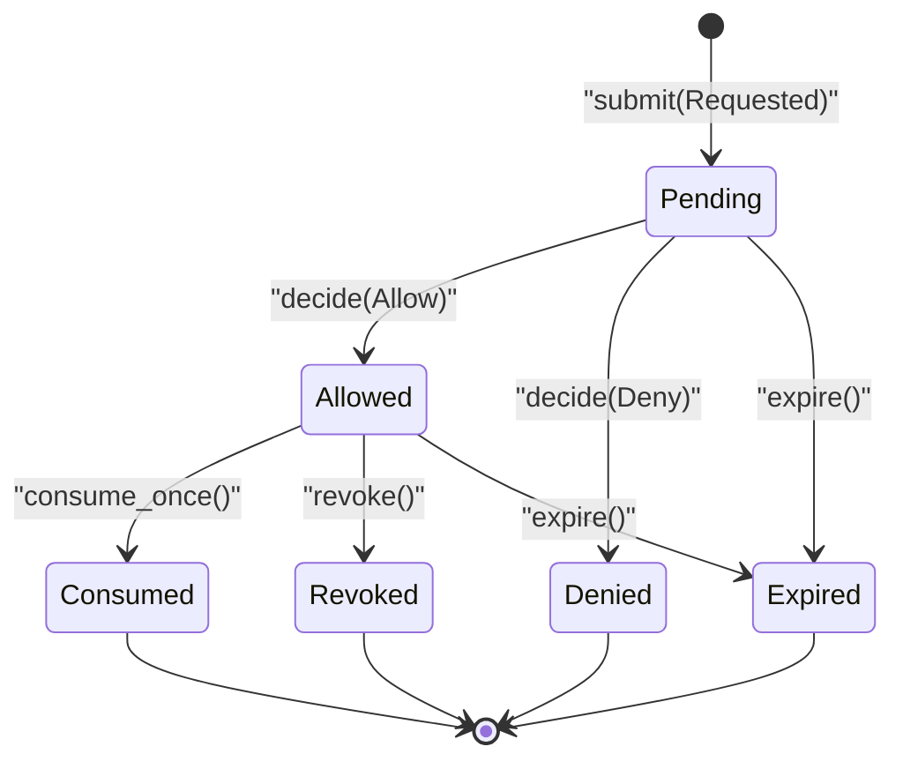
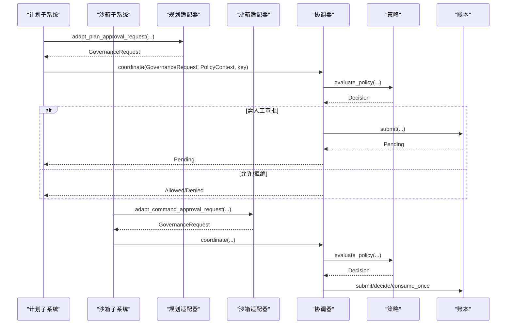
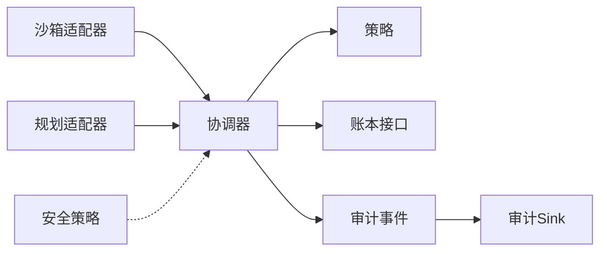

# 治理层边界

<cite>
**本文引用的文件**
- [agent-diva-core/src/governance/mod.rs](file://agent-diva-core/src/governance/mod.rs)
- [agent-diva-core/src/governance/coordinator.rs](file://agent-diva-core/src/governance/coordinator.rs)
- [agent-diva-core/src/governance/policy.rs](file://agent-diva-core/src/governance/policy.rs)
- [agent-diva-core/src/governance/ledger.rs](file://agent-diva-core/src/governance/ledger.rs)
- [agent-diva-core/src/governance/types.rs](file://agent-diva-core/src/governance/types.rs)
- [agent-diva-sandbox/src/governance_adapter.rs](file://agent-diva-sandbox/src/governance_adapter.rs)
- [agent-diva-core/src/planning/governance_adapter.rs](file://agent-diva-core/src/planning/governance_adapter.rs)
- [agent-diva-core/src/security/policy.rs](file://agent-diva-core/src/security/policy.rs)
- [agent-diva-core/src/audit.rs](file://agent-diva-core/src/audit.rs)
- [agent-diva-core/src/audit_sink.rs](file://agent-diva-core/src/audit_sink.rs)
</cite>

## 目录
1. [简介](#简介)
2. [项目结构](#项目结构)
3. [核心组件](#核心组件)
4. [架构总览](#架构总览)
5. [详细组件分析](#详细组件分析)
6. [依赖关系分析](#依赖关系分析)
7. [性能考虑](#性能考虑)
8. [故障排查指南](#故障排查指南)
9. [结论](#结论)
10. [附录](#附录)

## 简介
本文件聚焦“治理层边界”，系统化说明治理协调器（Coordinator）的职责与生命周期、策略系统（Policy）的权限检查与访问控制、账本系统（Ledger）的设计与审计记录，以及治理层与计划、沙箱等组件的交互协议。同时涵盖治理规则动态加载与热更新机制、冲突解决策略，以及监控与调试工具使用方法。

## 项目结构
治理相关代码集中在 agent-diva-core 的 governance 模块，并通过适配器桥接到 sandbox 与 planning 等子系统；安全策略位于 security 模块；审计事件通过 audit 与 audit_sink 统一输出。

图表来源
- [agent-diva-core/src/governance/mod.rs:1-17](file://agent-diva-core/src/governance/mod.rs#L1-L17)
- [agent-diva-core/src/governance/coordinator.rs:1-186](file://agent-diva-core/src/governance/coordinator.rs#L1-L186)
- [agent-diva-core/src/governance/policy.rs:1-205](file://agent-diva-core/src/governance/policy.rs#L1-L205)
- [agent-diva-core/src/governance/ledger.rs:1-312](file://agent-diva-core/src/governance/ledger.rs#L1-L312)
- [agent-diva-core/src/governance/types.rs:1-161](file://agent-diva-core/src/governance/types.rs#L1-L161)
- [agent-diva-sandbox/src/governance_adapter.rs:1-80](file://agent-diva-sandbox/src/governance_adapter.rs#L1-L80)
- [agent-diva-core/src/planning/governance_adapter.rs:1-78](file://agent-diva-core/src/planning/governance_adapter.rs#L1-L78)
- [agent-diva-core/src/security/policy.rs:1-60](file://agent-diva-core/src/security/policy.rs#L1-L60)
- [agent-diva-core/src/audit.rs:1-253](file://agent-diva-core/src/audit.rs#L1-L253)
- [agent-diva-core/src/audit_sink.rs:1-94](file://agent-diva-core/src/audit_sink.rs#L1-L94)

章节来源
- [agent-diva-core/src/governance/mod.rs:1-17](file://agent-diva-core/src/governance/mod.rs#L1-L17)

## 核心组件
- 协调器（ApprovalCoordinator）：统一入口，负责将领域请求提交到策略评估与持久化审批流，并管理一次性消费、撤销、过期等状态机操作。
- 策略（Policy）：无副作用的决策引擎，基于能力-资源矩阵、风险等级、自主级别、限制与授权收据进行判定，返回允许、拒绝或需人工审批。
- 账本（GovernanceLedger + SqliteGovernanceLedger）：追加式事件存储，提供幂等提交、版本冲突检测、状态重放、分页查询与审计事件回放。
- 类型与契约（Types）：稳定的跨域请求/收据/错误枚举与校验逻辑，确保不同子系统共享一致的治理语义。
- 适配器（Sandbox/Planning Adapters）：将旧有领域请求映射为通用治理请求，或将领域决策转换为治理收据。
- 安全策略（SecurityPolicy）：路径、速率限制、只读模式等运行时安全约束，与治理策略互补。
- 审计（Audit/AuditSink）：结构化事件输出与可插拔后端，用于监控与调试。

章节来源
- [agent-diva-core/src/governance/coordinator.rs:1-186](file://agent-diva-core/src/governance/coordinator.rs#L1-L186)
- [agent-diva-core/src/governance/policy.rs:1-205](file://agent-diva-core/src/governance/policy.rs#L1-L205)
- [agent-diva-core/src/governance/ledger.rs:1-312](file://agent-diva-core/src/governance/ledger.rs#L1-L312)
- [agent-diva-core/src/governance/types.rs:1-161](file://agent-diva-core/src/governance/types.rs#L1-L161)
- [agent-diva-sandbox/src/governance_adapter.rs:1-80](file://agent-diva-sandbox/src/governance_adapter.rs#L1-L80)
- [agent-diva-core/src/planning/governance_adapter.rs:1-78](file://agent-diva-core/src/planning/governance_adapter.rs#L1-L78)
- [agent-diva-core/src/security/policy.rs:1-60](file://agent-diva-core/src/security/policy.rs#L1-L60)
- [agent-diva-core/src/audit.rs:1-253](file://agent-diva-core/src/audit.rs#L1-L253)
- [agent-diva-core/src/audit_sink.rs:1-94](file://agent-diva-core/src/audit_sink.rs#L1-L94)

## 架构总览
治理层以“纯策略评估 + 持久化审批 + 幂等执行”为核心设计，所有高价值或高风险操作均需经过协调器，由策略决定是否需要人工审批，再由账本维护不可变事件流，下游执行器仅能消费一次性收据。

图表来源
- [agent-diva-core/src/governance/coordinator.rs:73-186](file://agent-diva-core/src/governance/coordinator.rs#L73-L186)
- [agent-diva-core/src/governance/policy.rs:98-205](file://agent-diva-core/src/governance/policy.rs#L98-L205)
- [agent-diva-core/src/governance/ledger.rs:486-670](file://agent-diva-core/src/governance/ledger.rs#L486-L670)

## 详细组件分析

### 协调器（ApprovalCoordinator）职责与生命周期
- 职责
  - 统一入口：接收领域请求、上下文与幂等键，调用策略评估。
  - 状态管理：根据策略结果决定是否持久化审批记录、提交人工审批、消费一次性收据、撤销、过期。
  - 一致性保障：使用期望版本号与幂等键避免并发冲突与重复提交。
- 生命周期
  - 创建：持有对 GovernanceLedger 的引用。
  - 协调：coordinate() 完成评估与提交。
  - 决策：decide() 写入人类决策。
  - 消费：consume_once() 保证一次生效。
  - 撤销/过期：revoke()/expire() 终止未消费或已允许的审批。
  - 查询：state()/states_page()/events_page() 支持审计与恢复。

图表来源
- [agent-diva-core/src/governance/coordinator.rs:54-186](file://agent-diva-core/src/governance/coordinator.rs#L54-L186)
- [agent-diva-core/src/governance/ledger.rs:244-312](file://agent-diva-core/src/governance/ledger.rs#L244-L312)

章节来源
- [agent-diva-core/src/governance/coordinator.rs:1-186](file://agent-diva-core/src/governance/coordinator.rs#L1-L186)

### 策略系统（Policy）实现：权限检查、访问控制与行为约束
- 输入
  - 领域请求 ApprovalRequest（含能力、资源范围、风险等级、内容摘要、策略版本、时间窗口、证据引用）。
  - 上下文 PolicyContext（评估时间、自主级别、显式用户决策、限制列表、授权收据列表）。
- 决策流程（优先级从高到低）
  1) 请求有效性校验（字段非空、时间窗口有效）。
  2) 硬拒绝（风险为禁止或自主级别为最高级）。
  3) 显式用户拒绝。
  4) 上下文无效（未知级别或未知显式决策）。
  5) 能力-资源匹配矩阵校验。
  6) 限制检查（资源/模式限制）。
  7) 低自主级别下仅允许 inspect。
  8) 匹配授权收据（按 grant 类型 Once/Session/Rule 校验绑定与有效期）。
  9) 安全默认允许（低自主级别下的低风险只读/计划草稿）。
  10) 否则进入人工审批。
- 输出
  - PolicyEvaluation：决策、原因码、约束、证据引用。
- 关键约束
  - 授权收据必须与请求在策略版本、能力、资源范围、内容摘要上严格绑定。
  - 不同自主级别对授权粒度有不同要求（如 L2 不允许一次性授权某些场景）。
  - 未知值一律失败关闭。

图表来源
- [agent-diva-core/src/governance/policy.rs:98-205](file://agent-diva-core/src/governance/policy.rs#L98-L205)

章节来源
- [agent-diva-core/src/governance/policy.rs:1-205](file://agent-diva-core/src/governance/policy.rs#L1-L205)
- [agent-diva-core/src/governance/types.rs:1-161](file://agent-diva-core/src/governance/types.rs#L1-L161)

### 账本系统（Ledger）设计与审计日志
- 设计要点
  - 追加式事件存储：每个操作生成不可变事件，包含请求、收据、动作、时间戳、幂等键与操作指纹。
  - 幂等提交：通过唯一幂等键与操作指纹防止重复提交与冲突。
  - 版本冲突：并发写时通过期望版本号与数据库唯一约束检测冲突。
  - 状态重放：按 request_id 顺序读取事件，推导当前 ApprovalState。
  - 分页与游标：支持事件页与状态页的稳定分页，便于恢复与审计。
- 主要操作
  - submit：提交请求，若需人工审批则记录 Requested 事件。
  - decide：写入 Allowed/Denied 事件，校验收据绑定与有效期。
  - revoke：撤销 Pending/Allowed 状态，禁止已消费状态撤销。
  - consume_once：标记一次性收据被消费，防止重复执行。
  - expire：标记过期，幂等追加 Expired 事件。
  - state/states_page/events_page：查询当前状态与历史事件。
- 审计日志
  - 所有事件持久化为 JSON，可通过 events_page 回放。
  - 结合全局审计 sink，将关键治理事件输出到 JSONL 文件，便于外部采集与分析。

图表来源
- [agent-diva-core/src/governance/ledger.rs:119-165](file://agent-diva-core/src/governance/ledger.rs#L119-L165)
- [agent-diva-core/src/governance/ledger.rs:486-715](file://agent-diva-core/src/governance/ledger.rs#L486-L715)

章节来源
- [agent-diva-core/src/governance/ledger.rs:1-800](file://agent-diva-core/src/governance/ledger.rs#L1-L800)

### 与其他组件的交互协议
- 计划（Planning）
  - 通过 planning/governance_adapter 将旧版 Plan 请求包装为通用治理请求，并将批准收据转换为治理收据。
  - 资源边界包含计划修订信息，确保执行时仅作用于特定版本。
- 沙箱（Sandbox）
  - 通过 sandbox/governance_adapter 将命令执行请求包装为 CommandExecute 能力，资源范围包含工作目录边界。
  - 将领域决策映射为治理收据（一次性、会话级、规则级）。
- 安全策略（SecurityPolicy）
  - 提供路径校验、速率限制、只读模式等运行时约束，与治理策略互补，共同构成完整的安全边界。

图表来源
- [agent-diva-core/src/planning/governance_adapter.rs:30-78](file://agent-diva-core/src/planning/governance_adapter.rs#L30-L78)
- [agent-diva-sandbox/src/governance_adapter.rs:28-80](file://agent-diva-sandbox/src/governance_adapter.rs#L28-L80)
- [agent-diva-core/src/governance/coordinator.rs:73-186](file://agent-diva-core/src/governance/coordinator.rs#L73-L186)

章节来源
- [agent-diva-core/src/planning/governance_adapter.rs:1-135](file://agent-diva-core/src/planning/governance_adapter.rs#L1-L135)
- [agent-diva-sandbox/src/governance_adapter.rs:1-201](file://agent-diva-sandbox/src/governance_adapter.rs#L1-L201)
- [agent-diva-core/src/security/policy.rs:1-288](file://agent-diva-core/src/security/policy.rs#L1-L288)

### 治理规则的动态加载与热更新机制
- 策略评估函数为纯函数，不持有可变状态，因此可在运行时重新加载策略配置后直接生效。
- 策略上下文中的 policy_version 字段用于绑定策略版本，授权收据也必须与请求的策略版本一致，从而确保策略升级后的向后兼容与灰度控制。
- 建议实践
  - 在应用启动或配置变更时，重建 PolicyContext 并传入新的 policy_version。
  - 对新策略版本发布后，逐步降低旧版本的授权收据效力（通过过期或策略版本不匹配自然失效）。
  - 使用 states_page/events_page 观察策略变更后的审批与执行轨迹。

章节来源
- [agent-diva-core/src/governance/policy.rs:98-205](file://agent-diva-core/src/governance/policy.rs#L98-L205)
- [agent-diva-core/src/governance/types.rs:121-161](file://agent-diva-core/src/governance/types.rs#L121-L161)

### 治理冲突解决策略
- 幂等键与操作指纹：同一幂等键只能对应一个操作指纹，防止重复提交与误用。
- 版本冲突：提交时通过期望版本号与数据库唯一约束检测并发冲突，返回 VersionConflict。
- 状态机约束：仅在合法状态下转换（如 Pending->Allowed/Denied，Allowed->Consumed/Revoked/Expired），非法转换返回 InvalidTransition。
- 过期与撤销：对 Pending/Allowed 状态可主动过期或撤销，避免长期悬挂审批。
- 一次性收据：consume_once 成功后立即标记为 Consumed，防止重复执行。

章节来源
- [agent-diva-core/src/governance/ledger.rs:371-426](file://agent-diva-core/src/governance/ledger.rs#L371-L426)
- [agent-diva-core/src/governance/ledger.rs:520-715](file://agent-diva-core/src/governance/ledger.rs#L520-L715)

### 监控与调试工具使用方法
- 审计事件
  - 通过 audit::emit 输出结构化 JSON 行，目标为 "audit"，便于过滤与聚合。
  - 可注册全局 AuditSink（如 JsonlAuditSink）将事件写入 workspace-local JSONL 文件，按日滚动。
- 治理事件回放
  - 使用 ledger.events_page 获取追加事件流，配合 cursor 进行增量拉取。
  - 使用 states_page 获取各请求在当前时间的派生状态，便于概览与恢复。
- 调试建议
  - 在协调器调用前后记录请求 ID、幂等键、策略版本与评估时间。
  - 对拒绝与人工审批请求增加额外上下文（如限制原因、授权收据来源）。
  - 结合 GUI/CLI 的日志收集与导出功能，构建调试包。

章节来源
- [agent-diva-core/src/audit.rs:1-253](file://agent-diva-core/src/audit.rs#L1-L253)
- [agent-diva-core/src/audit_sink.rs:60-94](file://agent-diva-core/src/audit_sink.rs#L60-L94)
- [agent-diva-core/src/governance/ledger.rs:440-481](file://agent-diva-core/src/governance/ledger.rs#L440-L481)
- [agent-diva-core/src/governance/ledger.rs:725-777](file://agent-diva-core/src/governance/ledger.rs#L725-L777)

## 依赖关系分析
- 组件耦合
  - 协调器依赖策略与账本接口，解耦了领域逻辑与持久化细节。
  - 适配器将领域请求映射为通用治理请求，降低子系统间耦合。
  - 安全策略独立于治理策略，但共同影响最终执行许可。
- 外部依赖
  - SQLite 作为追加式事件存储，提供事务与唯一约束。
  - tracing 用于审计事件输出，AuditSink 提供可插拔后端。
- 潜在循环依赖
  - 治理模块内部通过 trait 与模块内联组织，未见循环导入；适配器位于子系统内，单向依赖 core。

图表来源
- [agent-diva-core/src/governance/coordinator.rs:1-186](file://agent-diva-core/src/governance/coordinator.rs#L1-L186)
- [agent-diva-core/src/governance/policy.rs:1-205](file://agent-diva-core/src/governance/policy.rs#L1-L205)
- [agent-diva-core/src/governance/ledger.rs:244-312](file://agent-diva-core/src/governance/ledger.rs#L244-L312)
- [agent-diva-sandbox/src/governance_adapter.rs:1-80](file://agent-diva-sandbox/src/governance_adapter.rs#L1-L80)
- [agent-diva-core/src/planning/governance_adapter.rs:1-78](file://agent-diva-core/src/planning/governance_adapter.rs#L1-L78)
- [agent-diva-core/src/security/policy.rs:1-60](file://agent-diva-core/src/security/policy.rs#L1-L60)
- [agent-diva-core/src/audit.rs:1-253](file://agent-diva-core/src/audit.rs#L1-L253)
- [agent-diva-core/src/audit_sink.rs:1-94](file://agent-diva-core/src/audit_sink.rs#L1-L94)

章节来源
- [agent-diva-core/src/governance/mod.rs:1-17](file://agent-diva-core/src/governance/mod.rs#L1-L17)

## 性能考虑
- 策略评估为纯函数，无 I/O，适合高频调用。
- 账本采用追加式写入与索引优化，减少锁竞争；幂等键与操作指纹避免重复计算。
- 分页查询限制上限（如 1000），防止大结果集拖慢系统。
- 审计事件通过 tracing 异步输出，sink 错误被吞掉以确保业务不受影响。

[本节为通用指导，无需具体文件分析]

## 故障排查指南
- 常见问题
  - 幂等冲突：提交时出现 IdempotencyConflict，检查幂等键是否复用且操作指纹不一致。
  - 版本冲突：并发写入导致 VersionConflict，重试或调整期望版本号。
  - 非法状态转换：InvalidTransition，确认当前状态与目标操作是否合法。
  - 过期：Expired，检查请求/收据的时间窗口。
  - 一次性收据已消费：AlreadyConsumed，避免重复执行。
- 定位方法
  - 使用 events_page 拉取事件流，定位具体失败点。
  - 使用 states_page 查看各请求当前状态与版本。
  - 结合审计事件与 GUI/CLI 日志，追踪请求 ID、策略版本与上下文。

章节来源
- [agent-diva-core/src/governance/ledger.rs:188-236](file://agent-diva-core/src/governance/ledger.rs#L188-L236)
- [agent-diva-core/src/governance/ledger.rs:486-715](file://agent-diva-core/src/governance/ledger.rs#L486-L715)
- [agent-diva-core/src/audit.rs:224-253](file://agent-diva-core/src/audit.rs#L224-L253)
- [agent-diva-core/src/audit_sink.rs:80-94](file://agent-diva-core/src/audit_sink.rs#L80-L94)

## 结论
治理层通过“纯策略评估 + 持久化审批 + 幂等执行”的清晰边界，实现了跨领域的统一权限控制与审计。协调器作为单一入口，策略提供稳定可验证的决策逻辑，账本保证不可变事件流与状态一致性。适配器降低了子系统耦合，安全策略与审计系统完善了运行时约束与可观测性。通过策略版本绑定与幂等键机制，系统支持动态加载与热更新，并在冲突与异常场景下具备强韧性与可恢复性。

[本节为总结，无需具体文件分析]

## 附录
- 术语表
  - 能力（Capability）：受控的操作家族，如命令执行、网络访问、计划执行等。
  - 资源范围（ResourceScope）：请求作用的工作区、会话、资源类型与标识。
  - 风险等级（RiskClass）：从低到高的风险分类，禁止类将被硬拒绝。
  - 授权收据（ApprovalReceipt）：对特定请求的允许/拒绝凭证，具有一次性、会话级、规则级三种授予方式。
  - 幂等键（IdempotencyKey）：确保相同操作不会重复执行的键。
  - 操作指纹（OperationFingerprint）：描述操作的哈希，用于幂等冲突检测。

[本节为概念说明，无需具体文件分析]