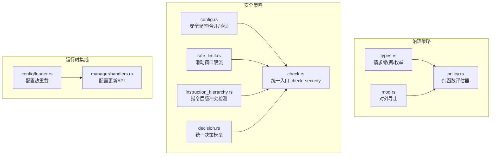
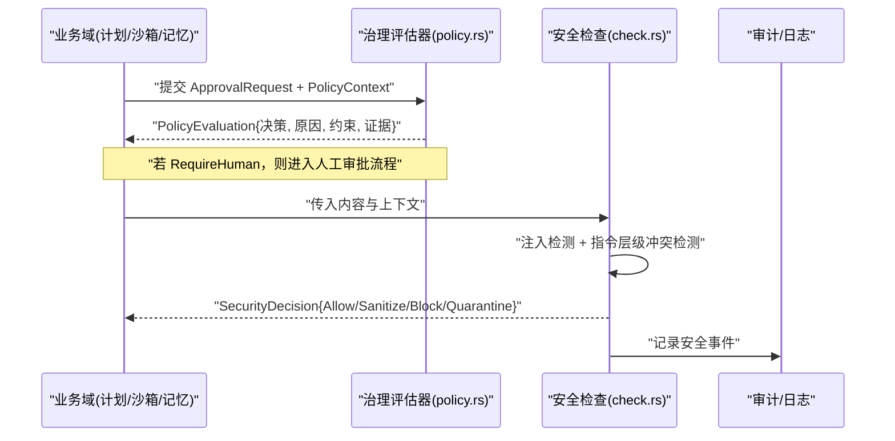
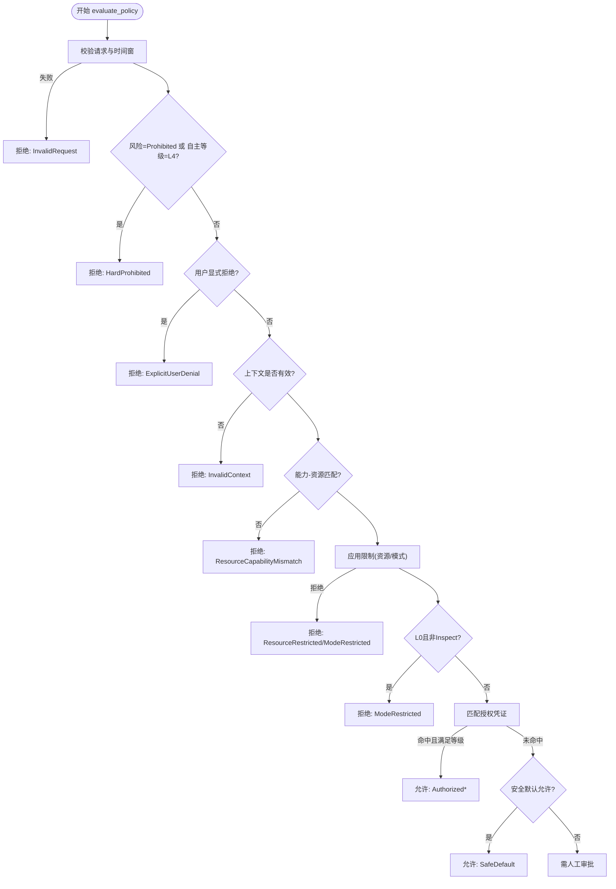
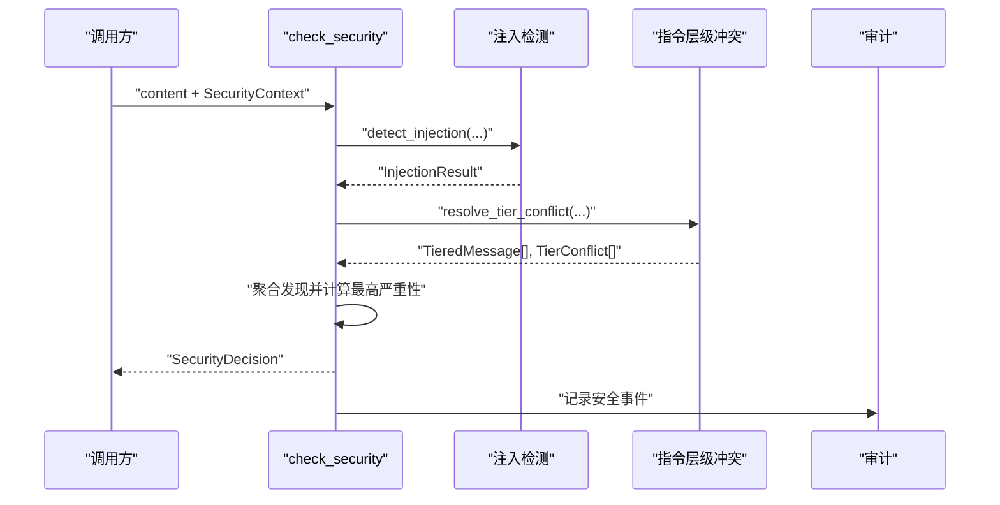
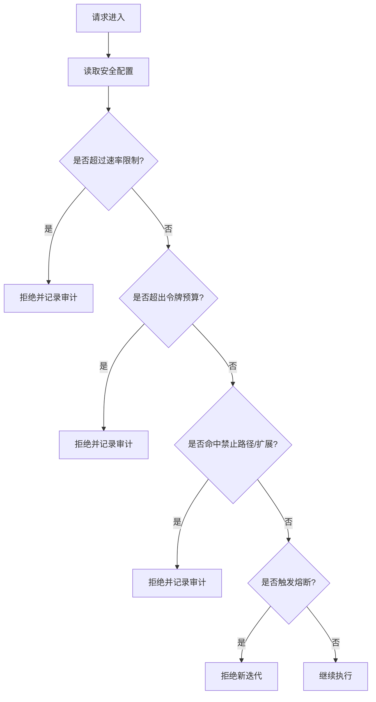
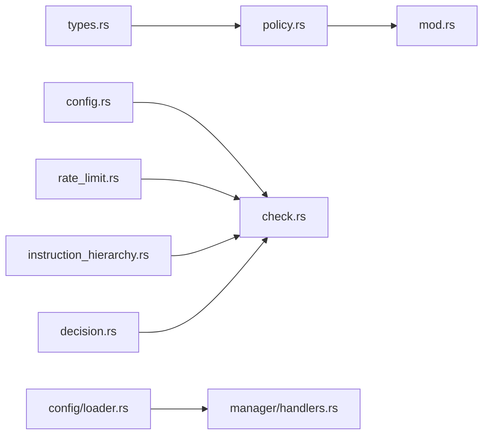

# 策略系统

<cite>
**本文引用的文件**
- [agent-diva-core/src/governance/policy.rs](file://agent-diva-core/src/governance/policy.rs)
- [agent-diva-core/src/governance/types.rs](file://agent-diva-core/src/governance/types.rs)
- [agent-diva-core/src/governance/mod.rs](file://agent-diva-core/src/governance/mod.rs)
- [agent-diva-core/src/security/config.rs](file://agent-diva-core/src/security/config.rs)
- [agent-diva-core/src/security/rate_limit.rs](file://agent-diva-core/src/security/rate_limit.rs)
- [agent-diva-core/src/security/check.rs](file://agent-diva-core/src/security/check.rs)
- [agent-diva-core/src/security/decision.rs](file://agent-diva-core/src/security/decision.rs)
- [agent-diva-core/src/security/instruction_hierarchy.rs](file://agent-diva-core/src/security/instruction_hierarchy.rs)
- [agent-diva-core/src/config/loader.rs](file://agent-diva-core/src/config/loader.rs)
- [agent-diva-manager/src/handlers.rs](file://agent-diva-manager/src/handlers.rs)
- [docs/dev/archive(old-docs-dont-read-me)/2026-08-docs-corpus-reset/architecture/legacy/governance-policy-evaluator.md](file://docs/dev/archive(old-docs-dont-read-me)/2026-08-docs-corpus-reset/architecture/legacy/governance-policy-evaluator.md)
</cite>

## 目录
1. [简介](#简介)
2. [项目结构](#项目结构)
3. [核心组件](#核心组件)
4. [架构总览](#架构总览)
5. [详细组件分析](#详细组件分析)
6. [依赖关系分析](#依赖关系分析)
7. [性能考虑](#性能考虑)
8. [故障排查指南](#故障排查指南)
9. [结论](#结论)
10. [附录](#附录)

## 简介
本文件面向策略系统的定义、加载与执行机制，覆盖权限检查（基于角色与属性的访问控制）、行为约束（速率限制、资源配额、操作白名单）、策略冲突检测与解决、动态更新与版本管理、调试与测试方法，以及性能优化与安全最佳实践。策略系统由“治理策略评估器”和“安全策略检查器”两部分组成：前者负责跨域的可审计决策（允许/拒绝/需人工审批），后者负责内容级安全检查（注入检测、指令层级冲突等）并输出统一的安全决策。

## 项目结构
策略系统主要分布在 agent-diva-core 的 governance 与 security 两个子模块中，并通过 manager 层提供配置热更新的入口。

图表来源
- [agent-diva-core/src/governance/mod.rs:1-17](file://agent-diva-core/src/governance/mod.rs#L1-L17)
- [agent-diva-core/src/governance/types.rs:1-203](file://agent-diva-core/src/governance/types.rs#L1-L203)
- [agent-diva-core/src/governance/policy.rs:1-205](file://agent-diva-core/src/governance/policy.rs#L1-L205)
- [agent-diva-core/src/security/config.rs:1-178](file://agent-diva-core/src/security/config.rs#L1-L178)
- [agent-diva-core/src/security/rate_limit.rs:1-100](file://agent-diva-core/src/security/rate_limit.rs#L1-L100)
- [agent-diva-core/src/security/check.rs:1-117](file://agent-diva-core/src/security/check.rs#L1-L117)
- [agent-diva-core/src/security/decision.rs:1-76](file://agent-diva-core/src/security/decision.rs#L1-L76)
- [agent-diva-core/src/security/instruction_hierarchy.rs:1-103](file://agent-diva-core/src/security/instruction_hierarchy.rs#L1-L103)
- [agent-diva-core/src/config/loader.rs:945-1203](file://agent-diva-core/src/config/loader.rs#L945-L1203)
- [agent-diva-manager/src/handlers.rs:689-729](file://agent-diva-manager/src/handlers.rs#L689-L729)

章节来源
- [agent-diva-core/src/governance/mod.rs:1-17](file://agent-diva-core/src/governance/mod.rs#L1-L17)
- [agent-diva-core/src/security/config.rs:1-178](file://agent-diva-core/src/security/config.rs#L1-L178)

## 核心组件
- 治理策略评估器：无副作用、确定性、可审计的策略评估，输入为领域无关的请求与上下文，输出包含决策、原因码、约束与证据引用。
- 安全策略检查器：对内容进行注入检测与指令层级冲突检测，输出统一的 SecurityDecision（允许/清洗/阻断/隔离）。
- 行为约束：基于配置的速率限制、资源配额（令牌预算）、熔断保护；支持按工作区/用户级别覆盖。
- 配置与热重载：从多源加载安全配置，支持热重载字段分类与回调通知。

章节来源
- [agent-diva-core/src/governance/policy.rs:98-205](file://agent-diva-core/src/governance/policy.rs#L98-L205)
- [agent-diva-core/src/security/check.rs:15-117](file://agent-diva-core/src/security/check.rs#L15-L117)
- [agent-diva-core/src/security/config.rs:181-325](file://agent-diva-core/src/security/config.rs#L181-L325)
- [agent-diva-core/src/config/loader.rs:945-1203](file://agent-diva-core/src/config/loader.rs#L945-L1203)

## 架构总览
策略系统采用“治理+安全”双轨制：
- 治理轨道：Plan/Sandbox/Memory 等域生成 ApprovalRequest，携带能力、资源、风险等级、内容摘要与证据引用；PolicyContext 提供自主等级、用户显式决策、限制与授权凭证；evaluate_policy 返回 PolicyEvaluation。
- 安全轨道：check_security 串联注入检测与指令层级冲突检测，结合安全配置与安全发现，输出统一决策。

图表来源
- [agent-diva-core/src/governance/policy.rs:98-205](file://agent-diva-core/src/governance/policy.rs#L98-L205)
- [agent-diva-core/src/security/check.rs:15-117](file://agent-diva-core/src/security/check.rs#L15-L117)

## 详细组件分析

### 治理策略评估器（RBAC/ABAC 融合）
- 能力-资源矩阵：将 Capability 与 ResourceKind 进行严格匹配，未知或非法组合直接拒绝。
- 自主等级约束：L0/L1/L2/L3/L4 对应不同的默认允许范围与授权要求；Critical 风险必须一次性批准。
- 优先级规则：硬禁止 > 用户明确拒绝 > 上下文无效/限制不通过 > 有效授权 > 安全默认 > 需要人工审批。
- 授权凭证校验：Once/Session/Rule 三种授权粒度，分别绑定请求、会话或规则内容摘要；过期、篡改、未知值均失败关闭。
- 结果可审计：附带约束（资源、策略版本、有效期、会话/请求ID）与证据引用。

图表来源
- [agent-diva-core/src/governance/policy.rs:98-205](file://agent-diva-core/src/governance/policy.rs#L98-L205)
- [agent-diva-core/src/governance/types.rs:27-83](file://agent-diva-core/src/governance/types.rs#L27-L83)

章节来源
- [agent-diva-core/src/governance/policy.rs:98-205](file://agent-diva-core/src/governance/policy.rs#L98-L205)
- [agent-diva-core/src/governance/types.rs:121-161](file://agent-diva-core/src/governance/types.rs#L121-L161)
- [docs/dev/archive(old-docs-dont-read-me)/2026-08-docs-corpus-reset/architecture/legacy/governance-policy-evaluator.md:14-63](file://docs/dev/archive(old-docs-dont-read-me)/2026-08-docs-corpus-reset/architecture/legacy/governance-policy-evaluator.md#L14-L63)

### 安全策略检查器（注入与指令层级）
- 注入检测：识别越狱、角色覆盖、工具输出注入等，按严重性标记。
- 指令层级冲突：将消息分为 System/User/Tool 三级，检测低层级尝试覆盖高层级的模式，必要时升级至注入子系统。
- 统一决策：根据发现集合决定 Allow/Sanitize/Block/Quarantine，并输出审计事件。

图表来源
- [agent-diva-core/src/security/check.rs:15-117](file://agent-diva-core/src/security/check.rs#L15-L117)
- [agent-diva-core/src/security/instruction_hierarchy.rs:201-267](file://agent-diva-core/src/security/instruction_hierarchy.rs#L201-L267)

章节来源
- [agent-diva-core/src/security/check.rs:15-117](file://agent-diva-core/src/security/check.rs#L15-L117)
- [agent-diva-core/src/security/instruction_hierarchy.rs:109-267](file://agent-diva-core/src/security/instruction_hierarchy.rs#L109-L267)
- [agent-diva-core/src/security/decision.rs:12-76](file://agent-diva-core/src/security/decision.rs#L12-L76)

### 行为约束：速率限制、资源配额、操作白名单
- 速率限制：ActionTracker 使用滑动窗口统计动作次数，支持 try_record 快速失败与 is_rate_limited 查询。
- 资源配额：SecurityConfig 支持 token_budget_limit 与 per_task_token_budget，用于会话/任务级令牌预算控制。
- 操作白名单：forbidden_paths、forbidden_extensions、allowed_roots、workspace_only 等字段构成路径与扩展名白/黑名单。
- 熔断保护：rejection_circuit_window_secs 与 rejection_circuit_threshold 在短窗口内累计提供者拒绝次数，触发熔断以阻止死循环。

图表来源
- [agent-diva-core/src/security/rate_limit.rs:1-100](file://agent-diva-core/src/security/rate_limit.rs#L1-L100)
- [agent-diva-core/src/security/config.rs:51-178](file://agent-diva-core/src/security/config.rs#L51-L178)

章节来源
- [agent-diva-core/src/security/rate_limit.rs:1-100](file://agent-diva-core/src/security/rate_limit.rs#L1-L100)
- [agent-diva-core/src/security/config.rs:51-178](file://agent-diva-core/src/security/config.rs#L51-L178)

### 策略冲突检测与解决
- 治理层面：固定优先级顺序，未知值失败关闭；能力-资源矩阵外全部拒绝；Critical 风险强制一次性批准。
- 安全层面：指令层级冲突检测，工具层级尝试覆盖时升级为注入检测；审计记录冲突数量与严重性。
- 协商机制：当策略结果为 RequireHuman 时，交由上层审批流程处理；授权凭证（Once/Session/Rule）作为协商结果持久化。

章节来源
- [agent-diva-core/src/governance/policy.rs:98-205](file://agent-diva-core/src/governance/policy.rs#L98-L205)
- [agent-diva-core/src/security/instruction_hierarchy.rs:201-267](file://agent-diva-core/src/security/instruction_hierarchy.rs#L201-L267)
- [agent-diva-core/src/governance/types.rs:137-161](file://agent-diva-core/src/governance/types.rs#L137-L161)

### 动态更新与版本管理（热重载与回滚）
- 配置加载：SecurityConfig 支持从工作区与家目录的多源 JSON 合并，提供 validate/merge/from_level 等方法。
- 热重载：config/loader.rs 支持热重载字段分类与回调，可在运行时无重启生效部分配置变更。
- 版本管理：治理请求携带 policy_version，授权凭证绑定策略版本，确保策略变更后的向后兼容与可追溯。
- 回滚：通过重新加载旧配置或撤销授权实现回滚；GUI/Manager 层可通过 API 触发配置更新。

章节来源
- [agent-diva-core/src/security/config.rs:181-325](file://agent-diva-core/src/security/config.rs#L181-L325)
- [agent-diva-core/src/config/loader.rs:945-1203](file://agent-diva-core/src/config/loader.rs#L945-L1203)
- [agent-diva-manager/src/handlers.rs:689-729](file://agent-diva-manager/src/handlers.rs#L689-L729)
- [agent-diva-core/src/governance/types.rs:121-161](file://agent-diva-core/src/governance/types.rs#L121-L161)

### 调试与测试工具
- 单元测试：governance 与 security 模块均提供丰富单测，覆盖优先级、矩阵、授权校验、冲突检测、配置合并等。
- 模拟执行：可使用 test 中的 request/context/receipt 构造器构建典型场景，断言 evaluate_policy 的结果与序列化契约稳定。
- 效果验证：通过 SecurityDecision 的 findings 与审计事件确认注入与冲突检测结果；通过 ActionTracker 的 count/try_record 验证限流行为。

章节来源
- [agent-diva-core/src/governance/policy.rs:362-678](file://agent-diva-core/src/governance/policy.rs#L362-L678)
- [agent-diva-core/src/security/instruction_hierarchy.rs:273-594](file://agent-diva-core/src/security/instruction_hierarchy.rs#L273-L594)
- [agent-diva-core/src/security/rate_limit.rs:102-181](file://agent-diva-core/src/security/rate_limit.rs#L102-L181)
- [agent-diva-core/src/security/config.rs:327-472](file://agent-diva-core/src/security/config.rs#L327-L472)

## 依赖关系分析
- 治理模块依赖类型定义（types.rs）与策略评估（policy.rs），对外通过 mod.rs 暴露。
- 安全模块内部相互依赖：check.rs 组合 injection 与 instruction_hierarchy，统一决策 decision.rs，配置 config.rs 驱动行为。
- 运行时集成：config/loader.rs 提供热重载能力，manager/handlers.rs 提供配置更新接口。

图表来源
- [agent-diva-core/src/governance/mod.rs:1-17](file://agent-diva-core/src/governance/mod.rs#L1-L17)
- [agent-diva-core/src/governance/types.rs:1-203](file://agent-diva-core/src/governance/types.rs#L1-L203)
- [agent-diva-core/src/governance/policy.rs:1-205](file://agent-diva-core/src/governance/policy.rs#L1-L205)
- [agent-diva-core/src/security/config.rs:1-178](file://agent-diva-core/src/security/config.rs#L1-L178)
- [agent-diva-core/src/security/rate_limit.rs:1-100](file://agent-diva-core/src/security/rate_limit.rs#L1-L100)
- [agent-diva-core/src/security/check.rs:1-117](file://agent-diva-core/src/security/check.rs#L1-L117)
- [agent-diva-core/src/security/decision.rs:1-76](file://agent-diva-core/src/security/decision.rs#L1-L76)
- [agent-diva-core/src/security/instruction_hierarchy.rs:1-103](file://agent-diva-core/src/security/instruction_hierarchy.rs#L1-L103)
- [agent-diva-core/src/config/loader.rs:945-1203](file://agent-diva-core/src/config/loader.rs#L945-L1203)
- [agent-diva-manager/src/handlers.rs:689-729](file://agent-diva-manager/src/handlers.rs#L689-L729)

## 性能考虑
- 策略评估无 I/O 与可变状态，适合高频调用；建议缓存 PolicyContext 中不变部分（如自主等级、限制列表）。
- 滑动窗口限流使用 Mutex 保护的时间戳向量，建议在热点路径避免频繁 clone；必要时按会话/租户拆分实例。
- 正则冲突检测使用 OnceLock 预编译，避免重复初始化开销。
- 配置合并仅在热重载回调中执行，避免每次请求解析 JSON。

[本节为通用指导，不直接分析具体文件]

## 故障排查指南
- 策略拒绝：查看 PolicyEvaluation.reason，常见包括 HardProhibited、ExplicitUserDenial、InvalidRequest、ResourceCapabilityMismatch、InvalidAuthorization 等。
- 安全阻断：检查 SecurityDecision 的 findings，定位注入或指令层级冲突的具体模式与严重性。
- 限流触发：通过 ActionTracker.count 与 is_rate_limited 诊断是否达到阈值；调整 max_actions_per_hour 或窗口大小。
- 配置问题：使用 SecurityConfig.validate 校验配置合法性；检查 merge 优先级与工作区/家目录配置文件是否存在。
- 热重载失效：确认 loader 的热重载字段分类是否正确；观察回调是否被触发；必要时重启服务以应用重启类配置。

章节来源
- [agent-diva-core/src/governance/policy.rs:52-96](file://agent-diva-core/src/governance/policy.rs#L52-L96)
- [agent-diva-core/src/security/check.rs:92-149](file://agent-diva-core/src/security/check.rs#L92-L149)
- [agent-diva-core/src/security/rate_limit.rs:32-84](file://agent-diva-core/src/security/rate_limit.rs#L32-L84)
- [agent-diva-core/src/security/config.rs:249-325](file://agent-diva-core/src/security/config.rs#L249-L325)
- [agent-diva-core/src/config/loader.rs:945-1203](file://agent-diva-core/src/config/loader.rs#L945-L1203)

## 结论
策略系统通过治理与安全双轨设计，实现了强约束、可审计、可热更新的策略执行框架。治理层提供稳定的优先级与授权语义，安全层保障内容安全与指令层级不被破坏。配合速率限制、配额与熔断，系统在可用性、安全性与可运维性之间取得平衡。建议在生产环境中结合审计日志与监控指标持续优化策略与配置。

[本节为总结，不直接分析具体文件]

## 附录
- 术语
  - 治理策略：跨域的决策评估，输出允许/拒绝/需人工审批。
  - 安全策略：内容级检查，输出允许/清洗/阻断/隔离。
  - 授权凭证：一次性、会话级、规则级三种粒度的批准记录。
  - 指令层级：System > User > Tool，防止低层级覆盖高层级。
- 参考
  - 治理评估器设计与优先级说明见历史文档。
  - 配置热重载与字段分类见 loader 测试用例。

[本节为补充信息，不直接分析具体文件]