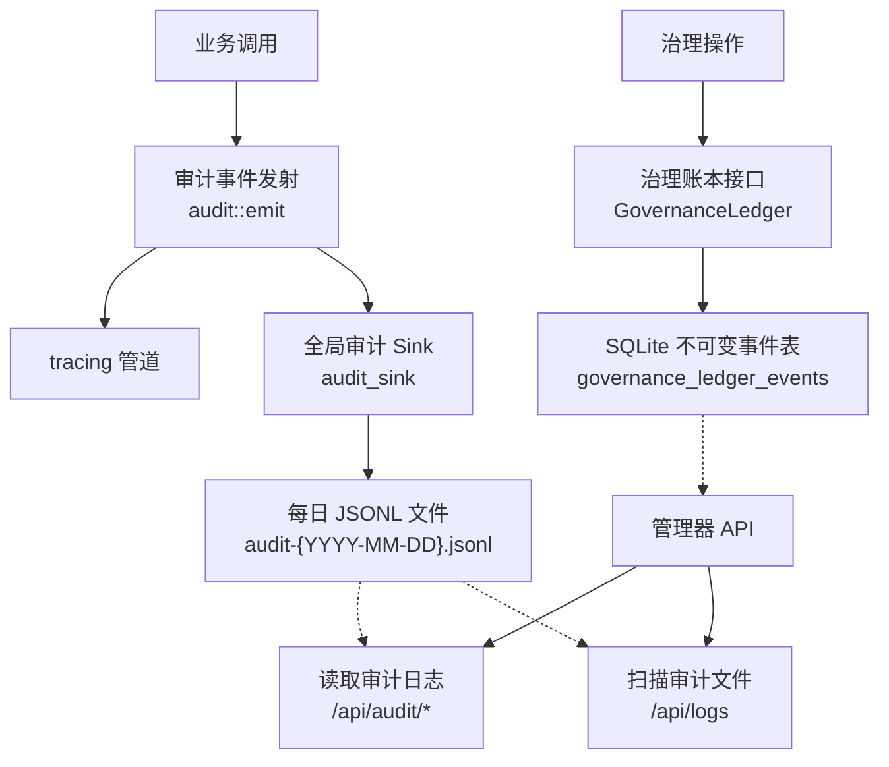
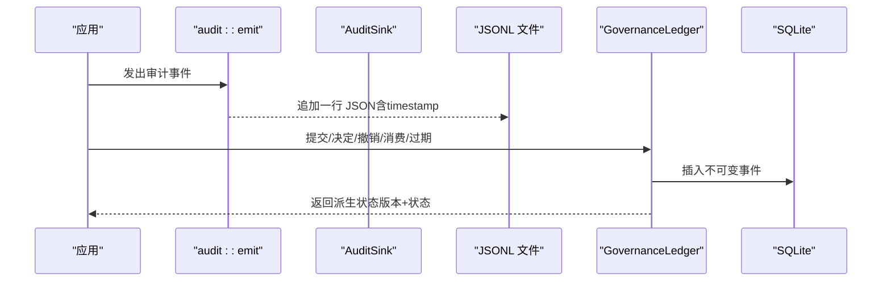
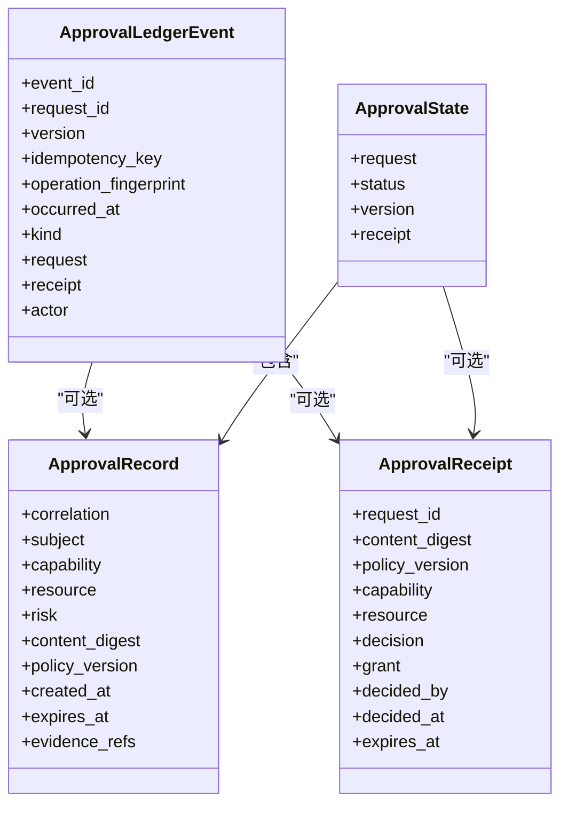
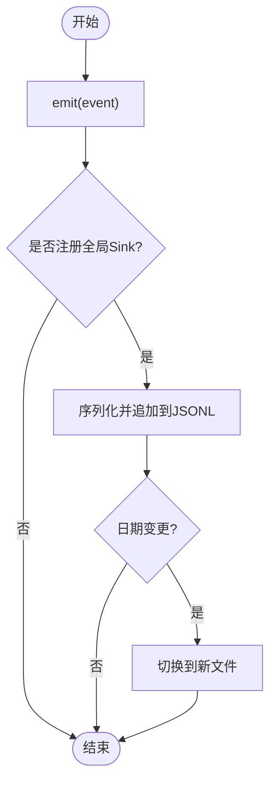
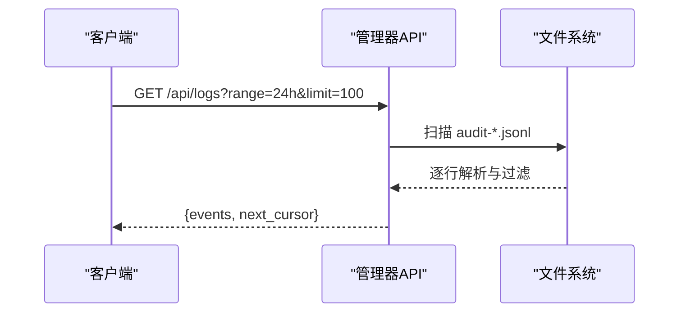
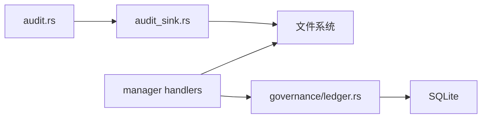

# 账本审计系统

<cite>
**本文引用的文件**
- [audit.rs](file://agent-diva-core/src/audit.rs)
- [audit_sink.rs](file://agent-diva-core/src/audit_sink.rs)
- [ledger.rs](file://agent-diva-core/src/governance/ledger.rs)
- [types.rs](file://agent-diva-core/src/governance/types.rs)
- [audit.rs（管理器API）](file://agent-diva-manager/src/handlers/audit.rs)
- [logs.rs（日志查询）](file://agent-diva-manager/src/handlers/logs.rs)
- [security/mod.rs](file://agent-diva-core/src/security/mod.rs)
</cite>

## 目录
1. [简介](#简介)
2. [项目结构](#项目结构)
3. [核心组件](#核心组件)
4. [架构总览](#架构总览)
5. [详细组件分析](#详细组件分析)
6. [依赖关系分析](#依赖关系分析)
7. [性能考量](#性能考量)
8. [故障排查指南](#故障排查指南)
9. [结论](#结论)
10. [附录](#附录)

## 简介
本文件面向“账本审计系统”，围绕以下目标展开：
- 账本的存储结构与数据模型：决策记录、时间戳与签名验证。
- 审计日志的生成机制：事件捕获、格式化存储与索引优化。
- 账本的查询与分析：时间范围查询、条件过滤与统计报告。
- 安全保护机制：防篡改验证、加密存储与访问控制。
- 备份与恢复策略：增量备份与灾难恢复。
- 监控与告警：异常检测、性能监控与容量规划。
- 性能优化与数据清理最佳实践。

该系统由两部分组成：
- 可追加不可变治理账本（SQLite + JSON 事件），用于授权审批流的状态机与回放。
- 结构化审计日志（JSONL 按日滚动），用于全量事件追踪与检索。

## 项目结构
- 核心库（agent-diva-core）
  - 审计事件定义与发射：audit.rs
  - 审计事件落盘与轮转：audit_sink.rs
  - 治理账本（审批流状态机与回放）：governance/ledger.rs、governance/types.rs
  - 安全模块（路径校验、注入检测、PII 脱敏等）：security/mod.rs
- 管理器 API（agent-diva-manager）
  - 审计日志 HTTP 接口（原始行与解析事件）：handlers/audit.rs
  - 审计日志扫描与分页查询：handlers/logs.rs

图表来源
- [audit.rs:224-253](file://agent-diva-core/src/audit.rs#L224-L253)
- [audit_sink.rs:145-258](file://agent-diva-core/src/audit_sink.rs#L145-L258)
- [ledger.rs:314-482](file://agent-diva-core/src/governance/ledger.rs#L314-L482)
- [audit.rs（管理器API）:131-185](file://agent-diva-manager/src/handlers/audit.rs#L131-L185)
- [logs.rs:115-200](file://agent-diva-manager/src/handlers/logs.rs#L115-L200)

章节来源
- [audit.rs:224-253](file://agent-diva-core/src/audit.rs#L224-L253)
- [audit_sink.rs:145-258](file://agent-diva-core/src/audit_sink.rs#L145-L258)
- [ledger.rs:314-482](file://agent-diva-core/src/governance/ledger.rs#L314-L482)
- [audit.rs（管理器API）:131-185](file://agent-diva-manager/src/handlers/audit.rs#L131-L185)
- [logs.rs:115-200](file://agent-diva-manager/src/handlers/logs.rs#L115-L200)

## 核心组件
- 审计事件与发射
  - 统一事件枚举，覆盖工具调用、注入检测、PII 脱敏、运行生命周期、技能加载、Cron、Provider 调用等。
  - emit 通过 tracing 输出并转发到全局 sink；sink 失败不中断业务。
- 审计日志存储
  - 工作区目录下 .agent-diva/audit 中按日写入 audit-{YYYY-MM-DD}.jsonl。
  - 写入时追加 timestamp 字段，支持跨进程实时可见。
- 治理账本
  - 以不可变事件形式持久化审批请求、决定、撤销、消费、过期等状态转换。
  - 通过 replay 从事件推导当前状态，提供幂等提交、版本冲突、状态机约束。
- 管理器 API
  - /api/audit/log 与 /api/audit/events：读取 gateway.log 中的审计行并解析。
  - /api/logs：扫描 audit-*.jsonl 文件，支持时间窗口、类型过滤、游标分页。

章节来源
- [audit.rs:33-222](file://agent-diva-core/src/audit.rs#L33-L222)
- [audit_sink.rs:80-258](file://agent-diva-core/src/audit_sink.rs#L80-L258)
- [ledger.rs:119-186](file://agent-diva-core/src/governance/ledger.rs#L119-L186)
- [audit.rs（管理器API）:131-185](file://agent-diva-manager/src/handlers/audit.rs#L131-L185)
- [logs.rs:19-59](file://agent-diva-manager/src/handlers/logs.rs#L19-L59)

## 架构总览
审计与治理两条线并行：
- 审计线：业务侧调用 audit::emit -> tracing -> 全局 AuditSink -> 每日 JSONL。
- 治理线：业务侧提交 ApprovalRecord -> GovernanceLedger -> SQLite 不可变事件 -> 派生状态。

图表来源
- [audit.rs:224-253](file://agent-diva-core/src/audit.rs#L224-L253)
- [audit_sink.rs:196-258](file://agent-diva-core/src/audit_sink.rs#L196-L258)
- [ledger.rs:484-795](file://agent-diva-core/src/governance/ledger.rs#L484-L795)

## 详细组件分析

### 数据模型与存储结构
- 审计事件
  - 统一枚举，包含工具调用、注入检测、PII 脱敏、运行生命周期、技能、Cron、Provider 调用等。
  - emit 将事件序列化为 JSON 并通过 tracing 输出，同时转发给全局 sink。
- 审计日志文件
  - 路径：workspace_root/.agent-diva/audit/audit-{YYYY-MM-DD}.jsonl。
  - 每行一个 JSON 对象，自动附加 timestamp 字段，按日轮转。
- 治理账本
  - 表：governance_ledger_events（event_id, request_id, version, idempotency_key, operation_fingerprint, occurred_at, event_json）。
  - 唯一约束：idempotency_key 唯一；(request_id, version) 唯一。
  - 触发器：禁止 UPDATE/DELETE，确保不可变。
  - 索引：按 (request_id, version) 加速回放。
  - 派生状态：ApprovalState（status, version, receipt）。

图表来源
- [ledger.rs:17-186](file://agent-diva-core/src/governance/ledger.rs#L17-L186)
- [types.rs:105-146](file://agent-diva-core/src/governance/types.rs#L105-L146)

章节来源
- [audit.rs:33-222](file://agent-diva-core/src/audit.rs#L33-L222)
- [audit_sink.rs:80-258](file://agent-diva-core/src/audit_sink.rs#L80-L258)
- [ledger.rs:17-186](file://agent-diva-core/src/governance/ledger.rs#L17-L186)
- [types.rs:105-146](file://agent-diva-core/src/governance/types.rs#L105-L146)

### 事件捕获、格式化存储与索引优化
- 事件捕获
  - 所有关键系统事件通过 audit::emit 统一发射，target="audit"。
  - 全局 sink 注册后，事件被追加到 JSONL 文件；sink 错误不影响主流程。
- 格式化存储
  - 每个事件追加 RFC3339 时间戳；按日轮转，便于归档与清理。
- 索引优化
  - 治理账本使用 (request_id, version) 索引，提升回放效率。
  - 日志查询支持基于时间的过滤与游标分页，减少扫描范围。

图表来源
- [audit.rs:224-253](file://agent-diva-core/src/audit.rs#L224-L253)
- [audit_sink.rs:196-258](file://agent-diva-core/src/audit_sink.rs#L196-L258)

章节来源
- [audit.rs:224-253](file://agent-diva-core/src/audit.rs#L224-L253)
- [audit_sink.rs:196-258](file://agent-diva-core/src/audit_sink.rs#L196-L258)
- [ledger.rs:320-361](file://agent-diva-core/src/governance/ledger.rs#L320-L361)
- [logs.rs:115-200](file://agent-diva-manager/src/handlers/logs.rs#L115-L200)

### 查询与分析功能
- 时间范围查询
  - /api/logs 支持 range=1h|6h|24h|7d，内部转换为 since 时间并过滤事件。
- 条件过滤
  - 支持按 event_type 过滤；对缺失 type 的事件尝试 fields.event/message。
- 统计报告
  - 可通过聚合 events 计算工具调用次数、失败率、Provider 延迟分布等。
  - 治理账本支持 states_page 与 events_page 分页回放，便于报表构建。

图表来源
- [logs.rs:19-59](file://agent-diva-manager/src/handlers/logs.rs#L19-L59)
- [logs.rs:115-200](file://agent-diva-manager/src/handlers/logs.rs#L115-L200)

章节来源
- [logs.rs:19-59](file://agent-diva-manager/src/handlers/logs.rs#L19-L59)
- [logs.rs:115-200](file://agent-diva-manager/src/handlers/logs.rs#L115-L200)
- [ledger.rs:725-795](file://agent-diva-core/src/governance/ledger.rs#L725-L795)

### 安全保护机制
- 防篡改验证
  - 治理账本通过不可变事件与唯一键约束，拒绝更新/删除；重放保证一致性。
  - 收据绑定校验：request_id、content_digest、policy_version、capability、resource 必须匹配。
- 加密存储
  - 代码未实现数据库或日志的静态加密；如需加密，应在存储层（如磁盘加密或数据库透明加密）实现。
- 访问控制
  - 管理器 API 为只读接口；建议结合网关/认证中间件限制访问。
  - 安全模块提供路径校验、注入检测、PII 脱敏、速率限制等能力。

章节来源
- [ledger.rs:320-361](file://agent-diva-core/src/governance/ledger.rs#L320-L361)
- [ledger.rs:520-574](file://agent-diva-core/src/governance/ledger.rs#L520-L574)
- [security/mod.rs:1-69](file://agent-diva-core/src/security/mod.rs#L1-L69)

### 备份与恢复策略
- 增量备份
  - 审计日志按日滚动，天然支持增量备份（仅备份新增日期文件）。
  - 治理账本基于 SQLite，可使用 WAL 模式与定期快照进行增量备份。
- 灾难恢复
  - 恢复顺序：先恢复治理账本（SQLite），再恢复审计日志（JSONL）。
  - 恢复后通过 replay 重新派生状态，确保一致性与完整性。

章节来源
- [audit_sink.rs:145-258](file://agent-diva-core/src/audit_sink.rs#L145-L258)
- [ledger.rs:320-361](file://agent-diva-core/src/governance/ledger.rs#L320-L361)

### 监控与告警配置
- 异常检测
  - 审计事件包含注入检测、消息阻断、技能隔离等安全事件，可作为告警源。
- 性能监控
  - ProviderCallCompleted、ToolExecuted 等事件可用于延迟与吞吐监控。
- 容量规划
  - 基于日志文件大小增长趋势与事件量级，规划磁盘与归档策略。

章节来源
- [audit.rs:33-222](file://agent-diva-core/src/audit.rs#L33-L222)

### 性能优化与数据清理最佳实践
- 性能优化
  - 治理账本：使用 (request_id, version) 索引；分页回放避免全表扫描。
  - 日志查询：按时间窗口与类型过滤，结合游标分页降低 IO。
- 数据清理
  - 审计日志：按保留策略归档或删除旧日期文件。
  - 治理账本：可考虑归档历史事件至冷存储，但需保持回放能力。

章节来源
- [ledger.rs:320-361](file://agent-diva-core/src/governance/ledger.rs#L320-L361)
- [logs.rs:115-200](file://agent-diva-manager/src/handlers/logs.rs#L115-L200)

## 依赖关系分析
- 审计模块依赖 tracing 与 serde，sink 依赖文件系统与时间抽象。
- 治理账本依赖 sqlx、chrono、uuid，并通过触发器与索引保障不可变与高效回放。
- 管理器 API 依赖 axum、serde_json，读取日志文件并解析事件。

图表来源
- [audit.rs:224-253](file://agent-diva-core/src/audit.rs#L224-L253)
- [audit_sink.rs:145-258](file://agent-diva-core/src/audit_sink.rs#L145-L258)
- [ledger.rs:314-482](file://agent-diva-core/src/governance/ledger.rs#L314-L482)
- [audit.rs（管理器API）:131-185](file://agent-diva-manager/src/handlers/audit.rs#L131-L185)
- [logs.rs:115-200](file://agent-diva-manager/src/handlers/logs.rs#L115-L200)

章节来源
- [audit.rs:224-253](file://agent-diva-core/src/audit.rs#L224-L253)
- [audit_sink.rs:145-258](file://agent-diva-core/src/audit_sink.rs#L145-L258)
- [ledger.rs:314-482](file://agent-diva-core/src/governance/ledger.rs#L314-L482)
- [audit.rs（管理器API）:131-185](file://agent-diva-manager/src/handlers/audit.rs#L131-L185)
- [logs.rs:115-200](file://agent-diva-manager/src/handlers/logs.rs#L115-L200)

## 性能考量
- 审计事件发射应控制在亚毫秒级，sink 失败不阻塞主流程。
- 治理账本回放通过索引与分页优化，避免全量扫描。
- 日志查询使用游标与时间窗口，减少不必要的数据传输。

[本节为通用指导，无需特定文件引用]

## 故障排查指南
- 审计日志为空
  - 检查 sink 是否注册成功；确认工作区目录权限与磁盘空间。
- 治理账本状态不一致
  - 检查事件是否完整；通过 events_page 回放核对状态机转换。
- API 查询超时
  - 调整 limit 与 range；检查日志文件数量与大小。

章节来源
- [audit_sink.rs:145-258](file://agent-diva-core/src/audit_sink.rs#L145-L258)
- [ledger.rs:440-482](file://agent-diva-core/src/governance/ledger.rs#L440-L482)
- [logs.rs:115-200](file://agent-diva-manager/src/handlers/logs.rs#L115-L200)

## 结论
该账本审计系统通过“不可变治理账本 + 结构化审计日志”的双轨设计，实现了高可靠的状态机与全量事件追踪。审计日志按日滚动便于归档与清理，治理账本通过索引与回放保障一致性与可审计性。建议在存储层增加加密与访问控制，并结合监控告警实现闭环运维。

[本节为总结，无需特定文件引用]

## 附录
- 关键接口
  - /api/audit/log：获取指定日期的原始审计行。
  - /api/audit/events：获取指定日期的解析事件。
  - /api/logs：扫描审计文件，支持时间窗口、类型过滤与游标分页。
- 最佳实践
  - 启用 WAL 模式的 SQLite 以提升并发与恢复速度。
  - 定期归档旧审计日志，保留必要的时间窗口。
  - 在网关层对审计 API 实施认证与限流。

[本节为补充信息，无需特定文件引用]