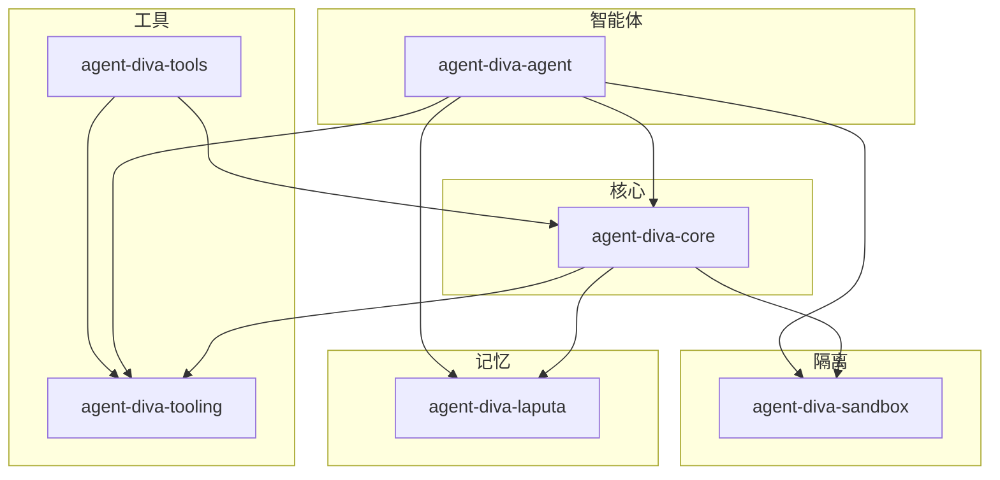
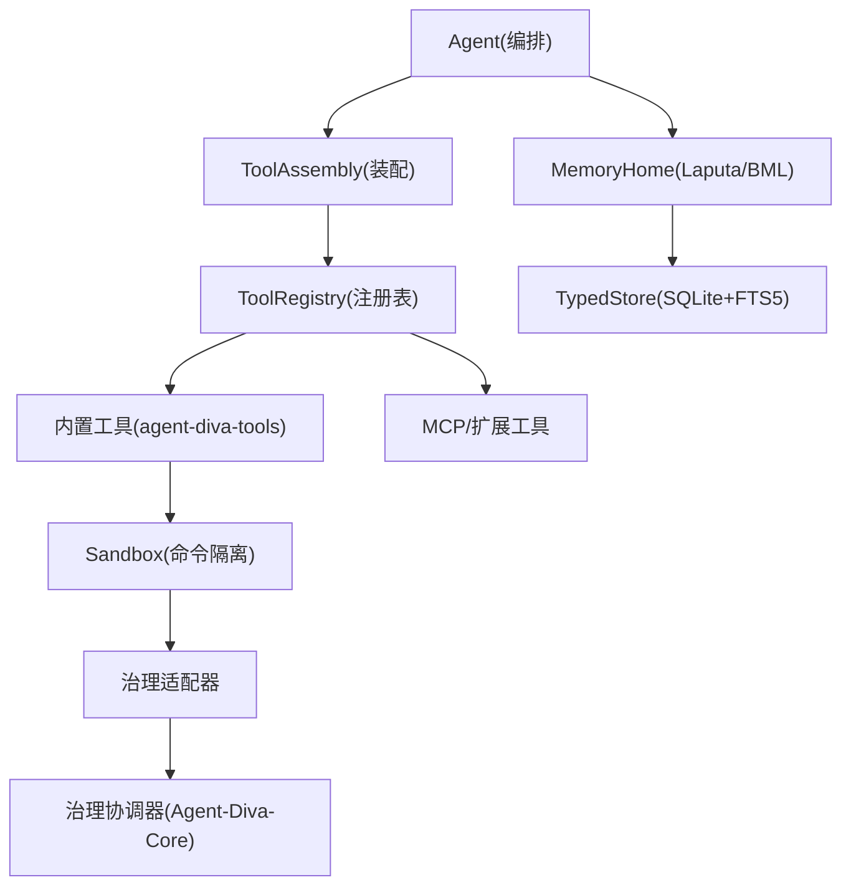
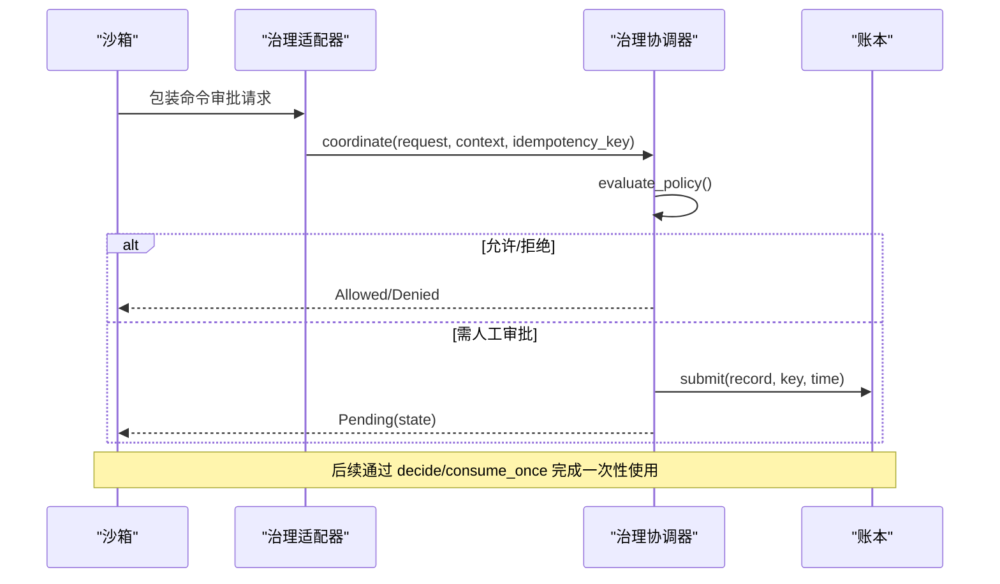
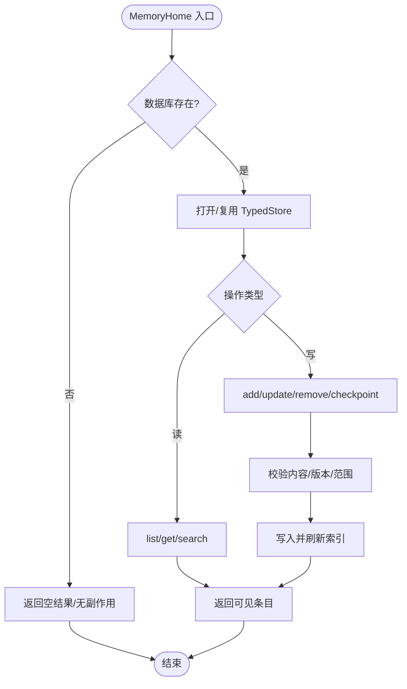
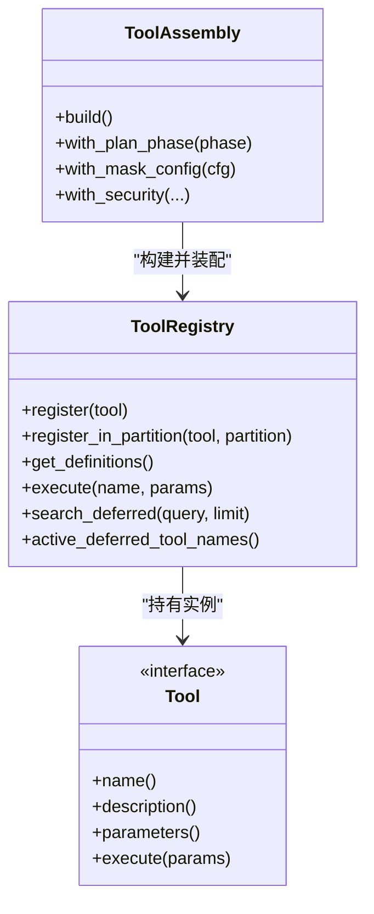
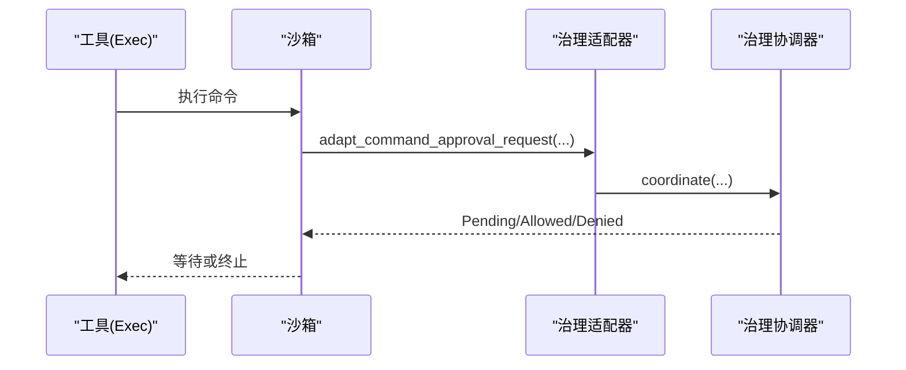
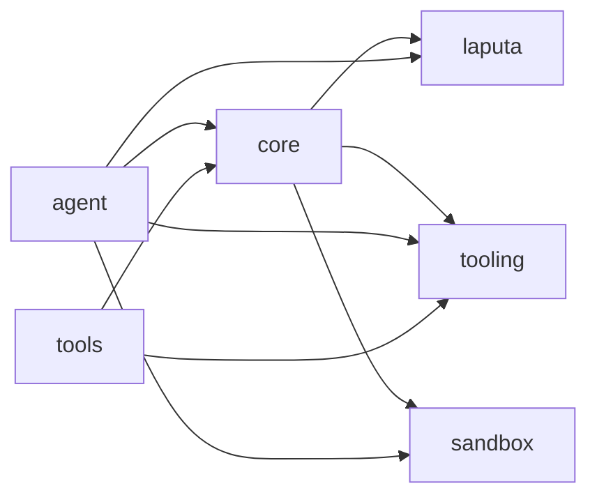

# 组件边界

<cite>
**本文引用的文件**
- [Cargo.toml](file://Cargo.toml)
- [agent-diva-core/src/lib.rs](file://agent-diva-core/src/lib.rs)
- [agent-diva-core/src/governance/mod.rs](file://agent-diva-core/src/governance/mod.rs)
- [agent-diva-core/src/governance/coordinator.rs](file://agent-diva-core/src/governance/coordinator.rs)
- [agent-diva-laputa/src/lib.rs](file://agent-diva-laputa/src/lib.rs)
- [agent-diva-laputa/src/bml/mod.rs](file://agent-diva-laputa/src/bml/mod.rs)
- [agent-diva-laputa/src/bml/memory_home.rs](file://agent-diva-laputa/src/bml/memory_home.rs)
- [agent-diva-agent/src/lib.rs](file://agent-diva-agent/src/lib.rs)
- [agent-diva-agent/src/memory_boundary.rs](file://agent-diva-agent/src/memory_boundary.rs)
- [agent-diva-agent/src/tool_assembly.rs](file://agent-diva-agent/src/tool_assembly.rs)
- [agent-diva-tooling/src/lib.rs](file://agent-diva-tooling/src/lib.rs)
- [agent-diva-tooling/src/registry.rs](file://agent-diva-tooling/src/registry.rs)
- [agent-diva-tools/src/lib.rs](file://agent-diva-tools/src/lib.rs)
- [agent-diva-tools/src/registry.rs](file://agent-diva-tools/src/registry.rs)
- [agent-diva-sandbox/src/lib.rs](file://agent-diva-sandbox/src/lib.rs)
- [agent-diva-sandbox/src/governance_adapter.rs](file://agent-diva-sandbox/src/governance_adapter.rs)
</cite>

## 目录
1. [简介](#简介)
2. [项目结构](#项目结构)
3. [核心组件](#核心组件)
4. [架构总览](#架构总览)
5. [详细组件分析](#详细组件分析)
6. [依赖关系分析](#依赖关系分析)
7. [性能与隔离特性](#性能与隔离特性)
8. [故障排查指南](#故障排查指南)
9. [结论](#结论)
10. [附录：边界协议与契约](#附录边界协议与契约)

## 简介
本文件聚焦 agent-diva 工作区的“组件边界”主题，系统说明各 crate 与模块的职责边界、依赖关系、治理层协调机制、Laputa 记忆层与 BML 存储层的交互方式，以及工具的注册、发现与安全可插拔机制。同时给出组件依赖图与关键边界协议定义，并总结边界违反的检测与防护策略。

## 项目结构
工作区由多个相互协作的 Rust crate 组成，核心分层如下：
- 核心能力与公共契约：agent-diva-core（治理、安全、会话、计划、审计等）
- 记忆权威与持久化：agent-diva-laputa（BML、Actmem、Persona、TypedStore）
- 智能体编排与装配：agent-diva-agent（循环、上下文、工具装配、规划）
- 工具基座与实现：agent-diva-tooling（工具接口、注册表）、agent-diva-tools（内置工具集）
- 执行隔离与审批：agent-diva-sandbox（命令沙箱、审批适配）
- 其他支撑：CLI、GUI、Manager、Provider、Channels、Files、Neuron、E2E、Service、Migration 等

**图表来源**
- [Cargo.toml:1-20](file://Cargo.toml#L1-L20)
- [agent-diva-core/src/lib.rs:6-38](file://agent-diva-core/src/lib.rs#L6-L38)
- [agent-diva-laputa/src/lib.rs:10-21](file://agent-diva-laputa/src/lib.rs#L10-L21)
- [agent-diva-agent/src/lib.rs:5-22](file://agent-diva-agent/src/lib.rs#L5-L22)
- [agent-diva-tooling/src/lib.rs:3-13](file://agent-diva-tooling/src/lib.rs#L3-L13)
- [agent-diva-tools/src/lib.rs:5-34](file://agent-diva-tools/src/lib.rs#L5-L34)
- [agent-diva-sandbox/src/lib.rs:27-54](file://agent-diva-sandbox/src/lib.rs#L27-L54)

**章节来源**
- [Cargo.toml:1-20](file://Cargo.toml#L1-L20)

## 核心组件
- 治理层（Governance）：提供跨域一致的审批与策略评估抽象，统一 Plan、Sandbox、Memory 等请求的协调入口，确保幂等提交与一次性消费。
- Laputa 记忆层：以 BML 为机器级权威存储，封装 TypedStore、Actmem、Persona 等能力；对外暴露 MemoryHome 作为唯一生产级写入权威。
- 工具体系：tooling 定义 Tool 接口与注册表；tools 提供内置实现；agent 通过 ToolAssembly 按配置、掩码、阶段、权限装配最终可用工具集。
- 沙箱：对命令执行进行隔离与审批，并通过适配器接入治理层。

**章节来源**
- [agent-diva-core/src/governance/mod.rs:1-16](file://agent-diva-core/src/governance/mod.rs#L1-L16)
- [agent-diva-laputa/src/bml/mod.rs:1-21](file://agent-diva-laputa/src/bml/mod.rs#L1-L21)
- [agent-diva-tooling/src/lib.rs:1-13](file://agent-diva-tooling/src/lib.rs#L1-L13)
- [agent-diva-tools/src/lib.rs:1-34](file://agent-diva-tools/src/lib.rs#L1-L34)
- [agent-diva-agent/src/tool_assembly.rs:42-68](file://agent-diva-agent/src/tool_assembly.rs#L42-L68)
- [agent-diva-sandbox/src/lib.rs:1-25](file://agent-diva-sandbox/src/lib.rs#L1-L25)

## 架构总览
下图展示高层组件职责与边界：
- Agent 通过 ToolAssembly 组装工具，受 Mask/Phase/Security 约束。
- 工具调用可能触发沙箱执行，沙箱经治理适配器进入治理协调器。
- 记忆读写统一走 Laputa MemoryHome，禁止非 BML 直接写底层存储。
- 所有跨组件决策均通过治理层进行策略评估与持久化。

**图表来源**
- [agent-diva-agent/src/tool_assembly.rs:240-616](file://agent-diva-agent/src/tool_assembly.rs#L240-L616)
- [agent-diva-tooling/src/registry.rs:363-717](file://agent-diva-tooling/src/registry.rs#L363-L717)
- [agent-diva-sandbox/src/governance_adapter.rs:29-80](file://agent-diva-sandbox/src/governance_adapter.rs#L29-L80)
- [agent-diva-core/src/governance/coordinator.rs:67-186](file://agent-diva-core/src/governance/coordinator.rs#L67-L186)
- [agent-diva-laputa/src/bml/memory_home.rs:85-177](file://agent-diva-laputa/src/bml/memory_home.rs#L85-L177)

## 详细组件分析

### 治理层（Governance）
- 职责：统一的策略评估与审批协调，支持 Allow/Deny/HumanApproval，记录不可变事件，支持幂等提交与一次性消费。
- 关键流程：coordinate 评估策略 -> 需要人工时持久化待决状态 -> decide/consume_once 完成一次性授权。
- 与沙箱集成：将旧版命令审批请求适配为治理请求，并将决策映射为治理收据。

**图表来源**
- [agent-diva-core/src/governance/coordinator.rs:73-131](file://agent-diva-core/src/governance/coordinator.rs#L73-L131)
- [agent-diva-sandbox/src/governance_adapter.rs:29-80](file://agent-diva-sandbox/src/governance_adapter.rs#L29-L80)

**章节来源**
- [agent-diva-core/src/governance/mod.rs:1-16](file://agent-diva-core/src/governance/mod.rs#L1-L16)
- [agent-diva-core/src/governance/coordinator.rs:13-186](file://agent-diva-core/src/governance/coordinator.rs#L13-L186)
- [agent-diva-sandbox/src/governance_adapter.rs:15-80](file://agent-diva-sandbox/src/governance_adapter.rs#L15-L80)

### Laputa 记忆层与 BML 存储层
- 边界规则：BML 是机器级权威存储，非 BML 模块不得直接调用原始写入 API；测试强制该边界。
- MemoryHome：封装 SQLite+FTS5 的读写、索引预热、启动 Markdown 生成、Actmem 操作、会话检查点等。
- 与 Agent 的对接：Agent 默认选择 Machine-wide MemoryHome 作为 MemoryProvider，屏蔽底层细节。

**图表来源**
- [agent-diva-laputa/src/bml/mod.rs:1-21](file://agent-diva-laputa/src/bml/mod.rs#L1-L21)
- [agent-diva-laputa/src/bml/memory_home.rs:147-177](file://agent-diva-laputa/src/bml/memory_home.rs#L147-L177)
- [agent-diva-laputa/src/bml/memory_home.rs:205-346](file://agent-diva-laputa/src/bml/memory_home.rs#L205-L346)
- [agent-diva-agent/src/memory_boundary.rs:13-16](file://agent-diva-agent/src/memory_boundary.rs#L13-L16)

**章节来源**
- [agent-diva-laputa/src/lib.rs:1-21](file://agent-diva-laputa/src/lib.rs#L1-L21)
- [agent-diva-laputa/src/bml/mod.rs:1-21](file://agent-diva-laputa/src/bml/mod.rs#L1-L21)
- [agent-diva-laputa/src/bml/memory_home.rs:85-177](file://agent-diva-laputa/src/bml/memory_home.rs#L85-L177)
- [agent-diva-agent/src/memory_boundary.rs:1-16](file://agent-diva-agent/src/memory_boundary.rs#L1-L16)

### 工具注册与发现机制
- 注册表：ToolRegistry 维护 Core 与 Deferred 两类 schema 分区；Deferred 工具通过搜索激活，限制单次激活数量。
- 装配：ToolAssembly 根据配置、掩码、计划阶段、安全策略动态注册/移除工具，保证最小权限与只读模式。
- 安全：执行前参数校验、输出清洗、超时控制、审计事件记录；未激活的 Deferred 工具执行将被拒绝。

**图表来源**
- [agent-diva-tooling/src/registry.rs:363-717](file://agent-diva-tooling/src/registry.rs#L363-L717)
- [agent-diva-agent/src/tool_assembly.rs:240-616](file://agent-diva-agent/src/tool_assembly.rs#L240-L616)
- [agent-diva-tooling/src/lib.rs:1-13](file://agent-diva-tooling/src/lib.rs#L1-L13)

**章节来源**
- [agent-diva-tooling/src/registry.rs:15-717](file://agent-diva-tooling/src/registry.rs#L15-L717)
- [agent-diva-agent/src/tool_assembly.rs:240-616](file://agent-diva-agent/src/tool_assembly.rs#L240-L616)
- [agent-diva-tools/src/lib.rs:36-74](file://agent-diva-tools/src/lib.rs#L36-L74)

### 沙箱与治理的边界
- 沙箱负责进程隔离、文件系统访问控制、命令规则与审批缓存。
- 通过治理适配器将命令审批请求转换为治理请求，使沙箱与核心治理保持一致的语义与审计。

**图表来源**
- [agent-diva-sandbox/src/lib.rs:1-25](file://agent-diva-sandbox/src/lib.rs#L1-L25)
- [agent-diva-sandbox/src/governance_adapter.rs:29-80](file://agent-diva-sandbox/src/governance_adapter.rs#L29-L80)
- [agent-diva-core/src/governance/coordinator.rs:73-131](file://agent-diva-core/src/governance/coordinator.rs#L73-L131)

**章节来源**
- [agent-diva-sandbox/src/lib.rs:27-116](file://agent-diva-sandbox/src/lib.rs#L27-L116)
- [agent-diva-sandbox/src/governance_adapter.rs:15-80](file://agent-diva-sandbox/src/governance_adapter.rs#L15-L80)

## 依赖关系分析
- 工作区成员与版本在根 Cargo.toml 中声明，确保依赖一致性与可重现构建。
- 组件间依赖方向清晰：Agent 依赖 Core/Laputa/Tooling/Sandbox；Tools 依赖 Tooling/Core；Sandbox 依赖 Core；Laputa 依赖 Core。

**图表来源**
- [Cargo.toml:1-20](file://Cargo.toml#L1-L20)
- [agent-diva-core/src/lib.rs:6-38](file://agent-diva-core/src/lib.rs#L6-L38)
- [agent-diva-laputa/src/lib.rs:10-21](file://agent-diva-laputa/src/lib.rs#L10-L21)
- [agent-diva-agent/src/lib.rs:5-22](file://agent-diva-agent/src/lib.rs#L5-L22)
- [agent-diva-tooling/src/lib.rs:3-13](file://agent-diva-tooling/src/lib.rs#L3-L13)
- [agent-diva-tools/src/lib.rs:5-34](file://agent-diva-tools/src/lib.rs#L5-L34)
- [agent-diva-sandbox/src/lib.rs:27-54](file://agent-diva-sandbox/src/lib.rs#L27-L54)

**章节来源**
- [Cargo.toml:1-20](file://Cargo.toml#L1-L20)

## 性能与隔离特性
- 工具注册表：Core/Deferred 分区稳定 schema 前缀，减少缓存抖动；Deferred 激活有上限，避免过大工具列表。
- 记忆层：Lazy 打开 TypedStore，预热 L1 索引，批量刷新启动 Markdown，降低冷启动开销。
- 沙箱：可选关闭开关与环境变量控制，便于调试；平台级隔离能力分阶段演进。
- 治理：幂等提交与一次性消费，避免重复审批带来的额外开销。

[本节为通用指导，不直接分析具体文件]

## 故障排查指南
- 工具未找到或未激活：检查 ToolRegistry 是否已注册、是否为 Deferred 且已通过搜索激活；查看审计事件中的 status。
- 记忆写入失败：确认 MemoryHome 路径、数据库存在性、版本冲突错误码；检查内容是否为空、作用域是否正确。
- 沙箱命令被拒：检查命令规则、审批策略、治理适配器映射；确认环境是否禁用了沙箱。
- 治理状态异常：核对 request_id、idempotency_key、expected_version 与时间戳；查看事件页与过期策略。

**章节来源**
- [agent-diva-tooling/src/registry.rs:534-699](file://agent-diva-tooling/src/registry.rs#L534-L699)
- [agent-diva-laputa/src/bml/memory_home.rs:205-346](file://agent-diva-laputa/src/bml/memory_home.rs#L205-L346)
- [agent-diva-sandbox/src/lib.rs:107-116](file://agent-diva-sandbox/src/lib.rs#L107-L116)
- [agent-diva-core/src/governance/coordinator.rs:98-186](file://agent-diva-core/src/governance/coordinator.rs#L98-L186)

## 结论
本工作区通过清晰的 crate 划分与严格的边界协议，实现了：
- 治理层统一协调跨域决策，保障幂等与可审计。
- Laputa 记忆层集中管理机器级数据，屏蔽底层存储细节。
- 工具体系基于注册表与装配器实现安全、可插拔、按需激活。
- 沙箱与治理结合，确保命令执行的隔离与可控。
这些设计共同保证了多用户/多项目场景下的数据安全与行为一致性。

[本节为总结，不直接分析具体文件]

## 附录：边界协议与契约
- 记忆边界协议
  - 唯一写入权威：MemoryHome（BML），禁止非 BML 直接写底层存储。
  - 作用域与可见性：仅显示有效、未被替代的记录；会话级检查点按 session_id 隔离。
  - 变更追踪：内容摘要、修订号、墓碑标记，防止并发冲突与误删。
- 工具边界协议
  - 注册契约：Tool 接口（名称、描述、参数、执行）；注册表维护 Core/Deferred 分区。
  - 激活契约：Deferred 工具需通过搜索激活，且受最大激活数限制。
  - 执行契约：参数校验、输出清洗、超时控制、审计事件。
- 治理边界协议
  - 请求模型：包含主体、资源、风险等级、内容摘要、策略版本、证据引用等。
  - 决策模型：Allow/Deny/HumanApproval，支持 Once/Session/Rule 授权粒度。
  - 幂等与一次性：相同 key 重复提交返回一致结果；批准收据一次性消费。

**章节来源**
- [agent-diva-laputa/src/bml/mod.rs:1-21](file://agent-diva-laputa/src/bml/mod.rs#L1-L21)
- [agent-diva-laputa/src/bml/memory_home.rs:205-346](file://agent-diva-laputa/src/bml/memory_home.rs#L205-L346)
- [agent-diva-tooling/src/registry.rs:15-717](file://agent-diva-tooling/src/registry.rs#L15-L717)
- [agent-diva-core/src/governance/coordinator.rs:13-186](file://agent-diva-core/src/governance/coordinator.rs#L13-L186)