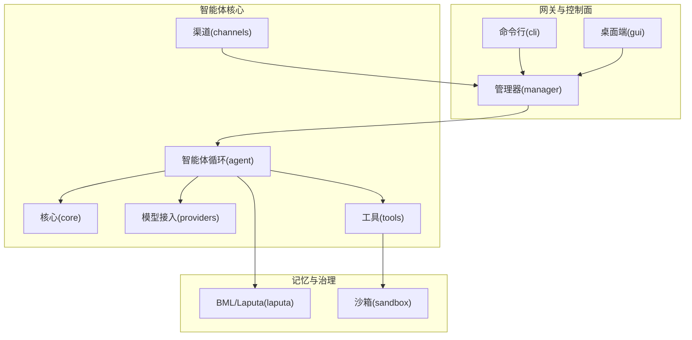
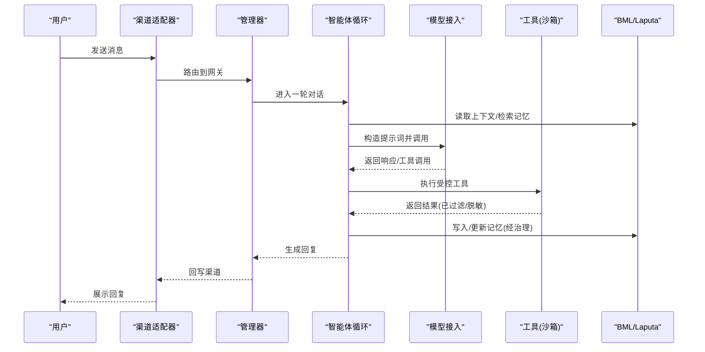
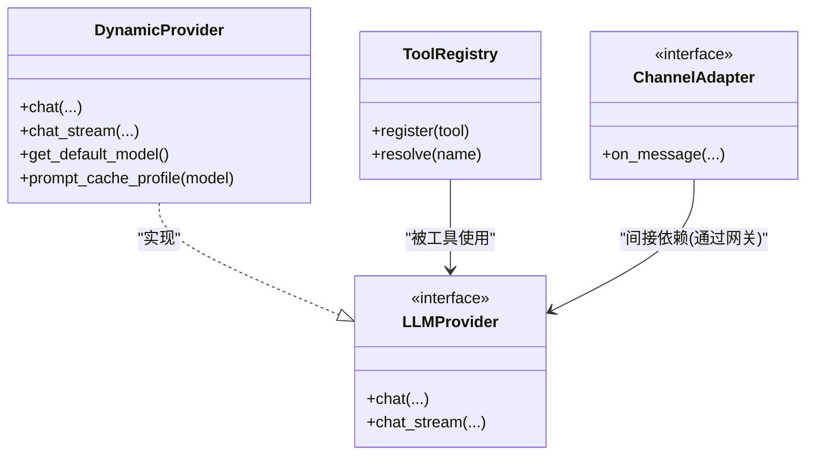
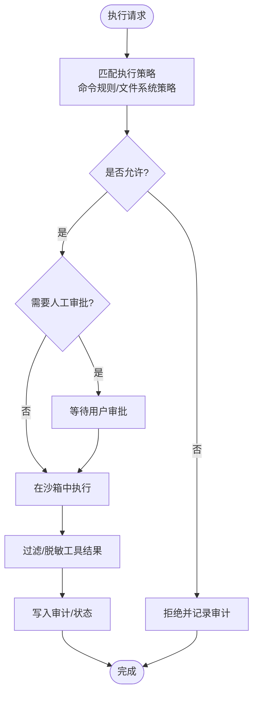
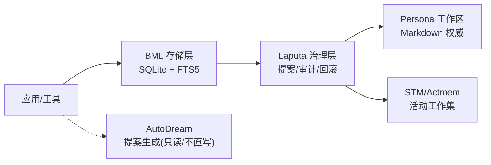
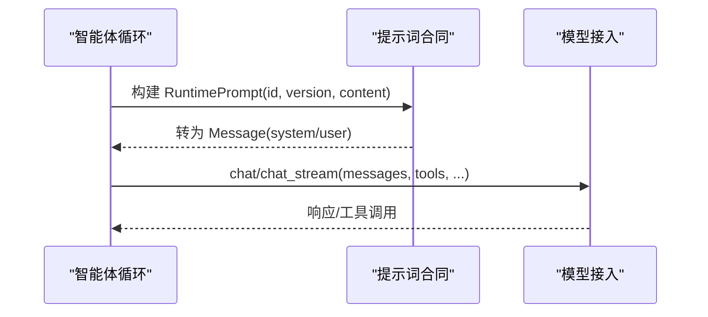
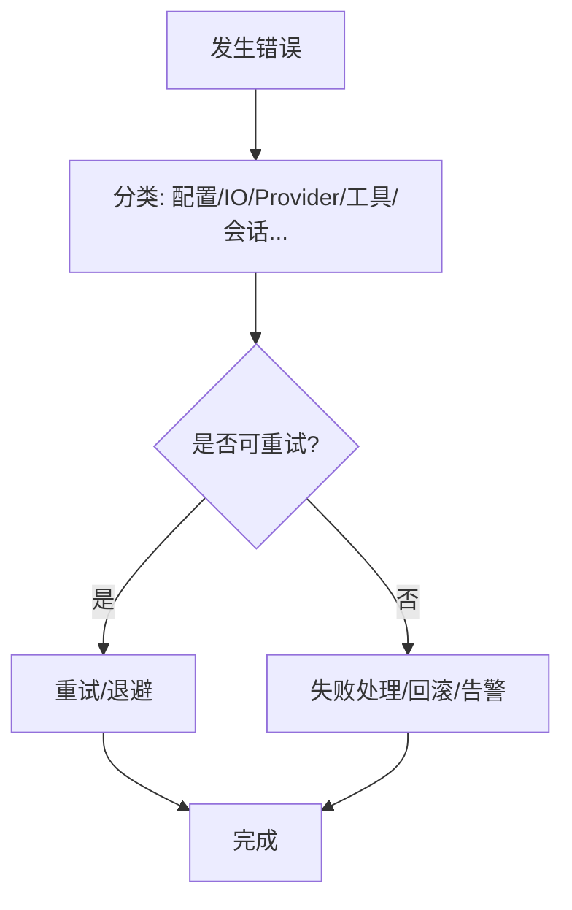
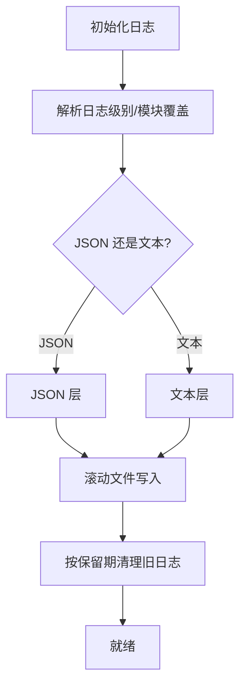
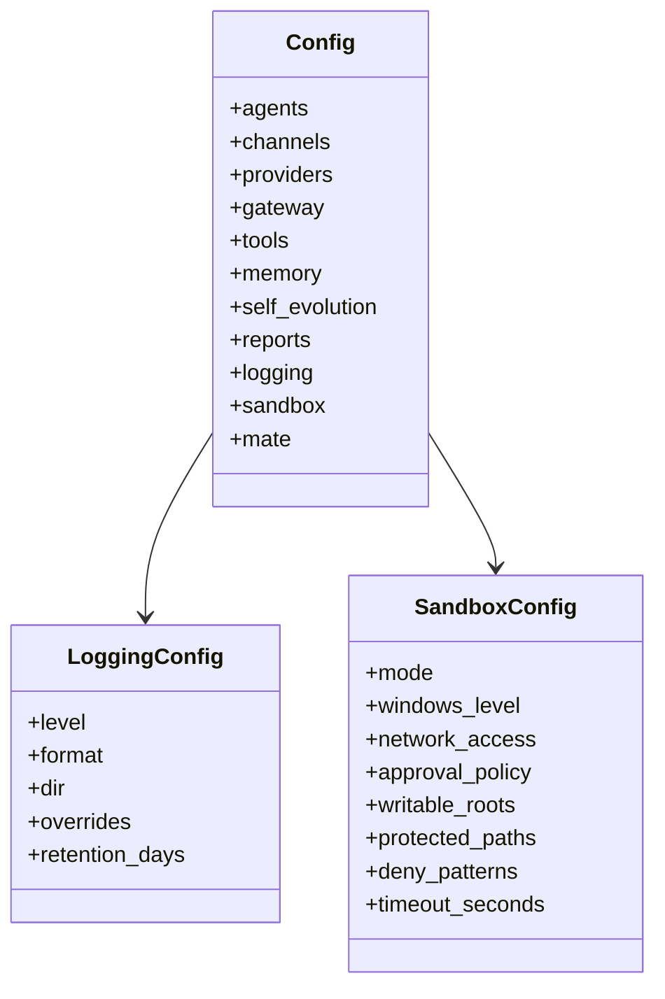
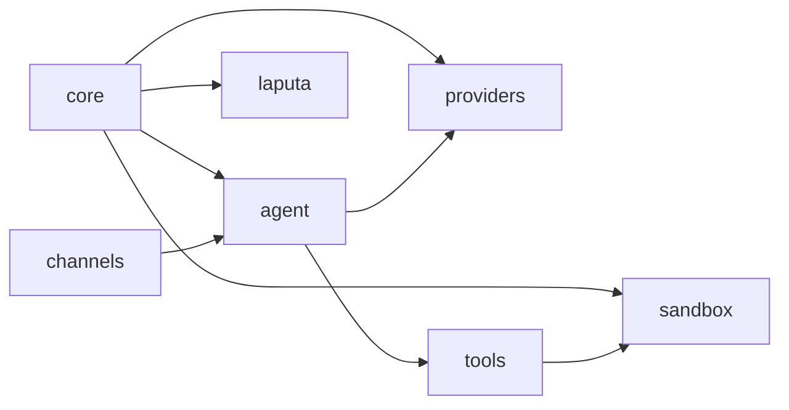

# 设计原则

<cite>
**本文引用的文件**
- [README.md](file://README.md)
- [cognitive-workspace-boundaries-2026-08.md](file://docs/architecture/current/cognitive-workspace-boundaries-2026-08.md)
- [laputa-memory-governance-history-2026-06.md](file://docs/decisions/laputa-memory-governance-history-2026-06.md)
- [security-and-threat-model-2026-07-29.md](file://docs/decisions/security-and-threat-model-2026-07-29.md)
- [agent-diva-core/src/lib.rs](file://agent-diva-core/src/lib.rs)
- [agent-diva-core/src/config/mod.rs](file://agent-diva-core/src/config/mod.rs)
- [agent-diva-core/src/config/schema.rs](file://agent-diva-core/src/config/schema.rs)
- [agent-diva-core/src/error.rs](file://agent-diva-core/src/error.rs)
- [agent-diva-core/src/logging.rs](file://agent-diva-core/src/logging.rs)
- [agent-diva-core/src/security/mod.rs](file://agent-diva-core/src/security/mod.rs)
- [agent-diva-laputa/src/lib.rs](file://agent-diva-laputa/src/lib.rs)
- [agent-diva-providers/src/lib.rs](file://agent-diva-providers/src/lib.rs)
- [agent-diva-agent/src/lib.rs](file://agent-diva-agent/src/lib.rs)
- [agent-diva-agent/src/agent_loop/turn/prompt.rs](file://agent-diva-agent/src/agent_loop/turn/prompt.rs)
- [agent-diva-sandbox/src/lib.rs](file://agent-diva-sandbox/src/lib.rs)
</cite>

## 目录
1. [引言](#引言)
2. [项目结构](#项目结构)
3. [核心组件](#核心组件)
4. [架构总览](#架构总览)
5. [详细组件分析](#详细组件分析)
6. [依赖分析](#依赖分析)
7. [性能考虑](#性能考虑)
8. [故障排查指南](#故障排查指南)
9. [结论](#结论)
10. [附录](#附录)

## 引言
本设计原则文档面向 Agent Diva 的架构与工程决策，聚焦以下主题：模块化与插件化、安全优先、可扩展性、提示词合同（Prompt Contract）、错误处理策略、日志记录规范、配置管理，以及 BML + Laputa 的记忆治理分层存储方案。目标是帮助读者理解“为什么这样设计”，并在不深入代码细节的前提下把握系统边界、职责划分与演进方向。

## 项目结构
Agent Diva 采用多 crate 工作区组织，按职责清晰拆分：
- 核心能力：配置、会话、事件总线、安全、审计、记忆、计划、报告、调度等由 core 提供。
- 智能体循环与上下文组装：agent 负责轮询、工具装配、技能加载、子代理编排。
- 模型接入：providers 抽象 LLM Provider，支持动态切换与缓存策略。
- 渠道适配：channels 对接多种聊天平台。
- 工具生态：tools 提供文件系统、Shell、Web、Cron 等内置工具。
- 记忆与人格治理：laputa 提供 BML 存储层与 Persona 治理、Frozen Core 快照。
- 沙箱执行：sandbox 提供进程隔离、命令规则、审批与守护人机制。
- 管理与界面：manager 提供本地网关与 HTTP 控制面；gui 为 Tauri+Vue 桌面应用；cli 为用户入口。
- 辅助模块：neuron、tooling、files、migration、e2e 等。

图表来源
- [README.md:43-54](file://README.md#L43-L54)
- [agent-diva-core/src/lib.rs:6-38](file://agent-diva-core/src/lib.rs#L6-L38)
- [agent-diva-agent/src/lib.rs:5-22](file://agent-diva-agent/src/lib.rs#L5-L22)
- [agent-diva-providers/src/lib.rs:21-41](file://agent-diva-providers/src/lib.rs#L21-L41)
- [agent-diva-laputa/src/lib.rs:10-21](file://agent-diva-laputa/src/lib.rs#L10-L21)
- [agent-diva-sandbox/src/lib.rs:27-54](file://agent-diva-sandbox/src/lib.rs#L27-L54)

章节来源
- [README.md:87-108](file://README.md#L87-L108)
- [agent-diva-core/src/lib.rs:6-38](file://agent-diva-core/src/lib.rs#L6-L38)

## 核心组件
- 配置管理：集中式 schema、加载器与校验器，支持环境变量覆盖、模块级覆盖、保留期清理等。
- 安全策略：路径校验、注入检测、指令层级、PII 脱敏、工具结果过滤、拒绝熔断等。
- 错误分类：统一 Error 类型与可重试/致命分类，便于上层重试与降级。
- 日志体系：结构化输出、滚动归档、模块级别过滤、保留策略。
- 提供者抽象：LLMProvider 接口、动态切换、提示词缓存策略。
- 记忆治理：BML typed SQLite/FTS5 作为长期记忆唯一权威；Laputa 在之上提供提案、治理、回滚与审计。
- 沙箱执行：进程隔离、命令规则、文件系统白名单、用户审批与守护人自动决策。

章节来源
- [agent-diva-core/src/config/mod.rs:1-12](file://agent-diva-core/src/config/mod.rs#L1-L12)
- [agent-diva-core/src/security/mod.rs:1-69](file://agent-diva-core/src/security/mod.rs#L1-L69)
- [agent-diva-core/src/error.rs:1-73](file://agent-diva-core/src/error.rs#L1-L73)
- [agent-diva-core/src/logging.rs:10-113](file://agent-diva-core/src/logging.rs#L10-L113)
- [agent-diva-providers/src/lib.rs:21-41](file://agent-diva-providers/src/lib.rs#L21-L41)
- [agent-diva-laputa/src/lib.rs:1-56](file://agent-diva-laputa/src/lib.rs#L1-L56)
- [agent-diva-sandbox/src/lib.rs:1-116](file://agent-diva-sandbox/src/lib.rs#L1-L116)

## 架构总览
Agent Diva 以“网关”为中心，将消息从多渠道汇聚到 Agent Loop，再调用 LLM Provider 与受控工具，并通过 BML/Laputa 进行持久化与治理。GUI/CLI 通过管理器暴露的控制面进行交互。

图表来源
- [README.md:43-54](file://README.md#L43-L54)
- [agent-diva-agent/src/lib.rs:5-22](file://agent-diva-agent/src/lib.rs#L5-L22)
- [agent-diva-providers/src/lib.rs:21-41](file://agent-diva-providers/src/lib.rs#L21-L41)
- [agent-diva-laputa/src/lib.rs:10-21](file://agent-diva-laputa/src/lib.rs#L10-L21)
- [agent-diva-sandbox/src/lib.rs:27-54](file://agent-diva-sandbox/src/lib.rs#L27-L54)

## 详细组件分析

### 模块化与插件化设计
- 模块边界清晰：core 提供跨领域能力；agent 专注循环与上下文；providers 屏蔽不同 LLM 差异；channels 解耦外部平台；tools 以注册表方式扩展；laputa 独立记忆与治理；sandbox 隔离执行。
- 插件点：
  - Provider 动态切换：DynamicProvider 允许运行时替换底层实现，保持调用方无感知。
  - 工具注册：工具通过 registry 发现与装配，便于新增/禁用。
  - 渠道特性开关：通过 Cargo features 启用/关闭渠道编译产物。
  - 技能市场：SKILL.md 驱动的能力加载，GUI 市场安装/卸载。

图表来源
- [agent-diva-providers/src/lib.rs:46-124](file://agent-diva-providers/src/lib.rs#L46-L124)
- [agent-diva-tools/src/registry.rs](file://agent-diva-tools/src/registry.rs)
- [agent-diva-channels/src/lib.rs](file://agent-diva-channels/src/lib.rs)

章节来源
- [agent-diva-providers/src/lib.rs:46-124](file://agent-diva-providers/src/lib.rs#L46-L124)
- [README.md:60-85](file://README.md#L60-L85)

### 安全优先与沙箱模型
- 默认拒绝未知或高风险动作；授权需绑定能力、资源、内容摘要、策略版本与生命周期。
- 沙箱提供进程隔离、文件系统访问控制、保护路径、命令规则、用户审批与守护人自动决策。
- 安全横切：路径校验、注入检测、PII 脱敏、工具结果过滤、拒绝熔断。

图表来源
- [agent-diva-sandbox/src/lib.rs:27-105](file://agent-diva-sandbox/src/lib.rs#L27-L105)
- [agent-diva-core/src/security/mod.rs:26-69](file://agent-diva-core/src/security/mod.rs#L26-L69)
- [security-and-threat-model-2026-07-29.md:7-19](file://docs/decisions/security-and-threat-model-2026-07-29.md#L7-L19)

章节来源
- [agent-diva-sandbox/src/lib.rs:1-116](file://agent-diva-sandbox/src/lib.rs#L1-L116)
- [agent-diva-core/src/security/mod.rs:1-69](file://agent-diva-core/src/security/mod.rs#L1-L69)
- [security-and-threat-model-2026-07-29.md:7-19](file://docs/decisions/security-and-threat-model-2026-07-29.md#L7-L19)

### BML + Laputa 记忆治理架构
- 选择理由：
  - 单一权威：typed SQLite + FTS5 作为生产长期记忆的唯一权威，保证一致性与可查询性。
  - 治理边界：Laputa 在 BML 之上提供提案、治理 apply、回滚与审计，避免自主写入绕过审查。
  - 认知工作区分离：Persona、Memory、Evolution、Chat Approval Center 职责明确，互不越权。
- 设计要点：
  - BML 负责存储与检索；Laputa 负责治理与权限。
  - Frozen Core 提供会话锚点，确保一致性。
  - AutoDream 仅生成提案，不直接写入人格或长期记忆。

图表来源
- [agent-diva-laputa/src/lib.rs:1-56](file://agent-diva-laputa/src/lib.rs#L1-L56)
- [cognitive-workspace-boundaries-2026-08.md:17-39](file://docs/architecture/current/cognitive-workspace-boundaries-2026-08.md#L17-L39)
- [laputa-memory-governance-history-2026-06.md:7-16](file://docs/decisions/laputa-memory-governance-history-2026-06.md#L7-L16)

章节来源
- [agent-diva-laputa/src/lib.rs:1-56](file://agent-diva-laputa/src/lib.rs#L1-L56)
- [cognitive-workspace-boundaries-2026-08.md:1-55](file://docs/architecture/current/cognitive-workspace-boundaries-2026-08.md#L1-L55)
- [laputa-memory-governance-history-2026-06.md:1-17](file://docs/decisions/laputa-memory-governance-history-2026-06.md#L1-L17)

### 提示词合同（Prompt Contract）
- 目标：稳定标识、版本化、可审计，确保不同 Provider 对同一语义的兼容。
- 实现要点：
  - RuntimePromptId 标识提示词用途（如 PlanMode、AskMode 等）。
  - version 字段用于向后兼容与灰度。
  - 通过 Message::system/user 封装，供 Provider 消费。
  - Provider 侧提供 PromptCacheProfile，显式 TTL 与策略，避免隐式行为。

图表来源
- [agent-diva-agent/src/agent_loop/turn/prompt.rs:1-49](file://agent-diva-agent/src/agent_loop/turn/prompt.rs#L1-L49)
- [agent-diva-providers/src/base.rs:662-707](file://agent-diva-providers/src/base.rs#L662-L707)

章节来源
- [agent-diva-agent/src/agent_loop/turn/prompt.rs:1-49](file://agent-diva-agent/src/agent_loop/turn/prompt.rs#L1-L49)
- [agent-diva-providers/src/base.rs:662-707](file://agent-diva-providers/src/base.rs#L662-L707)

### 错误处理策略
- 统一错误类型：Error 枚举覆盖配置、IO、序列化、会话、渠道、Provider、工具、验证、未找到、未授权、内部错误。
- 错误分类：基于类别判断是否可重试、是否致命，指导上层重试/降级/告警。
- 上下文增强：错误携带上下文信息，便于定位问题。

图表来源
- [agent-diva-core/src/error.rs:1-73](file://agent-diva-core/src/error.rs#L1-L73)
- [agent-diva-core/src/error_category.rs:71-118](file://agent-diva-core/src/error_category.rs#L71-L118)

章节来源
- [agent-diva-core/src/error.rs:1-73](file://agent-diva-core/src/error.rs#L1-L73)
- [agent-diva-core/src/error_category.rs:71-118](file://agent-diva-core/src/error_category.rs#L71-L118)

### 日志记录规范
- 初始化：支持终端输出与文件滚动归档，JSON/文本格式可选。
- 过滤：RUST_LOG 与环境变量覆盖，模块级覆盖。
- 保留：按天数清理旧日志，避免磁盘膨胀。
- 元数据：包含时间戳、目标模块、线程、文件与行号。

图表来源
- [agent-diva-core/src/logging.rs:10-113](file://agent-diva-core/src/logging.rs#L10-L113)
- [agent-diva-core/src/config/schema.rs:511-557](file://agent-diva-core/src/config/schema.rs#L511-L557)

章节来源
- [agent-diva-core/src/logging.rs:10-113](file://agent-diva-core/src/logging.rs#L10-L113)
- [agent-diva-core/src/config/schema.rs:511-557](file://agent-diva-core/src/config/schema.rs#L511-L557)

### 配置管理
- 顶层 Config 聚合 agents/channels/providers/gateway/tools/memory/self_evolution/reports/logging/sandbox/mate。
- 关键默认值：workspace、provider、model、max_tokens、temperature、max_tool_iterations 等。
- 沙箱模式：DangerFullAccess/ReadOnly/WorkspaceWrite，Windows 隔离级别、网络访问、审批策略、保护路径、超时。
- 日志配置：level/format/dir/overrides/retention_days。
- 环境覆盖：支持结构化与环境变量别名。

图表来源
- [agent-diva-core/src/config/schema.rs:278-309](file://agent-diva-core/src/config/schema.rs#L278-L309)
- [agent-diva-core/src/config/schema.rs:511-557](file://agent-diva-core/src/config/schema.rs#L511-L557)
- [agent-diva-core/src/config/schema.rs:8-95](file://agent-diva-core/src/config/schema.rs#L8-L95)

章节来源
- [agent-diva-core/src/config/mod.rs:1-12](file://agent-diva-core/src/config/mod.rs#L1-L12)
- [agent-diva-core/src/config/schema.rs:278-309](file://agent-diva-core/src/config/schema.rs#L278-L309)
- [agent-diva-core/src/config/schema.rs:8-95](file://agent-diva-core/src/config/schema.rs#L8-L95)
- [agent-diva-core/src/config/schema.rs:511-557](file://agent-diva-core/src/config/schema.rs#L511-L557)

## 依赖分析
- 松耦合：core 提供通用能力，其他模块通过接口/类型依赖，降低耦合。
- 插件点：providers、tools、channels 通过注册表/特性开关扩展。
- 治理边界：laputa 与 BML 严格分层，禁止越权写入；sandbox 与工具强约束。
- 风险点：若 provider 变更导致提示词不兼容，需通过 RuntimePrompt 版本与测试保障。

图表来源
- [agent-diva-core/src/lib.rs:6-38](file://agent-diva-core/src/lib.rs#L6-L38)
- [agent-diva-agent/src/lib.rs:5-22](file://agent-diva-agent/src/lib.rs#L5-L22)
- [agent-diva-providers/src/lib.rs:21-41](file://agent-diva-providers/src/lib.rs#L21-L41)
- [agent-diva-sandbox/src/lib.rs:27-54](file://agent-diva-sandbox/src/lib.rs#L27-L54)
- [agent-diva-laputa/src/lib.rs:10-21](file://agent-diva-laputa/src/lib.rs#L10-L21)

章节来源
- [agent-diva-core/src/lib.rs:6-38](file://agent-diva-core/src/lib.rs#L6-L38)
- [agent-diva-agent/src/lib.rs:5-22](file://agent-diva-agent/src/lib.rs#L5-L22)

## 性能考虑
- 提示词缓存：Provider 侧 PromptCacheProfile 显式 TTL，减少重复计算。
- 日志 I/O：非阻塞写入与滚动归档，避免阻塞主流程。
- 沙箱执行：命令超时、保护路径限制、最小权限原则，降低资源滥用风险。
- 记忆检索：BML 使用 FTS5 提升全文检索效率；L1 索引行预算控制注入大小。

[本节为通用性能建议，不直接分析具体文件]

## 故障排查指南
- 配置问题：检查 config.json 与 RUST_LOG/LOG_FORMAT 环境变量；使用 config validate/doctor 诊断。
- 日志定位：查看 logs 目录下 gateway.log.* 与 gui.log.*，确认保留策略与模块覆盖。
- Provider 错误：区分上下文溢出、速率限制、鉴权失败等；结合错误分类决定重试或降级。
- 沙箱拒绝：检查命令规则、保护路径、审批策略；必要时调整 SandboxConfig。
- 记忆异常：确认 BML 数据库完整性；通过 Laputa 审计与提案链路追踪变更。

章节来源
- [agent-diva-core/src/logging.rs:10-113](file://agent-diva-core/src/logging.rs#L10-L113)
- [agent-diva-core/src/error.rs:1-73](file://agent-diva-core/src/error.rs#L1-L73)
- [agent-diva-core/src/config/schema.rs:511-557](file://agent-diva-core/src/config/schema.rs#L511-L557)
- [agent-diva-sandbox/src/lib.rs:27-105](file://agent-diva-sandbox/src/lib.rs#L27-L105)

## 结论
Agent Diva 的设计围绕“模块化、插件化、安全优先、可扩展”展开：通过清晰的 crate 边界与接口抽象，实现灵活扩展；以 BML + Laputa 的分层记忆治理确保数据一致性与可审计；沙箱与审批机制保障执行安全；提示词合同与 Provider 抽象屏蔽差异；统一的错误与日志体系提升可观测性。这些设计决策在可维护性、安全性与可扩展性之间取得平衡，为后续演进奠定基础。

## 附录
- 快速开始与配置参考见 README。
- 当前认知工作区边界与治理历史见 docs/architecture 与 docs/decisions。
- 开发命令与质量门禁见 README 的 Development 部分。