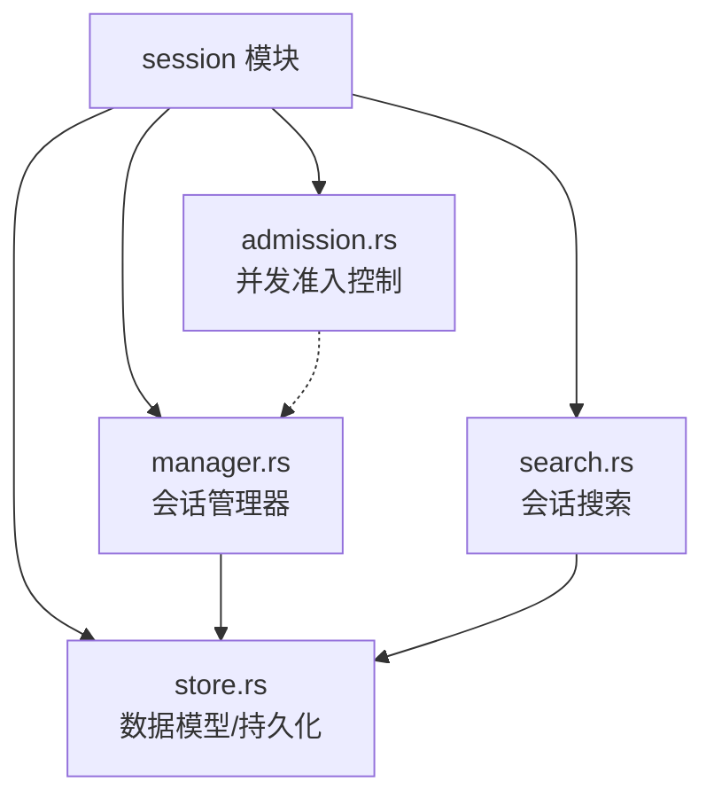
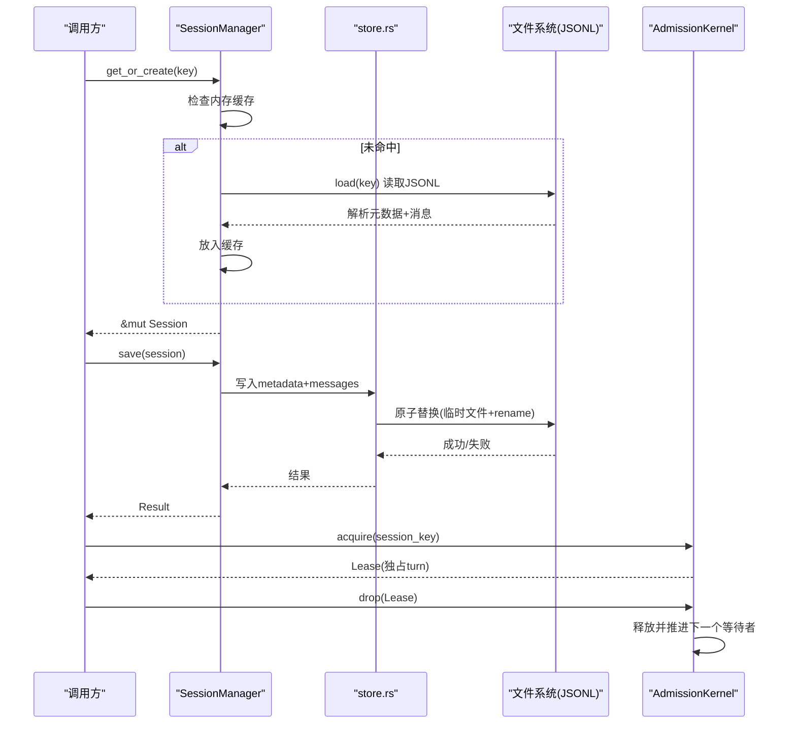
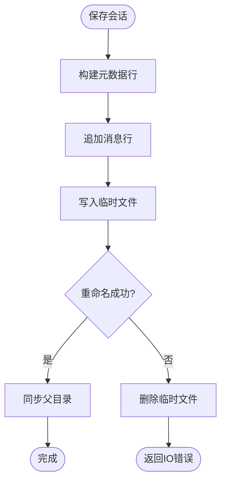
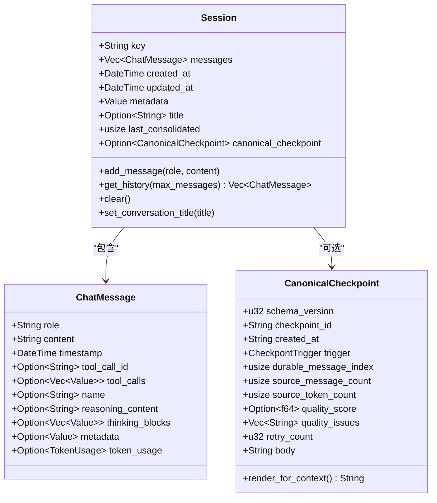
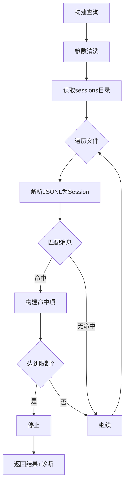
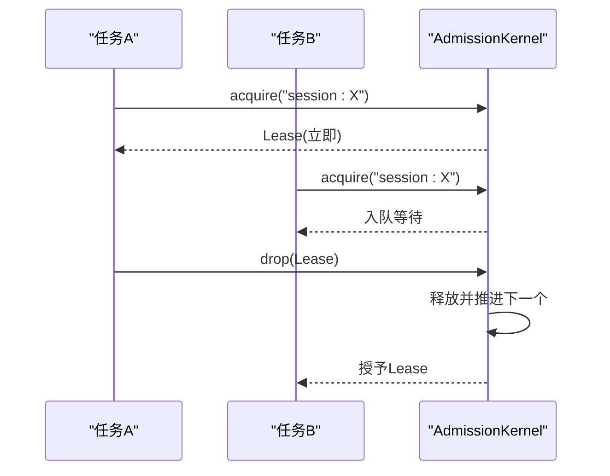
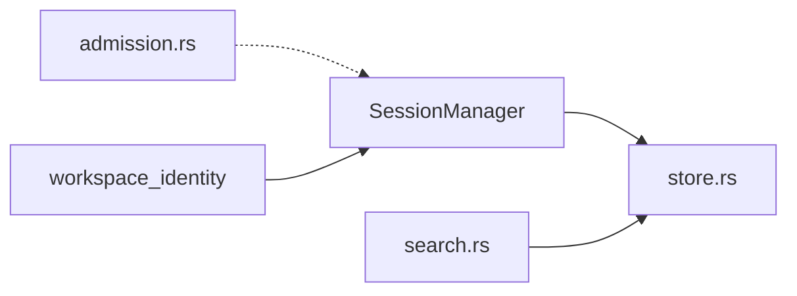

# 会话管理

<cite>
**本文引用的文件**
- [agent-diva-core/src/session/mod.rs](file://agent-diva-core/src/session/mod.rs)
- [agent-diva-core/src/session/manager.rs](file://agent-diva-core/src/session/manager.rs)
- [agent-diva-core/src/session/store.rs](file://agent-diva-core/src/session/store.rs)
- [agent-diva-core/src/session/search.rs](file://agent-diva-core/src/session/search.rs)
- [agent-diva-core/src/session/admission.rs](file://agent-diva-core/src/session/admission.rs)
- [agent-diva-core/src/lib.rs](file://agent-diva-core/src/lib.rs)
</cite>

## 目录
1. [简介](#简介)
2. [项目结构](#项目结构)
3. [核心组件](#核心组件)
4. [架构总览](#架构总览)
5. [详细组件分析](#详细组件分析)
6. [依赖关系分析](#依赖关系分析)
7. [性能考量](#性能考量)
8. [故障排查指南](#故障排查指南)
9. [结论](#结论)
10. [附录](#附录)

## 简介
本文件面向开发者，系统化说明 Agent Diva 的会话管理系统：会话生命周期、状态维护、历史消息存储与搜索、创建/更新/删除/恢复机制、会话与上下文的关系、隔离策略与并发控制，并提供操作示例、配置选项与性能优化建议。

## 项目结构
会话管理位于 agent-diva-core 的 session 模块中，包含以下关键文件：
- mod.rs：模块导出与对外类型重导出
- manager.rs：会话管理器（创建、加载、保存、删除、归档、列表、搜索）
- store.rs：会话数据结构（Session、ChatMessage、CanonicalCheckpoint）、持久化格式与历史对齐
- search.rs：会话内容全文检索（带限制与诊断）
- admission.rs：会话级串行化准入控制（FIFO 队列、超时、空闲回收）

图表来源
- [agent-diva-core/src/session/mod.rs:1-29](file://agent-diva-core/src/session/mod.rs#L1-L29)
- [agent-diva-core/src/session/manager.rs:1-120](file://agent-diva-core/src/session/manager.rs#L1-L120)
- [agent-diva-core/src/session/store.rs:186-208](file://agent-diva-core/src/session/store.rs#L186-L208)
- [agent-diva-core/src/session/search.rs:96-185](file://agent-diva-core/src/session/search.rs#L96-L185)
- [agent-diva-core/src/session/admission.rs:117-155](file://agent-diva-core/src/session/admission.rs#L117-L155)

章节来源
- [agent-diva-core/src/lib.rs:1-43](file://agent-diva-core/src/lib.rs#L1-L43)
- [agent-diva-core/src/session/mod.rs:1-29](file://agent-diva-core/src/session/mod.rs#L1-L29)

## 核心组件
- 会话管理器 SessionManager：负责会话的获取/创建、加载/保存、删除、归档重置、列表与搜索。使用 JSONL 行式存储，首行为元数据，后续为消息。
- 会话数据 Session/ChatMessage：会话键、消息序列、时间戳、标题、合并进度、规范检查点等。
- 规范检查点 CanonicalCheckpoint：可替换的有界上下文摘要，用于压缩历史并控制上下文大小。
- 搜索 Search：对 sessions 目录下所有 JSONL 进行文本匹配，返回命中片段与诊断信息，支持结果数、字节数、扫描文件数限制。
- 准入控制 AdmissionKernel：按会话键串行化执行 turn，提供 FIFO 排队、等待超时、空闲 TTL 回收、取消与关闭能力。

章节来源
- [agent-diva-core/src/session/manager.rs:20-120](file://agent-diva-core/src/session/manager.rs#L20-L120)
- [agent-diva-core/src/session/store.rs:186-208](file://agent-diva-core/src/session/store.rs#L186-L208)
- [agent-diva-core/src/session/store.rs:75-172](file://agent-diva-core/src/session/store.rs#L75-L172)
- [agent-diva-core/src/session/search.rs:17-94](file://agent-diva-core/src/session/search.rs#L17-L94)
- [agent-diva-core/src/session/admission.rs:18-40](file://agent-diva-core/src/session/admission.rs#L18-L40)

## 架构总览
会话系统由“内存缓存 + 磁盘 JSONL”组成，配合“规范检查点”实现上下文压缩；通过“准入内核”保证同一会话的串行执行；通过“搜索器”提供离线检索能力。

图表来源
- [agent-diva-core/src/session/manager.rs:43-56](file://agent-diva-core/src/session/manager.rs#L43-L56)
- [agent-diva-core/src/session/manager.rs:125-188](file://agent-diva-core/src/session/manager.rs#L125-L188)
- [agent-diva-core/src/session/manager.rs:190-250](file://agent-diva-core/src/session/manager.rs#L190-L250)
- [agent-diva-core/src/session/admission.rs:157-173](file://agent-diva-core/src/session/admission.rs#L157-L173)
- [agent-diva-core/src/session/admission.rs:387-439](file://agent-diva-core/src/session/admission.rs#L387-L439)

## 详细组件分析

### 会话管理器 SessionManager
职责
- 会话获取/创建：get_or_create、get_or_create_child（显式父子关系）
- 会话加载/保存：load、save（原子写入）、archive_and_reset（归档并清空内存）
- 会话列表/搜索：list_sessions、search
- 路径映射：session_path（安全文件名）

关键点
- 工作区隔离：基于 canonical_workspace_id 区分不同工作区的会话
- 原子写入：先写临时文件再 rename，失败清理临时文件，确保一致性
- 元数据持久化：conversation_title、title_generated、title_manually_set、pinned、workspace_id、channel、kind、root_session_key、parent_session_key、branch_label、legacy

图表来源
- [agent-diva-core/src/session/manager.rs:190-250](file://agent-diva-core/src/session/manager.rs#L190-L250)
- [agent-diva-core/src/session/manager.rs:324-378](file://agent-diva-core/src/session/manager.rs#L324-L378)

章节来源
- [agent-diva-core/src/session/manager.rs:20-120](file://agent-diva-core/src/session/manager.rs#L20-L120)
- [agent-diva-core/src/session/manager.rs:125-188](file://agent-diva-core/src/session/manager.rs#L125-L188)
- [agent-diva-core/src/session/manager.rs:190-250](file://agent-diva-core/src/session/manager.rs#L190-L250)
- [agent-diva-core/src/session/manager.rs:260-322](file://agent-diva-core/src/session/manager.rs#L260-L322)
- [agent-diva-core/src/session/manager.rs:380-596](file://agent-diva-core/src/session/manager.rs#L380-L596)

### 会话数据模型与历史对齐
- Session：包含 key、messages、created_at、updated_at、metadata、title、last_consolidated、canonical_checkpoint
- ChatMessage：role、content、timestamp、tool_call_id、tool_calls、name、reasoning_content、thinking_blocks、metadata、token_usage
- CanonicalCheckpoint：schema_version、checkpoint_id、created_at、trigger、durable_message_index、source_message_count、source_token_count、quality_score、quality_issues、retry_count、body（有界）

历史对齐
- align_chat_history：确保 tool 结果紧跟其对应的 assistant tool_calls，避免提供者拒绝不合法的历史窗口

图表来源
- [agent-diva-core/src/session/store.rs:186-208](file://agent-diva-core/src/session/store.rs#L186-L208)
- [agent-diva-core/src/session/store.rs:490-520](file://agent-diva-core/src/session/store.rs#L490-L520)
- [agent-diva-core/src/session/store.rs:75-172](file://agent-diva-core/src/session/store.rs#L75-L172)

章节来源
- [agent-diva-core/src/session/store.rs:186-208](file://agent-diva-core/src/session/store.rs#L186-L208)
- [agent-diva-core/src/session/store.rs:270-323](file://agent-diva-core/src/session/store.rs#L270-L323)
- [agent-diva-core/src/session/store.rs:417-488](file://agent-diva-core/src/session/store.rs#L417-L488)
- [agent-diva-core/src/session/store.rs:490-520](file://agent-diva-core/src/session/store.rs#L490-L520)

### 会话搜索
功能
- 扫描 sessions 目录下的 .jsonl 文件，解析为 Session，逐条匹配消息内容
- 返回命中片段、源 URI、哈希、消息索引、是否截断
- 支持限制：最大扫描文件数、最大结果数、最大片段字符数、最大响应字节数
- 记录诊断：跳过文件原因、是否达到限制

流程

图表来源
- [agent-diva-core/src/session/search.rs:96-185](file://agent-diva-core/src/session/search.rs#L96-L185)
- [agent-diva-core/src/session/search.rs:245-301](file://agent-diva-core/src/session/search.rs#L245-L301)

章节来源
- [agent-diva-core/src/session/search.rs:17-94](file://agent-diva-core/src/session/search.rs#L17-L94)
- [agent-diva-core/src/session/search.rs:96-185](file://agent-diva-core/src/session/search.rs#L96-L185)
- [agent-diva-core/src/session/search.rs:187-243](file://agent-diva-core/src/session/search.rs#L187-L243)
- [agent-diva-core/src/session/search.rs:245-301](file://agent-diva-core/src/session/search.rs#L245-L301)

### 并发控制与会话隔离
- 会话级串行化：AdmissionKernel 以会话键为单位，保证同一会话的 turn 串行执行
- FIFO 队列：等待队列按顺序推进，支持最大等待深度
- 超时与取消：等待超时、单任务取消、关闭不再接受新任务
- 空闲回收：长时间空闲的 slot 会被回收，释放内存

图表来源
- [agent-diva-core/src/session/admission.rs:157-173](file://agent-diva-core/src/session/admission.rs#L157-L173)
- [agent-diva-core/src/session/admission.rs:387-439](file://agent-diva-core/src/session/admission.rs#L387-L439)
- [agent-diva-core/src/session/admission.rs:553-623](file://agent-diva-core/src/session/admission.rs#L553-L623)

章节来源
- [agent-diva-core/src/session/admission.rs:18-40](file://agent-diva-core/src/session/admission.rs#L18-L40)
- [agent-diva-core/src/session/admission.rs:117-155](file://agent-diva-core/src/session/admission.rs#L117-L155)
- [agent-diva-core/src/session/admission.rs:157-173](file://agent-diva-core/src/session/admission.rs#L157-L173)
- [agent-diva-core/src/session/admission.rs:326-385](file://agent-diva-core/src/session/admission.rs#L326-L385)
- [agent-diva-core/src/session/admission.rs:387-439](file://agent-diva-core/src/session/admission.rs#L387-L439)
- [agent-diva-core/src/session/admission.rs:553-623](file://agent-diva-core/src/session/admission.rs#L553-L623)

### 会话与上下文的关系
- 历史窗口：Session::get_history 根据 last_consolidated 与 canonical_checkpoint.durable_message_index 确定“可见起点”，取最近 N 条可见消息，并进行工具调用对齐
- 规范检查点：作为可替换的“稳定上下文摘要”，在自动/手动/反应式触发时生成，限制 body 长度，减少上下文体积
- 上下文装配：历史与检查点作为固定段参与上下文组装，确保模型输入稳定且受控

章节来源
- [agent-diva-core/src/session/store.rs:293-315](file://agent-diva-core/src/session/store.rs#L293-L315)
- [agent-diva-core/src/session/store.rs:75-172](file://agent-diva-core/src/session/store.rs#L75-L172)

## 依赖关系分析
- SessionManager 依赖 store 的数据结构与持久化逻辑
- 搜索模块依赖 store 的解析能力，独立于运行时，仅扫描磁盘
- 准入内核与 SessionManager 解耦，通过外部调用者在业务层组合使用
- 工作区身份用于跨会话隔离（workspace_id）

图表来源
- [agent-diva-core/src/session/manager.rs:1-120](file://agent-diva-core/src/session/manager.rs#L1-L120)
- [agent-diva-core/src/session/search.rs:96-185](file://agent-diva-core/src/session/search.rs#L96-L185)
- [agent-diva-core/src/session/admission.rs:117-155](file://agent-diva-core/src/session/admission.rs#L117-L155)

章节来源
- [agent-diva-core/src/session/manager.rs:1-120](file://agent-diva-core/src/session/manager.rs#L1-L120)
- [agent-diva-core/src/session/search.rs:96-185](file://agent-diva-core/src/session/search.rs#L96-L185)
- [agent-diva-core/src/session/admission.rs:117-155](file://agent-diva-core/src/session/admission.rs#L117-L155)

## 性能考量
- 原子写入：临时文件 + rename + 父目录同步，避免部分写入导致损坏
- 历史对齐：避免无效 tool 结果进入上下文，减少重试与错误
- 规范检查点：限制 body 长度，降低上下文体积，提升稳定性
- 搜索限制：限制扫描文件数、结果数、响应字节数，防止大目录或大文件导致的资源占用
- 并发控制：FIFO 队列与等待超时避免无限堆积；空闲 TTL 回收减少内存占用

[本节为通用指导，无需具体文件引用]

## 故障排查指南
常见问题与定位
- 保存失败：检查 IO 错误与临时文件残留；确认父目录存在与权限
- 会话未加载：确认 JSONL 文件格式正确，首行为 metadata，后续为消息
- 搜索无结果：检查查询文本是否为空、是否达到限制、是否存在损坏文件
- 并发阻塞：检查队列深度、等待超时、是否被取消或关闭

定位依据
- 原子保存失败会保留旧文件，便于回滚对比
- 搜索返回 diagnostics 字段，包含跳过文件的原因
- 准入内核提供 snapshot 查看运行态与等待深度

章节来源
- [agent-diva-core/src/session/manager.rs:324-378](file://agent-diva-core/src/session/manager.rs#L324-L378)
- [agent-diva-core/src/session/search.rs:96-185](file://agent-diva-core/src/session/search.rs#L96-L185)
- [agent-diva-core/src/session/admission.rs:354-385](file://agent-diva-core/src/session/admission.rs#L354-L385)

## 结论
Agent Diva 的会话管理系统以 JSONL 为基础存储，结合规范检查点进行上下文压缩，通过会话级串行化保证一致性，并提供高效的离线搜索能力。其设计强调原子性、可恢复性与可扩展性，适合多通道、多工作区的复杂场景。

[本节为总结，无需具体文件引用]

## 附录

### 会话操作示例（概念步骤）
- 创建会话
  - 调用 get_or_create(key) 获取或创建会话
  - 设置标题、标记是否自动生成、是否手动设置、是否置顶
- 添加消息
  - 使用 add_message 或 add_full_message 追加消息
- 保存会话
  - 调用 save(session)，内部原子写入
- 删除会话
  - 调用 delete(key)，从缓存与磁盘移除
- 归档并重置
  - 调用 archive_and_reset(key)，将原文件重命名为归档名，内存中会话清空
- 恢复会话
  - 再次 get_or_create(key) 将创建新的空会话；如需恢复历史，需从归档文件重建
- 列出会话
  - 调用 list_sessions() 获取会话摘要（标题、最后消息、计数、标志位等）
- 搜索会话
  - 构造 SessionSearchQuery，调用 search(query) 获取命中与诊断

章节来源
- [agent-diva-core/src/session/manager.rs:43-120](file://agent-diva-core/src/session/manager.rs#L43-L120)
- [agent-diva-core/src/session/manager.rs:190-250](file://agent-diva-core/src/session/manager.rs#L190-L250)
- [agent-diva-core/src/session/manager.rs:260-322](file://agent-diva-core/src/session/manager.rs#L260-L322)
- [agent-diva-core/src/session/search.rs:17-94](file://agent-diva-core/src/session/search.rs#L17-L94)

### 配置选项
- 会话准入限制
  - max_queue_depth：最大等待深度
  - wait_timeout：等待超时
  - idle_ttl：空闲回收时间
- 搜索限制
  - max_files_scanned：最大扫描文件数
  - max_results：最大结果数
  - max_snippet_chars：最大片段字符数
  - max_total_bytes：最大响应字节数

章节来源
- [agent-diva-core/src/session/admission.rs:18-40](file://agent-diva-core/src/session/admission.rs#L18-L40)
- [agent-diva-core/src/session/search.rs:17-49](file://agent-diva-core/src/session/search.rs#L17-L49)

### 会话与上下文关系要点
- 历史窗口起点由 last_consolidated 与 canonical_checkpoint.durable_message_index 决定
- 工具调用必须成对出现，否则会被对齐函数剔除，避免提供者拒绝
- 规范检查点作为稳定上下文摘要，限制长度，提高稳定性

章节来源
- [agent-diva-core/src/session/store.rs:293-315](file://agent-diva-core/src/session/store.rs#L293-L315)
- [agent-diva-core/src/session/store.rs:417-488](file://agent-diva-core/src/session/store.rs#L417-L488)
- [agent-diva-core/src/session/store.rs:75-172](file://agent-diva-core/src/session/store.rs#L75-L172)