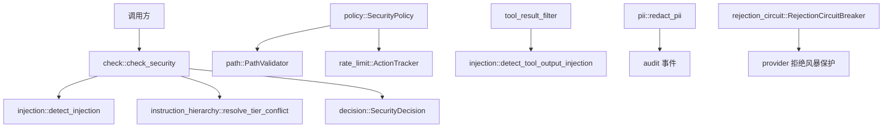
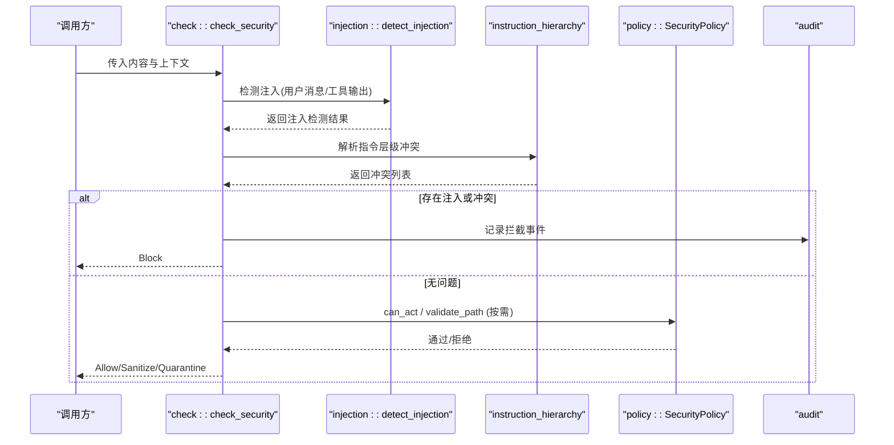
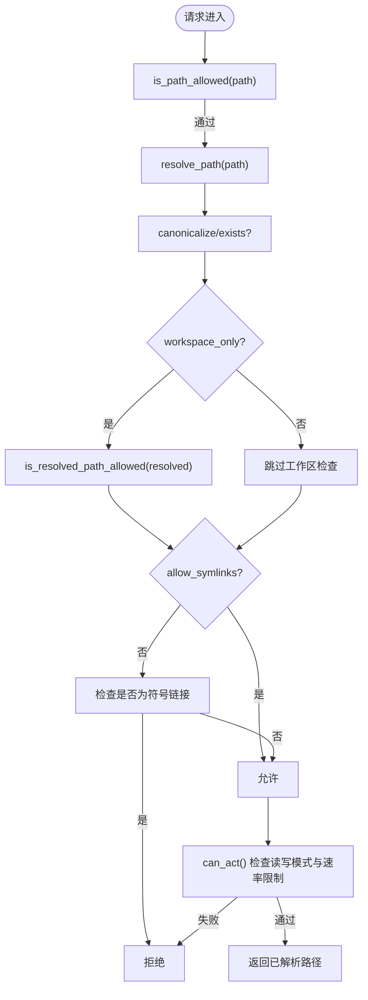
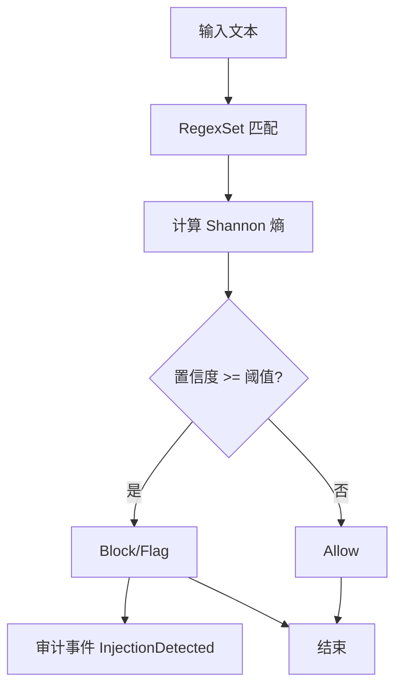
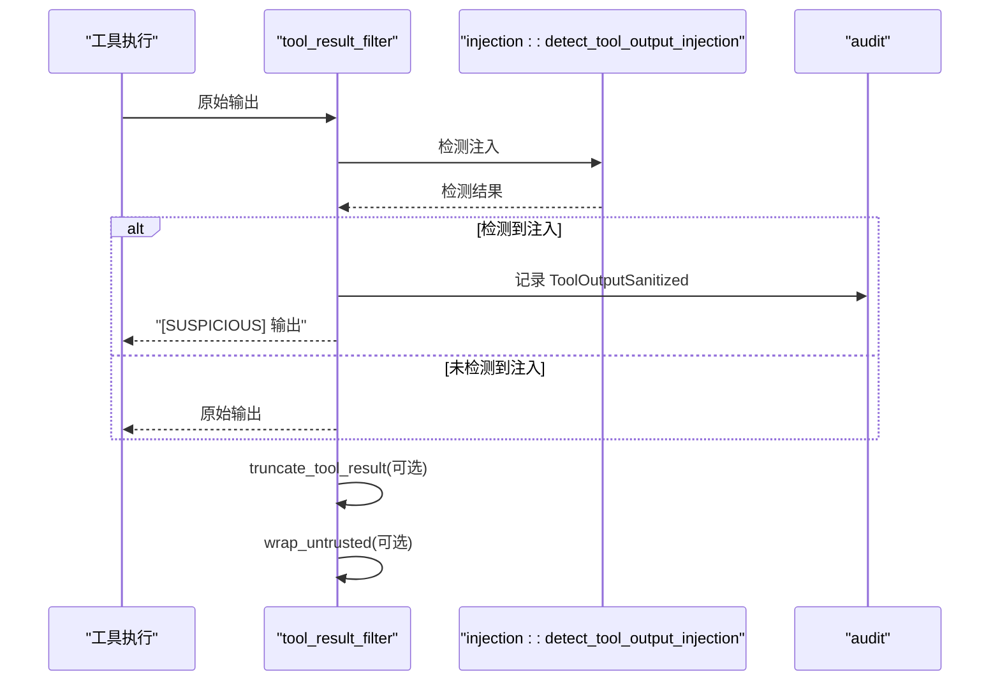
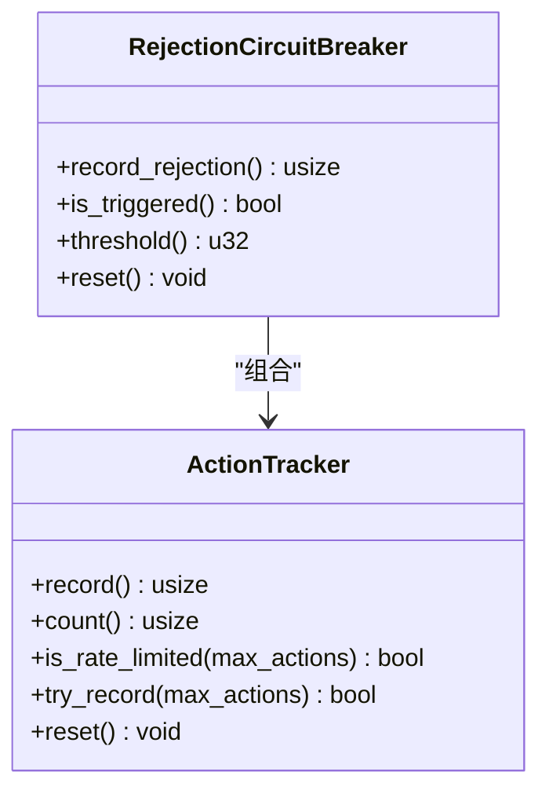
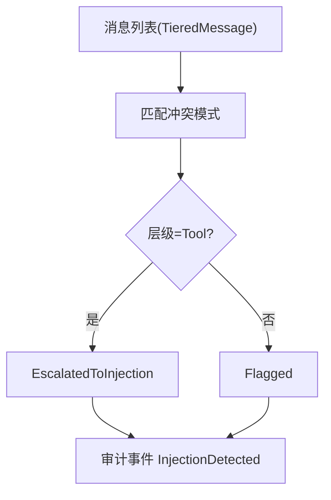
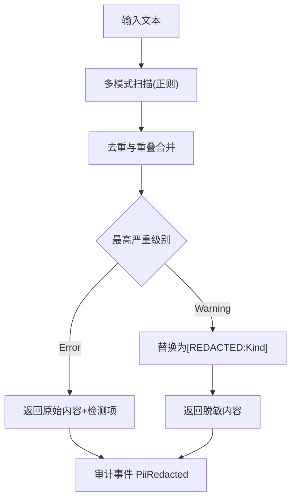
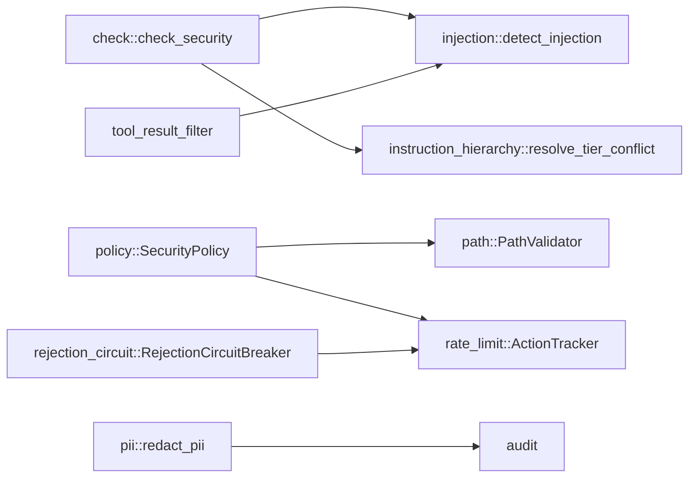

# 安全控制

<cite>
**本文引用的文件**
- [agent-diva-core/src/security/mod.rs](file://agent-diva-core/src/security/mod.rs)
- [agent-diva-core/src/security/policy.rs](file://agent-diva-core/src/security/policy.rs)
- [agent-diva-core/src/security/config.rs](file://agent-diva-core/src/security/config.rs)
- [agent-diva-core/src/security/injection.rs](file://agent-diva-core/src/security/injection.rs)
- [agent-diva-core/src/security/rate_limit.rs](file://agent-diva-core/src/security/rate_limit.rs)
- [agent-diva-core/src/security/tool_result_filter.rs](file://agent-diva-core/src/security/tool_result_filter.rs)
- [agent-diva-core/src/security/check.rs](file://agent-diva-core/src/security/check.rs)
- [agent-diva-core/src/security/decision.rs](file://agent-diva-core/src/security/decision.rs)
- [agent-diva-core/src/security/instruction_hierarchy.rs](file://agent-diva-core/src/security/instruction_hierarchy.rs)
- [agent-diva-core/src/security/path.rs](file://agent-diva-core/src/security/path.rs)
- [agent-diva-core/src/security/pii.rs](file://agent-diva-core/src/security/pii.rs)
- [agent-diva-core/src/security/rejection_circuit.rs](file://agent-diva-core/src/security/rejection_circuit.rs)
- [agent-diva-core/src/security/skill/mod.rs](file://agent-diva-core/src/security/skill/mod.rs)
</cite>

## 目录
1. [简介](#简介)
2. [项目结构](#项目结构)
3. [核心组件](#核心组件)
4. [架构总览](#架构总览)
5. [详细组件分析](#详细组件分析)
6. [依赖关系分析](#依赖关系分析)
7. [性能考量](#性能考量)
8. [故障排查指南](#故障排查指南)
9. [结论](#结论)
10. [附录：配置与最佳实践](#附录：配置与最佳实践)

## 简介
本文件面向开发者，系统化阐述 Agent Diva 的安全控制系统，重点覆盖：
- 安全策略引擎（统一策略、路径校验、速率限制、拒绝熔断）
- 注入攻击防护（静态模式匹配、熵值分析、指令层级冲突检测）
- 工具结果过滤机制（不可信包装、注入标记、长度截断）
- 权限控制与访问审计（PII 脱敏、决策事件审计）
- 威胁模型与安全事件处理流程
- 安全配置示例与安全最佳实践

## 项目结构
安全子系统集中在 core 模块的 security 子模块中，采用分层与职责分离的设计：
- 策略与配置：SecurityPolicy、SecurityConfig、SecurityLevel
- 输入侧防护：injection（注入检测）、instruction_hierarchy（指令层级冲突）
- 输出侧防护：tool_result_filter（工具结果过滤）
- 资源访问控制：path（路径校验）、rate_limit（滑动窗口限流）、rejection_circuit（拒绝熔断）
- 数据隐私：pii（PII 检测与脱敏）
- 统一入口与决策：check（统一检查）、decision（统一决策模型）
- 技能加载安全：skill（大小、内容、上下文预算、可信来源）

图表来源
- [agent-diva-core/src/security/check.rs:32-117](file://agent-diva-core/src/security/check.rs#L32-L117)
- [agent-diva-core/src/security/injection.rs:303-401](file://agent-diva-core/src/security/injection.rs#L303-L401)
- [agent-diva-core/src/security/instruction_hierarchy.rs:208-267](file://agent-diva-core/src/security/instruction_hierarchy.rs#L208-L267)
- [agent-diva-core/src/security/tool_result_filter.rs:68-97](file://agent-diva-core/src/security/tool_result_filter.rs#L68-L97)
- [agent-diva-core/src/security/policy.rs:173-201](file://agent-diva-core/src/security/policy.rs#L173-L201)
- [agent-diva-core/src/security/rate_limit.rs:32-63](file://agent-diva-core/src/security/rate_limit.rs#L32-L63)
- [agent-diva-core/src/security/rejection_circuit.rs:22-56](file://agent-diva-core/src/security/rejection_circuit.rs#L22-L56)

章节来源
- [agent-diva-core/src/security/mod.rs:1-69](file://agent-diva-core/src/security/mod.rs#L1-L69)

## 核心组件
- 安全策略引擎：SecurityPolicy 聚合配置、路径校验、速率限制、读写模式控制。提供 is_path_allowed、validate_path、can_act 等统一接口。
- 注入攻击防护：三层防御（正则集合、Shannon 熵、预留模型分类），按 InjectionKind 分类并给出置信度与动作建议。
- 工具结果过滤：对工具输出进行不可信包装、注入标记、长度截断，防止上下文耗尽与指令劫持。
- 速率限制：基于滑动窗口的 ActionTracker，支持自定义窗口与阈值。
- 拒绝熔断：针对 provider 拒绝风暴的滑动窗口断路器，避免死循环。
- 指令层级冲突：System/User/Tool 三级优先级，检测低层尝试覆盖高层指令的模式。
- PII 脱敏：多类别识别（邮箱、电话、身份证、银行卡、API Key、IP、护照等），支持警告/错误级别策略。
- 技能安全：ZIP 大小、SKILL.md 最小长度、always-inject 上下文预算、可信来源白名单。

章节来源
- [agent-diva-core/src/security/policy.rs:14-288](file://agent-diva-core/src/security/policy.rs#L14-L288)
- [agent-diva-core/src/security/injection.rs:38-445](file://agent-diva-core/src/security/injection.rs#L38-L445)
- [agent-diva-core/src/security/tool_result_filter.rs:35-132](file://agent-diva-core/src/security/tool_result_filter.rs#L35-L132)
- [agent-diva-core/src/security/rate_limit.rs:6-84](file://agent-diva-core/src/security/rate_limit.rs#L6-L84)
- [agent-diva-core/src/security/rejection_circuit.rs:14-56](file://agent-diva-core/src/security/rejection_circuit.rs#L14-L56)
- [agent-diva-core/src/security/instruction_hierarchy.rs:45-267](file://agent-diva-core/src/security/instruction_hierarchy.rs#L45-L267)
- [agent-diva-core/src/security/pii.rs:33-127](file://agent-diva-core/src/security/pii.rs#L33-L127)
- [agent-diva-core/src/security/skill/mod.rs:25-146](file://agent-diva-core/src/security/skill/mod.rs#L25-L146)

## 架构总览
Agent Diva 的安全架构以“统一入口 + 分层防护”为核心：
- 统一入口 check_security 串联注入检测与指令层级冲突检测，产出 SecurityDecision。
- 策略层 SecurityPolicy 负责路径与操作许可、速率限制、读写模式。
- 输出侧 tool_result_filter 在工具结果进入 LLM 上下文前进行清洗与限制。
- 审计贯穿全链路，所有关键决策与敏感数据处理均记录审计事件。

图表来源
- [agent-diva-core/src/security/check.rs:32-117](file://agent-diva-core/src/security/check.rs#L32-L117)
- [agent-diva-core/src/security/injection.rs:303-401](file://agent-diva-core/src/security/injection.rs#L303-L401)
- [agent-diva-core/src/security/instruction_hierarchy.rs:208-267](file://agent-diva-core/src/security/instruction_hierarchy.rs#L208-L267)
- [agent-diva-core/src/security/policy.rs:237-273](file://agent-diva-core/src/security/policy.rs#L237-L273)

## 详细组件分析

### 安全策略引擎（SecurityPolicy）
- 职责：整合配置、路径校验、速率限制、读写模式控制；提供统一的 can_act、validate_path、is_path_allowed 等方法。
- 关键点：
  - 多层路径校验：空字节、穿越、URL编码穿越、波浪号展开、绝对路径限制、禁止前缀、禁止扩展名。
  - 工作区隔离：可强制 workspace_only，校验解析后的路径是否在工作区内。
  - 符号链接限制：可按配置禁止符号链接。
  - 速率限制：基于 ActionTracker 的滑动窗口计数，超限时返回错误。
  - 文件大小限制：可配置最大文件大小。

图表来源
- [agent-diva-core/src/security/policy.rs:84-201](file://agent-diva-core/src/security/policy.rs#L84-L201)
- [agent-diva-core/src/security/policy.rs:237-273](file://agent-diva-core/src/security/policy.rs#L237-L273)
- [agent-diva-core/src/security/path.rs:8-149](file://agent-diva-core/src/security/path.rs#L8-L149)

章节来源
- [agent-diva-core/src/security/policy.rs:14-288](file://agent-diva-core/src/security/policy.rs#L14-L288)
- [agent-diva-core/src/security/path.rs:1-210](file://agent-diva-core/src/security/path.rs#L1-L210)

### 注入攻击防护（三层防御）
- 第一层：静态模式匹配（RegexSet），覆盖角色覆盖、工具输出注入、越狱等 26+ 模式族。
- 第二层：Shannon 熵分析，检测高熵编码内容（base64、ROT13、hex）。
- 第三层：预留模型分类接口（当前为 stub）。
- 输出：InjectionDetection（是否注入、类型、置信度、匹配模式），并提供 action(context) 决定 Allow/Flag/Block。

图表来源
- [agent-diva-core/src/security/injection.rs:119-248](file://agent-diva-core/src/security/injection.rs#L119-L248)
- [agent-diva-core/src/security/injection.rs:255-281](file://agent-diva-core/src/security/injection.rs#L255-L281)
- [agent-diva-core/src/security/injection.rs:303-401](file://agent-diva-core/src/security/injection.rs#L303-L401)

章节来源
- [agent-diva-core/src/security/injection.rs:1-445](file://agent-diva-core/src/security/injection.rs#L1-L445)

### 工具结果过滤机制
- 不可信包装：使用 <untrusted>...</untrusted> 包裹，提示 LLM 该内容来自外部不可信源。
- 注入标记：调用 detect_tool_output_injection，若检测到注入则添加 [SUSPICIOUS] 标记并记录审计事件。
- 长度截断：超过 MAX_TOOL_RESULT_CHARS 时截断并附加说明，防止上下文耗尽攻击。

图表来源
- [agent-diva-core/src/security/tool_result_filter.rs:68-97](file://agent-diva-core/src/security/tool_result_filter.rs#L68-L97)
- [agent-diva-core/src/security/tool_result_filter.rs:118-132](file://agent-diva-core/src/security/tool_result_filter.rs#L118-L132)
- [agent-diva-core/src/security/injection.rs:403-409](file://agent-diva-core/src/security/injection.rs#L403-L409)

章节来源
- [agent-diva-core/src/security/tool_result_filter.rs:1-313](file://agent-diva-core/src/security/tool_result_filter.rs#L1-L313)

### 速率限制与拒绝熔断
- 速率限制：ActionTracker 维护滑动窗口内的时间戳，支持 record/count/is_rate_limited/try_record。
- 拒绝熔断：RejectionCircuitBreaker 基于 ActionTracker 统计 provider 拒绝次数，达到阈值后阻止新迭代，直到窗口滑过。

图表来源
- [agent-diva-core/src/security/rate_limit.rs:6-84](file://agent-diva-core/src/security/rate_limit.rs#L6-L84)
- [agent-diva-core/src/security/rejection_circuit.rs:14-56](file://agent-diva-core/src/security/rejection_circuit.rs#L14-L56)

章节来源
- [agent-diva-core/src/security/rate_limit.rs:1-181](file://agent-diva-core/src/security/rate_limit.rs#L1-L181)
- [agent-diva-core/src/security/rejection_circuit.rs:1-130](file://agent-diva-core/src/security/rejection_circuit.rs#L1-L130)

### 指令层级冲突检测
- 层级定义：System（最高）、User（中）、Tool（最低）。
- 冲突检测：扫描 User/Tool 层级消息中试图覆盖 System 指令的模式（如忽略系统提示、覆盖指令等）。
- 处理策略：User 层级冲突标记，Tool 层级冲突升级为注入检测。

图表来源
- [agent-diva-core/src/security/instruction_hierarchy.rs:109-132](file://agent-diva-core/src/security/instruction_hierarchy.rs#L109-L132)
- [agent-diva-core/src/security/instruction_hierarchy.rs:208-267](file://agent-diva-core/src/security/instruction_hierarchy.rs#L208-L267)

章节来源
- [agent-diva-core/src/security/instruction_hierarchy.rs:1-594](file://agent-diva-core/src/security/instruction_hierarchy.rs#L1-L594)

### PII 检测与脱敏
- 支持类别：邮箱、电话、中国身份证、信用卡、API Key、IPv4/IPv6、护照、银行卡、自定义规则。
- 策略：Warning 级别替换为 [REDACTED:Kind]；Error 级别直接返回原始内容并交由上层拒绝。
- 防误报：版本字符串排除、内存记录 ID 保护、重叠区间合并保留最长匹配。

图表来源
- [agent-diva-core/src/security/pii.rs:298-627](file://agent-diva-core/src/security/pii.rs#L298-L627)

章节来源
- [agent-diva-core/src/security/pii.rs:1-800](file://agent-diva-core/src/security/pii.rs#L1-L800)

### 技能加载安全
- 约束：ZIP 大小上限、SKILL.md 最小字符数、always-inject 上下文预算（字符数与数量上限）。
- 信任来源：仅 Trusted 来源可自动注入；Review/Untrusted 需人工审批。

章节来源
- [agent-diva-core/src/security/skill/mod.rs:1-146](file://agent-diva-core/src/security/skill/mod.rs#L1-L146)

## 依赖关系分析
- check_security 依赖 injection 与 instruction_hierarchy，并产出 SecurityDecision。
- SecurityPolicy 依赖 PathValidator 与 ActionTracker，提供路径与速率限制能力。
- tool_result_filter 依赖 injection 的工具输出检测，并与 audit 集成。
- rejection_circuit 复用 ActionTracker，实现滑动窗口统计。
- pii 独立运行，通过审计事件上报。

图表来源
- [agent-diva-core/src/security/check.rs:32-117](file://agent-diva-core/src/security/check.rs#L32-L117)
- [agent-diva-core/src/security/policy.rs:14-288](file://agent-diva-core/src/security/policy.rs#L14-L288)
- [agent-diva-core/src/security/tool_result_filter.rs:68-97](file://agent-diva-core/src/security/tool_result_filter.rs#L68-L97)
- [agent-diva-core/src/security/rejection_circuit.rs:22-56](file://agent-diva-core/src/security/rejection_circuit.rs#L22-L56)
- [agent-diva-core/src/security/pii.rs:298-627](file://agent-diva-core/src/security/pii.rs#L298-L627)

章节来源
- [agent-diva-core/src/security/mod.rs:26-69](file://agent-diva-core/src/security/mod.rs#L26-L69)

## 性能考量
- 注入检测使用一次性编译的 RegexSet，减少重复编译开销；大输入下仍保持毫秒级响应。
- 工具结果过滤中的 ANSI 转义清理与字符过滤使用 OnceLock 缓存正则，降低 CPU 消耗。
- 速率限制与拒绝熔断基于滑动窗口与原子锁，保证并发安全；合理设置窗口与阈值以避免频繁抖动。
- PII 检测包含多个正则与校验（如 Luhn、身份证校验），默认关闭以减少开销；启用时需权衡误报与性能。

## 故障排查指南
- 路径被拒绝：检查 is_path_allowed 的多层校验（空字节、穿越、URL编码、波浪号、绝对路径、禁止前缀/扩展名）；确认 workspace_only 与 allow_symlinks 配置。
- 速率限制触发：查看 ActionTracker 的窗口与阈值；必要时调整 max_actions_per_hour。
- 注入检测误报/漏报：检查注入模式库与熵阈值；可通过审计事件定位匹配模式。
- 工具结果过长：确认 truncate_tool_result 的阈值；必要时调整 MAX_TOOL_RESULT_CHARS。
- Provider 拒绝风暴：关注 RejectionCircuitBreaker 的阈值与窗口；重置 breaker 恢复服务。
- PII 脱敏行为：确认 PiiConfig 的 enabled 与 severity；注意版本字符串与内存记录 ID 的保护逻辑。

章节来源
- [agent-diva-core/src/security/policy.rs:84-201](file://agent-diva-core/src/security/policy.rs#L84-L201)
- [agent-diva-core/src/security/rate_limit.rs:32-63](file://agent-diva-core/src/security/rate_limit.rs#L32-L63)
- [agent-diva-core/src/security/injection.rs:303-401](file://agent-diva-core/src/security/injection.rs#L303-L401)
- [agent-diva-core/src/security/tool_result_filter.rs:118-132](file://agent-diva-core/src/security/tool_result_filter.rs#L118-L132)
- [agent-diva-core/src/security/rejection_circuit.rs:22-56](file://agent-diva-core/src/security/rejection_circuit.rs#L22-L56)
- [agent-diva-core/src/security/pii.rs:298-627](file://agent-diva-core/src/security/pii.rs#L298-L627)

## 结论
Agent Diva 的安全控制系统通过统一策略引擎与多层防护机制，实现了从输入到输出的全面安全保障：
- 输入侧：注入检测与指令层级冲突检测有效抵御提示词注入与角色覆盖。
- 输出侧：工具结果过滤确保外部内容不被当作系统指令执行，同时防止上下文耗尽。
- 资源访问：路径校验与速率限制保障文件系统与 API 调用的安全边界。
- 数据隐私：PII 检测与脱敏降低敏感信息泄露风险。
- 稳定性：拒绝熔断避免 provider 拒绝风暴导致的服务退化。
结合审计事件与可配置策略，系统具备高度的可观测性与可运维性。

## 附录：配置与最佳实践

### 安全配置示例
- 基础策略：
  - 使用 SecurityLevel::Standard 作为默认，开启 workspace_only 与默认禁止扩展名。
  - 设置 max_actions_per_hour 为 100，限制高频操作。
- 严格模式：
  - 使用 SecurityLevel::Strict，降低 max_actions_per_hour 至 50。
  - 禁止符号链接，限制最大文件大小。
- 只读模式：
  - 使用 SecurityLevel::Paranoid，启用 read_only，禁止写操作。
- 注入防护：
  - 启用 injection_enabled，设置 injection_block_threshold 为 0.8。
- 工具超时与预算：
  - 设置 global_tool_timeout_secs 为 120；可选配置 token_budget_limit 与 per_task_token_budget。
- 拒绝熔断：
  - 设置 rejection_circuit_window_secs 为 60，rejection_circuit_threshold 为 50。

章节来源
- [agent-diva-core/src/security/config.rs:11-178](file://agent-diva-core/src/security/config.rs#L11-L178)
- [agent-diva-core/src/security/config.rs:181-325](file://agent-diva-core/src/security/config.rs#L181-L325)

### 威胁模型分析
- 提示词注入：通过静态模式匹配与熵值分析检测角色覆盖、越狱与工具输出注入。
- 路径穿越与逃逸：多层路径校验与工作区隔离防止访问系统敏感目录。
- 上下文耗尽：工具结果长度截断与不可信包装防止恶意长输出影响模型上下文。
- 权限滥用：速率限制与读写模式控制限制高危操作频率。
- 数据泄露：PII 检测与脱敏降低敏感信息外泄风险。
- 服务退化：拒绝熔断避免 provider 拒绝风暴导致的死循环。

### 安全最佳实践
- 始终启用 workspace_only 与禁止危险扩展名。
- 根据环境选择合适的安全等级，生产环境建议使用 Strict 或 Paranoid。
- 对工具输出一律进行过滤与包装，避免将外部内容视为系统指令。
- 定期审查注入模式库与 PII 规则，平衡误报与漏报。
- 监控审计事件，及时响应注入检测、PII 脱敏与策略决策。
- 合理配置速率限制与拒绝熔断，避免过度限制影响可用性。